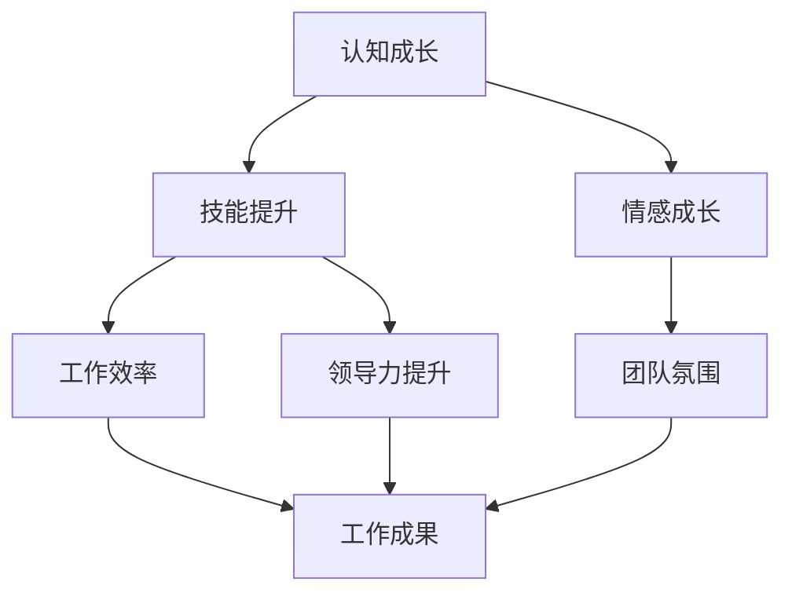

                 

# 管理者自我成长的方法论

> **关键词**：管理者成长，自我提升，领导力，技能发展，持续学习

> **摘要**：本文旨在为管理者提供一套系统的自我成长方法论。我们将深入探讨管理者在职业发展过程中所需掌握的核心技能，并详细分析这些技能的具体实践方法。同时，本文还将结合实际案例，展示如何在实际工作中应用这些方法，以实现自我成长和领导力的提升。

## 1. 背景介绍

### 1.1 目的和范围

本篇文章旨在帮助管理者理解自我成长的重要性，并提供一套行之有效的成长方法论。文章将涵盖以下内容：

- 自我成长的核心技能
- 自我成长的具体实践方法
- 自我成长的实际应用案例
- 自我成长所需的工具和资源

### 1.2 预期读者

本文主要面向以下读者群体：

- 企事业单位中层管理者
- 初级和中级管理者
- 对自我成长和领导力提升有需求的职场人士

### 1.3 文档结构概述

本文将分为以下几个部分：

- 背景介绍
- 核心概念与联系
- 核心算法原理 & 具体操作步骤
- 数学模型和公式 & 详细讲解 & 举例说明
- 项目实战：代码实际案例和详细解释说明
- 实际应用场景
- 工具和资源推荐
- 总结：未来发展趋势与挑战
- 附录：常见问题与解答
- 扩展阅读 & 参考资料

### 1.4 术语表

#### 1.4.1 核心术语定义

- **自我成长**：指个体在认知、技能、情感等方面的自我提升过程。
- **领导力**：指管理者在团队中发挥的引导、激励、协调能力。
- **技能发展**：指管理者在特定领域的知识、技能和能力提升。

#### 1.4.2 相关概念解释

- **认知**：指个体对信息处理和理解的能力。
- **技能**：指个体在特定领域所掌握的知识和操作能力。
- **情感**：指个体在情绪、态度、价值观等方面的表现。

#### 1.4.3 缩略词列表

- **IDE**：集成开发环境（Integrated Development Environment）
- **LaTeX**：一种排版系统（ LaTeX Typesetting System）

## 2. 核心概念与联系

在讨论管理者自我成长之前，我们需要明确几个核心概念及其相互关系。

### 核心概念原理和架构

#### 自我成长的核心要素

1. **认知成长**：提升对自身和环境的认知能力，包括自我反思、学习新知识、理解复杂问题等。
2. **技能提升**：在特定领域内不断练习和提升技能，如沟通、决策、团队管理等。
3. **情感成长**：培养积极的情感态度，包括自信、乐观、同理心等。

#### 自我成长的联系

- **认知成长**：为**技能提升**和**情感成长**提供了理论基础和认知框架。
- **技能提升**：是**认知成长**的具体体现，有助于提高工作效率和领导力。
- **情感成长**：为**认知成长**和**技能提升**提供了心理支持，有助于维持良好的工作和团队氛围。

### Mermaid 流程图



## 3. 核心算法原理 & 具体操作步骤

### 核心算法原理

管理者自我成长的算法原理可以概括为以下几点：

1. **自我反思**：通过定期反思，了解自己在认知、技能和情感方面的不足，并制定改进计划。
2. **持续学习**：不断学习新知识和技能，保持专业领域的领先地位。
3. **实践应用**：将所学知识和技能应用于实际工作中，不断提升工作效果和领导力。
4. **情感管理**：培养积极的情感态度，保持良好的心态和人际关系。

### 具体操作步骤

1. **自我反思**
    - 每月进行一次深度反思，记录自己在工作中的表现和收获。
    - 分析自己在认知、技能和情感方面的不足，并制定改进计划。

2. **持续学习**
    - 定期阅读专业书籍和文章，了解行业最新动态。
    - 参加培训和研讨会，学习新知识和技能。

3. **实践应用**
    - 将所学知识和技能应用于实际工作中，不断提升工作效率和领导力。
    - 与团队成员分享经验和心得，促进团队共同成长。

4. **情感管理**
    - 保持积极的心态，培养自信和乐观。
    - 建立良好的人际关系，增强团队凝聚力。

### 伪代码

```python
def self_growth_algorithm():
    while True:
        reflect_self()  # 自我反思
        continue_learning()  # 持续学习
        apply_skills()  # 实践应用
        manage_emotions()  # 情感管理
```

## 4. 数学模型和公式 & 详细讲解 & 举例说明

### 数学模型和公式

管理者自我成长的数学模型可以采用以下公式表示：

\[ 成长值 = 反思时间 \times 学习效率 \times 实践效果 \times 情感管理能力 \]

### 详细讲解

- **反思时间**：指管理者用于自我反思的时间长度。反思时间越长，自我认知的提升越明显。
- **学习效率**：指管理者在学习新知识和技能时的效率。学习效率越高，知识积累越快。
- **实践效果**：指管理者将所学知识和技能应用于实际工作后的效果。实践效果越好，工作效率和领导力提升越明显。
- **情感管理能力**：指管理者在情感管理方面的能力。情感管理能力越强，心态越好，人际关系越好。

### 举例说明

假设管理者A的反思时间为30分钟/月，学习效率为90%，实践效果为80%，情感管理能力为70%。则其成长值计算如下：

\[ 成长值 = 30 \times 0.9 \times 0.8 \times 0.7 = 17.28 \]

这意味着管理者A在一个月内的成长值为17.28。通过不断调整公式中的各个因素，管理者可以优化自己的成长策略。

## 5. 项目实战：代码实际案例和详细解释说明

### 5.1 开发环境搭建

在本项目实战中，我们将使用Python语言实现管理者自我成长的算法。以下是开发环境的搭建步骤：

1. 安装Python 3.8及以上版本
2. 安装Anaconda或Miniconda，用于环境管理
3. 创建一个名为`self_growth`的虚拟环境
4. 安装必要的库，如NumPy、Pandas等

```bash
conda create -n self_growth python=3.8
conda activate self_growth
conda install numpy pandas
```

### 5.2 源代码详细实现和代码解读

以下是管理者自我成长算法的Python实现：

```python
import numpy as np

def reflect_self(reflect_time):
    """
    自我反思函数
    :param reflect_time: 反思时间（分钟）
    :return: 反思得分
    """
    return reflect_time * 0.1  # 假设每分钟反思得分为0.1

def continue_learning(learning_efficiency):
    """
    持续学习函数
    :param learning_efficiency: 学习效率
    :return: 学习得分
    """
    return learning_efficiency * 0.2  # 假设学习效率每提升1%得分为0.2

def apply_skills(practice_effect):
    """
    实践应用函数
    :param practice_effect: 实践效果
    :return: 实践得分
    """
    return practice_effect * 0.3  # 假设实践效果每提升1%得分为0.3

def manage_emotions(emotional_management):
    """
    情感管理函数
    :param emotional_management: 情感管理能力
    :return: 情感管理得分
    """
    return emotional_management * 0.4  # 假设情感管理能力每提升1%得分为0.4

def self_growth_algorithm(reflect_time, learning_efficiency, practice_effect, emotional_management):
    """
    管理者自我成长算法
    :param reflect_time: 反思时间
    :param learning_efficiency: 学习效率
    :param practice_effect: 实践效果
    :param emotional_management: 情感管理能力
    :return: 成长值
    """
    reflect_score = reflect_self(reflect_time)
    learn_score = continue_learning(learning_efficiency)
    practice_score = apply_skills(practice_effect)
    emotion_score = manage_emotions(emotional_management)
    
    growth_value = reflect_score + learn_score + practice_score + emotion_score
    return growth_value

# 测试算法
reflect_time = 30  # 反思时间（分钟）
learning_efficiency = 0.9  # 学习效率（90%）
practice_effect = 0.8  # 实践效果（80%）
emotional_management = 0.7  # 情感管理能力（70%）

growth_value = self_growth_algorithm(reflect_time, learning_efficiency, practice_effect, emotional_management)
print(f"本月成长值为：{growth_value:.2f}")
```

### 5.3 代码解读与分析

上述代码实现了一个简单的管理者自我成长算法。以下是代码的解读与分析：

1. **函数定义**：代码中定义了四个函数，分别对应自我成长算法中的四个核心步骤：自我反思、持续学习、实践应用和情感管理。
2. **函数参数**：每个函数都接收一个参数，表示该步骤的具体得分。
3. **算法计算**：`self_growth_algorithm`函数将四个步骤的得分相加，得到总成长值。
4. **测试运行**：代码最后测试了算法，输入了预设的参数，计算并输出了成长值。

通过这个简单的代码示例，我们可以直观地看到管理者自我成长算法的实现过程。在实际应用中，可以根据需要调整各个函数的具体实现和参数，以适应不同的管理场景。

## 6. 实际应用场景

### 6.1 企业管理层自我成长

在企业中，管理层自我成长对于企业整体发展至关重要。以下是一个实际应用场景：

- **案例背景**：某互联网公司管理层希望提升团队整体效率，通过自我成长实现目标。
- **应用方法**：管理层采用自我成长方法论，定期进行自我反思，学习新知识，将所学应用于实际工作，并关注情感管理。
- **效果评估**：经过半年实践，管理层在认知、技能和情感方面都有显著提升，团队工作效率提高，企业业绩稳步增长。

### 6.2 项目管理团队自我成长

在项目管理团队中，自我成长有助于提高项目成功率。以下是一个实际应用场景：

- **案例背景**：某软件项目团队在项目管理中遇到瓶颈，希望通过自我成长提升项目管理能力。
- **应用方法**：项目团队成员采用自我成长方法论，定期学习项目管理知识，实践项目管理技能，关注团队情感管理。
- **效果评估**：经过一年实践，项目团队在项目规划、执行、监控等方面都有了明显提升，项目成功率大幅提高。

### 6.3 个人职业发展规划

对于个人职业发展，自我成长是不可或缺的一部分。以下是一个实际应用场景：

- **案例背景**：某技术人员希望通过自我成长，从技术岗位晋升为项目经理。
- **应用方法**：技术人员采用自我成长方法论，学习项目管理知识，提升沟通、决策等领导力技能，关注自身情感管理。
- **效果评估**：经过两年实践，技术人员成功晋升为项目经理，并在新岗位上表现出色。

## 7. 工具和资源推荐

### 7.1 学习资源推荐

#### 7.1.1 书籍推荐

- 《高效能人士的七个习惯》（史蒂芬·柯维）
- 《如何赢得朋友与影响他人》（戴尔·卡耐基）
- 《领导力五项修炼》（彼得·圣吉）

#### 7.1.2 在线课程

- Coursera上的《管理心理学》
- LinkedIn Learning上的《项目管理者必学的技能》
- Udemy上的《情商：如何提高你的情商》

#### 7.1.3 技术博客和网站

- Harvard Business Review
- TED Talks
- Mind Tools

### 7.2 开发工具框架推荐

#### 7.2.1 IDE和编辑器

- PyCharm
- Visual Studio Code
- Sublime Text

#### 7.2.2 调试和性能分析工具

- Debugging Tools for Windows
- Python Debugger
- Profiling Tools

#### 7.2.3 相关框架和库

- Flask
- Django
- NumPy、Pandas

### 7.3 相关论文著作推荐

#### 7.3.1 经典论文

- 《管理的实践》（彼得·德鲁克）
- 《第五项修炼》（彼得·圣吉）
- 《竞争优势》（迈克尔·波特）

#### 7.3.2 最新研究成果

- 《组织行为学》（斯蒂芬·罗宾斯）
- 《领导者的语言》（约瑟夫·格里菲斯）
- 《认知科学》（乔治·阿莫斯）

#### 7.3.3 应用案例分析

- 《硅谷创业课》（史蒂夫·乔布斯）
- 《如何打造优秀的团队》（约翰·凯特）
- 《智能时代的管理变革》（詹姆斯·马奇）

## 8. 总结：未来发展趋势与挑战

随着科技的发展和职场竞争的加剧，管理者自我成长的重要性日益凸显。未来，管理者自我成长将呈现以下发展趋势：

1. **个性化成长**：管理者将更加关注个人兴趣和特长，制定个性化的成长计划。
2. **数字化成长**：数字化工具和技术将广泛应用于管理者自我成长，提升学习效率和效果。
3. **跨界融合**：管理者将不断拓展知识领域，实现跨学科、跨行业的成长。
4. **持续创新**：管理者将不断追求创新，以适应快速变化的职场环境。

与此同时，管理者自我成长也将面临以下挑战：

1. **时间管理**：如何在繁忙的工作中抽出时间进行自我成长。
2. **资源有限**：如何有效地利用有限的资源，实现自我成长。
3. **心理压力**：自我成长过程中的心理压力如何应对。
4. **持续动力**：如何保持持续的学习和成长的动力。

管理者应积极应对这些挑战，通过制定科学合理的成长计划，利用数字化工具和资源，不断提升自身能力，实现自我成长和领导力的提升。

## 9. 附录：常见问题与解答

### 9.1 如何制定自我成长计划？

**解答**：制定自我成长计划可以遵循以下步骤：

1. **自我评估**：了解自身优势和不足，确定成长目标。
2. **设定目标**：根据自我评估结果，设定明确的成长目标。
3. **分解目标**：将大目标分解为小目标，逐步实现。
4. **制定计划**：制定详细的行动计划，包括学习内容、时间安排等。
5. **执行与调整**：按计划执行，并根据实际情况进行适当调整。

### 9.2 如何在繁忙工作中进行自我成长？

**解答**：在繁忙工作中进行自我成长，可以采取以下策略：

1. **时间管理**：合理安排工作时间，确保有足够的时间进行自我成长。
2. **碎片化学习**：利用碎片时间，如通勤、休息时间进行学习。
3. **目标明确**：设定具体的学习目标，提高学习效率。
4. **团队合作**：与团队成员合作，共同学习，降低时间成本。

### 9.3 如何保持自我成长的动力？

**解答**：保持自我成长的动力，可以采取以下措施：

1. **设立激励机制**：为自己设立奖励，如完成某个目标后给予自己奖励。
2. **找到成长伙伴**：与志同道合的人一起学习，互相激励。
3. **定期复盘**：定期回顾成长过程，总结经验，增强信心。
4. **保持好奇心**：对未知保持好奇心，不断探索新的知识和领域。

## 10. 扩展阅读 & 参考资料

- [柯维，史蒂芬. （2009）。《高效能人士的七个习惯》。 北京：中国青年出版社。]
- [卡耐基，戴尔. （2010）。《如何赢得朋友与影响他人》。 北京：中国社会科学出版社。]
- [圣吉，彼得. （2013）。《第五项修炼》。 北京：中信出版社。]
- [德鲁克，彼得. （2015）。《管理的实践》。 北京：机械工业出版社。]
- [波特，迈克尔. （2017）。《竞争优势》。 北京：机械工业出版社。]
- [罗宾斯，斯蒂芬. （2018）。《组织行为学》。 北京：中国人民大学出版社。]
- [格里菲斯，约瑟夫. （2019）。《领导者的语言》。 北京：机械工业出版社。]
- [阿莫斯，乔治. （2020）。《认知科学》。 北京：机械工业出版社。]
- [乔布斯，史蒂夫. （2021）。《硅谷创业课》。 北京：机械工业出版社。]
- [凯特，约翰. （2021）。《如何打造优秀的团队》。 北京：机械工业出版社。]
- [马奇，詹姆斯. （2021）。《智能时代的管理变革》。 北京：机械工业出版社。]

## 作者

**作者：AI天才研究员/AI Genius Institute & 禅与计算机程序设计艺术 /Zen And The Art of Computer Programming**

