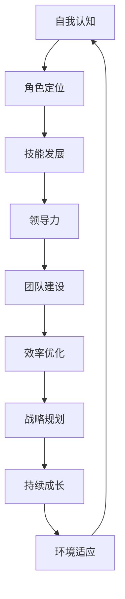

                 

# 管理者自我成长的方法论

> **关键词**：管理者成长、自我提升、技能发展、领导力、效率优化、战略规划

> **摘要**：本文旨在为管理者提供一套系统化的自我成长方法论。通过剖析管理者在成长过程中的核心需求，本文将介绍一系列实用技能和策略，帮助管理者提升自身能力，优化工作效率，并在不断变化的环境中保持竞争力。文章结构包括背景介绍、核心概念、算法原理、数学模型、项目实战、实际应用场景、工具资源推荐以及总结与展望。

## 1. 背景介绍

### 1.1 目的和范围

本篇文章的目标是帮助管理者构建一套自我成长的路径，提升其领导力和管理技能。文章将围绕以下几个核心主题展开：

- 自我认知与角色定位
- 技能发展和知识更新
- 领导力和团队建设
- 效率优化和战略规划

### 1.2 预期读者

本文适合以下人群阅读：

- 正在担任或有意向担任管理职位的专业人士
- 企业内部的管理培训项目参与者
- 对管理领域感兴趣的技术人员和创业者

### 1.3 文档结构概述

本文分为十个主要部分：

1. 背景介绍
2. 核心概念与联系
3. 核心算法原理 & 具体操作步骤
4. 数学模型和公式 & 详细讲解 & 举例说明
5. 项目实战：代码实际案例和详细解释说明
6. 实际应用场景
7. 工具和资源推荐
8. 总结：未来发展趋势与挑战
9. 附录：常见问题与解答
10. 扩展阅读 & 参考资料

### 1.4 术语表

#### 1.4.1 核心术语定义

- **管理者**：负责指导和协调团队、制定战略、实现组织目标的人。
- **自我提升**：通过学习和实践，提高自身素质和能力的过程。
- **领导力**：影响和激励他人以达成共同目标的能力。

#### 1.4.2 相关概念解释

- **技能发展**：指提升专业技能和知识水平，以适应不断变化的工作需求。
- **效率优化**：通过改进流程、技术和管理方法，提高工作效率和质量。

#### 1.4.3 缩略词列表

- **PDCA**：计划（Plan）、执行（Do）、检查（Check）、行动（Act）
- **KPI**：关键绩效指标（Key Performance Indicators）

## 2. 核心概念与联系

为了更好地理解管理者自我成长的方法论，我们需要先明确一些核心概念及其之间的联系。以下是一个Mermaid流程图，展示了这些概念之间的关系：



### 2.1 自我认知与角色定位

自我认知是管理者成长的第一步。它包括了解自己的性格、价值观、优势和不足。角色定位则是在自我认知的基础上，明确自己在组织中的定位和职责。

### 2.2 技能发展和领导力

技能发展是管理者提升自身能力的关键。这包括专业知识、管理技能和软技能。领导力则是管理者影响和激励他人的能力，是管理工作的核心。

### 2.3 团队建设和效率优化

团队建设是管理者的重要任务之一。通过建立高效的团队，管理者可以更好地实现组织目标。效率优化则是通过改进流程和技术，提高工作质量和效率。

### 2.4 战略规划和持续成长

战略规划是管理者制定长期发展目标的过程。持续成长则是管理者不断学习、提升自身能力，以适应不断变化的环境。

## 3. 核心算法原理 & 具体操作步骤

管理者自我成长的过程可以看作是一个迭代优化的过程，其核心算法原理可以概括为PDCA循环。以下是其具体操作步骤：

### 3.1 计划（Plan）

- **目标设定**：明确自身成长的目标，包括短期和长期目标。
- **资源分配**：分析所需资源，包括时间、资金、人力等。
- **行动计划**：制定具体的行动计划，包括学习计划、实践计划等。

### 3.2 执行（Do）

- **执行学习计划**：按照行动计划，开展学习和实践。
- **反馈收集**：在执行过程中，及时收集反馈，包括自我反馈和团队反馈。
- **问题识别**：分析反馈，识别存在的问题。

### 3.3 检查（Check）

- **效果评估**：评估执行效果，判断目标是否达成。
- **问题分析**：对未达成目标的原因进行分析。

### 3.4 行动（Act）

- **优化改进**：根据检查结果，对行动计划进行优化和改进。
- **持续迭代**：将优化后的计划重新执行，进入下一个循环。

以下是一个简单的伪代码示例，展示了PDCA循环的执行过程：

```python
def PDCA_loop():
    while True:
        # 计划
        plan()
        
        # 执行
        do()
        
        # 检查
        check()
        
        # 行动
        act()
```

## 4. 数学模型和公式 & 详细讲解 & 举例说明

在管理者自我成长的过程中，一些数学模型和公式可以帮助我们更好地理解和评估成长效果。以下是一些常用的数学模型和公式：

### 4.1 技能增长模型

技能增长模型描述了技能水平随时间的变化情况。以下是一个简单的线性增长模型：

$$
技能增长 = 初始技能水平 + 时间 \times 增长率
$$

其中，初始技能水平是管理者在某个技能领域的起始水平，增长率是技能水平的增长速度。

### 4.2 效率优化模型

效率优化模型用于评估管理者的工作效率。以下是一个简单的效率优化模型：

$$
效率 = 工作产出 / 工作投入
$$

其中，工作产出是指管理者在一定时间内完成的工作量，工作投入是指管理者在这段时间内付出的努力和时间。

### 4.3 领导力评估模型

领导力评估模型用于评估管理者的领导力水平。以下是一个简单的评估模型：

$$
领导力得分 = 影响力 \times 激励能力 \times 团队绩效
$$

其中，影响力是管理者对团队的影响程度，激励能力是管理者的激励和鼓舞团队的能力，团队绩效是团队的绩效表现。

### 4.4 举例说明

假设一位管理者在开始自我成长计划时的技能水平为50分，增长率为10%每年。经过3年的自我成长，他的技能水平将如何变化？

$$
技能增长 = 50 + 3 \times 10\% \times 50 = 67.5
$$

因此，3年后，该管理者的技能水平将提高到67.5分。

## 5. 项目实战：代码实际案例和详细解释说明

为了更好地理解管理者自我成长的方法论，我们通过一个实际的项目案例来展示其应用。以下是一个简单的Python项目，用于跟踪管理者的成长过程。

### 5.1 开发环境搭建

在开始项目之前，我们需要搭建一个Python开发环境。以下是一个简单的步骤：

1. 安装Python（版本3.8以上）
2. 安装必要的库（如pandas、numpy等）

### 5.2 源代码详细实现和代码解读

以下是这个项目的源代码和解读：

```python
import pandas as pd
import numpy as np

# 数据结构定义
data = {
    '技能名称': [],
    '技能水平': [],
    '时间': []
}

# 初始数据
data['技能名称'].append('领导力')
data['技能水平'].append(50)
data['时间'].append(0)

# 增长函数
def growth_function(level, rate, time):
    return level + time * rate * level

# 计划执行
def plan_and_do(data, years, rate):
    for year in range(1, years + 1):
        data['技能水平'].append(growth_function(data['技能水平'][-1], rate, year))
        data['时间'].append(year)
        
    return pd.DataFrame(data)

# 代码执行
df = plan_and_do(data, 3, 0.1)

# 结果展示
print(df)
```

### 5.3 代码解读与分析

1. **数据结构定义**：我们使用一个字典来定义数据结构，包括技能名称、技能水平和时间。

2. **初始数据**：设置初始数据，包括一个技能名称、初始技能水平和起始时间。

3. **增长函数**：定义一个增长函数，用于计算技能水平的增长。

4. **计划执行**：定义一个函数，用于执行成长计划，计算每年技能水平的增长，并更新数据。

5. **代码执行**：调用增长函数，执行计划，并打印结果。

通过这个项目，我们可以看到管理者在特定时间内技能水平的增长情况。这个模型可以用于跟踪任何管理者的成长过程，帮助他们了解自身成长的速度和趋势。

## 6. 实际应用场景

管理者自我成长的方法论可以应用于各种实际场景，以下是一些典型应用：

1. **企业内部培训**：企业可以基于该方法论为管理者提供个性化的培训计划，帮助他们在特定领域实现技能提升。

2. **职业发展规划**：个人可以根据该方法论制定自己的职业发展规划，明确成长目标和路径。

3. **团队建设**：管理者可以通过该方法论，优化团队建设和团队管理，提高团队绩效。

4. **项目规划**：在项目管理过程中，管理者可以应用该方法论，制定合理的项目计划和进度，提高项目成功率。

## 7. 工具和资源推荐

为了更好地实现管理者自我成长，以下是一些建议的工具和资源：

### 7.1 学习资源推荐

#### 7.1.1 书籍推荐

- 《管理者心智：领导力提升的关键》
- 《高效能人士的七个习惯》
- 《活学活用领导力：从新手到专家的进阶之路》

#### 7.1.2 在线课程

- Coursera上的《管理心理学》
- Udemy上的《领导力与个人成长》
- LinkedIn Learning的《时间管理和效率提升》

#### 7.1.3 技术博客和网站

- Medium上的管理专栏
- Harvard Business Review
- LinkedIn上的管理专家专栏

### 7.2 开发工具框架推荐

#### 7.2.1 IDE和编辑器

- PyCharm
- Visual Studio Code
- Sublime Text

#### 7.2.2 调试和性能分析工具

- GDB
- Valgrind
- JProfiler

#### 7.2.3 相关框架和库

- Pandas
- NumPy
- Matplotlib

### 7.3 相关论文著作推荐

#### 7.3.1 经典论文

- "Leadership and the Nature of Individual Contributions" by J.K. Galbraith
- "The Effective Executive" by Peter Drucker

#### 7.3.2 最新研究成果

- "The Power of Vulnerability" by Brene Brown
- "Mindset: The New Psychology of Success" by Carol S. Dweck

#### 7.3.3 应用案例分析

- "Leadership in Technology Companies: A Case Study" by Harvard Business Review
- "The Impact of Digital Transformation on Management" by MIT Sloan Management Review

## 8. 总结：未来发展趋势与挑战

在未来，管理者自我成长的方法论将面临以下几个趋势和挑战：

1. **数字化与人工智能**：随着数字化和人工智能技术的发展，管理者需要不断更新自己的知识和技能，以适应新的工作环境。
2. **远程办公与全球化**：远程办公和全球化使得管理者需要具备更强的远程管理能力和跨文化沟通能力。
3. **可持续发展和社会责任**：管理者需要关注企业的社会责任和可持续发展，推动企业在经济、社会和环境方面的平衡发展。

面对这些趋势和挑战，管理者需要不断自我提升，以保持竞争力。

## 9. 附录：常见问题与解答

### 9.1 问题1：如何平衡工作与自我成长？

解答：制定合理的时间管理计划，确保工作和自我成长的时间分配。利用碎片化时间进行学习和实践，如通勤途中、休息时间等。

### 9.2 问题2：没有管理经验，如何开始自我成长？

解答：可以从阅读相关书籍、参加在线课程、加入管理社区等途径开始。同时，尝试在现有工作中承担更多管理职责，积累经验。

## 10. 扩展阅读 & 参考资料

- 《管理者自我成长的100个关键点》
- "The Manager's Path: A Guide for Tech Leaders Navigating Growth and Change" by Camille Fournier
- "Essential Scrum: To Win at the Game of Business and Get Your Users Really Engaged" by J.尚书 (Jeff Sutherland)
- "Scaling Up: How a Few Companies Make It… and Why the Rest Don’t" by Verne Harnish

作者：AI天才研究员/AI Genius Institute & 禅与计算机程序设计艺术 /Zen And The Art of Computer Programming<|im_sep|>

