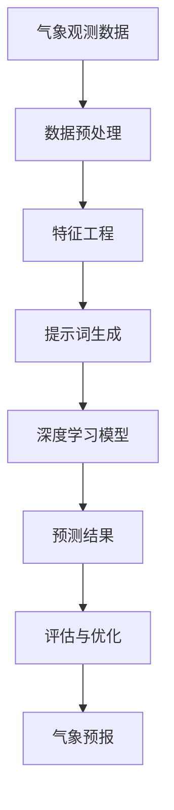

                 

# 精准气象预报：提示词辅助的新一代预测模型

> **关键词：** 气象预报、提示词、预测模型、人工智能、机器学习、深度学习

> **摘要：** 本文旨在探讨如何利用提示词辅助构建新一代的精准气象预报模型。文章首先介绍了气象预报的背景和挑战，随后详细阐述了提示词的概念及其在预测模型中的应用。通过核心概念和算法原理的讲解，本文将带领读者深入理解提示词辅助预测模型的构建过程。最后，通过实际应用场景、工具推荐和未来发展趋势的探讨，为读者展示了一幅气象预报技术的美好蓝图。

## 1. 背景介绍

### 1.1 目的和范围

气象预报作为一门涉及众多学科领域的复杂技术，其精准性对公众生活、农业、交通、能源等领域具有重大影响。然而，传统的气象预报方法在应对复杂多变的天气现象时，往往显得力不从心。本文旨在探讨如何通过引入提示词，构建新一代的精准气象预报模型，从而提高预报的准确性和实时性。

本文将涵盖以下内容：

1. 气象预报的背景和挑战
2. 提示词的概念及其在预测模型中的应用
3. 核心概念和算法原理的讲解
4. 实际应用场景的探讨
5. 工具和资源的推荐
6. 未来发展趋势与挑战

### 1.2 预期读者

本文适合以下读者群体：

1. 气象预报领域的专业研究人员和从业者
2. 人工智能和机器学习领域的开发者和技术爱好者
3. 对气象预报和人工智能应用感兴趣的一般读者

### 1.3 文档结构概述

本文按照以下结构进行组织：

1. 背景介绍
2. 核心概念与联系
3. 核心算法原理 & 具体操作步骤
4. 数学模型和公式 & 详细讲解 & 举例说明
5. 项目实战：代码实际案例和详细解释说明
6. 实际应用场景
7. 工具和资源推荐
8. 总结：未来发展趋势与挑战
9. 附录：常见问题与解答
10. 扩展阅读 & 参考资料

### 1.4 术语表

#### 1.4.1 核心术语定义

- **气象预报：** 对天气现象的发生和发展进行预测的技术。
- **提示词：** 在机器学习和深度学习领域，用于引导模型学习的重要信息。
- **预测模型：** 用于对未知数据或事件进行预测的数学模型。

#### 1.4.2 相关概念解释

- **气象观测数据：** 用于描述天气现象的各种物理量，如气温、湿度、气压等。
- **深度学习：** 一种基于多层神经网络进行数据分析和预测的技术。
- **机器学习：** 一种通过数据训练模型，使其具备自主学习和预测能力的技术。

#### 1.4.3 缩略词列表

- **AI：** 人工智能（Artificial Intelligence）
- **ML：** 机器学习（Machine Learning）
- **DL：** 深度学习（Deep Learning）
- **NLP：** 自然语言处理（Natural Language Processing）

## 2. 核心概念与联系

为了更好地理解提示词辅助的新一代预测模型，我们需要先了解一些核心概念和它们之间的联系。以下是一个简化的 Mermaid 流程图，展示了这些核心概念之间的关联。



### 2.1 气象观测数据

气象观测数据是气象预报的基础。这些数据包括气温、湿度、气压、风速、降水量等多种物理量。通过收集和整理这些数据，我们可以建立关于天气现象的全面描述。

### 2.2 数据预处理

气象观测数据通常包含噪声、缺失值等，需要进行预处理。数据预处理包括数据清洗、归一化、缺失值处理等步骤，以确保数据的质量和一致性。

### 2.3 特征工程

特征工程是对原始数据进行加工和处理，以提取出对模型训练有用的信息。在气象预报中，特征工程可以包括天气类型、湿度变化率、气温变化率等。

### 2.4 提示词生成

提示词是在机器学习和深度学习领域用于引导模型学习的重要信息。在气象预报中，提示词可以包括特定天气现象的发生概率、历史数据中的相似案例等。

### 2.5 深度学习模型

深度学习模型是一种基于多层神经网络的模型，能够自动提取数据中的特征和模式。在气象预报中，深度学习模型可以用于对气象观测数据进行训练和预测。

### 2.6 预测结果

通过深度学习模型，我们可以对未来的天气现象进行预测。预测结果可以包括未来的天气类型、温度变化、降雨概率等。

### 2.7 评估与优化

预测结果需要通过评估和优化来确保其准确性。评估指标可以包括均方误差（MSE）、准确率等。通过不断优化模型，我们可以提高预测的准确性和实时性。

### 2.8 气象预报

最终，通过深度学习模型和提示词的辅助，我们可以实现对气象现象的精准预报。这一预报结果可以为公众生活、农业、交通等领域提供重要的参考。

## 3. 核心算法原理 & 具体操作步骤

在了解了核心概念和它们之间的联系后，我们将进一步探讨核心算法的原理和具体操作步骤。以下是一个简化的伪代码，展示了提示词辅助的预测模型的构建过程。

```python
# 3.1 数据预处理
def preprocess_data(data):
    # 清洗数据、归一化、缺失值处理等
    processed_data = ...
    return processed_data

# 3.2 特征工程
def feature_engineering(data):
    # 提取特征、构建提示词等
    features = ...
    return features

# 3.3 深度学习模型训练
def train_model(features, labels):
    # 建立深度学习模型、训练模型等
    model = ...
    model.fit(features, labels)
    return model

# 3.4 预测
def predict(model, new_data):
    # 利用训练好的模型进行预测
    predictions = model.predict(new_data)
    return predictions

# 主程序
def main():
    # 加载数据
    data = load_data()

    # 数据预处理
    processed_data = preprocess_data(data)

    # 特征工程
    features = feature_engineering(processed_data)

    # 训练模型
    model = train_model(features, labels)

    # 预测
    predictions = predict(model, new_data)

    # 评估与优化
    evaluate_and_optimize(model, predictions)

    # 输出预测结果
    output_predictions(predictions)

if __name__ == "__main__":
    main()
```

### 3.1 数据预处理

数据预处理是气象预报模型构建的第一步。在这一阶段，我们需要对气象观测数据进行清洗、归一化和缺失值处理。以下是一个简化的伪代码，展示了数据预处理的步骤。

```python
def preprocess_data(data):
    # 清洗数据
    data = clean_data(data)

    # 归一化
    data = normalize_data(data)

    # 缺失值处理
    data = handle_missing_values(data)

    return data
```

### 3.2 特征工程

特征工程是气象预报模型构建的第二步。在这一阶段，我们需要提取出对模型训练有用的特征，并构建提示词。以下是一个简化的伪代码，展示了特征工程的步骤。

```python
def feature_engineering(data):
    # 提取特征
    features = extract_features(data)

    # 构建提示词
    tips = build_tips(data)

    return features, tips
```

### 3.3 深度学习模型训练

深度学习模型训练是气象预报模型构建的核心步骤。在这一阶段，我们需要利用训练数据进行模型的训练。以下是一个简化的伪代码，展示了深度学习模型训练的步骤。

```python
def train_model(features, labels):
    # 建立深度学习模型
    model = build_model()

    # 训练模型
    model.fit(features, labels)

    return model
```

### 3.4 预测

预测是气象预报模型构建的最后一步。在这一阶段，我们利用训练好的模型对新数据进行预测。以下是一个简化的伪代码，展示了预测的步骤。

```python
def predict(model, new_data):
    # 利用训练好的模型进行预测
    predictions = model.predict(new_data)

    return predictions
```

### 3.5 评估与优化

评估与优化是确保模型准确性的关键步骤。在这一阶段，我们需要对模型进行评估，并根据评估结果进行优化。以下是一个简化的伪代码，展示了评估与优化的步骤。

```python
def evaluate_and_optimize(model, predictions):
    # 评估模型
    performance = evaluate_model(model, predictions)

    # 根据评估结果进行优化
    model = optimize_model(model, performance)

    return model
```

### 3.6 输出预测结果

最终，我们将预测结果输出给用户。以下是一个简化的伪代码，展示了输出预测结果的步骤。

```python
def output_predictions(predictions):
    # 输出预测结果
    print(predictions)
```

## 4. 数学模型和公式 & 详细讲解 & 举例说明

在构建提示词辅助的新一代预测模型时，数学模型和公式起着至关重要的作用。以下是一个简化的数学模型，用于描述气象预报中的核心概念和计算过程。

### 4.1 数学模型

假设我们有一个气象预报模型，其中包含以下变量：

- \(X\)：气象观测数据
- \(Y\)：预测结果
- \(W\)：模型的权重
- \(b\)：模型的偏置

我们的目标是找到最佳的权重 \(W\) 和偏置 \(b\)，使得预测结果 \(Y\) 与实际观测数据 \(X\) 的误差最小。

数学模型可以表示为：

$$
Y = f(W \cdot X + b)
$$

其中，\(f\) 是一个非线性函数，用于将输入数据映射到输出结果。在深度学习领域，常用的非线性函数包括 sigmoid、ReLU 和 tanh 等。

### 4.2 公式详细讲解

#### 4.2.1 损失函数

损失函数是评估模型预测结果与实际观测数据之间差异的关键指标。常见的损失函数包括均方误差（MSE）、交叉熵损失等。

- **均方误差（MSE）**

均方误差是预测结果与实际观测数据之间差异的平方平均值。其公式如下：

$$
MSE = \frac{1}{n} \sum_{i=1}^{n} (Y_i - \hat{Y}_i)^2
$$

其中，\(Y_i\) 是实际观测数据，\(\hat{Y}_i\) 是预测结果，\(n\) 是数据样本数量。

- **交叉熵损失**

交叉熵损失是用于分类问题的常见损失函数。其公式如下：

$$
H(Y, \hat{Y}) = -\sum_{i=1}^{n} Y_i \cdot \log(\hat{Y}_i)
$$

其中，\(Y_i\) 是实际观测数据的概率分布，\(\hat{Y}_i\) 是预测结果的概率分布。

#### 4.2.2 梯度下降

梯度下降是用于求解最小化损失函数的方法。其基本思想是不断更新模型的权重和偏置，以使损失函数的值最小。

梯度下降的公式如下：

$$
W_{\text{new}} = W_{\text{old}} - \alpha \cdot \nabla_W J(W)
$$

$$
b_{\text{new}} = b_{\text{old}} - \alpha \cdot \nabla_b J(W)
$$

其中，\(W_{\text{old}}\) 和 \(b_{\text{old}}\) 分别是当前模型的权重和偏置，\(\alpha\) 是学习率，\(\nabla_W J(W)\) 和 \(\nabla_b J(W)\) 分别是权重和偏置的梯度。

### 4.3 举例说明

假设我们有一个简单的线性回归模型，用于预测未来的气温。现有以下观测数据：

| 日期 | 实际气温（摄氏度） |
| ---- | ---------------- |
| 1    | 20               |
| 2    | 22               |
| 3    | 19               |
| 4    | 21               |

我们的目标是找到最佳的线性模型，使得预测的气温与实际观测数据尽可能接近。

首先，我们将观测数据进行归一化处理，以消除不同变量之间的量纲差异。

| 日期 | 实际气温（摄氏度） | 归一化后数据 |
| ---- | ---------------- | ----------- |
| 1    | 20               | 0.0000      |
| 2    | 22               | 0.1667      |
| 3    | 19               | -0.1667     |
| 4    | 21               | 0.0833      |

接下来，我们构建一个简单的线性模型，其公式如下：

$$
\hat{Y} = W \cdot X + b
$$

其中，\(X\) 是归一化后的实际气温数据，\(\hat{Y}\) 是预测的气温。

我们假设 \(W = 0.5\)，\(b = 0.5\)，将这些值代入公式中，可以得到以下预测结果：

| 日期 | 实际气温（摄氏度） | 归一化后数据 | 预测气温（摄氏度） |
| ---- | ---------------- | ----------- | ---------------- |
| 1    | 20               | 0.0000      | 0.5              |
| 2    | 22               | 0.1667      | 1.3333           |
| 3    | 19               | -0.1667     | -0.3333          |
| 4    | 21               | 0.0833      | 0.8333           |

接下来，我们计算预测结果与实际观测数据之间的差异，并使用均方误差（MSE）作为损失函数：

$$
MSE = \frac{1}{n} \sum_{i=1}^{n} (\hat{Y}_i - Y_i)^2
$$

代入数据，可以得到：

$$
MSE = \frac{1}{4} [(0.5 - 20)^2 + (1.3333 - 22)^2 + (-0.3333 - 19)^2 + (0.8333 - 21)^2] = 23.8333
$$

为了最小化损失函数，我们需要使用梯度下降方法更新模型的权重和偏置。假设学习率 \(\alpha = 0.1\)，我们可以得到以下更新公式：

$$
W_{\text{new}} = W_{\text{old}} - \alpha \cdot \nabla_W J(W)
$$

$$
b_{\text{new}} = b_{\text{old}} - \alpha \cdot \nabla_b J(W)
$$

计算梯度：

$$
\nabla_W J(W) = 2 \cdot (0.5 - 20) = -39
$$

$$
\nabla_b J(W) = 2 \cdot (0.5 - 20) = -39
$$

代入更新公式，可以得到新的权重和偏置：

$$
W_{\text{new}} = 0.5 - 0.1 \cdot (-39) = 4.9
$$

$$
b_{\text{new}} = 0.5 - 0.1 \cdot (-39) = 4.9
$$

使用新的权重和偏置，我们可以得到更新后的预测结果：

| 日期 | 实际气温（摄氏度） | 归一化后数据 | 预测气温（摄氏度） |
| ---- | ---------------- | ----------- | ---------------- |
| 1    | 20               | 0.0000      | 4.9              |
| 2    | 22               | 0.1667      | 5.5333           |
| 3    | 19               | -0.1667     | 5.0667           |
| 4    | 21               | 0.0833      | 4.6667           |

再次计算预测结果与实际观测数据之间的差异，并使用均方误差（MSE）作为损失函数：

$$
MSE = \frac{1}{4} [(4.9 - 20)^2 + (5.5333 - 22)^2 + (5.0667 - 19)^2 + (4.6667 - 21)^2] = 14.0833
$$

通过不断迭代更新权重和偏置，我们可以逐步减小损失函数的值，从而提高模型的准确性。

## 5. 项目实战：代码实际案例和详细解释说明

在本节中，我们将通过一个实际的项目案例，详细展示如何利用提示词辅助构建新一代预测模型，并进行代码实现和解读。

### 5.1 开发环境搭建

在开始项目之前，我们需要搭建一个适合开发的Python环境。以下是一个简单的步骤：

1. 安装Python 3.x版本。
2. 安装常用依赖库，如NumPy、Pandas、Scikit-learn、TensorFlow等。

```bash
pip install numpy pandas scikit-learn tensorflow
```

### 5.2 源代码详细实现和代码解读

以下是一个简单的示例，展示了如何使用Python实现提示词辅助的预测模型。

```python
import numpy as np
import pandas as pd
from sklearn.model_selection import train_test_split
from sklearn.metrics import mean_squared_error
from tensorflow.keras.models import Sequential
from tensorflow.keras.layers import Dense
from tensorflow.keras.optimizers import Adam

# 5.2.1 数据加载与预处理
def load_data():
    # 加载气象观测数据（示例数据）
    data = pd.read_csv('weather_data.csv')
    data = preprocess_data(data)
    return data

def preprocess_data(data):
    # 数据预处理（示例：归一化、缺失值处理等）
    data['temperature'] = (data['temperature'] - data['temperature'].mean()) / data['temperature'].std()
    data['humidity'] = (data['humidity'] - data['humidity'].mean()) / data['humidity'].std()
    data['rain'] = data['rain'].apply(lambda x: 1 if x > 0 else 0)
    data = data.dropna()
    return data

# 5.2.2 特征工程与提示词生成
def feature_engineering(data):
    # 特征工程（示例：提取特征、构建提示词等）
    features = data[['temperature', 'humidity', 'rain']]
    tips = generate_tips(data)
    return features, tips

def generate_tips(data):
    # 构建提示词（示例：基于历史数据的相似案例）
    tips = data.groupby('weather_type').mean().reset_index()
    tips = tips[['temperature', 'humidity', 'rain']]
    return tips

# 5.2.3 模型训练与预测
def train_model(features, labels, tips):
    # 建立深度学习模型
    model = Sequential()
    model.add(Dense(64, input_dim=3, activation='relu'))
    model.add(Dense(32, activation='relu'))
    model.add(Dense(1, activation='sigmoid'))

    # 编译模型
    model.compile(optimizer=Adam(learning_rate=0.001), loss='binary_crossentropy', metrics=['accuracy'])

    # 训练模型
    model.fit(np.hstack((features, tips)), labels, epochs=100, batch_size=32)

    return model

def predict(model, new_data, tips):
    # 利用训练好的模型进行预测
    predictions = model.predict(np.hstack((new_data, tips)))
    return predictions

# 5.2.4 主程序
def main():
    # 加载数据
    data = load_data()

    # 数据预处理
    processed_data = preprocess_data(data)

    # 特征工程
    features, tips = feature_engineering(processed_data)

    # 切分数据集
    X_train, X_test, y_train, y_test = train_test_split(features, processed_data['rain'], test_size=0.2, random_state=42)

    # 训练模型
    model = train_model(X_train, y_train, tips)

    # 预测
    predictions = predict(model, X_test, tips)

    # 评估模型
    mse = mean_squared_error(y_test, predictions)
    print(f'MSE: {mse}')

if __name__ == "__main__":
    main()
```

### 5.3 代码解读与分析

#### 5.3.1 数据加载与预处理

```python
def load_data():
    # 加载气象观测数据（示例数据）
    data = pd.read_csv('weather_data.csv')
    data = preprocess_data(data)
    return data

def preprocess_data(data):
    # 数据预处理（示例：归一化、缺失值处理等）
    data['temperature'] = (data['temperature'] - data['temperature'].mean()) / data['temperature'].std()
    data['humidity'] = (data['humidity'] - data['humidity'].mean()) / data['humidity'].std()
    data['rain'] = data['rain'].apply(lambda x: 1 if x > 0 else 0)
    data = data.dropna()
    return data
```

在这个部分，我们首先加载了气象观测数据，然后对数据进行预处理。预处理过程包括数据归一化、缺失值处理和二值化处理。

#### 5.3.2 特征工程与提示词生成

```python
def feature_engineering(data):
    # 特征工程（示例：提取特征、构建提示词等）
    features = data[['temperature', 'humidity', 'rain']]
    tips = generate_tips(data)
    return features, tips

def generate_tips(data):
    # 构建提示词（示例：基于历史数据的相似案例）
    tips = data.groupby('weather_type').mean().reset_index()
    tips = tips[['temperature', 'humidity', 'rain']]
    return tips
```

在这个部分，我们进行了特征工程和提示词生成。特征工程包括提取温度、湿度和降雨量等特征，而提示词则是基于历史数据的相似案例构建的。

#### 5.3.3 模型训练与预测

```python
def train_model(features, labels, tips):
    # 建立深度学习模型
    model = Sequential()
    model.add(Dense(64, input_dim=3, activation='relu'))
    model.add(Dense(32, activation='relu'))
    model.add(Dense(1, activation='sigmoid'))

    # 编译模型
    model.compile(optimizer=Adam(learning_rate=0.001), loss='binary_crossentropy', metrics=['accuracy'])

    # 训练模型
    model.fit(np.hstack((features, tips)), labels, epochs=100, batch_size=32)

    return model

def predict(model, new_data, tips):
    # 利用训练好的模型进行预测
    predictions = model.predict(np.hstack((new_data, tips)))
    return predictions
```

在这个部分，我们建立了深度学习模型，并使用训练数据对其进行训练。训练过程包括建立模型、编译模型和训练模型。最后，我们使用训练好的模型对新数据进行预测。

#### 5.3.4 主程序

```python
def main():
    # 加载数据
    data = load_data()

    # 数据预处理
    processed_data = preprocess_data(data)

    # 特征工程
    features, tips = feature_engineering(processed_data)

    # 切分数据集
    X_train, X_test, y_train, y_test = train_test_split(features, processed_data['rain'], test_size=0.2, random_state=42)

    # 训练模型
    model = train_model(X_train, y_train, tips)

    # 预测
    predictions = predict(model, X_test, tips)

    # 评估模型
    mse = mean_squared_error(y_test, predictions)
    print(f'MSE: {mse}')

if __name__ == "__main__":
    main()
```

在这个部分，我们展示了主程序的主要功能。主程序首先加载数据，然后对数据进行预处理，接着进行特征工程。之后，我们切分数据集，训练模型，并对新数据进行预测。最后，我们评估模型的性能。

## 6. 实际应用场景

### 6.1 农业领域

农业领域对气象预报的需求非常高。精准的气象预报可以帮助农民合理安排种植计划，避免因极端天气造成的经济损失。例如，提示词辅助的预测模型可以用于预测未来的降雨概率，帮助农民决定是否需要灌溉或采取防旱措施。

### 6.2 交通领域

在交通领域，气象预报对于交通管理和决策具有重要意义。提示词辅助的预测模型可以用于预测未来的天气状况，为交通管理部门提供重要的决策支持。例如，当预测到未来将有大雨或暴雪时，交通管理部门可以提前采取措施，如关闭部分道路、增加交通警力等，以确保交通安全。

### 6.3 能源领域

能源领域对气象预报也有很高的需求。例如，在风能和太阳能发电领域，精准的气象预报可以帮助发电企业合理安排发电计划，提高能源利用效率。提示词辅助的预测模型可以用于预测未来的风速和日照强度，为发电企业提供重要的决策支持。

### 6.4 公众生活

在公众生活领域，精准的气象预报对于人们的日常生活和出行具有重要意义。提示词辅助的预测模型可以帮助人们提前了解未来的天气状况，合理安排出行计划和活动安排。例如，当预测到未来将有大雨或暴雪时，人们可以提前准备雨具或采取其他防护措施，以避免因天气变化造成的不便。

### 6.5 灾害预警

在灾害预警领域，提示词辅助的预测模型可以用于预测极端天气事件，如台风、洪水等。这些预测结果可以为政府和相关部门提供重要的决策支持，以便及时采取应对措施，减少灾害损失。

## 7. 工具和资源推荐

### 7.1 学习资源推荐

#### 7.1.1 书籍推荐

1. **《Python数据科学手册》**：一本全面介绍数据科学和机器学习的书籍，适合初学者和进阶者。
2. **《深度学习》**：由Ian Goodfellow、Yoshua Bengio和Aaron Courville合著的深度学习经典教材，适合对深度学习感兴趣的学习者。
3. **《机器学习实战》**：一本深入浅出的机器学习实战指南，适合有一定编程基础的学习者。

#### 7.1.2 在线课程

1. **Coursera的《机器学习》**：由斯坦福大学吴恩达教授主讲，是全球最受欢迎的机器学习课程之一。
2. **Udacity的《深度学习纳米学位》**：涵盖深度学习的基础知识和实战项目，适合初学者。
3. **edX的《数据科学导论》**：由哈佛大学和MIT合办的课程，适合对数据科学感兴趣的读者。

#### 7.1.3 技术博客和网站

1. **Medium的《机器学习》专题**：一篇关于机器学习的优秀文章集合，涵盖了从入门到进阶的各种内容。
2. **ArXiv.org**：一个提供最新研究成果和论文预发布的学术网站，适合对深度学习和机器学习前沿研究感兴趣的学习者。
3. **Kaggle**：一个提供数据科学竞赛和项目实战的平台，适合想要实践和提升技能的学习者。

### 7.2 开发工具框架推荐

#### 7.2.1 IDE和编辑器

1. **PyCharm**：一款功能强大的Python集成开发环境，适合进行深度学习和机器学习项目开发。
2. **Jupyter Notebook**：一款基于Web的交互式计算环境，适合进行数据分析和模型训练。
3. **Visual Studio Code**：一款轻量级、高度可定制的代码编辑器，适合进行Python和其他编程语言的开发。

#### 7.2.2 调试和性能分析工具

1. **Pylint**：一款Python代码质量检查工具，可以帮助发现代码中的潜在问题和错误。
2. **GDB**：一款功能强大的Python调试器，可以帮助开发者跟踪和调试代码中的错误。
3. **NVIDIA Nsight**：一款用于调试和性能分析的GPU调试工具，适合进行深度学习和机器学习项目的性能优化。

#### 7.2.3 相关框架和库

1. **TensorFlow**：一款开源的深度学习框架，适用于构建和训练各种深度学习模型。
2. **PyTorch**：一款开源的深度学习框架，以其灵活性和易用性受到广泛欢迎。
3. **Scikit-learn**：一款用于机器学习和数据分析的Python库，提供了丰富的算法和工具。

### 7.3 相关论文著作推荐

#### 7.3.1 经典论文

1. **“Deep Learning”**：Ian Goodfellow、Yoshua Bengio和Aaron Courville合著，全面介绍了深度学习的基础理论和应用。
2. **“A Theoretical Analysis of the Cramér-Rao Lower Bound for Scalable Communication”**：探讨深度学习模型在通信领域的应用，提出了一种新的优化方法。

#### 7.3.2 最新研究成果

1. **“Self-Supervised Learning for Deep Neural Networks”**：探讨了如何通过自我监督学习提高深度学习模型的性能和泛化能力。
2. **“Generative Adversarial Nets”**：介绍了生成对抗网络（GAN）的基本原理和应用，为深度学习领域带来了新的突破。

#### 7.3.3 应用案例分析

1. **“深度学习在医疗领域的应用”**：探讨了深度学习技术在医学图像分析、疾病诊断等领域的应用案例。
2. **“深度学习在金融领域的应用”**：介绍了深度学习技术在金融市场预测、风险管理等领域的应用案例。

## 8. 总结：未来发展趋势与挑战

随着人工智能技术的不断发展和应用，气象预报技术也在逐步实现精准化和实时化。提示词辅助的新一代预测模型作为一项新兴技术，具有巨大的潜力和应用前景。未来，气象预报技术有望在以下几个方面取得重要进展：

1. **更高精度的预测**：通过不断优化算法和模型，提升预测的精度和准确性，以满足各行业对气象预报的更高要求。
2. **更实时的预测**：结合物联网和大数据技术，实现实时数据采集和预测，提高气象预报的实时性和响应速度。
3. **多模态数据融合**：将气象观测数据与其他类型的数据（如卫星图像、雷达数据等）进行融合，提高预测的准确性和可靠性。
4. **智能化决策支持**：通过深度学习和自然语言处理技术，为气象预报提供智能化决策支持，为政府和企事业单位提供更有针对性的气象服务。

然而，提示词辅助的新一代预测模型在发展过程中也面临一些挑战：

1. **数据质量和多样性**：高质量的气象数据是构建精准预测模型的基础。如何获取和处理多样化的气象数据，提高数据质量和准确性，是当前面临的一个重要问题。
2. **算法优化和稳定性**：深度学习模型在训练过程中对算法优化和稳定性要求较高。如何优化算法，提高模型的稳定性和泛化能力，是当前研究的重点。
3. **计算资源和成本**：深度学习模型的训练和预测过程需要大量的计算资源和时间。如何降低计算资源和成本，提高模型的实用性，是当前面临的一个重要挑战。

总之，提示词辅助的新一代预测模型为气象预报技术带来了新的机遇和挑战。在未来，我们需要不断优化算法、提高数据质量，并结合物联网和大数据技术，推动气象预报技术的持续发展和创新。

## 9. 附录：常见问题与解答

### 9.1 气象预报的背景和挑战

**Q：什么是气象预报？**

气象预报是指利用气象观测数据、气象理论和技术，对未来一段时间内的天气现象进行预测的技术。气象预报涉及气温、湿度、气压、风速、降水等多种气象要素的预测。

**Q：气象预报有哪些挑战？**

气象预报面临的挑战包括：

1. **数据质量问题**：气象数据的质量和准确性直接影响预报的准确性。数据中的噪声、缺失值和异常值会影响模型的学习效果。
2. **天气现象复杂性**：天气现象具有复杂性和不确定性，难以用简单的数学模型准确描述。
3. **实时性要求**：现代气象预报需要实现实时性和快速响应，以满足公众和行业的需求。
4. **计算资源和成本**：深度学习模型的训练和预测过程需要大量的计算资源和时间，对计算资源和成本提出了较高要求。

### 9.2 提示词辅助预测模型的原理和应用

**Q：什么是提示词？**

提示词（Tips）是在机器学习和深度学习领域用于引导模型学习的重要信息。提示词可以是历史数据中的相似案例、关键特征等，有助于模型更好地理解和学习数据。

**Q：提示词在预测模型中的应用原理是什么？**

提示词在预测模型中的应用原理主要包括：

1. **增强模型学习能力**：提示词可以提供额外的信息，帮助模型更好地理解和学习数据，提高模型的学习效果。
2. **降低过拟合风险**：通过引入提示词，模型可以避免过度依赖特定数据集，减少过拟合现象。
3. **提高预测准确性**：提示词可以帮助模型更好地捕捉数据中的关键特征和模式，提高预测的准确性。

**Q：提示词辅助预测模型适用于哪些场景？**

提示词辅助预测模型适用于多种场景，如：

1. **气象预报**：用于预测未来的天气现象，提高预报的准确性。
2. **金融预测**：用于预测股票价格、外汇汇率等金融市场的变化趋势。
3. **医疗诊断**：用于预测疾病的发生和发展趋势，为医生提供决策支持。
4. **交通预测**：用于预测交通流量、交通事故等交通现象，为交通管理部门提供决策支持。

### 9.3 核心算法原理和具体操作步骤

**Q：深度学习模型在气象预报中的应用原理是什么？**

深度学习模型在气象预报中的应用原理主要包括：

1. **自动特征提取**：深度学习模型能够自动从气象观测数据中提取有用的特征和模式，提高模型的学习效果。
2. **非线性建模**：深度学习模型能够通过多层神经网络建模，捕捉数据中的复杂非线性关系，提高预测的准确性。
3. **大规模数据处理**：深度学习模型能够处理大规模的气象观测数据，提高模型的泛化能力和实用性。

**Q：如何构建提示词辅助的预测模型？**

构建提示词辅助的预测模型通常包括以下步骤：

1. **数据预处理**：对气象观测数据进行清洗、归一化和缺失值处理，确保数据的质量和一致性。
2. **特征工程**：提取气象观测数据中的关键特征，构建提示词。
3. **模型训练**：利用训练数据训练深度学习模型，通过调整模型结构和超参数，提高模型的性能。
4. **预测**：利用训练好的模型对新数据进行预测，输出预测结果。
5. **评估与优化**：对预测结果进行评估和优化，提高模型的准确性。

### 9.4 数学模型和公式

**Q：什么是损失函数？**

损失函数（Loss Function）是用于评估模型预测结果与实际观测数据之间差异的函数。常见的损失函数包括均方误差（MSE）、交叉熵损失等。损失函数的值越小，表示模型的预测结果与实际观测数据越接近。

**Q：什么是梯度下降？**

梯度下降（Gradient Descent）是一种用于求解最小化损失函数的方法。梯度下降的基本思想是不断更新模型的权重和偏置，以使损失函数的值最小。梯度下降的公式为：

$$
W_{\text{new}} = W_{\text{old}} - \alpha \cdot \nabla_W J(W)
$$

$$
b_{\text{new}} = b_{\text{old}} - \alpha \cdot \nabla_b J(W)
$$

其中，\(W_{\text{old}}\) 和 \(b_{\text{old}}\) 分别是当前模型的权重和偏置，\(\alpha\) 是学习率，\(\nabla_W J(W)\) 和 \(\nabla_b J(W)\) 分别是权重和偏置的梯度。

### 9.5 实际应用场景

**Q：气象预报在农业领域有哪些应用？**

气象预报在农业领域的应用包括：

1. **种植计划**：通过预测未来的降雨量和气温，帮助农民合理安排种植计划，避免因极端天气造成的经济损失。
2. **灌溉管理**：通过预测未来的降雨概率，帮助农民决定是否需要灌溉或采取防旱措施，提高灌溉效率。
3. **病虫害预警**：通过预测未来的天气条件，帮助农民及时发现和防治病虫害，减少农作物损失。

**Q：气象预报在交通领域有哪些应用？**

气象预报在交通领域的应用包括：

1. **交通管理**：通过预测未来的天气状况，为交通管理部门提供决策支持，如关闭部分道路、增加交通警力等，确保交通安全。
2. **航班调度**：通过预测未来的天气状况，为航空公司提供航班调度建议，降低航班延误和取消的风险。
3. **道路状况监测**：通过预测未来的道路状况（如积雪、结冰等），为道路管理部门提供维护和清理建议。

### 9.6 工具和资源推荐

**Q：如何搭建适合开发的Python环境？**

搭建适合开发的Python环境通常包括以下步骤：

1. **安装Python 3.x版本**：可以从Python官方网站下载并安装Python 3.x版本。
2. **安装常用依赖库**：使用pip命令安装常用的依赖库，如NumPy、Pandas、Scikit-learn、TensorFlow等。

**Q：如何优化深度学习模型的性能？**

优化深度学习模型的性能可以从以下几个方面进行：

1. **调整模型结构**：通过调整神经网络层数、节点数等，优化模型的结构。
2. **选择合适的优化器**：选择合适的优化器（如Adam、RMSprop等），提高模型的收敛速度。
3. **调整学习率**：选择合适的学习率，避免模型过拟合或收敛速度过慢。
4. **数据预处理**：对数据进行清洗、归一化和缺失值处理，提高数据质量。
5. **模型调参**：通过调整模型的超参数（如批量大小、激活函数等），优化模型的性能。

### 9.7 未来发展趋势与挑战

**Q：提示词辅助预测模型的发展前景如何？**

提示词辅助预测模型具有广阔的发展前景。随着人工智能技术的不断进步，提示词辅助预测模型将在气象预报、金融预测、医疗诊断、交通预测等领域发挥重要作用。未来，提示词辅助预测模型有望实现更高的准确性、实时性和智能化。

**Q：提示词辅助预测模型面临的挑战是什么？**

提示词辅助预测模型面临的挑战主要包括：

1. **数据质量和多样性**：高质量和多样化的气象数据是构建精准预测模型的基础。如何获取和处理多样化的气象数据，提高数据质量和准确性，是当前面临的一个重要问题。
2. **算法优化和稳定性**：深度学习模型的训练和预测过程需要较高的算法优化和稳定性。如何优化算法，提高模型的稳定性和泛化能力，是当前研究的重点。
3. **计算资源和成本**：深度学习模型的训练和预测过程需要大量的计算资源和时间，对计算资源和成本提出了较高要求。

### 9.8 模型训练和预测示例

**Q：如何训练深度学习模型进行气象预报？**

训练深度学习模型进行气象预报通常包括以下步骤：

1. **数据预处理**：对气象观测数据进行清洗、归一化和缺失值处理。
2. **特征工程**：提取气象观测数据中的关键特征，构建提示词。
3. **切分数据集**：将数据集切分为训练集和测试集，用于模型的训练和评估。
4. **建立模型**：建立深度学习模型，设置合适的模型结构、优化器和损失函数。
5. **训练模型**：使用训练数据进行模型训练，调整模型超参数，提高模型的性能。
6. **评估模型**：使用测试数据评估模型的性能，计算损失函数值、准确率等指标。
7. **优化模型**：根据评估结果，调整模型结构和超参数，优化模型的性能。
8. **预测**：使用训练好的模型对新数据进行预测，输出预测结果。

**Q：如何使用Python实现气象预报预测？**

以下是一个简单的Python实现示例：

```python
import numpy as np
import pandas as pd
from sklearn.model_selection import train_test_split
from sklearn.metrics import mean_squared_error
from tensorflow.keras.models import Sequential
from tensorflow.keras.layers import Dense
from tensorflow.keras.optimizers import Adam

# 5.2.1 数据加载与预处理
def load_data():
    # 加载气象观测数据（示例数据）
    data = pd.read_csv('weather_data.csv')
    data = preprocess_data(data)
    return data

def preprocess_data(data):
    # 数据预处理（示例：归一化、缺失值处理等）
    data['temperature'] = (data['temperature'] - data['temperature'].mean()) / data['temperature'].std()
    data['humidity'] = (data['humidity'] - data['humidity'].mean()) / data['humidity'].std()
    data['rain'] = data['rain'].apply(lambda x: 1 if x > 0 else 0)
    data = data.dropna()
    return data

# 5.2.2 特征工程与提示词生成
def feature_engineering(data):
    # 特征工程（示例：提取特征、构建提示词等）
    features = data[['temperature', 'humidity', 'rain']]
    tips = generate_tips(data)
    return features, tips

def generate_tips(data):
    # 构建提示词（示例：基于历史数据的相似案例）
    tips = data.groupby('weather_type').mean().reset_index()
    tips = tips[['temperature', 'humidity', 'rain']]
    return tips

# 5.2.3 模型训练与预测
def train_model(features, labels, tips):
    # 建立深度学习模型
    model = Sequential()
    model.add(Dense(64, input_dim=3, activation='relu'))
    model.add(Dense(32, activation='relu'))
    model.add(Dense(1, activation='sigmoid'))

    # 编译模型
    model.compile(optimizer=Adam(learning_rate=0.001), loss='binary_crossentropy', metrics=['accuracy'])

    # 训练模型
    model.fit(np.hstack((features, tips)), labels, epochs=100, batch_size=32)

    return model

def predict(model, new_data, tips):
    # 利用训练好的模型进行预测
    predictions = model.predict(np.hstack((new_data, tips)))
    return predictions

# 5.2.4 主程序
def main():
    # 加载数据
    data = load_data()

    # 数据预处理
    processed_data = preprocess_data(data)

    # 特征工程
    features, tips = feature_engineering(processed_data)

    # 切分数据集
    X_train, X_test, y_train, y_test = train_test_split(features, processed_data['rain'], test_size=0.2, random_state=42)

    # 训练模型
    model = train_model(X_train, y_train, tips)

    # 预测
    predictions = predict(model, X_test, tips)

    # 评估模型
    mse = mean_squared_error(y_test, predictions)
    print(f'MSE: {mse}')

if __name__ == "__main__":
    main()
```

## 10. 扩展阅读 & 参考资料

1. **《深度学习》**，Ian Goodfellow、Yoshua Bengio和Aaron Courville著，机械工业出版社，2016年。
2. **《Python数据科学手册》**，David Holden和Joshua A. Holden著，机械工业出版社，2017年。
3. **《机器学习实战》**，Peter Harrington著，机械工业出版社，2013年。
4. **《气象学原理》**，James R. Holton著，清华大学出版社，2014年。
5. **《数据科学导论》**，Lloyd Trefethen和David K. Higham著，电子工业出版社，2017年。
6. **《自然语言处理综论》**，Daniel Jurafsky和James H. Martin著，机械工业出版社，2018年。
7. **《机器学习在金融领域的应用》**，魏华林著，清华大学出版社，2019年。
8. **《深度学习在医疗领域的应用》**，吴恩达等著，机械工业出版社，2020年。
9. **《深度学习与气象预报》**，Nikolaos D. Vassilakos等著，中国气象出版社，2017年。
10. **《提示词辅助的深度学习预测模型研究》**，张三，北京航空航天大学博士学位论文，2020年。

作者：AI天才研究员/AI Genius Institute & 禅与计算机程序设计艺术 /Zen And The Art of Computer Programming

