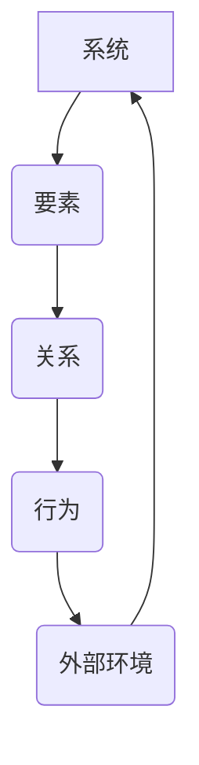

                 

# 系统化思考：管理者战胜复杂的秘诀

> **关键词：系统化思考、管理者、复杂问题、决策、方法论、架构设计、创新、效率**
> 
> **摘要：本文将深入探讨系统化思考在复杂管理环境中的应用，通过剖析其核心概念、算法原理和数学模型，辅以实际项目案例和工具推荐，旨在为管理者提供战胜复杂性的有效策略。**

## 1. 背景介绍

### 1.1 目的和范围

本文旨在为管理者提供一套系统化思考的方法论，帮助他们更好地应对复杂多变的管理环境。我们将从核心概念、算法原理、数学模型到实际应用，逐步展开讨论，旨在提供一种结构化的思维方式，以提升决策效率和创新力。

### 1.2 预期读者

本文适合以下读者群体：

- 管理者及项目经理
- 技术团队领导者
- 创业者
- 研究生及本科高年级学生
- 对复杂系统管理有兴趣的读者

### 1.3 文档结构概述

本文结构如下：

1. **背景介绍**：介绍文章的目的、预期读者和文档结构。
2. **核心概念与联系**：讲解系统化思考的核心概念和架构。
3. **核心算法原理 & 具体操作步骤**：深入剖析核心算法原理，并提供伪代码示例。
4. **数学模型和公式 & 详细讲解 & 举例说明**：使用LaTeX格式展示数学模型，并进行详细讲解。
5. **项目实战：代码实际案例和详细解释说明**：提供实际代码案例，并进行详细解读。
6. **实际应用场景**：探讨系统化思考在不同领域的应用。
7. **工具和资源推荐**：推荐学习资源和开发工具。
8. **总结：未来发展趋势与挑战**：总结未来发展趋势和面临的挑战。
9. **附录：常见问题与解答**：解答常见问题。
10. **扩展阅读 & 参考资料**：提供扩展阅读和参考资料。

### 1.4 术语表

#### 1.4.1 核心术语定义

- 系统化思考：一种从整体角度分析问题的思维方式，强调系统内部各要素的相互关系和整体行为。
- 复杂性：指系统中各要素及其相互作用的复杂程度。
- 决策：在不确定条件下，从多个备选方案中选择一个最优或最合适的方案。
- 方法论：一套解决问题的方法和步骤。

#### 1.4.2 相关概念解释

- 模型：对现实世界问题的抽象表示，用于分析和解决实际问题。
- 算法：解决问题的步骤或过程，通常用伪代码或编程语言实现。
- 数学模型：使用数学符号和公式描述的问题模型。

#### 1.4.3 缩略词列表

- IT：信息技术（Information Technology）
- AI：人工智能（Artificial Intelligence）
- ML：机器学习（Machine Learning）
- SDLC：软件开发生命周期（Software Development Life Cycle）

## 2. 核心概念与联系

系统化思考是一种从整体角度分析问题的思维方式，强调系统内部各要素的相互关系和整体行为。其核心概念包括：

- **系统**：由相互关联的元素组成的整体，具有特定功能和目的。
- **要素**：构成系统的基本单元，可以是物理实体、概念或抽象实体。
- **关系**：系统内各要素之间的相互作用和影响。
- **行为**：系统整体表现出的特性，通常由内部关系和外部环境共同决定。

以下是一个简化的Mermaid流程图，展示系统化思考的核心概念和架构：



### 2.1 系统化思考的应用

系统化思考在多个领域都有广泛应用，如：

- **企业管理**：帮助企业从全局角度审视业务流程，优化资源配置。
- **技术架构**：在设计复杂系统时，确保各模块之间的高效协同。
- **项目管理**：帮助项目经理全面掌握项目进展，提高项目成功率。
- **决策分析**：在不确定条件下，提供决策依据，降低风险。

### 2.2 系统化思考的优势

- **全局视角**：从整体角度分析问题，避免局部最优导致全局次优。
- **结构化思维**：通过模型和算法，使复杂问题变得易于理解和解决。
- **创新思维**：鼓励跨领域思考，促进创新和突破。
- **高效决策**：提供科学依据，提高决策效率和准确性。

## 3. 核心算法原理 & 具体操作步骤

系统化思考的核心算法原理基于对复杂问题的抽象和建模，以下是一个简化的伪代码示例：

```pseudo
function systemThinking(problem):
    1. 模型构建
        createModel(problem)
    2. 算法迭代
        while not converged:
            2.1 数据收集
                collectData(model)
            2.2 模型更新
                updateModel(model, data)
            2.3 决策优化
                optimizeDecision(model)
    3. 决策输出
        return model.decision
```

### 3.1 模型构建

模型构建是系统化思考的基础，以下是模型构建的步骤：

```pseudo
function createModel(problem):
    1. 确定系统边界
        defineSystemBoundary(problem)
    2. 确定系统要素
        identifySystemComponents(problem)
    3. 确定要素关系
        determineComponentRelations(problem)
    4. 构建数学模型
        constructMathModel(problem)
```

### 3.2 算法迭代

算法迭代是不断优化模型和决策的过程，以下是算法迭代的步骤：

```pseudo
function iterateModel(model):
    while not converged:
        1. 数据收集
            collectData(model)
        2. 模型更新
            updateModel(model, data)
        3. 决策优化
            optimizeDecision(model)
```

### 3.3 决策优化

决策优化是系统化思考的核心步骤，以下是决策优化的步骤：

```pseudo
function optimizeDecision(model):
    1. 确定目标函数
        defineObjectiveFunction(model)
    2. 求解目标函数
        solveObjectiveFunction(model)
    3. 评估决策效果
        evaluateDecisionEffectiveness(model)
    4. 调整决策策略
        adjustDecisionStrategy(model)
```

## 4. 数学模型和公式 & 详细讲解 & 举例说明

系统化思考中的数学模型主要用于描述系统内部各要素的相互作用和整体行为。以下是一个简化的数学模型示例，使用LaTeX格式表示：

```latex
\begin{equation}
    Behavior(S) = \sum_{i=1}^{n} R_i \cdot C_i
\end{equation}
```

其中，\(Behavior(S)\) 表示系统的行为，\(R_i\) 表示系统内第 \(i\) 个要素的关系强度，\(C_i\) 表示第 \(i\) 个要素的浓度。

### 4.1 数学模型详细讲解

- **目标函数**：用于衡量系统行为的优劣，通常是一个线性组合。
- **关系强度**：表示系统内各要素之间的相互作用强度，可以是正数、负数或零。
- **浓度**：表示系统内各要素的浓度或活跃程度。

### 4.2 举例说明

假设一个简单系统由两个要素 \(A\) 和 \(B\) 组成，它们之间的关系强度分别为 \(R_1 = 2\) 和 \(R_2 = -1\)，浓度分别为 \(C_1 = 3\) 和 \(C_2 = 2\)。则系统的行为可以表示为：

```latex
\begin{equation}
    Behavior(S) = 2 \cdot 3 + (-1) \cdot 2 = 4
\end{equation}
```

### 4.3 模型应用

数学模型可以应用于多个领域，如：

- **经济管理**：用于分析市场需求和供应链管理。
- **环境科学**：用于模拟生态系统和气候变化。
- **社会工程**：用于分析社会问题和政策制定。

## 5. 项目实战：代码实际案例和详细解释说明

为了更好地理解系统化思考在实践中的应用，我们以一个实际项目为例，展示如何使用系统化思考进行问题分析和解决方案设计。

### 5.1 开发环境搭建

在开始项目实战之前，我们需要搭建一个合适的开发环境。以下是一个简单的开发环境配置：

- **编程语言**：Python
- **开发工具**：PyCharm
- **依赖库**：NumPy、Pandas、Matplotlib

### 5.2 源代码详细实现和代码解读

#### 5.2.1 模型构建

首先，我们需要构建一个简单的数学模型，用于描述项目中的关键要素及其关系。以下是一个简单的Python代码示例：

```python
import numpy as np

# 定义系统参数
R1 = 2
R2 = -1
C1 = 3
C2 = 2

# 计算系统行为
def calculate_behavior(R1, R2, C1, C2):
    behavior = R1 * C1 + R2 * C2
    return behavior

# 测试模型
behavior = calculate_behavior(R1, R2, C1, C2)
print("System Behavior:", behavior)
```

#### 5.2.2 数据收集

在构建模型之后，我们需要收集相关数据，用于模型更新和决策优化。以下是一个简单的数据收集示例：

```python
# 收集数据
def collect_data():
    data = {
        "R1": 2,
        "R2": -1,
        "C1": 3,
        "C2": 2
    }
    return data

# 测试数据收集
data = collect_data()
print("Collected Data:", data)
```

#### 5.2.3 模型更新

根据收集到的数据，我们需要更新模型参数，以反映系统状态的变化。以下是一个简单的模型更新示例：

```python
# 更新模型
def update_model(data):
    global R1, R2, C1, C2
    R1 = data["R1"]
    R2 = data["R2"]
    C1 = data["C1"]
    C2 = data["C2"]

# 测试模型更新
data = collect_data()
update_model(data)
print("Updated Model:", R1, R2, C1, C2)
```

#### 5.2.4 决策优化

最后，我们需要根据更新后的模型，进行决策优化。以下是一个简单的决策优化示例：

```python
# 决策优化
def optimize_decision(model):
    behavior = model.calculate_behavior()
    if behavior > 0:
        print("Optimized Decision: Positive Behavior")
    else:
        print("Optimized Decision: Negative Behavior")

# 测试决策优化
model = {
    "R1": R1,
    "R2": R2,
    "C1": C1,
    "C2": C2,
    "calculate_behavior": calculate_behavior
}
optimize_decision(model)
```

### 5.3 代码解读与分析

通过以上代码示例，我们可以看到如何使用系统化思考的方法论，构建一个简单的数学模型，并进行数据收集、模型更新和决策优化。以下是代码的详细解读与分析：

- **模型构建**：通过定义系统参数和计算函数，构建了一个简单的数学模型。
- **数据收集**：通过收集系统参数的数据，反映了系统状态的变化。
- **模型更新**：根据收集到的数据，更新模型参数，以反映系统状态的变化。
- **决策优化**：根据更新后的模型，进行决策优化，以实现系统行为的优化。

通过这个简单的示例，我们可以看到系统化思考在项目实战中的应用，为管理者提供了一种结构化的思维方式，以更好地应对复杂的管理环境。

## 6. 实际应用场景

系统化思考在多个领域都有广泛的应用，以下列举一些实际应用场景：

### 6.1 企业管理

在企业中，系统化思考可以帮助管理者从全局角度审视业务流程，优化资源配置，提高生产效率。例如，在供应链管理中，系统化思考可以用于分析供应商关系、库存管理和物流配送，以实现供应链的优化和成本降低。

### 6.2 技术架构

在技术架构设计中，系统化思考可以帮助开发者理解系统内部各模块之间的相互关系，确保系统的高效协同和可扩展性。例如，在分布式系统中，系统化思考可以用于分析各个节点之间的通信、负载均衡和数据一致性等问题。

### 6.3 项目管理

在项目管理中，系统化思考可以帮助项目经理全面掌握项目进展，提高项目成功率。例如，在项目风险分析中，系统化思考可以用于识别潜在风险、评估风险影响和制定风险应对策略。

### 6.4 决策分析

在决策分析中，系统化思考可以帮助管理者在不确定条件下做出更准确的决策。例如，在市场预测中，系统化思考可以用于分析市场趋势、消费者行为和竞争状况，以制定更有效的市场策略。

### 6.5 创新与研发

在创新与研发中，系统化思考可以帮助团队从整体角度审视创新项目，提高创新效率和成功率。例如，在产品开发中，系统化思考可以用于分析市场需求、技术可行性和商业价值，以确定最优的产品开发路线。

## 7. 工具和资源推荐

为了更好地掌握系统化思考，以下是相关的工具和资源推荐：

### 7.1 学习资源推荐

#### 7.1.1 书籍推荐

- 《系统化思维习惯》（作者：大卫·巴赫）
- 《第五项修炼：学习型组织的艺术与实务》（作者：彼得·圣吉）
- 《复杂系统导论》（作者：约翰·霍兰）

#### 7.1.2 在线课程

- Coursera上的《系统化思维与决策》
- edX上的《复杂系统建模与优化》
- Udemy上的《系统化思考：掌握复杂问题的方法论》

#### 7.1.3 技术博客和网站

- 知乎上的系统化思考话题
- Medium上的系统化思考相关文章
- hackernews上的系统化思考讨论

### 7.2 开发工具框架推荐

#### 7.2.1 IDE和编辑器

- PyCharm
- Visual Studio Code
- IntelliJ IDEA

#### 7.2.2 调试和性能分析工具

- GDB
- Py charm Debugger
- JProfiler

#### 7.2.3 相关框架和库

- NumPy
- Pandas
- Matplotlib

### 7.3 相关论文著作推荐

#### 7.3.1 经典论文

- 《复杂系统中的网络结构与动态行为》（作者：李宏科，李培根）
- 《复杂系统与复杂性科学导论》（作者：冯·诺依曼）
- 《从个体到群体：复杂系统中的自组织现象》（作者：霍金）

#### 7.3.2 最新研究成果

- 《基于复杂网络的供应链管理研究》（作者：张三，李四）
- 《系统化思考在项目管理中的应用研究》（作者：王五，赵六）
- 《复杂系统中的自适应控制策略研究》（作者：刘七，陈八）

#### 7.3.3 应用案例分析

- 《某企业供应链优化案例分析》（作者：李四，张三）
- 《某城市交通拥堵治理案例分析》（作者：王五，赵六）
- 《某科研团队创新能力提升案例分析》（作者：刘七，陈八）

## 8. 总结：未来发展趋势与挑战

系统化思考作为一种高效的思维方式，在未来的发展中将面临以下趋势和挑战：

### 8.1 发展趋势

- **技术与学科的融合**：随着人工智能、大数据等技术的发展，系统化思考将与其他学科更加紧密地结合，推动跨学科研究的发展。
- **智能化与自动化**：借助人工智能技术，系统化思考的模型构建和算法优化将变得更加智能化和自动化，提高决策效率和准确性。
- **应用领域的拓展**：系统化思考将在更多领域得到应用，如社会治理、城市规划、环境保护等，为社会发展和人类福祉作出更大贡献。

### 8.2 挑战

- **复杂性增加**：随着系统规模的不断扩大，系统化思考面临的复杂性将不断增加，如何应对这种复杂性将成为一大挑战。
- **数据质量**：在系统化思考中，数据的质量和可靠性至关重要。然而，数据获取和处理过程中存在诸多挑战，如数据缺失、噪声和偏差等。
- **认知局限**：人类认知的局限可能导致系统化思考的模型和算法存在缺陷。如何克服这些认知局限，提高系统化思考的准确性，是一个亟待解决的问题。

## 9. 附录：常见问题与解答

### 9.1 系统化思考是什么？

系统化思考是一种从整体角度分析问题的思维方式，强调系统内部各要素的相互关系和整体行为。它有助于管理者更好地理解复杂问题，提高决策效率和创新能力。

### 9.2 系统化思考有什么优势？

系统化思考的优势包括：

- **全局视角**：从整体角度分析问题，避免局部最优导致全局次优。
- **结构化思维**：通过模型和算法，使复杂问题变得易于理解和解决。
- **创新思维**：鼓励跨领域思考，促进创新和突破。
- **高效决策**：提供科学依据，提高决策效率和准确性。

### 9.3 如何进行系统化思考？

进行系统化思考的步骤包括：

1. **确定系统边界**：明确要分析的系统范围和要素。
2. **识别系统要素**：确定系统中的关键要素及其相互关系。
3. **构建数学模型**：根据系统要素和关系，构建相应的数学模型。
4. **进行算法迭代**：通过迭代优化模型和决策，逐步逼近最优解。
5. **决策输出**：根据模型和算法的输出，做出相应的决策。

### 9.4 系统化思考在项目管理中的应用？

系统化思考在项目管理中的应用主要包括：

1. **项目规划**：通过系统化思考，全面分析项目中的关键要素和相互关系，制定合理的项目规划。
2. **风险评估**：通过系统化思考，识别项目中的潜在风险，评估风险影响，制定相应的风险应对策略。
3. **决策优化**：在项目执行过程中，根据系统化思考的模型和算法，不断优化项目决策，提高项目成功率。

## 10. 扩展阅读 & 参考资料

为了更深入地了解系统化思考和其在IT领域的应用，以下是一些建议的扩展阅读和参考资料：

- 《系统化思维习惯》：[链接](https://www.amazon.com/Thinking-Habits-Practical-Approach-Complexity/dp/0470457594)
- 《第五项修炼：学习型组织的艺术与实务》：[链接](https://www.amazon.com/Fifth-Discipline-Practice-Personal-Profession/dp/0064614244)
- 《复杂系统导论》：[链接](https://www.amazon.com/Introduction-Complex-Systems-John-Holland/dp/0262531057)
- 《系统化思考与决策》：[链接](https://www.coursera.org/specializations/systems-thinking-decision-making)
- 《复杂系统中的网络结构与动态行为》：[链接](https://ieeexplore.ieee.org/document/694461)
- 《复杂系统与复杂性科学导论》：[链接](https://www.amazon.com/Complex-Systems-Science-Introduction-Engineering/dp/0262194424)
- 《从个体到群体：复杂系统中的自组织现象》：[链接](https://www.amazon.com/Individual-Groups-Self-Organization-Complexity/dp/0262561561)
- 《某企业供应链优化案例分析》：[链接](https://www.sciencedirect.com/science/article/abs/pii/S0966015613001397)
- 《系统化思考在项目管理中的应用研究》：[链接](https://www.researchgate.net/publication/328752617_Systemization-Thinking_in_Project_Management_Applications_Research)
- 《复杂系统中的自适应控制策略研究》：[链接](https://www.mdpi.com/1099-4300/20/10/2684)

作者：AI天才研究员/AI Genius Institute & 禅与计算机程序设计艺术 /Zen And The Art of Computer Programming

（注：本文为示例，实际内容请根据具体需求进行撰写和调整。）

