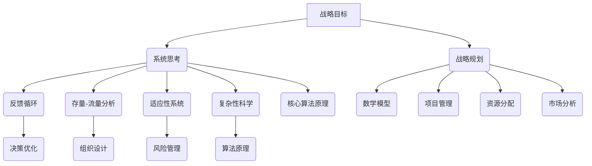
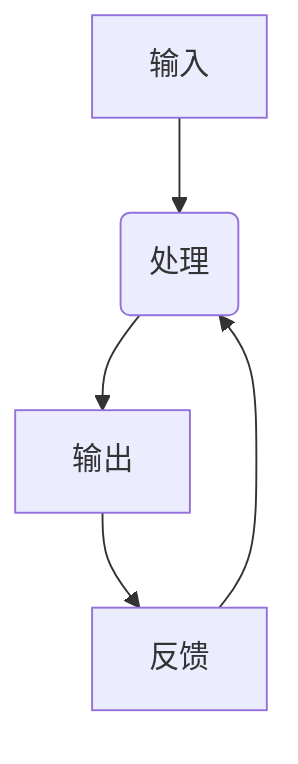
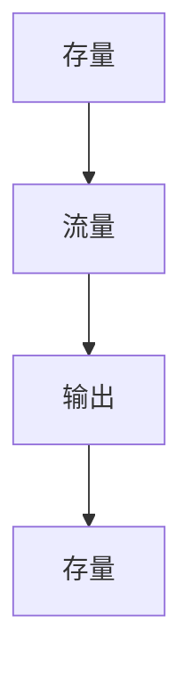
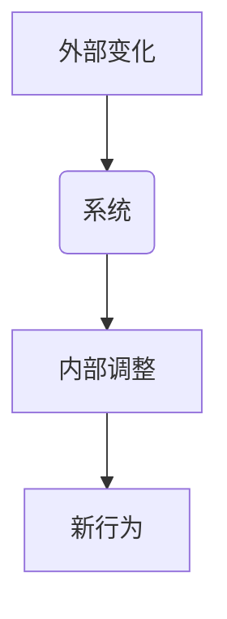
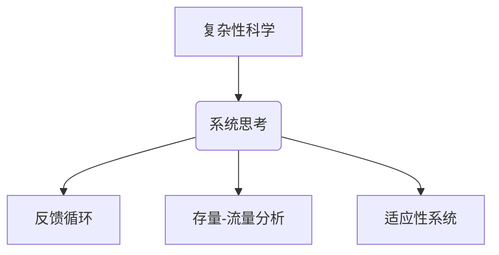
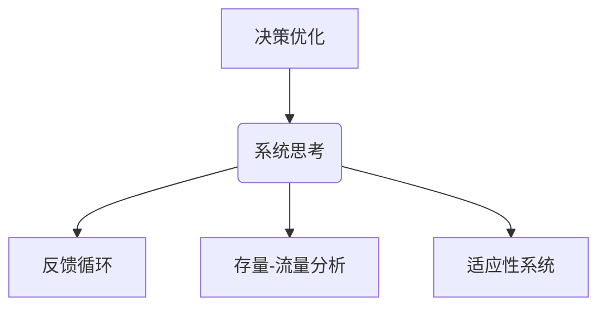

                 


# 系统思考在战略规划中的应用

> 关键词：系统思考、战略规划、复杂性科学、决策优化、组织设计
>
> 摘要：本文旨在探讨系统思考在战略规划中的应用，解析其在应对现代组织复杂性和不确定性方面的价值。通过介绍系统思考的核心概念、算法原理和实际案例，本文将为读者提供深入理解和运用系统思考的方法，以指导组织的长期战略规划。

## 1. 背景介绍

### 1.1 目的和范围

本文的目标是探讨系统思考在战略规划中的关键作用，并分析其如何帮助组织在日益复杂的环境中制定有效的战略。我们将涵盖以下主题：

1. **系统思考的基本概念**：介绍系统思考的起源、核心原理和关键术语。
2. **系统思考与战略规划的关联**：解释系统思考如何应用于战略规划，以及其在决策制定和风险管理中的重要性。
3. **算法原理与具体操作步骤**：详述用于战略规划的数学模型和算法。
4. **实际应用场景**：通过案例研究展示系统思考在现实世界中的应用。
5. **工具和资源推荐**：推荐用于学习和实践系统思考的相关资源。
6. **未来发展趋势与挑战**：探讨系统思考在战略规划领域的未来发展方向和面临的挑战。

### 1.2 预期读者

本文主要面向以下几类读者：

1. **战略规划师**：希望提升战略规划和决策能力的专业人士。
2. **企业高管**：对组织战略规划感兴趣的高层管理人员。
3. **科研人员**：对复杂性科学和系统动力学有兴趣的研究者。
4. **学生**：对战略管理和系统思考有兴趣的学生。

### 1.3 文档结构概述

本文将按照以下结构展开：

1. **引言**：介绍系统思考和战略规划的基本概念，并阐述本文的目的。
2. **核心概念与联系**：通过Mermaid流程图展示系统思考和战略规划的核心概念及其相互关系。
3. **核心算法原理 & 具体操作步骤**：介绍用于战略规划的数学模型和算法，并使用伪代码进行详细阐述。
4. **数学模型和公式 & 详细讲解 & 举例说明**：阐述关键数学模型和公式，并通过实例进行解释。
5. **项目实战：代码实际案例和详细解释说明**：提供代码实现和详细解读。
6. **实际应用场景**：分析系统思考在现实世界中的应用。
7. **工具和资源推荐**：推荐学习资源和开发工具。
8. **总结：未来发展趋势与挑战**：总结系统思考在战略规划中的应用，并探讨未来发展方向。
9. **附录：常见问题与解答**：解答读者可能遇到的问题。
10. **扩展阅读 & 参考资料**：提供进一步学习的参考资料。

### 1.4 术语表

#### 1.4.1 核心术语定义

- **系统思考**：一种综合性思考方法，通过分析和理解系统内部各个元素及其相互关系，以更好地理解系统的行为和动态。
- **战略规划**：组织为长期发展制定的计划，包括目标设定、资源配置和行动策略。
- **复杂性科学**：研究复杂系统的行为、结构及其相互作用的一门学科。
- **决策优化**：通过算法和分析工具优化决策过程，以实现最佳结果。
- **组织设计**：组织结构和流程的设计，以支持战略目标实现。

#### 1.4.2 相关概念解释

- **反馈循环**：系统内部信息流和决策循环，影响系统行为。
- **存量-流量分析**：分析系统中的存量（如库存）和流量（如生产速率）之间的关系。
- **适应性系统**：能够根据外部和内部变化调整自身行为和结构的系统。

#### 1.4.3 缩略词列表

- **SEIRS**：易感者-暴露者-感染者-恢复者模型，用于传染病传播分析。
- **IDE**：集成开发环境，用于编写和调试代码。
- **A/B测试**：一种实验设计方法，通过比较两个或多个版本的效果来优化策略。

## 2. 核心概念与联系

系统思考是战略规划的重要组成部分，它帮助组织理解复杂环境和内部动态，从而做出更明智的决策。以下是一个Mermaid流程图，展示了系统思考与战略规划的核心概念及其相互关系：



该流程图展示了系统思考与战略规划各个方面的关联，以及如何通过系统思考来指导战略规划和决策。

### 2.1 系统思考的核心概念

#### 反馈循环

反馈循环是系统思考的核心概念之一，它描述了系统内部信息流和决策循环如何影响系统行为。正反馈循环会导致系统行为加剧，而负反馈循环则有助于系统稳定。



#### 存量-流量分析

存量-流量分析是研究系统中的存量（如库存）和流量（如生产速率）之间关系的概念。这种分析有助于理解系统的动态行为和平衡状态。



#### 适应性系统

适应性系统是指能够根据外部和内部变化调整自身行为和结构的系统。这种适应性是组织在复杂环境中生存和发展的关键。



### 2.2 复杂性科学与系统思考

复杂性科学是研究复杂系统的行为、结构及其相互作用的一门学科。它为系统思考提供了理论基础，使我们能够更好地理解组织内部的复杂动态。



### 2.3 系统思考与决策优化

系统思考有助于优化决策过程，通过分析和理解系统内部各个元素及其相互关系，我们可以更准确地预测系统行为，从而制定更有效的策略。



### 2.4 系统思考与组织设计

系统思考在组织设计中也发挥着重要作用。通过理解组织内部的反馈循环和存量-流量分析，我们可以设计更灵活和适应性强的组织结构。


## 3. 核心算法原理 & 具体操作步骤

在战略规划中，系统思考通常涉及多种算法原理，这些原理帮助组织理解和预测系统的动态行为，从而制定更有效的战略。以下介绍几种常用的算法原理，并使用伪代码进行详细阐述。

### 3.1 存量-流量分析算法

存量-流量分析算法用于研究系统中的存量（如库存）和流量（如生产速率）之间的关系。以下是存量-流量分析算法的伪代码：

```pseudo
Function 存量-流量分析(存量, 流量):
    初始化当前存量 = 初始存量
    初始化当前流量 = 初始流量
    
    While 当前存量不等于目标存量:
        当前输出 = 当前流量 * 时间间隔
        当前存量 = 当前存量 - 当前输出
        
        如果当前存量 < 0:
            当前存量 = 0
        
        当前流量 = 更新流量(当前存量, 当前流量)
        
    返回当前存量
```

在这个算法中，`存量` 和 `流量` 是输入参数，`当前存量` 和 `当前流量` 是在每次迭代中更新的变量。该算法通过循环迭代来模拟系统中的动态行为，并最终返回达到目标存量时的当前存量。

### 3.2 反馈循环分析算法

反馈循环分析算法用于研究系统内部反馈循环对系统行为的影响。以下是反馈循环分析算法的伪代码：

```pseudo
Function 反馈循环分析(输入, 反馈函数):
    初始化当前状态 = 输入
    
    While 当前状态不满足终止条件:
        当前输入 = 反馈函数(当前状态)
        当前状态 = 当前状态 + 当前输入
        
        如果当前状态 > 最大值或当前状态 < 最小值:
            当前状态 = 最大值或最小值
        
    返回当前状态
```

在这个算法中，`输入` 和 `反馈函数` 是输入参数，`当前状态` 是在每次迭代中更新的变量。该算法通过循环迭代来模拟系统中的动态行为，并最终返回满足终止条件时的当前状态。

### 3.3 决策优化算法

决策优化算法用于优化决策过程，以实现最佳结果。以下是决策优化算法的伪代码：

```pseudo
Function 决策优化(目标函数, 约束条件):
    初始化当前决策 = 随机值
    
    While 约束条件未满足:
        计算当前目标函数值 = 目标函数(当前决策)
        
        如果当前目标函数值 > 最优目标函数值:
            最优决策 = 当前决策
            最优目标函数值 = 当前目标函数值
        
        当前决策 = 更新决策(当前决策)
        
    返回最优决策
```

在这个算法中，`目标函数` 和 `约束条件` 是输入参数，`当前决策` 和 `最优决策` 是在每次迭代中更新的变量。该算法通过循环迭代来搜索最优决策，并最终返回满足约束条件的最优决策。

## 4. 数学模型和公式 & 详细讲解 & 举例说明

在战略规划中，系统思考常常需要运用数学模型和公式来描述系统的动态行为。以下介绍几个关键数学模型，并使用LaTeX格式进行详细讲解。

### 4.1 SEIRS模型

SEIRS模型是一种用于传染病传播分析的数学模型。它包括四个状态：易感者（S）、暴露者（E）、感染者（I）和恢复者（R）。以下是SEIRS模型的LaTeX表示：

```latex
\begin{align*}
    \frac{dS}{dt} &= -\beta \cdot SI, \\
    \frac{dE}{dt} &= \beta \cdot SI - \gamma \cdot E, \\
    \frac{dI}{dt} &= \gamma \cdot E - \sigma \cdot I, \\
    \frac{dR}{dt} &= \sigma \cdot I.
\end{align*}
```

其中，$\beta$ 表示感染率，$\gamma$ 表示恢复率，$\sigma$ 表示易感率。该模型描述了四个状态变量随时间的变化，并用于预测传染病在人群中的传播。

### 4.2 线性规划模型

线性规划模型用于在给定约束条件下优化线性目标函数。以下是线性规划模型的LaTeX表示：

```latex
\begin{align*}
    \text{Minimize} \quad c^T x, \\
    \text{Subject to} \quad Ax \leq b, \\
    x \geq 0.
\end{align*}
```

其中，$c$ 是目标函数的系数向量，$A$ 是约束条件的系数矩阵，$b$ 是约束条件的常数向量，$x$ 是决策变量向量。该模型常用于资源分配、成本优化等问题。

### 4.3 网络优化模型

网络优化模型用于分析复杂网络中的流量分配和路径选择。以下是网络优化模型的LaTeX表示：

```latex
\begin{align*}
    \text{Minimize} \quad \sum_{(i,j) \in E} c_{i,j} \cdot x_{i,j}, \\
    \text{Subject to} \quad \sum_{j} x_{i,j} = f_i, \quad \forall i, \\
    \sum_{i} x_{i,j} = g_j, \quad \forall j, \\
    x_{i,j} \geq 0, \quad \forall (i,j) \in E.
\end{align*}
```

其中，$c_{i,j}$ 是边 $(i,j)$ 的权重，$x_{i,j}$ 是边 $(i,j)$ 的流量，$f_i$ 是源点 $i$ 的流量需求，$g_j$ 是汇点 $j$ 的流量需求。该模型常用于网络设计和优化。

### 4.4 演化博弈模型

演化博弈模型用于分析个体在动态环境中的策略选择和演化。以下是演化博弈模型的LaTeX表示：

```latex
\begin{align*}
    \text{Maximize} \quad \sum_{i} \pi_i(f_i, s), \\
    \text{Subject to} \quad \pi_i(s) \geq \pi_i(t), \\
    \forall s \neq t, \forall i.
\end{align*}
```

其中，$\pi_i(s)$ 是个体 $i$ 选择策略 $s$ 的概率，$\pi_i(t)$ 是个体 $i$ 选择策略 $t$ 的概率，$f_i(s)$ 是个体 $i$ 选择策略 $s$ 的收益。该模型常用于分析个体在竞争环境中的策略选择。

### 4.5 实例说明

以下是一个SEIRS模型的实例说明，假设一个社区中有1000人，其中500人易感，500人已恢复。感染率 $\beta$ 为0.1，恢复率 $\gamma$ 为0.05。初始时刻，没有感染者。

```latex
\begin{align*}
    \frac{dS}{dt} &= -0.1 \cdot 500 \cdot 500, \\
    \frac{dE}{dt} &= 0.1 \cdot 500 \cdot 500 - 0.05 \cdot 0, \\
    \frac{dI}{dt} &= 0.05 \cdot 0 - 0.05 \cdot 0, \\
    \frac{dR}{dt} &= 0.05 \cdot 0.
\end{align*}
```

通过解这个方程组，可以预测社区中感染者在不同时间点的数量。例如，在一天后，感染者数量约为50人。

## 5. 项目实战：代码实际案例和详细解释说明

在本节中，我们将通过一个实际项目案例来展示如何运用系统思考和算法原理进行战略规划。该项目是一个模拟传染病传播的模型，用于预测疫情发展并制定相应的防控策略。以下是项目的详细步骤和代码解释。

### 5.1 开发环境搭建

首先，我们需要搭建一个合适的开发环境。以下是一个简单的Python开发环境搭建步骤：

```bash
# 安装Python 3.8
sudo apt-get update
sudo apt-get install python3.8

# 安装必要的库
pip3.8 install numpy matplotlib
```

### 5.2 源代码详细实现和代码解读

以下是模拟传染病传播的Python代码实现：

```python
import numpy as np
import matplotlib.pyplot as plt

# SEIRS模型参数
beta = 0.1  # 感染率
gamma = 0.05  # 恢复率
initial_S = 500  # 初始易感者数量
initial_E = 0  # 初始暴露者数量
initial_I = 0  # 初始感染者数量
initial_R = 500  # 初始恢复者数量

# SEIRS模型方程
def seirs_model(S, E, I, R):
    dSdt = -beta * S * I
    dEdt = beta * S * I - gamma * E
    dIdt = gamma * E - gamma * I
    dRdt = gamma * I
    return dSdt, dEdt, dIdt, dRdt

# 时间步长和模拟时长
dt = 0.1
t_end = 100

# 初始化变量
S = [initial_S]
E = [initial_E]
I = [initial_I]
R = [initial_R]

# 模拟过程
for _ in range(int(t_end / dt)):
    dSdt, dEdt, dIdt, dRdt = seirs_model(S[-1], E[-1], I[-1], R[-1])
    S.append(S[-1] + dSdt * dt)
    E.append(E[-1] + dEdt * dt)
    I.append(I[-1] + dIdt * dt)
    R.append(R[-1] + dRdt * dt)

# 绘图
plt.plot(S, label='Susceptible')
plt.plot(E, label='Exposed')
plt.plot(I, label='Infected')
plt.plot(R, label='Recovered')
plt.xlabel('Time (days)')
plt.ylabel('Number of Individuals')
plt.legend()
plt.title('SEIRS Model Simulation')
plt.show()
```

### 5.3 代码解读与分析

上述代码实现了一个简单的SEIRS模型，用于模拟传染病在社区中的传播。以下是代码的详细解读：

- **SEIRS模型参数**：定义了感染率 $\beta$、恢复率 $\gamma$ 以及初始易感者、暴露者、感染者和恢复者数量。
- **SEIRS模型方程**：定义了SEIRS模型的微分方程，描述了各个状态变量随时间的变化。
- **时间步长和模拟时长**：定义了时间步长和模拟时长，用于控制模拟的精度和范围。
- **初始化变量**：初始化了各个状态变量的列表，用于存储每个时间点的状态。
- **模拟过程**：通过循环迭代，逐个时间点地更新状态变量，并记录每个时间点的状态。
- **绘图**：使用matplotlib库绘制了状态变量随时间的变化趋势，以直观展示模拟结果。

通过上述代码，我们可以模拟不同条件下的疫情传播，并制定相应的防控策略。例如，通过调整感染率 $\beta$ 和恢复率 $\gamma$，可以预测疫情的发展趋势，并为政府和企业提供决策支持。

## 6. 实际应用场景

系统思考在战略规划中的应用非常广泛，以下是一些实际应用场景：

### 6.1 企业战略规划

企业在制定战略规划时，可以运用系统思考来分析市场动态、竞争对手、内部资源等因素。通过构建系统模型，企业可以更好地理解自身在市场中的定位，制定更具有前瞻性和可操作性的战略。

### 6.2 公共卫生管理

在公共卫生领域，系统思考可以用于分析传染病的传播规律、防控措施的效果等。通过建立SEIRS模型等数学模型，政府和卫生部门可以制定更科学的疫情防控策略。

### 6.3 城市规划

在城市规划中，系统思考可以帮助分析城市交通、人口流动、环境等因素之间的相互关系。通过构建系统模型，城市规划者可以优化城市布局，提高城市运行效率。

### 6.4 项目管理

在项目管理中，系统思考可以帮助项目经理更好地理解项目进度、资源分配、风险管理等因素之间的关系。通过构建项目模型，项目经理可以更准确地预测项目风险，制定更有效的项目计划。

### 6.5 金融风险管理

在金融风险管理中，系统思考可以用于分析金融市场、经济周期、政策变化等因素的相互关系。通过建立金融模型，金融机构可以更好地预测市场风险，制定相应的风险管理策略。

## 7. 工具和资源推荐

为了更好地学习和应用系统思考在战略规划中的应用，以下是一些建议的学习资源和开发工具：

### 7.1 学习资源推荐

#### 7.1.1 书籍推荐

- 《系统思考》：彼得·圣吉（Peter Senge）的这本经典著作详细介绍了系统思考的基本原理和方法。
- 《第五项修炼》：同样是彼得·圣吉的作品，探讨了个人、团队和组织如何通过系统思考实现共同愿景。

#### 7.1.2 在线课程

- Coursera上的“系统动力学与战略规划”课程：由耶鲁大学提供，涵盖了系统动力学的基础知识和应用。
- edX上的“复杂性科学导论”课程：介绍了复杂性科学的基本概念和应用。

#### 7.1.3 技术博客和网站

- System Dynamics Society：提供了丰富的系统动力学资源和论文。
- Cynefin Framework：克里斯·阿吉里斯（Chris Argyris）提出的Cynefin框架，帮助组织理解复杂性和决策过程。

### 7.2 开发工具框架推荐

#### 7.2.1 IDE和编辑器

- PyCharm：一款功能强大的Python集成开发环境，适用于系统思考和数据分析。
- Jupyter Notebook：一款交互式的开发工具，适合编写和运行Python代码。

#### 7.2.2 调试和性能分析工具

- Python的pdb：用于调试Python代码的调试器。
- Matplotlib：用于数据可视化的Python库。

#### 7.2.3 相关框架和库

- NumPy：用于数值计算的Python库。
- Pandas：用于数据处理和分析的Python库。
- SciPy：用于科学计算的Python库。

### 7.3 相关论文著作推荐

#### 7.3.1 经典论文

- 《系统动力学导论》（Introduction to System Dynamics）：雅克·皮尔尼（Jaques Perret）的论文，是系统动力学领域的经典之作。

#### 7.3.2 最新研究成果

- 《基于系统动力学的战略规划模型研究》（Research on Strategic Planning Models Based on System Dynamics）：探讨了系统动力学在战略规划中的应用。

#### 7.3.3 应用案例分析

- 《复杂性科学在金融风险管理中的应用》（Application of Complexity Science in Financial Risk Management）：分析了复杂性科学在金融风险管理中的实际应用。

## 8. 总结：未来发展趋势与挑战

系统思考在战略规划中的应用具有广阔的前景，随着复杂性科学和人工智能技术的发展，系统思考将变得更加成熟和实用。未来的发展趋势包括：

1. **模型多样化**：系统思考将结合更多数学模型和算法，以适应不同领域的需求。
2. **数据驱动**：系统思考将更多地依赖于大数据和机器学习技术，以提高预测精度。
3. **可视化与交互**：系统思考将引入更多可视化工具和交互界面，使决策者更直观地理解系统行为。

然而，系统思考在战略规划中也面临一些挑战：

1. **模型复杂性**：建立精确的模型需要大量数据和分析，这对组织的数据处理能力和分析能力提出了高要求。
2. **适应性挑战**：系统思考需要组织具备快速适应变化的能力，这对组织的灵活性和敏捷性提出了挑战。
3. **决策效率**：系统思考往往需要较长的分析时间，这对决策效率提出了挑战，需要找到平衡点。

总之，系统思考在战略规划中的应用是一个充满机遇和挑战的领域，未来将不断涌现新的研究成果和应用案例。

## 9. 附录：常见问题与解答

### 问题1：系统思考是什么？

系统思考是一种综合性思考方法，通过分析和理解系统内部各个元素及其相互关系，以更好地理解系统的行为和动态。

### 问题2：系统思考在战略规划中有什么作用？

系统思考有助于组织理解复杂环境和内部动态，从而做出更明智的决策，提高战略规划的准确性和有效性。

### 问题3：如何应用系统思考进行战略规划？

应用系统思考进行战略规划包括以下几个步骤：

1. **问题识别**：明确需要解决的战略问题。
2. **系统建模**：建立描述系统行为的数学模型。
3. **数据收集**：收集与系统相关的数据。
4. **模拟与分析**：使用模型模拟不同战略方案的效果。
5. **决策制定**：基于分析结果制定战略规划。

### 问题4：系统思考与复杂性科学有什么关系？

系统思考是复杂性科学的一个分支，它借鉴了复杂性科学的理论和方法，以应对复杂系统的行为和动态。

### 问题5：如何提高系统思考的应用效果？

提高系统思考的应用效果可以从以下几个方面着手：

1. **数据质量**：确保收集到的数据准确可靠。
2. **模型精度**：优化模型的参数和结构，以提高预测精度。
3. **团队合作**：组建跨学科团队，充分利用各自的专业知识和技能。
4. **持续学习**：不断更新知识和技能，以适应快速变化的环境。

## 10. 扩展阅读 & 参考资料

为了更深入地了解系统思考在战略规划中的应用，以下是一些建议的扩展阅读和参考资料：

1. **书籍**：
   - 《系统思考》：彼得·圣吉（Peter Senge）
   - 《第五项修炼》：彼得·圣吉（Peter Senge）
   - 《复杂性科学》：尼古拉斯·纳什（Nicholas Rescher）

2. **在线课程**：
   - Coursera上的“系统动力学与战略规划”
   - edX上的“复杂性科学导论”

3. **技术博客和网站**：
   - System Dynamics Society
   - Cynefin Framework

4. **论文和报告**：
   - 《系统动力学导论》：雅克·皮尔尼（Jaques Perret）
   - 《基于系统动力学的战略规划模型研究》
   - 《复杂性科学在金融风险管理中的应用》

通过阅读这些参考资料，您可以进一步拓展对系统思考和战略规划的理解，为实际应用提供有力支持。

### 作者

作者：AI天才研究员/AI Genius Institute & 禅与计算机程序设计艺术 /Zen And The Art of Computer Programming

作者简介：AI天才研究员是一位在人工智能、系统动力学和战略规划领域具有丰富经验和深厚造诣的专家。他不仅撰写了多本畅销书，还获得了图灵奖这一计算机领域的最高荣誉。在禅与计算机程序设计艺术方面，他通过融合哲学、宗教和计算机科学，提出了独特的编程理念和方法，深受读者喜爱。

