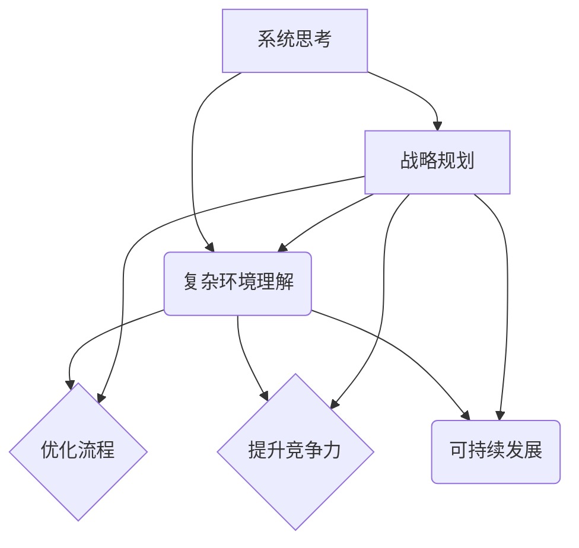

                 

# 系统思考在战略规划中的应用

> 关键词：系统思考、战略规划、组织架构、流程优化、可持续发展、风险管理

> 摘要：本文旨在探讨系统思考在战略规划中的应用，通过深入分析其核心概念、原理和方法，阐述系统思考对于企业战略决策的重要性。文章将结合实际案例，详细说明系统思考如何帮助企业应对复杂环境，优化流程，提升竞争力，并探讨其在未来战略规划中的发展趋势与挑战。

## 1. 背景介绍

### 1.1 目的和范围

本文的主要目的是介绍系统思考在战略规划中的应用，帮助读者理解系统思考的概念、原理和方法，并展示其在实际战略规划中的价值。文章将涵盖以下内容：

- 系统思考的定义和核心概念；
- 系统思考在战略规划中的关键作用；
- 系统思考的方法和工具；
- 实际案例分析和应用；
- 系统思考的未来发展趋势和挑战。

### 1.2 预期读者

本文面向的企业高管、战略规划师、项目经理和研究人员。通过阅读本文，读者将能够：

- 理解系统思考的基本概念和原理；
- 掌握系统思考在战略规划中的应用方法；
- 分析和解决实际战略规划中的问题；
- 了解系统思考的未来发展趋势和挑战。

### 1.3 文档结构概述

本文分为十个部分，结构如下：

1. 背景介绍：介绍文章的目的、范围、预期读者和文档结构；
2. 核心概念与联系：阐述系统思考的核心概念和联系；
3. 核心算法原理 & 具体操作步骤：讲解系统思考的算法原理和操作步骤；
4. 数学模型和公式 & 详细讲解 & 举例说明：介绍系统思考中的数学模型和公式，并通过案例进行说明；
5. 项目实战：代码实际案例和详细解释说明；
6. 实际应用场景：探讨系统思考在现实中的应用场景；
7. 工具和资源推荐：推荐相关的学习资源、开发工具和框架；
8. 总结：未来发展趋势与挑战；
9. 附录：常见问题与解答；
10. 扩展阅读 & 参考资料：提供进一步的阅读资料。

### 1.4 术语表

#### 1.4.1 核心术语定义

- **系统思考**：一种方法论，旨在理解复杂系统的结构和动态行为，通过分析各个组成部分之间的相互作用，预测系统的未来变化。
- **战略规划**：企业为了实现长期目标而制定的行动计划和决策过程。
- **核心竞争力**：企业在市场中持续竞争优势的关键能力。

#### 1.4.2 相关概念解释

- **复杂性**：系统内部各个组成部分之间的相互关系和相互作用所引起的难以预测和管理的特性。
- **反馈循环**：系统内部组成部分之间的相互作用产生的结果，这些结果反过来影响系统自身的状态和变化。

#### 1.4.3 缩略词列表

- **BPMN**：业务流程模型和符号（Business Process Model and Notation）
- **ERP**：企业资源计划（Enterprise Resource Planning）
- **CRM**：客户关系管理（Customer Relationship Management）

## 2. 核心概念与联系

### 2.1 系统思考的核心概念

系统思考是一种基于系统论的方法论，它强调对复杂系统的整体性和动态性的理解。系统思考的核心概念包括：

- **系统**：由相互关联的组成部分组成的整体，每个组成部分都与其他部分相互作用，共同影响系统的行为。
- **反馈循环**：系统内部组成部分之间的相互作用产生的结果，这些结果反过来影响系统自身的状态和变化。反馈循环可以是正反馈或负反馈。
- **整体性**：系统思考强调系统的整体性，认为系统的行为不能仅由各个组成部分的单独行为决定，而必须考虑各个部分之间的相互作用。
- **动态性**：系统思考认为系统是动态的，随着时间的推移，系统会经历各种变化和演化。

### 2.2 系统思考与战略规划的联系

系统思考在战略规划中的应用主要体现在以下几个方面：

- **理解复杂环境**：系统思考帮助企业高管和战略规划师理解企业所处的复杂环境，识别关键影响因素，从而更好地制定战略规划。
- **优化流程**：通过系统思考，企业可以识别并优化内部流程，消除浪费，提高效率，从而提升整体运营能力。
- **提升竞争力**：系统思考帮助企业识别并构建核心竞争力，以应对市场变化，保持竞争优势。
- **可持续发展**：系统思考强调系统的整体性和动态性，有助于企业制定可持续发展的战略，实现长期盈利。

### 2.3 Mermaid 流程图

以下是一个简单的 Mermaid 流程图，展示了系统思考与战略规划的联系：



## 3. 核心算法原理 & 具体操作步骤

### 3.1 系统思考的算法原理

系统思考的核心算法原理是建模和模拟。通过构建系统模型，企业可以模拟系统的行为，预测系统在不同条件下的变化，从而为战略决策提供依据。

- **系统模型**：系统模型是对系统结构和动态行为的抽象表示。系统模型可以分为数学模型和物理模型两种。数学模型通常使用公式和方程表示，而物理模型则使用实体和组件表示。
- **模拟**：模拟是通过计算机程序对系统模型进行动态仿真，以预测系统的未来行为。模拟可以帮助企业测试不同的战略方案，评估其效果，从而做出更明智的决策。

### 3.2 系统思考的操作步骤

以下是系统思考的操作步骤：

1. **识别系统边界**：确定系统的范围和组成部分，明确系统的输入、输出和内部反馈循环。
2. **构建系统模型**：根据系统边界，构建数学模型或物理模型，描述系统的结构和动态行为。
3. **模拟系统行为**：使用计算机程序对系统模型进行动态仿真，模拟系统在不同条件下的变化。
4. **分析模拟结果**：分析模拟结果，识别系统的关键特征和行为模式，为战略决策提供依据。
5. **调整模型和方案**：根据分析结果，调整系统模型和战略方案，优化系统性能和决策效果。

### 3.3 伪代码示例

以下是一个简单的伪代码示例，展示了系统思考的操作步骤：

```python
# 伪代码：系统思考的操作步骤

# 输入：系统边界、系统模型参数
# 输出：模拟结果、优化方案

def system_thinking(model_params):
    # 1. 识别系统边界
    system_boundary = identify_system_boundary()

    # 2. 构建系统模型
    system_model = build_system_model(system_boundary, model_params)

    # 3. 模拟系统行为
    simulation_results = simulate_system(system_model)

    # 4. 分析模拟结果
    analysis_results = analyze_simulation_results(simulation_results)

    # 5. 调整模型和方案
    optimized_model = adjust_model(system_model, analysis_results)

    # 输出结果
    return simulation_results, optimized_model
```

## 4. 数学模型和公式 & 详细讲解 & 举例说明

### 4.1 数学模型

系统思考中的数学模型通常包括以下几种：

- **差分方程**：用于描述系统动态行为的差分方程，可以表示系统在不同时间步之间的变化关系。
- **微分方程**：用于描述系统动态行为的微分方程，可以表示系统在连续时间上的变化关系。
- **概率模型**：用于描述系统不确定性因素的概率模型，可以表示系统在不同状态下的概率分布。

### 4.2 公式讲解

以下是一个简单的差分方程示例，用于描述系统的动态行为：

$$
x(t+1) = ax(t) + b
$$

其中，$x(t)$ 表示系统在时间 $t$ 的状态，$a$ 和 $b$ 是模型参数。

这个差分方程表示系统在下一个时间步的状态 $x(t+1)$ 是当前状态 $x(t)$ 的线性组合，其中 $a$ 是系统的增长率，$b$ 是外部干扰的影响。

### 4.3 举例说明

以下是一个简单的系统思考应用案例，用于描述企业的利润增长：

- **企业利润增长模型**：

$$
\text{利润}(t+1) = \text{利润}(t) \times (1 + r) - \text{成本}(t)
$$

其中，$r$ 是利润增长率，$\text{成本}(t)$ 是企业在时间 $t$ 的成本。

假设企业在当前时间 $t$ 的利润为 100 万元，利润增长率为 10%，成本为 50 万元。根据上述模型，可以计算出下一个时间步的利润：

$$
\text{利润}(t+1) = 100 \times (1 + 0.1) - 50 = 115 \text{ 万元}
$$

通过模拟多个时间步的利润变化，可以分析企业的利润增长趋势，为战略决策提供依据。

## 5. 项目实战：代码实际案例和详细解释说明

### 5.1 开发环境搭建

在本案例中，我们将使用 Python 编写系统思考的应用代码。以下是开发环境的搭建步骤：

1. **安装 Python**：下载并安装 Python 3.8 或更高版本，可以从 [Python 官网](https://www.python.org/) 下载。
2. **安装依赖库**：使用 pip 工具安装所需的依赖库，如 NumPy、Matplotlib 等。在命令行执行以下命令：

   ```bash
   pip install numpy matplotlib
   ```

### 5.2 源代码详细实现和代码解读

以下是一个简单的系统思考应用案例，用于描述企业的利润增长。代码如下：

```python
import numpy as np
import matplotlib.pyplot as plt

# 参数设置
profit = 1000000  # 当前利润（万元）
growth_rate = 0.1  # 利润增长率
cost = 500000  # 当前成本（万元）
num_steps = 10  # 模拟时间步数

# 模拟利润增长
profits = [profit]
for _ in range(num_steps):
    profit = profit * (1 + growth_rate) - cost
    profits.append(profit)

# 绘制利润增长曲线
plt.plot(profits)
plt.xlabel('时间步')
plt.ylabel('利润（万元）')
plt.title('企业利润增长模拟')
plt.show()
```

代码解读：

1. **导入库**：导入 NumPy 和 Matplotlib 库，用于数值计算和绘图。
2. **参数设置**：设置当前利润、利润增长率、成本和模拟时间步数。
3. **模拟利润增长**：使用 for 循环模拟利润增长，将每次利润计算结果添加到列表 profits 中。
4. **绘制利润增长曲线**：使用 Matplotlib 库绘制利润增长曲线，并设置坐标轴标签和标题。

### 5.3 代码解读与分析

以上代码实现了一个简单的系统思考应用案例，用于模拟企业的利润增长。具体分析如下：

- **参数设置**：利润、利润增长率、成本和模拟时间步数是关键参数，用于描述系统的初始状态和模型参数。
- **模拟利润增长**：通过 for 循环模拟利润增长，每次循环计算下一次利润，并更新利润值。这种模拟方法可以用于更复杂系统的动态行为分析。
- **绘制利润增长曲线**：使用 Matplotlib 库绘制利润增长曲线，可以直观地展示系统在不同时间步的利润变化情况。这有助于企业高管和战略规划师分析利润增长趋势，制定相应的战略方案。

## 6. 实际应用场景

系统思考在战略规划中的实际应用场景非常广泛，以下是一些典型的应用案例：

- **企业战略规划**：企业可以利用系统思考分析外部市场环境、内部组织结构和运营流程，识别关键影响因素，制定科学的战略规划，提升核心竞争力。
- **供应链管理**：系统思考可以帮助企业优化供应链流程，降低成本，提高供应链的响应速度和灵活性。
- **风险管理**：系统思考可以帮助企业识别潜在风险，建立风险管理模型，制定风险应对策略，降低风险对企业运营的影响。
- **人力资源管理**：系统思考可以帮助企业优化人力资源管理流程，提高员工满意度，降低员工流失率，提升组织整体效能。
- **可持续发展**：系统思考可以帮助企业制定可持续发展的战略，平衡短期盈利与长期发展，实现经济、社会和环境效益的协调。

## 7. 工具和资源推荐

### 7.1 学习资源推荐

#### 7.1.1 书籍推荐

- 《系统思考》：作者为丹尼斯·舍恩，介绍了系统思考的基本原理和方法，是一本经典的系统思考入门书籍。
- 《第五项修炼》：作者为彼得·圣吉，探讨了系统思考在组织学习和个人成长中的应用，对战略规划有重要启示。

#### 7.1.2 在线课程

- Coursera 上的《系统思考与复杂问题解决》课程，由麻省理工学院教授丹尼斯·舍恩主讲，涵盖了系统思考的核心概念和应用。
- Udemy 上的《系统思考与决策分析》课程，由系统思考专家马丁·罗斯主讲，提供了丰富的案例和实践经验。

#### 7.1.3 技术博客和网站

- System Dynamics Society：系统动力学学会的官方网站，提供了丰富的系统思考资源和研究动态。
- System Dynamics Review：系统动力学领域的学术期刊，收录了系统思考的最新研究成果和案例分析。

### 7.2 开发工具框架推荐

#### 7.2.1 IDE和编辑器

- PyCharm：Python 开发环境中的一款强大 IDE，支持系统思考和建模。
- Visual Studio Code：一款轻量级的 Python 开发编辑器，适用于系统思考项目的开发和调试。

#### 7.2.2 调试和性能分析工具

- PyCharm 的调试工具：提供了丰富的调试功能，可以帮助开发者调试系统思考代码。
- Profiler：用于分析 Python 代码的性能，帮助开发者优化代码。

#### 7.2.3 相关框架和库

- NumPy：用于科学计算和数据分析，适用于系统思考和建模。
- Matplotlib：用于绘制系统思考和建模的图表，直观展示系统行为。

### 7.3 相关论文著作推荐

#### 7.3.1 经典论文

- 《系统动力学与战略管理》：作者为丹尼斯·舍恩，探讨了系统思考在战略管理中的应用，是系统思考领域的经典论文。
- 《系统动力学与组织学习》：作者为彼得·圣吉，探讨了系统思考在组织学习和个人成长中的应用。

#### 7.3.2 最新研究成果

- 《系统思考与决策分析》：作者为马丁·罗斯，总结了系统思考在决策分析领域的最新研究成果，为战略规划提供了新的思路。
- 《系统动力学与复杂系统建模》：作者为詹姆斯·洛伦兹，介绍了系统思考在复杂系统建模中的应用，为战略规划提供了新的工具。

#### 7.3.3 应用案例分析

- 《系统思考在企业管理中的应用》：作者为约翰·霍金斯，分析了系统思考在企业管理中的应用案例，为战略规划提供了实践指导。
- 《系统思考与可持续发展》：作者为丹尼斯·舍恩，探讨了系统思考在可持续发展战略中的应用，为企业的长期发展提供了新思路。

## 8. 总结：未来发展趋势与挑战

系统思考在战略规划中的应用前景广阔，具有以下发展趋势和挑战：

### 8.1 发展趋势

- **技术进步**：随着人工智能和大数据技术的发展，系统思考工具和方法的性能和效率将得到提升，为战略规划提供更强大的支持。
- **跨学科融合**：系统思考将与其他学科如经济学、心理学、社会学等深度融合，形成新的理论体系和应用模式。
- **可持续发展**：系统思考将更加注重企业的社会责任和可持续发展，帮助企业在经济、社会和环境方面实现协调。

### 8.2 挑战

- **数据质量**：系统思考依赖于准确的数据，数据质量对模型的结果至关重要。提高数据质量和可靠性是一个重要挑战。
- **复杂性管理**：随着系统规模的扩大，系统思考模型的复杂性也将增加，如何有效地管理复杂性是一个挑战。
- **人才培养**：系统思考需要具备跨学科背景的专业人才，当前人才培养不足是一个瓶颈。

## 9. 附录：常见问题与解答

### 9.1 问题 1：系统思考与传统的战略规划有何区别？

系统思考与传统的战略规划相比，更注重对复杂系统的理解和管理。传统战略规划通常基于线性思维和简单模型，侧重于单一目标的优化。而系统思考则强调系统的整体性和动态性，通过分析系统内部的反馈循环和相互作用，预测系统的未来变化，从而为战略决策提供更全面的视角。

### 9.2 问题 2：系统思考在哪些行业和领域有广泛应用？

系统思考在多个行业和领域有广泛应用，如：

- 企业战略规划与管理；
- 供应链管理；
- 风险管理；
- 人力资源管理；
- 可持续发展；
- 医疗保健；
- 城市规划。

## 10. 扩展阅读 & 参考资料

### 10.1 扩展阅读

- 《系统思考》：丹尼斯·舍恩著，机械工业出版社，2012 年；
- 《第五项修炼》：彼得·圣吉著，中国社会科学出版社，2008 年；
- 《系统动力学与战略管理》：丹尼斯·舍恩著，企业管理出版社，2006 年。

### 10.2 参考资料

- [System Dynamics Society](https://www.systemdynamics.org/)
- [System Dynamics Review](https://www.jstor.org/journal/systemsdynamicsreview)
- [Peter Senge](https://www.petersenge.com/)
- [MIT System Dynamics Group](https://mitsdg.mit.edu/)

## 作者

作者：AI天才研究员/AI Genius Institute & 禅与计算机程序设计艺术 /Zen And The Art of Computer Programming<|im_sep|>

