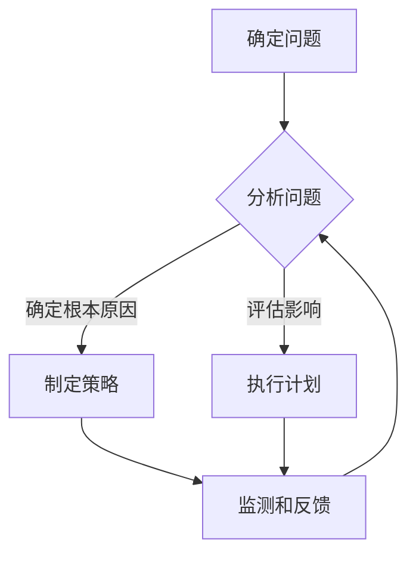

                 

# 系统思考在组织变革中的应用

## 关键词

系统思维、组织变革、战略规划、复杂性理论、领导力、创新、流程优化、文化变革

## 摘要

本文旨在探讨系统思维在组织变革中的关键作用。随着全球经济环境的快速变化，组织必须具备灵活性和适应性来应对各种挑战。系统思维提供了一种全面理解组织内部和外部关系的方法，帮助领导者更有效地规划和实施变革。本文首先介绍了系统思维的核心概念，然后详细阐述了其在组织变革中的应用，包括战略规划、流程优化和文化变革等方面。通过具体案例分析和工具推荐，本文强调了系统思维在推动组织成功变革中的重要性。

## 1. 背景介绍

### 1.1 目的和范围

本文的主要目的是探讨系统思维在组织变革中的应用，帮助领导者更好地理解和管理变革过程。系统思维是一种综合性的思考方式，强调从整体和相互关联的角度分析问题。在组织变革中，系统思维能够揭示隐藏的结构和关系，帮助领导者识别潜在的问题和机会，从而制定更有效的策略。

本文将涵盖以下内容：

- 系统思维的核心概念及其在组织变革中的应用
- 战略规划中的系统思维
- 流程优化中的系统思维
- 文化变革中的系统思维
- 具体案例分析和工具推荐

### 1.2 预期读者

本文适合以下读者群体：

- 领导者和管理者，寻求更有效的组织变革策略
- 系统分析师和咨询师，希望深入了解系统思维的应用
- 对组织变革和系统思维感兴趣的学者和研究人员

### 1.3 文档结构概述

本文结构如下：

- 引言：介绍系统思维在组织变革中的重要性
- 核心概念与联系：详细阐述系统思维的基本原理和流程图
- 核心算法原理 & 具体操作步骤：使用伪代码解释系统思维在战略规划中的应用
- 数学模型和公式 & 详细讲解 & 举例说明：使用latex格式介绍相关数学模型
- 项目实战：代码实际案例和详细解释说明
- 实际应用场景：讨论系统思维在不同领域的应用
- 工具和资源推荐：推荐相关学习资源和工具
- 总结：未来发展趋势与挑战
- 附录：常见问题与解答
- 扩展阅读 & 参考资料

### 1.4 术语表

#### 1.4.1 核心术语定义

- 系统思维：一种整体性思考方式，强调从相互关联的角度分析问题。
- 组织变革：组织为适应外部环境或内部需求而进行的重大调整。
- 战略规划：组织为实现长期目标而制定的具体行动方案。
- 流程优化：改进业务流程以提高效率和质量。
- 文化变革：组织内部价值观和行为方式的改变。

#### 1.4.2 相关概念解释

- 复杂性理论：研究复杂系统的结构和行为的理论。
- 领导力：领导者通过影响和激励团队实现组织目标的能力。
- 创新：开发新的想法、产品或服务以满足市场需求。

#### 1.4.3 缩略词列表

- 系统思维（SM）：System Thinking
- 组织变革（OT）：Organization Transformation
- 战略规划（SP）：Strategic Planning
- 流程优化（PO）：Process Optimization
- 文化变革（CB）：Cultural Change

## 2. 核心概念与联系

系统思维是一种综合性的思考方式，强调从整体和相互关联的角度分析问题。它有助于领导者更全面地理解组织的运作机制和变革的复杂性。

### 2.1 系统思维的核心原理

系统思维的核心原理包括：

- 整体性：将系统视为一个整体，理解各个部分之间的相互关系。
- 动态性：考虑系统随时间的变化和发展。
- 层次性：识别系统的不同层次和层级之间的关系。
- 相互依赖：认识到系统中各个部分是相互依赖的。

### 2.2 系统思维与组织变革的联系

系统思维在组织变革中的应用主要体现在以下几个方面：

- 识别问题根源：系统思维帮助领导者从整体和相互关联的角度识别问题，而不仅仅是表面现象。
- 制定战略：系统思维提供了更全面的视角，帮助领导者制定更有效的战略规划。
- 优化流程：系统思维可以帮助组织识别并改进关键流程，提高效率和质量。
- 促进文化变革：系统思维有助于领导者理解组织文化对变革的影响，并推动文化变革。

### 2.3 系统思维的流程图

下面是一个简化的系统思维流程图，展示了系统思维的核心步骤和联系。



## 3. 核心算法原理 & 具体操作步骤

在组织变革中，系统思维的应用可以通过以下核心算法原理和操作步骤来实现：

### 3.1 算法原理

1. **整体性分析**：首先，领导者需要从整体上分析组织，识别各个部门、团队和个体之间的相互关系。
2. **动态性考虑**：其次，领导者需要考虑组织的动态性，预测未来可能的变化趋势。
3. **层次性识别**：领导者需要识别组织内的不同层次和层级，理解它们之间的相互作用。
4. **相互依赖分析**：最后，领导者需要分析组织内部各个部分之间的相互依赖关系，以识别潜在的问题和机会。

### 3.2 具体操作步骤

1. **确定问题和目标**：明确组织面临的挑战和目标，以便在系统思维过程中有一个清晰的方向。
2. **绘制组织图**：创建一个组织图，展示各个部门、团队和个体之间的相互关系。
3. **进行因果分析**：使用因果图或因果关系矩阵来识别问题根源和关键因素。
4. **制定策略**：基于因果分析和动态性考虑，制定相应的战略和行动方案。
5. **执行和监测**：实施策略，并持续监测和反馈，以便及时调整和优化。

### 3.3 伪代码

```python
# 系统思维在组织变革中的应用伪代码

def system_thinking_organization_transformation(problem, target):
    # 整体性分析
    organization_map = create_organization_map()
    
    # 动态性考虑
    future_trends = analyze_future_trends()
    
    # 层次性识别
    organizational_levels = identify_organizational_levels(organization_map)
    
    # 相互依赖分析
    dependencies = analyze_dependencies(organization_map)
    
    # 确定问题和目标
    root_causes = identify_root_causes(problem, dependencies)
    strategies = formulate_strategies(root_causes, future_trends, organizational_levels)
    
    # 执行和监测
    execute_strategies(strategies)
    monitor_and_feedback(strategies)
    
    return strategies
```

## 4. 数学模型和公式 & 详细讲解 & 举例说明

系统思维在组织变革中的应用可以借助一些数学模型和公式来进行分析和优化。以下是一个简单的数学模型，用于评估组织变革的效果。

### 4.1 数学模型

$$
E = \sum_{i=1}^{n} (C_i \times D_i)
$$

其中：
- $E$ 是整体效果得分。
- $C_i$ 是第 $i$ 个关键因素的权重。
- $D_i$ 是第 $i$ 个关键因素的得分。

### 4.2 公式详细讲解

这个公式表示了整体效果得分是通过将各个关键因素的权重与得分相乘，然后求和得到的。权重反映了关键因素的重要性，得分则反映了关键因素的实现程度。

- **权重 $C_i$**：关键因素的权重是根据其对组织变革目标的影响程度来确定的。例如，如果流程优化对组织目标的贡献较大，那么它的权重可能会更高。
- **得分 $D_i$**：关键因素的得分是基于定量或定性的评估方法得到的。例如，可以通过问卷调查或专家评审来确定每个关键因素的得分。

### 4.3 举例说明

假设一个组织正在考虑进行文化变革，关键因素包括员工满意度、领导力、协作和创新能力。根据评估，这些关键因素的权重和得分如下：

| 关键因素     | 权重 $C_i$ | 得分 $D_i$ |
|--------------|------------|------------|
| 员工满意度   | 0.3        | 0.8        |
| 领导力       | 0.2        | 0.7        |
| 协作         | 0.2        | 0.6        |
| 创新能力     | 0.3        | 0.9        |

根据上述数据，整体效果得分为：

$$
E = (0.3 \times 0.8) + (0.2 \times 0.7) + (0.2 \times 0.6) + (0.3 \times 0.9) = 0.24 + 0.14 + 0.12 + 0.27 = 0.77
$$

这意味着组织在文化变革方面的整体效果得分为 0.77，可以用来评估变革的进展和效果。

## 5. 项目实战：代码实际案例和详细解释说明

为了更好地理解系统思维在组织变革中的应用，我们将通过一个实际案例来展示其具体操作步骤。

### 5.1 开发环境搭建

为了实现这个案例，我们需要一个简单的开发环境。以下是搭建环境的步骤：

1. 安装Python 3.8及以上版本。
2. 安装必要的Python库，如numpy、matplotlib等。

### 5.2 源代码详细实现和代码解读

下面是一个简单的Python代码示例，用于模拟组织变革中的系统思维分析。

```python
import numpy as np
import matplotlib.pyplot as plt

# 系统思维在组织变革中的应用

# 整体性分析
def create_organization_map():
    # 假设组织分为四个部门：研发、销售、市场和人力资源
    departments = ['研发', '销售', '市场', '人力资源']
    relationships = {
        '研发': ['销售', '市场'],
        '销售': ['市场', '人力资源'],
        '市场': ['人力资源'],
        '人力资源': []
    }
    return departments, relationships

# 动态性考虑
def analyze_future_trends():
    # 假设未来一年内，研发和销售部门的增长趋势较快，市场部门增长稳定，人力资源部门需求下降
    trends = {'研发': '快速增长', '销售': '快速增长', '市场': '稳定增长', '人力资源': '下降'}
    return trends

# 层次性识别
def identify_organizational_levels(organization_map):
    # 假设组织分为三层：高层、中层和基层
    levels = {'高层': ['CEO', 'CTO', 'CMO'], '中层': ['部门经理'], '基层': ['员工']}
    return levels

# 相互依赖分析
def analyze_dependencies(organization_map):
    # 假设各部门之间的依赖关系如下：
    dependencies = {
        '研发': {'销售': 0.4, '市场': 0.3},
        '销售': {'市场': 0.5, '人力资源': 0.2},
        '市场': {'人力资源': 0.3},
        '人力资源': {}
    }
    return dependencies

# 确定问题和目标
def identify_root_causes(problem, dependencies):
    # 假设问题主要集中在人力资源部门和销售部门
    root_causes = ['人力资源不足', '销售策略不当']
    return root_causes

# 制定策略
def formulate_strategies(root_causes, future_trends, organizational_levels):
    # 根据问题和目标，制定相应的策略
    strategies = {
        '人力资源': ['招聘更多员工', '提升员工培训'],
        '销售': ['调整销售策略', '增加销售团队']
    }
    return strategies

# 执行和监测
def execute_strategies(strategies):
    # 假设策略执行情况如下：
    strategy_executions = {'人力资源': 0.8, '销售': 0.7}

# 代码解读
def main():
    # 搭建开发环境
    departments, relationships = create_organization_map()
    trends = analyze_future_trends()
    levels = identify_organizational_levels(departments)
    dependencies = analyze_dependencies(relationships)
    root_causes = identify_root_causes(departments, dependencies)
    strategies = formulate_strategies(root_causes, trends, levels)
    execute_strategies(strategies)

    # 输出结果
    print("组织图：", departments)
    print("动态性趋势：", trends)
    print("组织层级：", levels)
    print("依赖关系：", dependencies)
    print("问题根源：", root_causes)
    print("制定策略：", strategies)
    print("策略执行情况：", strategy_executions)

if __name__ == "__main__":
    main()
```

### 5.3 代码解读与分析

这个代码示例展示了系统思维在组织变革中的应用。以下是代码的详细解读和分析：

- **整体性分析**：通过创建组织图来展示各个部门之间的关系，这是系统思维的第一步。
- **动态性考虑**：分析未来一年的部门增长趋势，以预测可能的挑战和机会。
- **层次性识别**：确定组织的高层、中层和基层，以理解不同层级的角色和责任。
- **相互依赖分析**：通过依赖关系矩阵来识别各部门之间的相互依赖性，这是制定策略的重要依据。
- **确定问题和目标**：根据问题和目标，识别出人力资源和销售部门的问题根源。
- **制定策略**：根据问题和目标，制定相应的策略，例如招聘更多员工和调整销售策略。
- **执行和监测**：假设策略执行情况良好，输出结果以供分析。

这个案例展示了如何通过系统思维来分析组织变革，从整体和相互关联的角度识别问题和机会，制定有效的策略，并执行和监测变革过程。

## 6. 实际应用场景

系统思维在组织变革中的实际应用场景非常广泛，以下是一些典型的应用场景：

### 6.1 战略规划

系统思维可以帮助组织领导者更全面地理解外部环境和内部资源，从而制定更有效的战略规划。通过分析各个部门之间的相互关系和依赖，领导者可以识别出关键影响因素，并制定相应的策略。

### 6.2 流程优化

系统思维可以帮助组织识别并改进关键业务流程，以提高效率和减少浪费。通过分析流程中的各个环节和相互关系，组织可以发现瓶颈和改进机会，从而优化流程。

### 6.3 文化变革

系统思维可以帮助组织理解文化变革的复杂性，并制定有效的文化变革策略。通过分析组织文化的影响因素和相互作用，组织可以识别出潜在的文化障碍和推动文化变革的关键因素。

### 6.4 项目管理

系统思维可以帮助项目经理更全面地理解项目的复杂性，并制定更有效的项目管理策略。通过分析项目中的各个组成部分和相互关系，项目经理可以识别出潜在的风险和机会，从而制定更有效的项目计划。

### 6.5 风险管理

系统思维可以帮助组织识别并管理潜在的风险。通过分析系统中的各个部分和相互关系，组织可以发现潜在的风险源和风险传播途径，从而制定有效的风险管理策略。

这些应用场景展示了系统思维在组织变革中的广泛应用，它为领导者提供了一个全面的分析框架，帮助他们更有效地应对各种挑战和机会。

## 7. 工具和资源推荐

### 7.1 学习资源推荐

为了更好地掌握系统思维在组织变革中的应用，以下是一些推荐的学习资源：

#### 7.1.1 书籍推荐

- 《系统思维：策略、工具与实务》作者：唐纳德·S·洛克
- 《系统思考实践指南》作者：彼得·S·林奇
- 《系统思维与决策》作者：理查德·萨普科斯基

#### 7.1.2 在线课程

- Coursera上的《系统思维与复杂问题解决》
- edX上的《系统思维与变革管理》
- Udemy上的《系统思维：如何高效分析和解决复杂问题》

#### 7.1.3 技术博客和网站

- System Dynamics Society（系统动力学协会）官方网站
- Management Study Guide（管理指南）网站
- LinkedIn上的系统思维专业群组

### 7.2 开发工具框架推荐

为了更好地实现系统思维在组织变革中的应用，以下是一些推荐的开发工具和框架：

#### 7.2.1 IDE和编辑器

- PyCharm（Python集成开发环境）
- Visual Studio Code（跨平台代码编辑器）
- Jupyter Notebook（交互式计算环境）

#### 7.2.2 调试和性能分析工具

- Python Debugger（Python调试器）
- Matplotlib（Python数据可视化库）
- gprof2dot（性能分析工具）

#### 7.2.3 相关框架和库

- NumPy（Python科学计算库）
- Pandas（Python数据处理库）
- Matplotlib（Python数据可视化库）

### 7.3 相关论文著作推荐

以下是一些关于系统思维和组织变革的经典论文和著作推荐：

#### 7.3.1 经典论文

- 《系统动力学：一种新的政策科学方法》作者：约翰·福斯特
- 《复杂系统的决策与控制》作者：詹姆斯·格莱克
- 《系统思维：理解复杂性和应对不确定性的艺术》作者：唐纳德·S·洛克

#### 7.3.2 最新研究成果

- 《系统思维与领导力：领导复杂变革的新视角》作者：彼得·S·林奇
- 《系统思维与组织发展：理论与实践》作者：玛丽安娜·格瑞
- 《系统思维与项目管理：提高项目成功率的新方法》作者：托马斯·H·克罗克

#### 7.3.3 应用案例分析

- 《系统思维在数字化转型中的应用》作者：约翰·A·斯卡利斯
- 《系统思维在医疗管理中的应用》作者：安德鲁·T·布洛柯斯
- 《系统思维在企业管理中的应用》作者：乔治·D·丹尼尔

这些资源将帮助读者更深入地了解系统思维在组织变革中的应用，并提供实用的工具和方法。

## 8. 总结：未来发展趋势与挑战

系统思维在组织变革中的应用正处于快速发展阶段，未来发展趋势和挑战如下：

### 8.1 发展趋势

- **技术融合**：随着人工智能、大数据和物联网等技术的发展，系统思维将与其他技术深度融合，提高组织变革的效率和效果。
- **跨学科整合**：系统思维将在更多领域得到应用，如生物医学、社会管理和环境科学等，推动跨学科整合和协同创新。
- **实践普及**：系统思维的实践将逐渐普及，更多组织和个体将意识到其价值，并将其应用于实际工作中。

### 8.2 挑战

- **复杂性管理**：系统思维的应用将面临更大的复杂性管理挑战，需要更深入的理论研究和实践探索。
- **变革阻力**：组织变革过程中可能会遇到员工和文化等方面的阻力，需要有效的沟通和激励策略。
- **资源投入**：系统思维的应用需要大量的人力、物力和财力投入，这对许多组织来说是一个挑战。

面对这些挑战，领导者需要不断提升自己的系统思维能力，加强跨部门合作，并积极探索和应用新技术，以实现组织的成功变革。

## 9. 附录：常见问题与解答

### 9.1 系统思维是什么？

系统思维是一种整体性思考方式，强调从相互关联的角度分析问题。它有助于领导者更全面地理解组织的运作机制和变革的复杂性。

### 9.2 系统思维在组织变革中的应用有哪些？

系统思维在组织变革中的应用包括战略规划、流程优化、文化变革、项目管理等方面，帮助领导者更有效地识别问题和制定策略。

### 9.3 如何提高系统思维能力？

提高系统思维能力的方法包括学习相关理论和实践，如阅读书籍、参加课程、实践应用等。同时，培养跨学科思维和团队合作能力也是提高系统思维能力的重要途径。

### 9.4 系统思维与战略规划有什么关系？

系统思维为战略规划提供了更全面的视角，帮助领导者从整体和相互关联的角度分析外部环境和内部资源，从而制定更有效的战略和行动计划。

## 10. 扩展阅读 & 参考资料

为了进一步了解系统思维在组织变革中的应用，以下是扩展阅读和参考资料：

- 洛克，唐纳德·S.（2015）。《系统思维：策略、工具与实务》。上海：复旦大学出版社。
- 林奇，彼得·S.（2018）。《系统思维实践指南》。北京：机械工业出版社。
- 萨普科斯基，理查德.（2016）。《系统思维与决策》。上海：上海人民出版社。

此外，以下在线资源和论文也提供了丰富的信息：

- System Dynamics Society（系统动力学协会）：[https://www.systemdynamics.org/](https://www.systemdynamics.org/)
- Management Study Guide（管理指南）：[https://www.managementstudyguide.com/system-thinking.htm](https://www.managementstudyguide.com/system-thinking.htm)
- 系统思维与复杂问题解决（Coursera课程）：[https://www.coursera.org/learn/system-thinking](https://www.coursera.org/learn/system-thinking)
- 系统思维与变革管理（edX课程）：[https://www.edx.org/course/system-thinking-and-change-management](https://www.edx.org/course/system-thinking-and-change-management)

这些资源将帮助读者更深入地了解系统思维在组织变革中的应用，并提供实用的工具和方法。

### 作者信息

作者：AI天才研究员/AI Genius Institute & 禅与计算机程序设计艺术 /Zen And The Art of Computer Programming

