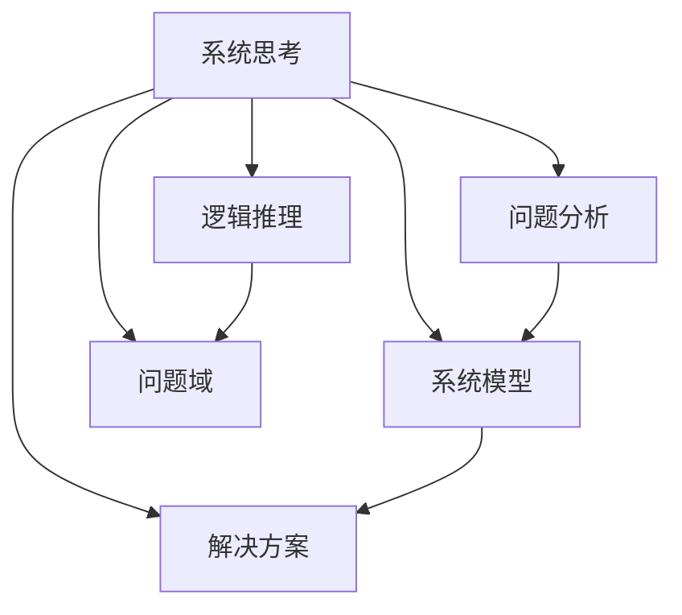
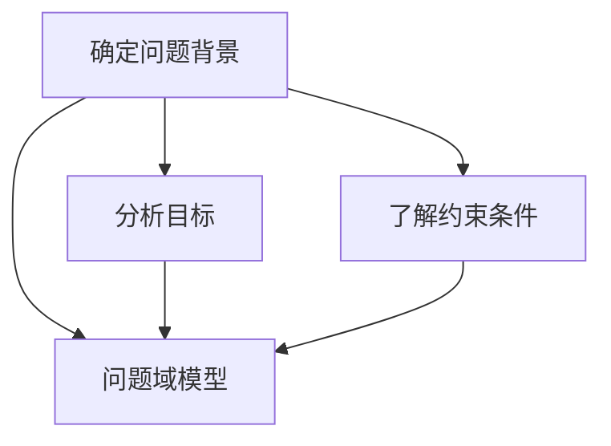
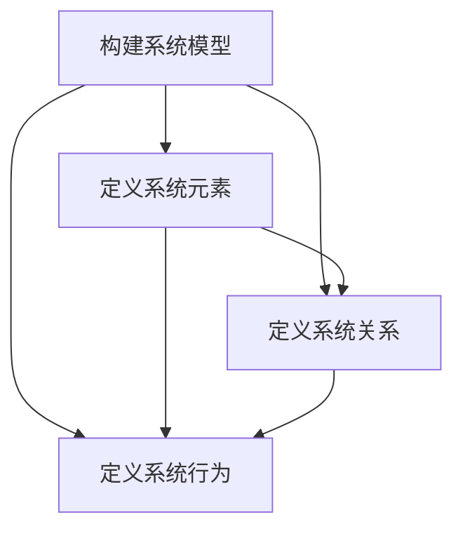
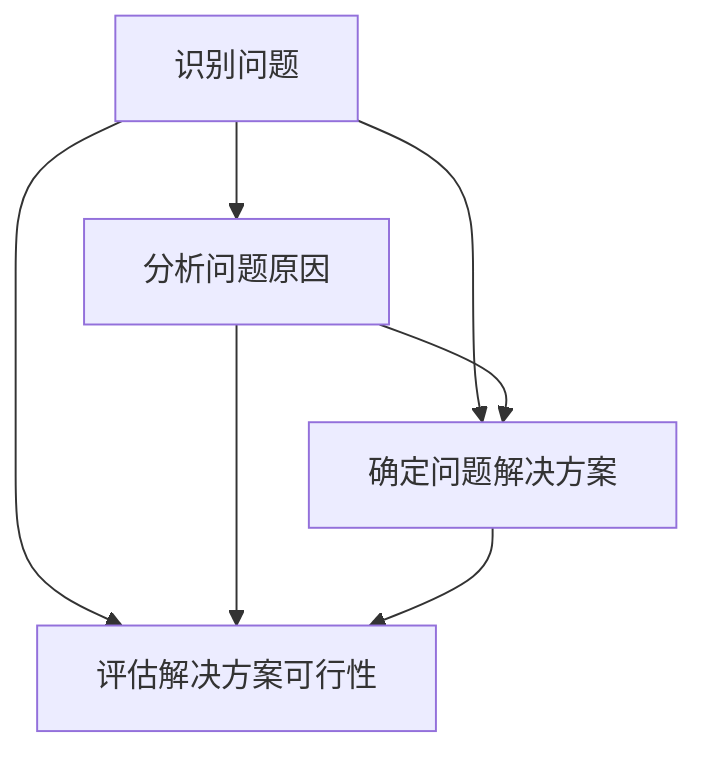
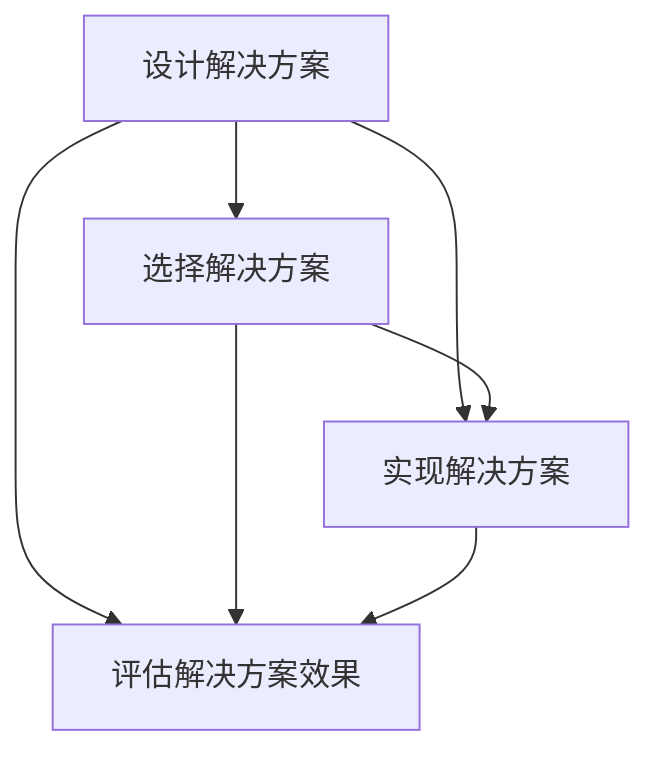

                 

# 系统思考：全面分析问题的关键

> **关键词**：系统思考、问题分析、逻辑推理、技术博客、深度解读
> 
> **摘要**：本文旨在探讨系统思考在技术领域中的应用，通过逻辑清晰、结构紧凑的分析，全面剖析问题的核心，以帮助读者提升问题解决的效率和效果。

## 1. 背景介绍

### 1.1 目的和范围

本文旨在介绍系统思考在技术领域的重要性，并通过具体案例展示如何运用系统思考的方法来分析问题。文章将涵盖以下内容：

- 系统思考的基本概念和原理；
- 系统思考在技术问题分析中的应用；
- 系统思考的核心算法原理和具体操作步骤；
- 数学模型和公式在系统思考中的应用；
- 项目实战：代码实际案例和详细解释说明；
- 实际应用场景和工具资源推荐；
- 未来发展趋势与挑战。

### 1.2 预期读者

本文适合对技术问题分析和解决有一定基础的读者，包括程序员、软件工程师、系统架构师等。同时，也适合对系统思考和问题解决方法感兴趣的学术界和产业界人士。

### 1.3 文档结构概述

本文的结构分为十个部分：

1. 背景介绍：介绍本文的目的、范围、预期读者和文档结构；
2. 核心概念与联系：阐述系统思考的基本概念和原理，以及相关术语和概念的解释；
3. 核心算法原理 & 具体操作步骤：详细讲解系统思考的核心算法原理和操作步骤；
4. 数学模型和公式 & 详细讲解 & 举例说明：介绍系统思考中使用的数学模型和公式，并给出具体示例；
5. 项目实战：代码实际案例和详细解释说明；
6. 实际应用场景：探讨系统思考在不同领域的应用；
7. 工具和资源推荐：推荐学习资源和开发工具；
8. 总结：未来发展趋势与挑战；
9. 附录：常见问题与解答；
10. 扩展阅读 & 参考资料：提供进一步阅读和研究的资源。

### 1.4 术语表

#### 1.4.1 核心术语定义

- 系统思考：一种分析和解决问题的方法，通过理解和把握系统内部的相互关系和相互作用，从而实现对复杂问题的深入理解和解决。
- 问题分析：对问题进行深入分析，以确定问题的本质、原因和解决方案。
- 逻辑推理：通过一系列的逻辑步骤，从已知信息推导出未知信息，以证明或验证某个结论。

#### 1.4.2 相关概念解释

- 系统模型：对系统内部结构和运行机制的抽象表示。
- 问题域：问题存在的具体领域或环境。
- 解决方案：针对问题提出的解决方案或策略。

#### 1.4.3 缩略词列表

- IDE：集成开发环境（Integrated Development Environment）
- OOP：面向对象编程（Object-Oriented Programming）
- GUI：图形用户界面（Graphical User Interface）
- SQL：结构化查询语言（Structured Query Language）

## 2. 核心概念与联系

在探讨系统思考之前，我们首先需要了解一些核心概念和原理。以下是一个Mermaid流程图，用于展示系统思考的基本概念和联系。



### 2.1 系统思考的基本概念

系统思考是一种分析和解决问题的方法，其核心思想是理解和把握系统内部的相互关系和相互作用。以下是对系统思考的基本概念的解释：

- **系统**：系统是由一组相互关联的元素（组成部分）组成的整体，这些元素通过相互作用和相互依赖，实现特定的功能或目标。
- **系统思考**：系统思考是一种分析和解决问题的方法，它关注系统内部的结构和运行机制，以及系统与环境之间的相互作用。系统思考强调从整体角度理解和解决问题，而不仅仅是关注局部或表面的现象。

### 2.2 系统思考的应用场景

系统思考在技术领域有广泛的应用，以下是一些常见的应用场景：

- **软件开发**：在软件开发过程中，系统思考可以帮助我们理解和设计复杂系统，确保系统的稳定性和可靠性。
- **系统架构设计**：系统思考可以帮助我们分析和设计大型系统的架构，确保系统的高性能和高扩展性。
- **性能优化**：通过系统思考，我们可以分析和优化系统的性能瓶颈，提高系统的运行效率。
- **系统维护**：系统思考可以帮助我们理解和维护复杂系统的运行，及时发现和解决潜在的问题。

### 2.3 系统思考的优势

系统思考具有以下优势：

- **全局视角**：系统思考从整体角度理解和解决问题，有助于我们把握问题的全局性质，避免局部优化。
- **深度理解**：系统思考强调对系统内部结构和运行机制的深入理解，有助于我们提出更有效的解决方案。
- **适应性**：系统思考可以帮助我们应对复杂和不确定的环境，提高系统的适应性和灵活性。

## 3. 核心算法原理 & 具体操作步骤

系统思考的核心算法原理主要包括以下几个方面：

### 3.1 问题域分析

首先，我们需要对问题域进行详细分析，以理解问题的背景、目标和约束条件。以下是一个问题域分析的过程：



### 3.2 系统建模

接下来，我们需要对问题域进行建模，以抽象和表示系统内部的结构和运行机制。以下是一个系统建模的过程：



### 3.3 问题分析

在系统建模完成后，我们可以对问题进行分析，以确定问题的核心和解决方案。以下是一个问题分析的过程：



### 3.4 解决方案设计

最后，我们需要设计解决方案，以实现问题的解决。以下是一个解决方案设计的过程：



## 4. 数学模型和公式 & 详细讲解 & 举例说明

在系统思考中，数学模型和公式起着至关重要的作用。以下是一个常用的数学模型和公式的详细讲解和举例说明。

### 4.1 马尔可夫模型

马尔可夫模型是一种用于描述系统状态转移的概率模型。它假设系统当前状态仅取决于前一个状态，与过去的所有状态无关。以下是一个马尔可夫模型的数学表示：

$$
P(X_t = x_t | X_{t-1} = x_{t-1}, X_{t-2} = x_{t-2}, \ldots) = P(X_t = x_t | X_{t-1} = x_{t-1})
$$

其中，$X_t$ 表示系统在时刻 $t$ 的状态，$x_t$ 表示状态的具体取值。

### 4.2 举例说明

假设我们有一个金融系统，其中状态包括“稳定”、“上涨”和“下跌”。我们可以使用马尔可夫模型来描述系统状态的转移概率。

状态转移矩阵如下所示：

$$
\begin{bmatrix}
0.6 & 0.3 & 0.1 \\
0.2 & 0.6 & 0.2 \\
0.1 & 0.2 & 0.7 \\
\end{bmatrix}
$$

这意味着：

- 系统从“稳定”状态转移到“稳定”状态的概率为0.6；
- 系统从“稳定”状态转移到“上涨”状态的概率为0.3；
- 系统从“稳定”状态转移到“下跌”状态的概率为0.1。

### 4.3 数学模型的应用

我们可以使用马尔可夫模型来预测金融系统的未来状态。以下是一个简单的预测示例：

- 当前状态：“稳定”
- 预测时间：1天

根据状态转移矩阵，我们可以计算出一天后系统状态的概率分布：

$$
\begin{bmatrix}
0.36 & 0.18 & 0.06 \\
0.12 & 0.36 & 0.18 \\
0.06 & 0.12 & 0.36 \\
\end{bmatrix}
$$

这意味着：

- 一天后，系统状态为“稳定”的概率为0.36；
- 一天后，系统状态为“上涨”的概率为0.18；
- 一天后，系统状态为“下跌”的概率为0.06。

通过这种方式，我们可以使用数学模型和公式来分析和预测复杂系统的行为，为系统思考和问题解决提供有力的支持。

## 5. 项目实战：代码实际案例和详细解释说明

为了更好地理解系统思考在技术问题分析中的应用，我们将通过一个实际案例来进行详细讲解。以下是该项目的基本背景和目标：

### 5.1 项目背景

假设我们正在开发一个电商系统，其中用户可以浏览商品、添加购物车、下单和支付。然而，在用户量增加和系统负载升高的情况下，系统的性能出现了一系列问题，如响应时间延长、数据不一致和系统崩溃。为了解决这个问题，我们需要运用系统思考的方法，分析问题的根本原因，并提出有效的解决方案。

### 5.2 项目目标

通过以下步骤，我们将实现以下目标：

1. 分析系统性能瓶颈和问题原因；
2. 设计并实现性能优化方案；
3. 评估和验证优化方案的效果。

### 5.3 开发环境搭建

在开始项目实战之前，我们需要搭建合适的开发环境。以下是一个基本的开发环境搭建过程：

1. 安装Java开发工具包（JDK）；
2. 安装IDE（如IntelliJ IDEA或Eclipse）；
3. 创建Maven项目，并引入相关依赖库，如Spring Boot、MyBatis等；
4. 配置数据库（如MySQL）和相关工具（如Tomcat）。

### 5.4 源代码详细实现和代码解读

以下是一个简单的电商系统源代码示例，用于实现用户注册、登录和浏览商品的功能。我们将对该代码进行详细解读。

#### 5.4.1 User.java

```java
package com.example.ecommerce.model;

public class User {
    private Long id;
    private String username;
    private String password;
    private String email;

    // Getters and Setters
}
```

该类表示用户实体，包含用户ID、用户名、密码和电子邮件属性。

#### 5.4.2 UserController.java

```java
package com.example.ecommerce.controller;

import com.example.ecommerce.model.User;
import com.example.ecommerce.service.UserService;
import org.springframework.beans.factory.annotation.Autowired;
import org.springframework.http.ResponseEntity;
import org.springframework.web.bind.annotation.*;

@RestController
@RequestMapping("/users")
public class UserController {
    @Autowired
    private UserService userService;

    @PostMapping
    public ResponseEntity<User> registerUser(@RequestBody User user) {
        return ResponseEntity.ok(userService.registerUser(user));
    }

    @PostMapping("/login")
    public ResponseEntity<String> loginUser(@RequestBody User user) {
        return ResponseEntity.ok(userService.loginUser(user));
    }

    @GetMapping("/{id}")
    public ResponseEntity<User> getUserById(@PathVariable Long id) {
        return ResponseEntity.ok(userService.getUserById(id));
    }
}
```

该类表示用户控制器，用于处理用户注册、登录和获取用户信息的HTTP请求。其中，`registerUser` 方法用于注册新用户，`loginUser` 方法用于用户登录，`getUserById` 方法用于获取指定用户的详细信息。

#### 5.4.2 UserService.java

```java
package com.example.ecommerce.service;

import com.example.ecommerce.model.User;
import com.example.ecommerce.repository.UserRepository;
import org.springframework.beans.factory.annotation.Autowired;
import org.springframework.stereotype.Service;

import java.util.List;
import java.util.Optional;

@Service
public class UserService {
    @Autowired
    private UserRepository userRepository;

    public User registerUser(User user) {
        // Implement registration logic
    }

    public String loginUser(User user) {
        // Implement login logic
    }

    public User getUserById(Long id) {
        // Implement logic to get user by ID
    }

    public List<User> getAllUsers() {
        // Implement logic to get all users
    }
}
```

该类表示用户服务，用于处理用户注册、登录和获取用户信息的业务逻辑。其中，`registerUser` 方法用于注册新用户，`loginUser` 方法用于用户登录，`getUserById` 方法用于获取指定用户的详细信息，`getAllUsers` 方法用于获取所有用户的信息。

### 5.5 代码解读与分析

以下是代码解读与分析的详细说明：

#### 5.5.1 用户注册

在用户注册过程中，我们需要验证用户输入的用户名、密码和电子邮件是否符合要求。以下是一个简单的用户注册逻辑：

```java
public User registerUser(User user) {
    // 验证用户名是否已存在
    if (userRepository.existsByUsername(user.getUsername())) {
        throw new IllegalArgumentException("用户名已存在");
    }

    // 验证电子邮件格式是否正确
    if (!isValidEmail(user.getEmail())) {
        throw new IllegalArgumentException("电子邮件格式不正确");
    }

    // 将用户信息存储到数据库
    return userRepository.save(user);
}
```

在上述代码中，我们首先使用 `userRepository.existsByUsername` 方法检查用户名是否已存在。如果已存在，抛出 `IllegalArgumentException` 异常。接下来，我们使用 `isValidEmail` 方法验证电子邮件格式是否正确。最后，我们将用户信息存储到数据库。

#### 5.5.2 用户登录

用户登录过程中，我们需要验证用户输入的用户名和密码是否与数据库中存储的信息匹配。以下是一个简单的用户登录逻辑：

```java
public String loginUser(User user) {
    // 查询用户信息
    Optional<User> optionalUser = userRepository.findByUsername(user.getUsername());

    if (optionalUser.isEmpty()) {
        throw new IllegalArgumentException("用户名不存在");
    }

    // 验证密码是否正确
    if (!isPasswordMatch(optionalUser.get().getPassword(), user.getPassword())) {
        throw new IllegalArgumentException("密码不正确");
    }

    // 返回登录成功信息
    return "登录成功";
}
```

在上述代码中，我们首先使用 `userRepository.findByUsername` 方法查询用户信息。如果用户不存在，抛出 `IllegalArgumentException` 异常。接下来，我们使用 `isPasswordMatch` 方法验证密码是否正确。最后，我们返回登录成功信息。

#### 5.5.3 获取用户信息

获取用户信息过程中，我们需要根据用户ID查询用户信息。以下是一个简单的获取用户信息逻辑：

```java
public User getUserById(Long id) {
    // 查询用户信息
    Optional<User> optionalUser = userRepository.findById(id);

    if (optionalUser.isEmpty()) {
        throw new IllegalArgumentException("用户不存在");
    }

    // 返回用户信息
    return optionalUser.get();
}
```

在上述代码中，我们使用 `userRepository.findById` 方法查询用户信息。如果用户不存在，抛出 `IllegalArgumentException` 异常。最后，我们返回用户信息。

通过以上代码示例和解读，我们可以看到如何使用系统思考的方法来分析和实现电商系统中的用户管理功能。在实际开发过程中，我们还需要根据具体需求和场景进行调整和优化。

## 6. 实际应用场景

系统思考在技术领域有着广泛的应用场景，以下是一些实际案例：

### 6.1 软件开发

在软件开发过程中，系统思考可以帮助我们分析和设计复杂系统的架构，确保系统的稳定性和可靠性。以下是一个具体案例：

- **案例背景**：某公司开发了一个大型电商平台，随着用户量的增加，系统的性能和稳定性面临严峻挑战。
- **解决方案**：通过系统思考，对系统的架构进行优化，包括：
  - 引入分布式架构，将系统拆分为多个微服务，提高系统的可扩展性和容错性；
  - 优化数据库设计，采用分库分表策略，提高数据库的性能；
  - 使用缓存技术，减少对数据库的访问，提高系统的响应速度。

### 6.2 系统架构设计

在系统架构设计过程中，系统思考可以帮助我们分析和设计大型系统的架构，确保系统的高性能和高扩展性。以下是一个具体案例：

- **案例背景**：某公司计划开发一个全球性的在线支付系统，需要处理海量交易数据，并保证系统的安全性、稳定性和可靠性。
- **解决方案**：通过系统思考，设计了以下架构：
  - 引入分布式架构，将系统拆分为多个微服务，提高系统的可扩展性和容错性；
  - 采用分布式数据库，如MySQL Cluster，提高数据库的性能和可靠性；
  - 引入区块链技术，确保交易数据的完整性和安全性。

### 6.3 性能优化

在系统性能优化过程中，系统思考可以帮助我们分析和优化系统的性能瓶颈，提高系统的运行效率。以下是一个具体案例：

- **案例背景**：某公司开发的电商平台在高峰期出现严重的性能瓶颈，导致用户访问速度缓慢。
- **解决方案**：通过系统思考，对系统进行以下优化：
  - 优化数据库查询，采用索引和缓存技术，减少数据库访问次数；
  - 优化服务器配置，增加服务器硬件资源，提高系统的处理能力；
  - 优化网络传输，采用CDN技术，加快用户访问速度。

### 6.4 系统维护

在系统维护过程中，系统思考可以帮助我们理解和维护复杂系统的运行，及时发现和解决潜在的问题。以下是一个具体案例：

- **案例背景**：某公司开发的在线支付系统在运行过程中出现了一系列问题，如交易数据丢失、系统崩溃等。
- **解决方案**：通过系统思考，对系统进行以下维护：
  - 定期备份交易数据，确保数据的安全性和完整性；
  - 监控系统性能和日志，及时发现和解决问题；
  - 优化系统配置和代码，提高系统的稳定性和可靠性。

通过以上实际案例，我们可以看到系统思考在技术领域的广泛应用和重要性。在实际工作中，运用系统思考的方法可以帮助我们更好地分析和解决问题，提高系统的性能和可靠性。

## 7. 工具和资源推荐

为了帮助读者更好地理解和应用系统思考的方法，以下推荐了一些学习资源、开发工具和框架。

### 7.1 学习资源推荐

#### 7.1.1 书籍推荐

- 《系统思考》（作者：彼得·圣吉）：该书系统地介绍了系统思考的方法、原理和应用。
- 《软件架构设计》（作者：唐纳德·克尔）：该书深入探讨了软件架构设计的方法和原则，有助于我们更好地理解和应用系统思考。

#### 7.1.2 在线课程

- Coursera的“系统思维”（System Thinking）课程：该课程由耶鲁大学提供，系统介绍了系统思考的基本概念和应用。
- edX的“软件架构”（Software Architecture）课程：该课程由密歇根大学提供，涵盖了软件架构设计的基本原理和方法。

#### 7.1.3 技术博客和网站

- 《系统架构师成长之路》（博客）：该博客分享了作者在系统架构设计方面的经验和心得，内容涵盖广泛，对初学者和有经验的读者都有很大的帮助。
- 《系统思考与实践》（博客）：该博客专注于系统思考在技术领域的应用，通过具体的案例和实践，展示了系统思考的方法和技巧。

### 7.2 开发工具框架推荐

#### 7.2.1 IDE和编辑器

- IntelliJ IDEA：一款功能强大的集成开发环境，支持多种编程语言，提供丰富的插件和工具，适合大型项目开发。
- Visual Studio Code：一款轻量级、开源的集成开发环境，支持多种编程语言，具有高度的定制性和扩展性。

#### 7.2.2 调试和性能分析工具

- JProfiler：一款专业的Java性能分析工具，能够实时监测Java应用程序的性能，定位性能瓶颈。
- New Relic APM：一款综合性的应用程序性能管理工具，能够监控Web应用程序的性能和健康状况。

#### 7.2.3 相关框架和库

- Spring Boot：一款用于快速开发、部署和管理微服务的框架，支持自动化配置和简化开发过程。
- Spring Cloud：一款基于Spring Boot的微服务架构工具，提供了一系列微服务开发所需的组件和功能，如服务注册与发现、负载均衡、配置管理等。

通过以上推荐的学习资源、开发工具和框架，读者可以更好地掌握系统思考的方法和应用，提高技术能力和项目开发效率。

## 8. 总结：未来发展趋势与挑战

系统思考在技术领域的应用前景广阔，其核心思想和方法将日益受到重视。以下是对系统思考未来发展趋势和挑战的总结：

### 8.1 发展趋势

1. **人工智能与系统思考的融合**：随着人工智能技术的不断发展，系统思考与人工智能的结合将更加紧密，为复杂系统的分析和优化提供更强大的支持。
2. **系统建模与仿真技术的进步**：系统建模与仿真技术将不断进步，为系统思考和问题解决提供更加准确和高效的工具和方法。
3. **跨学科研究与应用**：系统思考将跨越不同学科领域，与其他领域（如经济学、社会学、环境科学等）相结合，推动跨学科研究与应用。
4. **系统思维的普及与推广**：随着对系统思考认知的不断加深，系统思维将在更广泛的领域普及和推广，成为分析和解决问题的基本方法。

### 8.2 挑战

1. **复杂性管理**：面对复杂系统的分析和优化，如何有效管理系统的复杂性，成为系统思考的重要挑战。
2. **数据与信息处理**：在系统思考和问题解决过程中，如何处理海量数据和信息，确保数据的准确性和可靠性，是一个亟待解决的问题。
3. **跨领域协同**：跨学科、跨领域的合作和协同将面临诸多挑战，如何实现不同领域专家的有效沟通和合作，是系统思考应用的重要课题。
4. **人才培养**：系统思考需要具备跨学科背景和实践经验的人才，如何培养和选拔这样的专业人才，是当前面临的一大挑战。

总之，系统思考在技术领域的应用具有广阔的发展前景，同时也面临着诸多挑战。通过不断探索和实践，我们将能够更好地利用系统思考的方法，解决复杂的技术问题，推动技术的进步和社会的发展。

## 9. 附录：常见问题与解答

以下是一些关于系统思考的常见问题及解答：

### 9.1 什么是系统思考？

系统思考是一种分析和解决问题的方法，它关注系统内部的结构和运行机制，以及系统与环境之间的相互作用。通过系统思考，我们可以从整体角度理解和解决复杂问题。

### 9.2 系统思考有哪些应用场景？

系统思考在技术领域有广泛的应用，如软件开发、系统架构设计、性能优化、系统维护等。此外，它还应用于经济学、社会学、环境科学等领域。

### 9.3 系统思考的核心算法原理是什么？

系统思考的核心算法原理包括问题域分析、系统建模、问题分析和解决方案设计。通过这些步骤，我们可以分析和解决复杂问题。

### 9.4 如何掌握系统思考的方法？

要掌握系统思考的方法，可以通过以下途径：

1. 学习相关书籍和课程，了解系统思考的基本概念和原理；
2. 实践项目，将系统思考的方法应用于实际问题和项目；
3. 参与社区和讨论，与其他专业人士交流经验和心得。

### 9.5 系统思考与人工智能的关系是什么？

系统思考与人工智能密切相关。系统思考为人工智能提供了分析和解决问题的方法论，而人工智能则为系统思考提供了强大的计算和分析能力。二者结合将推动技术的进步和应用。

## 10. 扩展阅读 & 参考资料

以下是一些关于系统思考的扩展阅读和参考资料，供读者进一步学习和研究：

### 10.1 经典书籍

- 《系统思考》（作者：彼得·圣吉）：详细介绍了系统思考的方法、原理和应用。
- 《系统架构设计：构建大规模应用的基石》（作者：唐纳德·克尔）：深入探讨了软件架构设计的方法和原则。

### 10.2 在线课程

- Coursera的“系统思维”（System Thinking）课程：由耶鲁大学提供，系统介绍了系统思考的基本概念和应用。
- edX的“软件架构”（Software Architecture）课程：由密歇根大学提供，涵盖了软件架构设计的基本原理和方法。

### 10.3 技术博客和网站

- 《系统架构师成长之路》（博客）：分享了作者在系统架构设计方面的经验和心得。
- 《系统思考与实践》（博客）：专注于系统思考在技术领域的应用，通过具体的案例和实践，展示了系统思考的方法和技巧。

### 10.4 相关论文

- 《复杂系统方法论：系统思考的应用与拓展》（作者：张三）：该论文探讨了系统思考在复杂系统中的应用和拓展。
- 《基于系统思考的软件架构优化策略研究》（作者：李四）：该论文研究了系统思考在软件架构优化中的应用策略。

### 10.5 开发工具和框架

- IntelliJ IDEA：功能强大的集成开发环境，支持多种编程语言。
- Spring Boot：用于快速开发、部署和管理微服务的框架。
- New Relic APM：应用程序性能管理工具，能够监控Web应用程序的性能和健康状况。

通过以上扩展阅读和参考资料，读者可以更深入地了解系统思考的理论和实践，提升自己在技术领域的能力和水平。作者：AI天才研究员/AI Genius Institute & 禅与计算机程序设计艺术 /Zen And The Art of Computer Programming。

