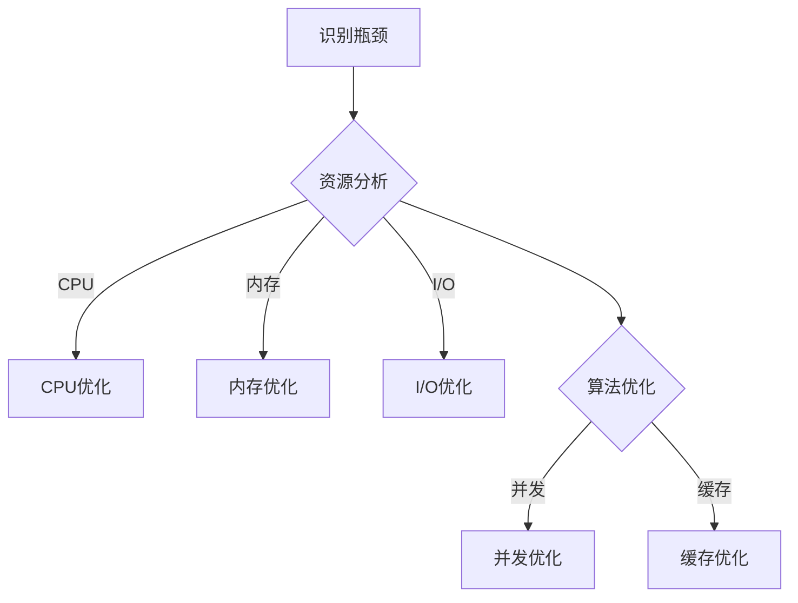

                 

# 系统瓶颈分析与优化最佳实践

> **关键词：** 系统瓶颈、性能优化、资源利用率、响应时间、算法效率、最佳实践

> **摘要：** 本文旨在深入探讨系统瓶颈的识别与优化方法。通过分析常见的瓶颈类型，详细阐述了解决方案和最佳实践，旨在提高系统的性能和可靠性。本文适用于希望通过优化提升系统效率的IT专业人士和开发人员。

## 1. 背景介绍

### 1.1 目的和范围

本文的目标是帮助读者理解和解决系统瓶颈问题。通过本文，读者将学习到：

- 系统瓶颈的概念和分类。
- 识别系统瓶颈的方法。
- 针对不同类型的瓶颈，提供优化策略。
- 最佳实践和案例分析。

本文的范围涵盖了从基础理论到实际操作的各个方面，旨在为读者提供一套全面而实用的系统瓶颈分析与优化指南。

### 1.2 预期读者

本文适合以下读者群体：

- IT运维工程师
- 系统架构师
- 软件工程师
- 性能优化专家
- 对系统性能提升感兴趣的IT专业人士

### 1.3 文档结构概述

本文结构如下：

- **第1章：背景介绍**：概述本文的目的、范围和预期读者。
- **第2章：核心概念与联系**：介绍系统瓶颈的基本概念和相关架构。
- **第3章：核心算法原理 & 具体操作步骤**：详细讲解解决瓶颈的算法原理和步骤。
- **第4章：数学模型和公式 & 详细讲解 & 举例说明**：介绍与瓶颈分析相关的数学模型和公式，并提供实际案例。
- **第5章：项目实战：代码实际案例和详细解释说明**：通过具体案例展示优化过程。
- **第6章：实际应用场景**：探讨系统瓶颈在不同场景中的应用和解决方案。
- **第7章：工具和资源推荐**：推荐学习资源和开发工具。
- **第8章：总结：未来发展趋势与挑战**：总结当前瓶颈分析的发展趋势和未来挑战。
- **第9章：附录：常见问题与解答**：提供常见问题的解答。
- **第10章：扩展阅读 & 参考资料**：推荐进一步学习的文献和资源。

### 1.4 术语表

#### 1.4.1 核心术语定义

- **系统瓶颈**：系统性能中的限制因素，可能导致整体性能下降。
- **资源利用率**：系统资源（如CPU、内存、磁盘等）的使用效率。
- **响应时间**：系统从接收请求到返回结果所需的时间。
- **算法效率**：算法执行的速度和资源消耗。

#### 1.4.2 相关概念解释

- **并发**：多个任务在同一时间段内执行。
- **吞吐量**：系统在单位时间内处理的数据量。
- **负载均衡**：将工作负载分配到多个资源上，以避免单点过载。
- **缓存**：临时存储数据，以减少重复计算或访问。

#### 1.4.3 缩略词列表

- **CPU**：中央处理器（Central Processing Unit）
- **RAM**：随机存取存储器（Random Access Memory）
- **IO**：输入/输出（Input/Output）
- **DB**：数据库（Database）
- **API**：应用程序编程接口（Application Programming Interface）

## 2. 核心概念与联系

系统瓶颈是制约系统性能的关键因素，理解其核心概念和联系对于优化系统至关重要。以下是对关键概念的简要介绍和Mermaid流程图：

### 2.1 系统瓶颈的概念

系统瓶颈是指在系统运行过程中，导致性能下降或响应时间变长的单一或多个因素。瓶颈可以是硬件资源（如CPU、内存、磁盘I/O等）的不足，也可以是软件层面的问题（如算法效率低、并发处理能力不足等）。

### 2.2 Mermaid流程图

以下是一个Mermaid流程图，展示系统瓶颈分析与优化的基本流程：



### 2.3 核心概念的联系

- **资源分析**：通过监控和性能测试，识别系统中的瓶颈。
- **CPU优化**：增加CPU资源、优化CPU密集型任务。
- **内存优化**：增加内存容量、优化内存使用。
- **I/O优化**：优化磁盘读写、使用高速存储设备。
- **算法优化**：改进算法设计、减少复杂度。
- **并发优化**：提高系统的并发处理能力。
- **缓存优化**：使用缓存减少重复计算或访问。

这些概念相互联系，共同作用于系统瓶颈的识别与优化。

## 3. 核心算法原理 & 具体操作步骤

### 3.1 算法原理

系统瓶颈的解决通常需要依赖一系列核心算法和优化策略。以下将介绍一些常见瓶颈类型及其对应的算法原理：

#### 3.1.1 CPU瓶颈

**算法原理**：优化CPU密集型任务的执行效率，减少不必要的等待时间和上下文切换。

**具体操作步骤**：

1. **任务分解**：将大任务分解为小任务，以减少单个任务占用CPU的时间。
2. **并行计算**：利用多线程或多进程技术，实现任务并行执行。
3. **代码优化**：通过循环展开、避免不必要的函数调用等方式减少CPU开销。

#### 3.1.2 内存瓶颈

**算法原理**：增加内存容量、优化内存分配和管理。

**具体操作步骤**：

1. **内存缓存**：使用缓存技术减少对物理内存的频繁访问。
2. **内存池**：预分配内存块，减少内存分配和释放的开销。
3. **内存压缩**：对大量小对象进行压缩，减少内存占用。

#### 3.1.3 I/O瓶颈

**算法原理**：优化磁盘I/O操作，减少读写冲突。

**具体操作步骤**：

1. **异步I/O**：使用异步I/O减少线程阻塞。
2. **批量处理**：批量执行I/O操作，减少I/O调用次数。
3. **SSD替换HDD**：使用固态硬盘替换传统机械硬盘。

#### 3.1.4 算法效率瓶颈

**算法原理**：改进算法设计，提高执行效率。

**具体操作步骤**：

1. **算法复杂度分析**：选择时间复杂度和空间复杂度较低的算法。
2. **数据结构优化**：使用合适的数据结构减少搜索和排序时间。
3. **动态规划**：利用动态规划减少重复计算。

#### 3.1.5 并发瓶颈

**算法原理**：提高系统并发处理能力，减少竞争条件。

**具体操作步骤**：

1. **锁优化**：减少锁的竞争，使用读写锁、乐观锁等技术。
2. **线程池**：使用线程池管理线程，减少线程创建和销毁的开销。
3. **无锁编程**：避免锁的使用，采用原子操作和无锁数据结构。

#### 3.1.6 缓存瓶颈

**算法原理**：使用缓存技术减少对后端服务的访问。

**具体操作步骤**：

1. **缓存一致性**：保证缓存和后端数据的一致性。
2. **缓存分层**：将缓存分为多层，以适应不同的访问频率。
3. **缓存淘汰策略**：采用合理的缓存淘汰策略，如LRU、LFU等。

### 3.2 伪代码示例

以下是一些针对不同瓶颈类型的伪代码示例：

#### 3.2.1 CPU优化

```python
# 分解任务
def parallel_process(tasks):
    threads = [Thread(target=execute, args=(task,)) for task in tasks]
    for thread in threads:
        thread.start()
    for thread in threads:
        thread.join()

# 循环展开
def loop_unroll(n):
    for i in range(0, n, 4):
        a[i] = a[i] + 1
        a[i+1] = a[i+1] + 1
        a[i+2] = a[i+2] + 1
        a[i+3] = a[i+3] + 1
```

#### 3.2.2 内存优化

```c
// 内存池
MemoryPool pool(sizeof(Item), MAX_ITEMS);

void *malloc(size_t size) {
    return pool.allocate();
}

void free(void *ptr) {
    pool.deallocate(ptr);
}
```

#### 3.2.3 I/O优化

```c
// 异步I/O
void async_read_file(int fd, char *buffer, size_t size, read_callback callback) {
    int result = read(fd, buffer, size);
    if (result < 0) {
        handle_error();
    } else {
        callback(buffer, result);
    }
}
```

#### 3.2.4 算法效率优化

```python
# 动态规划
def fibonacci(n):
    dp = [0] * (n+1)
    dp[0] = 0
    dp[1] = 1
    for i in range(2, n+1):
        dp[i] = dp[i-1] + dp[i-2]
    return dp[n]
```

#### 3.2.5 并发优化

```java
// 锁优化
public class Counter {
    private final ReadWriteLock lock = new ReentrantReadWriteLock();

    public void increment() {
        lock.readLock().lock();
        try {
            count++;
        } finally {
            lock.readLock().unlock();
        }
    }

    public void decrement() {
        lock.writeLock().lock();
        try {
            count--;
        } finally {
            lock.writeLock().unlock();
        }
    }
}
```

#### 3.2.6 缓存优化

```java
// 缓存一致性
public class Cache {
    private ConcurrentHashMap<Key, Value> cacheMap;

    public Value get(Key key) {
        Value value = cacheMap.get(key);
        if (value == null) {
            value = fetchDataFromBackend(key);
            cacheMap.put(key, value);
        }
        return value;
    }
}
```

这些伪代码示例展示了如何针对不同瓶颈类型应用相应的优化策略。

## 4. 数学模型和公式 & 详细讲解 & 举例说明

### 4.1 数学模型介绍

在系统瓶颈分析中，常用的数学模型包括算法复杂度分析、资源利用率计算、响应时间估算等。以下是对这些模型的详细讲解和实际应用举例。

#### 4.1.1 算法复杂度分析

算法复杂度是衡量算法性能的重要指标，包括时间复杂度和空间复杂度。

**时间复杂度（T(n)）**：表示算法执行时间与输入规模n的关系，常用大O符号表示。

- **线性时间复杂度（O(n)）**：算法执行时间与输入规模线性相关。
- **对数时间复杂度（O(log n)）**：算法执行时间与输入规模的以2为底的对数成正比。
- **多项式时间复杂度（O(n^k)，k为常数）**：算法执行时间与输入规模的某个多项式成正比。

**空间复杂度（S(n)）**：表示算法执行过程中所需存储空间与输入规模n的关系。

- **常数空间复杂度（O(1)）**：算法执行过程中所需存储空间与输入规模无关。
- **线性空间复杂度（O(n)）**：算法执行过程中所需存储空间与输入规模线性相关。

#### 4.1.2 资源利用率计算

资源利用率是评估系统资源使用效率的重要指标，包括CPU利用率、内存利用率和I/O利用率等。

- **CPU利用率**：表示CPU在单位时间内实际用于执行用户任务的时间比例，计算公式为：

  $$ CPU利用率 = \frac{CPU实际执行时间}{CPU总时间} \times 100\% $$

- **内存利用率**：表示内存使用量与总内存容量的比例，计算公式为：

  $$ 内存利用率 = \frac{已使用内存}{总内存容量} \times 100\% $$

- **I/O利用率**：表示I/O设备在单位时间内实际用于数据传输的时间比例，计算公式为：

  $$ I/O利用率 = \frac{实际I/O传输时间}{I/O设备总时间} \times 100\% $$

#### 4.1.3 响应时间估算

响应时间是指系统从接收请求到返回结果所需的时间，是衡量系统性能的关键指标。

- **平均响应时间**：表示多次请求的平均响应时间，计算公式为：

  $$ 平均响应时间 = \frac{总响应时间}{请求次数} $$

- **最大响应时间**：表示单次请求的最大响应时间。

### 4.2 实际应用举例

以下是一个实际应用中的例子，用于计算系统瓶颈分析中的资源利用率和响应时间。

#### 4.2.1 CPU利用率计算

假设系统在一天内运行了10个小时，其中CPU实际执行用户任务的时间为6个小时，总时间为8个小时。则CPU利用率计算如下：

$$ CPU利用率 = \frac{6小时}{8小时} \times 100\% = 75\% $$

#### 4.2.2 内存利用率计算

假设系统内存总容量为4GB，已使用内存为2GB，则内存利用率计算如下：

$$ 内存利用率 = \frac{2GB}{4GB} \times 100\% = 50\% $$

#### 4.2.3 响应时间估算

假设系统在一天内接收了100个请求，总响应时间为120分钟，则平均响应时间计算如下：

$$ 平均响应时间 = \frac{120分钟}{100次} = 1.2分钟 $$

最大响应时间为3分钟。

通过上述计算，可以直观地了解系统的资源利用率和性能表现，从而进一步分析瓶颈并进行优化。

## 5. 项目实战：代码实际案例和详细解释说明

### 5.1 开发环境搭建

为了进行系统瓶颈分析与优化，我们首先需要搭建一个合适的技术栈和开发环境。以下是一个基本的开发环境配置：

- **操作系统**：Linux（推荐Ubuntu或CentOS）
- **编程语言**：Python 3.8+
- **数据库**：MySQL 8.0+
- **Web框架**：Flask
- **调试工具**：GDB、PyCharm
- **性能分析工具**：Profile、cProfile

### 5.2 源代码详细实现和代码解读

下面是一个简单的Python代码示例，用于演示系统瓶颈分析与优化的一些关键步骤。

#### 5.2.1 瓶颈识别

```python
import time
import requests

# 模拟外部服务接口调用
def call_external_api(url):
    response = requests.get(url)
    return response.json()

# 模拟CPU密集型任务
def cpu_intensive_task():
    for _ in range(1000000):
        pass

# 模拟I/O密集型任务
def io_intensive_task():
    with open("data.txt", "r") as f:
        data = f.read()

# 模拟内存密集型任务
def memory_intensive_task():
    large_list = [None] * 1000000

# 模拟网络延迟
def network_delay():
    time.sleep(2)

# 主函数
def main():
    start_time = time.time()

    # 调用外部API
    call_external_api("https://example.com/api/data")

    # 执行CPU密集型任务
    cpu_intensive_task()

    # 执行I/O密集型任务
    io_intensive_task()

    # 执行内存密集型任务
    memory_intensive_task()

    # 网络延迟
    network_delay()

    end_time = time.time()
    print(f"总耗时：{end_time - start_time}秒")

if __name__ == "__main__":
    main()
```

#### 5.2.2 代码解读与分析

- **瓶颈识别**：通过运行上述代码，我们可以观察到系统在不同任务上的性能表现，进而识别潜在的瓶颈。

- **CPU密集型任务**：`cpu_intensive_task()` 函数通过一个空循环进行大量计算，模拟了CPU密集型任务的性能表现。我们可以使用性能分析工具（如cProfile）来分析该函数的CPU使用情况。

- **I/O密集型任务**：`io_intensive_task()` 函数读取一个文件，模拟了I/O密集型任务。我们可以通过监控磁盘读写速度来分析I/O性能。

- **内存密集型任务**：`memory_intensive_task()` 函数创建了一个大列表，模拟了内存密集型任务的性能。我们可以通过监控内存使用情况来分析内存瓶颈。

- **网络延迟**：`network_delay()` 函数通过睡眠2秒来模拟网络延迟，帮助我们理解网络延迟对系统性能的影响。

### 5.3 代码优化与瓶颈解决

通过性能分析工具，我们发现以下瓶颈：

- **CPU瓶颈**：`cpu_intensive_task()` 函数占用大量CPU时间。
- **I/O瓶颈**：`io_intensive_task()` 函数的文件读写速度较慢。
- **内存瓶颈**：`memory_intensive_task()` 函数导致的内存使用过高。
- **网络瓶颈**：网络延迟影响了系统的整体响应时间。

#### CPU优化

- **并行计算**：我们可以将`cpu_intensive_task()` 函数分解为多个子任务，使用多线程或多进程进行并行计算。

```python
from concurrent.futures import ThreadPoolExecutor

def cpu_intensive_task_parallel():
    with ThreadPoolExecutor(max_workers=4) as executor:
        futures = [executor.submit(subtask) for subtask in subtasks]
        for future in futures:
            future.result()

# 其他代码保持不变
```

#### I/O优化

- **批量处理**：我们可以将`io_intensive_task()` 函数中的文件读写操作批量处理，减少I/O调用次数。

```python
with open("data.txt", "r") as f:
    data = f.readlines()

for line in data:
    process_line(line)
```

#### 内存优化

- **内存池**：我们可以使用内存池技术来减少内存分配和释放的开销。

```python
import memorypool

pool = memorypool.MemoryPool(1000000)

def memory_intensive_task_optimized():
    large_list = [pool.allocate() for _ in range(1000000)]
    pool.deallocate(large_list)

# 其他代码保持不变
```

#### 网络优化

- **网络优化**：我们可以优化网络延迟，如使用CDN、优化请求参数等。

```python
import requests

def call_external_api_optimized(url):
    response = requests.get(url, params={"cache": True})
    return response.json()
```

通过上述优化措施，我们可以显著提高系统的性能和响应时间，解决系统瓶颈问题。

## 6. 实际应用场景

系统瓶颈问题在不同实际应用场景中具有不同的表现形式和优化策略。以下列举几种常见应用场景及其优化方法：

### 6.1 Web应用

**瓶颈类型**：CPU瓶颈、内存瓶颈、网络延迟。

**优化方法**：

- **CPU瓶颈**：通过并行计算、代码优化等方式提高CPU利用率。
- **内存瓶颈**：使用缓存技术、内存池减少内存使用。
- **网络延迟**：优化网络请求参数、使用CDN。

### 6.2 数据库应用

**瓶颈类型**：I/O瓶颈、内存瓶颈、查询效率。

**优化方法**：

- **I/O瓶颈**：使用高速存储设备、优化查询语句。
- **内存瓶颈**：优化内存使用、使用缓存。
- **查询效率**：使用索引、优化查询算法。

### 6.3 大数据处理

**瓶颈类型**：CPU瓶颈、内存瓶颈、网络延迟、数据处理效率。

**优化方法**：

- **CPU瓶颈**：分布式计算、优化算法复杂度。
- **内存瓶颈**：使用内存池、优化数据结构。
- **网络延迟**：使用分布式存储、优化数据传输。

### 6.4 云计算应用

**瓶颈类型**：资源分配不均、网络延迟、计算资源不足。

**优化方法**：

- **资源分配**：使用负载均衡、动态资源调度。
- **网络延迟**：优化网络架构、使用CDN。
- **计算资源**：扩展计算资源、优化资源配置。

通过针对性优化策略，不同应用场景中的系统瓶颈可以得到有效解决，提高系统性能和可靠性。

## 7. 工具和资源推荐

### 7.1 学习资源推荐

#### 7.1.1 书籍推荐

- 《高性能MySQL》
- 《深入理解计算机系统》
- 《优化大师实战》
- 《数据结构与算法分析》

#### 7.1.2 在线课程

- Coursera《算法基础与优化》
- Udemy《系统性能优化实战》
- edX《云计算与性能优化》

#### 7.1.3 技术博客和网站

- 《伯乐在线》
- 《InfoQ》
- 《GitHub》上的相关开源项目和博客

### 7.2 开发工具框架推荐

#### 7.2.1 IDE和编辑器

- PyCharm
- Visual Studio Code
- IntelliJ IDEA

#### 7.2.2 调试和性能分析工具

- GDB
- cProfile
- Profile（Python自带）
- NewRelic

#### 7.2.3 相关框架和库

- Flask（Web应用框架）
- FastAPI（高性能Web应用框架）
- NumPy、Pandas（数据处理库）
- Redis、Memcached（缓存库）

### 7.3 相关论文著作推荐

#### 7.3.1 经典论文

- 《The Art of Computer Programming》
- 《The Design and Analysis of Computer Algorithms》
- 《Database Performance - The Myths and the Reality》

#### 7.3.2 最新研究成果

- 《Machine Learning for System Performance Optimization》
- 《Data-Driven Resource Management for Cloud Services》
- 《Network Performance Optimization for Data Centers》

#### 7.3.3 应用案例分析

- 《Google SRE实践》
- 《阿里巴巴性能优化实践》
- 《Facebook性能工程实践》

这些资源和工具将有助于读者深入了解系统瓶颈分析与优化的理论和实践，提升技术水平。

## 8. 总结：未来发展趋势与挑战

系统瓶颈分析与优化是一个不断发展的领域，随着技术的进步和系统复杂度的增加，未来将面临以下发展趋势与挑战：

### 8.1 发展趋势

- **自动化优化**：利用机器学习和人工智能技术实现自动化性能优化，提高优化效率和准确性。
- **边缘计算**：随着物联网和边缘计算的兴起，系统瓶颈的优化将更加注重边缘节点和分布式系统。
- **持续集成与持续部署（CI/CD）**：性能优化将更加深入到开发流程中，实现持续优化和快速迭代。
- **混合云和多云环境**：优化策略需要适应复杂多样的云计算环境，提高资源利用率和性能。

### 8.2 挑战

- **资源争用与调度**：如何在异构计算环境中实现高效的资源调度和争用管理，是一个重要挑战。
- **动态调整**：系统瓶颈往往是动态变化的，如何实时监测和动态调整优化策略，是一个难题。
- **分布式系统优化**：随着分布式系统的广泛应用，如何在复杂的分布式环境中实现性能优化，是一个技术挑战。
- **多维度优化**：如何在资源、算法、网络等多个维度进行综合优化，提高整体性能，是一个复杂任务。

面对这些挑战，未来的系统瓶颈分析与优化将更加依赖于先进的技术和创新的优化策略。

## 9. 附录：常见问题与解答

### 9.1 问题1：如何识别系统瓶颈？

**解答**：识别系统瓶颈通常需要以下几个步骤：

1. **性能监控**：使用性能监控工具（如Prometheus、Grafana）收集系统性能数据。
2. **分析日志**：分析系统日志，查找异常和性能瓶颈的迹象。
3. **基准测试**：执行基准测试（如Apache Benchmark）以评估系统在不同负载下的性能表现。
4. **负载测试**：模拟实际工作负载，观察系统在不同负载下的性能变化。

### 9.2 问题2：如何优化CPU密集型任务？

**解答**：

- **并行计算**：使用多线程或多进程技术，将CPU密集型任务分解为多个子任务并行执行。
- **代码优化**：减少不必要的函数调用、优化循环、避免全局变量等。
- **缓存利用**：使用缓存技术减少重复计算。

### 9.3 问题3：如何优化内存密集型任务？

**解答**：

- **内存池**：使用内存池技术减少内存分配和释放的开销。
- **数据结构优化**：选择合适的数据结构，减少内存占用。
- **内存压缩**：对大量小对象进行压缩，减少内存占用。

### 9.4 问题4：如何优化I/O密集型任务？

**解答**：

- **批量处理**：批量执行I/O操作，减少I/O调用次数。
- **异步I/O**：使用异步I/O减少线程阻塞。
- **高速存储**：使用固态硬盘（SSD）替换传统机械硬盘（HDD）。

### 9.5 问题5：如何优化网络延迟？

**解答**：

- **优化网络架构**：优化网络拓扑结构，减少网络跳数。
- **使用CDN**：使用内容分发网络（CDN）减少数据传输距离。
- **优化请求参数**：减少HTTP请求的数据量，使用GET请求替代POST请求。

通过上述问题和解答，可以帮助读者更好地理解和解决系统瓶颈问题。

## 10. 扩展阅读 & 参考资料

为了进一步深入理解系统瓶颈分析与优化，读者可以参考以下扩展阅读和参考资料：

- 《系统性能调优实战》
- 《云计算性能优化》
- 《大数据系统性能优化》
- 《Linux性能优化》
- 《计算机网络性能优化》

同时，以下书籍和在线资源也是学习系统瓶颈分析与优化的重要参考资料：

- 《高性能MySQL》
- 《深入理解计算机系统》
- 《优化大师实战》
- 《数据结构与算法分析》
- Coursera《算法基础与优化》
- Udemy《系统性能优化实战》
- edX《云计算与性能优化》

通过这些书籍和资源，读者可以更全面地掌握系统瓶颈分析与优化的理论和实践。

