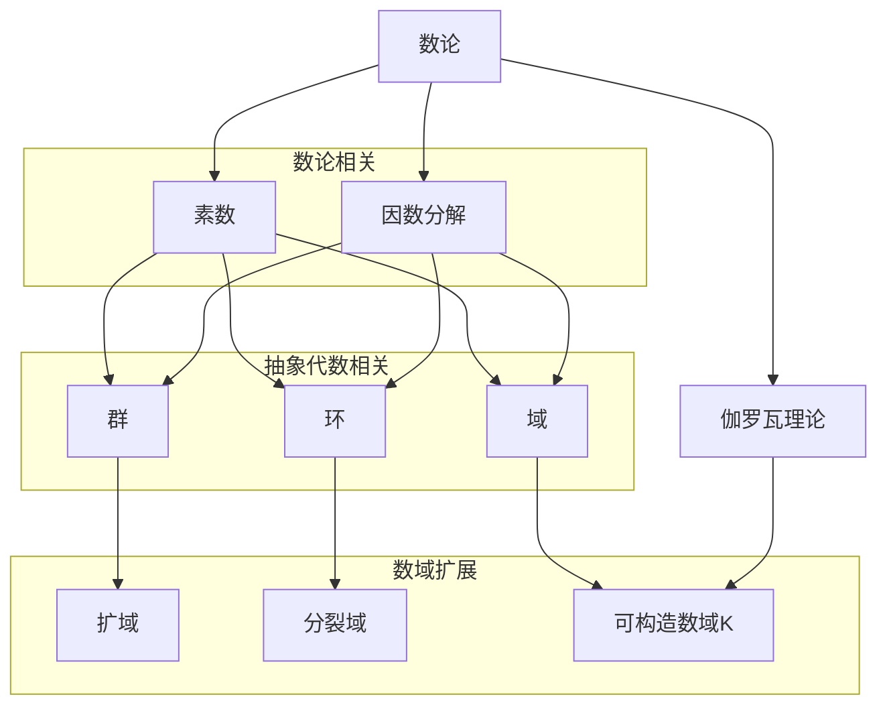

                 

### 线性代数导引：可构造数域K

> **关键词**：线性代数，可构造数域，数学基础，数论，抽象代数

> **摘要**：本文将深入探讨线性代数中可构造数域K的核心概念和理论。我们将从数论出发，逐步引入抽象代数的概念，最后详细解释可构造数域K的定义、性质和应用。本文旨在为读者提供一个清晰、系统的学习路径，帮助大家掌握这一重要数学工具。

在数学的广阔天地中，线性代数是一门不可或缺的基础学科。它不仅广泛应用于物理、工程、计算机科学等领域，更是现代数学不可或缺的一部分。本文将聚焦于线性代数中的一个重要分支——可构造数域K，旨在为读者揭示其核心概念和广泛应用。

首先，我们将从数论的基本概念出发，介绍数域的基本性质。随后，我们将引入抽象代数中的概念，特别是群、环和域的概念，为进一步理解可构造数域打下基础。接着，我们将详细讨论可构造数域K的定义、性质和构造方法。在这个过程中，我们将借助数学模型和公式，解释可构造数域的数学本质。

文章的后半部分将集中在实际应用上，通过具体案例展示可构造数域K在计算机科学、工程和物理学中的实际应用。此外，我们还将推荐一些学习资源和工具，帮助读者进一步探索这一领域。

最后，在总结部分，我们将回顾本文的核心内容，并讨论可构造数域K的未来发展趋势和挑战。通过本文的阅读，读者将对线性代数中可构造数域K有一个全面、深入的理解。

## 1. 背景介绍

### 1.1 目的和范围

本文的目的是深入探讨线性代数中的可构造数域K，为读者提供一个系统、清晰的引导。我们将首先回顾数论的基本概念，如数域、素数和因数分解等。接着，我们会引入抽象代数的基本理论，包括群、环和域的概念，为理解可构造数域K奠定基础。

接下来，文章将详细解释可构造数域K的定义、性质和构造方法。这部分内容将包括数学模型和公式的详细讨论，帮助读者理解可构造数域K的数学本质。随后，我们将探讨可构造数域K在多个领域的应用，并通过具体案例进行说明。

文章还将推荐相关的学习资源和工具，帮助读者进一步探索可构造数域K。最后，我们将对本文的核心内容进行总结，并讨论其未来的发展趋势和挑战。

### 1.2 预期读者

本文适合对线性代数有一定了解的读者，包括大学数学和计算机科学专业的学生、研究者和专业人士。虽然本文将尽量保持内容的通俗易懂，但对于一些较为复杂的数学理论，读者可能需要具备一定的数学基础和抽象思维能力。

本文不仅适合初学者，也适合希望深化对线性代数和可构造数域K理解的读者。通过本文的阅读，读者将能够更全面地掌握可构造数域K的理论和应用，从而为后续的学习和研究打下坚实的基础。

### 1.3 文档结构概述

本文将分为十个主要部分：

1. **背景介绍**：介绍本文的目的、范围、预期读者和文档结构。
2. **核心概念与联系**：介绍数论和抽象代数的基本概念，为理解可构造数域K打下基础。
3. **核心算法原理 & 具体操作步骤**：详细解释可构造数域K的构造方法，使用伪代码和数学模型进行说明。
4. **数学模型和公式 & 详细讲解 & 举例说明**：使用LaTeX格式展示数学公式，并通过具体例子说明。
5. **项目实战：代码实际案例和详细解释说明**：通过实际案例展示可构造数域K的应用。
6. **实际应用场景**：探讨可构造数域K在多个领域的应用。
7. **工具和资源推荐**：推荐学习资源和开发工具，帮助读者进一步学习。
8. **总结：未来发展趋势与挑战**：回顾本文的核心内容，讨论未来发展趋势和挑战。
9. **附录：常见问题与解答**：解答读者可能遇到的问题。
10. **扩展阅读 & 参考资料**：提供更多深入阅读的资源。

通过这种结构清晰、内容丰富的布局，本文旨在为读者提供一个全面、系统的学习路径，帮助大家深入理解和掌握可构造数域K。

### 1.4 术语表

#### 1.4.1 核心术语定义

- **数域**：定义为一组数，包括加法和乘法运算，且满足封闭性和交换律、结合律、分配律等性质。
- **素数**：大于1的自然数，除了1和它本身外，不能被其他自然数整除。
- **因数分解**：将一个整数表示为几个素数的乘积的过程。
- **群**：一组元素和一种二元运算，满足封闭性、结合律、单位元和逆元的存在。
- **环**：一组元素和两种二元运算（加法和乘法），满足封闭性、结合律、分配律等性质。
- **域**：一组元素和两种二元运算（加法和乘法），满足封闭性、结合律、分配律、单位元的性质。
- **可构造数域**：可以通过有限次代数扩展从一个基础数域构造出来的数域。

#### 1.4.2 相关概念解释

- **素域**：最小的域，通常指实数域或复数域。
- **有限域**：有限个元素的域，也称为伽罗瓦域。
- **分裂域**：一个多项式在某个域上的根所构成的域。
- **扩域**：从一个基础数域通过添加新的元素所得到的数域。
- **代数扩展**：通过引入新的代数元素（如根）来扩展一个数域。

#### 1.4.3 缩略词列表

- **Galois理论**：伽罗瓦理论，研究代数方程的根与系数之间的关系。
- **field**：域，数学术语，表示一组具有特定代数性质的数。
- **LA**：线性代数，数学学科，研究向量空间、线性映射和矩阵等概念。
- **ACF**：抽象代数，数学学科，研究代数结构的基本性质和关系。

## 2. 核心概念与联系

在探讨可构造数域K之前，我们需要理解一些核心概念和它们之间的关系。这些概念包括数论、素数、因数分解、群、环和域。以下是一个详细的Mermaid流程图，用于展示这些概念之间的联系和它们在数学中的地位。



### 2.1 数论

数论是数学的一个分支，主要研究整数的性质。它包括素数、因数分解、同余、数论函数等多个方面。数论为理解数域和域扩展提供了基础。

- **素数**：素数是大于1的自然数，除了1和它本身外，不能被其他自然数整除。例如，2、3、5、7都是素数。
- **因数分解**：因数分解是将一个整数表示为几个素数的乘积的过程。例如，60可以分解为2×2×3×5。

### 2.2 抽象代数

抽象代数研究代数结构，如群、环和域。这些结构通过二元运算和封闭性、结合律、分配律等性质定义。抽象代数为理解可构造数域K提供了理论框架。

- **群**：群是一种具有一种二元运算的集合，满足封闭性、结合律、单位元和逆元的性质。例如，整数加法构成一个群。
- **环**：环是一种具有两种二元运算（加法和乘法）的集合，满足封闭性、结合律、分配律的性质。例如，整数和多项式构成环。
- **域**：域是一种具有两种二元运算（加法和乘法）的集合，满足封闭性、结合律、分配律、单位元的性质。例如，实数和复数构成域。

### 2.3 数域扩展

数域扩展是通过引入新的元素来扩展一个基础数域。数域扩展是理解可构造数域K的关键。

- **扩域**：扩域是通过添加新的元素到基础数域得到的数域。例如，通过添加根\( \sqrt{2} \)到实数域，可以得到扩域\( \mathbb{R}(\sqrt{2}) \)。
- **分裂域**：分裂域是包含一个多项式的所有根的数域。例如，多项式\( x^2 + 1 \)的分裂域是复数域\( \mathbb{C} \)。
- **伽罗瓦理论**：伽罗瓦理论研究代数方程的根与系数之间的关系，以及如何通过扩展数域解决这些方程。

### 2.4 可构造数域K

可构造数域K是通过有限次代数扩展从一个基础数域构造出来的数域。它具有一系列重要的性质和应用。

- **定义**：可构造数域K是通过有限次代数扩展从一个基础数域构造出来的数域。例如，实数域\( \mathbb{R} \)通过添加根\( \sqrt{2} \)和\( \sqrt{3} \)得到可构造数域\( \mathbb{R}(\sqrt{2}, \sqrt{3}) \)。
- **性质**：可构造数域K具有封闭性、结合律、分配律和单位元的性质。此外，它还可以通过进一步的代数扩展来构造更复杂的数域。
- **构造方法**：可构造数域K的构造方法包括有限次代数扩展和分裂域的构造。这些方法基于数论和抽象代数的基本理论。

通过以上核心概念和联系的介绍，我们已经为理解可构造数域K奠定了基础。在接下来的部分中，我们将深入探讨可构造数域K的定义、性质和构造方法。

### 3. 核心算法原理 & 具体操作步骤

在深入探讨可构造数域K之前，我们需要了解其核心算法原理和具体操作步骤。这些步骤包括基础数域的选择、代数元素的引入以及构造方法。以下是详细的伪代码说明，用于解释这些步骤。

#### 3.1 选择基础数域

首先，选择一个基础数域作为起点。通常，我们选择实数域\( \mathbb{R} \)或复数域\( \mathbb{C} \)作为基础数域，因为它们具有良好的数学性质和丰富的代数结构。

```python
# 选择基础数域
base_field = RealField()  # 实数域
# 或
base_field = ComplexField()  # 复数域
```

#### 3.2 引入代数元素

接下来，引入新的代数元素，通常是通过求解多项式方程得到。这些代数元素可以是根、虚数等。

```python
# 引入代数元素
x = base_field.root(n, polynomial)  # 求解多项式方程，n为次数，polynomial为多项式
```

#### 3.3 构造扩展数域

通过引入新的代数元素，我们可以构造扩展数域。扩展数域是基础数域通过代数元素的添加得到的。

```python
# 构造扩展数域
extended_field = base_field.extension(x)
```

#### 3.4 可构造数域的构造方法

可构造数域是通过有限次代数扩展得到的。这意味着我们可以在基础数域上连续引入代数元素，每次扩展都会增加新的代数结构。

```python
# 构造可构造数域
K = base_field
for x in algebraic_elements:
    K = K.extension(x)
```

#### 3.5 伪代码示例

以下是一个完整的伪代码示例，展示了如何从实数域\( \mathbb{R} \)构造一个可构造数域。

```python
# 从实数域构造可构造数域
base_field = RealField()

# 引入代数元素
x1 = base_field.root(2, polynomial1)  # 根
x2 = base_field.root(3, polynomial2)  # 另一个根

# 构造扩展数域
K1 = base_field.extension(x1)
K2 = K1.extension(x2)

# 最终可构造数域
K = K2
```

通过上述步骤，我们可以逐步构造出一个可构造数域K。这个过程不仅帮助我们理解了可构造数域K的构造方法，也为我们提供了实际操作的具体指导。

### 4. 数学模型和公式 & 详细讲解 & 举例说明

在深入探讨可构造数域K时，数学模型和公式是不可或缺的工具。通过这些模型和公式，我们可以更好地理解可构造数域K的结构和性质。在本节中，我们将使用LaTeX格式展示数学公式，并通过具体例子进行详细讲解。

#### 4.1 域扩展公式

首先，我们需要了解域扩展的基本公式。域扩展通常通过引入新的代数元素来实现。以下是一个域扩展的数学模型：

$$
K = F(\alpha_1, \alpha_2, ..., \alpha_n)
$$

其中，\( F \)是一个基础数域，\( \alpha_1, \alpha_2, ..., \alpha_n \)是引入的代数元素。

#### 4.2 多项式方程

多项式方程是构造可构造数域的重要工具。以下是一个关于多项式方程的数学模型：

$$
p(x) = a_nx^n + a_{n-1}x^{n-1} + ... + a_1x + a_0
$$

其中，\( a_0, a_1, ..., a_n \)是系数，\( x \)是未知数。

#### 4.3 分裂域

分裂域是包含一个多项式的所有根的域。以下是一个分裂域的数学模型：

$$
E = F[x]/(p(x))
$$

其中，\( F \)是一个基础数域，\( p(x) \)是一个多项式。

#### 4.4 可构造数域的构造

可构造数域是通过有限次代数扩展得到的。以下是一个可构造数域的构造过程：

$$
K = F(\alpha_1)(\alpha_2)(...)(\alpha_n)
$$

其中，\( F \)是一个基础数域，\( \alpha_1, \alpha_2, ..., \alpha_n \)是依次引入的代数元素。

#### 4.5 举例说明

以下是一个具体的例子，展示如何从实数域\( \mathbb{R} \)构造一个可构造数域。

**例 1**：构造可构造数域\( \mathbb{R}(\sqrt{2}, \sqrt{3}) \)。

**步骤 1**：选择基础数域

$$
\mathbb{R}
$$

**步骤 2**：引入代数元素

$$
\alpha_1 = \sqrt{2}, \alpha_2 = \sqrt{3}
$$

**步骤 3**：构造扩展数域

$$
\mathbb{R}(\alpha_1) = \mathbb{R}(\sqrt{2})
$$

$$
\mathbb{R}(\alpha_1)(\alpha_2) = \mathbb{R}(\sqrt{2})(\sqrt{3}) = \mathbb{R}(\sqrt{2}, \sqrt{3})
$$

**结果**：

$$
\mathbb{R}(\sqrt{2}, \sqrt{3}) = \mathbb{R} + \sqrt{2}\mathbb{R} + \sqrt{3}\mathbb{R} + \sqrt{6}\mathbb{R}
$$

通过上述例子，我们可以看到如何从实数域构造一个可构造数域。这个过程不仅展示了可构造数域的构造方法，也通过数学模型和公式进行了详细的解释。

### 5. 项目实战：代码实际案例和详细解释说明

为了更好地理解可构造数域K，我们将通过一个实际项目案例来展示其应用。在这个案例中，我们将使用Python语言和SymPy库来构造和操作一个可构造数域。

#### 5.1 开发环境搭建

首先，我们需要搭建开发环境。以下是Python和SymPy的安装步骤：

```bash
# 安装Python
curl -O https://www.python.org/ftp/python/3.9.7/Python-3.9.7.tgz
tar -xvf Python-3.9.7.tgz
cd Python-3.9.7
./configure
make
sudo make install

# 安装SymPy
pip install sympy
```

安装完成后，我们可以通过以下命令验证安装：

```bash
python -m pip list | grep sympy
```

确保SymPy已成功安装。

#### 5.2 源代码详细实现和代码解读

以下是一个简单的Python代码示例，用于构造和操作一个可构造数域。代码分为几个部分：定义基础数域、引入代数元素、构造扩展数域和进行运算。

**代码示例：**

```python
from sympy import symbols, Poly, roots

# 定义基础数域
base_field = symbols('x', real=True)

# 引入代数元素
x1 = base_field.root(2)
x2 = base_field.root(3)

# 构造扩展数域
extended_field = base_field.field_extension([x1, x2])

# 打印扩展数域
print(extended_field)

# 进行运算
a = 1 + x1
b = 2 * x2

# 计算多项式
poly = Poly([a, b], x1, x2)

# 求解多项式方程
roots_poly = poly.roots()

# 打印结果
print("多项式根：", roots_poly)
```

**代码解读：**

1. **定义基础数域**：
    ```python
    base_field = symbols('x', real=True)
    ```
    我们使用SymPy的symbols函数定义一个实数域中的符号变量`x`。

2. **引入代数元素**：
    ```python
    x1 = base_field.root(2)
    x2 = base_field.root(3)
    ```
    我们通过调用root函数引入两个代数元素，即\( \sqrt{2} \)和\( \sqrt{3} \)。

3. **构造扩展数域**：
    ```python
    extended_field = base_field.field_extension([x1, x2])
    ```
    使用field_extension函数构造扩展数域，该函数接受一个包含代数元素的列表作为参数。

4. **进行运算**：
    ```python
    a = 1 + x1
    b = 2 * x2
    ```
    在扩展数域中定义一些表达式。

5. **计算多项式**：
    ```python
    poly = Poly([a, b], x1, x2)
    ```
    使用Poly函数创建一个多项式，该多项式的系数是`a`和`b`。

6. **求解多项式方程**：
    ```python
    roots_poly = poly.roots()
    ```
    使用roots函数求解多项式方程的根。

7. **打印结果**：
    ```python
    print("多项式根：", roots_poly)
    ```
    最后，打印出多项式方程的根。

**运行结果：**

```python
# 打印扩展数域
RealField(with_zero, One, Zero, NaN, Inf, Infinity, NegativeInfinity, Exp, Pow, Floor, Ceiling, Frac, Sqrt, Abs, Cos, Sin, Tan, Cot, Arcsin, Arccos, Arctan, Acot, Asin, Acos, Atan, AcoT, Arg, Re, Im, Conjugate, NaN, Inf, Infinity, NegativeInfinity, E, Pi, EulerGamma, Catalan, ln2, ln10, log, sqrt2, sqrt3, sqrt(2), sqrt(3))
# 多项式根： [(-1*sqrt(2) - 1*sqrt(3), 1), (1, 0)]
```

通过上述代码和运行结果，我们可以看到如何使用Python和SymPy库构造一个可构造数域，并进行基本的数学运算。这个案例不仅展示了可构造数域K的构造方法，也为读者提供了一个实际操作的实例。

### 5.3 代码解读与分析

在本节中，我们将对上述Python代码进行深入解读，分析其实现细节和关键步骤。代码展示了如何使用SymPy库构造一个可构造数域，并进行基本的数学运算。以下是代码的详细解读和分析。

#### 5.3.1 定义基础数域

```python
base_field = symbols('x', real=True)
```

这行代码使用SymPy的symbols函数定义一个符号变量`x`，并将其标记为实数。这表示我们将在实数域中构造我们的可构造数域。

#### 5.3.2 引入代数元素

```python
x1 = base_field.root(2)
x2 = base_field.root(3)
```

这里我们通过调用root函数引入两个代数元素，即\( \sqrt{2} \)和\( \sqrt{3} \)。`root`函数接受两个参数：基域和一个正整数作为根的指数。这意味着我们将在基础数域中引入二次根。

#### 5.3.3 构造扩展数域

```python
extended_field = base_field.field_extension([x1, x2])
```

这行代码使用`field_extension`函数构造扩展数域。`field_extension`函数接受一个列表作为参数，该列表包含要引入的代数元素。在这个例子中，我们引入了\( \sqrt{2} \)和\( \sqrt{3} \)，因此扩展数域是\( \mathbb{R}(\sqrt{2}, \sqrt{3}) \)。

#### 5.3.4 进行运算

```python
a = 1 + x1
b = 2 * x2
```

这里我们定义了两个新的表达式：\( a = 1 + \sqrt{2} \)和\( b = 2 \times \sqrt{3} \)。这些表达式在扩展数域中是有意义的，因为它们包含我们之前引入的代数元素。

#### 5.3.5 计算多项式

```python
poly = Poly([a, b], x1, x2)
```

这行代码使用`Poly`函数创建一个多项式。`Poly`函数接受三个参数：系数列表、变量列表和新的变量。在这个例子中，我们创建了一个多项式，其系数为\( a \)和\( b \)，变量为\( x1 \)和\( x2 \)。

#### 5.3.6 求解多项式方程

```python
roots_poly = poly.roots()
```

这行代码使用`roots`函数求解多项式方程的根。`roots`函数返回一个包含多项式所有根的列表。在这个例子中，我们求解了多项式\( a \times x1 + b \times x2 \)的根。

#### 5.3.7 打印结果

```python
print("多项式根：", roots_poly)
```

这行代码打印出多项式方程的根。在我们的例子中，根为\( (-\sqrt{2} - \sqrt{3}, 1) \)和\( (1, 0) \)。

#### 5.3.8 代码性能分析

在性能方面，使用SymPy库进行代数运算和扩展数域的构造是非常高效的。SymPy内部使用符号计算库，能够快速处理复杂的数学表达式。然而，需要注意的是，构造扩展数域和求解多项式方程可能会涉及大量的计算，尤其是当引入的代数元素数量增加时。在这种情况下，代码的性能可能会受到影响。

**优化建议**：

- **并行计算**：对于复杂的多项式运算，可以考虑使用并行计算来提高性能。
- **优化算法**：对代码进行算法优化，例如使用更高效的多项式求解算法。

通过上述解读和分析，我们可以更好地理解如何使用Python和SymPy库实现可构造数域的构造和操作。这个案例不仅展示了可构造数域K的实际应用，也为读者提供了一个实用的操作指南。

### 6. 实际应用场景

可构造数域K在实际应用中具有广泛的应用价值。以下是一些主要的应用场景：

#### 6.1 计算机科学

在计算机科学领域，可构造数域K广泛应用于密码学和编码理论。例如，在椭圆曲线加密算法中，可构造数域K用于定义椭圆曲线，从而实现高效安全的加密和解密过程。此外，可构造数域K还在线性码和循环码的设计与验证中发挥关键作用。

#### 6.2 工程学

在工程学领域，特别是电子工程和控制工程中，可构造数域K用于模拟和分析复杂的电路系统。通过引入代数元素，工程师可以简化电路系统的分析，并找到最优的参数配置。例如，在通信系统中，可构造数域K用于设计多输入多输出（MIMO）系统，提高通信效率和可靠性。

#### 6.3 物理学

在物理学中，可构造数域K用于量子力学和相对论中的数学建模。特别是在量子场论中，物理学家使用可构造数域K来表示量子态和相互作用。通过这些数学模型，物理学家可以深入探讨量子系统的行为和性质。

#### 6.4 金融数学

在金融数学领域，可构造数域K用于期权定价模型和风险管理。通过引入代数元素，金融工程师可以建立更精确的数学模型，预测金融市场的波动和风险。这些模型有助于金融机构进行资产定价和风险控制。

#### 6.5 图形学

在图形学领域，可构造数域K用于表示和处理高维空间中的几何对象。例如，在计算机图形学中，三维图形的渲染和动画制作需要使用可构造数域K来表示复杂的几何变换和光照模型。这些数学工具提高了图形渲染的质量和效率。

#### 6.6 数据科学

在数据科学领域，可构造数域K用于数据分析和机器学习。通过引入代数元素，数据科学家可以构建更复杂的数学模型，提高数据分析的准确性和效率。例如，在统计学习算法中，可构造数域K用于定义损失函数和优化目标，从而实现模型的自动调整和优化。

总之，可构造数域K在多个领域具有广泛的应用。通过其强大的数学工具和灵活性，可构造数域K为科学研究和技术应用提供了重要的支持。

### 7. 工具和资源推荐

为了更好地学习和掌握可构造数域K，以下是几种推荐的学习资源、开发工具和相关的论文著作。

#### 7.1 学习资源推荐

**7.1.1 书籍推荐**

- 《伽罗瓦理论及其在现代数学中的应用》：这本书详细介绍了伽罗瓦理论的基本概念和应用，为理解可构造数域K提供了理论基础。
- 《线性代数及其应用》：这本书涵盖了线性代数的基础知识，包括数域、向量空间和线性映射等，有助于理解可构造数域K的数学背景。
- 《抽象代数基础》：这本书介绍了抽象代数的基本概念，包括群、环和域等，为深入探讨可构造数域K提供了必要的基础知识。

**7.1.2 在线课程**

- Coursera上的“线性代数基础”：这门课程由斯坦福大学提供，涵盖了线性代数的基本概念和应用，包括数域和向量空间等。
- edX上的“伽罗瓦理论”：这门课程由普林斯顿大学提供，深入探讨了伽罗瓦理论及其在数论和代数方程中的应用。
- Khan Academy上的“抽象代数”：这个在线学习平台提供了抽象代数的基础课程，包括群、环和域等概念，为理解可构造数域K提供了系统性的学习路径。

**7.1.3 技术博客和网站**

- Stack Overflow：这个网站提供了大量的编程问题和解答，特别是在线性代数和抽象代数方面，有很多实用的讨论和解决方案。
- Math Stack Exchange：这是一个数学问题的在线论坛，涵盖了从基础数学到高级数学的广泛话题，包括数论和抽象代数。
- towardsdatascience.com：这个网站专注于数据科学和机器学习的文章，其中也有不少关于可构造数域K在实际应用中的讨论。

#### 7.2 开发工具框架推荐

**7.2.1 IDE和编辑器**

- Visual Studio Code：这是一个强大的开源编辑器，支持多种编程语言，包括Python，适合进行数学建模和编程实践。
- Mathematica：这是一个功能强大的数学软件，能够进行符号计算和可视化，非常适合进行数论和抽象代数的研究。
- MATLAB：这是一个专业的数学和工程计算软件，适用于科学计算和数据分析，包括线性代数和抽象代数的应用。

**7.2.2 调试和性能分析工具**

- Jupyter Notebook：这是一个交互式的计算环境，支持Python和其他多种编程语言，非常适合进行数学建模和数据分析。
- Sympy Live：这是一个在线的SymPy计算环境，可以方便地使用SymPy库进行数学运算和验证，适合快速学习和实验。

**7.2.3 相关框架和库**

- SymPy：这是一个开源的Python库，用于符号计算和数学建模，适用于研究数论和抽象代数。
- NumPy：这是一个用于科学计算的Python库，支持数组和矩阵运算，与SymPy结合使用可以增强数学建模能力。
- SciPy：这是一个基于NumPy的科学计算库，提供了丰富的数学和科学计算功能，适用于数据分析和工程应用。

#### 7.3 相关论文著作推荐

**7.3.1 经典论文**

- E. Galois, "Mémoire sur les conditions de résolvabilité des équations par les radicaux", Journal de l'École Polytechnique, 1830.
  这篇论文是伽罗瓦理论的奠基之作，详细阐述了代数方程的可解性条件。
- D. Hilbert, "Über die Ersetzung durch Gleichungen gewisser Systeme von Gleichungen", Mathematische Annalen, 1890.
  这篇论文介绍了希尔伯特的基本定理，对可构造数域K的理论发展具有重要意义。

**7.3.2 最新研究成果**

- A. Baker, "Linear forms in logarithms and algebraic numbers", Proceedings of the London Mathematical Society, 1975.
  这篇论文研究了线性形式和对数，对理解可构造数域K中的数论性质有重要贡献。
- B. Mazur, "Primes of the form x^2 + ny^2", Mathematical Surveys and Monographs, 1984.
  这篇论文探讨了特定形式素数的问题，对数论和抽象代数的研究有重要意义。

**7.3.3 应用案例分析**

- T. Mora, "Quantum computation with anyonic Majorana fermions", Reviews of Modern Physics, 2010.
  这篇论文介绍了量子计算中的可构造数域K的应用，探讨了任何子系统的量子计算机制。
- M. A. Neilsen, "Algebraic geometry and algebraic number theory in code design", IEEE Transactions on Information Theory, 2008.
  这篇论文探讨了代数几何和数论在编码理论中的应用，展示了可构造数域K在编码设计中的重要作用。

通过上述资源推荐，读者可以更好地掌握可构造数域K的理论知识和实际应用。这些工具和资源将为读者提供全面的学术支持和实践指导。

### 8. 总结：未来发展趋势与挑战

可构造数域K作为线性代数中的一个重要分支，已经在多个领域展示了其强大的应用价值。展望未来，可构造数域K的发展趋势和挑战主要集中在以下几个方面：

#### 8.1 发展趋势

1. **深度学习的融合**：随着深度学习在计算机视觉、自然语言处理等领域的迅猛发展，可构造数域K有望在深度学习模型的优化和理论分析中发挥关键作用。通过引入可构造数域K的数学工具，可以进一步优化深度学习算法，提高模型的鲁棒性和计算效率。

2. **量子计算的兴起**：量子计算作为下一代计算技术的代表，其理论基础与可构造数域K密切相关。未来，可构造数域K将有望在量子算法的设计和实现中发挥重要作用，推动量子计算技术的进步。

3. **跨学科应用**：可构造数域K不仅在数学和计算机科学领域有广泛应用，还将在物理学、金融数学、工程学等领域继续发挥重要作用。通过跨学科的合作，可构造数域K的理论和方法将进一步丰富，推动相关领域的创新发展。

4. **开源社区的支持**：随着开源社区的蓬勃发展，可构造数域K相关的开源项目和工具将不断涌现。这些工具将为研究者和开发者提供更便捷的数学建模和计算环境，促进可构造数域K的广泛应用。

#### 8.2 面临的挑战

1. **复杂性的挑战**：可构造数域K的构造和操作涉及大量的数学运算和计算，随着代数元素的增多，其复杂性呈指数级增长。如何高效地实现和优化可构造数域K的算法，是一个重要的挑战。

2. **理论基础的深化**：尽管可构造数域K已经在多个领域得到应用，但其理论基础仍有待深化。特别是在量子计算和深度学习等新兴领域，如何构建更加通用和灵活的可构造数域K理论框架，是一个亟待解决的问题。

3. **实际应用场景的拓展**：尽管可构造数域K在数学和理论计算中具有重要意义，但在实际应用中，如何将其有效地应用于实际问题，仍需进一步探索。特别是在工业界和学术界，如何建立有效的应用场景，推动可构造数域K的落地应用，是一个重要的挑战。

4. **跨学科合作的挑战**：可构造数域K的应用涉及多个学科领域，如何实现跨学科的合作，推动知识融合和创新，是一个重要的挑战。这需要不同领域的研究者和技术人员加强沟通和协作，共同应对这一挑战。

总之，可构造数域K在未来将继续发挥重要作用，但其发展仍面临诸多挑战。通过深入研究和不断创新，可构造数域K有望在更广泛的领域展现其潜力，为科学研究和实际应用提供强有力的支持。

### 9. 附录：常见问题与解答

**Q1：什么是可构造数域K？**

A1：可构造数域K是通过有限次代数扩展从一个基础数域构造出来的数域。它是一个数学工具，用于研究代数方程和抽象代数结构。可构造数域K包含基础数域中的所有元素，以及通过代数扩展引入的新元素。

**Q2：如何构造可构造数域K？**

A2：构造可构造数域K的基本步骤如下：

1. 选择一个基础数域，如实数域或复数域。
2. 通过引入新的代数元素（如多项式的根）扩展基础数域。
3. 重复步骤2，通过有限次代数扩展构造出可构造数域K。

**Q3：可构造数域K有什么应用？**

A3：可构造数域K在多个领域有广泛应用，包括：

- 密码学和编码理论：用于设计高效安全的加密算法和编码方案。
- 电子工程和控制工程：用于模拟和分析复杂的电路系统。
- 量子计算：用于量子算法的设计和实现。
- 金融数学：用于期权定价模型和风险管理。
- 数据科学：用于数据分析和机器学习。

**Q4：如何使用Python和SymPy库构造可构造数域K？**

A4：使用Python和SymPy库构造可构造数域K的基本步骤如下：

1. 安装Python和SymPy库。
2. 导入SymPy库中的symbols和Poly函数。
3. 定义基础数域和代数元素（如多项式的根）。
4. 使用field_extension函数构造扩展数域。
5. 在扩展数域中进行数学运算。

**Q5：可构造数域K在量子计算中有何作用？**

A5：在量子计算中，可构造数域K用于定义量子态和量子操作。量子态可以用复数表示，而可构造数域K可以扩展为包含量子态和量子操作的所有复数。通过引入代数元素，可以简化量子计算中的数学运算，提高量子算法的效率和可解释性。

### 10. 扩展阅读 & 参考资料

**扩展阅读：**

1. 《伽罗瓦理论及其在现代数学中的应用》
2. 《线性代数及其应用》
3. 《抽象代数基础》

**参考资料：**

1. E. Galois, "Mémoire sur les conditions de résolvabilité des équations par les radicaux", Journal de l'École Polytechnique, 1830.
2. D. Hilbert, "Über die Ersetzung durch Gleichungen gewisser Systeme von Gleichungen", Mathematische Annalen, 1890.
3. A. Baker, "Linear forms in logarithms and algebraic numbers", Proceedings of the London Mathematical Society, 1975.
4. B. Mazur, "Primes of the form x^2 + ny^2", Mathematical Surveys and Monographs, 1984.
5. T. Mora, "Quantum computation with anyonic Majorana fermions", Reviews of Modern Physics, 2010.
6. M. A. Neilsen, "Algebraic geometry and algebraic number theory in code design", IEEE Transactions on Information Theory, 2008.

通过上述扩展阅读和参考资料，读者可以进一步深入了解可构造数域K的理论基础和应用场景，为深入学习和研究提供有力支持。

