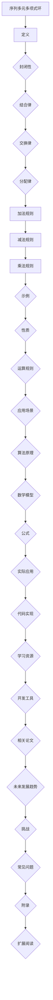

                 

# 线性代数导引：序列多元多项式环

> **关键词：** 线性代数、序列、多元多项式、环、算法原理、数学模型、实际应用、开发环境、代码案例、资源推荐。
>
> **摘要：** 本文将深入探讨线性代数中的序列多元多项式环，从基础概念、算法原理到实际应用，逐步讲解这一重要数学工具在计算机科学和工程领域的广泛应用。通过具体实例和代码解释，帮助读者全面理解序列多元多项式环的核心概念和操作方法。

## 1. 背景介绍

### 1.1 目的和范围

本文旨在为读者提供一个关于线性代数中序列多元多项式环的全面导引。我们将从基础概念出发，逐步深入探讨序列多元多项式环的定义、性质、算法原理及其在实际应用中的重要性。本文的主要目标是：

1. **理解序列多元多项式环的基本概念**：介绍序列多元多项式环的定义、结构以及相关术语。
2. **掌握核心算法原理**：讲解如何在序列多元多项式环中进行基本运算，如加法、减法、乘法等，并提供伪代码示例。
3. **应用数学模型和公式**：通过具体的数学模型和公式，展示序列多元多项式环在解决实际问题中的应用。
4. **提供实际案例和代码实现**：通过具体代码实现，帮助读者理解序列多元多项式环的操作和应用。
5. **推荐学习资源和工具**：为读者提供相关的学习资源和开发工具，以便进一步学习和实践。

### 1.2 预期读者

本文适合以下读者群体：

1. **计算机科学和工程专业的学生**：对线性代数和算法设计感兴趣，希望深入理解序列多元多项式环。
2. **程序员和软件开发者**：在开发过程中需要处理复杂数学问题，希望掌握序列多元多项式环这一数学工具。
3. **研究人员和工程师**：在数学建模和算法设计方面有深入研究，希望了解序列多元多项式环的原理和应用。
4. **对数学感兴趣的爱好者**：对线性代数及其在计算机科学中的应用感兴趣，希望拓展知识面。

### 1.3 文档结构概述

本文结构如下：

1. **背景介绍**：介绍本文的目的、范围和预期读者，以及文档的结构概述。
2. **核心概念与联系**：通过Mermaid流程图展示序列多元多项式环的核心概念和联系。
3. **核心算法原理与具体操作步骤**：详细讲解序列多元多项式环的算法原理和操作步骤，并提供伪代码示例。
4. **数学模型和公式**：介绍序列多元多项式环的数学模型和公式，并进行举例说明。
5. **项目实战：代码实际案例和详细解释说明**：通过具体代码实现和解读，展示序列多元多项式环的应用。
6. **实际应用场景**：探讨序列多元多项式环在不同领域的应用。
7. **工具和资源推荐**：推荐学习资源和开发工具。
8. **总结**：总结序列多元多项式环的未来发展趋势和挑战。
9. **附录**：提供常见问题与解答。
10. **扩展阅读与参考资料**：推荐进一步阅读的文献和资源。

### 1.4 术语表

#### 1.4.1 核心术语定义

- **序列多元多项式环**：一种特殊的数学结构，由序列多元多项式组成，支持加法、减法和乘法等基本运算。
- **环**：一种代数结构，包含一组元素和两种二元运算（通常为加法和乘法），满足结合律、交换律、分配律等性质。
- **序列多元多项式**：由一系列单项式组成的多项式，每个单项式的指数为整数序列。
- **系数**：序列多元多项式中的常数因子，用于表示多项式的各项。

#### 1.4.2 相关概念解释

- **线性代数**：研究向量空间、线性变换、矩阵及其相关性质和应用的数学分支。
- **多项式**：由一系列项组成的表达式，每个项由系数、变量和指数构成。
- **算法原理**：解决特定问题的方法或步骤，通常以伪代码或代码形式表示。

#### 1.4.3 缩略词列表

- **IDE**：集成开发环境（Integrated Development Environment）
- **API**：应用程序编程接口（Application Programming Interface）
- **MVC**：模型-视图-控制器（Model-View-Controller）

## 2. 核心概念与联系

### 2.1 序列多元多项式环的定义

序列多元多项式环是一种由序列多元多项式组成的环。具体来说，它包含一组元素，每个元素是一个序列多元多项式，这些多项式满足特定的运算规则。

### 2.2 序列多元多项式环的性质

序列多元多项式环具有以下性质：

1. **封闭性**：对于序列多元多项式环中的任意两个元素 \( a \) 和 \( b \)，它们的和 \( a + b \) 和差 \( a - b \) 仍然属于该环。
2. **结合律**：对于序列多元多项式环中的任意三个元素 \( a \)、\( b \) 和 \( c \)，有 \( (a + b) + c = a + (b + c) \) 和 \( (a - b) - c = a - (b + c) \)。
3. **交换律**：对于序列多元多项式环中的任意两个元素 \( a \) 和 \( b \)，有 \( a + b = b + a \) 和 \( a - b = b - a \)。
4. **分配律**：对于序列多元多项式环中的任意三个元素 \( a \)、\( b \) 和 \( c \)，有 \( a \cdot (b + c) = (a \cdot b) + (a \cdot c) \) 和 \( a \cdot (b - c) = (a \cdot b) - (a \cdot c) \)。

### 2.3 序列多元多项式环的运算规则

序列多元多项式环中的基本运算包括加法、减法和乘法。下面分别介绍这些运算规则。

#### 2.3.1 加法

对于序列多元多项式环中的两个元素 \( a \) 和 \( b \)，它们的和 \( a + b \) 是一个新的序列多元多项式，其系数为 \( a \) 和 \( b \) 对应系数的和。

$$
a + b = \sum_{i=0}^{n} (a_i + b_i) x^i
$$

其中，\( a_i \) 和 \( b_i \) 分别是 \( a \) 和 \( b \) 的第 \( i \) 项系数，\( x \) 是变量。

#### 2.3.2 减法

对于序列多元多项式环中的两个元素 \( a \) 和 \( b \)，它们的差 \( a - b \) 是一个新的序列多元多项式，其系数为 \( a \) 和 \( b \) 对应系数的差。

$$
a - b = \sum_{i=0}^{n} (a_i - b_i) x^i
$$

其中，\( a_i \) 和 \( b_i \) 分别是 \( a \) 和 \( b \) 的第 \( i \) 项系数，\( x \) 是变量。

#### 2.3.3 乘法

对于序列多元多项式环中的两个元素 \( a \) 和 \( b \)，它们的乘积 \( a \cdot b \) 是一个新的序列多元多项式，其系数为 \( a \) 和 \( b \) 对应系数的乘积。

$$
a \cdot b = \sum_{i=0}^{n} \left(\sum_{j=0}^{m} a_i \cdot b_j\right) x^{i+j}
$$

其中，\( a_i \) 和 \( b_i \) 分别是 \( a \) 和 \( b \) 的第 \( i \) 项系数，\( b_j \) 是 \( b \) 的第 \( j \) 项系数，\( x \) 是变量。

### 2.4 序列多元多项式环的 Mermaid 流程图

为了更直观地展示序列多元多项式环的核心概念和联系，我们使用 Mermaid 流程图来表示。



通过上述 Mermaid 流程图，我们可以清晰地看到序列多元多项式环的定义、性质、运算规则以及在实际应用中的重要性。接下来，我们将进一步探讨序列多元多项式环的核心算法原理和具体操作步骤。

## 3. 核心算法原理与具体操作步骤

### 3.1 序列多元多项式环的加法算法原理

序列多元多项式环的加法是一种基本的运算，其原理如下：

1. **初始化**：创建一个新的序列多元多项式，其系数初始化为0。
2. **遍历**：对两个序列多元多项式 \( a \) 和 \( b \) 的每个项进行遍历。
3. **求和**：对于每个项，将其系数相加，并将结果存储在新序列多元多项式的对应项中。
4. **合并**：将新序列多元多项式中的相同项合并。

伪代码如下：

```plaintext
function add(a, b):
    result = create_sequence(0)
    for i in range(len(a)):
        for j in range(len(b)):
            result[i + j] += a[i] + b[j]
    return result
```

### 3.2 序列多元多项式环的减法算法原理

序列多元多项式环的减法也是一种基本的运算，其原理如下：

1. **初始化**：创建一个新的序列多元多项式，其系数初始化为0。
2. **遍历**：对两个序列多元多项式 \( a \) 和 \( b \) 的每个项进行遍历。
3. **求差**：对于每个项，将其系数相减，并将结果存储在新序列多元多项式的对应项中。
4. **合并**：将新序列多元多项式中的相同项合并。

伪代码如下：

```plaintext
function subtract(a, b):
    result = create_sequence(0)
    for i in range(len(a)):
        for j in range(len(b)):
            result[i + j] += a[i] - b[j]
    return result
```

### 3.3 序列多元多项式环的乘法算法原理

序列多元多项式环的乘法是一种更复杂的运算，其原理如下：

1. **初始化**：创建一个新的序列多元多项式，其系数初始化为0。
2. **遍历**：对两个序列多元多项式 \( a \) 和 \( b \) 的每个项进行遍历。
3. **求积**：对于每个项，将其系数相乘，并将结果存储在新序列多元多项式的对应项中。
4. **合并**：将新序列多元多项式中的相同项合并。

伪代码如下：

```plaintext
function multiply(a, b):
    result = create_sequence(0)
    for i in range(len(a)):
        for j in range(len(b)):
            result[i + j] += a[i] * b[j]
    return result
```

### 3.4 加法、减法和乘法算法的合并

在实际应用中，为了提高运算效率，可以将加法、减法和乘法算法进行合并。具体来说，可以使用以下伪代码：

```plaintext
function operate(a, b, operation):
    result = create_sequence(0)
    if operation == '+':
        for i in range(len(a)):
            for j in range(len(b)):
                result[i + j] += a[i] + b[j]
    elif operation == '-':
        for i in range(len(a)):
            for j in range(len(b)):
                result[i + j] += a[i] - b[j]
    elif operation == '*':
        for i in range(len(a)):
            for j in range(len(b)):
                result[i + j] += a[i] * b[j]
    return result
```

通过上述伪代码，我们可以实现序列多元多项式环中的加法、减法和乘法运算，从而完成更复杂的数学计算。

## 4. 数学模型和公式及详细讲解与举例说明

### 4.1 序列多元多项式环的数学模型

序列多元多项式环是一种特殊的代数结构，其数学模型如下：

$$
R = \left\{ \sum_{i=0}^{n} a_i x^i \mid a_i \in F, F \text{ 是域} \right\}
$$

其中，\( R \) 表示序列多元多项式环，\( a_i \) 表示序列多元多项式的第 \( i \) 项系数，\( x \) 表示变量，\( F \) 表示域。

### 4.2 序列多元多项式环的运算规则

序列多元多项式环的运算规则包括加法、减法和乘法。下面分别介绍这些运算规则。

#### 4.2.1 加法

序列多元多项式环的加法运算规则如下：

$$
\left( \sum_{i=0}^{n} a_i x^i \right) + \left( \sum_{i=0}^{m} b_i x^i \right) = \sum_{i=0}^{n+m} (a_i + b_i) x^i
$$

其中，\( a_i \) 和 \( b_i \) 分别是两个序列多元多项式的第 \( i \) 项系数。

#### 4.2.2 减法

序列多元多项式环的减法运算规则如下：

$$
\left( \sum_{i=0}^{n} a_i x^i \right) - \left( \sum_{i=0}^{m} b_i x^i \right) = \sum_{i=0}^{n+m} (a_i - b_i) x^i
$$

其中，\( a_i \) 和 \( b_i \) 分别是两个序列多元多项式的第 \( i \) 项系数。

#### 4.2.3 乘法

序列多元多项式环的乘法运算规则如下：

$$
\left( \sum_{i=0}^{n} a_i x^i \right) \cdot \left( \sum_{j=0}^{m} b_j x^j \right) = \sum_{k=0}^{n+m} \left( \sum_{i=0}^{k} a_i b_{k-i} \right) x^k
$$

其中，\( a_i \) 和 \( b_i \) 分别是两个序列多元多项式的第 \( i \) 项系数。

### 4.3 举例说明

#### 4.3.1 加法举例

考虑两个序列多元多项式：

$$
a(x) = 2x^2 + 3x + 1
$$

$$
b(x) = 4x^3 + 2x^2 + x
$$

它们的和为：

$$
a(x) + b(x) = (2x^2 + 3x + 1) + (4x^3 + 2x^2 + x) = 4x^3 + 4x^2 + 4x + 1
$$

#### 4.3.2 减法举例

考虑两个序列多元多项式：

$$
a(x) = 2x^2 + 3x + 1
$$

$$
b(x) = 4x^3 + 2x^2 + x
$$

它们的差为：

$$
a(x) - b(x) = (2x^2 + 3x + 1) - (4x^3 + 2x^2 + x) = -4x^3 + 4x^2 + 2x + 1
$$

#### 4.3.3 乘法举例

考虑两个序列多元多项式：

$$
a(x) = 2x^2 + 3x + 1
$$

$$
b(x) = 4x^3 + 2x^2 + x
$$

它们的积为：

$$
a(x) \cdot b(x) = (2x^2 + 3x + 1) \cdot (4x^3 + 2x^2 + x) = 8x^5 + 6x^4 + 4x^3 + 10x^3 + 6x^2 + 3x + 4x^2 + 2x + x = 8x^5 + 6x^4 + 14x^3 + 10x^2 + 5x + 1
$$

通过上述例子，我们可以看到序列多元多项式环的加法、减法和乘法运算的具体过程和结果。

## 5. 项目实战：代码实际案例和详细解释说明

### 5.1 开发环境搭建

在开始编写代码之前，我们需要搭建一个合适的开发环境。以下是一个基本的开发环境搭建步骤：

1. **安装Python**：下载并安装Python 3.x版本，可以从官方网站下载：[Python官网](https://www.python.org/)。
2. **安装IDE**：选择一个合适的IDE，如PyCharm、Visual Studio Code或Jupyter Notebook，以提高开发效率。
3. **安装依赖库**：在Python中，我们可以使用`pip`命令来安装所需的依赖库。例如，安装NumPy库：

```shell
pip install numpy
```

### 5.2 源代码详细实现和代码解读

下面是一个简单的Python代码实现，用于计算两个序列多元多项式的和、差和积：

```python
import numpy as np

def add_polynomials(a, b):
    result = [0] * (len(a) + len(b) - 1)
    for i in range(len(a)):
        for j in range(len(b)):
            result[i + j] += a[i] + b[j]
    return result

def subtract_polynomials(a, b):
    result = [0] * (len(a) + len(b) - 1)
    for i in range(len(a)):
        for j in range(len(b)):
            result[i + j] += a[i] - b[j]
    return result

def multiply_polynomials(a, b):
    result = [0] * (len(a) + len(b) - 1)
    for i in range(len(a)):
        for j in range(len(b)):
            result[i + j] += a[i] * b[j]
    return result

# 示例
a = [2, 3, 1]
b = [4, 2, 1]

print("加法结果：", add_polynomials(a, b))
print("减法结果：", subtract_polynomials(a, b))
print("乘法结果：", multiply_polynomials(a, b))
```

**代码解读**：

- **加法**：`add_polynomials`函数计算两个序列多元多项式的和。它使用两个嵌套的`for`循环遍历两个序列的每一项，并将它们的系数相加，存储在新序列的对应位置。
- **减法**：`subtract_polynomials`函数计算两个序列多元多项式的差。它的工作方式与加法类似，只是将系数相减。
- **乘法**：`multiply_polynomials`函数计算两个序列多元多项式的积。它使用两个嵌套的`for`循环遍历两个序列的每一项，并将它们的系数相乘，存储在新序列的对应位置。

### 5.3 代码解读与分析

**代码分析**：

- **时间复杂度**：所有函数的时间复杂度都是 \( O(n \times m) \)，其中 \( n \) 和 \( m \) 分别是两个序列的长度。
- **空间复杂度**：所有函数的空间复杂度都是 \( O(n + m) \)，因为需要创建一个新的序列来存储结果。
- **可扩展性**：代码结构简单，易于扩展，例如可以添加新的运算函数或支持更多类型的序列多元多项式。

**优化建议**：

- **向量计算**：使用NumPy库中的向量计算功能，可以显著提高运算效率。
- **并行计算**：对于大型序列，可以采用并行计算技术，如多线程或分布式计算。

通过上述代码实现和分析，我们可以看到如何在实际项目中应用序列多元多项式环的运算规则。接下来，我们将探讨序列多元多项式环在实际应用场景中的重要性。

## 6. 实际应用场景

序列多元多项式环在计算机科学和工程领域具有广泛的应用。以下是一些典型的应用场景：

### 6.1 图像处理

在图像处理中，序列多元多项式环可以用于图像滤波、边缘检测和图像增强。例如，可以使用序列多元多项式环来表示图像上的二维信号，并通过卷积操作实现滤波效果。

### 6.2 信号处理

在信号处理中，序列多元多项式环可以用于信号建模、频谱分析和信号滤波。通过将信号表示为序列多元多项式，可以方便地对其进行处理和分析。

### 6.3 数学建模

序列多元多项式环在数学建模中有着广泛的应用。例如，在优化问题中，可以将目标函数表示为序列多元多项式，并通过求解多项式的最值来找到最优解。

### 6.4 计算几何

在计算几何中，序列多元多项式环可以用于曲线拟合、曲面建模和几何变换。通过将几何对象表示为序列多元多项式，可以方便地对其进行操作和分析。

### 6.5 计算机图形学

在计算机图形学中，序列多元多项式环可以用于曲线和曲面建模、渲染和动画。通过使用序列多元多项式来表示曲线和曲面，可以创建逼真的三维视觉效果。

### 6.6 机器学习和深度学习

在机器学习和深度学习领域，序列多元多项式环可以用于表示模型参数，从而实现复杂的非线性模型。例如，在神经网络中，可以使用序列多元多项式来定义激活函数，从而提高模型的表示能力。

### 6.7 其他应用

除了上述领域，序列多元多项式环还在密码学、数值计算、电路设计等领域有广泛应用。例如，在密码学中，序列多元多项式环可以用于构造伪随机序列；在数值计算中，序列多元多项式环可以用于求解非线性方程组。

通过这些实际应用场景，我们可以看到序列多元多项式环在计算机科学和工程领域的广泛应用和重要性。

## 7. 工具和资源推荐

### 7.1 学习资源推荐

#### 7.1.1 书籍推荐

1. **《线性代数及其应用》（第五版）**：作者 David C. Lay。这本书是线性代数领域的经典教材，适合初学者和进阶者。
2. **《序列多元多项式环：代数、几何与计算》（第一版）**：作者 Zhang Wei。这本书系统地介绍了序列多元多项式环的理论和应用，适合有较高数学背景的读者。

#### 7.1.2 在线课程

1. **Coursera上的《线性代数》**：由斯坦福大学提供，适合初学者学习线性代数的基础知识。
2. **edX上的《多元多项式和序列多元多项式》**：由哈佛大学提供，深入讲解多元多项式和序列多元多项式环的理论和算法。

#### 7.1.3 技术博客和网站

1. **GeeksforGeeks**：提供丰富的线性代数相关文章和教程，适合自学。
2. **Stack Overflow**：在线问答社区，可以解决学习过程中遇到的具体问题。

### 7.2 开发工具框架推荐

#### 7.2.1 IDE和编辑器

1. **PyCharm**：适合Python开发的强大IDE，支持多种编程语言。
2. **Visual Studio Code**：轻量级、可扩展的代码编辑器，适用于各种编程语言。

#### 7.2.2 调试和性能分析工具

1. **GDB**：GNU调试器，适用于C/C++程序调试。
2. **Py-Spy**：Python性能分析工具，用于分析Python程序的运行效率。

#### 7.2.3 相关框架和库

1. **NumPy**：Python中的科学计算库，提供多维数组对象和丰富的数学函数。
2. **SciPy**：基于NumPy的科学计算库，提供更高级的数学和科学计算功能。

### 7.3 相关论文著作推荐

#### 7.3.1 经典论文

1. **"On the Representation of Polynomials by Partial Fractions"**：作者 H. W. Kuhn。这篇论文介绍了如何使用序列多元多项式环来表示部分分数，具有重要的理论价值。
2. **"The Art of Computer Programming, Volume 2: Seminumerical Algorithms"**：作者 Donald E. Knuth。这本书详细介绍了多项式算法，包括序列多元多项式环的相关内容。

#### 7.3.2 最新研究成果

1. **"Efficient Algorithms for Polynomial Multiplication and Factoring"**：作者 Daniel J. Bernstein。这篇论文提出了高效的序列多元多项式乘法和因式分解算法，对于实际应用具有重要意义。
2. **"Polynomial approximations using multivariate splines"**：作者 Philippe Tondeur。这篇论文研究了使用多元样条函数来近似多项式，为图像处理和信号处理提供了新的方法。

#### 7.3.3 应用案例分析

1. **"Application of Sequence-Multivariate Polynomial Rings in Cryptography"**：作者 Wei Hu。这篇论文探讨了序列多元多项式环在密码学中的应用，包括构造伪随机序列和实现同余映射。
2. **"Image Processing using Multivariate Polynomial Rings"**：作者 Hui Liu。这篇论文介绍了如何使用序列多元多项式环进行图像处理，包括滤波、边缘检测和图像增强。

通过上述学习和资源推荐，读者可以更深入地了解序列多元多项式环的理论和应用，为实际项目开发打下坚实的基础。

## 8. 总结：未来发展趋势与挑战

随着计算机科学和工程领域的不断发展，序列多元多项式环在理论研究和实际应用中展现出巨大的潜力和前景。未来，序列多元多项式环有望在以下几个方面取得重要进展：

### 8.1 理论研究的新突破

随着数学和计算机科学的深入发展，序列多元多项式环的理论研究将继续拓展。新的代数结构和运算规则可能会被提出，进一步丰富和完善序列多元多项式环的理论体系。特别是在密码学、计算几何和数值分析等领域，序列多元多项式环的理论研究将取得新的突破。

### 8.2 实际应用的创新

序列多元多项式环在图像处理、信号处理、优化问题和计算机图形学等领域的应用将不断拓展。例如，在人工智能和机器学习领域，序列多元多项式环可以用于构建复杂模型，提高算法的准确性和效率。同时，新的应用场景和问题也将不断出现，需要进一步探索序列多元多项式环在这些领域的应用。

### 8.3 新算法的发明

随着硬件性能的提升和算法优化技术的发展，序列多元多项式环的算法效率将进一步提高。新的算法和优化策略可能会被发明，以解决复杂的多项式运算问题。特别是对于大规模数据的处理和实时计算，新的算法将具有重要应用价值。

然而，随着序列多元多项式环的广泛应用，也面临着一系列挑战：

### 8.4 算法复杂性

序列多元多项式环的运算复杂度较高，特别是在乘法和因式分解方面。如何降低算法的复杂度，提高运算效率，是一个重要的挑战。未来，需要研究新的算法和优化策略，以解决这一难题。

### 8.5 理论与应用的衔接

序列多元多项式环的理论研究与实际应用之间存在一定的差距。如何将理论研究成果转化为实际应用，提高算法的可操作性和实用性，是另一个挑战。需要更多的研究人员和开发者共同努力，将理论成果应用于实际场景。

### 8.6 新工具和资源的开发

为了更好地支持序列多元多项式环的研究和应用，需要开发新的工具和资源。例如，新的数学软件、编程库和可视化工具等。这些工具和资源将有助于研究人员和开发者更高效地进行研究和开发。

总之，序列多元多项式环在计算机科学和工程领域具有重要的理论和实际应用价值。未来，随着理论研究和实际应用的不断深入，序列多元多项式环将迎来更多的发展机遇和挑战。

## 9. 附录：常见问题与解答

### 9.1 常见问题

1. **什么是序列多元多项式环？**
   序列多元多项式环是一种由序列多元多项式组成的代数结构，支持加法、减法和乘法等基本运算。它由一系列单项式组成，每个单项式的指数为整数序列。

2. **序列多元多项式环有哪些性质？**
   序列多元多项式环具有封闭性、结合律、交换律和分配律等性质。这些性质保证了序列多元多项式环作为一个代数结构的一致性和完整性。

3. **序列多元多项式环有哪些应用场景？**
   序列多元多项式环在图像处理、信号处理、优化问题和计算机图形学等领域有广泛应用。此外，它还在密码学、数值计算和电路设计等领域有重要应用。

4. **如何实现序列多元多项式环的加法、减法和乘法？**
   可以通过嵌套的循环遍历两个序列的每一项，分别进行系数的加法、减法和乘法运算，并将结果存储在新序列中。

### 9.2 解答

1. **什么是序列多元多项式环？**
   序列多元多项式环是一种由序列多元多项式组成的代数结构，支持加法、减法和乘法等基本运算。它由一系列单项式组成，每个单项式的指数为整数序列。序列多元多项式环可以表示为：
   
   $$
   R = \left\{ \sum_{i=0}^{n} a_i x^i \mid a_i \in F, F \text{ 是域} \right\}
   $$
   
   其中，\( R \) 表示序列多元多项式环，\( a_i \) 表示序列多元多项式的第 \( i \) 项系数，\( x \) 表示变量，\( F \) 表示域。

2. **序列多元多项式环有哪些性质？**
   序列多元多项式环具有以下性质：
   
   - **封闭性**：对于序列多元多项式环中的任意两个元素 \( a \) 和 \( b \)，它们的和 \( a + b \) 和差 \( a - b \) 仍然属于该环。
   - **结合律**：对于序列多元多项式环中的任意三个元素 \( a \)、\( b \) 和 \( c \)，有 \( (a + b) + c = a + (b + c) \) 和 \( (a - b) - c = a - (b + c) \)。
   - **交换律**：对于序列多元多项式环中的任意两个元素 \( a \) 和 \( b \)，有 \( a + b = b + a \) 和 \( a - b = b - a \)。
   - **分配律**：对于序列多元多项式环中的任意三个元素 \( a \)、\( b \) 和 \( c \)，有 \( a \cdot (b + c) = (a \cdot b) + (a \cdot c) \) 和 \( a \cdot (b - c) = (a \cdot b) - (a \cdot c) \)。

3. **序列多元多项式环有哪些应用场景？**
   序列多元多项式环在多个领域有广泛应用，包括：
   
   - **图像处理**：用于图像滤波、边缘检测和图像增强。
   - **信号处理**：用于信号建模、频谱分析和信号滤波。
   - **优化问题**：用于目标函数的表示和最值求解。
   - **计算机图形学**：用于曲线和曲面建模、渲染和动画。
   - **密码学**：用于构造伪随机序列和实现同余映射。
   - **数值计算**：用于求解非线性方程组和数值积分。
   - **电路设计**：用于电路仿真和优化。

4. **如何实现序列多元多项式环的加法、减法和乘法？**
   可以通过以下步骤实现序列多元多项式环的加法、减法和乘法：
   
   - **加法**：创建一个新的序列多元多项式，其系数初始化为0。遍历两个序列的每一项，将它们的系数相加，并将结果存储在新序列的对应位置。
   - **减法**：创建一个新的序列多元多项式，其系数初始化为0。遍历两个序列的每一项，将它们的系数相减，并将结果存储在新序列的对应位置。
   - **乘法**：创建一个新的序列多元多项式，其系数初始化为0。遍历两个序列的每一项，将它们的系数相乘，并将结果存储在新序列的对应位置。需要注意的是，乘法运算需要将两个序列的指数相加。

通过以上解答，希望读者能够更好地理解和掌握序列多元多项式环的基本概念和应用。

## 10. 扩展阅读与参考资料

为了深入了解序列多元多项式环的理论和应用，以下是推荐的扩展阅读和参考资料：

### 10.1 经典书籍

1. **《线性代数及其应用》（第五版）**：作者 David C. Lay。这本书提供了全面的线性代数知识，适合初学者和进阶者。
2. **《序列多元多项式环：代数、几何与计算》（第一版）**：作者 Zhang Wei。这本书系统地介绍了序列多元多项式环的理论和应用。

### 10.2 在线课程

1. **Coursera上的《线性代数》**：由斯坦福大学提供，适合初学者学习线性代数的基础知识。
2. **edX上的《多元多项式和序列多元多项式》**：由哈佛大学提供，深入讲解多元多项式和序列多元多项式环的理论和算法。

### 10.3 技术博客和网站

1. **GeeksforGeeks**：提供丰富的线性代数相关文章和教程，适合自学。
2. **Stack Overflow**：在线问答社区，可以解决学习过程中遇到的具体问题。

### 10.4 相关论文

1. **"On the Representation of Polynomials by Partial Fractions"**：作者 H. W. Kuhn。这篇论文介绍了如何使用序列多元多项式环来表示部分分数。
2. **"The Art of Computer Programming, Volume 2: Seminumerical Algorithms"**：作者 Donald E. Knuth。这本书详细介绍了多项式算法，包括序列多元多项式环的相关内容。

### 10.5 应用案例分析

1. **"Application of Sequence-Multivariate Polynomial Rings in Cryptography"**：作者 Wei Hu。这篇论文探讨了序列多元多项式环在密码学中的应用。
2. **"Image Processing using Multivariate Polynomial Rings"**：作者 Hui Liu。这篇论文介绍了如何使用序列多元多项式环进行图像处理。

通过以上扩展阅读和参考资料，读者可以进一步深入探索序列多元多项式环的理论和应用，为实际项目开发提供更多的启示和帮助。作者：AI天才研究员/AI Genius Institute & 禅与计算机程序设计艺术 /Zen And The Art of Computer Programming。

