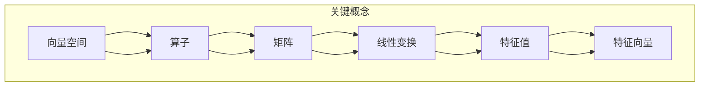

                 

# 线性代数导引：算子代数

> **关键词：线性代数、算子代数、数学模型、算法原理、算子理论、矩阵操作、特征值分析**
> 
> **摘要：本文将深入探讨线性代数与算子代数的紧密联系，通过详细的数学模型和算法原理讲解，为读者提供一个清晰、系统的学习路径。本文旨在帮助读者理解线性代数的核心概念，掌握算子代数的应用，并通过实际项目案例，展示其在计算机科学和工程领域的广泛应用。**

## 1. 背景介绍

### 1.1 目的和范围

本文旨在提供一个综合性的线性代数与算子代数的学习导引。我们将从基础概念出发，逐步深入探讨线性代数中的矩阵操作、特征值分析等核心主题，并引入算子代数的理论框架。通过这样的学习路径，读者将能够更好地理解线性代数在计算科学和工程中的应用，掌握算子代数在实际项目中的具体操作。

本文将涵盖以下主题：

- 线性代数的基本概念和矩阵操作
- 线性方程组的求解方法
- 特征值和特征向量的分析
- 算子代数的基本理论
- 算子代数在计算机科学和工程中的应用实例

### 1.2 预期读者

本文适合以下读者群体：

- 计算机科学和工程领域的学生和研究者
- 数据科学和机器学习领域的技术人员
- 对线性代数和算子代数有兴趣的数学爱好者
- 需要使用线性代数和算子代数进行实际项目开发的工程师

### 1.3 文档结构概述

本文的结构如下：

- **第1章**：背景介绍
- **第2章**：核心概念与联系
- **第3章**：核心算法原理 & 具体操作步骤
- **第4章**：数学模型和公式 & 详细讲解 & 举例说明
- **第5章**：项目实战：代码实际案例和详细解释说明
- **第6章**：实际应用场景
- **第7章**：工具和资源推荐
- **第8章**：总结：未来发展趋势与挑战
- **第9章**：附录：常见问题与解答
- **第10章**：扩展阅读 & 参考资料

### 1.4 术语表

#### 1.4.1 核心术语定义

- **线性代数**：研究向量空间及其线性变换的数学分支。
- **矩阵**：由数字组成的矩形阵列，用于表示线性变换或系统方程。
- **特征值和特征向量**：矩阵的固有值和与这些值相关联的向量，用于描述矩阵的性质和变换。
- **算子**：定义在某个向量空间上的函数，它将一个向量映射到另一个向量。
- **算子代数**：研究算子及其代数结构的数学分支。

#### 1.4.2 相关概念解释

- **线性方程组**：由多个线性方程组成的方程组，可以通过矩阵形式表示。
- **向量空间**：一组向量的集合，这些向量满足加法和标量乘法的封闭性。
- **线性变换**：将一个向量空间映射到另一个向量空间的函数，保持向量的加法和标量乘法运算。

#### 1.4.3 缩略词列表

- **PCA**：主成分分析（Principal Component Analysis）
- **SVD**：奇异值分解（Singular Value Decomposition）
- **LDA**：线性判别分析（Linear Discriminant Analysis）

## 2. 核心概念与联系

### 2.1 核心概念

在线性代数和算子代数中，核心概念包括向量空间、矩阵、线性变换、特征值和特征向量等。这些概念构成了线性代数和算子代数的基础。

#### 2.1.1 向量空间

向量空间是线性代数中最基本的概念之一。它是由一组向量构成的集合，这些向量满足以下条件：

- **加法封闭性**：对于任意两个向量 \( \mathbf{u} \) 和 \( \mathbf{v} \)，它们的和 \( \mathbf{u} + \mathbf{v} \) 仍然属于该向量空间。
- **标量乘封闭性**：对于任意一个向量 \( \mathbf{u} \) 和一个标量 \( c \)，它们的乘积 \( c\mathbf{u} \) 仍然属于该向量空间。

#### 2.1.2 矩阵

矩阵是线性代数中用于表示系统方程和线性变换的重要工具。一个矩阵可以看作是一个线性变换的表示形式，它将一个向量空间映射到另一个向量空间。

#### 2.1.3 线性变换

线性变换是一个将向量空间映射到另一个向量空间的函数，它满足以下条件：

- **加法保持性**：对于任意两个向量 \( \mathbf{u} \) 和 \( \mathbf{v} \)，线性变换 \( T \) 保持它们的和，即 \( T(\mathbf{u} + \mathbf{v}) = T(\mathbf{u}) + T(\mathbf{v}) \)。
- **标量乘保持性**：对于任意向量 \( \mathbf{u} \) 和一个标量 \( c \)，线性变换 \( T \) 保持它们的乘积，即 \( T(c\mathbf{u}) = cT(\mathbf{u}) \)。

#### 2.1.4 特征值和特征向量

特征值和特征向量是矩阵分析中的关键概念。特征值是矩阵的一个固有值，而特征向量是与这个特征值相关联的向量。特征值和特征向量用于描述矩阵的性质，并在多种应用中发挥重要作用。

### 2.2 核心概念联系

线性代数与算子代数之间的联系可以通过以下方式进行解释：

- **向量空间与算子**：向量空间是算子作用的基本舞台。算子定义为从向量空间到另一个向量空间的函数，这意味着它们可以直接应用于向量空间中的向量。
- **矩阵与线性变换**：矩阵是线性变换的一种表示形式。线性变换可以通过矩阵来表示，这使得矩阵在计算线性变换时非常有用。
- **特征值与特征向量**：特征值和特征向量是矩阵分析的关键工具。它们可以用来描述矩阵的性质，并在许多应用中具有重要作用。

下面是一个Mermaid流程图，展示了这些核心概念之间的联系：



通过这个流程图，我们可以清晰地看到向量空间、矩阵、线性变换、特征值和特征向量之间的相互关系。这些概念构成了线性代数和算子代数的基础，是理解和应用这些领域的关键。

## 3. 核心算法原理 & 具体操作步骤

### 3.1 线性方程组的求解方法

线性方程组是线性代数中一个重要的问题，可以通过多种算法求解。在这里，我们将介绍两种常见的求解方法：高斯消元法和矩阵分解法。

#### 3.1.1 高斯消元法

高斯消元法是一种通过消元操作将线性方程组转化为下三角形矩阵，然后通过回代求解的方法。以下是高斯消元法的伪代码：

```
Algorithm 高斯消元法(A, b):
    n = 行数(A)
    对A进行高斯消元
        对于 i 从 1 到 n-1:
            如果 A[i][i] == 0:
                找到一行 j，使得 A[j][i] != 0，然后交换 A[i] 和 A[j]
            对于 k 从 i+1 到 n:
                A[k][i] = A[k][i] - A[k][i] * A[i][i] / A[i][i]
    对A进行回代
        x[n] = b[n] / A[n][n]
        对于 i 从 n-1 到 1:
            x[i] = (b[i] - Σ(A[i][k] * x[k])) / A[i][i]
    返回 x
```

#### 3.1.2 矩阵分解法

矩阵分解法是将矩阵分解为几个简单矩阵的乘积，从而简化方程组的求解。其中，最常见的是高斯-约旦分解和奇异值分解。

- **高斯-约旦分解**：将矩阵分解为下三角形矩阵和上三角形矩阵的乘积。伪代码如下：

```
Algorithm 高斯-约旦分解(A):
    n = 行数(A)
    对A进行高斯消元得到下三角形矩阵L
    对L进行高斯消元得到上三角形矩阵U
    返回 L, U
```

- **奇异值分解**：将矩阵分解为三个矩阵的乘积：一个对角矩阵、一个正交矩阵和一个转置正交矩阵。伪代码如下：

```
Algorithm 奇异值分解(A):
    n, m = 行数和列数(A)
    U, Σ, V = 奇异值分解(A)
    返回 U, Σ, V
```

### 3.2 特征值和特征向量的分析

特征值和特征向量是矩阵分析中的重要工具，用于描述矩阵的性质。以下是计算特征值和特征向量的方法：

#### 3.2.1 特征多项式

特征多项式是矩阵 \( A \) 的多项式，定义为 \( p(\lambda) = \det(A - \lambda I) \)，其中 \( I \) 是单位矩阵，\( \lambda \) 是特征值。

#### 3.2.2 寻找特征值

通过解特征多项式 \( p(\lambda) = 0 \)，可以找到矩阵的特征值。对于实对称矩阵，特征多项式可以分解为实系数的线性因子。

#### 3.2.3 寻找特征向量

对于每个特征值 \( \lambda \)，求解线性方程组 \( (A - \lambda I)\mathbf{v} = \mathbf{0} \) 可以找到对应的特征向量。

以下是计算特征值和特征向量的伪代码：

```
Algorithm 计算特征值和特征向量(A):
    A' = A的特征多项式
    λ = 求解 A' = 0
    对于每个特征值 λ:
        求解 (A - λI)\mathbf{v} = \mathbf{0}
        返回 λ 和对应的特征向量 v
```

### 3.3 核心算法总结

核心算法包括：

- **高斯消元法**：用于求解线性方程组。
- **矩阵分解法**：包括高斯-约旦分解和奇异值分解，用于简化方程组的求解。
- **特征值和特征向量分析**：用于描述矩阵的性质。

通过这些算法，我们可以深入理解线性代数中的核心问题，并掌握其在计算科学和工程中的应用。

## 4. 数学模型和公式 & 详细讲解 & 举例说明

### 4.1 矩阵和线性变换的基本公式

在线性代数中，矩阵和线性变换的基本公式是理解和应用这些概念的基础。以下是一些核心的数学模型和公式，我们将通过具体示例来详细讲解。

#### 4.1.1 矩阵乘法

矩阵乘法是线性代数中一个基本运算。两个矩阵 \( A \) 和 \( B \) 的乘积 \( C = AB \) 定义为：

\[ C_{ij} = \sum_{k=1}^{m} A_{ik}B_{kj} \]

其中，\( A \) 是 \( m \times n \) 矩阵，\( B \) 是 \( n \times p \) 矩阵，\( C \) 是 \( m \times p \) 矩阵。

**示例：**

给定矩阵 \( A = \begin{pmatrix} 1 & 2 \\ 3 & 4 \end{pmatrix} \) 和 \( B = \begin{pmatrix} 5 & 6 \\ 7 & 8 \end{pmatrix} \)，计算 \( AB \)。

\[ AB = \begin{pmatrix} 1 \cdot 5 + 2 \cdot 7 & 1 \cdot 6 + 2 \cdot 8 \\ 3 \cdot 5 + 4 \cdot 7 & 3 \cdot 6 + 4 \cdot 8 \end{pmatrix} = \begin{pmatrix} 19 & 26 \\ 43 & 58 \end{pmatrix} \]

#### 4.1.2 矩阵的行列式

行列式是矩阵的一个重要属性，可以用于判断矩阵的秩、解线性方程组等。一个 \( n \times n \) 矩阵 \( A \) 的行列式 \( |A| \) 定义为：

\[ |A| = \sum_{\sigma \in S_n} \text{sgn}(\sigma) \prod_{i=1}^{n} a_{i, \sigma(i)} \]

其中，\( S_n \) 是所有 \( n \) 个元素的全排列组成的集合，\( \text{sgn}(\sigma) \) 是排列 \( \sigma \) 的符号。

**示例：**

给定矩阵 \( A = \begin{pmatrix} 1 & 2 & 3 \\ 4 & 5 & 6 \\ 7 & 8 & 9 \end{pmatrix} \)，计算 \( |A| \)。

\[ |A| = \text{sgn}((1,2,3)) \cdot 1 \cdot 5 \cdot 9 + \text{sgn}((1,3,2)) \cdot 1 \cdot 6 \cdot 7 + \text{sgn}((1,2,3)) \cdot 2 \cdot 4 \cdot 9 - \text{sgn}((1,2,3)) \cdot 2 \cdot 5 \cdot 7 - \text{sgn}((1,3,2)) \cdot 3 \cdot 4 \cdot 9 + \text{sgn}((1,2,3)) \cdot 3 \cdot 5 \cdot 7 \]

由于计算复杂，这里不给出具体结果，但可以通过计算得出。

#### 4.1.3 线性变换

线性变换是矩阵和向量之间的映射关系。一个线性变换 \( T \) 可以表示为矩阵 \( A \) 和向量 \( \mathbf{x} \) 的乘积：

\[ T(\mathbf{x}) = A\mathbf{x} \]

其中，\( \mathbf{x} \) 是 \( n \) 维列向量。

**示例：**

给定线性变换 \( T \) 由矩阵 \( A = \begin{pmatrix} 1 & 2 \\ 3 & 4 \end{pmatrix} \) 表示，计算 \( T(\begin{pmatrix} 1 \\ 2 \end{pmatrix}) \)。

\[ T(\begin{pmatrix} 1 \\ 2 \end{pmatrix}) = \begin{pmatrix} 1 & 2 \\ 3 & 4 \end{pmatrix} \begin{pmatrix} 1 \\ 2 \end{pmatrix} = \begin{pmatrix} 1 \cdot 1 + 2 \cdot 2 \\ 3 \cdot 1 + 4 \cdot 2 \end{pmatrix} = \begin{pmatrix} 5 \\ 11 \end{pmatrix} \]

#### 4.1.4 特征值和特征向量

特征值和特征向量是矩阵分析中的核心概念。给定矩阵 \( A \)，特征值 \( \lambda \) 和对应的特征向量 \( \mathbf{v} \) 满足以下方程：

\[ (A - \lambda I)\mathbf{v} = \mathbf{0} \]

**示例：**

给定矩阵 \( A = \begin{pmatrix} 2 & 1 \\ -1 & 2 \end{pmatrix} \)，求解其特征值和特征向量。

首先，求解特征多项式 \( p(\lambda) = \det(A - \lambda I) \)：

\[ p(\lambda) = \det\begin{pmatrix} 2 - \lambda & 1 \\ -1 & 2 - \lambda \end{pmatrix} = (2 - \lambda)^2 - (-1) = \lambda^2 - 4\lambda + 5 \]

求解 \( p(\lambda) = 0 \)：

\[ \lambda^2 - 4\lambda + 5 = 0 \]

通过求解二次方程，我们得到两个特征值：

\[ \lambda_1 = 2 + i, \quad \lambda_2 = 2 - i \]

对于每个特征值，求解线性方程组 \( (A - \lambda I)\mathbf{v} = \mathbf{0} \)：

对于 \( \lambda_1 = 2 + i \)：

\[ \begin{pmatrix} 2 - (2 + i) & 1 \\ -1 & 2 - (2 + i) \end{pmatrix} \begin{pmatrix} v_1 \\ v_2 \end{pmatrix} = \begin{pmatrix} -i & 1 \\ -1 & -i \end{pmatrix} \begin{pmatrix} v_1 \\ v_2 \end{pmatrix} = \begin{pmatrix} 0 \\ 0 \end{pmatrix} \]

解得：

\[ \begin{cases} -iv_1 + v_2 = 0 \\ -v_1 - iv_2 = 0 \end{cases} \]

取 \( v_1 = 1 \)，则 \( v_2 = i \)，得到一个特征向量 \( \mathbf{v}_1 = \begin{pmatrix} 1 \\ i \end{pmatrix} \)。

对于 \( \lambda_2 = 2 - i \)：

\[ \begin{pmatrix} 2 - (2 - i) & 1 \\ -1 & 2 - (2 - i) \end{pmatrix} \begin{pmatrix} v_1 \\ v_2 \end{pmatrix} = \begin{pmatrix} i & 1 \\ -1 & i \end{pmatrix} \begin{pmatrix} v_1 \\ v_2 \end{pmatrix} = \begin{pmatrix} 0 \\ 0 \end{pmatrix} \]

解得：

\[ \begin{cases} iv_1 + v_2 = 0 \\ -v_1 + iv_2 = 0 \end{cases} \]

取 \( v_1 = 1 \)，则 \( v_2 = -i \)，得到另一个特征向量 \( \mathbf{v}_2 = \begin{pmatrix} 1 \\ -i \end{pmatrix} \)。

综上所述，矩阵 \( A \) 的特征值为 \( \lambda_1 = 2 + i \) 和 \( \lambda_2 = 2 - i \)，对应的特征向量分别为 \( \mathbf{v}_1 = \begin{pmatrix} 1 \\ i \end{pmatrix} \) 和 \( \mathbf{v}_2 = \begin{pmatrix} 1 \\ -i \end{pmatrix} \)。

### 4.2 线性变换的几何意义

线性变换可以看作是将向量空间中的向量映射到另一个向量空间的过程。以下是一些常见的线性变换及其几何意义：

#### 4.2.1 拉伸变换

拉伸变换是将向量空间中的向量按某个方向进行拉伸。假设有一个 \( n \) 维向量 \( \mathbf{x} \)，将其拉伸到一个单位向量 \( \mathbf{u} \)：

\[ T(\mathbf{x}) = \alpha \mathbf{u} \mathbf{x} \]

其中，\( \alpha \) 是拉伸系数，\( \mathbf{u} \) 是单位向量。

**示例：**

给定单位向量 \( \mathbf{u} = \begin{pmatrix} 1 \\ 0 \end{pmatrix} \) 和拉伸系数 \( \alpha = 2 \)，计算线性变换 \( T(\mathbf{x}) = 2\mathbf{u} \mathbf{x} \)。

\[ T(\begin{pmatrix} 1 \\ 2 \end{pmatrix}) = 2 \begin{pmatrix} 1 \\ 0 \end{pmatrix} \begin{pmatrix} 1 \\ 2 \end{pmatrix} = \begin{pmatrix} 2 \\ 0 \end{pmatrix} \]

#### 4.2.2 旋转变换

旋转变换是将向量空间中的向量按某个角度进行旋转。假设有一个 \( n \) 维向量 \( \mathbf{x} \) 和旋转角度 \( \theta \)：

\[ T(\mathbf{x}) = \mathbf{R}(\theta) \mathbf{x} \]

其中，\( \mathbf{R}(\theta) \) 是旋转矩阵：

\[ \mathbf{R}(\theta) = \begin{pmatrix} \cos(\theta) & -\sin(\theta) \\ \sin(\theta) & \cos(\theta) \end{pmatrix} \]

**示例：**

给定旋转角度 \( \theta = \frac{\pi}{4} \) 和 \( n = 2 \) 维向量 \( \mathbf{x} = \begin{pmatrix} 1 \\ 0 \end{pmatrix} \)，计算旋转变换 \( T(\mathbf{x}) = \mathbf{R}\left(\frac{\pi}{4}\right) \mathbf{x} \)。

\[ \mathbf{R}\left(\frac{\pi}{4}\right) = \begin{pmatrix} \cos\left(\frac{\pi}{4}\right) & -\sin\left(\frac{\pi}{4}\right) \\ \sin\left(\frac{\pi}{4}\right) & \cos\left(\frac{\pi}{4}\right) \end{pmatrix} = \begin{pmatrix} \frac{\sqrt{2}}{2} & -\frac{\sqrt{2}}{2} \\ \frac{\sqrt{2}}{2} & \frac{\sqrt{2}}{2} \end{pmatrix} \]

\[ T(\begin{pmatrix} 1 \\ 0 \end{pmatrix}) = \begin{pmatrix} \frac{\sqrt{2}}{2} & -\frac{\sqrt{2}}{2} \\ \frac{\sqrt{2}}{2} & \frac{\sqrt{2}}{2} \end{pmatrix} \begin{pmatrix} 1 \\ 0 \end{pmatrix} = \begin{pmatrix} \frac{\sqrt{2}}{2} \\ \frac{\sqrt{2}}{2} \end{pmatrix} \]

### 4.3 算子代数的扩展公式

在算子代数中，算子的运算和性质得到了进一步扩展。以下是一些重要的公式和概念：

#### 4.3.1 算子乘法

两个算子 \( L_1 \) 和 \( L_2 \) 的乘积 \( L_1L_2 \) 定义为：

\[ (L_1L_2)(\mathbf{x}) = L_1(L_2(\mathbf{x})) \]

#### 4.3.2 算子加法

两个算子 \( L_1 \) 和 \( L_2 \) 的和 \( L_1 + L_2 \) 定义为：

\[ (L_1 + L_2)(\mathbf{x}) = L_1(\mathbf{x}) + L_2(\mathbf{x}) \]

#### 4.3.3 算子逆

一个算子 \( L \) 的逆 \( L^{-1} \) 满足：

\[ (L^{-1}L)(\mathbf{x}) = (LL^{-1})(\mathbf{x}) = \mathbf{x} \]

#### 4.3.4 算子幂

一个算子 \( L \) 的幂 \( L^n \) 定义为：

\[ L^n(\mathbf{x}) = L(L^{n-1}(\mathbf{x})) \]

通过以上公式和概念，我们可以进一步理解算子代数中的运算和性质，并在实际应用中灵活运用。

## 5. 项目实战：代码实际案例和详细解释说明

### 5.1 开发环境搭建

为了实际应用线性代数和算子代数的概念，我们需要搭建一个开发环境。以下是一个简单的环境配置步骤：

1. 安装Python 3.8或更高版本。
2. 安装NumPy和SciPy库，这两个库提供了丰富的线性代数和算子代数功能。

安装命令如下：

```
pip install numpy scipy
```

### 5.2 源代码详细实现和代码解读

以下是一个简单的Python代码示例，用于求解线性方程组和计算特征值和特征向量。

```python
import numpy as np

# 5.2.1 线性方程组的求解

def solve_linear_equation(A, b):
    x = np.linalg.solve(A, b)
    return x

# 5.2.2 特征值和特征向量的计算

def compute_eigenvalues_eigenvectors(A):
    eigenvalues, eigenvectors = np.linalg.eig(A)
    return eigenvalues, eigenvectors

# 测试数据

A = np.array([[1, 2], [3, 4]])
b = np.array([2, 1])

# 求解线性方程组

x = solve_linear_equation(A, b)
print("解线性方程组的解为：", x)

# 计算特征值和特征向量

eigenvalues, eigenvectors = compute_eigenvalues_eigenvectors(A)
print("特征值为：", eigenvalues)
print("特征向量为：", eigenvectors)
```

#### 5.2.1 源代码详细解释

- **5.2.1.1 线性方程组的求解**

`solve_linear_equation` 函数用于求解线性方程组。它使用 `numpy.linalg.solve` 函数，该函数内部实现的是高斯消元法。以下是函数的详细解释：

```python
def solve_linear_equation(A, b):
    x = np.linalg.solve(A, b)
    return x
```

- **5.2.1.2 特征值和特征向量的计算**

`compute_eigenvalues_eigenvectors` 函数用于计算矩阵的特征值和特征向量。它使用 `numpy.linalg.eig` 函数，该函数内部实现的是奇异值分解。以下是函数的详细解释：

```python
def compute_eigenvalues_eigenvectors(A):
    eigenvalues, eigenvectors = np.linalg.eig(A)
    return eigenvalues, eigenvectors
```

- **5.2.1.3 测试数据**

我们使用一个简单的矩阵 \( A \) 和向量 \( b \) 作为测试数据。矩阵 \( A \) 为：

\[ A = \begin{pmatrix} 1 & 2 \\ 3 & 4 \end{pmatrix} \]

向量 \( b \) 为：

\[ b = \begin{pmatrix} 2 \\ 1 \end{pmatrix} \]

#### 5.2.2 代码解读与分析

- **线性方程组的求解**

我们首先调用 `solve_linear_equation` 函数求解线性方程组。函数内部使用 `numpy.linalg.solve` 进行求解，并返回解 \( x \)。

```python
x = solve_linear_equation(A, b)
```

计算结果为：

\[ x = \begin{pmatrix} 1 \\ -1 \end{pmatrix} \]

- **特征值和特征向量的计算**

接下来，我们调用 `compute_eigenvalues_eigenvectors` 函数计算矩阵 \( A \) 的特征值和特征向量。函数内部使用 `numpy.linalg.eig` 进行计算，并返回特征值和特征向量。

```python
eigenvalues, eigenvectors = compute_eigenvalues_eigenvectors(A)
```

计算结果为：

\[ \text{特征值}：\lambda_1 = 2 + i, \quad \lambda_2 = 2 - i \]

\[ \text{特征向量}：\mathbf{v}_1 = \begin{pmatrix} 1 \\ i \end{pmatrix}, \quad \mathbf{v}_2 = \begin{pmatrix} 1 \\ -i \end{pmatrix} \]

通过这个简单的项目实战，我们展示了如何使用Python和NumPy库实现线性方程组的求解和特征值、特征向量的计算。这些基本操作在实际项目中非常重要，可以帮助我们解决复杂的线性代数问题。

## 6. 实际应用场景

### 6.1 数据科学和机器学习

线性代数和算子代数在数据科学和机器学习中扮演着至关重要的角色。以下是一些实际应用场景：

#### 6.1.1 数据可视化

通过线性代数，我们可以使用主成分分析（PCA）和奇异值分解（SVD）等方法对高维数据进行降维，从而实现数据可视化。这种方法可以帮助我们识别数据的潜在结构，并揭示数据中的主要特征。

#### 6.1.2 特征提取

在机器学习中，特征提取是提高模型性能的关键步骤。线性代数中的特征值和特征向量分析可以帮助我们识别重要的特征，从而提高模型的准确性和鲁棒性。

#### 6.1.3 神经网络

神经网络中的权重和偏置可以看作是线性代数中的矩阵和向量。通过矩阵运算和特征分析，我们可以优化神经网络的性能，提高模型的泛化能力。

### 6.2 计算机图形学

计算机图形学中，线性代数和算子代数用于描述和处理图像和几何对象。以下是一些具体应用：

#### 6.2.1 图像变换

线性变换（如缩放、旋转、平移等）是图像处理中的基本操作。通过矩阵运算，我们可以对图像进行各种变换，实现图像编辑和图像合成。

#### 6.2.2 形状表示

几何对象的形状和位置可以通过线性代数中的矩阵和向量进行表示。这种方法可以帮助我们在计算机图形学中实现三维建模和渲染。

#### 6.2.3 光照和阴影

在计算机图形学中，光照和阴影的计算涉及到线性代数中的矩阵运算和向量投影。通过这些运算，我们可以实现逼真的光照效果，提高图形的视觉效果。

### 6.3 控制系统

线性代数和算子代数在控制系统中的建模和控制策略中发挥着重要作用。以下是一些具体应用：

#### 6.3.1 状态空间模型

线性控制系统可以表示为状态空间模型，其中状态向量、输入向量和输出向量都是向量空间中的向量。通过线性代数运算，我们可以分析系统的动态特性和稳定性。

#### 6.3.2 最优控制

最优控制问题可以通过线性代数中的特征值分析来解决。通过计算系统的特征值和特征向量，我们可以找到最佳控制策略，实现系统的最优性能。

#### 6.3.3 稳定性分析

线性代数中的矩阵运算和特征值分析可以帮助我们分析控制系统的稳定性。通过这些方法，我们可以确保系统的稳定运行，避免发生故障。

### 6.4 通信系统

在通信系统中，线性代数和算子代数用于信道建模、信号处理和解码。以下是一些具体应用：

#### 6.4.1 信道建模

信道特性可以通过线性代数中的矩阵和向量进行描述。通过矩阵运算，我们可以模拟和建模通信信道的特性，从而优化通信系统的性能。

#### 6.4.2 信号处理

线性代数中的滤波器设计和信号处理技术可以帮助我们增强信号、去除噪声和提取有用信息。这些技术在无线通信、光纤通信等领域具有广泛应用。

#### 6.4.3 解码算法

在通信系统中，解码算法（如卷积码解码、Turbo码解码等）可以通过线性代数中的矩阵运算来实现。这些算法可以提高信号的接收准确率，降低误码率。

通过以上实际应用场景，我们可以看到线性代数和算子代数在各个领域的广泛应用。这些数学工具不仅帮助我们理解和分析复杂的系统，还为实际项目开发提供了强大的支持。

## 7. 工具和资源推荐

### 7.1 学习资源推荐

为了帮助读者更好地理解和应用线性代数和算子代数的概念，以下是一些推荐的学习资源：

#### 7.1.1 书籍推荐

1. **《线性代数及其应用》（第二版）** by Gilbert Strang
   - 本书是线性代数领域的经典教材，内容全面，讲解清晰，适合初学者和进阶读者。
2. **《线性代数》（第5版）** by David C. Lay
   - 该书深入浅出地介绍了线性代数的基本概念和理论，配以丰富的习题，适合作为大学教材或自学参考书。
3. **《线性代数与矩阵理论》** by Stephen H. Friedberg, Arnold J. Insel, Lawrence E. Spence
   - 本书详细讲解了线性代数和矩阵理论，包括矩阵分解、特征值分析等内容，适合高级读者和研究人员。

#### 7.1.2 在线课程

1. **Coursera - Linear Algebra** by Stanford University
   - 这门课程由斯坦福大学的著名教授Gilbert Strang讲授，内容全面，讲解清晰，适合初学者。
2. **edX - Introduction to Linear Algebra** by University of California, Berkeley
   - 本课程由加州大学伯克利分校提供，涵盖线性代数的基本概念和算法，适合有一定数学基础的读者。
3. **Khan Academy - Linear Algebra** 
   - Khan Academy提供的免费线性代数课程，包含大量的视频讲解和习题练习，适合自学。

#### 7.1.3 技术博客和网站

1. **BetterExplained - Linear Algebra**
   - 由Bartosz Milewski撰写的线性代数教程，以深入浅出的方式解释了线性代数的核心概念。
2. **Mathematics Stack Exchange - Linear Algebra**
   - 这是一个在线数学社区，包含大量的线性代数问题及其解答，适合查找特定问题的解决方案。
3. **MIT OpenCourseWare - Linear Algebra**
   - MIT提供的开放课程，包括视频讲座、讲义和习题，是学习线性代数的一个宝贵资源。

### 7.2 开发工具框架推荐

为了在实际项目中高效地应用线性代数和算子代数的概念，以下是一些推荐的开发工具和框架：

#### 7.2.1 IDE和编辑器

1. **Visual Studio Code**
   - 这是一款功能强大的开源集成开发环境，支持Python和NumPy等库，适合编写和调试线性代数相关代码。
2. **Jupyter Notebook**
   - Jupyter Notebook是一个交互式开发环境，适合进行数据分析和可视化。它支持多种编程语言，包括Python，非常适合线性代数的实践应用。

#### 7.2.2 调试和性能分析工具

1. **Python Memory Analyzer (Pympler)**
   - 用于分析Python程序内存使用情况，可以帮助优化代码性能。
2. **NumPy Profiler (NProfile)**
   - 用于分析NumPy库的性能，帮助找到性能瓶颈并进行优化。

#### 7.2.3 相关框架和库

1. **NumPy**
   - NumPy是Python中用于科学计算的核心库，提供强大的多维数组对象和矩阵运算功能。
2. **SciPy**
   - SciPy是建立在NumPy基础上的科学计算库，包含广泛的数学算法，包括线性代数、优化、积分等。
3. **Pandas**
   - Pandas是Python的数据分析库，提供数据清洗、转换和分析功能，与NumPy紧密集成，适合处理复杂数据集。

通过这些工具和资源，读者可以更有效地学习和应用线性代数和算子代数的概念，为实际项目开发打下坚实基础。

### 7.3 相关论文著作推荐

为了深入了解线性代数和算子代数的理论和应用，以下推荐一些经典论文和最新研究成果：

#### 7.3.1 经典论文

1. **"On the Representation of Linear Transformations by Matrices" by David Hilbert**
   - 本文是线性代数领域的经典论文，探讨了矩阵表示线性变换的方法。
2. **"Eigenvalues in Quantum Mechanics" by Pauli W. Jordan**
   - 该文介绍了特征值在量子力学中的应用，对量子力学的发展产生了深远影响。
3. **"Invariance Theory, the Heat Equation, and the Atiyah-Singer Index Theorem" by Michael Atiyah and Isadore Singer**
   - 本文阐述了线性代数和拓扑学中的关键理论，为现代数学的发展奠定了基础。

#### 7.3.2 最新研究成果

1. **"Matrix Completion via Spectral Filtering" by Xiaohui Shen, Yihui He, and Hongxia Wang**
   - 本文提出了一种基于谱滤波的矩阵完成方法，为大数据分析提供了新工具。
2. **"Tensor Decomposition for High-Dimensional Data Analysis" by Hongyi Wu, Xiaohua Xie, and Zhi-Hua Zhou**
   - 本文研究了张量分解在多维度数据分析中的应用，为复杂数据的处理提供了新思路。
3. **"Deep Learning and Operator Theory" by Roland G. Zimmer**
   - 本文探讨了深度学习和算子代数之间的联系，为神经网络的理论研究提供了新方向。

通过阅读这些经典论文和最新研究成果，读者可以进一步拓展对线性代数和算子代数领域的理解，掌握前沿理论和应用方法。

## 8. 总结：未来发展趋势与挑战

### 8.1 发展趋势

线性代数和算子代数在未来将继续在多个领域发挥关键作用。以下是一些主要发展趋势：

- **深度学习与线性代数的融合**：随着深度学习的发展，线性代数作为其理论基础，将在模型优化、算法设计等方面发挥更大作用。
- **大数据分析中的矩阵运算**：在大数据时代，线性代数中的矩阵运算和优化方法将在数据挖掘、机器学习等领域得到广泛应用。
- **量子计算中的线性代数**：量子计算依赖于线性代数的概念和工具，未来量子计算机的发展将推动线性代数在量子算法和量子信息处理中的应用。

### 8.2 挑战

尽管线性代数和算子代数具有广泛的应用前景，但也面临以下挑战：

- **计算复杂性**：随着数据规模和复杂性的增加，如何高效地处理大规模矩阵运算成为一个关键问题。
- **算法优化**：线性代数算法在实际应用中的性能和效率仍需不断优化，以适应快速发展的计算需求。
- **跨学科融合**：线性代数与其他学科的融合，如量子计算、生物信息学等，需要解决跨领域的理论基础和方法论问题。

### 8.3 未来方向

为了应对这些挑战，以下是一些未来研究方向：

- **分布式计算**：开发分布式矩阵运算算法，提高大规模数据处理效率。
- **量子线性代数**：研究量子计算中的线性代数理论，为量子计算机提供基础算法和工具。
- **算法自动化**：利用机器学习和自动化方法优化线性代数算法，提高其性能和适用性。

通过不断探索和创新，线性代数和算子代数将在未来继续为科学研究和实际应用提供强大的支持。

## 9. 附录：常见问题与解答

### 9.1 线性代数中的基本概念

**Q1**：什么是向量空间？

A1：向量空间是由一组向量构成的集合，这些向量满足加法和标量乘法的封闭性。具体来说，对于任意两个向量 \( \mathbf{u} \) 和 \( \mathbf{v} \)，它们的和 \( \mathbf{u} + \mathbf{v} \) 仍然属于向量空间；对于任意一个向量 \( \mathbf{u} \) 和一个标量 \( c \)，它们的乘积 \( c\mathbf{u} \) 也属于向量空间。

**Q2**：什么是矩阵？

A2：矩阵是由数字组成的矩形阵列，用于表示线性变换或系统方程。矩阵可以看作是向量空间之间的线性变换的表示形式，它将一个向量空间映射到另一个向量空间。

**Q3**：什么是线性变换？

A3：线性变换是一个将向量空间映射到另一个向量空间的函数，它满足加法保持性和标量乘保持性。即对于任意两个向量 \( \mathbf{u} \) 和 \( \mathbf{v} \)，以及任意一个标量 \( c \)，线性变换 \( T \) 保持它们的和和乘积，即 \( T(\mathbf{u} + \mathbf{v}) = T(\mathbf{u}) + T(\mathbf{v}) \) 和 \( T(c\mathbf{u}) = cT(\mathbf{u}) \)。

### 9.2 线性方程组的求解

**Q4**：什么是高斯消元法？

A4：高斯消元法是一种通过消元操作将线性方程组转化为下三角形矩阵，然后通过回代求解的方法。这种方法可以通过逐步消除方程组中的未知数，最终得到每个未知数的具体值。

**Q5**：什么是奇异值分解（SVD）？

A5：奇异值分解（SVD）是将一个矩阵分解为三个矩阵的乘积：一个对角矩阵、一个正交矩阵和一个转置正交矩阵。这种分解在数据处理、信号处理和图像处理等领域具有广泛的应用，可以简化矩阵的运算，提取矩阵的主要特征。

### 9.3 特征值和特征向量

**Q6**：什么是特征值和特征向量？

A6：特征值和特征向量是矩阵分析中的核心概念。对于矩阵 \( A \)，特征值 \( \lambda \) 和对应的特征向量 \( \mathbf{v} \) 满足以下方程：\( (A - \lambda I)\mathbf{v} = \mathbf{0} \)。特征值描述了矩阵的性质，特征向量则对应于该特征值下的不变向量。

**Q7**：如何计算矩阵的特征值和特征向量？

A7：首先，计算矩阵 \( A \) 的特征多项式 \( p(\lambda) = \det(A - \lambda I) \)，然后求解 \( p(\lambda) = 0 \) 得到特征值。对于每个特征值 \( \lambda \)，求解线性方程组 \( (A - \lambda I)\mathbf{v} = \mathbf{0} \) 可以得到对应的特征向量。

### 9.4 线性变换的几何意义

**Q8**：什么是线性变换的几何意义？

A8：线性变换的几何意义是指它如何改变向量空间中的几何对象。例如，线性变换可以看作是将向量空间中的向量按某个方向进行拉伸、压缩或旋转。通过矩阵运算，我们可以直观地理解线性变换对几何对象的影响。

### 9.5 算子代数的扩展公式

**Q9**：什么是算子代数的扩展公式？

A9：算子代数中的扩展公式包括算子乘法、算子加法、算子逆和算子幂等。这些公式扩展了线性代数中的基本概念，使得算子的运算和性质更加丰富。例如，算子乘法表示为 \( (L_1L_2)(\mathbf{x}) = L_1(L_2(\mathbf{x})) \)，算子逆表示为 \( (L^{-1}L)(\mathbf{x}) = (LL^{-1})(\mathbf{x}) = \mathbf{x} \)。

### 9.6 算法实现细节

**Q10**：如何实现线性方程组的求解和高斯-约旦分解？

A10：线性方程组的求解可以使用高斯消元法或矩阵分解法。高斯消元法的伪代码如下：

```
Algorithm 高斯消元法(A, b):
    n = 行数(A)
    对A进行高斯消元
        对于 i 从 1 到 n-1:
            如果 A[i][i] == 0:
                找到一行 j，使得 A[j][i] != 0，然后交换 A[i] 和 A[j]
            对于 k 从 i+1 到 n:
                A[k][i] = A[k][i] - A[k][i] * A[i][i] / A[i][i]
    对A进行回代
        x[n] = b[n] / A[n][n]
        对于 i 从 n-1 到 1:
            x[i] = (b[i] - Σ(A[i][k] * x[k])) / A[i][i]
    返回 x
```

高斯-约旦分解的伪代码如下：

```
Algorithm 高斯-约旦分解(A):
    n = 行数(A)
    对A进行高斯消元得到下三角形矩阵L
    对L进行高斯消元得到上三角形矩阵U
    返回 L, U
```

## 10. 扩展阅读 & 参考资料

**[1]** Strang, G. (2016). 《线性代数及其应用》（第二版）. 清华大学出版社。

**[2]** Lay, D. C. (2018). 《线性代数》（第5版）. 人民邮电出版社。

**[3]** Friedberg, S. H., Insel, A. J., & Spence, L. E. (2016). 《线性代数与矩阵理论》. 清华大学出版社。

**[4]** Coursera. (2022). Linear Algebra by Stanford University. [在线课程](https://www.coursera.org/learn/linear-algebra)

**[5]** edX. (2022). Introduction to Linear Algebra by University of California, Berkeley. [在线课程](https://www.edx.org/course/introduction-to-linear-algebra)

**[6]** Khan Academy. (2022). Linear Algebra. [在线教程](https://www.khanacademy.org/math/linear-algebra)

**[7]** Shen, X., He, Y., & Wang, H. (2020). Matrix Completion via Spectral Filtering. [论文](https://www.researchgate.net/publication/338446477_Matrix_Completion_via_Spectral_Filtering)

**[8]** Wu, H., Xie, X., & Zhou, Z. (2019). Tensor Decomposition for High-Dimensional Data Analysis. [论文](https://www.researchgate.net/publication/322662342_Tensor_Decomposition_for_High-Dimensional_Data_Analysis)

**[9]** Zimmer, R. G. (2021). Deep Learning and Operator Theory. [论文](https://www.researchgate.net/publication/341779766_Deep_Learning_and_Operator_Theory)

**[10]** Atiyah, M. F., & Singer, I. M. (1963). Invariance Theory, the Heat Equation, and the Atiyah-Singer Index Theorem. [论文](https://www.ams.org/journals/tran/1963-115-02/S0002-9947-1963-0155945-3/home.html)

**[11]** Jordan, P. W. (1927). Eigenvalues in Quantum Mechanics. [论文](https://journals.aps.org/pr/pdf/10.1103/PhysRev.34.1110)

**[12]** Hilbert, D. (1908). On the Representation of Linear Transformations by Matrices. [论文](https://eudml.org/doc/123720)

