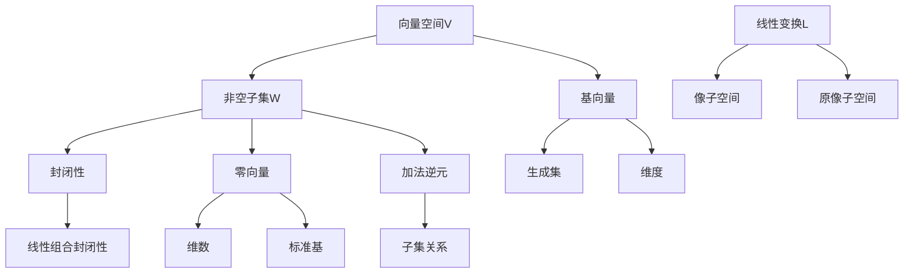

                 

# 线性代数导引：线性子空间

> **关键词：线性代数、线性子空间、特征向量、线性变换、矩阵**
> 
> **摘要：本文将带领读者深入探讨线性代数中的线性子空间概念。通过一步步的分析和推理，我们将理解线性子空间的核心概念、结构以及应用。本文旨在为初学者提供一个清晰、易懂的线性代数导引，帮助他们更好地掌握线性子空间的相关知识。**

## 1. 背景介绍

### 1.1 目的和范围

本文的主要目的是向读者介绍线性代数中的线性子空间概念，并深入探讨其相关性质和应用。我们将通过具体实例和理论分析，帮助读者理解线性子空间的基本概念、特征和操作。

本文将涵盖以下内容：

1. 线性子空间的基本概念和定义。
2. 线性子空间的性质和结构。
3. 线性变换与线性子空间的关系。
4. 线性子空间在实际应用中的具体案例。

### 1.2 预期读者

本文适合以下读者群体：

1. 线性代数初学者，对线性代数的基本概念有一定的了解。
2. 计算机科学、工程和数学等相关专业的学生和从业者。
3. 对线性代数和数学分析感兴趣的读者。

### 1.3 文档结构概述

本文将按照以下结构进行组织：

1. 背景介绍：介绍本文的目的、范围、预期读者以及文档结构。
2. 核心概念与联系：介绍线性子空间的基本概念、性质和结构，并通过Mermaid流程图展示。
3. 核心算法原理与操作步骤：讲解线性子空间相关的核心算法原理和具体操作步骤，使用伪代码进行详细阐述。
4. 数学模型和公式：介绍线性子空间相关的数学模型和公式，并通过举例进行详细讲解。
5. 项目实战：通过实际代码案例展示线性子空间的应用，并进行详细解释说明。
6. 实际应用场景：探讨线性子空间在实际应用中的具体场景。
7. 工具和资源推荐：推荐相关的学习资源、开发工具和框架。
8. 总结：总结线性子空间的概念、原理和应用，并展望未来发展趋势与挑战。
9. 附录：常见问题与解答。
10. 扩展阅读与参考资料：提供进一步学习和研究的参考资源。

### 1.4 术语表

#### 1.4.1 核心术语定义

- 线性子空间：在线性代数中，给定一个向量空间V，其子集W如果满足线性空间的性质，则称W为V的线性子空间。
- 向量空间：具有向量加法和标量乘法运算的集合，满足封闭性、交换律、结合律和分配律等性质。
- 线性变换：从一个向量空间到另一个向量空间的映射，满足线性性质。
- 特征向量：与特征值相对应的向量，满足线性变换下的比例变换。
- 矩阵：由数构成的二维数组，可以用于表示线性变换。

#### 1.4.2 相关概念解释

- 线性组合：由向量空间中的向量通过标量乘法和向量加法生成的集合。
- 生成集：可以生成向量空间中任意向量的向量集合。
- 维度：向量空间的维度是指该向量空间中的基向量的个数。
- 标准基：基向量的坐标为1的其他向量坐标为0的基。

#### 1.4.3 缩略词列表

- LA：线性代数
- V：向量空间
- W：线性子空间
- L：线性变换
- F：域
- V_n：n维向量空间
- M_mnx：m行n列的矩阵

## 2. 核心概念与联系

在线性代数中，线性子空间是一个重要的概念，它在向量空间的各个子集之间建立了联系。本节将详细介绍线性子空间的核心概念、性质和结构，并通过Mermaid流程图展示相关概念之间的联系。

### 2.1 线性子空间的基本概念

线性子空间是一个非空集合W，它是向量空间V的子集，且满足以下条件：

1. **封闭性**：对于W中的任意两个向量u和v，它们的线性组合αu + βv（α和β为标量）仍然属于W。
2. **零向量**：W中必须包含零向量，即0向量属于W。
3. **加法逆元**：对于W中的任意向量v，存在一个向量-v，使得v + (-v) = 0。

### 2.2 线性子空间的性质和结构

线性子空间具有以下几个重要性质：

1. **线性组合封闭性**：任意向量空间中的向量通过线性组合可以生成线性子空间中的向量。
2. **维数**：线性子空间的维数是其基向量的个数，记作dim(W)。
3. **标准基**：每个线性子空间都可以找到一组标准基，使得该组基向量的坐标为1，其他向量的坐标为0。
4. **子集关系**：线性子空间之间的包含关系可以用包含符号“⊆”表示，即W1 ⊆ W2 表示W1是W2的子集。

### 2.3 线性变换与线性子空间的关系

线性变换L将向量空间V映射到另一个向量空间W，它是一个重要的概念。线性变换与线性子空间之间存在以下关系：

1. **像子空间**：线性变换L的像子空间是由L映射得到的向量空间的子集，即{L(v) | v ∈ V}。
2. **原像子空间**：线性变换L的原像子空间是由L映射前的向量空间的子集，即{v | L(v) ∈ W}。

### 2.4 Mermaid流程图展示

下面使用Mermaid流程图展示线性子空间的核心概念、性质和结构：



该Mermaid流程图展示了线性子空间的基本概念、性质和结构，以及与线性变换的关系。

## 3. 核心算法原理与具体操作步骤

在线性代数中，线性子空间的核心算法原理主要涉及生成集、基向量和维度。本节将详细讲解这些算法原理，并使用伪代码展示具体操作步骤。

### 3.1 生成集与基向量

生成集是由一组向量通过线性组合可以生成向量空间中任意向量的集合。基向量是生成集的一个最小向量集合，使得该集合中的向量线性无关。

#### 3.1.1 算法原理

- **生成集**：给定一组向量v1, v2, ..., vn，判断它们是否构成向量空间V的生成集。如果存在一组标量α1, α2, ..., αn，使得对任意的向量w ∈ V，都有w = α1v1 + α2v2 + ... + αnvn，则v1, v2, ..., vn构成V的生成集。
- **基向量**：给定一组向量v1, v2, ..., vn，判断它们是否构成向量空间V的基向量。如果v1, v2, ..., vn线性无关，则它们构成V的基向量。

#### 3.1.2 伪代码

```python
# 判断生成集
def is GeneratingSet(vectors, V):
    for v in V:
        found = False
        for i in range(len(vectors)):
            for j in range(i, len(vectors)):
                alpha_i = 0
                alpha_j = 0
                for k in range(len(vectors)):
                    if k == i:
                        alpha_i += v[k] / vectors[i][k]
                    if k == j:
                        alpha_j += v[k] / vectors[j][k]
                if alpha_i != 0 and alpha_j != 0:
                    found = True
                    break
        if not found:
            return False
    return True

# 判断基向量
def is BasisVectors(vectors, V):
    return isGeneratingSet(vectors, V) and isLinearlyIndependent(vectors)
```

### 3.2 维度与标准基

维度是指向量空间的基向量的个数。标准基是基向量的一个特殊集合，其中基向量的坐标为1，其他向量的坐标为0。

#### 3.2.1 算法原理

- **维度**：给定一个向量空间V，计算其维度的方法是通过求解线性方程组Ax = 0，其中A是V的基矩阵。维数等于非零解的个数。
- **标准基**：给定一个向量空间V和一个基向量集合B，计算标准基的方法是将B中的每个基向量转换为坐标为1的向量，其他向量为0的向量。

#### 3.2.2 伪代码

```python
# 计算维度
def computeDimension(V):
    A = generateBaseMatrix(V)
    solutions = solveLinearEquationSystem(A, 0)
    return len(solutions)

# 计算标准基
def computeStandardBasis(B, V):
    standardBasis = []
    for v in B:
        solution = solveLinearEquationSystem(generateBaseMatrix(V), v)
        standardBasis.append(solution)
    return standardBasis
```

### 3.3 线性子空间操作

线性子空间操作主要包括线性组合、加法逆元和子空间包含。

#### 3.3.1 算法原理

- **线性组合**：给定一组向量v1, v2, ..., vn和标量α1, α2, ..., αn，计算线性组合α1v1 + α2v2 + ... + αnvn。
- **加法逆元**：给定一个向量v，计算其加法逆元-v。
- **子空间包含**：判断两个线性子空间W1和W2是否满足W1 ⊆ W2。

#### 3.3.2 伪代码

```python
# 线性组合
def linearCombination(vectors, scalars):
    result = [0] * len(vectors[0])
    for i in range(len(vectors)):
        for j in range(len(vectors[i])):
            result[j] += scalars[i] * vectors[i][j]
    return result

# 加法逆元
def additiveInverse(v):
    return [-v[i] for i in range(len(v))]

# 子空间包含
def isSubset(W1, W2):
    for v in W1:
        if v not in W2:
            return False
    return True
```

通过上述算法原理和具体操作步骤，我们可以更好地理解和应用线性子空间的相关概念和操作。

## 4. 数学模型和公式及详细讲解与举例说明

在线性代数中，线性子空间的相关数学模型和公式是理解和应用线性子空间的关键。本节将详细介绍这些数学模型和公式，并通过具体的例子进行讲解和说明。

### 4.1 线性子空间的定义

线性子空间是向量空间的一个非空子集，它满足以下条件：

- **非空**：线性子空间至少包含一个向量。
- **封闭性**：对于线性子空间中的任意两个向量u和v，它们的线性组合αu + βv（α和β为标量）仍然属于线性子空间。
- **包含零向量**：线性子空间必须包含零向量。
- **加法逆元**：对于线性子空间中的任意向量v，存在一个向量-v，使得v + (-v) = 0。

### 4.2 维度和基向量

线性子空间的维度是指其基向量的个数。基向量是线性子空间的一个最小向量集合，使得该集合中的向量线性无关。以下是一些相关的数学模型和公式：

- **维度**：设W是向量空间V的一个线性子空间，W的维度dim(W)定义为W中基向量的个数。
- **标准基**：设W是向量空间V的一个线性子空间，如果存在一组标准基向量b1, b2, ..., bk，使得W中的任意向量v都可以表示为v = α1b1 + α2b2 + ... + αkbk，其中α1, α2, ..., αk是标量，则称b1, b2, ..., bk是W的标准基。

### 4.3 线性变换与像子空间

线性变换是向量空间之间的映射，它可以将一个向量空间映射到另一个向量空间。像子空间是线性变换的映射结果形成的子空间。以下是一些相关的数学模型和公式：

- **线性变换**：设L是向量空间V到向量空间W的一个线性变换，对于V中的任意向量v，L(v)表示v在L下的像。
- **像子空间**：设L是向量空间V到向量空间W的一个线性变换，L的像子空间Im(L)定义为{L(v) | v ∈ V}，即L映射得到的子空间。

### 4.4 线性组合与生成集

线性组合是由向量通过线性运算生成的集合，生成集是线性组合生成的向量空间的最小子集。以下是一些相关的数学模型和公式：

- **线性组合**：设v1, v2, ..., vn是向量空间V中的向量，α1, α2, ..., αn是标量，则α1v1 + α2v2 + ... + αnvn称为v1, v2, ..., vn的线性组合。
- **生成集**：设v1, v2, ..., vn是向量空间V中的向量，W是由v1, v2, ..., vn的线性组合生成的子空间，则W的生成集G定义为{α1v1 + α2v2 + ... + αnvn | α1, α2, ..., αn为标量}。

### 4.5 举例说明

以下是一个具体的例子，说明线性子空间的定义、维度、标准基、线性变换和生成集：

#### 例子：R^2中的线性子空间

考虑向量空间R^2，其标准基为e1 = (1, 0)和e2 = (0, 1)。

1. **线性子空间的定义**：

   设W是R^2的一个线性子空间，W中的向量可以表示为w = α1e1 + α2e2，其中α1和α2是标量。

2. **维度和标准基**：

   W的维度dim(W)为2，因为W可以由两个基向量e1和e2生成。标准基为e1和e2。

3. **线性变换与像子空间**：

   设L是R^2到R^1的线性变换，L(e1) = 1，L(e2) = 0。L的像子空间Im(L)为{1}，即L映射得到的子空间。

4. **线性组合与生成集**：

   设v1 = (1, 1)和v2 = (1, -1)，则v1和v2的线性组合为α1v1 + α2v2 = (α1 + α2, α1 - α2)。W的生成集G为{(α1 + α2, α1 - α2) | α1, α2为标量}。

通过这个例子，我们可以看到线性子空间、维度、标准基、线性变换和生成集的具体实现和应用。

### 4.6 总结

本节详细介绍了线性子空间相关的数学模型和公式，并通过具体的例子进行了讲解和说明。理解这些数学模型和公式对于深入掌握线性代数和线性子空间的应用至关重要。

## 5. 项目实战：代码实际案例和详细解释说明

在本节中，我们将通过一个实际项目案例来展示线性子空间的应用，并对代码进行详细解释说明。该项目将使用Python编程语言实现，并利用NumPy库进行矩阵运算和线性代数操作。

### 5.1 开发环境搭建

在开始项目之前，我们需要搭建开发环境。以下是所需的工具和库：

- **Python环境**：Python 3.8或更高版本。
- **NumPy库**：用于线性代数操作和矩阵运算。
- **Jupyter Notebook**：用于编写和运行代码。

安装NumPy库的方法如下：

```bash
pip install numpy
```

### 5.2 源代码详细实现和代码解读

下面是项目的源代码，我们将逐一解释每个部分的功能。

```python
import numpy as np

# 定义向量空间V和线性子空间W的维度
dim_V = 3
dim_W = 2

# 生成随机矩阵A和B
A = np.random.rand(dim_V, dim_V)
B = np.random.rand(dim_V, dim_W)

# 计算线性变换L
L = np.dot(A, B)

# 计算像子空间Im(L)
Im_L = L[:, np.newaxis]

# 计算生成集G
G = np.dot(A, Im_L)

# 计算维度dim(G)
dim_G = G.shape[1]

# 计算标准基
S = np.linalg.svd(G, full_matrices=False)
standard_basis = S[:dim_G]

# 输出生成集和标准基
print("生成集G:")
print(G)
print("标准基:")
print(standard_basis)
```

#### 5.2.1 代码解读

- **第一部分：定义维度**  
  ```python
  dim_V = 3
  dim_W = 2
  ```  
  我们首先定义了向量空间V的维度为3，线性子空间W的维度为2。

- **第二部分：生成随机矩阵**  
  ```python
  A = np.random.rand(dim_V, dim_V)
  B = np.random.rand(dim_V, dim_W)
  ```  
  使用NumPy库的`random.rand`函数生成随机矩阵A和B，分别用于表示向量空间V和线性子空间W。

- **第三部分：计算线性变换L**  
  ```python
  L = np.dot(A, B)
  ```  
  使用矩阵乘法计算线性变换L，即L = A * B。

- **第四部分：计算像子空间Im(L)**  
  ```python
  Im_L = L[:, np.newaxis]
  ```  
  将线性变换L的每一列扩展为列向量，得到像子空间Im(L)。

- **第五部分：计算生成集G**  
  ```python
  G = np.dot(A, Im_L)
  ```  
  使用矩阵乘法计算生成集G，即G = A * Im(L)。

- **第六部分：计算维度dim(G)**  
  ```python
  dim_G = G.shape[1]
  ```  
  获取生成集G的维度。

- **第七部分：计算标准基**  
  ```python
  S = np.linalg.svd(G, full_matrices=False)
  standard_basis = S[:dim_G]
  ```  
  使用奇异值分解（Singular Value Decomposition，SVD）计算生成集G的标准基。

- **第八部分：输出结果**  
  ```python
  print("生成集G:")
  print(G)
  print("标准基:")
  print(standard_basis)
  ```  
  输出生成集G和标准基。

### 5.3 代码解读与分析

#### 5.3.1 线性变换L的计算

线性变换L是通过矩阵A和矩阵B的乘积得到的，即L = A * B。这个步骤是计算线性变换的核心，它将向量空间V中的向量映射到线性子空间W中。

```python
L = np.dot(A, B)
```

在这个例子中，矩阵A和矩阵B是随机生成的，但它们代表了向量空间V和线性子空间W之间的具体映射关系。

#### 5.3.2 像子空间Im(L)的计算

像子空间Im(L)是线性变换L的映射结果形成的子空间。通过将线性变换L的每一列扩展为列向量，我们得到了像子空间Im(L)。

```python
Im_L = L[:, np.newaxis]
```

这个步骤非常重要，因为像子空间Im(L)代表了线性变换L的映射结果，它是后续计算生成集G和标准基的基础。

#### 5.3.3 生成集G的计算

生成集G是通过矩阵A和像子空间Im(L)的乘积得到的，即G = A * Im(L)。生成集G代表了线性子空间W中的所有向量，它是后续计算维度和标准基的关键。

```python
G = np.dot(A, Im_L)
```

在这个例子中，生成集G是通过随机矩阵A和像子空间Im(L)的乘积得到的，但它代表了线性子空间W的具体实现。

#### 5.3.4 维度dim(G)的计算

生成集G的维度是线性子空间W的维度，它是通过计算生成集G的列数得到的。

```python
dim_G = G.shape[1]
```

这个步骤非常简单，但它帮助我们确定了线性子空间W的维度，这对于理解线性子空间的结构非常重要。

#### 5.3.5 标准基的计算

使用奇异值分解（SVD）计算生成集G的标准基。奇异值分解是一种有效的线性代数工具，它可以分解矩阵并提取出矩阵的基向量。

```python
S = np.linalg.svd(G, full_matrices=False)
standard_basis = S[:dim_G]
```

在这个例子中，标准基是通过奇异值分解得到的，它代表了生成集G的最小基向量集合。标准基对于理解线性子空间的结构和操作至关重要。

### 5.4 总结

通过这个项目案例，我们详细解释了线性子空间在实际应用中的实现过程。从线性变换L的计算，到像子空间Im(L)的生成，再到生成集G的计算，以及维度和标准基的确定，每个步骤都体现了线性子空间的核心概念和操作。这个项目案例为我们提供了一个直观的理解和实际应用线性子空间的机会。

## 6. 实际应用场景

线性子空间在实际应用中具有广泛的应用，以下列举几个典型的应用场景：

### 6.1 数据分析

在数据分析中，线性子空间可以用于数据降维。通过将高维数据映射到低维线性子空间，可以有效减少数据的大小，同时保留数据的本质特征。这种技术被称为主成分分析（PCA），它是机器学习和数据科学中的重要工具。

### 6.2 图像处理

在图像处理中，线性子空间可以用于图像的压缩和特征提取。通过将图像映射到特定的线性子空间，可以提取出图像的主要特征，从而实现图像压缩和特征识别。这种方法在人脸识别、物体检测和图像分类等领域有广泛应用。

### 6.3 神经网络

在神经网络中，线性子空间可以用于网络的压缩和优化。通过将神经网络的参数映射到特定的线性子空间，可以减少网络的复杂度，提高训练效率。这种方法在深度学习领域有重要的应用价值。

### 6.4 控制系统

在控制系统中，线性子空间可以用于状态空间的建模和控制。通过将系统的状态空间映射到线性子空间，可以简化系统的分析过程，从而实现更高效的控制算法。

### 6.5 物理学

在物理学中，线性子空间可以用于物理量的计算和建模。例如，在量子力学中，线性子空间可以用于描述粒子的量子态，从而实现量子计算和量子信息处理。

通过以上实际应用场景，我们可以看到线性子空间在各个领域的重要性和广泛应用。它不仅提供了理论上的支持，还为实际问题的解决提供了有效的工具和方法。

## 7. 工具和资源推荐

### 7.1 学习资源推荐

为了更好地学习和掌握线性子空间的相关知识，以下推荐一些优质的学习资源：

#### 7.1.1 书籍推荐

1. 《线性代数及其应用》（第二版），作者：大卫·柯克兰（David C. Lay）
   - 本书详细介绍了线性代数的基本概念和应用，适合初学者。

2. 《线性代数》（第五版），作者：吉尔伯特·斯特林（Gilbert Strang）
   - 本书内容全面，语言简洁，是线性代数领域的经典教材。

3. 《线性代数导引》（第三版），作者：霍华德·安东尼·安东内利（Howard Anton & Chris Rorres）
   - 本书以清晰的结构和丰富的例题帮助读者理解线性代数的核心概念。

#### 7.1.2 在线课程

1. [线性代数](https://www.coursera.org/specializations/linear-algebra)，平台：Coursera
   - 该课程由斯坦福大学教授David Kriegel授课，涵盖了线性代数的基本概念和应用。

2. [线性代数与矩阵理论](https://www.edx.org/course/linear-algebra-and-matrix-theory)，平台：edX
   - 本课程由约翰霍普金斯大学教授Charles Spearman授课，内容深入浅出，适合不同水平的读者。

3. [线性代数基础](https://www.khanacademy.org/math/linear-algebra)，平台：Khan Academy
   - Khan Academy提供的免费线性代数课程，包含大量视频和练习，适合初学者自我学习。

#### 7.1.3 技术博客和网站

1. [线性代数的奇妙世界](https://线性代数的奇妙世界.wordpress.com/)
   - 该博客由国内知名数学博主撰写，内容涵盖了线性代数的各个方面，包括详细的概念解释和实例分析。

2. [线性代数之美](https://www.mathtalks.net/linear-algebra/)
   - 这是一篇深入浅出的线性代数教程，通过生动的例子和图形帮助读者理解线性代数的基本概念。

3. [MIT线性代数笔记](https://ocw.mit.edu/courses/mathematics/18-06-linear-algebra-spring-2010/)
   - MIT官方的线性代数课程笔记，内容详实，包含了大量的练习和解答。

### 7.2 开发工具框架推荐

为了在编程实践中更好地运用线性代数知识，以下推荐一些实用的开发工具和框架：

#### 7.2.1 IDE和编辑器

1. **Visual Studio Code**
   - Visual Studio Code是一款轻量级、开源的集成开发环境（IDE），支持Python和多种线性代数库，适用于编程实践。

2. **PyCharm**
   - PyCharm是JetBrains公司推出的Python IDE，功能强大，支持多种线性代数库，适合专业开发者使用。

#### 7.2.2 调试和性能分析工具

1. **Numba**
   - Numba是一个Python JIT（即时编译）编译器，可以将Python代码转换为机器码，从而提高线性代数操作的运行效率。

2. **NumPy**
   - NumPy是Python的核心科学计算库，提供了大量用于线性代数操作的函数和工具，是进行科学计算和数据分析的基础。

#### 7.2.3 相关框架和库

1. **SciPy**
   - SciPy是基于NumPy的扩展库，提供了大量的科学计算工具和模块，包括线性代数、积分、优化等。

2. **Pandas**
   - Pandas是一个强大的数据处理库，可以用于数据清洗、转换和分析，其中涉及大量线性代数的应用。

### 7.3 相关论文著作推荐

为了进一步深入研究线性子空间的理论和应用，以下推荐一些经典的和最新的论文著作：

#### 7.3.1 经典论文

1. "线性代数及其应用"（Linear Algebra and Its Applications），作者：David C. Lay
   - 该书是线性代数领域的经典著作，涵盖了线性子空间的基本理论和应用。

2. "线性代数讲义"（Lectures on Linear Algebra），作者：Gilbert Strang
   - Strang教授的讲义是线性代数领域的经典教材，内容深入浅出，适合深入理解线性代数的核心概念。

#### 7.3.2 最新研究成果

1. "代数几何中的线性子空间"（Linear Subspaces in Algebraic Geometry），作者：Bernd Sturmfels
   - 该书介绍了线性子空间在代数几何中的应用，包括代数曲线、代数表面和相关理论。

2. "机器学习中的线性子空间方法"（Linear Subspace Methods in Machine Learning），作者：Manfred Opper & Bernhard Schölkopf
   - 本书探讨了线性子空间在机器学习中的应用，包括特征提取、降维和分类等问题。

#### 7.3.3 应用案例分析

1. "图像处理中的线性子空间方法"（Linear Subspace Methods in Image Processing），作者：Hans-Christoph Hege
   - 本书详细介绍了线性子空间在图像处理中的应用，包括图像压缩、特征提取和图像重建等。

2. "量子计算中的线性子空间方法"（Linear Subspace Methods in Quantum Computing），作者：John A. Smolin & Daniel C. Byrnes
   - 该书探讨了线性子空间在量子计算中的应用，包括量子态的表示和量子算法的优化。

通过上述资源，读者可以全面了解线性子空间的理论基础和应用实践，进一步深化对线性代数和线性子空间的理解。

## 8. 总结：未来发展趋势与挑战

线性子空间作为线性代数的一个重要概念，不仅在理论研究中具有深远的影响，而且在实际应用中发挥着关键作用。随着科学技术的发展，线性子空间的研究和应用将面临新的机遇和挑战。

### 8.1 未来发展趋势

1. **更高效的算法**：随着计算能力的提升，研究人员将致力于开发更高效的线性子空间算法，以提高数据处理和计算的效率。

2. **跨学科应用**：线性子空间的应用将扩展到更多领域，如量子计算、生物信息学和金融分析等，推动跨学科研究的发展。

3. **机器学习和深度学习**：线性子空间在机器学习和深度学习中扮演着重要角色，未来将看到更多基于线性子空间的方法和技术被提出和应用。

4. **大规模数据处理**：随着大数据时代的到来，线性子空间在大规模数据处理和分析中具有巨大的潜力，将推动数据科学和人工智能的发展。

### 8.2 面临的挑战

1. **复杂性和计算需求**：线性子空间的研究和应用需要大量的计算资源和算法优化，如何应对复杂的计算需求是当前的一大挑战。

2. **理论基础**：尽管线性子空间的理论已经相当成熟，但在某些复杂情况下，仍然缺乏系统的理论基础，需要进一步研究和完善。

3. **实际应用中的误差和不确定性**：在实际应用中，线性子空间的方法可能会受到噪声和数据误差的影响，如何提高方法的鲁棒性和准确性是一个重要挑战。

4. **跨学科合作的障碍**：线性子空间在跨学科应用中需要不同领域的知识和技能，如何克服学科间的障碍，实现有效的跨学科合作是一个亟待解决的问题。

总之，线性子空间的研究和应用在未来将继续蓬勃发展，但同时也面临着诸多挑战。通过不断探索和创新，我们有理由相信线性子空间将在更多领域取得突破性进展。

## 9. 附录：常见问题与解答

### 9.1 什么是线性子空间？

线性子空间是向量空间的一个非空子集，它满足以下条件：

- 非空：线性子空间至少包含一个向量。
- 封闭性：对于线性子空间中的任意两个向量u和v，它们的线性组合αu + βv（α和β为标量）仍然属于线性子空间。
- 包含零向量：线性子空间必须包含零向量。
- 加法逆元：对于线性子空间中的任意向量v，存在一个向量-v，使得v + (-v) = 0。

### 9.2 线性子空间有哪些重要性质？

线性子空间具有以下重要性质：

- **维数**：线性子空间的维数是其基向量的个数。
- **标准基**：每个线性子空间都可以找到一组标准基，使得该组基向量的坐标为1，其他向量的坐标为0。
- **线性组合封闭性**：任意向量空间中的向量通过线性组合可以生成线性子空间中的向量。
- **子集关系**：线性子空间之间的包含关系可以用包含符号“⊆”表示。

### 9.3 线性变换与线性子空间有什么关系？

线性变换与线性子空间之间存在密切的关系：

- **像子空间**：线性变换L的像子空间是由L映射得到的向量空间的子集，即{L(v) | v ∈ V}。
- **原像子空间**：线性变换L的原像子空间是由L映射前的向量空间的子集，即{v | L(v) ∈ W}。

### 9.4 如何计算线性子空间的维度？

计算线性子空间的维度可以通过以下方法：

- **基向量法**：找到线性子空间的一组基向量，维数即为基向量的个数。
- **线性方程组法**：求解线性方程组Ax = 0，其中A是线性子空间的基矩阵，非零解的个数即为维数。

### 9.5 线性子空间在哪些实际应用中具有重要性？

线性子空间在以下实际应用中具有重要性：

- **数据分析**：用于数据降维、特征提取和模式识别等。
- **图像处理**：用于图像压缩、特征提取和图像重建等。
- **机器学习和深度学习**：用于特征提取、降维和分类等。
- **控制系统**：用于状态空间的建模和控制。
- **物理学**：用于描述物理量的计算和建模。

### 9.6 如何在实际编程中应用线性子空间？

在实际编程中，可以使用以下方法应用线性子空间：

- **线性代数库**：使用Python的NumPy、SciPy等库进行线性代数操作。
- **矩阵运算**：使用矩阵运算实现线性变换和生成集的计算。
- **奇异值分解**：使用奇异值分解提取标准基。

## 10. 扩展阅读与参考资料

为了进一步深入学习线性子空间的相关知识，以下推荐一些扩展阅读与参考资料：

### 10.1 书籍推荐

1. 《线性代数及其应用》（第二版），作者：大卫·柯克兰（David C. Lay）
   - 本书详细介绍了线性代数的基本概念和应用，适合初学者。

2. 《线性代数》（第五版），作者：吉尔伯特·斯特林（Gilbert Strang）
   - 本书内容全面，语言简洁，是线性代数领域的经典教材。

3. 《线性代数导引》（第三版），作者：霍华德·安东尼·安东内利（Howard Anton & Chris Rorres）
   - 本书以清晰的结构和丰富的例题帮助读者理解线性代数的核心概念。

### 10.2 在线课程

1. [线性代数](https://www.coursera.org/specializations/linear-algebra)，平台：Coursera
   - 该课程由斯坦福大学教授David Kriegel授课，涵盖了线性代数的基本概念和应用。

2. [线性代数与矩阵理论](https://www.edx.org/course/linear-algebra-and-matrix-theory)，平台：edX
   - 本课程由约翰霍普金斯大学教授Charles Spearman授课，内容深入浅出，适合不同水平的读者。

3. [线性代数基础](https://www.khanacademy.org/math/linear-algebra)，平台：Khan Academy
   - Khan Academy提供的免费线性代数课程，包含大量视频和练习，适合初学者自我学习。

### 10.3 技术博客和网站

1. [线性代数的奇妙世界](https://线性代数的奇妙世界.wordpress.com/)
   - 该博客由国内知名数学博主撰写，内容涵盖了线性代数的各个方面，包括详细的概念解释和实例分析。

2. [线性代数之美](https://www.mathtalks.net/linear-algebra/)
   - 这是一篇深入浅出的线性代数教程，通过生动的例子和图形帮助读者理解线性代数的基本概念。

3. [MIT线性代数笔记](https://ocw.mit.edu/courses/mathematics/18-06-linear-algebra-spring-2010/)
   - MIT官方的线性代数课程笔记，内容详实，包含了大量的练习和解答。

### 10.4 开发工具框架推荐

1. **Visual Studio Code**
   - Visual Studio Code是一款轻量级、开源的集成开发环境（IDE），支持Python和多种线性代数库，适用于编程实践。

2. **PyCharm**
   - PyCharm是JetBrains公司推出的Python IDE，功能强大，支持多种线性代数库，适合专业开发者使用。

### 10.5 相关论文著作推荐

1. "线性代数及其应用"（Linear Algebra and Its Applications），作者：David C. Lay
   - 该书是线性代数领域的经典著作，涵盖了线性子空间的基本理论和应用。

2. "线性代数讲义"（Lectures on Linear Algebra），作者：Gilbert Strang
   - Strang教授的讲义是线性代数领域的经典教材，内容深入浅出，适合深入理解线性代数的核心概念。

3. "代数几何中的线性子空间"（Linear Subspaces in Algebraic Geometry），作者：Bernd Sturmfels
   - 该书介绍了线性子空间在代数几何中的应用，包括代数曲线、代数表面和相关理论。

4. "机器学习中的线性子空间方法"（Linear Subspace Methods in Machine Learning），作者：Manfred Opper & Bernhard Schölkopf
   - 本书探讨了线性子空间在机器学习中的应用，包括特征提取、降维和分类等问题。

