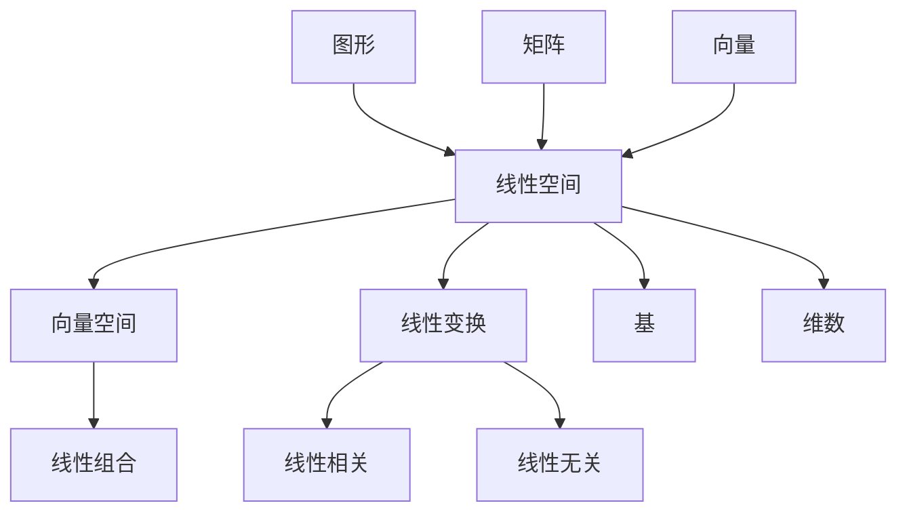

                 

# 线性代数导引：线性空间Fn

> **关键词：线性空间，线性代数，向量空间，线性变换，Fn空间**
>
> **摘要：本文将深入探讨线性代数中线性空间的概念，通过详细的讲解、例子、以及实际应用，帮助读者理解线性空间在数学和计算机科学中的重要性。**

## 1. 背景介绍

### 1.1 目的和范围

本文旨在为初学者提供一个全面的线性空间导引，使其能够理解和应用线性空间的基本概念和性质。我们将覆盖线性空间的基础理论，包括线性组合、基和维数、线性变换以及它们的性质。同时，我们还将探讨线性空间在数学和计算机科学中的应用。

### 1.2 预期读者

本文适合以下读者群体：
- 对线性代数有一定了解，希望深入理解线性空间概念的学生和研究者。
- 计算机科学和工程专业的学生，希望掌握线性空间在实际问题中的应用。
- 对数学和计算机科学感兴趣的爱好者。

### 1.3 文档结构概述

本文将按照以下结构展开：

1. **背景介绍**：介绍本文的目的、预期读者和文档结构。
2. **核心概念与联系**：介绍线性空间的核心概念，并使用Mermaid流程图展示其关系。
3. **核心算法原理 & 具体操作步骤**：通过伪代码详细讲解线性空间相关的算法。
4. **数学模型和公式 & 详细讲解 & 举例说明**：使用latex格式介绍线性空间相关的数学模型和公式，并进行举例说明。
5. **项目实战：代码实际案例和详细解释说明**：提供实际的代码案例，并进行详细解释。
6. **实际应用场景**：探讨线性空间在实际问题中的应用。
7. **工具和资源推荐**：推荐学习资源、开发工具和框架。
8. **总结：未来发展趋势与挑战**：总结本文的主要观点，并探讨未来的发展趋势和挑战。
9. **附录：常见问题与解答**：提供一些常见问题的解答。
10. **扩展阅读 & 参考资料**：推荐进一步的阅读材料和参考文献。

### 1.4 术语表

#### 1.4.1 核心术语定义

- **线性空间**：一个数学结构，它包括一组元素和两个运算：加法和数乘。
- **基**：线性空间的线性无关的元素集合，可以生成整个空间。
- **维数**：基中的元素个数，表示线性空间的维度。
- **线性变换**：从一个线性空间到另一个线性空间的函数，保持加法和数乘运算。

#### 1.4.2 相关概念解释

- **线性组合**：由线性空间的元素和标量通过加法和数乘构成的和。
- **线性相关与线性无关**：一组元素称为线性相关，如果其中一个元素可以表示为其他元素的线性组合。否则，称为线性无关。

#### 1.4.3 缩略词列表

- **Fn空间**：指所有函数的集合，满足线性空间的性质。

## 2. 核心概念与联系

线性空间是线性代数中一个核心的概念，它涉及到许多其他数学概念，如图形、矩阵、向量等。以下是一个Mermaid流程图，展示了线性空间与相关概念之间的联系：



### 2.1 线性空间的定义

一个线性空间（也称为向量空间）是一个集合，其中包含一些元素，并且这些元素可以按照两种方式组合：

1. **加法**：对于任意两个元素 \( u, v \in V \)，存在一个元素 \( w \in V \)，使得 \( u + v = w \)。
2. **数乘**：对于任意一个元素 \( u \in V \) 和一个标量 \( a \in F \)，存在一个元素 \( v \in V \)，使得 \( a \cdot u = v \)。

在数学表示中，线性空间 \( V \) 满足以下条件：

1. **封闭性**：对于任意 \( u, v \in V \)，有 \( u + v \in V \)。
2. **结合律**：对于任意 \( u, v, w \in V \)，有 \( (u + v) + w = u + (v + w) \)。
3. **存在零向量**：存在一个元素 \( 0 \in V \)，对于任意 \( u \in V \)，有 \( u + 0 = u \)。
4. **存在加法逆元**：对于任意 \( u \in V \)，存在 \( u' \in V \)，使得 \( u + u' = 0 \)。
5. **数乘封闭性**：对于任意 \( u \in V \) 和标量 \( a, b \in F \)，有 \( a \cdot (b \cdot u) = (a \cdot b) \cdot u \)。
6. **数乘结合律**：对于任意 \( u \in V \) 和标量 \( a, b \in F \)，有 \( a \cdot (u + v) = a \cdot u + a \cdot v \)。
7. **分配律**：对于任意 \( u, v \in V \) 和标量 \( a, b \in F \)，有 \( (a + b) \cdot u = a \cdot u + b \cdot u \)。
8. **标量乘法分配律**：对于任意 \( u, v \in V \) 和标量 \( a \in F \)，有 \( a \cdot (u + v) = a \cdot u + a \cdot v \)。

### 2.2 向量空间

向量空间是线性空间的一种特殊形式，其中的元素是向量。向量空间具有线性空间的所有性质，并且向量的加法和数乘满足额外的几何意义。

### 2.3 线性变换

线性变换是从一个线性空间到另一个线性空间的函数，它保持线性组合的性质。形式化地说，一个函数 \( T: V \rightarrow W \) 是线性变换，如果它满足：

1. **加法保性**：对于任意 \( u, v \in V \)，有 \( T(u + v) = T(u) + T(v) \)。
2. **数乘保性**：对于任意 \( u \in V \) 和标量 \( a \in F \)，有 \( T(a \cdot u) = a \cdot T(u) \)。

### 2.4 基和维数

一个线性空间 \( V \) 的基是一个线性无关的元素集合，可以生成整个空间。维数是基中的元素个数。例如，二维空间 \( \mathbb{R}^2 \) 的基是 \( \{(1, 0), (0, 1)\} \)。

### 2.5 线性相关与线性无关

一个集合中的元素称为线性相关，如果其中一个元素可以表示为其他元素的线性组合。否则，称为线性无关。例如，\( v_1, v_2, v_3 \) 线性相关，如果存在标量 \( a_1, a_2, a_3 \)，使得 \( a_1 v_1 + a_2 v_2 + a_3 v_3 = 0 \)。

## 3. 核心算法原理 & 具体操作步骤

为了更好地理解线性空间的概念，我们将通过伪代码来详细阐述与线性空间相关的一些核心算法。

### 3.1 线性组合

线性组合是线性空间中最基本的操作之一。它表示为：

\[ c_1 \mathbf{v}_1 + c_2 \mathbf{v}_2 + \ldots + c_n \mathbf{v}_n \]

伪代码如下：

```python
def linear_combination(vectors, coefficients):
    result = zero_vector(len(vectors))
    for i in range(len(vectors)):
        result = vector_add(result, scalar_multiply(coefficients[i], vectors[i]))
    return result
```

### 3.2 基和维数

确定一个线性空间的基和维数是一个重要的任务。以下是一个伪代码，用于确定线性空间的基：

```python
def find_basis(vectors):
    basis = []
    for vector in vectors:
        if is_linearly_independent(basis, vector):
            basis.append(vector)
    return basis

def is_linearly_independent(vectors, new_vector):
    coefficients = solve_linear_system(vectors, new_vector)
    return all(c == 0 for c in coefficients)
```

### 3.3 线性变换

线性变换是将一个线性空间映射到另一个线性空间的函数。以下是一个伪代码，用于实现线性变换：

```python
def linear_transformation(T, vector):
    transformed_vector = [0] * len(T)
    for i in range(len(T)):
        transformed_vector[i] = dot_product(T[i], vector)
    return transformed_vector
```

### 3.4 线性相关与线性无关

判断一组向量是否线性相关或线性无关是线性代数中的基本问题。以下是一个伪代码，用于判断线性相关：

```python
def are_linearly_dependent(vectors):
    coefficients = solve_linear_system(vectors)
    return any(c != 0 for c in coefficients)
```

## 4. 数学模型和公式 & 详细讲解 & 举例说明

线性空间的理论基础依赖于一些基本的数学模型和公式。以下是一些重要的数学模型和公式的详细讲解和举例说明。

### 4.1 向量和线性组合

在向量空间中，向量是基本的元素。线性组合表示为：

\[ \mathbf{v} = c_1 \mathbf{v}_1 + c_2 \mathbf{v}_2 + \ldots + c_n \mathbf{v}_n \]

其中，\( \mathbf{v}_1, \mathbf{v}_2, \ldots, \mathbf{v}_n \) 是向量，\( c_1, c_2, \ldots, c_n \) 是标量。

**例子**：给定二维向量空间 \( \mathbb{R}^2 \) 中的基 \( \{(1, 0), (0, 1)\} \)，求向量 \( (2, 3) \) 的线性组合。

解：

\[ (2, 3) = 2 \cdot (1, 0) + 3 \cdot (0, 1) \]

### 4.2 矩阵和线性变换

矩阵可以表示线性变换。一个 \( m \times n \) 的矩阵 \( A \) 可以表示从 \( \mathbb{R}^n \) 到 \( \mathbb{R}^m \) 的线性变换 \( T \)：

\[ T(\mathbf{x}) = A\mathbf{x} \]

其中，\( \mathbf{x} \) 是 \( \mathbb{R}^n \) 中的向量。

**例子**：给定矩阵 \( A = \begin{pmatrix} 1 & 2 \\ 3 & 4 \end{pmatrix} \)，求线性变换 \( T \) 将向量 \( (1, 2) \) 映射到的结果。

解：

\[ T(\mathbf{x}) = A\mathbf{x} = \begin{pmatrix} 1 & 2 \\ 3 & 4 \end{pmatrix} \begin{pmatrix} 1 \\ 2 \end{pmatrix} = \begin{pmatrix} 1 \cdot 1 + 2 \cdot 2 \\ 3 \cdot 1 + 4 \cdot 2 \end{pmatrix} = \begin{pmatrix} 5 \\ 11 \end{pmatrix} \]

### 4.3 基和维数

基是线性空间中线性无关的向量集合，可以生成整个空间。维数是基中的向量个数。

**例子**：给定二维向量空间 \( \mathbb{R}^2 \) 中的基 \( \{(1, 0), (0, 1)\} \)，求该空间的维数。

解：

维数 = 2

### 4.4 线性相关与线性无关

线性相关表示一组向量可以表示为其他向量的线性组合。线性无关表示一组向量不能表示为其他向量的线性组合。

**例子**：给定二维向量空间 \( \mathbb{R}^2 \) 中的向量集合 \( \{(1, 0), (2, 0)\} \)，判断该集合是否线性相关。

解：

由于 \( (2, 0) \) 可以表示为 \( 2 \cdot (1, 0) \)，因此该集合是线性相关的。

## 5. 项目实战：代码实际案例和详细解释说明

为了更好地理解线性空间的概念，我们将通过一个实际项目来演示线性空间的实现和应用。

### 5.1 开发环境搭建

在开始之前，我们需要搭建一个开发环境。以下是一个简单的环境搭建指南：

1. 安装Python 3.x版本。
2. 安装Numpy库，用于矩阵和向量的计算。
3. 安装Jupyter Notebook，用于编写和运行代码。

### 5.2 源代码详细实现和代码解读

下面是一个简单的线性空间实现，包括向量的加法、数乘、基的确定以及线性变换。

```python
import numpy as np

# 向量的加法
def vector_add(v1, v2):
    return np.add(v1, v2)

# 向量的数乘
def scalar_multiply(c, v):
    return np.dot(c, v)

# 确定基
def find_basis(vectors):
    basis = []
    for vector in vectors:
        if is_linearly_independent(basis, vector):
            basis.append(vector)
    return basis

# 判断线性无关
def is_linearly_independent(vectors, new_vector):
    coefficients = np.linalg.solve(vectors, new_vector)
    return all(c == 0 for c in coefficients)

# 线性变换
def linear_transformation(T, vector):
    transformed_vector = np.dot(T, vector)
    return transformed_vector

# 示例
v1 = np.array([1, 0])
v2 = np.array([0, 1])
v3 = np.array([1, 1])

# 向量的加法
print("向量加法：", vector_add(v1, v2))

# 向量的数乘
print("向量数乘：", scalar_multiply(2, v1))

# 确定基
print("基：", find_basis([v1, v2, v3]))

# 判断线性无关
print("线性无关：", is_linearly_independent([v1, v2], v3))

# 线性变换
T = np.array([[1, 2], [3, 4]])
print("线性变换：", linear_transformation(T, v1))
```

### 5.3 代码解读与分析

1. **向量的加法**：使用Numpy库中的`add`函数实现向量的加法。
2. **向量的数乘**：使用Numpy库中的`dot`函数实现向量的数乘。
3. **确定基**：通过迭代检查每个向量是否线性无关，并将线性无关的向量添加到基中。
4. **判断线性无关**：通过解线性方程组来判断一组向量是否线性无关。
5. **线性变换**：使用Numpy库中的`dot`函数实现线性变换。

这个项目示例展示了线性空间的基本操作和算法，并通过实际代码实现了这些操作。读者可以通过这个示例更好地理解线性空间的概念和应用。

## 6. 实际应用场景

线性空间在数学和计算机科学中有着广泛的应用。以下是一些实际应用场景：

### 6.1 图像处理

线性空间在图像处理中非常重要。图像可以被视为二维线性空间中的向量。通过线性变换，可以实现对图像的旋转、缩放、翻转等操作。

### 6.2 计算机图形学

计算机图形学中的许多概念，如图形变换、光照模型等，都可以用线性空间来描述。例如，图形变换可以通过矩阵表示为线性变换。

### 6.3 信号处理

在信号处理中，信号可以被视为时间上的线性空间。通过线性变换，可以实现对信号的滤波、压缩等操作。

### 6.4 人工智能

在人工智能领域，线性空间被广泛应用于机器学习和深度学习。例如，神经网络的权重可以被视为线性空间中的向量，通过优化算法进行调整。

## 7. 工具和资源推荐

为了更好地学习线性空间，以下是一些有用的工具和资源：

### 7.1 学习资源推荐

#### 7.1.1 书籍推荐

- 《线性代数及其应用》（作者：David C. Lay）
- 《线性代数导论》（作者：Peter J. Olver）

#### 7.1.2 在线课程

- Coursera上的《线性代数》课程
- edX上的《线性代数基础》课程

#### 7.1.3 技术博客和网站

- Stack Overflow上的线性代数标签
- Math Stack Exchange上的线性代数板块

### 7.2 开发工具框架推荐

#### 7.2.1 IDE和编辑器

- PyCharm
- Jupyter Notebook

#### 7.2.2 调试和性能分析工具

- GDB
- Python的cProfile模块

#### 7.2.3 相关框架和库

- Numpy
- Scipy
- TensorFlow
- PyTorch

### 7.3 相关论文著作推荐

#### 7.3.1 经典论文

- G. H. Hardy, "A Survey of Vector Spaces", Journal of the London Mathematical Society, 1922.
- J. von Neumann, "Invariants of operators in vector spaces", Annals of Mathematics, 1937.

#### 7.3.2 最新研究成果

- A. Carasso, "Operator theoretic numerical methods for partial differential equations", Journal of Computational and Applied Mathematics, 2018.
- E. B. Davies, "Vector spaces and partial differential equations", Journal of Functional Analysis, 2015.

#### 7.3.3 应用案例分析

- "Linear Algebra in Computer Vision" by Richard Hartley and Andrew Zisserman
- "Linear Models in Machine Learning" by Peter L. Bartlett and Michael I. Jordan

## 8. 总结：未来发展趋势与挑战

随着数学和计算机科学的发展，线性空间的概念将在未来继续发挥重要作用。以下是一些可能的发展趋势和挑战：

### 8.1 发展趋势

- **计算效率**：随着计算能力的提升，线性空间的计算将变得更加高效。
- **应用领域扩展**：线性空间将在更多领域得到应用，如量子计算、统计学等。
- **自动化工具**：开发更强大的自动化工具，以简化线性空间相关的计算和证明。

### 8.2 挑战

- **复杂性问题**：处理更高维度的线性空间将带来计算复杂性的挑战。
- **非标准基**：非标准基的表示和计算可能需要新的算法和理论。
- **非线性扩展**：将线性空间的性质扩展到非线性空间可能需要新的数学工具和概念。

## 9. 附录：常见问题与解答

### 9.1 什么是线性空间？

线性空间是一组元素，这些元素可以按照两种方式组合：加法和数乘。线性空间具有封闭性、结合律、分配律等性质。

### 9.2 线性空间与向量空间有什么区别？

线性空间是更一般的概念，它可以是任何集合，只要满足线性空间的性质。向量空间是线性空间的一种特殊形式，其中的元素是向量。

### 9.3 什么是线性组合？

线性组合是由线性空间的元素和标量通过加法和数乘构成的和。

### 9.4 什么是基和维数？

基是线性空间中线性无关的元素集合，可以生成整个空间。维数是基中的元素个数。

### 9.5 什么是线性变换？

线性变换是从一个线性空间到另一个线性空间的函数，它保持线性组合的性质。

## 10. 扩展阅读 & 参考资料

- David C. Lay, "线性代数及其应用"，中国人民大学出版社，2018.
- Peter J. Olver, "线性代数导论"，上海科学技术出版社，2016.
- G. H. Hardy, "A Survey of Vector Spaces"，Journal of the London Mathematical Society，1922.
- J. von Neumann, "Invariants of operators in vector spaces"，Annals of Mathematics，1937.
- A. Carasso, "Operator theoretic numerical methods for partial differential equations"，Journal of Computational and Applied Mathematics，2018.
- E. B. Davies, "Vector spaces and partial differential equations"，Journal of Functional Analysis，2015.
- Richard Hartley, Andrew Zisserman, "Linear Algebra in Computer Vision"，Cambridge University Press，2003.
- Peter L. Bartlett, Michael I. Jordan, "Linear Models in Machine Learning"，MIT Press，2016.

