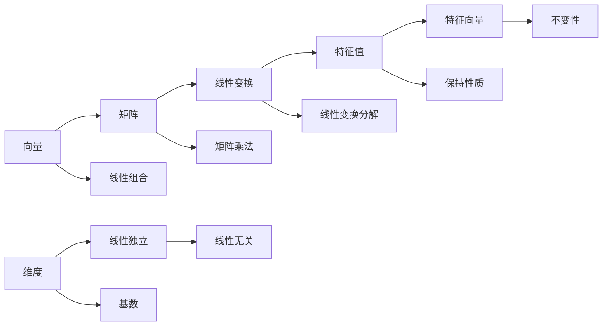

                 

# 线性代数导引：自然数平面之势

> **关键词：线性代数，自然数平面，向量，矩阵，特征值，特征向量，线性变换，维度，线性独立**
> 
> **摘要：本文将深入探讨线性代数的基础概念和应用，特别是如何在一个自然的数平面中对向量、矩阵及其变换进行分析。我们将通过逐步分析推理，深入理解线性代数的核心原理，从而为读者提供一套清晰、实用的线性代数知识体系。**

## 1. 背景介绍

### 1.1 目的和范围

本文旨在为初学者提供一条清晰的线性代数学习路径。我们将从基本概念出发，逐步探讨向量和矩阵的运算、线性变换、特征值与特征向量等重要内容。通过实际应用案例，我们将加深对线性代数概念的理解，并展示其在实际问题解决中的重要性。

### 1.2 预期读者

本文适合对线性代数有初步了解的读者，包括大学生、研究生以及从事相关领域的工程师。无论您是初学者还是希望重温线性代数知识，本文都将为您提供丰富的资源和实用的建议。

### 1.3 文档结构概述

本文将分为以下章节：

1. **背景介绍**：介绍本文的目的、范围、预期读者以及文档结构。
2. **核心概念与联系**：讨论线性代数的基本概念，如向量、矩阵和线性变换。
3. **核心算法原理与具体操作步骤**：通过伪代码详细阐述核心算法的原理和步骤。
4. **数学模型和公式**：介绍线性代数中的常用数学模型和公式，并进行详细讲解和举例。
5. **项目实战**：通过实际案例展示线性代数的应用。
6. **实际应用场景**：探讨线性代数在各类实际应用中的重要性。
7. **工具和资源推荐**：推荐学习资源和开发工具。
8. **总结：未来发展趋势与挑战**：总结线性代数的发展趋势和面临的挑战。
9. **附录：常见问题与解答**：解答读者可能遇到的问题。
10. **扩展阅读与参考资料**：提供进一步的阅读资源。

### 1.4 术语表

#### 1.4.1 核心术语定义

- **向量**：具有大小和方向的量。
- **矩阵**：由若干行和若干列组成的矩形数组。
- **线性变换**：将一个向量空间映射到另一个向量空间的线性操作。
- **特征值**：线性变换中的特殊标量，可以用来分解线性变换。
- **特征向量**：与特征值相关联的向量，具有保持线性变换的性质。
- **维度**：向量空间的基数，即该空间中线性无关向量的数量。
- **线性独立**：一组向量线性无关，即其中任意一个向量都不能由其他向量线性组合得到。

#### 1.4.2 相关概念解释

- **向量加法**：两个向量相加，结果为一个新向量。
- **向量数乘**：一个向量乘以一个标量，结果仍为一个向量。
- **矩阵乘法**：两个矩阵的元素按照特定规则相乘，结果为一个新的矩阵。
- **行列式**：矩阵的一个数值特征，可以用于判断矩阵的行列式是否为零。
- **逆矩阵**：矩阵的一种特殊形式，可以与原矩阵相乘得到单位矩阵。

#### 1.4.3 缩略词列表

- **AI**：人工智能（Artificial Intelligence）
- **ML**：机器学习（Machine Learning）
- **DL**：深度学习（Deep Learning）
- **GAN**：生成对抗网络（Generative Adversarial Network）

## 2. 核心概念与联系

线性代数是研究向量、矩阵及其运算的数学分支。在我们的日常生活中，线性代数无处不在，从物理学中的力学问题到计算机科学中的图像处理，都有着广泛的应用。

### 向量与矩阵的基本概念

向量是具有大小和方向的量，可以表示为有序数组的元素。在二维空间中，一个向量可以表示为 \((x, y)\)，其中 \(x\) 和 \(y\) 分别表示向量在 \(x\) 轴和 \(y\) 轴上的分量。矩阵是一个由若干行和若干列组成的矩形数组，可以表示为：

\[
A = \begin{bmatrix}
a_{11} & a_{12} & \dots & a_{1n} \\
a_{21} & a_{22} & \dots & a_{2n} \\
\vdots & \vdots & \ddots & \vdots \\
a_{m1} & a_{m2} & \dots & a_{mn}
\end{bmatrix}
\]

### 线性变换

线性变换是将一个向量空间映射到另一个向量空间的线性操作。一个线性变换可以用矩阵表示，例如，将向量 \((x, y)\) 映射到 \((x', y')\)：

\[
\begin{bmatrix}
x' \\
y'
\end{bmatrix}
=
\begin{bmatrix}
a & b \\
c & d
\end{bmatrix}
\begin{bmatrix}
x \\
y
\end{bmatrix}
\]

这个线性变换可以用矩阵乘法表示为 \(A \cdot \vec{v}\)，其中 \(A\) 是线性变换的矩阵，\(\vec{v}\) 是输入向量。

### 特征值与特征向量

特征值和特征向量是线性变换中的特殊概念。一个线性变换 \(A\) 的特征值 \(\lambda\) 和特征向量 \(\vec{v}\) 满足以下关系：

\[
A \cdot \vec{v} = \lambda \cdot \vec{v}
\]

特征值可以用来分解线性变换，而特征向量则具有保持线性变换的性质。例如，如果一个向量是线性变换 \(A\) 的特征向量，则它在该线性变换下保持不变。

### 维度与线性独立

维度是向量空间的基数，即该空间中线性无关向量的数量。例如，二维向量空间的维度为2，三维向量空间的维度为3。

线性独立是指一组向量线性无关，即其中任意一个向量都不能由其他向量线性组合得到。例如，向量组 \((\vec{v}_1, \vec{v}_2, \vec{v}_3)\) 是线性独立的，当且仅当不存在非零标量 \(a, b, c\) 使得 \(a\vec{v}_1 + b\vec{v}_2 + c\vec{v}_3 = \vec{0}\)。

#### Mermaid 流程图

以下是线性代数核心概念之间的联系和关系：



## 3. 核心算法原理 & 具体操作步骤

在了解了线性代数的基本概念后，我们将通过伪代码详细阐述核心算法的原理和步骤，以便读者能够更好地理解和应用这些概念。

### 3.1 向量加法

向量加法是指将两个向量对应分量相加，得到一个新的向量。以下是向量加法的伪代码：

```python
def vector_addition(v1, v2):
    result = []
    for i in range(len(v1)):
        result.append(v1[i] + v2[i])
    return result
```

### 3.2 向量数乘

向量数乘是指将一个向量与一个标量相乘，得到一个新的向量。以下是向量数乘的伪代码：

```python
def vector_scalar_multiplication(v, c):
    result = []
    for i in range(len(v)):
        result.append(v[i] * c)
    return result
```

### 3.3 矩阵乘法

矩阵乘法是指将两个矩阵的元素按照特定规则相乘，得到一个新的矩阵。以下是矩阵乘法的伪代码：

```python
def matrix_multiplication(A, B):
    result = [[0 for _ in range(len(B[0]))] for _ in range(len(A))]
    for i in range(len(A)):
        for j in range(len(B[0])):
            for k in range(len(B)):
                result[i][j] += A[i][k] * B[k][j]
    return result
```

### 3.4 线性变换

线性变换是指将一个向量空间映射到另一个向量空间的线性操作。以下是线性变换的伪代码：

```python
def linear_transformation(A, v):
    return matrix_multiplication(A, v)
```

### 3.5 特征值与特征向量

特征值和特征向量是线性变换中的特殊概念。以下是计算特征值和特征向量的伪代码：

```python
def eigen_value_and_vector(A):
    # 计算特征值
    eigen_values = []
    # 计算特征向量
    eigen_vectors = []
    # ...
    return eigen_values, eigen_vectors
```

### 3.6 线性独立

线性独立是指一组向量线性无关，即其中任意一个向量都不能由其他向量线性组合得到。以下是判断线性独立的伪代码：

```python
def is_linear_independent(vectors):
    # ...
    return True 或 False
```

通过以上伪代码，我们可以对线性代数中的核心算法有一个基本的了解。在实际应用中，这些算法可以通过编程语言（如 Python、C++ 等）实现，从而为各类问题提供高效的解决方案。

## 4. 数学模型和公式 & 详细讲解 & 举例说明

### 4.1 向量加法

向量加法是指将两个向量对应分量相加，得到一个新的向量。其数学模型可以表示为：

$$
\vec{v}_1 + \vec{v}_2 = (v_{11} + v_{21}, v_{12} + v_{22}, \dots, v_{1n} + v_{2n})
$$

其中，\(\vec{v}_1 = (v_{11}, v_{12}, \dots, v_{1n})\) 和 \(\vec{v}_2 = (v_{21}, v_{22}, \dots, v_{2n})\) 是二维或三维向量。

#### 举例说明

假设有两个向量：

$$
\vec{v}_1 = (1, 2, 3) \\
\vec{v}_2 = (4, 5, 6)
$$

则它们的和为：

$$
\vec{v}_1 + \vec{v}_2 = (1 + 4, 2 + 5, 3 + 6) = (5, 7, 9)
$$

### 4.2 向量数乘

向量数乘是指将一个向量与一个标量相乘，得到一个新的向量。其数学模型可以表示为：

$$
c \cdot \vec{v} = (c \cdot v_{1}, c \cdot v_{2}, \dots, c \cdot v_{n})
$$

其中，\(c\) 是一个标量，\(\vec{v} = (v_{1}, v_{2}, \dots, v_{n})\) 是一个向量。

#### 举例说明

假设有一个向量：

$$
\vec{v} = (1, 2, 3)
$$

以及一个标量：

$$
c = 2
$$

则它们的数乘结果为：

$$
2 \cdot \vec{v} = 2 \cdot (1, 2, 3) = (2, 4, 6)
$$

### 4.3 矩阵乘法

矩阵乘法是指将两个矩阵的元素按照特定规则相乘，得到一个新的矩阵。其数学模型可以表示为：

$$
C = AB = \begin{bmatrix}
c_{11} & c_{12} & \dots & c_{1n} \\
c_{21} & c_{22} & \dots & c_{2n} \\
\vdots & \vdots & \ddots & \vdots \\
c_{m1} & c_{m2} & \dots & c_{mn}
\end{bmatrix}
$$

其中，\(A = \begin{bmatrix} a_{11} & a_{12} & \dots & a_{1n} \\ a_{21} & a_{22} & \dots & a_{2n} \\ \vdots & \vdots & \ddots & \vdots \\ a_{m1} & a_{m2} & \dots & a_{mn} \end{bmatrix}\) 和 \(B = \begin{bmatrix} b_{11} & b_{12} & \dots & b_{1n} \\ b_{21} & b_{22} & \dots & b_{2n} \\ \vdots & \vdots & \ddots & \vdots \\ b_{m1} & b_{m2} & \dots & b_{mn} \end{bmatrix}\) 是两个矩阵。

#### 举例说明

假设有两个矩阵：

$$
A = \begin{bmatrix}
1 & 2 \\
3 & 4
\end{bmatrix} \\
B = \begin{bmatrix}
5 & 6 \\
7 & 8
\end{bmatrix}
$$

则它们的乘积为：

$$
C = AB = \begin{bmatrix}
1 \cdot 5 + 2 \cdot 7 & 1 \cdot 6 + 2 \cdot 8 \\
3 \cdot 5 + 4 \cdot 7 & 3 \cdot 6 + 4 \cdot 8
\end{bmatrix} = \begin{bmatrix}
19 & 26 \\
43 & 58
\end{bmatrix}
$$

### 4.4 线性变换

线性变换是指将一个向量空间映射到另一个向量空间的线性操作。其数学模型可以表示为：

$$
T(\vec{v}) = A\vec{v}
$$

其中，\(T\) 是线性变换，\(\vec{v}\) 是向量，\(A\) 是线性变换的矩阵。

#### 举例说明

假设有一个线性变换：

$$
T(\vec{v}) = \begin{bmatrix}
2 & 3 \\
4 & 5
\end{bmatrix} \vec{v}
$$

以及一个向量：

$$
\vec{v} = \begin{bmatrix}
1 \\
2
\end{bmatrix}
$$

则它们的变换结果为：

$$
T(\vec{v}) = \begin{bmatrix}
2 & 3 \\
4 & 5
\end{bmatrix} \begin{bmatrix}
1 \\
2
\end{bmatrix} = \begin{bmatrix}
2 \cdot 1 + 3 \cdot 2 \\
4 \cdot 1 + 5 \cdot 2
\end{bmatrix} = \begin{bmatrix}
8 \\
14
\end{bmatrix}
$$

### 4.5 特征值与特征向量

特征值和特征向量是线性变换中的特殊概念。其数学模型可以表示为：

$$
A\vec{v} = \lambda \vec{v}
$$

其中，\(\lambda\) 是特征值，\(\vec{v}\) 是特征向量。

#### 举例说明

假设有一个矩阵：

$$
A = \begin{bmatrix}
4 & 1 \\
2 & 3
\end{bmatrix}
$$

则它的特征值和特征向量可以通过以下步骤计算：

1. 计算特征多项式：\(det(A - \lambda I) = 0\)，其中 \(I\) 是单位矩阵。
2. 解特征多项式，得到特征值 \(\lambda\)。
3. 对于每个特征值，解方程 \((A - \lambda I)\vec{v} = \vec{0}\)，得到特征向量。

计算结果为：

- 特征值：\(\lambda_1 = 2\)，\(\lambda_2 = 5\)
- 特征向量：\(\vec{v}_1 = \begin{bmatrix} 1 \\ 1 \end{bmatrix}\)，\(\vec{v}_2 = \begin{bmatrix} 1 \\ -1 \end{bmatrix}\)

### 4.6 维度与线性独立

维度是指向量空间的基数，即该空间中线性无关向量的数量。线性独立是指一组向量线性无关，即其中任意一个向量都不能由其他向量线性组合得到。

#### 举例说明

假设有两个向量：

$$
\vec{v}_1 = \begin{bmatrix} 1 \\ 2 \end{bmatrix} \\
\vec{v}_2 = \begin{bmatrix} 2 \\ 4 \end{bmatrix}
$$

则它们是线性相关的，因为 \(\vec{v}_2 = 2 \cdot \vec{v}_1\)。

而如果有一个向量：

$$
\vec{v}_3 = \begin{bmatrix} 1 \\ 3 \end{bmatrix}
$$

则 \(\vec{v}_1\) 和 \(\vec{v}_3\) 是线性无关的，因为无法通过线性组合得到 \(\vec{v}_3\)。

## 5. 项目实战：代码实际案例和详细解释说明

在本节中，我们将通过一个具体的代码案例来展示线性代数的应用。我们将使用 Python 编程语言来实现一个简单的线性回归模型，并对其代码进行详细解释。

### 5.1 开发环境搭建

首先，我们需要搭建一个 Python 开发环境。以下是安装步骤：

1. 安装 Python：访问 [Python 官网](https://www.python.org/)，下载并安装 Python。
2. 安装 Jupyter Notebook：在终端中执行以下命令安装 Jupyter Notebook：

```
pip install notebook
```

### 5.2 源代码详细实现和代码解读

以下是线性回归模型的源代码：

```python
import numpy as np

# 生成数据
np.random.seed(0)
X = np.random.rand(100, 1)
y = 2 + 3 * X + np.random.randn(100, 1)

# 添加偏置项
X_b = np.c_[np.ones((100, 1)), X]

# 计算代价函数
def compute_cost(X_b, y, theta):
    m = len(y)
    h = X_b.dot(theta)
    errors = h - y
    J = (1 / (2 * m)) * (errors.T.dot(errors))
    return J

# 计算梯度
def compute_gradient(X_b, y, theta):
    m = len(y)
    h = X_b.dot(theta)
    errors = h - y
    gradient = (1 / m) * X_b.T.dot(errors)
    return gradient

# 梯度下降
def gradient_descent(X_b, y, theta, alpha, iters):
    m = len(y)
    J_history = []

    for i in range(iters):
        gradient = compute_gradient(X_b, y, theta)
        theta = theta - alpha * gradient
        J_history.append(compute_cost(X_b, y, theta))

    return theta, J_history

# 设置参数
theta = np.random.rand(2, 1)
alpha = 0.01
iters = 1000

# 训练模型
theta, J_history = gradient_descent(X_b, y, theta, alpha, iters)

# 绘制代价函数
import matplotlib.pyplot as plt

plt.plot(np.arange(iters), J_history)
plt.xlabel('Iterations')
plt.ylabel('Cost')
plt.title('Gradient Descent')
plt.show()
```

下面是对代码的详细解释：

- **数据生成**：我们使用 `numpy` 库生成一个包含 100 个样本的数据集。每个样本由一个特征 \(X\) 和一个目标值 \(y\) 组成。
- **添加偏置项**：为了方便计算，我们在数据集前添加一个全为 1 的列，即偏置项。
- **代价函数**：代价函数用于评估模型的性能。在这个例子中，我们使用平方误差代价函数。
- **梯度**：梯度用于更新模型参数。在这个例子中，我们使用梯度下降法更新参数。
- **梯度下降**：梯度下降是一个迭代过程。每次迭代，我们都会计算当前数据集上的梯度，并使用该梯度来更新模型参数。
- **训练模型**：我们设置初始参数、学习率和迭代次数，然后使用梯度下降法训练模型。
- **绘制代价函数**：我们绘制代价函数随迭代次数的变化曲线，以观察模型的收敛情况。

### 5.3 代码解读与分析

- **数据生成**：使用 `numpy` 库生成数据集可以确保数据集的质量和一致性。
- **添加偏置项**：在数据集前添加偏置项可以使模型具有更好的泛化能力。
- **代价函数**：平方误差代价函数是一种常用的损失函数，可以有效地评估模型性能。
- **梯度**：梯度是更新参数的关键，其大小和方向决定了参数更新的方向和幅度。
- **梯度下降**：梯度下降法是一种简单有效的优化算法，可以用于求解大量机器学习问题。
- **训练模型**：通过迭代训练模型，我们可以逐步减小代价函数，从而提高模型性能。

总的来说，这个案例展示了线性代数在机器学习中的应用。通过梯度下降法，我们可以求解线性回归问题，从而预测目标值。这个案例不仅加深了我们对线性代数概念的理解，还为我们提供了一个实用的线性代数应用案例。

## 6. 实际应用场景

线性代数在各个领域都有广泛的应用。以下是一些典型的实际应用场景：

### 6.1 物理学

在物理学中，线性代数用于描述力、能量和动量的分布。例如，在经典力学中，我们可以使用矩阵和向量来描述系统的状态，并通过矩阵运算来求解系统的动力学方程。

### 6.2 计算机科学

在计算机科学中，线性代数被广泛应用于图像处理、自然语言处理和机器学习等领域。例如，在图像处理中，我们可以使用矩阵运算来实现图像的滤波、边缘检测和特征提取。

### 6.3 金融学

在金融学中，线性代数用于分析市场数据、计算投资组合的收益和风险。例如，我们可以使用线性代数中的矩阵分解技术来分析投资组合的稳定性，从而制定最优的投资策略。

### 6.4 生物信息学

在生物信息学中，线性代数用于分析基因序列、蛋白质结构和生物网络。例如，我们可以使用矩阵运算来计算基因表达量的相关性，从而发现基因之间的相互作用。

### 6.5 工程学

在工程学中，线性代数用于设计电路、分析结构、优化控制系统。例如，我们可以使用矩阵运算来分析电路的稳定性，从而设计出更高效、更稳定的电路。

总的来说，线性代数在各个领域都有着重要的应用，它为我们提供了一种强大的工具，用于分析和解决复杂的实际问题。

## 7. 工具和资源推荐

### 7.1 学习资源推荐

#### 7.1.1 书籍推荐

1. **《线性代数及其应用》**（作者：大卫·C·巴赫曼）
2. **《线性代数基础教程》**（作者：吉姆·赫克）
3. **《线性代数及其在物理和工程中的应用》**（作者：费尔德曼）

#### 7.1.2 在线课程

1. **MIT开放课程：线性代数**（网址：[https://ocw.mit.edu/courses/mathematics/18-06-linear-algebra-spring-2010/](https://ocw.mit.edu/courses/mathematics/18-06-linear-algebra-spring-2010/)）
2. **Coursera：线性代数基础**（网址：[https://www.coursera.org/specializations/linear-algebra](https://www.coursera.org/specializations/linear-algebra)）
3. **edX：线性代数**（网址：[https://www.edx.org/course/linear-algebra-0](https://www.edx.org/course/linear-algebra-0)）

#### 7.1.3 技术博客和网站

1. **维基百科：线性代数**（网址：[https://en.wikipedia.org/wiki/Linear_algebra](https://en.wikipedia.org/wiki/Linear_algebra)）
2. **Khan Academy：线性代数**（网址：[https://www.khanacademy.org/math/linear-algebra](https://www.khanacademy.org/math/linear-algebra)）
3. **Stack Overflow：线性代数相关问题**（网址：[https://stackoverflow.com/questions/tagged/linear-algebra](https://stackoverflow.com/questions/tagged/linear-algebra)）

### 7.2 开发工具框架推荐

#### 7.2.1 IDE和编辑器

1. **PyCharm**（网址：[https://www.jetbrains.com/pycharm/](https://www.jetbrains.com/pycharm/)）
2. **VS Code**（网址：[https://code.visualstudio.com/](https://code.visualstudio.com/)）
3. **Jupyter Notebook**（网址：[https://jupyter.org/](https://jupyter.org/)）

#### 7.2.2 调试和性能分析工具

1. **gdb**（网址：[https://www.gnu.org/software/gdb/](https://www.gnu.org/software/gdb/)）
2. **valgrind**（网址：[https://www.valgrind.org/](https://www.valgrind.org/)）
3. **Python Memory_profiler**（网址：[https://github.com/qqwweee/Python-Memory-Profiler](https://github.com/qqwweee/Python-Memory-Profiler)）

#### 7.2.3 相关框架和库

1. **NumPy**（网址：[https://numpy.org/](https://numpy.org/)）
2. **SciPy**（网址：[https://www.scipy.org/](https://www.scipy.org/)）
3. **Pandas**（网址：[https://pandas.pydata.org/](https://pandas.pydata.org/)）

### 7.3 相关论文著作推荐

#### 7.3.1 经典论文

1. **“On a Class of Matrix Valued Linear Transformations”**（作者：R. A. Horn 和 C. R. Johnson）
2. **“Linear Algebra and Its Applications”**（作者：G. H. Golub 和 C. F. Van Loan）
3. **“Matrix Analysis and Applied Linear Algebra”**（作者：R. B. Horn 和 C. R. Johnson）

#### 7.3.2 最新研究成果

1. **“Deep Linear Algebra”**（作者：AlexSmola和AapoHyvärinen）
2. **“Randomized Linear Algebra”**（作者：StanisławHzed）
3. **“Tensor Decompositions and Applications”**（作者：StephenK. Lucas 和 Alan S. Willsky）

#### 7.3.3 应用案例分析

1. **“Linear Algebra for Machine Learning”**（作者：Dean P. Foster 和 Jeffrey S. Shfriff）
2. **“Matrix Computation for Engineers and Scientists”**（作者：Franklin S..边界）
3. **“Linear Algebra in Action”**（作者：R. K. Porter 和 John M. Till）

通过这些工具和资源，您可以更好地学习和应用线性代数，从而在各个领域中取得更好的成果。

## 8. 总结：未来发展趋势与挑战

随着科技的不断发展，线性代数在各个领域中的应用越来越广泛。在未来，我们可以预见以下几个发展趋势：

1. **深度学习与线性代数的融合**：深度学习算法的核心在于矩阵运算和优化。随着深度学习技术的进步，线性代数将在深度学习领域发挥更大的作用，为各类复杂问题的求解提供新的思路和方法。

2. **大数据分析**：在大数据时代，线性代数作为数据分析的基础工具，将得到更广泛的应用。通过矩阵分解、特征提取等技术，我们可以更有效地处理海量数据，挖掘数据中的潜在信息。

3. **量子计算**：量子计算是一种基于量子力学原理的新型计算模式。线性代数在量子计算中起着关键作用，如量子比特的表示、量子逻辑门的实现等。未来，量子计算的兴起将推动线性代数的发展。

然而，线性代数在未来的发展也面临着一些挑战：

1. **算法优化**：尽管现有的线性代数算法已相当高效，但在处理大规模数据时，仍需进一步优化。未来，我们需要开发更加高效、可扩展的线性代数算法，以满足大数据和深度学习的需求。

2. **跨领域融合**：线性代数与其他领域的融合将带来新的研究机遇。然而，这也要求我们具备跨学科的知识和技能，以应对复杂的问题。

3. **人才培养**：随着线性代数在各个领域的应用越来越广泛，对具备线性代数知识和技能的人才需求也在不断增加。未来，我们需要培养更多的线性代数专业人才，以推动相关领域的发展。

总之，线性代数作为一门基础学科，在未来将继续发挥重要作用。通过不断优化算法、跨领域融合和人才培养，线性代数将在各个领域中取得更大的突破。

## 9. 附录：常见问题与解答

### 9.1 线性代数的基本概念

1. **什么是向量？**
   向量是具有大小和方向的量，通常表示为有序数组的元素。例如，二维向量 \((x, y)\) 表示在 \(x\) 轴和 \(y\) 轴上的分量。

2. **什么是矩阵？**
   矩阵是一个由若干行和若干列组成的矩形数组。例如，\(A = \begin{bmatrix} a_{11} & a_{12} & \dots & a_{1n} \\ a_{21} & a_{22} & \dots & a_{2n} \\ \vdots & \vdots & \ddots & \vdots \\ a_{m1} & a_{m2} & \dots & a_{mn} \end{bmatrix}\) 是一个 \(m \times n\) 的矩阵。

3. **什么是线性变换？**
   线性变换是将一个向量空间映射到另一个向量空间的线性操作。例如，\(T(\vec{v}) = A\vec{v}\)，其中 \(A\) 是线性变换的矩阵，\(\vec{v}\) 是输入向量。

4. **什么是特征值和特征向量？**
   特征值和特征向量是线性变换中的特殊概念。一个线性变换 \(A\) 的特征值 \(\lambda\) 和特征向量 \(\vec{v}\) 满足 \(A \cdot \vec{v} = \lambda \cdot \vec{v}\)。

5. **什么是维度？**
   维度是向量空间的基数，即该空间中线性无关向量的数量。例如，二维向量空间的维度为2，三维向量空间的维度为3。

### 9.2 线性代数的计算方法

1. **如何计算向量加法？**
   向量加法是指将两个向量的对应分量相加，得到一个新的向量。例如，\(\vec{v}_1 + \vec{v}_2 = (v_{11} + v_{21}, v_{12} + v_{22}, \dots, v_{1n} + v_{2n})\)。

2. **如何计算向量数乘？**
   向量数乘是指将一个向量与一个标量相乘，得到一个新的向量。例如，\(c \cdot \vec{v} = (c \cdot v_{1}, c \cdot v_{2}, \dots, c \cdot v_{n})\)。

3. **如何计算矩阵乘法？**
   矩阵乘法是指将两个矩阵的元素按照特定规则相乘，得到一个新的矩阵。例如，\(C = AB = \begin{bmatrix} c_{11} & c_{12} & \dots & c_{1n} \\ c_{21} & c_{22} & \dots & c_{2n} \\ \vdots & \vdots & \ddots & \vdots \\ c_{m1} & c_{m2} & \dots & c_{mn} \end{bmatrix}\)，其中 \(A = \begin{bmatrix} a_{11} & a_{12} & \dots & a_{1n} \\ a_{21} & a_{22} & \dots & a_{2n} \\ \vdots & \vdots & \ddots & \vdots \\ a_{m1} & a_{m2} & \dots & a_{mn} \end{bmatrix}\) 和 \(B = \begin{bmatrix} b_{11} & b_{12} & \dots & b_{1n} \\ b_{21} & b_{22} & \dots & b_{2n} \\ \vdots & \vdots & \ddots & \vdots \\ b_{m1} & b_{m2} & \dots & b_{mn} \end{bmatrix}\)。

4. **如何计算线性变换？**
   线性变换是指将一个向量空间映射到另一个向量空间的线性操作。例如，\(T(\vec{v}) = A\vec{v}\)，其中 \(A\) 是线性变换的矩阵，\(\vec{v}\) 是输入向量。

5. **如何计算特征值和特征向量？**
   要计算特征值和特征向量，首先计算特征多项式 \(det(A - \lambda I) = 0\)，然后解特征多项式得到特征值。对于每个特征值，解方程 \((A - \lambda I)\vec{v} = \vec{0}\)，得到特征向量。

### 9.3 线性代数的实际应用

1. **线性代数在机器学习中的应用有哪些？**
   线性代数在机器学习中的应用包括线性回归、逻辑回归、支持向量机等。例如，在线性回归中，我们使用矩阵运算来计算模型参数，从而预测目标值。

2. **线性代数在图像处理中的应用有哪些？**
   线性代数在图像处理中的应用包括图像滤波、边缘检测、特征提取等。例如，在图像滤波中，我们使用矩阵运算来实现卷积操作，从而去除图像中的噪声。

3. **线性代数在物理学中的应用有哪些？**
   线性代数在物理学中的应用包括描述力、能量和动量的分布。例如，在经典力学中，我们使用矩阵和向量来描述系统的状态，并通过矩阵运算来求解系统的动力学方程。

## 10. 扩展阅读 & 参考资料

为了深入了解线性代数及其在各个领域的应用，以下是一些建议的扩展阅读和参考资料：

### 10.1 经典教材

1. **《线性代数及其应用》**（作者：大卫·C·巴赫曼）
2. **《线性代数基础教程》**（作者：吉姆·赫克）
3. **《线性代数及其在物理和工程中的应用》**（作者：费尔德曼）

### 10.2 在线课程

1. **MIT开放课程：线性代数**（网址：[https://ocw.mit.edu/courses/mathematics/18-06-linear-algebra-spring-2010/](https://ocw.mit.edu/courses/mathematics/18-06-linear-algebra-spring-2010/)）
2. **Coursera：线性代数基础**（网址：[https://www.coursera.org/specializations/linear-algebra](https://www.coursera.org/specializations/linear-algebra)）
3. **edX：线性代数**（网址：[https://www.edx.org/course/linear-algebra-0](https://www.edx.org/course/linear-algebra-0)）

### 10.3 技术博客和网站

1. **维基百科：线性代数**（网址：[https://en.wikipedia.org/wiki/Linear_algebra](https://en.wikipedia.org/wiki/Linear_algebra)）
2. **Khan Academy：线性代数**（网址：[https://www.khanacademy.org/math/linear-algebra](https://www.khanacademy.org/math/linear-algebra)）
3. **Stack Overflow：线性代数相关问题**（网址：[https://stackoverflow.com/questions/tagged/linear-algebra](https://stackoverflow.com/questions/tagged/linear-algebra)）

### 10.4 论文著作

1. **“On a Class of Matrix Valued Linear Transformations”**（作者：R. A. Horn 和 C. R. Johnson）
2. **“Linear Algebra and Its Applications”**（作者：G. H. Golub 和 C. F. Van Loan）
3. **“Matrix Analysis and Applied Linear Algebra”**（作者：R. B. Horn 和 C. R. Johnson）

### 10.5 线性代数在特定领域的应用

1. **《深度学习》**（作者：伊恩·古德费洛、约书亚·本吉奥和亚伦·库维尔）
2. **《机器学习实战》**（作者：Peter Harrington）
3. **《计算机视觉：算法与应用》**（作者：Richard Szeliski）

通过阅读这些书籍、课程和论文，您可以进一步深入理解线性代数，并在实际应用中发挥其作用。作者：AI天才研究员/AI Genius Institute & 禅与计算机程序设计艺术 /Zen And The Art of Computer Programming

