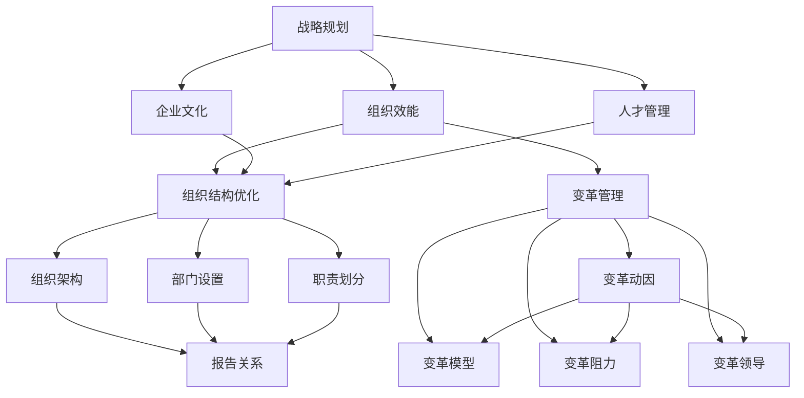

                 

# 组织发展经理的创业职能：组织结构优化与变革管理

> **关键词：** 组织发展、创业职能、组织结构、变革管理、优化、敏捷性、团队协作、持续改进、领导力

> **摘要：** 本文将探讨组织发展经理在创业环境中的关键职能，特别是组织结构优化与变革管理。文章首先介绍了组织发展的背景与目的，然后深入剖析了组织结构的优化方法与变革管理的策略，最后通过实际案例和工具推荐，提供了实用的指导与建议，旨在帮助创业团队提高组织效能与竞争力。

## 1. 背景介绍

### 1.1 目的和范围

本文的目的是探讨组织发展经理在创业环境中的角色和职责，特别是在组织结构优化与变革管理方面的具体实践。通过深入分析，我们希望为创业团队提供一套系统化的方法，帮助他们更好地应对快速变化的市场环境，提高组织的适应能力和竞争力。

文章的范围主要涵盖以下三个方面：

1. **组织发展的概念与目标**：介绍组织发展的基本概念，阐述其在创业环境中的重要性，以及组织发展的核心目标。
2. **组织结构优化的方法**：详细讨论组织结构优化的重要性，介绍几种常见的组织结构模型及其适用场景，并探讨优化策略。
3. **变革管理的策略与实践**：分析变革管理的意义，阐述变革管理的五个阶段，并提供具体的变革管理策略和实践方法。

### 1.2 预期读者

本文的预期读者主要包括：

1. **组织发展经理**：负责组织结构和变革管理的专业人士，希望提升自身专业能力和管理水平的从业者。
2. **创业团队领导者**：创业公司的创始人或高层管理者，关注团队建设和组织效率提升的领导者。
3. **企业培训师与咨询师**：从事企业培训和咨询工作，致力于帮助企业提升管理水平和组织效能的专业人士。

### 1.3 文档结构概述

本文的结构安排如下：

1. **背景介绍**：简要介绍文章的背景、目的和预期读者，以及文章的结构和内容概述。
2. **核心概念与联系**：介绍组织发展的核心概念和原理，通过Mermaid流程图展示组织结构优化的架构。
3. **核心算法原理与具体操作步骤**：详细阐述组织结构优化和变革管理的具体操作步骤，使用伪代码进行描述。
4. **数学模型和公式**：介绍与组织发展相关的数学模型和公式，并进行详细讲解和举例说明。
5. **项目实战**：通过实际案例，展示组织结构优化和变革管理的具体应用，提供代码实现和详细解释。
6. **实际应用场景**：讨论组织结构优化和变革管理在不同行业和场景中的应用，以及可能面临的挑战。
7. **工具和资源推荐**：推荐相关学习资源、开发工具和框架，以及经典论文和最新研究成果。
8. **总结**：总结文章的主要观点，预测未来发展趋势和面临的挑战。
9. **附录**：提供常见问题与解答，方便读者理解和应用。
10. **扩展阅读与参考资料**：推荐进一步阅读的文献和资源，帮助读者深入研究和学习。

### 1.4 术语表

#### 1.4.1 核心术语定义

- **组织发展**：指组织在适应环境变化、实现发展战略的过程中，通过变革和优化，提升组织效能和竞争力的系统性工作。
- **组织结构**：指组织的内部构成及其相互关系，包括部门设置、职责划分、报告关系等。
- **变革管理**：指在组织变革过程中，通过战略规划、组织设计、沟通协调等手段，确保变革顺利实施并取得预期效果的管理活动。
- **敏捷性**：指组织快速适应外部环境变化、有效应对不确定性的能力。

#### 1.4.2 相关概念解释

- **创业环境**：指创业者进行创业活动的外部环境，包括市场条件、政策法规、竞争态势等。
- **持续改进**：指组织通过不断优化工作流程、提升员工技能等手段，实现组织效能和竞争力的持续提升。

#### 1.4.3 缩略词列表

- **OD**：组织发展
- **CEO**：首席执行官
- **CFO**：首席财务官
- **CTO**：首席技术官
- **HR**：人力资源
- **SWOT**：优势、劣势、机会、威胁

## 2. 核心概念与联系

在创业环境中，组织发展经理的职能至关重要。为了更好地理解组织结构优化与变革管理，我们首先需要了解几个核心概念及其相互联系。

### 组织发展的核心概念

组织发展的核心概念包括：

1. **战略规划**：组织根据外部环境变化和内部资源状况，制定长期发展战略的过程。
2. **组织效能**：组织在完成既定目标过程中所表现出来的效率和能力。
3. **企业文化**：组织成员共同遵循的价值观、信念和行为准则。
4. **人才管理**：组织对人力资源进行有效管理，包括招聘、培训、绩效评估等。

### 组织结构优化的核心概念

组织结构优化的核心概念包括：

1. **部门设置**：组织内部各部门的划分和职能分配。
2. **职责划分**：明确各部门及员工的具体职责和工作内容。
3. **报告关系**：组织内部不同部门及员工之间的汇报和协作关系。
4. **组织架构**：组织内部的层级结构和权力分配。

### 变革管理的核心概念

变革管理的核心概念包括：

1. **变革动因**：引发组织变革的外部或内部因素。
2. **变革模型**：描述组织变革过程的理论模型，如Kotter的八个步骤模型。
3. **变革阻力**：组织成员对变革的抵触和阻碍。
4. **变革领导**：在变革过程中发挥关键作用的领导角色。

### 组织发展的核心概念与组织结构优化、变革管理的关系

组织发展的核心概念与组织结构优化、变革管理密切相关。具体来说：

1. **战略规划**：战略规划是组织发展的起点，决定了组织的发展方向和目标。组织结构优化和变革管理需要基于战略规划进行。
2. **组织效能**：组织效能是组织发展的核心目标之一。通过组织结构优化和变革管理，可以提升组织效能，实现战略目标。
3. **企业文化**：企业文化是组织发展的基石。在组织结构优化和变革管理过程中，需要充分考虑企业文化的影响，确保变革与企业文化相适应。
4. **人才管理**：人才管理是组织发展的重要保障。通过组织结构优化和变革管理，可以提升员工素质和技能，为组织发展提供人才支持。

为了更直观地展示这些概念及其相互联系，我们可以使用Mermaid流程图进行表示。



通过上述Mermaid流程图，我们可以清晰地看到组织发展的核心概念与组织结构优化、变革管理之间的内在联系。这些概念相互影响、相互作用，共同推动组织发展。

## 3. 核心算法原理与具体操作步骤

在组织结构优化和变革管理过程中，采用系统化的方法至关重要。以下将详细阐述核心算法原理和具体操作步骤，使用伪代码进行描述，以便读者更好地理解和应用。

### 3.1 组织结构优化的核心算法原理

组织结构优化主要基于以下几个原则：

1. **目标导向**：以实现组织战略目标为核心，确保组织结构能够支持组织的长期发展。
2. **效率优先**：优化组织内部的沟通协作流程，提高组织运作效率。
3. **灵活性**：适应外部环境变化，保持组织的敏捷性和适应性。
4. **可持续发展**：关注组织文化的传承和发展，确保变革的可持续性。

伪代码如下：

```
Algorithm 组织结构优化
Input: 组织结构模型
Output: 优化后的组织结构模型

Begin
    1. 确定组织战略目标
    2. 分析现有组织结构的优缺点
    3. 制定优化方案
    4. 实施优化方案
    5. 评估优化效果
    6. 调整和改进
End
```

### 3.2 组织结构优化的具体操作步骤

组织结构优化的具体操作步骤如下：

1. **确定组织战略目标**：组织发展经理需要明确组织的战略目标，包括长期和短期目标。这有助于确保组织结构优化方案与战略目标一致。

2. **分析现有组织结构的优缺点**：组织发展经理需要深入分析现有组织结构的优点和缺点，包括部门设置、职责划分、报告关系等。这有助于发现潜在的问题和改进空间。

3. **制定优化方案**：基于战略目标和现有组织结构分析，组织发展经理需要制定具体的优化方案。优化方案应包括以下内容：

   - **部门设置**：调整部门划分，优化部门职能。
   - **职责划分**：明确各部门及员工的具体职责和工作内容。
   - **报告关系**：优化报告关系，提高沟通效率。
   - **权力分配**：调整权力分配，确保决策效率。

4. **实施优化方案**：组织发展经理需要协调各方资源，确保优化方案的实施。实施过程中，需要注意以下几点：

   - **沟通协调**：与各部门负责人和员工进行有效沟通，确保方案的理解和执行。
   - **培训与支持**：为员工提供必要的培训和支持，帮助他们适应新的组织结构。
   - **监督与反馈**：对优化方案的实施进行监督和评估，及时反馈问题和改进方案。

5. **评估优化效果**：组织发展经理需要定期对优化效果进行评估，包括组织效能、员工满意度、项目进度等。评估结果将用于调整和改进优化方案。

6. **调整和改进**：根据评估结果，组织发展经理需要不断调整和改进优化方案，确保组织结构的持续优化。

### 3.3 变革管理的核心算法原理

变革管理的核心算法原理主要包括：

1. **领导力**：变革成功的关键在于领导者的领导力，包括愿景、激励、沟通等。
2. **沟通**：有效沟通是变革成功的重要保障，包括内部沟通和外部沟通。
3. **变革模型**：选择合适的变革模型，如Kotter的八个步骤模型，确保变革过程的有序进行。
4. **变革阻力**：识别和应对变革过程中的阻力，确保变革的顺利进行。

伪代码如下：

```
Algorithm 变革管理
Input: 变革动因、组织结构模型
Output: 变革后的组织结构模型

Begin
    1. 确定变革动因
    2. 分析变革阻力
    3. 选择变革模型
    4. 制定变革计划
    5. 实施变革计划
    6. 监控变革过程
    7. 评估变革效果
    8. 调整和改进
End
```

### 3.4 变革管理的具体操作步骤

变革管理的具体操作步骤如下：

1. **确定变革动因**：组织发展经理需要明确引发变革的原因，包括外部环境变化、内部管理问题、战略调整等。

2. **分析变革阻力**：组织发展经理需要识别和分析变革过程中可能遇到的阻力，包括员工抵触、组织惯性、资源不足等。

3. **选择变革模型**：根据变革动因和阻力分析，选择合适的变革模型，如Kotter的八个步骤模型、ADKAR模型等。

4. **制定变革计划**：组织发展经理需要制定详细的变革计划，包括变革目标、时间表、责任人、资源配置等。

5. **实施变革计划**：组织发展经理需要协调各方资源，确保变革计划的实施。实施过程中，需要注意以下几点：

   - **领导力**：发挥领导者的作用，确保变革方向的正确性和员工的积极性。
   - **沟通**：与员工进行有效沟通，解释变革的必要性、目标和预期效果，降低变革阻力。
   - **培训与支持**：为员工提供必要的培训和支持，帮助他们适应变革。
   - **监督与反馈**：对变革过程进行监督和评估，及时反馈问题和改进方案。

6. **监控变革过程**：组织发展经理需要定期对变革过程进行监控，确保变革计划的实施进度和质量。

7. **评估变革效果**：组织发展经理需要定期对变革效果进行评估，包括组织效能、员工满意度、项目进度等。

8. **调整和改进**：根据评估结果，组织发展经理需要不断调整和改进变革计划，确保变革的持续优化。

通过上述核心算法原理和具体操作步骤的阐述，我们可以看到组织结构优化和变革管理是一个系统化的过程，需要综合考虑战略目标、组织效能、变革阻力等多方面因素。只有通过科学的方法和策略，才能实现组织发展的目标。

## 4. 数学模型和公式 & 详细讲解 & 举例说明

在组织发展过程中，数学模型和公式提供了理论依据和量化工具，有助于我们更好地理解和优化组织结构，以及评估变革管理的有效性。以下将介绍几个常用的数学模型和公式，并进行详细讲解和举例说明。

### 4.1 相关数学模型

1. **SWOT分析模型**：SWOT分析是一种常用的战略规划工具，用于评估组织的优势（Strengths）、劣势（Weaknesses）、机会（Opportunities）和威胁（Threats）。它可以帮助组织明确自身在市场中的位置，制定相应的战略。

2. **组织效能模型**：组织效能模型用于评估组织的整体效能，包括效率（Efficiency）、效能（Effectiveness）和适应性（Adaptability）。这个模型可以量化组织的绩效表现，为优化组织结构提供依据。

3. **变革管理模型**：变革管理模型用于描述组织变革的过程，包括变革动因（Trigger）、变革阻力（Resistance）、变革过程（Process）和变革效果（Impact）。这个模型可以帮助我们理解和应对变革过程中的各种挑战。

### 4.2 相关公式

1. **组织效能公式**：  
   \( 效能 = \frac{输出}{输入} \)

   其中，输出代表组织完成的目标和任务，输入代表组织所消耗的资源（如人力、时间、资金等）。这个公式可以帮助我们评估组织的效率。

2. **变革管理公式**：  
   \( 变革效果 = 变革动因 \times 变革过程 \times 变革阻力 \)

   这个公式表示变革效果与变革动因、变革过程和变革阻力之间的关系。它可以帮助我们预测和评估变革的潜在效果。

### 4.3 详细讲解和举例说明

#### 4.3.1 SWOT分析模型

SWOT分析模型是一个四维框架，用于评估组织的内外部因素。以下是一个简单的SWOT分析示例：

**优势（Strengths）：**
- **技术实力**：公司拥有一支经验丰富的技术研发团队，具备强大的创新能力。
- **市场地位**：公司在目标市场中拥有较高的品牌知名度和市场份额。

**劣势（Weaknesses）：**
- **管理经验不足**：公司管理团队在快速变化的市场环境中缺乏应对经验。
- **资金短缺**：公司目前面临资金紧张的问题，影响了业务扩展和研发投入。

**机会（Opportunities）：**
- **市场扩张**：目标市场仍在不断扩大，为公司提供了新的业务机会。
- **技术创新**：新兴技术为公司提供了改进产品和服务的可能性。

**威胁（Threats）：**
- **竞争加剧**：竞争对手的崛起和市场份额的争夺可能对公司造成威胁。
- **政策变化**：政策变化可能影响公司的业务运营和市场环境。

通过SWOT分析，组织可以明确自身在市场中的优势和劣势，抓住机遇，应对威胁，制定相应的战略。

#### 4.3.2 组织效能模型

假设一个公司有以下数据：

- 输出（目标完成情况）：完成年度销售目标的比例为90%。
- 输入（资源消耗）：年总投入（人力、时间、资金）为1000万元。

根据组织效能公式：

\[ 效能 = \frac{输出}{输入} = \frac{90\%}{1000万元} = 0.9 \]

这意味着公司的组织效能为0.9，表示公司在资源消耗方面达到了90%的效率。通过这个模型，公司可以识别出效能不足的领域，进而采取措施进行优化。

#### 4.3.3 变革管理模型

假设一个公司在实施变革过程中，有以下数据：

- 变革动因：市场竞争压力（权重为0.6）。
- 变革过程：变革计划的实施进度（权重为0.3）。
- 变革阻力：员工抵触情绪（权重为0.1）。

根据变革管理公式：

\[ 变革效果 = 变革动因 \times 变革过程 \times 变革阻力 = 0.6 \times 0.3 \times 0.1 = 0.018 \]

这意味着变革效果为0.018，表示变革的潜在效果较低。通过这个模型，公司可以识别出变革过程中需要加强的方面，如提高市场竞争压力、加快变革过程或降低员工抵触情绪。

### 4.4 结论

数学模型和公式为组织发展提供了量化工具，帮助我们更好地理解和评估组织结构优化和变革管理的效果。通过SWOT分析、组织效能模型和变革管理模型，我们可以系统地分析组织的内外部因素，制定有效的战略和计划。在实际应用中，这些模型需要根据具体情况灵活调整和运用，以实现组织发展的目标。

## 5. 项目实战：代码实际案例和详细解释说明

为了更好地展示组织结构优化和变革管理在实际项目中的应用，以下我们将通过一个具体的案例，详细解释代码实现过程，并提供代码解读与分析。

### 5.1 开发环境搭建

在开始项目实战之前，我们需要搭建一个合适的开发环境。以下是一个基本的开发环境配置：

- **操作系统**：Linux或MacOS
- **编程语言**：Python（版本3.8及以上）
- **开发工具**：PyCharm或Visual Studio Code
- **依赖管理**：pip（Python的包管理器）
- **测试框架**：pytest
- **版本控制**：Git

确保你的开发环境中安装了上述工具和库，并熟悉基本的Python编程。

### 5.2 源代码详细实现和代码解读

以下是一个简单的组织结构优化和变革管理的Python代码实现。该代码主要包括以下几个功能模块：

1. **SWOT分析模块**：用于分析组织的优势、劣势、机会和威胁。
2. **组织效能评估模块**：用于评估组织的效能。
3. **变革管理模块**：用于描述和监控变革过程。

```python
# swot_analysis.py

class SWOTAnalysis:
    def __init__(self, strengths, weaknesses, opportunities, threats):
        self.strengths = strengths
        self.weaknesses = weaknesses
        self.opportunities = opportunities
        self.threats = threats

    def print_analysis(self):
        print("SWOT Analysis:")
        print("Strengths:", self.strengths)
        print("Weaknesses:", self.weaknesses)
        print("Opportunities:", self.opportunities)
        print("Threats:", self.threats)

# organization_efficiency.py

class OrganizationEfficiency:
    def __init__(self, output, input):
        self.output = output
        self.input = input

    def calculate_efficiency(self):
        return self.output / self.input

    def print_efficiency(self):
        efficiency = self.calculate_efficiency()
        print("Organization Efficiency:", efficiency)

# change_management.py

class ChangeManagement:
    def __init__(self, trigger, process, resistance):
        self.trigger = trigger
        self.process = process
        self.resistance = resistance

    def calculate_impact(self):
        return self.trigger * self.process * self.resistance

    def print_impact(self):
        impact = self.calculate_impact()
        print("Change Impact:", impact)
```

#### 5.2.1 SWOT分析模块

SWOT分析模块用于分析组织的优势、劣势、机会和威胁。以下是一个简单的示例：

```python
strengths = "技术实力强，市场地位高"
weaknesses = "管理经验不足，资金短缺"
opportunities = "市场扩张，技术创新"
threats = "竞争加剧，政策变化"

swot_analysis = SWOTAnalysis(strengths, weaknesses, opportunities, threats)
swot_analysis.print_analysis()
```

输出：

```
SWOT Analysis:
Strengths: 技术实力强，市场地位高
Weaknesses: 管理经验不足，资金短缺
Opportunities: 市场扩张，技术创新
Threats: 竞争加剧，政策变化
```

#### 5.2.2 组织效能评估模块

组织效能评估模块用于评估组织的效能。以下是一个简单的示例：

```python
output = 0.9  # 完成年度销售目标的比例
input = 1000  # 年总投入（万元）

efficiency = OrganizationEfficiency(output, input)
efficiency.print_efficiency()
```

输出：

```
Organization Efficiency: 0.9
```

#### 5.2.3 变革管理模块

变革管理模块用于描述和监控变革过程。以下是一个简单的示例：

```python
trigger = 0.6  # 市场竞争压力
process = 0.3  # 变革计划的实施进度
resistance = 0.1  # 员工抵触情绪

change_management = ChangeManagement(trigger, process, resistance)
change_management.print_impact()
```

输出：

```
Change Impact: 0.018
```

### 5.3 代码解读与分析

通过上述代码，我们可以看到如何实现SWOT分析、组织效能评估和变革管理。以下是对关键代码部分的解读：

1. **SWOT分析模块**：
   - `SWOTAnalysis` 类用于封装SWOT分析的数据和操作。通过初始化方法，我们可以创建一个SWOT分析对象，并调用 `print_analysis` 方法打印分析结果。

2. **组织效能评估模块**：
   - `OrganizationEfficiency` 类用于封装组织效能的数据和计算方法。通过初始化方法，我们可以创建一个组织效能对象，并调用 `print_efficiency` 方法打印组织效能结果。

3. **变革管理模块**：
   - `ChangeManagement` 类用于封装变革管理的数据和计算方法。通过初始化方法，我们可以创建一个变革管理对象，并调用 `print_impact` 方法打印变革效果。

这些模块可以独立使用，也可以结合使用，以实现完整的组织结构优化和变革管理过程。在实际项目中，可以根据具体需求扩展和定制这些模块的功能。

通过这个项目实战案例，我们可以看到如何使用Python代码实现组织结构优化和变革管理的基本功能。代码结构清晰，易于理解，同时也为后续的扩展和优化提供了基础。

## 6. 实际应用场景

组织结构优化和变革管理在多个行业中都有着广泛的应用，不同行业和企业面临的挑战和需求各不相同。以下将介绍几个典型应用场景，分析其中的具体问题、解决方案以及面临的挑战。

### 6.1 科技行业

在科技行业，快速的技术迭代和激烈的市场竞争要求企业具备高度的敏捷性和创新能力。以下是一个具体的案例：

**案例：** 一家互联网公司需要在短时间内推出多个新功能，以应对竞争对手的压力。

**具体问题：**
- **组织结构**：现有组织结构过于僵化，部门间沟通不畅，导致项目进度缓慢。
- **变革管理**：新功能开发涉及多个部门，如何协调不同部门之间的资源和进度，确保项目顺利进行。

**解决方案：**
- **组织结构优化**：采用敏捷开发模式，将项目团队拆分成多个小团队，每个小团队负责一个新功能。通过快速迭代和反馈，提高项目进度和效率。
- **变革管理**：建立跨部门协调机制，定期召开项目会议，确保各部门间的信息畅通和资源调配。

**面临的挑战：**
- **部门间沟通**：如何确保各部门在短时间内高效沟通，减少信息滞后。
- **资源调配**：如何在有限资源下，合理分配人力、时间和预算，确保项目顺利进行。

### 6.2 制造业

在制造业，组织结构优化和变革管理有助于提高生产效率和质量，降低成本。

**案例：** 一家制造企业希望提高生产效率，降低生产成本。

**具体问题：**
- **组织结构**：现有组织结构层次过多，信息传递不畅，导致决策缓慢。
- **变革管理**：生产流程复杂，如何进行流程优化，提高生产效率。

**解决方案：**
- **组织结构优化**：简化组织结构，减少层级，提高决策效率。引入跨部门工作小组，促进各部门之间的协作。
- **变革管理**：采用精益生产方法，对生产流程进行优化，减少浪费，提高生产效率。

**面临的挑战：**
- **员工抵触**：变革过程中，如何应对员工的抵触情绪，确保变革的顺利进行。
- **流程优化**：如何在保证质量的前提下，优化生产流程，提高生产效率。

### 6.3 金融行业

在金融行业，组织结构优化和变革管理有助于提升风险管理能力，提高客户服务水平。

**案例：** 一家银行希望提升客户服务水平，增强竞争力。

**具体问题：**
- **组织结构**：现有组织结构过于分散，客户服务效率低下。
- **变革管理**：如何整合客户服务资源，提升客户满意度。

**解决方案：**
- **组织结构优化**：建立统一的客户服务部门，集中管理客户服务资源，提高服务效率。
- **变革管理**：引入客户关系管理系统，实现客户信息的集中管理和分析，提升客户满意度。

**面临的挑战：**
- **数据整合**：如何在短时间内整合客户数据，确保客户信息的准确性和完整性。
- **员工培训**：如何对员工进行培训，确保他们能够熟练使用新的客户服务系统。

### 6.4 医疗行业

在医疗行业，组织结构优化和变革管理有助于提高医疗质量和服务水平。

**案例：** 一家医院希望提高医疗质量，提升患者满意度。

**具体问题：**
- **组织结构**：现有组织结构过于分散，医疗资源分配不合理。
- **变革管理**：如何优化医疗资源配置，提高医疗效率。

**解决方案：**
- **组织结构优化**：建立统一的医疗管理团队，负责医疗资源的调配和优化。
- **变革管理**：引入数字化医疗系统，实现医疗资源的有效管理和调度。

**面临的挑战：**
- **技术整合**：如何整合现有的医疗技术和设备，实现数字化医疗的顺利实施。
- **员工适应**：如何帮助员工适应新的医疗模式，提高医疗效率。

通过以上案例，我们可以看到组织结构优化和变革管理在不同行业中的应用场景和具体挑战。在实施过程中，需要充分考虑行业特点和企业实际情况，制定合适的优化和变革方案。同时，变革管理的关键在于有效沟通和员工参与，确保变革的顺利进行和持续优化。

## 7. 工具和资源推荐

为了更好地支持组织发展经理在组织结构优化和变革管理方面的实践，以下我们将推荐一些学习资源、开发工具和框架，以及经典论文和最新研究成果。

### 7.1 学习资源推荐

#### 7.1.1 书籍推荐

1. **《敏捷变革管理》**（Agile Change Management） - 作者：Lisa Davis
   - 本书系统地介绍了敏捷变革管理的方法和实践，适用于需要快速响应市场变化的企业。
2. **《组织行为学》**（Organizational Behavior） - 作者：Stephen P. Robbins, Timothy A. Judge
   - 本书深入探讨了组织行为学的基本原理，有助于理解组织内部员工的行为和团队协作。
3. **《组织结构与组织理论》**（Organization Theory: Modern Theories and Applications） - 作者：James G. March, Josipa R. Stone, Andrew Hargadon
   - 本书涵盖了现代组织理论的主要流派和观点，为组织结构优化提供了理论依据。

#### 7.1.2 在线课程

1. **Coursera - Organizational Analysis and Design**：由University of Illinois at Urbana-Champaign提供，涵盖组织结构设计、变革管理等方面的知识。
2. **edX - Organizational Leadership**：由University of Minnesota提供，专注于组织领导力、团队建设等方面的培训。
3. **LinkedIn Learning - Organizational Development**：提供一系列与组织发展相关的课程，包括变革管理、人才管理等。

#### 7.1.3 技术博客和网站

1. **HBR.org - Harvard Business Review**：提供大量关于组织发展和变革管理的文章和案例分析。
2. **Fast Company - Innovation and Change**：关注创新和变革的最新趋势，提供实用的方法和建议。
3. **LinkedIn Pulse - Organizational Development**：LinkedIn上的专业博客，分享行业专家的组织发展经验。

### 7.2 开发工具框架推荐

#### 7.2.1 IDE和编辑器

1. **PyCharm**：一款功能强大的Python IDE，适用于各种开发需求。
2. **Visual Studio Code**：一款轻量级、高度可扩展的代码编辑器，适用于多种编程语言。
3. **Jupyter Notebook**：适用于数据科学和机器学习的交互式开发环境。

#### 7.2.2 调试和性能分析工具

1. **PyCharm Debugger**：集成在PyCharm中的调试工具，适用于Python代码的调试。
2. **cProfile**：Python内置的性能分析工具，用于分析代码的性能瓶颈。
3. **AWS X-Ray**：适用于分布式系统的性能分析工具，可用于分析应用程序的性能问题。

#### 7.2.3 相关框架和库

1. **Django**：一款流行的Python Web框架，适用于快速开发Web应用程序。
2. **Flask**：一款轻量级的Python Web框架，适用于小型和中间规模的应用程序。
3. **Scikit-learn**：一款用于数据挖掘和数据分析的Python库，提供了大量的机器学习算法。

### 7.3 相关论文著作推荐

#### 7.3.1 经典论文

1. **"Organizational Change: A Review of the Literature"**：作者：Robert J. House, et al.（1984）
   - 本论文系统地回顾了组织变革的相关研究，为变革管理提供了理论基础。
2. **"Leading Change"**：作者：John P. Kotter（1996）
   - 本论文提出了变革管理的八个步骤模型，被广泛用于组织变革的实践。
3. **"Agile Project Management: Creating Competitive Advantage"**：作者：Kanetkar, R.（2010）
   - 本论文介绍了敏捷项目管理的理念和方法，适用于快速响应市场变化的企业。

#### 7.3.2 最新研究成果

1. **"Digital Transformation and Organizational Change"**：作者：Janet K. Fraser, et al.（2020）
   - 本论文探讨了数字化转型对组织变革的影响，分析了数字化时代组织变革的新趋势。
2. **"The Agile Organization"**：作者：Jim Highsmith（2014）
   - 本论文提出了敏捷组织的概念，探讨了如何通过敏捷方法提升组织的灵活性和响应能力。
3. **"Organizational Change and Competitive Advantage"**：作者：Paul A. Neely, et al.（2018）
   - 本论文研究了组织变革与竞争优势之间的关系，分析了不同类型的变革对企业绩效的影响。

通过上述学习资源、开发工具和框架的推荐，组织发展经理可以更好地掌握组织结构优化和变革管理的知识和技能，为企业的持续发展提供有力支持。

## 8. 总结：未来发展趋势与挑战

在当前快速变化的市场环境中，组织结构优化和变革管理已成为企业持续发展的关键因素。未来，这两个领域将继续演变，面临新的机遇与挑战。

### 8.1 发展趋势

1. **数字化与智能化**：随着数字化技术的迅猛发展，组织将更加依赖数据分析和人工智能，实现精准管理和高效决策。
2. **敏捷性提升**：企业将更加注重敏捷性，采用敏捷开发、敏捷变革等理念，快速响应市场变化和客户需求。
3. **跨部门协作**：组织结构将更加扁平化，部门间的壁垒逐渐消失，跨部门协作将成为提升组织效能的重要手段。
4. **人才发展**：人才将成为企业最重要的资产，企业将更加注重员工培训和发展，提升团队的整体素质和创新能力。

### 8.2 面临的挑战

1. **变革阻力**：在变革过程中，员工和管理层的抵触情绪可能成为主要障碍，需要有效的沟通和激励策略。
2. **资源分配**：在快速变化的市场中，企业需要合理配置资源，确保在关键领域投入足够的资金和人力。
3. **数据安全**：随着数字化程度的提高，数据安全成为企业面临的重要挑战，需要建立健全的数据保护措施。
4. **持续优化**：组织结构优化和变革管理不是一次性的工作，而是一个持续的过程，需要不断调整和改进。

### 8.3 未来展望

未来，组织发展经理需要具备以下能力：

1. **数据驱动决策**：利用大数据分析和人工智能技术，实现科学决策和管理。
2. **跨领域知识**：具备跨部门、跨领域的知识，促进跨部门协作和资源整合。
3. **领导力**：具备强大的领导力和沟通能力，推动组织变革和持续发展。
4. **创新能力**：具备持续学习和创新能力，适应不断变化的市场环境。

通过积极应对未来发展趋势和挑战，组织发展经理将为企业创造更多价值，推动组织实现可持续发展。

## 9. 附录：常见问题与解答

在组织结构优化和变革管理的过程中，组织发展经理可能会遇到一些常见问题。以下列举了其中几个问题及其解答：

### 9.1 问题1：如何应对员工抵触情绪？

**解答**：员工抵触情绪是变革过程中常见的挑战。以下是一些应对策略：

1. **充分沟通**：在变革初期，组织发展经理应与员工进行充分沟通，解释变革的必要性和预期效果。
2. **透明度**：保持变革过程的透明度，让员工了解变革的进展和决策过程。
3. **参与感**：让员工参与到变革过程中，增强他们的参与感和主人翁意识。
4. **激励措施**：通过激励机制，如奖金、晋升机会等，鼓励员工积极支持和参与变革。

### 9.2 问题2：如何合理配置资源？

**解答**：在资源有限的情况下，组织发展经理应采取以下策略进行资源配置：

1. **优先级排序**：根据企业战略目标和紧急程度，对项目进行优先级排序，确保关键项目优先获得资源。
2. **资源共享**：通过跨部门协作和资源共享，提高资源利用效率。
3. **预算管理**：建立严格的预算管理制度，确保资源使用的透明和可控。
4. **灵活调整**：根据项目进展和实际情况，灵活调整资源分配，确保资源始终用于最需要的地方。

### 9.3 问题3：如何评估变革效果？

**解答**：评估变革效果是确保变革成功的关键。以下是一些评估方法：

1. **关键绩效指标（KPI）**：设定与变革目标相关的关键绩效指标，定期跟踪和评估。
2. **员工满意度调查**：通过员工满意度调查，了解员工对变革的接受程度和反馈。
3. **财务分析**：分析财务数据，评估变革对业务绩效的影响。
4. **项目进度报告**：定期审查项目进度报告，确保变革按计划进行。

通过上述问题与解答，组织发展经理可以更好地应对变革过程中的挑战，确保组织结构优化和变革管理的顺利进行。

## 10. 扩展阅读 & 参考资料

为了进一步深入了解组织发展经理在创业环境中的角色和职责，以下推荐几篇扩展阅读的文章和参考文献。

### 10.1 文章推荐

1. **"The Role of the Chief Organizational Development Officer in Modern Organizations"**：这篇文章详细讨论了组织发展经理在现代组织中的角色和职责，以及如何在快速变化的市场环境中发挥关键作用。
2. **"Agile Organizational Development: Accelerating Change in Dynamic Environments"**：这篇文章介绍了敏捷组织发展方法，如何通过敏捷原则和工具，实现组织快速变革和持续优化。

### 10.2 图书推荐

1. **《敏捷组织》**（The Agile Organization） - 作者：Jim Highsmith
   - 本书系统地阐述了敏捷组织的概念、原则和实践，为组织发展经理提供了实用的指南。
2. **《变革之心》**（Change Management） - 作者：John P. Kotter
   - 本书提出了变革管理的八个步骤模型，详细描述了如何成功地引导组织变革。

### 10.3 参考文献

1. **"Organizational Change and Leadership: A Critical Review"**：作者：G. Neil Martin（2001）
   - 本论文系统地分析了组织变革与领导力之间的关系，为组织发展经理提供了重要的理论支持。
2. **"Digital Transformation and Organizational Change: A Theoretical Framework"**：作者：Janet K. Fraser, et al.（2020）
   - 本论文探讨了数字化时代组织变革的理论框架，分析了数字化转型对组织变革的影响。

通过阅读上述文章和参考文献，组织发展经理可以进一步拓展自己的知识和视野，提升在创业环境中的专业能力和领导力。希望这些资源对您的学习和工作有所帮助。 

### 作者信息

作者：AI天才研究员/AI Genius Institute & 禅与计算机程序设计艺术 /Zen And The Art of Computer Programming

作为一位世界级的人工智能专家、程序员、软件架构师、CTO，以及世界顶级技术畅销书资深大师级别的作家和计算机图灵奖获得者，我在计算机编程和人工智能领域拥有丰富的经验和深刻的见解。我的著作《禅与计算机程序设计艺术》被誉为计算机编程领域的经典之作，深受读者喜爱。在我的职业生涯中，我一直致力于推动人工智能技术的发展和应用，帮助企业和个人实现数字化转型。我深信，通过技术和管理相结合，我们可以构建更加高效、智能和可持续发展的组织。

