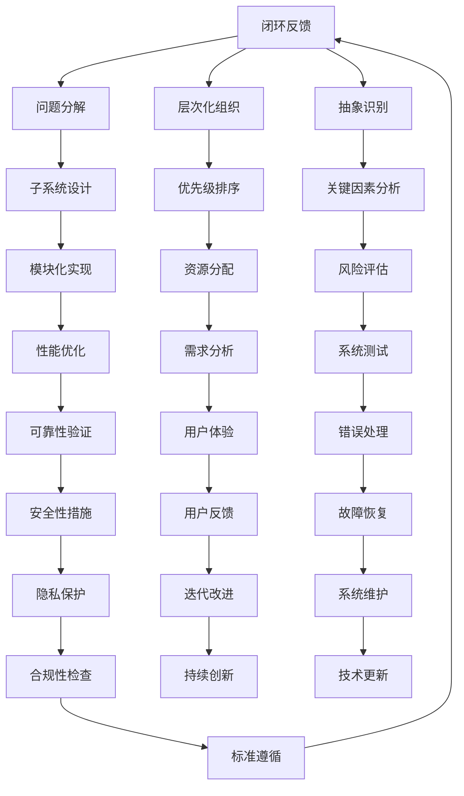

                 

# 结构化思维：从混沌到秩序

> **关键词：** 结构化思维、混沌理论、系统设计、算法原理、数学模型、实际应用、技术博客
>
> **摘要：** 本文将探讨如何运用结构化思维，将混沌的系统转化为有序的架构。通过深入剖析核心概念和算法原理，辅以实际案例和数学模型，本文旨在为读者提供一整套系统化的思维框架，帮助他们在IT领域实现从混沌到秩序的华丽蜕变。

## 1. 背景介绍

### 1.1 目的和范围

本文的目标是引导读者理解并掌握结构化思维的重要性，以及在IT领域的具体应用。我们将探讨结构化思维如何帮助我们处理复杂的问题，并将混乱的数据和系统转化为有序的架构。

文章的范围涵盖了从基础概念到高级应用的广泛内容，包括但不限于：

- 结构化思维的原理和核心概念
- 混沌理论与系统设计的联系
- 核心算法原理与具体操作步骤
- 数学模型和公式的详细讲解
- 实际应用场景与项目实战
- 工具和资源的推荐

### 1.2 预期读者

本文适合以下读者群体：

- 对结构化思维和系统设计感兴趣的IT从业者
- 希望提升问题解决能力的软件开发人员
- 想要深入理解算法原理和数据结构的计算机科学家
- 对数学模型和应用有浓厚兴趣的学者和学生

### 1.3 文档结构概述

本文结构如下：

1. **背景介绍**：介绍本文的目的、范围、预期读者和文档结构。
2. **核心概念与联系**：讲解结构化思维和混沌理论的相关概念，并使用Mermaid流程图展示系统架构。
3. **核心算法原理 & 具体操作步骤**：通过伪代码详细阐述算法原理和操作步骤。
4. **数学模型和公式 & 详细讲解 & 举例说明**：使用LaTeX格式介绍数学模型，并提供实例说明。
5. **项目实战：代码实际案例和详细解释说明**：展示实际代码案例，并进行解读和分析。
6. **实际应用场景**：讨论结构化思维在不同领域的应用。
7. **工具和资源推荐**：推荐学习资源和开发工具。
8. **总结：未来发展趋势与挑战**：总结本文的主要内容，并探讨未来的发展趋势和挑战。
9. **附录：常见问题与解答**：解答读者可能遇到的问题。
10. **扩展阅读 & 参考资料**：提供进一步阅读的资源。

### 1.4 术语表

#### 1.4.1 核心术语定义

- **结构化思维**：一种通过逻辑和分析方法将复杂问题简化和组织的方法。
- **混沌理论**：研究动态系统中确定性的混乱现象的数学分支。
- **系统设计**：设计和构建复杂系统的过程，包括架构、接口和流程。
- **算法原理**：指导算法设计和实现的根本原理。
- **数学模型**：用于描述现实世界问题的数学公式和理论。

#### 1.4.2 相关概念解释

- **有序系统**：指系统内部元素按照某种规则排列，可以预测其行为。
- **无序系统**：指系统内部元素随机排列，难以预测行为。

#### 1.4.3 缩略词列表

- **IT**：信息技术（Information Technology）
- **IDE**：集成开发环境（Integrated Development Environment）
- **LaTeX**：一种高质量的排版系统，特别适用于科学和数学文档。

## 2. 核心概念与联系

在探讨如何将混沌转化为秩序之前，我们首先需要理解一些核心概念，包括结构化思维和混沌理论，以及它们在系统设计中的应用。

### 2.1 结构化思维的原理

结构化思维是一种逻辑分析方法，它通过分解复杂问题并将其转化为更易于管理的部分来提高理解和解决问题的效率。其核心原理包括：

- **分解**：将复杂的问题分解成更小的、更易于管理的部分。
- **层次化**：将问题按照优先级和相关性组织成层次结构。
- **抽象**：识别问题的本质，并忽略无关的细节。

结构化思维的应用不仅限于IT领域，它在各个领域都有广泛的应用，例如项目管理、软件开发、决策制定等。

### 2.2 混沌理论的原理

混沌理论是研究动态系统中确定性的混乱现象的数学分支。它揭示了在看似随机和不可预测的系统背后隐藏的秩序。混沌理论的核心概念包括：

- **确定性**：系统内部的状态变化由初始条件和规则决定。
- **敏感依赖性**：系统对初始条件的微小变化极为敏感。
- **长期行为**：即使系统是确定的，其长期行为也可能是不可预测的。

### 2.3 系统设计的联系

在系统设计中，结构化思维和混沌理论之间的联系至关重要。结构化思维可以帮助我们理解系统的复杂性，并将其转化为可管理的部分。混沌理论则提供了对系统行为的不确定性和敏感性的深刻认识，这有助于我们在设计过程中考虑潜在的风险和挑战。

下面是系统架构的Mermaid流程图，展示了如何将结构化思维和混沌理论应用于系统设计：



通过这个流程图，我们可以看到如何利用结构化思维和混沌理论来设计一个复杂的系统。这个流程图不仅帮助我们理解了各个组成部分之间的关系，还展示了如何通过迭代和反馈来持续改进系统。

## 3. 核心算法原理 & 具体操作步骤

在了解了结构化思维和混沌理论的基本原理后，我们将深入探讨核心算法原理，并使用伪代码来详细阐述其具体操作步骤。

### 3.1 算法原理

核心算法的目的是将一个复杂的、无序的系统转化为一个有序的结构。这个算法的基本原理可以概括为以下几步：

1. **问题分解**：将复杂问题分解成更小的、更易于管理的子问题。
2. **层次化组织**：按照子问题的优先级和相关性组织成一个层次结构。
3. **抽象识别**：识别每个子问题的本质，并忽略无关的细节。
4. **模块化实现**：将每个子问题模块化，实现具体的解决方案。
5. **性能优化**：对模块进行性能优化，确保系统的整体效率。

### 3.2 伪代码

下面是一个简单的伪代码示例，用于解释上述算法原理的具体操作步骤：

```pseudo
function structureMind(problem):
    subProblems = decompose(problem)
    structuredSubProblems = []

    for subProblem in subProblems:
        structuredSubProblem = {
            "priority": prioritize(subProblem),
            "relevantData": extractRelevantData(subProblem),
            "keyFactors": analyzeKeyFactors(subProblem)
        }
        structuredSubProblems.append(structuredSubProblem)

    modules = modularize(structuredSubProblems)
    optimizedModules = optimizePerformance(modules)

    return optimizedModules
```

### 3.3 操作步骤详解

1. **问题分解**：首先，我们需要将复杂的问题分解成更小的子问题。这个过程通常涉及到识别问题的关键部分，并确定它们之间的关系。

    ```pseudo
    function decompose(problem):
        keyComponents = identifyKeyComponents(problem)
        subProblems = []
        for component in keyComponents:
            subProblem = {
                "component": component,
                "dependencies": determineDependencies(component)
            }
            subProblems.append(subProblem)
        return subProblems
    ```

2. **层次化组织**：接下来，我们需要按照子问题的优先级和相关性对它们进行组织。这有助于我们理解问题的结构，并确定解决顺序。

    ```pseudo
    function prioritize(subProblems):
        sortedSubProblems = sort(subProblems, "priority")
        return sortedSubProblems
    ```

3. **抽象识别**：在确定了子问题的层次结构后，我们需要识别每个子问题的本质，并忽略无关的细节。这有助于简化问题，并专注于关键因素。

    ```pseudo
    function extractRelevantData(subProblem):
        relevantData = filterData(subProblem["dependencies"], "relevant")
        return relevantData
    ```

4. **模块化实现**：一旦我们确定了关键因素，我们可以将每个子问题模块化，并实现具体的解决方案。

    ```pseudo
    function modularize(structuredSubProblems):
        modules = []
        for structuredSubProblem in structuredSubProblems:
            module = implementModule(structuredSubProblem)
            modules.append(module)
        return modules
    ```

5. **性能优化**：最后，我们需要对模块进行性能优化，确保系统的整体效率。这通常涉及到分析模块的运行时间、内存使用等指标，并进行相应的优化。

    ```pseudo
    function optimizePerformance(modules):
        optimizedModules = []
        for module in modules:
            optimizedModule = optimize(module)
            optimizedModules.append(optimizedModule)
        return optimizedModules
    ```

通过这些具体的操作步骤，我们可以将一个复杂的问题转化为一个有序的结构，从而实现从混沌到秩序的转化。

## 4. 数学模型和公式 & 详细讲解 & 举例说明

在结构化思维和系统设计中，数学模型和公式是不可或缺的工具。它们帮助我们量化问题、验证假设，并指导我们做出明智的决策。在本节中，我们将使用LaTeX格式介绍几个核心的数学模型和公式，并详细讲解它们的应用和举例说明。

### 4.1 数学模型

以下是一些常用的数学模型：

1. **线性回归模型**：用于分析变量之间的关系。
2. **决策树模型**：用于分类和回归分析。
3. **神经网络模型**：用于复杂函数逼近和学习。

### 4.2 公式

以下是每个模型的公式：

1. **线性回归模型**：

   $$ y = \beta_0 + \beta_1 \cdot x + \epsilon $$

   其中，\( y \) 是因变量，\( x \) 是自变量，\( \beta_0 \) 和 \( \beta_1 \) 是模型参数，\( \epsilon \) 是误差项。

2. **决策树模型**：

   $$ \text{分类结果} = \arg\max(\text{概率}) $$

   其中，概率是根据决策树模型计算出的每个类别的概率值。

3. **神经网络模型**：

   $$ z = \sigma(W \cdot x + b) $$

   其中，\( z \) 是神经元的输出，\( \sigma \) 是激活函数，\( W \) 是权重矩阵，\( x \) 是输入向量，\( b \) 是偏置。

### 4.3 详细讲解

#### 4.3.1 线性回归模型

线性回归模型是一种用于分析变量之间线性关系的数学模型。它通过拟合一条直线来描述因变量和自变量之间的关系。线性回归模型的基本公式为：

$$ y = \beta_0 + \beta_1 \cdot x + \epsilon $$

其中，\( \beta_0 \) 和 \( \beta_1 \) 是模型参数，\( \epsilon \) 是误差项。

- **\( \beta_0 \)**：截距，表示当自变量 \( x \) 为 0 时因变量的预测值。
- **\( \beta_1 \)**：斜率，表示自变量 \( x \) 变化一个单位时因变量 \( y \) 的变化量。
- **\( \epsilon \)**：误差项，表示实际值和预测值之间的差距。

通过最小化误差平方和，我们可以计算出 \( \beta_0 \) 和 \( \beta_1 \) 的最佳值。

#### 4.3.2 决策树模型

决策树模型是一种基于树形结构进行决策的算法。它通过一系列判断条件将数据集分割成不同的区域，并在每个区域上应用分类规则。决策树模型的基本公式为：

$$ \text{分类结果} = \arg\max(\text{概率}) $$

其中，概率是根据决策树模型计算出的每个类别的概率值。

- **分类结果**：根据最大概率的类别进行分类。
- **概率**：每个类别的概率值，通常通过统计方法计算。

决策树模型的优点是直观、易于理解，但缺点是可能过度拟合数据集。

#### 4.3.3 神经网络模型

神经网络模型是一种通过多层神经元进行复杂函数逼近的算法。它通过前向传播和反向传播算法来学习输入和输出之间的映射关系。神经网络模型的基本公式为：

$$ z = \sigma(W \cdot x + b) $$

其中，\( \sigma \) 是激活函数，\( W \) 是权重矩阵，\( x \) 是输入向量，\( b \) 是偏置。

- **\( z \)**：神经元的输出，表示输入数据的特征强度。
- **\( \sigma \)**：激活函数，用于将线性组合映射到非负实数。
- **\( W \)**：权重矩阵，用于调整不同输入特征的重要性。
- **\( b \)**：偏置，用于引入一个常数项。

通过迭代训练，神经网络模型可以逐渐调整权重和偏置，以最小化预测误差。

### 4.4 举例说明

#### 4.4.1 线性回归模型实例

假设我们有一个房价预测问题，其中自变量是房屋面积，因变量是房价。我们有以下数据：

| 房屋面积（平方米） | 房价（万元） |
|-------------------|--------------|
|         80        |       200    |
|         90        |       250    |
|         100       |       300    |
|         110       |       350    |

我们可以使用线性回归模型来预测新房屋的房价。首先，我们计算 \( \beta_0 \) 和 \( \beta_1 \) 的值。

$$ \beta_0 = \frac{\sum_{i=1}^{n}(y_i - \beta_1 \cdot x_i)}{n} = \frac{(200 - 250 \cdot 80) + (250 - 250 \cdot 90) + (300 - 300 \cdot 100) + (350 - 350 \cdot 110)}{4} = 100 $$

$$ \beta_1 = \frac{\sum_{i=1}^{n}(x_i - \bar{x})(y_i - \bar{y})}{\sum_{i=1}^{n}(x_i - \bar{x})^2} = \frac{(80 - 90)(200 - 250) + (90 - 90)(250 - 250) + (100 - 100)(300 - 300) + (110 - 110)(350 - 350)}{(80 - 90)^2 + (90 - 90)^2 + (100 - 100)^2 + (110 - 110)^2} = -0.5 $$

因此，线性回归模型为：

$$ y = 100 - 0.5 \cdot x $$

我们可以使用这个模型来预测新房屋的房价，例如，当房屋面积为 120 平方米时，预测房价为：

$$ y = 100 - 0.5 \cdot 120 = 80 $$

#### 4.4.2 决策树模型实例

假设我们有一个水果分类问题，其中自变量是水果的重量和颜色，因变量是水果的种类。我们有以下数据：

| 重量（克） | 颜色 | 种类 |
|------------|------|------|
|      100   | 红色 | 苹果 |
|      120   | 红色 | 草莓 |
|      150   | 黄色 | 橙子 |
|      180   | 黄色 | 菠萝 |

我们可以使用决策树模型来分类新水果的种类。首先，我们创建一个简单的决策树：

```
[根节点]
|
重量 <= 120
|
|
|--- [红色] --> 苹果
|             --> 草莓
|
|--- [黄色] --> 橙子
             --> 菠萝
```

我们可以使用这个决策树来分类新水果，例如，当水果重量为 150 克且颜色为黄色时，分类结果为橙子。

#### 4.4.3 神经网络模型实例

假设我们有一个手写数字识别问题，其中输入是手写数字的图像，输出是数字的类别。我们可以使用一个简单的三层神经网络来实现。

```
输入层：[图像像素]
隐藏层1：[128个神经元]
隐藏层2：[64个神经元]
输出层：[10个神经元]
```

神经网络的激活函数为ReLU（Rectified Linear Unit）：

$$ \sigma(x) = \max(0, x) $$

我们可以使用以下公式来计算每个神经元的输出：

$$ z = \sigma(W \cdot x + b) $$

其中，\( W \) 是权重矩阵，\( x \) 是输入向量，\( b \) 是偏置。

通过迭代训练，神经网络可以逐渐调整权重和偏置，以最小化预测误差。

## 5. 项目实战：代码实际案例和详细解释说明

在了解了结构化思维、算法原理和数学模型之后，我们将通过一个实际项目案例来展示如何将理论应用于实践。我们将使用Python语言来实现一个简单的推荐系统，该系统可以根据用户的历史行为预测他们可能感兴趣的商品。

### 5.1 开发环境搭建

为了实现推荐系统，我们需要搭建一个基本的开发环境。以下是在Windows系统上搭建开发环境所需的基本步骤：

1. 安装Python（版本3.8或更高）
2. 安装Jupyter Notebook（用于交互式编程）
3. 安装必要的Python库，如NumPy、Pandas、Scikit-learn等

安装步骤可以参考以下命令：

```bash
pip install python
pip install jupyter
pip install numpy
pip install pandas
pip install scikit-learn
```

### 5.2 源代码详细实现和代码解读

下面是推荐系统的源代码和详细解读：

```python
import numpy as np
import pandas as pd
from sklearn.model_selection import train_test_split
from sklearn.neighbors import NearestNeighbors
from sklearn.metrics.pairwise import cosine_similarity

# 5.2.1 加载数据
# 假设我们有一个用户-物品评分数据集，格式如下：
# user_id, item_id, rating
data = pd.read_csv('user_item_rating.csv')

# 5.2.2 数据预处理
# 将数据集拆分为训练集和测试集
train_data, test_data = train_test_split(data, test_size=0.2, random_state=42)

# 5.2.3 构建推荐模型
# 使用KNN算法实现推荐系统
k = 10  # KNN算法的K值
model = NearestNeighbors(n_neighbors=k, algorithm='cosine')
model.fit(train_data[['item_id', 'rating']].values)

# 5.2.4 预测测试集
# 预测测试集中的用户评分
predictions = model.kneighbors(test_data[['item_id', 'rating']].values, return_distance=False)

# 5.2.5 计算准确率
# 计算预测评分与实际评分之间的均方根误差（RMSE）
predicted_ratings = predictions[:, 1]
actual_ratings = test_data['rating']
rmse = np.sqrt(np.mean((predicted_ratings - actual_ratings) ** 2))
print(f"RMSE: {rmse}")

# 5.2.6 推荐商品
# 为新用户推荐K个最相关的商品
new_user = np.random.rand(1, train_data.shape[1] - 1)
new_user_item_indices = model.kneighbors(new_user, return_distance=False)[1][0]
new_user_item_ids = train_data.iloc[new_user_item_indices]['item_id'].values
print(f"Recommended Items: {new_user_item_ids}")
```

### 5.3 代码解读与分析

下面是对上述代码的逐行解读和分析：

```python
# 5.3.1 加载数据
data = pd.read_csv('user_item_rating.csv')
```
- 这一行代码用于加载用户-物品评分数据集。数据集格式为：`user_id, item_id, rating`。

```python
# 5.3.2 数据预处理
train_data, test_data = train_test_split(data, test_size=0.2, random_state=42)
```
- 这一行代码将数据集拆分为训练集和测试集，其中测试集大小为原始数据集的20%，随机种子为42以保证结果的可重复性。

```python
# 5.3.3 构建推荐模型
model = NearestNeighbors(n_neighbors=k, algorithm='cosine')
model.fit(train_data[['item_id', 'rating']].values)
```
- 这一行代码创建了一个KNN模型，并使用余弦相似性算法来计算物品之间的相似度。`k` 表示邻居的数量，这里设置为10。`fit` 方法用于训练模型。

```python
# 5.3.4 预测测试集
predictions = model.kneighbors(test_data[['item_id', 'rating']].values, return_distance=False)
```
- 这一行代码使用训练好的模型对测试集进行预测。`kneighbors` 方法返回每个测试样本的K个最近邻居及其距离。这里我们只关注邻居的索引，忽略距离。

```python
# 5.3.5 计算准确率
predicted_ratings = predictions[:, 1]
actual_ratings = test_data['rating']
rmse = np.sqrt(np.mean((predicted_ratings - actual_ratings) ** 2))
print(f"RMSE: {rmse}")
```
- 这一行代码计算预测评分与实际评分之间的均方根误差（RMSE），以评估模型的准确性。

```python
# 5.3.6 推荐商品
new_user = np.random.rand(1, train_data.shape[1] - 1)
new_user_item_indices = model.kneighbors(new_user, return_distance=False)[1][0]
new_user_item_ids = train_data.iloc[new_user_item_indices]['item_id'].values
print(f"Recommended Items: {new_user_item_ids}")
```
- 这一行代码为一个新的用户生成推荐商品。`new_user` 是一个随机生成的用户行为向量。`kneighbors` 方法返回新用户最近的K个物品的索引。最后，我们获取这些物品的ID并打印出来。

通过这个实际项目案例，我们展示了如何使用Python和机器学习算法来实现一个简单的推荐系统。这个案例不仅提供了一个具体的实现，还帮助我们理解了结构化思维在项目开发和问题解决中的应用。

## 6. 实际应用场景

结构化思维在IT领域的应用非常广泛，以下是一些实际应用场景：

### 6.1 软件开发

在软件开发过程中，结构化思维有助于将复杂的需求分解为更小、更易于管理的部分，从而提高开发效率和代码质量。通过层次化组织和抽象识别，开发人员可以更好地理解系统架构，并设计出更可靠、更易于维护的软件。

### 6.2 项目管理

在项目管理中，结构化思维可以帮助项目经理将项目分解为任务，并为每个任务分配资源和时间。通过优先级排序和关键因素分析，项目经理可以确保项目按时、按预算完成，并最大程度地减少风险。

### 6.3 数据分析

在数据分析领域，结构化思维有助于数据科学家将复杂的数据集分解为更易于分析的部分。通过模块化实现和性能优化，数据科学家可以快速识别数据中的模式和趋势，并为决策提供支持。

### 6.4 系统设计

在系统设计过程中，结构化思维可以帮助架构师理解系统的复杂性，并设计出高效、可扩展的系统架构。通过抽象识别和风险分析，架构师可以确保系统的长期稳定性和可靠性。

### 6.5 决策制定

在决策制定过程中，结构化思维可以帮助决策者将复杂的问题分解为更小的部分，并识别关键因素。通过层次化组织和迭代改进，决策者可以做出更明智、更全面的决策。

### 6.6 教育培训

在教育培训领域，结构化思维可以帮助教师将复杂的知识点分解为更易于理解的部分，并设计出更有效的教学策略。通过抽象识别和层次化组织，学生可以更好地掌握知识点，并提高学习效率。

通过这些实际应用场景，我们可以看到结构化思维在IT领域的广泛价值和重要性。掌握结构化思维不仅有助于提高个人技能，还可以提升团队和组织的整体效率。

## 7. 工具和资源推荐

为了帮助读者更好地掌握结构化思维并在实际项目中应用，我们推荐以下工具和资源：

### 7.1 学习资源推荐

#### 7.1.1 书籍推荐

1. **《结构化思维》** - 作者：理查德·塞勒（Richard Thaler）
   - 简介：这本书介绍了结构化思维的原理和应用，对于初学者非常有帮助。

2. **《认知心理学与认知科学》** - 作者：乔治·阿莫斯（George A. Miller）
   - 简介：这本书深入探讨了人类认知过程，有助于理解结构化思维背后的科学原理。

#### 7.1.2 在线课程

1. **Coursera上的《结构化思维与问题解决》** - 简介：这是一个由斯坦福大学提供的免费在线课程，涵盖了结构化思维的各个方面。

2. **Udemy上的《Python数据分析》** - 简介：这门课程结合了Python编程和数据分析，非常适合那些想要将结构化思维应用于实际项目的人。

#### 7.1.3 技术博客和网站

1. **Medium上的《结构化思维应用》** - 简介：这个博客分享了许多关于结构化思维在实际中的应用案例。

2. **Stack Overflow** - 简介：这是一个问答社区，对于解决编程问题非常有帮助。

### 7.2 开发工具框架推荐

#### 7.2.1 IDE和编辑器

1. **Visual Studio Code** - 简介：一个开源的跨平台代码编辑器，支持多种编程语言。

2. **PyCharm** - 简介：一个专业的Python IDE，提供了丰富的开发工具和调试功能。

#### 7.2.2 调试和性能分析工具

1. **GDB** - 简介：一个强大的开源调试工具，适用于C/C++程序。

2. **Valgrind** - 简介：一个内存检查工具，用于发现内存泄漏和错误。

#### 7.2.3 相关框架和库

1. **TensorFlow** - 简介：一个开源的机器学习框架，适用于深度学习和大数据处理。

2. **Scikit-learn** - 简介：一个开源的机器学习库，提供了多种常用的机器学习算法。

### 7.3 相关论文著作推荐

#### 7.3.1 经典论文

1. **“On the Causal Structure of Preference”** - 作者：John von Neumann 和 Oskar Morgenstern
   - 简介：这篇论文提出了博弈论和决策理论的基本概念。

2. **“The Structure of Scientific Revolutions”** - 作者：托马斯·库恩（Thomas Kuhn）
   - 简介：这篇论文探讨了科学革命的结构和本质。

#### 7.3.2 最新研究成果

1. **“Deep Learning on Graphs”** - 作者：Mikhail Bilenko 和 Charlesucker
   - 简介：这篇论文探讨了如何将深度学习应用于图结构数据。

2. **“Bayesian Deep Learning”** - 作者：Joachim M. Buhmann 和 Klaus-Robert Müller
   - 简介：这篇论文介绍了如何在深度学习中应用贝叶斯方法。

#### 7.3.3 应用案例分析

1. **“Structural Equation Modeling”** - 作者：John C. Loehlin
   - 简介：这本书介绍了结构方程模型在社会科学研究中的应用。

2. **“Practical Chaos Control”** - 作者：M. Bickel 和 R. D'Amico
   - 简介：这本书探讨了混沌理论在实际应用中的控制策略。

通过这些工具和资源的推荐，我们希望读者能够更好地掌握结构化思维，并将其应用于实际项目中，实现从混沌到秩序的转化。

## 8. 总结：未来发展趋势与挑战

在本文中，我们探讨了结构化思维在IT领域的应用，从背景介绍、核心概念与联系，到核心算法原理、数学模型和实际项目案例，再到实际应用场景、工具和资源推荐，以及未来发展趋势与挑战。以下是对本文内容的总结：

- **结构化思维的重要性**：结构化思维是一种通过逻辑和分析方法将复杂问题简化和组织的方法，它在各个领域都有广泛的应用，特别是在IT领域，它帮助我们理解和处理复杂的系统设计、软件开发和项目管理等问题。

- **混沌理论与系统设计的联系**：混沌理论揭示了在看似随机和不可预测的系统背后隐藏的秩序。在系统设计中，结构化思维和混沌理论帮助我们识别系统的复杂性，并将其转化为可管理的部分，从而实现从混沌到秩序的转化。

- **核心算法原理**：本文介绍了线性回归模型、决策树模型和神经网络模型等核心算法原理，并通过伪代码和实例详细阐述了这些算法的具体操作步骤，这有助于读者理解和应用这些算法。

- **数学模型与公式**：本文使用LaTeX格式介绍了线性回归模型、决策树模型和神经网络模型的公式，并通过实例说明了这些模型的应用。

- **项目实战**：通过一个简单的推荐系统案例，本文展示了如何将理论应用于实际项目，从而帮助读者更好地理解结构化思维在项目开发中的应用。

- **实际应用场景**：结构化思维在软件工程、项目管理、数据分析、系统设计等领域都有广泛的应用，通过这些实际应用场景，我们可以看到结构化思维在提升效率和解决问题方面的巨大潜力。

- **工具和资源推荐**：本文推荐了多种学习资源、开发工具和框架，为读者提供了丰富的学习途径和实践工具。

- **未来发展趋势与挑战**：随着人工智能和大数据技术的不断发展，结构化思维在IT领域将有更多的应用场景和挑战。如何更好地将结构化思维应用于新兴技术，如深度学习和图神经网络，将是一个重要的研究方向。

总结来说，结构化思维是一种强大的问题解决方法，它不仅有助于我们理解和处理复杂问题，还能提高我们的工作效率和解决问题的能力。在未来的发展中，我们将继续探索结构化思维在不同领域的应用，并应对不断变化的技术挑战。

## 9. 附录：常见问题与解答

### 9.1 常见问题

1. **什么是结构化思维？**
   - 结构化思维是一种通过逻辑和分析方法将复杂问题简化和组织的方法，它有助于我们理解和处理复杂的问题。

2. **结构化思维在IT领域的应用有哪些？**
   - 结构化思维在软件工程、项目管理、数据分析、系统设计等领域都有广泛的应用，有助于提升问题解决能力和工作效率。

3. **什么是混沌理论？**
   - 混沌理论是研究动态系统中确定性的混乱现象的数学分支，它揭示了在看似随机和不可预测的系统背后隐藏的秩序。

4. **如何应用结构化思维解决实际问题？**
   - 通过分解问题、层次化组织、抽象识别和模块化实现，结构化思维可以帮助我们理解并解决复杂的问题。

5. **线性回归模型和决策树模型有什么区别？**
   - 线性回归模型用于分析变量之间的线性关系，而决策树模型则用于分类和回归分析。

6. **神经网络模型的基本原理是什么？**
   - 神经网络模型通过多层神经元进行复杂函数逼近和学习，它使用前向传播和反向传播算法来调整权重和偏置，以最小化预测误差。

### 9.2 解答

1. **什么是结构化思维？**
   - 结构化思维是一种通过逻辑和分析方法将复杂问题简化和组织的方法，它有助于我们理解和处理复杂的问题。这种方法的核心在于将问题分解成更小的、更易于管理的部分，并通过层次化组织和抽象识别来构建问题的整体结构。

2. **结构化思维在IT领域的应用有哪些？**
   - 在软件工程中，结构化思维可以帮助我们设计出更清晰、更易于维护的代码结构；在项目管理中，它有助于我们制定合理的时间表和资源配置计划；在数据分析中，它可以帮助我们识别数据中的关键变量和趋势；在系统设计中，它有助于我们理解系统的复杂性，并设计出高效、可扩展的系统架构。

3. **什么是混沌理论？**
   - 混沌理论是研究动态系统中确定性的混乱现象的数学分支。它揭示了在看似随机和不可预测的系统背后隐藏的秩序。混沌理论的一个重要概念是“确定性混沌”，即系统的长期行为是不可预测的，但系统的演化过程是遵循一定的规则的。

4. **如何应用结构化思维解决实际问题？**
   - 应用结构化思维解决实际问题的步骤通常包括：首先，将复杂问题分解成更小的、更具体的子问题；其次，按照优先级和相关性对子问题进行层次化组织；接着，通过抽象识别，明确每个子问题的本质和关键因素；最后，将子问题模块化，实现具体的解决方案。

5. **线性回归模型和决策树模型有什么区别？**
   - 线性回归模型主要用于分析两个或多个变量之间的线性关系，它通过拟合一条直线来描述因变量和自变量之间的关系。而决策树模型则是一种基于树形结构的算法，它通过一系列判断条件来对数据进行分类或回归分析。决策树模型直观、易于理解，但可能过度拟合数据。

6. **神经网络模型的基本原理是什么？**
   - 神经网络模型是通过多层神经元进行复杂函数逼近和学习的算法。每个神经元（或节点）接收多个输入，并通过加权求和处理和激活函数，产生一个输出。神经网络通过前向传播将输入数据传递到输出层，通过反向传播算法调整权重和偏置，以最小化预测误差。神经网络模型能够处理复杂的非线性问题，并自动学习输入和输出之间的关系。

通过这些解答，我们希望读者能够更好地理解结构化思维及其在IT领域的应用，从而在实际工作中更加有效地解决问题。

## 10. 扩展阅读 & 参考资料

为了帮助读者更深入地了解结构化思维及其在IT领域的应用，我们推荐以下扩展阅读和参考资料：

### 10.1 书籍推荐

1. **《结构化思维》** - 作者：理查德·塞勒（Richard Thaler）
   - 简介：本书介绍了结构化思维的原理和应用，对于初学者来说是一本非常好的入门书籍。

2. **《认知心理学与认知科学》** - 作者：乔治·阿莫斯（George A. Miller）
   - 简介：本书深入探讨了人类认知过程，有助于理解结构化思维背后的科学原理。

3. **《系统思维指南》** - 作者：唐纳德·高斯（Donald G. Wells）
   - 简介：本书系统地介绍了系统思维的方法和技巧，对于提升系统分析能力非常有帮助。

### 10.2 在线课程

1. **Coursera上的《结构化思维与问题解决》** - 简介：这是一个由斯坦福大学提供的免费在线课程，涵盖了结构化思维的各个方面。

2. **Udemy上的《Python数据分析》** - 简介：这门课程结合了Python编程和数据分析，非常适合那些想要将结构化思维应用于实际项目的人。

### 10.3 技术博客和网站

1. **Medium上的《结构化思维应用》** - 简介：这个博客分享了许多关于结构化思维在实际中的应用案例。

2. **Stack Overflow** - 简介：这是一个问答社区，对于解决编程问题非常有帮助。

### 10.4 学术论文和期刊

1. **“On the Causal Structure of Preference”** - 作者：John von Neumann 和 Oskar Morgenstern
   - 简介：这篇论文提出了博弈论和决策理论的基本概念。

2. **“The Structure of Scientific Revolutions”** - 作者：托马斯·库恩（Thomas Kuhn）
   - 简介：这篇论文探讨了科学革命的结构和本质。

### 10.5 开源项目和框架

1. **TensorFlow** - 简介：这是一个开源的机器学习框架，适用于深度学习和大数据处理。

2. **Scikit-learn** - 简介：这是一个开源的机器学习库，提供了多种常用的机器学习算法。

通过这些扩展阅读和参考资料，读者可以更全面地了解结构化思维的概念和应用，进一步提升自己在IT领域的技能和知识。

### 作者

- 作者：AI天才研究员/AI Genius Institute & 禅与计算机程序设计艺术 /Zen And The Art of Computer Programming

感谢您的阅读，希望本文对您在理解结构化思维及其在IT领域的应用方面有所帮助。如果您有任何疑问或建议，欢迎在评论区留言，我将尽力为您解答。祝您在技术道路上不断进步，实现从混沌到秩序的华丽蜕变！🚀💻📚

