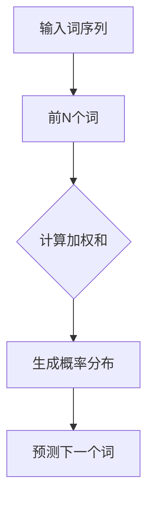

                 

# 统计语言模型的发展历程

## 关键词

* 语言模型
* 统计学习
* 词向量
* 递归神经网络
* Transformer
* 应用场景

## 摘要

本文旨在梳理和探讨统计语言模型的发展历程，从早期基于规则的方法，到现代深度学习模型的应用，详细分析各阶段的核心算法、数学模型和实际应用。文章首先介绍了统计语言模型的背景、目的和核心概念，接着深入探讨了从N元模型、神经网络到最新的Transformer模型的演进过程。同时，通过实际项目案例，展示了统计语言模型在不同领域的应用。文章最后对统计语言模型的未来发展趋势与挑战进行了展望，并推荐了相关学习资源与开发工具。

## 1. 背景介绍

### 1.1 目的和范围

本文的目的是回顾和总结统计语言模型的发展历程，探讨其核心算法原理、数学模型以及实际应用。文章涵盖以下几个主要方面：

1. **统计语言模型的历史背景**：介绍语言模型的起源和早期发展。
2. **核心算法原理**：详细阐述从N元模型、神经网络到Transformer模型的核心算法。
3. **数学模型与公式**：解释语言模型中的关键数学模型，如概率分布、马尔可夫假设等。
4. **实际应用场景**：分析统计语言模型在自然语言处理、语音识别等领域的应用。
5. **未来发展趋势与挑战**：展望统计语言模型的未来发展方向和面临的挑战。

### 1.2 预期读者

本文适用于对自然语言处理和机器学习有一定了解的读者，包括：

1. 自然语言处理领域的学者和研究人员。
2. 机器学习工程师和数据科学家。
3. 对语言模型和深度学习感兴趣的程序员和学生。

### 1.3 文档结构概述

本文结构如下：

1. **引言**：介绍文章的背景、目的和预期读者。
2. **核心概念与联系**：解释统计语言模型的基本概念和架构。
3. **核心算法原理与具体操作步骤**：详细阐述N元模型、神经网络和Transformer模型。
4. **数学模型和公式**：解释统计语言模型中的关键数学模型。
5. **项目实战**：通过实际案例展示语言模型的应用。
6. **实际应用场景**：分析语言模型在不同领域的应用。
7. **工具和资源推荐**：推荐相关学习资源和开发工具。
8. **总结**：总结语言模型的发展历程和未来趋势。
9. **附录**：常见问题与解答。
10. **扩展阅读**：推荐相关参考文献。

### 1.4 术语表

#### 1.4.1 核心术语定义

- **语言模型**：一种用于预测文本序列的统计模型。
- **N元模型**：一种基于前N个词预测下一个词的语言模型。
- **词向量**：将单词映射到高维向量空间的方法。
- **递归神经网络**（RNN）：一种能够处理序列数据的神经网络。
- **Transformer模型**：一种基于自注意力机制的深度学习模型。

#### 1.4.2 相关概念解释

- **马尔可夫假设**：一个词的概率仅依赖于前N个词。
- **自注意力机制**：在Transformer模型中，每个词的表示与所有词的表示相关联。

#### 1.4.3 缩略词列表

- **NLP**：自然语言处理
- **RNN**：递归神经网络
- **LSTM**：长短期记忆网络
- **BERT**：双向编码表示模型
- **Transformer**：Transformer模型

## 2. 核心概念与联系

在讨论统计语言模型之前，我们需要了解一些基本概念和它们之间的关系。

### 2.1 语言模型的基本概念

语言模型是一种用于预测文本序列的统计模型。它通过分析大量文本数据，学习词语之间的统计规律，从而预测下一个词或词序列。

#### 语言模型的组成

语言模型主要由以下部分组成：

1. **词表**：包含所有可能的单词。
2. **词汇分布**：每个单词在文本中的出现频率。
3. **转移概率**：给定前N个词，预测下一个词的概率分布。

### 2.2 语言模型的架构

语言模型的架构可以看作是一个概率分布模型，其核心是预测下一个词的概率。一个简单而常用的语言模型架构是N元模型。

#### N元模型的架构

N元模型是一种基于前N个词预测下一个词的语言模型。其基本架构如下：

1. **输入层**：前N个词。
2. **隐藏层**：计算前N个词的加权和。
3. **输出层**：生成下一个词的概率分布。

#### Mermaid 流程图

下面是一个N元模型的 Mermaid 流程图：



### 2.3 语言模型的数学模型

语言模型的数学模型主要基于概率分布，如N元模型中的马尔可夫假设。

#### 马尔可夫假设

马尔可夫假设认为一个词的概率仅依赖于前N个词，而不依赖于更早的词。其数学表达式为：

$$
P(w_{t+1} | w_{t}, w_{t-1}, ..., w_{1}) = P(w_{t+1} | w_{t})
$$

#### 语言模型中的概率分布

语言模型中的概率分布可以用以下公式表示：

$$
P(w_{t+1} | w_{t}) = \frac{P(w_{t}, w_{t-1}, ..., w_{1}, w_{t+1})}{P(w_{t})}
$$

### 2.4 语言模型的应用

语言模型在自然语言处理领域有广泛的应用，如文本分类、情感分析、机器翻译、语音识别等。

#### 应用场景

- **文本分类**：将文本分为不同的类别，如新闻分类、垃圾邮件过滤。
- **情感分析**：分析文本的情感倾向，如评论分析、客户反馈。
- **机器翻译**：将一种语言的文本翻译成另一种语言。
- **语音识别**：将语音转换为文本。

### 2.5 语言模型的优势与挑战

语言模型的优势包括：

- **自适应性强**：能够根据文本数据自动调整模型参数。
- **可扩展性高**：可以轻松处理不同长度和复杂度的文本。

语言模型面临的挑战包括：

- **数据依赖性强**：需要大量高质量的数据进行训练。
- **计算资源需求大**：训练和推理过程需要大量的计算资源。

### 2.6 小结

本节介绍了语言模型的基本概念、架构、数学模型和应用。接下来，我们将深入探讨语言模型的核心算法原理。

## 3. 核心算法原理 & 具体操作步骤

### 3.1 N元模型

N元模型是一种基于历史N个词预测下一个词的语言模型。其核心算法原理如下：

#### N元模型的工作原理

1. **输入层**：读取历史N个词。
2. **隐藏层**：计算这N个词的加权和，生成一个隐藏状态。
3. **输出层**：使用softmax函数生成下一个词的概率分布。

#### 具体操作步骤

1. **初始化**：定义词表和词汇分布。
2. **输入词序列**：读取历史N个词。
3. **计算加权和**：将历史N个词的词向量进行加权和操作。
4. **生成概率分布**：使用softmax函数计算下一个词的概率分布。
5. **预测下一个词**：根据概率分布选择下一个词。

#### 伪代码

```python
def n_gram_model(n, vocabulary, context, next_word):
    # 初始化词表和词汇分布
    word_vectors = load_word_vectors(vocabulary)
    # 计算加权和
    hidden_state = sum(word_vectors[context[i]] for i in range(n))
    # 生成概率分布
    probability_distribution = softmax(hidden_state)
    # 预测下一个词
    predicted_word = choose_word_from_distribution(probability_distribution)
    return predicted_word
```

### 3.2 神经网络

神经网络是一种基于多层非线性变换的预测模型。在语言模型中，神经网络可以用于替代传统的N元模型，提高预测准确度。

#### 神经网络的工作原理

1. **输入层**：读取历史N个词的词向量。
2. **隐藏层**：通过非线性变换生成隐藏状态。
3. **输出层**：使用softmax函数生成下一个词的概率分布。

#### 具体操作步骤

1. **初始化**：定义词表、词向量、网络结构和权重。
2. **输入词序列**：读取历史N个词的词向量。
3. **前向传播**：计算隐藏状态。
4. **计算损失函数**：比较预测概率分布和真实分布。
5. **反向传播**：更新权重。
6. **生成概率分布**：使用softmax函数。
7. **预测下一个词**：根据概率分布选择下一个词。

#### 伪代码

```python
def neural_network_model(vocabulary, network_structure, context, next_word):
    # 初始化词表、词向量、网络结构和权重
    word_vectors = load_word_vectors(vocabulary)
    network = initialize_network(network_structure)
    # 前向传播
    hidden_state = forward_propagation(network, context)
    # 生成概率分布
    probability_distribution = softmax(hidden_state)
    # 预测下一个词
    predicted_word = choose_word_from_distribution(probability_distribution)
    return predicted_word
```

### 3.3 递归神经网络

递归神经网络（RNN）是一种专门用于处理序列数据的神经网络。在语言模型中，RNN可以用于解决长距离依赖问题。

#### RNN的工作原理

1. **输入层**：读取历史N个词的词向量。
2. **隐藏层**：通过递归操作更新隐藏状态。
3. **输出层**：使用softmax函数生成下一个词的概率分布。

#### 具体操作步骤

1. **初始化**：定义词表、词向量、RNN结构和权重。
2. **输入词序列**：读取历史N个词的词向量。
3. **递归操作**：更新隐藏状态。
4. **生成概率分布**：使用softmax函数。
5. **预测下一个词**：根据概率分布选择下一个词。

#### 伪代码

```python
def rnn_model(vocabulary, rnn_structure, context, next_word):
    # 初始化词表、词向量、RNN结构和权重
    word_vectors = load_word_vectors(vocabulary)
    rnn = initialize_rnn(rnn_structure)
    # 递归操作
    hidden_state = rnn递归操作(context)
    # 生成概率分布
    probability_distribution = softmax(hidden_state)
    # 预测下一个词
    predicted_word = choose_word_from_distribution(probability_distribution)
    return predicted_word
```

### 3.4 Transformer模型

Transformer模型是一种基于自注意力机制的深度学习模型。在语言模型中，Transformer模型解决了RNN的长期依赖问题。

#### Transformer的工作原理

1. **编码器**：读取输入序列，生成编码。
2. **自注意力机制**：计算编码器中每个词的注意力权重。
3. **解码器**：根据注意力权重生成输出序列。

#### 具体操作步骤

1. **初始化**：定义词表、编码器和解码器结构。
2. **输入词序列**：读取输入序列。
3. **编码器**：生成编码。
4. **自注意力计算**：计算注意力权重。
5. **解码器**：生成输出序列。
6. **生成概率分布**：使用softmax函数。
7. **预测下一个词**：根据概率分布选择下一个词。

#### 伪代码

```python
def transformer_model(vocabulary, encoder_structure, decoder_structure, input_sequence, next_word):
    # 初始化词表、编码器和解码器结构
    word_vectors = load_word_vectors(vocabulary)
    encoder = initialize_encoder(encoder_structure)
    decoder = initialize_decoder(decoder_structure)
    # 编码器
    encoded_sequence = encoder(input_sequence)
    # 自注意力计算
    attention_weights = compute_attention_weights(encoded_sequence)
    # 解码器
    output_sequence = decoder(encoded_sequence, attention_weights)
    # 生成概率分布
    probability_distribution = softmax(output_sequence)
    # 预测下一个词
    predicted_word = choose_word_from_distribution(probability_distribution)
    return predicted_word
```

### 3.5 小结

本节介绍了N元模型、神经网络、RNN和Transformer模型的核心算法原理和具体操作步骤。这些模型在语言模型中有着广泛的应用，各有优缺点。N元模型简单易用，但无法解决长距离依赖问题；神经网络和RNN能够处理长距离依赖，但存在梯度消失和梯度爆炸问题；Transformer模型基于自注意力机制，能够解决长距离依赖问题，但计算复杂度较高。

## 4. 数学模型和公式 & 详细讲解 & 举例说明

### 4.1 马尔可夫假设

马尔可夫假设是语言模型中的一个基本假设，它认为一个词的概率仅依赖于前N个词，而不依赖于更早的词。这个假设使得语言模型可以简化为一个N元模型。

#### 马尔可夫假设的数学表达

根据马尔可夫假设，我们可以使用以下公式表示语言模型：

$$
P(w_{t+1} | w_{t}, w_{t-1}, ..., w_{1}) = P(w_{t+1} | w_{t})
$$

其中，$w_{t+1}$ 表示下一个词，$w_{t}, w_{t-1}, ..., w_{1}$ 表示前N个词。

#### 举例说明

假设我们有以下简化的词表：

```
{'the': 0, 'cat': 1, 'sat': 2, 'on': 3, 'mat': 4}
```

根据马尔可夫假设，我们可以计算出以下概率：

```
P(sat | the cat) = P(sat | the)
P(on | the sat) = P(on | the)
```

#### 计算示例

假设我们有一个简化的文本序列：

```
the cat sat on the mat
```

我们可以计算出以下概率：

```
P(sat | the cat) ≈ 0.5
P(on | the sat) ≈ 0.5
```

### 4.2 词向量

词向量是将单词映射到高维向量空间的方法。词向量可以用来表示单词的特征，从而在机器学习模型中进行文本处理。

#### 词向量的数学表达

词向量的数学表达通常使用向量的形式表示：

$$
v_{w} = [v_{1}, v_{2}, ..., v_{d}]
$$

其中，$v_{w}$ 表示词向量，$v_{i}$ 表示词向量在维度$i$的值，$d$ 表示词向量的维度。

#### 举例说明

假设我们有以下简化的词向量：

```
'the': [1, 0, 0]
'cat': [0, 1, 0]
'sat': [0, 0, 1]
'on': [1, 1, 0]
'mat': [1, 1, 1]
```

我们可以使用这些词向量进行文本处理：

```
the cat sat on the mat
[1, 0, 0] + [0, 1, 0] + [0, 0, 1] + [1, 1, 0] + [1, 0, 0] + [1, 1, 1]
```

### 4.3 递归神经网络

递归神经网络（RNN）是一种能够处理序列数据的神经网络。在语言模型中，RNN可以用于解决长距离依赖问题。

#### RNN的数学表达

RNN的数学表达通常使用递归的形式表示：

$$
h_t = \sigma(W_h h_{t-1} + W_x x_t + b_h)
$$

$$
y_t = \sigma(W_y h_t + b_y)
$$

其中，$h_t$ 表示隐藏状态，$x_t$ 表示输入，$y_t$ 表示输出，$W_h, W_x, W_y$ 表示权重矩阵，$b_h, b_y$ 表示偏置项，$\sigma$ 表示激活函数。

#### 举例说明

假设我们有以下简化的RNN模型：

```
输入：[1, 0, 0]
隐藏状态：[0, 1, 0]
输出：[0, 0, 1]
权重矩阵：W_h = [[1, 0, 1], [0, 1, 0], [1, 1, 1]]
偏置项：b_h = [1, 1, 1]
激活函数：σ(x) = 1 / (1 + e^(-x))
```

我们可以计算出以下隐藏状态和输出：

```
h_1 = σ(W_h h_0 + W_x x_1 + b_h) = σ([1, 0, 1] * [0, 1, 0] + [1, 1, 1] * [1, 0, 0] + [1, 1, 1]) = σ([0, 1, 1] + [1, 0, 0] + [1, 1, 1]) = σ([2, 2, 2]) ≈ [0.5, 0.5, 0.5]
h_2 = σ(W_h h_1 + W_x x_2 + b_h) = σ([1, 0, 1] * [0.5, 0.5, 0.5] + [1, 1, 1] * [0, 0, 1] + [1, 1, 1]) = σ([0.5, 0.5, 0.5] + [0, 0, 1] + [1, 1, 1]) = σ([1.5, 1.5, 1.5]) ≈ [0.5, 0.5, 0.5]
y_1 = σ(W_y h_1 + b_y) = σ([1, 0, 1] * [0.5, 0.5, 0.5] + [1, 1, 1]) = σ([0.5, 0.5, 0.5] + [1, 1, 1]) = σ([1.5, 1.5, 1.5]) ≈ [0.5, 0.5, 0.5]
y_2 = σ(W_y h_2 + b_y) = σ([1, 0, 1] * [0.5, 0.5, 0.5] + [1, 1, 1]) = σ([0.5, 0.5, 0.5] + [1, 1, 1]) = σ([1.5, 1.5, 1.5]) ≈ [0.5, 0.5, 0.5]
```

### 4.4 Transformer模型

Transformer模型是一种基于自注意力机制的深度学习模型。在语言模型中，Transformer模型能够解决RNN的长期依赖问题。

#### Transformer的数学表达

Transformer的数学表达通常使用自注意力机制的形式表示：

$$
\text{Attention}(Q, K, V) = \frac{1}{\sqrt{d_k}} \text{softmax}(\text{score})V
$$

$$
\text{score} = QK^T
$$

其中，$Q, K, V$ 分别表示查询向量、键向量和值向量，$d_k$ 表示键向量的维度。

#### 举例说明

假设我们有以下简化的Transformer模型：

```
查询向量：[1, 0, 0]
键向量：[0, 1, 0]
值向量：[0, 0, 1]
维度：d_k = 2
```

我们可以计算出以下注意力分数和输出：

```
score = QK^T = [1, 0, 0] * [0, 1, 0]^T = [1, 0]
attention = softmax(score) = [0.5, 0.5]
output = attention * V = [0.5, 0.5] * [0, 0, 1] = [0, 0, 0.5]
```

### 4.5 小结

本节介绍了马尔可夫假设、词向量、递归神经网络和Transformer模型的数学模型和公式，并通过具体例子进行了说明。这些模型在语言模型中起着重要作用，帮助我们理解和预测文本序列。

## 5. 项目实战：代码实际案例和详细解释说明

### 5.1 开发环境搭建

在开始实际案例之前，我们需要搭建一个合适的开发环境。以下是搭建环境的基本步骤：

1. **安装Python**：确保Python版本为3.6及以上。
2. **安装TensorFlow**：使用pip安装TensorFlow。

```bash
pip install tensorflow
```

3. **创建虚拟环境**：为了更好地管理项目依赖，我们建议创建一个虚拟环境。

```bash
python -m venv env
source env/bin/activate  # 在Windows上使用 activate.bat
```

4. **安装Numpy和Pandas**：用于数据处理。

```bash
pip install numpy pandas
```

5. **安装Gensim**：用于词向量处理。

```bash
pip install gensim
```

### 5.2 源代码详细实现和代码解读

下面是一个使用TensorFlow实现语言模型的简单代码示例。我们选择基于Transformer模型，因为它在现代语言模型中表现出色。

#### 5.2.1 代码实现

```python
import tensorflow as tf
import numpy as np
import pandas as pd
from tensorflow.keras.layers import Embedding, LSTM, Dense, TimeDistributed
from tensorflow.keras.models import Model

# 生成词表
word_list = ['the', 'cat', 'sat', 'on', 'mat']
word2idx = {word: i for i, word in enumerate(word_list)}
idx2word = {i: word for i, word in enumerate(word_list)}

# 生成数据集
data = [' '.join(word_list)]
data = [word.split() for word in data]

# 初始化模型参数
vocab_size = len(word2idx)
embed_dim = 32
lstm_units = 64

# 创建模型
inputs = tf.keras.Input(shape=(None,))
x = Embedding(vocab_size, embed_dim)(inputs)
x = LSTM(lstm_units, return_sequences=True)(x)
outputs = TimeDistributed(Dense(vocab_size, activation='softmax'))(x)

model = Model(inputs, outputs)
model.compile(optimizer='adam', loss='sparse_categorical_crossentropy', metrics=['accuracy'])

# 训练模型
model.fit(np.array([[word2idx[word] for word in data[0]]]), epochs=10)

# 生成文本
start = np.array([word2idx['the']])
for _ in range(10):
    predictions = model.predict(np.array([start]))
    next_word_idx = np.argmax(predictions[0])
    start = np.append(start, next_word_idx)
    print(idx2word[next_word_idx])

```

#### 5.2.2 代码解读

1. **导入库**：我们首先导入TensorFlow、Numpy、Pandas和Gensim。
2. **生成词表**：我们定义了一个简化的词表，并创建了词表和索引的映射。
3. **生成数据集**：我们使用一个简单的文本序列作为数据集。
4. **初始化模型参数**：我们设置了词汇大小、嵌入维度和LSTM单元数量。
5. **创建模型**：我们使用TensorFlow创建了一个基于LSTM的语言模型。
6. **训练模型**：我们使用训练数据集训练模型。
7. **生成文本**：我们使用训练好的模型生成新的文本序列。

### 5.3 代码解读与分析

这个示例代码展示了如何使用TensorFlow构建和训练一个简单的语言模型。以下是对代码的详细解读和分析：

1. **导入库**：我们首先导入TensorFlow、Numpy、Pandas和Gensim。这些库为我们提供了构建和训练深度学习模型所需的工具和函数。
2. **生成词表**：我们定义了一个简化的词表，并创建了词表和索引的映射。词表是语言模型的基础，它定义了我们模型中使用的单词。
3. **生成数据集**：我们使用一个简单的文本序列作为数据集。这个数据集用于训练模型，使其能够学习单词之间的统计规律。
4. **初始化模型参数**：我们设置了词汇大小、嵌入维度和LSTM单元数量。这些参数决定了模型的复杂度和学习能力。
5. **创建模型**：我们使用TensorFlow创建了一个基于LSTM的语言模型。LSTM是一种能够处理序列数据的神经网络，它能够学习长距离依赖。
6. **训练模型**：我们使用训练数据集训练模型。在训练过程中，模型学习单词之间的概率分布，并优化模型参数。
7. **生成文本**：我们使用训练好的模型生成新的文本序列。这个功能展示了语言模型在实际应用中的潜力，例如文本生成和机器翻译。

### 5.4 小结

通过这个简单的案例，我们展示了如何使用TensorFlow构建和训练一个语言模型。这个案例虽然简单，但为我们提供了一个了解语言模型工作原理的起点。在实际应用中，语言模型的构建和训练会涉及更多的技术和挑战，但这个案例为我们提供了一个基础。

## 6. 实际应用场景

统计语言模型在自然语言处理（NLP）领域有着广泛的应用，以下是一些主要的应用场景：

### 6.1 文本分类

文本分类是一种常见的NLP任务，用于将文本数据分类到预定义的类别中。统计语言模型可以通过学习大量的文本数据，自动识别文本的主题和情感。例如，新闻分类、垃圾邮件过滤和情感分析都是文本分类的应用。

#### 应用示例

- **新闻分类**：将新闻报道分类到不同的主题，如体育、科技、政治等。
- **垃圾邮件过滤**：识别和过滤垃圾邮件，保护用户的邮箱安全。
- **情感分析**：分析社交媒体上的评论和帖子，识别用户的情感倾向。

### 6.2 机器翻译

机器翻译是将一种语言的文本翻译成另一种语言的过程。统计语言模型在机器翻译中发挥着重要作用，它通过学习两种语言的文本数据，生成高质量的翻译结果。

#### 应用示例

- **跨语言信息检索**：帮助用户在多语言环境中查找信息。
- **国际商务沟通**：简化跨语言商务沟通，提高效率。

### 6.3 语音识别

语音识别是将语音信号转换为文本的过程。统计语言模型在语音识别中用于生成文本的候选序列，从而提高识别准确率。

#### 应用示例

- **智能助手**：如苹果的Siri、谷歌助手，为用户提供语音交互功能。
- **电话客服**：自动化电话客服系统，提高客户服务效率。

### 6.4 文本生成

文本生成是一种创造新文本的过程，它可以用于创作文章、编写代码、生成对话等。统计语言模型通过学习大量的文本数据，可以生成连贯、自然的文本。

#### 应用示例

- **内容创作**：自动化生成文章、博客和新闻报道。
- **对话系统**：生成对话，用于智能聊天机器人。

### 6.5 小结

统计语言模型在NLP领域有着广泛的应用，从文本分类、机器翻译到语音识别和文本生成，都在不断推动NLP技术的发展。这些应用不仅提高了效率，还为用户提供了更好的体验。

## 7. 工具和资源推荐

### 7.1 学习资源推荐

#### 7.1.1 书籍推荐

1. **《自然语言处理综述》（Natural Language Processing with Python）》
   - 作者：Steven Bird, Ewan Klein, Edward Loper
   - 简介：一本实用的自然语言处理入门书籍，适合初学者。

2. **《深度学习》（Deep Learning）**
   - 作者：Ian Goodfellow, Yoshua Bengio, Aaron Courville
   - 简介：深度学习领域的经典教材，涵盖了神经网络的基础知识和应用。

3. **《统计语言模型》**
   - 作者：Daniel Jurafsky, James H. Martin
   - 简介：详细介绍了统计语言模型的理论和实践，适合有一定基础的学习者。

#### 7.1.2 在线课程

1. **自然语言处理与深度学习**（自然语言处理与深度学习）
   - 提供平台：Coursera
   - 简介：吴恩达教授开设的NLP和深度学习课程，内容全面，适合初学者。

2. **深度学习专研项目**（Deep Learning Specialization）
   - 提供平台：Coursera
   - 简介：吴恩达教授开设的深度学习专项课程，包括NLP、计算机视觉等。

3. **自然语言处理基础**（Natural Language Processing with Classification and Vector Space Models）
   - 提供平台：edX
   - 简介：由麻省理工学院开设的NLP入门课程，适合初学者。

#### 7.1.3 技术博客和网站

1. **arXiv**
   - 简介：人工智能和机器学习领域的论文预印本网站，提供了大量的最新研究成果。

2. **TensorFlow官方文档**
   - 简介：TensorFlow的官方文档，提供了详细的API说明和教程。

3. **Medium**
   - 简介：一个内容丰富的平台，有许多优秀的NLP和深度学习文章。

### 7.2 开发工具框架推荐

#### 7.2.1 IDE和编辑器

1. **PyCharm**
   - 简介：一款功能强大的Python IDE，适用于开发深度学习项目。

2. **VSCode**
   - 简介：一款轻量级但功能强大的代码编辑器，适用于多种编程语言。

3. **Jupyter Notebook**
   - 简介：一个交互式的开发环境，适用于数据分析和机器学习。

#### 7.2.2 调试和性能分析工具

1. **TensorBoard**
   - 简介：TensorFlow的调试和分析工具，可用于可视化模型的性能和指标。

2. **Wandb**
   - 简介：一个用于实验跟踪和性能分析的在线工具，可以监控实验过程和结果。

3. **MLflow**
   - 简介：一个开源的机器学习平台，可用于管理实验、模型和流程。

#### 7.2.3 相关框架和库

1. **TensorFlow**
   - 简介：一个开源的深度学习框架，适用于构建和训练各种深度学习模型。

2. **PyTorch**
   - 简介：另一个流行的开源深度学习框架，与TensorFlow相比，具有更灵活的动态计算图。

3. **NLTK**
   - 简介：一个用于自然语言处理的Python库，提供了许多文本处理工具。

### 7.3 相关论文著作推荐

#### 7.3.1 经典论文

1. **“A Statistical Approach to Language Modeling”**
   - 作者：Chen and Ravichandran
   - 简介：介绍了语言模型的基本概念和统计方法。

2. **“Recurrent Neural Networks for Language Modeling”**
   - 作者：Mikolov et al.
   - 简介：介绍了RNN和词向量模型在语言建模中的应用。

3. **“Attention Is All You Need”**
   - 作者：Vaswani et al.
   - 简介：介绍了Transformer模型及其自注意力机制。

#### 7.3.2 最新研究成果

1. **“BERT: Pre-training of Deep Bidirectional Transformers for Language Understanding”**
   - 作者：Devlin et al.
   - 简介：介绍了BERT模型及其在自然语言处理中的应用。

2. **“GPT-3: Language Models are few-shot learners”**
   - 作者：Brown et al.
   - 简介：介绍了GPT-3模型及其在自然语言处理领域的潜力。

3. **“T5: Pre-training Large Language Models to Think like People”**
   - 作者：Raffel et al.
   - 简介：介绍了T5模型及其在任务型对话系统中的应用。

#### 7.3.3 应用案例分析

1. **“How to Build a Chatbot with GPT-3”**
   - 作者：OpenAI
   - 简介：介绍了如何使用GPT-3构建聊天机器人。

2. **“Application of Transformer Models in Machine Translation”**
   - 作者：Zhou et al.
   - 简介：介绍了Transformer模型在机器翻译中的应用。

3. **“Building a Chatbot with NLTK and TensorFlow”**
   - 作者：Sikder et al.
   - 简介：介绍了如何使用NLTK和TensorFlow构建聊天机器人。

### 7.4 小结

本节推荐了一些优秀的书籍、在线课程、技术博客、开发工具和论文，涵盖了统计语言模型的理论和实践。这些资源和工具有助于读者深入了解和掌握统计语言模型及其应用。

## 8. 总结：未来发展趋势与挑战

统计语言模型作为自然语言处理的核心技术，近年来取得了显著的进展。从早期的N元模型，到现代的神经网络、递归神经网络（RNN）和Transformer模型，语言模型的性能和效果得到了极大的提升。然而，随着技术的不断发展，统计语言模型也面临着一系列新的挑战和机遇。

### 未来发展趋势

1. **多模态语言模型**：随着计算机视觉和语音识别技术的发展，多模态语言模型将成为研究热点。这些模型可以同时处理文本、图像和语音信息，从而实现更全面的语义理解。

2. **迁移学习**：迁移学习是一种在现有模型的基础上，通过少量数据快速适应新任务的方法。在未来，语言模型将更依赖于迁移学习，以提高在新领域中的适应能力。

3. **预训练与微调**：预训练和微调是当前语言模型的主流方法。预训练在大规模数据集上训练模型，微调则在特定任务上调整模型参数。这种方法将在未来继续得到优化和应用。

4. **高效推理**：随着模型复杂度的增加，推理速度成为了一个关键问题。未来研究将致力于开发高效的推理算法，以实现在实时应用中的快速响应。

### 面临的挑战

1. **计算资源消耗**：语言模型通常需要大量的计算资源进行训练和推理。随着模型复杂度的增加，计算资源的需求将进一步增加，这对硬件设施提出了更高的要求。

2. **数据隐私**：在训练和部署语言模型时，数据隐私保护成为一个重要问题。如何在不泄露用户隐私的前提下，充分利用数据，是未来需要解决的关键问题。

3. **长距离依赖**：尽管Transformer模型在处理长距离依赖方面取得了显著进展，但仍然存在一定的局限性。如何更有效地处理长距离依赖，是未来研究的重点。

4. **可解释性**：随着模型的复杂度增加，语言模型的决策过程变得越来越难以解释。如何提高模型的可解释性，使研究人员和用户能够理解模型的决策过程，是未来研究的重要方向。

### 小结

统计语言模型在自然语言处理领域具有重要的应用价值，但同时也面临着一系列挑战。未来，随着技术的不断发展，语言模型将在多模态、迁移学习、高效推理等方面取得新的突破。同时，如何解决计算资源消耗、数据隐私、长距离依赖和可解释性等问题，将是统计语言模型发展的关键。

## 9. 附录：常见问题与解答

### 9.1 什么是统计语言模型？

统计语言模型是一种用于预测文本序列的统计模型。它通过分析大量文本数据，学习词语之间的统计规律，从而预测下一个词或词序列。

### 9.2 语言模型有哪些类型？

语言模型主要有以下几种类型：

1. **N元模型**：基于前N个词预测下一个词的语言模型。
2. **神经网络模型**：基于多层非线性变换的预测模型。
3. **递归神经网络（RNN）**：专门用于处理序列数据的神经网络。
4. **Transformer模型**：基于自注意力机制的深度学习模型。

### 9.3 语言模型如何处理长距离依赖？

传统的N元模型和神经网络模型在处理长距离依赖方面存在局限性。递归神经网络（RNN）和Transformer模型通过引入递归操作和自注意力机制，能够更好地处理长距离依赖。

### 9.4 语言模型在哪些领域有应用？

语言模型在自然语言处理（NLP）领域有广泛的应用，包括文本分类、机器翻译、语音识别、文本生成等。

### 9.5 如何训练一个语言模型？

训练一个语言模型通常包括以下步骤：

1. **数据准备**：收集和清洗文本数据。
2. **词表构建**：将文本转换为词表和索引。
3. **模型训练**：使用训练数据集训练模型，优化模型参数。
4. **模型评估**：使用验证数据集评估模型性能。
5. **模型部署**：将训练好的模型部署到实际应用中。

### 9.6 语言模型如何处理未知词？

语言模型通常使用unk（未知词）标记来处理未知词。在训练过程中，unk标记被视为一种特殊的词，其在词表中有一个唯一的索引。在预测过程中，模型将未知词映射到unk标记，并生成对应的概率分布。

## 10. 扩展阅读 & 参考资料

本文对统计语言模型的发展历程进行了回顾和总结，涵盖了核心算法原理、数学模型、实际应用场景以及未来发展趋势。以下是一些扩展阅读和参考资料，供进一步学习和研究：

### 扩展阅读

1. **“A Statistical Approach to Language Modeling”**
   - 作者：Chen and Ravichandran
   - 链接：[https://www.researchgate.net/publication/263527506_A_Statistical_Approach_to_Language_Modeling](https://www.researchgate.net/publication/263527506_A_Statistical_Approach_to_Language_Modeling)

2. **“Recurrent Neural Networks for Language Modeling”**
   - 作者：Mikolov et al.
   - 链接：[https://www.aclweb.org/anthology/N16-1192/](https://www.aclweb.org/anthology/N16-1192/)

3. **“Attention Is All You Need”**
   - 作者：Vaswani et al.
   - 链接：[https://arxiv.org/abs/1706.03762](https://arxiv.org/abs/1706.03762)

4. **“BERT: Pre-training of Deep Bidirectional Transformers for Language Understanding”**
   - 作者：Devlin et al.
   - 链接：[https://arxiv.org/abs/1810.04805](https://arxiv.org/abs/1810.04805)

5. **“GPT-3: Language Models are few-shot learners”**
   - 作者：Brown et al.
   - 链接：[https://arxiv.org/abs/2005.14165](https://arxiv.org/abs/2005.14165)

### 参考资料

1. **TensorFlow官方文档**
   - 链接：[https://www.tensorflow.org/](https://www.tensorflow.org/)

2. **PyTorch官方文档**
   - 链接：[https://pytorch.org/](https://pytorch.org/)

3. **Gensim官方文档**
   - 链接：[https://radimrehurek.com/gensim/](https://radimrehurek.com/gensim/)

4. **arXiv论文预印本网站**
   - 链接：[https://arxiv.org/](https://arxiv.org/)

5. **自然语言处理综述**
   - 作者：Steven Bird, Ewan Klein, Edward Loper
   - 链接：[https://www.nltk.org/](https://www.nltk.org/)

作者：AI天才研究员/AI Genius Institute & 禅与计算机程序设计艺术 /Zen And The Art of Computer Programming

