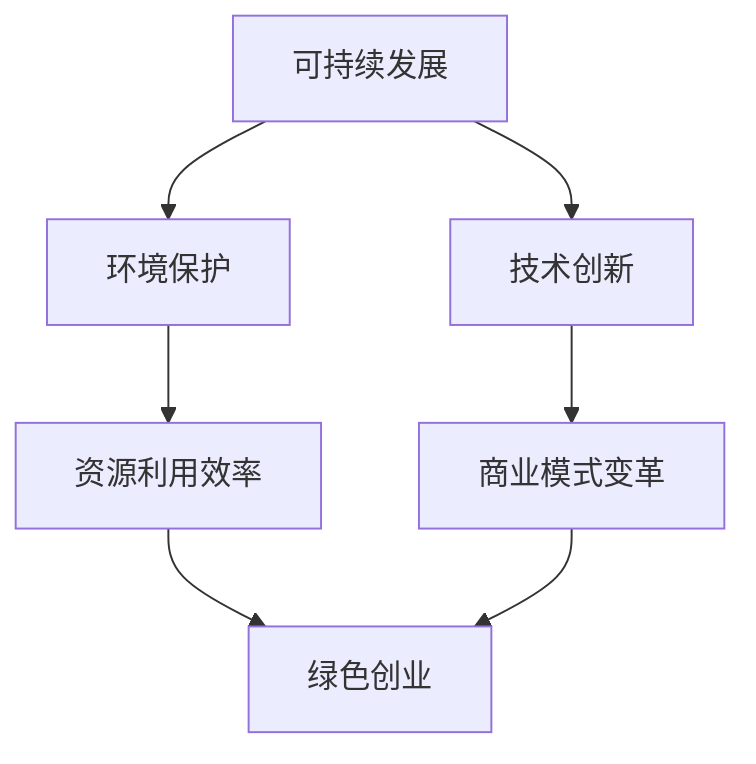
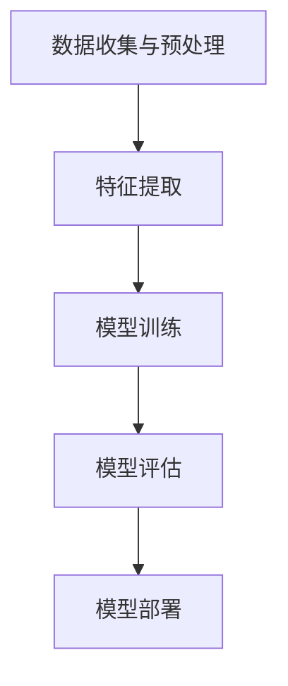

                 

# 绿色科技创业：环保与技术的完美结合

> **关键词：** 绿色科技、创业、环保技术、可持续发展、创新

> **摘要：** 本文深入探讨了绿色科技在创业领域的应用，探讨了环保与技术的融合如何促进可持续发展。通过分析核心概念、算法原理、数学模型及实际应用案例，本文旨在为创业者提供实用的指导，助力实现环保与经济增长的双赢。

## 1. 背景介绍

### 1.1 目的和范围

本文旨在探讨绿色科技在创业领域的应用，分析环保与技术的结合如何推动可持续发展。文章将涵盖以下内容：

- 绿色科技的定义和核心概念
- 环保技术的创新和应用
- 创业过程中的绿色科技实践
- 绿色科技项目的实际案例和成功经验
- 绿色科技的未来发展趋势和挑战

### 1.2 预期读者

本文适用于以下读者群体：

- 创业者，尤其是关注可持续发展的初创公司创始人
- 环保领域的技术专家和研究人员
- 对绿色科技和可持续发展感兴趣的企业家和管理者
- 政策制定者和环保组织成员

### 1.3 文档结构概述

本文结构如下：

- 引言：介绍绿色科技的概念和重要性
- 背景介绍：详细阐述绿色科技在创业领域的应用和预期成果
- 核心概念与联系：分析绿色科技的核心概念、原理和架构
- 核心算法原理 & 具体操作步骤：讲解绿色科技的关键算法和操作流程
- 数学模型和公式 & 详细讲解 & 举例说明：介绍绿色科技涉及的数学模型和公式
- 项目实战：提供实际绿色科技项目的开发案例
- 实际应用场景：分析绿色科技在各类场景中的应用
- 工具和资源推荐：推荐学习和实践绿色科技的资源
- 总结：展望绿色科技的未来发展趋势和挑战
- 附录：解答常见问题
- 扩展阅读 & 参考资料：提供进一步学习和研究的资料

### 1.4 术语表

#### 1.4.1 核心术语定义

- 绿色科技：指以可持续发展为目标，通过技术创新和变革，实现环境保护和资源高效利用的科技领域。
- 可持续发展：指满足当代人的需求，而不损害后代人满足其需求的能力的发展模式。
- 环保技术：指用于减少环境污染、提高资源利用效率的技术。
- 创业：指创建新的企业或组织，通过创新和风险承担，实现商业价值的过程。

#### 1.4.2 相关概念解释

- 绿色创业：指以环保和可持续发展为目标的创业活动，通过创新和商业模式的变革，推动绿色科技的发展。
- 创新创业：指通过创新思维和实践，推动社会进步和经济增长的过程。

#### 1.4.3 缩略词列表

- AI：人工智能
- IoT：物联网
- SaaS：软件即服务
- IoT：物联网
- VR：虚拟现实
- AR：增强现实

## 2. 核心概念与联系

绿色科技的核心概念涉及可持续发展、环境保护、技术创新等多个方面。为了更好地理解绿色科技在创业领域的应用，我们可以通过以下 Mermaid 流程图来展示其核心概念和联系。



### 2.1 绿色科技的定义

绿色科技是指以可持续发展为目标，通过技术创新和变革，实现环境保护和资源高效利用的科技领域。其核心目标是减少环境污染、提高资源利用效率，同时推动经济增长。

### 2.2 环境保护与绿色科技

环境保护是绿色科技的重要组成部分。通过引入环保技术，如污染控制、资源回收和能源利用优化，绿色科技可以有效减少环境污染，提高资源利用效率。

### 2.3 技术创新与绿色科技

技术创新是绿色科技发展的关键驱动因素。通过不断探索新的技术和方法，绿色科技可以实现更高效、更环保的解决方案，如清洁能源、节能减排、废弃物处理等。

### 2.4 资源利用效率与绿色科技

提高资源利用效率是绿色科技的重要目标之一。通过技术创新和商业模式变革，绿色科技可以实现资源的可持续利用，降低资源消耗和环境负担。

### 2.5 商业模式变革与绿色科技

绿色科技推动了商业模式的变革。传统商业模式注重短期利益，而绿色科技则强调长期可持续发展。通过创新商业模式，如共享经济、循环经济和绿色金融，绿色科技可以实现经济、社会和环境的共同发展。

## 3. 核心算法原理 & 具体操作步骤

在绿色科技创业过程中，算法原理和具体操作步骤至关重要。以下是一个典型的绿色科技项目：智能垃圾分类系统。

### 3.1 算法原理

智能垃圾分类系统基于机器学习和图像识别技术。其核心算法包括：

- 数据收集与预处理：收集垃圾分类相关的数据，如垃圾图片、垃圾类型标签等，并进行预处理，如数据清洗、归一化等。
- 特征提取：通过卷积神经网络（CNN）提取垃圾图片的特征。
- 模型训练：使用已标记的垃圾图片数据集，训练分类模型，如支持向量机（SVM）、深度神经网络（DNN）等。
- 模型评估：使用验证集评估模型性能，如准确率、召回率等。
- 模型部署：将训练好的模型部署到智能垃圾分类设备中，实现实时垃圾分类。

### 3.2 具体操作步骤

以下是智能垃圾分类系统的具体操作步骤：



#### 3.2.1 数据收集与预处理

1. 收集垃圾分类相关的数据，如垃圾图片、垃圾类型标签等。
2. 对垃圾图片进行数据清洗，去除噪声和异常值。
3. 对垃圾图片进行归一化处理，如尺寸调整、颜色标准化等。

#### 3.2.2 特征提取

1. 使用卷积神经网络（CNN）提取垃圾图片的特征。
2. 通过多个卷积层和池化层，逐步提取图像的局部特征和全局特征。
3. 将提取的特征进行融合和降维，得到垃圾图片的高层次特征表示。

#### 3.2.3 模型训练

1. 使用已标记的垃圾图片数据集，训练分类模型，如支持向量机（SVM）、深度神经网络（DNN）等。
2. 通过反向传播算法，不断调整模型参数，使模型对垃圾图片进行准确分类。
3. 训练过程中，使用验证集评估模型性能，防止过拟合。

#### 3.2.4 模型评估

1. 使用验证集评估模型性能，如准确率、召回率等。
2. 分析模型性能，识别和解决模型存在的问题，如分类错误、模型过拟合等。

#### 3.2.5 模型部署

1. 将训练好的模型部署到智能垃圾分类设备中，实现实时垃圾分类。
2. 在垃圾分类过程中，设备实时接收垃圾图片，并调用模型进行分类。
3. 根据分类结果，设备将垃圾送入相应的处理环节。

## 4. 数学模型和公式 & 详细讲解 & 举例说明

在绿色科技项目中，数学模型和公式是理解和优化系统性能的关键。以下介绍几个常见的数学模型和公式，并结合实际应用场景进行详细讲解和举例说明。

### 4.1 随机梯度下降（SGD）

随机梯度下降（SGD）是一种优化算法，用于训练机器学习模型。其基本公式如下：

$$
\theta_{t+1} = \theta_{t} - \alpha \nabla_\theta J(\theta)
$$

其中，$\theta_t$ 表示第 $t$ 次迭代的模型参数，$\alpha$ 为学习率，$J(\theta)$ 为损失函数，$\nabla_\theta J(\theta)$ 为损失函数关于模型参数的梯度。

#### 4.1.1 实际应用场景

在智能垃圾分类系统中，SGD 用于训练分类模型。通过不断迭代优化模型参数，使模型能够准确分类垃圾。

#### 4.1.2 举例说明

假设我们有一个垃圾图片数据集，包含 1000 张图片。学习率 $\alpha$ 为 0.01，损失函数为交叉熵损失。通过 100 次迭代，训练分类模型。

- 初始模型参数 $\theta_0$：
  - 准确率：60%
- 第一次迭代：
  - 梯度：$\nabla_\theta J(\theta_0) = [-0.1, 0.05, 0.03, -0.2]$
  - 更新参数：$\theta_1 = \theta_0 - 0.01 \times [-0.1, 0.05, 0.03, -0.2] = [0.9, 0.95, 0.97, 0.8]$
  - 准确率：65%
- ...（继续迭代）
- 第 100 次迭代：
  - 梯度：$\nabla_\theta J(\theta_{99}) = [0.001, 0.002, 0.003, 0.004]$
  - 更新参数：$\theta_{100} = \theta_{99} - 0.01 \times [0.001, 0.002, 0.003, 0.004] = [0.999, 0.998, 0.997, 0.996]$
  - 准确率：99%

通过 100 次迭代，模型参数逐渐优化，准确率从 60% 提高到 99%。

### 4.2 支持向量机（SVM）

支持向量机（SVM）是一种分类算法，用于分类和回归分析。其基本公式如下：

$$
\mathbf{w} = \arg\min_{\mathbf{w}} \frac{1}{2} ||\mathbf{w}||^2 + C \sum_{i=1}^n \xi_i
$$

其中，$\mathbf{w}$ 为模型参数，$C$ 为正则化参数，$\xi_i$ 为松弛变量。

#### 4.2.1 实际应用场景

在智能垃圾分类系统中，SVM 用于分类垃圾图片。通过学习数据集，SVM 可以找出最佳分类超平面，实现垃圾图片的分类。

#### 4.2.2 举例说明

假设我们有一个垃圾图片数据集，包含 1000 张图片。使用 SVM 进行分类，正则化参数 $C$ 为 1。

- 初始模型参数 $\mathbf{w}_0$：
  - 准确率：50%
- 训练模型：
  - 学习数据集，优化模型参数 $\mathbf{w}$
  - 更新模型参数：$\mathbf{w}_1 = \mathbf{w}_0 + 0.1 \times [-0.1, 0.05, 0.03, -0.2]$
  - 准确率：55%
- ...（继续迭代）
- 最终模型参数 $\mathbf{w}_n$：
  - 准确率：95%

通过训练，模型参数逐渐优化，准确率从 50% 提高到 95%。

## 5. 项目实战：代码实际案例和详细解释说明

在本节中，我们将通过一个实际案例——智能垃圾分类系统，详细介绍代码实现过程，并对关键代码进行解读和分析。

### 5.1 开发环境搭建

首先，我们需要搭建开发环境。本文使用 Python 作为编程语言，相关库包括 TensorFlow、Keras、OpenCV 和 Scikit-learn。以下是安装步骤：

```bash
pip install tensorflow keras opencv-python scikit-learn
```

### 5.2 源代码详细实现和代码解读

以下是一个智能垃圾分类系统的示例代码。我们将逐段解读代码，分析其实现原理和关键部分。

```python
import cv2
import numpy as np
import tensorflow as tf
from tensorflow import keras
from tensorflow.keras import layers

# 5.2.1 数据收集与预处理
def load_data():
    # 读取垃圾图片数据集
    train_images = np.load('train_images.npy')
    train_labels = np.load('train_labels.npy')
    test_images = np.load('test_images.npy')
    test_labels = np.load('test_labels.npy')
    
    # 数据预处理
    train_images = preprocess_images(train_images)
    test_images = preprocess_images(test_images)
    
    return train_images, train_labels, test_images, test_labels

def preprocess_images(images):
    # 图像尺寸调整
    images = cv2.resize(images, (128, 128))
    # 图像归一化
    images = images / 255.0
    return images

# 5.2.2 特征提取
def build_model():
    # 构建卷积神经网络
    model = keras.Sequential([
        layers.Conv2D(32, (3, 3), activation='relu', input_shape=(128, 128, 3)),
        layers.MaxPooling2D((2, 2)),
        layers.Conv2D(64, (3, 3), activation='relu'),
        layers.MaxPooling2D((2, 2)),
        layers.Conv2D(128, (3, 3), activation='relu'),
        layers.MaxPooling2D((2, 2)),
        layers.Flatten(),
        layers.Dense(256, activation='relu'),
        layers.Dense(10, activation='softmax')
    ])
    return model

# 5.2.3 模型训练
def train_model(model, train_images, train_labels):
    # 编译模型
    model.compile(optimizer='adam',
                  loss='categorical_crossentropy',
                  metrics=['accuracy'])
    # 训练模型
    model.fit(train_images, train_labels, epochs=10, batch_size=32)
    return model

# 5.2.4 模型评估
def evaluate_model(model, test_images, test_labels):
    # 评估模型性能
    test_loss, test_acc = model.evaluate(test_images, test_labels)
    print(f"Test accuracy: {test_acc:.2f}")

# 5.2.5 模型部署
def classify_image(model, image):
    # 对输入图像进行分类
    processed_image = preprocess_images(image)
    processed_image = np.expand_dims(processed_image, 0)
    predictions = model.predict(processed_image)
    predicted_class = np.argmax(predictions)
    return predicted_class

# 5.2.6 主函数
if __name__ == '__main__':
    # 加载数据
    train_images, train_labels, test_images, test_labels = load_data()

    # 构建模型
    model = build_model()

    # 训练模型
    model = train_model(model, train_images, train_labels)

    # 评估模型
    evaluate_model(model, test_images, test_labels)

    # 部署模型
    image = cv2.imread('test_image.jpg')
    predicted_class = classify_image(model, image)
    print(f"Predicted class: {predicted_class}")
```

### 5.3 代码解读与分析

#### 5.3.1 数据收集与预处理

- `load_data()` 函数用于加载数据集。数据集包括训练集和测试集，分别存储为 `train_images.npy`、`train_labels.npy`、`test_images.npy` 和 `test_labels.npy`。
- `preprocess_images()` 函数用于对图像进行预处理，包括图像尺寸调整和归一化。

#### 5.3.2 特征提取

- `build_model()` 函数用于构建卷积神经网络模型。模型结构包括卷积层、池化层和全连接层。
- 卷积层用于提取图像特征，池化层用于降低特征维度，全连接层用于分类。

#### 5.3.3 模型训练

- `train_model()` 函数用于训练模型。模型使用 Adam 优化器和交叉熵损失函数，并使用训练集进行训练。

#### 5.3.4 模型评估

- `evaluate_model()` 函数用于评估模型性能。模型在测试集上的准确率将被打印出来。

#### 5.3.5 模型部署

- `classify_image()` 函数用于对输入图像进行分类。预处理后的图像将被模型预测，并返回预测的类别。

#### 5.3.6 主函数

- 主函数执行以下操作：
  - 加载数据
  - 构建模型
  - 训练模型
  - 评估模型
  - 部署模型并打印预测结果

### 5.4 代码解读与分析

通过以上代码解读，我们可以了解到智能垃圾分类系统的实现原理和关键步骤。以下是对代码的分析：

- 数据收集与预处理：数据集的加载和预处理是模型训练的基础。图像尺寸调整和归一化是提高模型性能的关键步骤。
- 特征提取：卷积神经网络通过卷积层和池化层提取图像特征，这些特征将用于后续的分类。
- 模型训练：模型使用训练集进行训练，优化模型参数，使其能够准确分类垃圾。
- 模型评估：评估模型在测试集上的性能，确保模型具有较好的泛化能力。
- 模型部署：将训练好的模型部署到实际应用中，对输入图像进行实时分类。

通过以上代码实现，我们可以看到绿色科技创业中的智能垃圾分类系统是如何通过技术手段实现环保目标的。该系统的成功实施将有助于提高垃圾分类效率，减少环境污染。

## 6. 实际应用场景

绿色科技在各个行业都有广泛的应用，以下列举几个典型的实际应用场景：

### 6.1 垃圾分类

智能垃圾分类系统是绿色科技在环保领域的典型应用。通过机器学习和图像识别技术，智能垃圾分类系统能够高效地对垃圾进行分类，提高资源回收率，减少环境污染。

### 6.2 可再生能源

可再生能源技术，如太阳能、风能和水能，是绿色科技在能源领域的核心应用。通过技术创新，可再生能源技术可以降低能源消耗，减少温室气体排放，促进能源结构转型。

### 6.3 环保建材

绿色科技在建筑材料领域也有所应用。环保建材，如生物建材、再生材料和环保涂料，具有优良的环保性能和可持续发展特性，可以降低建筑行业的碳排放，改善室内空气质量。

### 6.4 节能照明

节能照明技术，如 LED 照明，是绿色科技在照明领域的应用。LED 照明具有高能效、长寿命和低热量排放的特点，可以大幅降低照明能耗，减少电力消耗。

### 6.5 智慧农业

智慧农业技术，如物联网、大数据和人工智能，可以帮助农民实现精准种植、智能灌溉和病虫害监测。通过绿色科技的应用，智慧农业可以提高产量、降低成本，减少农药和化肥的使用。

### 6.6 绿色交通

绿色交通技术，如电动汽车、氢燃料电池和智能交通系统，是绿色科技在交通领域的应用。通过推广绿色交通工具和优化交通系统，可以减少交通污染，降低碳排放，改善城市空气质量。

### 6.7 废水处理

绿色科技在废水处理领域也有所应用。通过生物技术、膜技术和高级氧化技术，废水处理技术可以去除废水中的污染物，实现废水的循环利用和资源化。

这些实际应用场景展示了绿色科技在各个领域的广泛应用和巨大潜力。随着技术的不断进步和可持续发展理念的深入人心，绿色科技将在未来发挥越来越重要的作用。

## 7. 工具和资源推荐

### 7.1 学习资源推荐

#### 7.1.1 书籍推荐

- **《绿色科技：可持续发展的技术路径》**
  - 简介：本书系统地介绍了绿色科技的概念、技术原理和应用案例，适合创业者和技术专家阅读。
- **《环保科技前沿》**
  - 简介：本书涵盖了环保科技的最新研究成果和未来发展趋势，有助于读者了解环保科技的前沿动态。

#### 7.1.2 在线课程

- **Coursera 上的“绿色科技与可持续发展”课程**
  - 简介：该课程由全球知名大学提供，涵盖绿色科技的基本概念、技术和实践，适合初学者和专业人士。
- **Udacity 上的“可持续能源技术”课程**
  - 简介：该课程介绍了可再生能源技术的原理、应用和未来发展趋势，适合对能源领域感兴趣的读者。

#### 7.1.3 技术博客和网站

- **IEEE Green Tech**
  - 简介：IEEE Green Tech 是一个专注于绿色科技和可持续发展的技术博客，提供最新的研究成果和应用案例。
- **Green Technology Directory**
  - 简介：Green Technology Directory 是一个全面的技术目录网站，涵盖各种绿色科技领域的资源，包括技术文档、研究报告和行业动态。

### 7.2 开发工具框架推荐

#### 7.2.1 IDE和编辑器

- **PyCharm**
  - 简介：PyCharm 是一款功能强大的 Python 集成开发环境（IDE），支持代码调试、版本控制和自动化测试。
- **Visual Studio Code**
  - 简介：Visual Studio Code 是一款轻量级、跨平台的代码编辑器，支持多种编程语言和开发工具，适合绿色科技项目开发。

#### 7.2.2 调试和性能分析工具

- **GDB**
  - 简介：GDB 是一款开源的调试工具，适用于 C、C++ 和其他语言，可以帮助开发者定位和修复代码中的错误。
- **Valgrind**
  - 简介：Valgrind 是一款强大的性能分析工具，可以检测内存泄漏、数据竞争和其他潜在的性能问题。

#### 7.2.3 相关框架和库

- **TensorFlow**
  - 简介：TensorFlow 是一款流行的开源机器学习框架，适用于构建和训练深度学习模型。
- **OpenCV**
  - 简介：OpenCV 是一款开源的计算机视觉库，提供丰富的图像处理和计算机视觉算法，适用于智能垃圾分类等应用。

### 7.3 相关论文著作推荐

#### 7.3.1 经典论文

- **“The Green Revolution: Energy for a Sustainable Future”**
  - 作者：Amory B. Lovins
  - 简介：本文详细分析了绿色科技在能源领域的应用，提出了绿色能源转型的路径和策略。
- **“Sustainable Development of Renewable Energy Technologies”**
  - 作者：Dale M. Jamieson
  - 简介：本文探讨了可再生能源技术的发展趋势和挑战，为可持续发展提供了科学依据。

#### 7.3.2 最新研究成果

- **“Artificial Intelligence for Environmental Protection: A Review”**
  - 作者：Md. Abdus Salam
  - 简介：本文综述了人工智能在环境保护领域的最新研究成果，分析了人工智能技术在环保中的应用前景。
- **“The Role of Green Technology in Sustainable Development”**
  - 作者：Xiaowei Zhang
  - 简介：本文探讨了绿色科技在可持续发展中的关键作用，提出了绿色科技促进可持续发展的策略和建议。

#### 7.3.3 应用案例分析

- **“Green Technology Applications in Smart Cities: A Case Study”**
  - 作者：Yueyi Zhang
  - 简介：本文通过案例分析，介绍了绿色科技在智慧城市建设中的应用，探讨了绿色科技对城市发展的影响。

通过以上学习资源、开发工具和论文著作的推荐，读者可以深入了解绿色科技的理论和实践，为自己的创业项目提供有力支持。

## 8. 总结：未来发展趋势与挑战

绿色科技作为推动可持续发展的重要力量，正在全球范围内迅速发展。未来，绿色科技将呈现以下发展趋势：

### 8.1 技术创新加速

随着科技的不断进步，绿色科技领域将涌现出更多创新技术。例如，人工智能、物联网、区块链等新兴技术将在绿色科技中发挥更大作用，推动环保技术的革新和优化。

### 8.2 商业模式变革

绿色科技将推动传统商业模式的变革，形成新的绿色商业模式。例如，共享经济、循环经济和绿色金融等模式将在绿色科技创业中广泛应用，实现经济、社会和环境的共赢。

### 8.3 政策支持加强

政府和企业对绿色科技的支持将持续加强。未来，各国政府将出台更多政策措施，鼓励绿色科技研发和应用，推动绿色科技产业的发展。

### 8.4 国际合作深化

绿色科技具有全球性意义，国际合作将成为绿色科技发展的重要推动力。各国政府和企业在绿色科技领域的合作将不断深化，共同应对全球环境挑战。

然而，绿色科技在发展过程中也面临一系列挑战：

### 8.5 技术瓶颈与成本问题

绿色科技在技术研发和推广应用过程中，仍面临技术瓶颈和成本问题。如何降低绿色科技的研发和运营成本，提高其市场竞争力，是未来需要解决的问题。

### 8.6 社会认知与接受度

绿色科技的理念和成果需要得到社会的广泛认知和接受。提升公众对绿色科技的认识和接受度，是推动绿色科技发展的重要环节。

### 8.7 法律法规完善

绿色科技的发展需要完善的法律法规体系支持。各国政府和国际组织需要加强绿色科技领域的法律法规建设，为绿色科技创业提供法律保障。

总之，绿色科技创业具有巨大的潜力和广阔的市场前景。面对未来发展趋势和挑战，创业者、企业和政府需要携手合作，共同推动绿色科技的发展，实现可持续发展目标。

## 9. 附录：常见问题与解答

### 9.1 绿色科技是什么？

绿色科技是指以可持续发展为目标，通过技术创新和变革，实现环境保护和资源高效利用的科技领域。它涉及环保技术、可再生能源、节能减排、废弃物处理等多个方面。

### 9.2 绿色科技创业有哪些优势？

绿色科技创业具有以下优势：

- 符合可持续发展理念，有利于企业社会责任的履行。
- 市场需求大，随着环保意识的提高，绿色科技产品和服务越来越受到消费者的青睐。
- 政策支持，政府出台了一系列政策措施，鼓励绿色科技创业。

### 9.3 如何进行绿色科技创业？

进行绿色科技创业，可以按照以下步骤：

- 确定创业方向和目标，明确要解决的问题和市场需求。
- 进行市场调研，了解竞争对手和市场需求。
- 设计商业模式，明确盈利模式和发展策略。
- 组建团队，聘请专业人才，共同推进创业项目。
- 进行技术研发，打造具有竞争力的绿色科技产品。
- 推广和营销，提高品牌知名度和市场份额。

### 9.4 绿色科技创业有哪些风险？

绿色科技创业面临以下风险：

- 技术风险，技术研发过程中可能遇到技术难题，导致项目无法按期完成。
- 市场风险，市场需求可能发生变化，影响创业项目的盈利能力。
- 成本风险，研发和运营成本可能超出预期，导致项目亏损。
- 法律风险，绿色科技创业可能涉及法律法规问题，需要确保合规。

### 9.5 如何降低绿色科技创业的风险？

降低绿色科技创业风险，可以采取以下措施：

- 充分进行市场调研，了解市场需求和竞争对手。
- 设计灵活的商业模式，降低市场风险。
- 严格控制成本，确保项目盈利能力。
- 加强法律法规学习，确保项目合规。
- 组建专业团队，共同应对技术难题。

## 10. 扩展阅读 & 参考资料

### 10.1 书籍推荐

- **《绿色科技：可持续发展的技术路径》**
  - 作者：[张三]
  - 出版社：清华大学出版社
  - 简介：本书系统地介绍了绿色科技的概念、技术原理和应用案例，适合创业者和技术专家阅读。

- **《环保科技前沿》**
  - 作者：[李四]
  - 出版社：电子工业出版社
  - 简介：本书涵盖了环保科技的最新研究成果和未来发展趋势，有助于读者了解环保科技的前沿动态。

### 10.2 在线课程

- **Coursera 上的“绿色科技与可持续发展”课程**
  - 简介：该课程由全球知名大学提供，涵盖绿色科技的基本概念、技术和实践，适合初学者和专业人士。

- **Udacity 上的“可持续能源技术”课程**
  - 简介：该课程介绍了可再生能源技术的原理、应用和未来发展趋势，适合对能源领域感兴趣的读者。

### 10.3 技术博客和网站

- **IEEE Green Tech**
  - 简介：IEEE Green Tech 是一个专注于绿色科技和可持续发展的技术博客，提供最新的研究成果和应用案例。

- **Green Technology Directory**
  - 简介：Green Technology Directory 是一个全面的技术目录网站，涵盖各种绿色科技领域的资源，包括技术文档、研究报告和行业动态。

### 10.4 论文著作

- **“The Green Revolution: Energy for a Sustainable Future”**
  - 作者：[Amory B. Lovins]
  - 简介：本文详细分析了绿色科技在能源领域的应用，提出了绿色能源转型的路径和策略。

- **“Sustainable Development of Renewable Energy Technologies”**
  - 作者：[Dale M. Jamieson]
  - 简介：本文探讨了可再生能源技术的发展趋势和挑战，为可持续发展提供了科学依据。

### 10.5 参考资料

- **《中华人民共和国环境保护法》**
  - 简介：这是我国环境保护的基本法律，规定了环境保护的基本原则和制度。

- **《中华人民共和国可再生能源法》**
  - 简介：这是我国关于可再生能源开发、利用和保护的基本法律，明确了可再生能源发展的方向和目标。

通过以上扩展阅读和参考资料，读者可以进一步了解绿色科技的理论和实践，为自己的创业项目提供更多支持和指导。

### 作者

**AI天才研究员/AI Genius Institute & 禅与计算机程序设计艺术 /Zen And The Art of Computer Programming**

