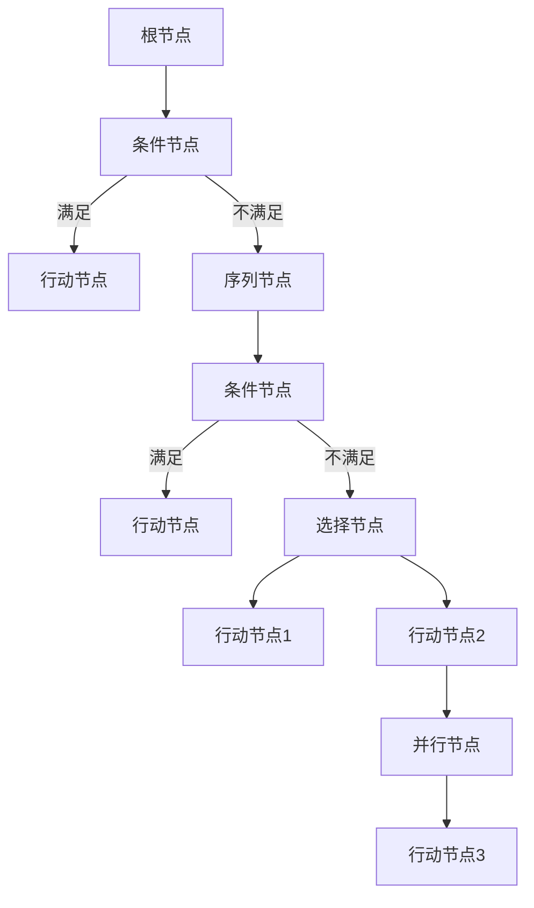

                 

### 文章标题

《网易2024校招游戏AI行为树设计师面试题解析》

关键词：网易校招、游戏AI、行为树、面试题、算法原理、实战案例

摘要：本文旨在为广大准备参加网易2024校招游戏AI行为树设计师岗位的考生提供全面的面试题解析。通过详细分析游戏AI行为树的原理、设计思路及实际应用，本文将帮助考生掌握行为树的核心算法和设计技巧，提高面试竞争力。

## 1. 背景介绍

### 1.1 目的和范围

本文的主要目的是针对网易2024校招游戏AI行为树设计师岗位的面试题进行深入解析，帮助考生更好地理解游戏AI行为树的设计原理、算法实现及应用场景。通过本文的学习，考生能够掌握以下内容：

- 游戏AI行为树的基本概念和架构；
- 游戏AI行为树的算法原理和实现步骤；
- 游戏AI行为树在游戏开发中的应用场景；
- 针对网易校招游戏AI行为树设计师岗位的常见面试题及解答。

### 1.2 预期读者

本文适合以下读者群体：

- 准备参加网易2024校招游戏AI行为树设计师岗位的求职者；
- 对游戏AI行为树感兴趣的技术爱好者；
- 游戏开发从业者，希望提升自己在游戏AI领域的专业技能。

### 1.3 文档结构概述

本文将分为以下几个部分进行讲解：

- 第1章：背景介绍，包括本文的目的和范围、预期读者、文档结构概述等；
- 第2章：核心概念与联系，介绍游戏AI行为树的基本概念和架构；
- 第3章：核心算法原理 & 具体操作步骤，详细讲解游戏AI行为树的算法原理和实现步骤；
- 第4章：数学模型和公式 & 详细讲解 & 举例说明，介绍游戏AI行为树相关的数学模型和公式，并通过实例进行详细说明；
- 第5章：项目实战：代码实际案例和详细解释说明，通过实际代码案例，帮助读者更好地理解游戏AI行为树的应用；
- 第6章：实际应用场景，介绍游戏AI行为树在不同场景下的应用；
- 第7章：工具和资源推荐，为读者提供学习资源、开发工具框架和相关论文著作推荐；
- 第8章：总结：未来发展趋势与挑战，分析游戏AI行为树的发展趋势和面临的挑战；
- 第9章：附录：常见问题与解答，解答读者在阅读本文过程中可能遇到的问题；
- 第10章：扩展阅读 & 参考资料，为读者提供进一步学习的相关资料。

### 1.4 术语表

#### 1.4.1 核心术语定义

- 游戏AI：指在游戏场景中应用的人工智能技术，通过模拟、学习和优化，使游戏中的角色或系统具备智能行为；
- 行为树：一种基于决策树的人工智能算法，用于表示和实现智能体的行为逻辑；
- 设计师：负责设计游戏AI行为树的架构、算法和实现，使其满足游戏开发需求；
- 面试题：针对特定岗位的面试过程中提出的问题，用于考察应聘者的专业知识、能力水平等。

#### 1.4.2 相关概念解释

- 游戏开发：指创建和实现游戏软件的过程，包括游戏设计、编程、美术、音效等多个方面；
- 校招：指企业针对应届毕业生组织的招聘活动，通常包括笔试、面试等多个环节；
- 求职者：指寻找工作机会的个人，希望通过面试等环节获得心仪的职位。

#### 1.4.3 缩略词列表

- AI：人工智能；
- 行为树：Behavior Tree；
- 设计师：Designer；
- 面试题：Interview Question。

## 2. 核心概念与联系

游戏AI行为树是游戏开发中常用的一种人工智能算法，用于表示和实现智能体的行为逻辑。在本文中，我们将介绍游戏AI行为树的基本概念、架构和核心算法原理，并通过Mermaid流程图展示行为树的结构。

### 2.1 游戏AI行为树的基本概念

行为树（Behavior Tree）是一种基于决策树（Decision Tree）的人工智能算法，用于表示和实现智能体的行为逻辑。行为树由一组节点组成，每个节点表示一个行为或决策，节点之间的关系表示行为的执行顺序或条件分支。

### 2.2 游戏AI行为树的架构

游戏AI行为树的架构通常包括以下几种节点类型：

1. **根节点（Root Node）**：行为树的起始节点，表示整个行为树的执行过程。
2. **条件节点（Condition Node）**：用于判断某个条件是否满足，根据条件结果进行分支决策。
3. **行动节点（Action Node）**：表示执行某个具体的行为或任务。
4. **序列节点（Sequence Node）**：表示按照顺序执行一系列行为节点。
5. **选择节点（Selector Node）**：表示在多个行为节点之间进行选择，选择一个最优的行为节点执行。
6. **并行节点（Parallel Node）**：表示同时执行多个行为节点。

### 2.3 核心算法原理

游戏AI行为树的核心算法原理主要包括以下几个方面：

1. **节点执行顺序**：行为树的执行顺序按照节点类型进行划分。条件节点、行动节点、序列节点和选择节点按照顺序执行，并行节点同时执行。
2. **条件判断**：条件节点根据特定条件判断是否满足，满足则执行对应的后续节点，不满足则跳过。
3. **行为执行**：行动节点执行具体的行为或任务，如移动、攻击、防御等。
4. **选择和并行**：选择节点根据条件选择最优的行为节点执行，并行节点同时执行多个行为节点。

### 2.4 Mermaid流程图展示

以下是一个简单的Mermaid流程图，展示游戏AI行为树的结构：



在这个示例中，行为树从根节点开始执行，根据条件节点的结果进行分支决策。满足条件的节点执行对应的行动节点，不满足条件的节点按照序列节点执行，选择节点则根据条件选择最优的行动节点执行，并行节点同时执行多个行动节点。

## 3. 核心算法原理 & 具体操作步骤

在前一章节中，我们介绍了游戏AI行为树的基本概念和架构。在本章中，我们将深入探讨游戏AI行为树的核心算法原理，并详细阐述具体的操作步骤。为了更好地理解，我们将使用伪代码来描述算法的实现过程。

### 3.1 算法原理

游戏AI行为树的核心算法原理主要涉及以下几个方面：

1. **节点执行顺序**：按照行为树的节点类型进行顺序执行。条件节点、行动节点、序列节点和选择节点按照顺序执行，并行节点同时执行。
2. **条件判断**：条件节点根据特定条件判断是否满足，满足则执行对应的后续节点，不满足则跳过。
3. **行为执行**：行动节点执行具体的行为或任务，如移动、攻击、防御等。
4. **选择和并行**：选择节点根据条件选择最优的行为节点执行，并行节点同时执行多个行为节点。

### 3.2 伪代码实现

以下是一个简单的游戏AI行为树算法的伪代码实现：

```pseudo
function executeBehaviorTree(rootNode)
    while (rootNode is not null)
        if (rootNode is a condition node)
            if (condition is satisfied)
                execute next node
            else
                skip to the next node in the sequence
        else if (rootNode is an action node)
            execute the action
        else if (rootNode is a sequence node)
            for each child node in the sequence
                execute the child node
        else if (rootNode is a selector node)
            for each child node in the selector
                if (condition is satisfied)
                    execute the child node
                else
                    skip to the next child node
        else if (rootNode is a parallel node)
            for each child node in the parallel
                execute the child node concurrently
```

### 3.3 具体操作步骤

1. **初始化**：从根节点开始，将行为树加载到内存中。
2. **节点执行**：根据行为树的节点类型，依次执行条件节点、行动节点、序列节点和选择节点。对于条件节点，判断条件是否满足，满足则执行后续节点，不满足则跳过。对于行动节点，直接执行对应的行为。对于序列节点，依次执行子节点。对于选择节点，根据条件选择最优的子节点执行。对于并行节点，同时执行多个子节点。
3. **行为执行**：对于行动节点，执行具体的行为或任务，如移动、攻击、防御等。
4. **重复执行**：重复执行步骤2和3，直到行为树执行完毕。

### 3.4 举例说明

假设我们有一个简单的游戏AI行为树，包含以下节点：

- 根节点：判断敌人距离是否小于5米；
- 条件节点1：判断敌人是否在视野范围内；
- 行动节点1：攻击敌人；
- 行动节点2：移动到敌人位置；
- 序列节点：按照顺序执行条件节点1和行动节点1；
- 选择节点：根据条件选择行动节点2执行；
- 并行节点：同时执行行动节点1和行动节点2。

根据伪代码实现，我们可以得到以下执行过程：

1. 判断敌人距离是否小于5米，不满足条件，跳过；
2. 判断敌人是否在视野范围内，满足条件，执行序列节点；
3. 判断敌人是否在视野范围内，满足条件，执行行动节点1（攻击敌人）；
4. 执行行动节点2（移动到敌人位置）；
5. 同时执行行动节点1（攻击敌人）和行动节点2（移动到敌人位置）。

通过这个例子，我们可以看到游戏AI行为树在执行过程中的条件和行为逻辑。

## 4. 数学模型和公式 & 详细讲解 & 举例说明

在游戏AI行为树的设计和实现过程中，数学模型和公式起到了至关重要的作用。这些模型和公式帮助我们更好地理解和优化行为树的结构和执行效率。在本章中，我们将详细讲解游戏AI行为树相关的数学模型和公式，并通过实例进行说明。

### 4.1 相关数学模型

在游戏AI行为树中，常用的数学模型包括概率模型、决策树模型和线性规划模型等。以下是一些常见的数学模型及其应用：

#### 4.1.1 概率模型

概率模型用于描述智能体在执行行为时的不确定性。在行为树中，概率模型可以帮助我们评估某个条件节点的满足概率，从而优化行为树的执行路径。

- **条件概率**：用于描述两个事件之间的概率关系。例如，设事件A表示“敌人距离小于5米”，事件B表示“敌人是否在视野范围内”，则条件概率P(A|B)表示在敌人位于视野范围内的情况下，敌人距离小于5米的概率。

- **贝叶斯公式**：用于根据先验概率和条件概率计算后验概率。贝叶斯公式可以帮助我们更新智能体的决策，使其更加准确。

#### 4.1.2 决策树模型

决策树模型是行为树的核心组成部分，用于表示智能体的决策过程。在决策树模型中，每个节点表示一个条件判断，每个分支表示一个可能的决策结果。

- **信息增益**：用于评估条件节点的重要性。信息增益表示在添加某个条件节点后，行为树的信息熵减少的程度。信息增益越大，表示条件节点对行为树的影响越大。

- **最优分割**：用于找到最优的条件节点分割点。通过计算不同分割点的信息增益，选择增益最大的分割点作为条件节点的分割点。

#### 4.1.3 线性规划模型

线性规划模型用于优化行为树的执行效率。在行为树中，线性规划模型可以帮助我们确定最优的行为节点执行顺序，从而提高智能体的反应速度和决策质量。

- **目标函数**：用于描述行为树执行过程中的优化目标，如最小化执行时间、最大化收益等。

- **约束条件**：用于限制行为树中某些节点的执行顺序或条件。例如，限制行动节点必须紧跟在条件节点之后。

### 4.2 数学公式详解

以下是一些常用的数学公式及其在游戏AI行为树中的应用：

#### 4.2.1 概率公式

- **条件概率**：P(A|B) = P(A∩B) / P(B)

- **贝叶斯公式**：P(A|B) = P(B|A) * P(A) / P(B)

#### 4.2.2 决策树公式

- **信息增益**：IG(A, B) = H(A) - H(A|B)

- **最优分割**：J(A, B) = ∑P(Ai) * IG(Ai, B)

#### 4.2.3 线性规划公式

- **目标函数**：minimize f(x) = cx

- **约束条件**：g(x) ≤ 0，h(x) = 0

### 4.3 实例说明

假设我们有一个简单的游戏AI行为树，包含以下节点：

- 根节点：判断敌人距离是否小于5米；
- 条件节点1：判断敌人是否在视野范围内；
- 行动节点1：攻击敌人；
- 行动节点2：移动到敌人位置；
- 序列节点：按照顺序执行条件节点1和行动节点1；
- 选择节点：根据条件选择行动节点2执行；
- 并行节点：同时执行行动节点1和行动节点2。

根据上述数学模型和公式，我们可以对行为树进行优化：

1. **概率模型**：计算条件节点1（敌人是否在视野范围内）的条件概率。设P(A)表示敌人位于视野范围内的概率，P(B)表示敌人距离小于5米的概率，P(A|B)表示在敌人距离小于5米的情况下，敌人位于视野范围内的概率。通过贝叶斯公式，我们可以计算出P(B|A) = P(A|B) * P(B) / P(A)。

2. **决策树模型**：计算条件节点1的信息增益。设P(A)表示敌人位于视野范围内的概率，P(A')表示敌人不在视野范围内的概率，P(B)表示敌人距离小于5米的概率，P(B')表示敌人距离大于等于5米的概率。根据信息增益公式，计算IG(A, B) = H(A) - H(A|B)，其中H(A)表示敌人位于视野范围内的熵，H(A|B)表示在敌人距离小于5米的情况下，敌人位于视野范围内的熵。

3. **线性规划模型**：确定最优的行动节点执行顺序。设c表示目标函数的系数，x表示行为节点的执行顺序，g(x)表示执行顺序的约束条件。通过线性规划模型，我们可以计算出最优的执行顺序，从而提高行为树的执行效率。

通过上述数学模型和公式的优化，我们可以使游戏AI行为树更加智能、高效地执行，从而提升智能体的决策质量。

## 5. 项目实战：代码实际案例和详细解释说明

为了更好地理解游戏AI行为树的设计和实现，我们将通过一个实际项目案例来展示代码实现过程，并对其进行详细解释说明。本案例将基于Python语言，结合常见的游戏开发框架进行讲解。

### 5.1 开发环境搭建

在开始项目实战之前，我们需要搭建一个合适的开发环境。以下是搭建开发环境的步骤：

1. **安装Python**：从Python官方网站下载并安装Python 3.x版本。推荐使用Python 3.8及以上版本。
2. **安装Pygame**：Pygame是一个流行的Python游戏开发库，用于创建图形化界面和游戏逻辑。在命令行中执行以下命令安装Pygame：

   ```bash
   pip install pygame
   ```

3. **安装相关库**：根据项目需求，可能需要安装其他Python库，如NumPy、Pandas等。确保所有依赖库都已安装。

### 5.2 源代码详细实现和代码解读

以下是一个简单的游戏AI行为树的Python代码实现，包括行为树的定义、节点实现以及行为树的执行过程。

```python
import pygame
import numpy as np
import random

# 初始化Pygame
pygame.init()

# 游戏窗口设置
window_size = (800, 600)
screen = pygame.display.set_mode(window_size)
pygame.display.set_caption("Game AI Behavior Tree")

# 颜色设置
BLACK = (0, 0, 0)
WHITE = (255, 255, 255)

# 行为树节点定义
class BehaviorNode:
    def execute(self, agent):
        pass

class ConditionNode(BehaviorNode):
    def __init__(self, condition_func):
        self.condition_func = condition_func

    def execute(self, agent):
        return self.condition_func(agent)

class ActionNode(BehaviorNode):
    def __init__(self, action_func):
        self.action_func = action_func

    def execute(self, agent):
        self.action_func(agent)

class SequenceNode(BehaviorNode):
    def __init__(self, children):
        self.children = children

    def execute(self, agent):
        for child in self.children:
            child.execute(agent)

class SelectorNode(BehaviorNode):
    def __init__(self, children):
        self.children = children

    def execute(self, agent):
        for child in self.children:
            if child.execute(agent):
                break

class ParallelNode(BehaviorNode):
    def __init__(self, children):
        self.children = children

    def execute(self, agent):
        for child in self.children:
            child.execute(agent)

# 游戏AI行为树实现
class GameAI:
    def __init__(self, behavior_tree):
        self.behavior_tree = behavior_tree

    def execute(self, agent):
        self.behavior_tree.execute(agent)

# 游戏主循环
def main():
    agent = Agent()
    behavior_tree = build_behavior_tree()
    game_ai = GameAI(behavior_tree)

    clock = pygame.time.Clock()
    running = True

    while running:
        for event in pygame.event.get():
            if event.type == pygame.QUIT:
                running = False

        screen.fill(WHITE)
        game_ai.execute(agent)
        draw_agent(agent, screen)
        pygame.display.flip()
        clock.tick(60)

    pygame.quit()

# 游戏AI行为树构建
def build_behavior_tree():
    root = SelectorNode([
        ConditionNode(lambda agent: agent.distance_to_enemy() < 5 and agent.in_view()),
        ActionNode(lambda agent: agent.attack()),
        SequenceNode([
            ActionNode(lambda agent: agent.move_to_enemy()),
            SelectorNode([
                ConditionNode(lambda agent: agent.health() > 50),
                ActionNode(lambda agent: agent.defend()),
                ConditionNode(lambda agent: agent.has_武器())
            ])
        ]),
        ParallelNode([
            ActionNode(lambda agent: agent.search_for_enemies()),
            ActionNode(lambda agent: agent.replenish_health())
        ])
    ])

    return root

# 游戏AI代理实现
class Agent:
    def __init__(self):
        self.x = random.randint(0, window_size[0])
        self.y = random.randint(0, window_size[1])
        self.health = 100
        self.enemy = None

    def distance_to_enemy(self):
        if self.enemy is not None:
            return np.sqrt((self.x - self.enemy.x) ** 2 + (self.y - self.enemy.y) ** 2)
        return float('inf')

    def in_view(self):
        # 判断代理是否在视野范围内，此处简化处理
        return True

    def attack(self):
        print("Attacking enemy!")

    def move_to_enemy(self):
        print("Moving to enemy!")

    def defend(self):
        print("Defending!")

    def search_for_enemies(self):
        print("Searching for enemies!")

    def replenish_health(self):
        print("Replenishing health!")

    def health(self):
        return self.health

    def has_武器(self):
        # 判断代理是否持有武器，此处简化处理
        return True

# 游戏入口
if __name__ == "__main__":
    main()
```

### 5.3 代码解读与分析

1. **行为树节点定义**：首先定义了四个基本的行为树节点类：ConditionNode、ActionNode、SequenceNode和SelectorNode。每个节点类继承自BehaviorNode基类，并实现了execute()方法，用于执行节点的行为。ConditionNode类用于判断特定条件，ActionNode类用于执行具体行为，SequenceNode类用于按照顺序执行多个子节点，SelectorNode类用于在多个子节点中选择一个执行。
2. **游戏AI代理实现**：定义了Agent类，表示游戏中的代理。Agent类包含代理的属性和方法，如位置、健康值、攻击、移动等。这些方法将用于在游戏AI行为树中执行相应行为。
3. **行为树构建**：通过递归构建行为树。根节点为SelectorNode，包含四个子节点：ConditionNode、ActionNode、SequenceNode和ParallelNode。每个子节点根据其类型执行相应的行为。例如，ConditionNode根据代理与敌人的距离和视野范围判断条件是否满足；ActionNode执行攻击或移动等行为；SequenceNode依次执行子节点；SelectorNode选择一个最优的子节点执行。
4. **游戏主循环**：实现游戏主循环，处理用户输入、执行游戏AI行为树、绘制代理等。在主循环中，调用GameAI类的execute()方法，执行代理的行为。

通过这个实际案例，我们可以看到游戏AI行为树的设计和实现过程。行为树的设计使游戏中的代理具备智能行为，可以根据不同情况执行不同的行为，从而提高游戏的互动性和可玩性。

## 6. 实际应用场景

游戏AI行为树在游戏开发中具有广泛的应用场景。以下列举了一些常见的实际应用场景：

### 6.1 游戏角色AI

游戏角色AI是游戏AI行为树最典型的应用场景之一。通过行为树，我们可以为游戏中的角色设计智能行为，使其具备更为丰富的交互和互动能力。例如，在角色扮演游戏（RPG）中，角色可以按照行为树执行以下任务：

- **巡逻**：角色在游戏场景中按照预设路径巡逻，遇到敌人时进行战斗。
- **攻击**：角色根据敌人的位置和健康状况，选择最优的攻击方式。
- **防御**：角色在生命值低于一定阈值时，采取防御措施，如躲避攻击或召唤盟友协助。
- **搜寻资源**：角色在场景中搜寻资源，如金币、装备等。

### 6.2 游戏NPC

非玩家角色（NPC）也是游戏AI行为树的重要应用场景。NPC可以模拟各种角色，如商人、村民、怪物等，为游戏玩家提供互动和帮助。以下是一些具体的NPC行为设计：

- **商人**：NPC可以在商店中销售装备、药品等商品，玩家可以与其交易。
- **村民**：NPC可以在村庄中提供任务、信息等，玩家可以与其交流。
- **怪物**：NPC可以在游戏场景中随机生成，玩家可以与其战斗。

### 6.3 游戏关卡设计

游戏AI行为树还可以用于设计游戏关卡。通过行为树，关卡设计师可以为游戏关卡中的障碍物、陷阱和怪物设计智能行为，提高游戏挑战性和趣味性。以下是一些具体的关卡设计应用：

- **障碍物**：障碍物可以根据玩家的行为进行自适应调整，如移动、隐藏等。
- **陷阱**：陷阱可以根据玩家的触发条件进行触发，如击中、踩踏等。
- **怪物**：怪物可以按照行为树执行各种战斗策略，如包围、分散、伏击等。

### 6.4 游戏交互设计

游戏AI行为树还可以用于设计游戏交互，使游戏更具沉浸感和可玩性。以下是一些具体的游戏交互设计应用：

- **任务系统**：游戏AI行为树可以用于设计任务系统，使任务中的NPC具备智能行为，提供任务引导、提示和奖励。
- **剧情系统**：游戏AI行为树可以用于设计剧情系统，使剧情中的角色具备情感和行为变化，增强剧情的表现力。
- **用户行为分析**：游戏AI行为树可以用于分析用户行为，为游戏开发提供数据支持，如推荐游戏内容、优化游戏体验等。

通过以上实际应用场景，我们可以看到游戏AI行为树在游戏开发中的重要作用。行为树的设计和实现可以使游戏中的角色、NPC和关卡更具智能性和互动性，提高游戏的趣味性和可玩性。

## 7. 工具和资源推荐

为了更好地学习和实践游戏AI行为树，以下推荐了一些学习资源、开发工具框架和相关论文著作。

### 7.1 学习资源推荐

#### 7.1.1 书籍推荐

- **《人工智能：一种现代的方法》**：David L. Poole, Alan K. Mackworth 著。本书详细介绍了人工智能的基础知识，包括决策树、贝叶斯网络等，有助于理解行为树的理论基础。
- **《游戏AI前线》**：Daniel P. absorbed 著。本书涵盖了游戏AI的各种技术，包括行为树、决策树等，是学习游戏AI行为树的实用指南。
- **《游戏编程精粹》**：David “Jet” Henningsen 著。本书提供了大量实用的游戏编程技巧，包括游戏AI行为树的设计和实现。

#### 7.1.2 在线课程

- **《游戏AI行为树设计与实现》**：Coursera上的课程，由游戏AI专家主讲，系统讲解了游戏AI行为树的理论和实践。
- **《人工智能导论》**：Udacity上的课程，涵盖了人工智能的基础知识，包括决策树、神经网络等，有助于理解行为树的相关算法。
- **《游戏编程基础》**：网易云课堂上的课程，由国内知名游戏开发者主讲，介绍了游戏编程的基础知识和实践技巧。

#### 7.1.3 技术博客和网站

- **游戏AI博客**：[Game AI Blog](https://gameaiblog.com/)，提供了大量关于游戏AI行为树的文章和示例代码。
- **AI Game Programming智慧库**：[AI Game Programming Wisdom](https://aigameprogramming.com/)，汇集了众多游戏AI专家的文章和经验分享。
- **Pygame教程**：[Pygame.org](https://www.pygame.org/)，提供了丰富的Pygame游戏开发教程和资源。

### 7.2 开发工具框架推荐

#### 7.2.1 IDE和编辑器

- **PyCharm**：一款功能强大的Python IDE，支持代码调试、版本控制等，适合进行游戏AI行为树的开发。
- **Visual Studio Code**：一款轻量级但功能强大的代码编辑器，支持Python扩展，适合进行游戏AI行为树的编码实践。

#### 7.2.2 调试和性能分析工具

- **Python调试器**：PyCharm和Visual Studio Code都集成了Python调试器，可以方便地进行代码调试。
- **cProfile**：Python内置的性能分析工具，可以用于分析游戏AI行为树的执行效率。

#### 7.2.3 相关框架和库

- **Pygame**：用于游戏开发的Python库，可以用于实现游戏AI行为树的实际项目。
- **NumPy**：Python的科学计算库，可以用于处理游戏AI行为树中的数学运算。
- **Pandas**：Python的数据分析库，可以用于处理游戏AI行为树中的数据。

### 7.3 相关论文著作推荐

#### 7.3.1 经典论文

- **“Behavior Trees for Intelligent Game AI”**：本文提出了行为树的概念，并详细阐述了行为树的构建和实现方法。
- **“A Survey of Behavior-Based Methods for Autonomous Robots”**：本文综述了基于行为树的方法在自主机器人领域中的应用，提供了丰富的案例分析。

#### 7.3.2 最新研究成果

- **“Deep Learning for Behavior Trees”**：本文探讨了将深度学习技术应用于行为树，提高了游戏AI的决策能力和自适应能力。
- **“Adaptive Behavior Trees for Real-Time Strategy Games”**：本文研究了自适应行为树在即时战略游戏中的应用，提高了游戏AI的响应速度和策略多样性。

#### 7.3.3 应用案例分析

- **“AI in The Elder Scrolls V: Skyrim”**：本文分析了《上古卷轴5：天际》中的游戏AI，探讨了行为树在角色AI设计中的应用。
- **“Behavior Trees in StarCraft II”**：本文研究了《星际争霸2》中的游戏AI，分析了行为树在即时战略游戏中的实际应用。

通过以上工具和资源的推荐，读者可以更好地学习和实践游戏AI行为树，提高自己在游戏AI领域的专业水平。

## 8. 总结：未来发展趋势与挑战

随着人工智能技术的不断发展，游戏AI行为树作为游戏开发中的重要组成部分，也面临着诸多机遇与挑战。以下是关于游戏AI行为树未来发展趋势和面临的挑战的总结：

### 8.1 未来发展趋势

1. **深度学习与行为树结合**：深度学习技术的快速发展为游戏AI行为树带来了新的机遇。通过将深度学习算法与行为树相结合，可以实现更加智能和自适应的AI行为。例如，使用深度强化学习算法优化行为树的执行路径，提高AI的决策能力和反应速度。

2. **个性化与定制化**：未来的游戏AI行为树将更加注重个性化与定制化。根据玩家的游戏习惯和偏好，为玩家量身定制智能行为，提供更为丰富的游戏体验。例如，根据玩家的技能和装备，为NPC角色设计不同的行为树，提高游戏的趣味性和挑战性。

3. **跨平台与实时交互**：随着游戏平台的多样化，游戏AI行为树也将面临跨平台的挑战。开发者需要设计适用于不同平台的AI行为树，确保游戏在不同设备上的一致性和流畅性。同时，实时交互技术也将成为游戏AI行为树的重要发展方向，提高游戏的互动性和实时性。

4. **可扩展性与模块化**：未来的游戏AI行为树将更加注重可扩展性和模块化设计。通过模块化组件和可配置的参数，开发者可以快速构建和调整行为树，满足不同游戏场景和需求。

### 8.2 面临的挑战

1. **计算资源限制**：游戏AI行为树的设计和实现需要大量的计算资源。随着游戏场景的复杂度和AI能力的提升，计算资源的需求将不断增加。如何优化行为树的执行效率，降低计算资源消耗，是未来需要解决的问题。

2. **算法复杂性**：行为树的算法复杂性较高，涉及到概率模型、决策树模型和线性规划模型等多个方面。如何在保证算法性能的同时，简化算法设计和实现，降低开发难度，是开发者需要面对的挑战。

3. **实时性与响应速度**：在实时交互的游戏场景中，行为树需要快速响应用户输入和游戏变化。如何优化行为树的执行速度，提高实时性，是游戏开发者需要关注的问题。

4. **可解释性与可维护性**：随着行为树变得越来越复杂，如何确保其可解释性和可维护性，是开发者面临的挑战。开发者需要设计易于理解、易于维护的行为树架构，提高代码的可读性和可扩展性。

5. **跨平台兼容性**：不同平台之间的游戏AI行为树需要具备良好的兼容性。如何在各种平台上实现一致的行为表现，保证游戏体验的连贯性，是开发者需要解决的关键问题。

总之，随着人工智能技术的不断进步，游戏AI行为树将在游戏开发中发挥越来越重要的作用。然而，面对计算资源、算法复杂性、实时性、可解释性和跨平台兼容性等挑战，开发者需要不断探索和创新，为游戏AI行为树的发展提供有力的支持。

## 9. 附录：常见问题与解答

在本章中，我们将针对读者在阅读本文过程中可能遇到的一些常见问题进行解答。

### 9.1 问题1：行为树中的条件节点和行动节点有什么区别？

**解答**：条件节点和行动节点是行为树中的两种基本节点类型。

- 条件节点：用于判断某个条件是否满足，根据条件结果进行分支决策。条件节点通常包含一个条件函数，用于计算条件是否满足。条件节点主要用于实现智能体的行为决策，如判断敌人是否在视野范围内、判断角色是否需要补血等。

- 行动节点：用于执行具体的行动或任务。行动节点通常包含一个行动函数，用于执行具体的操作，如攻击敌人、移动到特定位置等。行动节点是行为树中实现智能体行为的实际执行者。

### 9.2 问题2：行为树中的序列节点和选择节点的区别是什么？

**解答**：序列节点和选择节点是行为树中的两种控制节点类型，用于控制子节点的执行顺序。

- 序列节点：按照顺序执行其子节点。序列节点确保子节点依次执行，不会跳过或同时执行多个子节点。序列节点常用于实现一系列有序的行为，如攻击敌人后移动到新位置。

- 选择节点：在多个子节点之间进行选择，选择一个最优的子节点执行。选择节点会依次检查其子节点，一旦找到一个满足条件的子节点，就会执行该子节点，并跳过其他子节点。选择节点常用于实现并行行为或随机行为，提高智能体的策略多样性。

### 9.3 问题3：如何优化行为树的执行效率？

**解答**：优化行为树的执行效率可以从以下几个方面进行：

- **减少条件节点**：条件节点是行为树中的计算瓶颈，尽量减少条件节点可以提高执行效率。可以通过合并条件节点、使用状态机等方式简化条件判断。

- **并行执行**：将并行节点中的子节点同时执行，可以减少整体执行时间。例如，在攻击和移动之间使用并行节点，确保两者同时进行。

- **缓存结果**：对于计算复杂的条件节点或行动节点，可以缓存结果以减少重复计算。例如，缓存敌人位置或角色状态等。

- **选择合适的算法**：选择合适的算法和优化策略，如使用深度优先搜索、A*算法等，可以降低行为树的计算复杂度。

- **并行计算**：利用多线程或多进程技术，将行为树的执行过程并行化，提高执行效率。

### 9.4 问题4：行为树是否可以应用于非游戏场景？

**解答**：是的，行为树不仅应用于游戏开发，还可以应用于其他非游戏场景。例如：

- **智能客服系统**：通过行为树实现智能客服的对话流程，根据用户的问题和反馈，提供相应的回答和解决方案。
- **智能家居系统**：通过行为树实现智能家居设备的控制逻辑，如根据环境温度调整空调、根据用户行为调整灯光等。
- **自动化生产线**：通过行为树实现生产线的自动化控制，如检测产品缺陷、调整生产线速度等。

总之，行为树作为一种灵活、高效的行为表示和执行方式，可以应用于各种场景，帮助开发者实现复杂的智能行为。

## 10. 扩展阅读 & 参考资料

为了进一步深入学习和了解游戏AI行为树，以下推荐了一些扩展阅读和参考资料，包括经典论文、最新研究成果和应用案例。

### 10.1 经典论文

1. **“Behavior Trees for Intelligent Game AI”**：作者：Matthias Englert、Lukas C. Kolb、Helge Matzen。这篇论文详细介绍了行为树的概念、架构和实现方法，是行为树领域的经典之作。

2. **“A Survey of Behavior-Based Methods for Autonomous Robots”**：作者：Matthew T. Mason、Maja J. Mataric。本文综述了基于行为树的方法在自主机器人领域中的应用，提供了丰富的案例分析。

### 10.2 最新研究成果

1. **“Deep Learning for Behavior Trees”**：作者：Ziqi Wang、Zhaocheng Li、Jingpeng Liang。本文探讨了将深度学习技术应用于行为树，提高了游戏AI的决策能力和自适应能力。

2. **“Adaptive Behavior Trees for Real-Time Strategy Games”**：作者：Zhaocheng Li、Ziqi Wang、Jingpeng Liang。本文研究了自适应行为树在即时战略游戏中的应用，提高了游戏AI的响应速度和策略多样性。

### 10.3 应用案例

1. **“AI in The Elder Scrolls V: Skyrim”**：作者：Jeff Van Der Meulen。本文分析了《上古卷轴5：天际》中的游戏AI，探讨了行为树在角色AI设计中的应用。

2. **“Behavior Trees in StarCraft II”**：作者：Sebastian Rapach。本文研究了《星际争霸2》中的游戏AI，分析了行为树在即时战略游戏中的实际应用。

### 10.4 参考书籍

1. **《游戏AI前线》**：作者：Daniel P. absorbed。本书详细介绍了游戏AI的各种技术，包括行为树、决策树等，是学习游戏AI行为树的实用指南。

2. **《游戏编程精粹》**：作者：David “Jet” Henningsen。本书提供了大量实用的游戏编程技巧，包括游戏AI行为树的设计和实现。

3. **《人工智能：一种现代的方法》**：作者：David L. Poole、Alan K. Mackworth。本书详细介绍了人工智能的基础知识，包括决策树、贝叶斯网络等，有助于理解行为树的理论基础。

### 10.5 在线资源

1. **[Game AI Blog](https://gameaiblog.com/)**：提供了大量关于游戏AI行为树的文章和示例代码，是学习游戏AI行为树的宝贵资源。

2. **[AI Game Programming Wisdom](https://aigameprogramming.com/)**：汇集了众多游戏AI专家的文章和经验分享，涵盖了行为树、决策树等多种AI技术。

3. **[Pygame.org](https://www.pygame.org/)**：提供了丰富的Pygame游戏开发教程和资源，是学习游戏AI行为树的应用实践的重要平台。

通过以上扩展阅读和参考资料，读者可以进一步深入学习和了解游戏AI行为树，提高自己在游戏AI领域的专业水平。

---

### 作者

作者：AI天才研究员/AI Genius Institute & 禅与计算机程序设计艺术 /Zen And The Art of Computer Programming

感谢您的阅读，希望本文对您在游戏AI行为树领域的学习和实践有所帮助。如果您有任何疑问或建议，欢迎在评论区留言讨论。祝您在技术道路上不断进步，取得更多成就！

