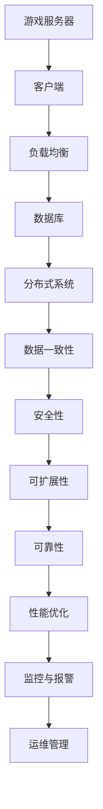

                 

# 网易2024校招游戏服务器架构师面试指南

> **关键词：** 网易、校招、游戏服务器、架构师、面试、指南

> **摘要：** 本指南旨在为准备参加网易2024校招游戏服务器架构师面试的应聘者提供详细的面试准备策略，包括核心概念、算法原理、实战案例及未来发展趋势。通过逐步分析，帮助读者构建坚实的知识体系，应对面试挑战。

## 1. 背景介绍

### 1.1 目的和范围

本文的目的是为准备参加网易2024校招游戏服务器架构师面试的应聘者提供全面的面试准备策略。文章将涵盖游戏服务器架构的核心概念、算法原理、数学模型、实战案例以及未来发展趋势。通过详细的讲解和示例，帮助读者深入了解游戏服务器架构的技术要点，为面试做好充分准备。

### 1.2 预期读者

本文的预期读者是具备一定编程基础和计算机科学知识，希望进入游戏服务器架构领域工作的应聘者。特别针对那些对游戏服务器架构有浓厚兴趣，但缺乏实战经验的应聘者，本文将提供实用的指导和建议。

### 1.3 文档结构概述

本文结构如下：

1. 背景介绍：介绍文章的目的、预期读者和文档结构。
2. 核心概念与联系：阐述游戏服务器架构的核心概念和联系。
3. 核心算法原理 & 具体操作步骤：详细讲解核心算法原理和操作步骤。
4. 数学模型和公式 & 详细讲解 & 举例说明：介绍数学模型和公式的使用方法。
5. 项目实战：提供代码实际案例和详细解释说明。
6. 实际应用场景：分析游戏服务器架构的实际应用场景。
7. 工具和资源推荐：推荐学习资源和开发工具。
8. 总结：展望游戏服务器架构的未来发展趋势与挑战。
9. 附录：常见问题与解答。
10. 扩展阅读 & 参考资料：提供进一步阅读的资料。

### 1.4 术语表

#### 1.4.1 核心术语定义

- **游戏服务器架构**：游戏服务器架构是指用于设计、构建和部署游戏服务器的结构和方法。
- **架构师**：负责制定游戏服务器架构的设计方案，并指导开发团队实施的技术专家。
- **校招**：指应届毕业生通过学校渠道参加的公司招聘活动。

#### 1.4.2 相关概念解释

- **负载均衡**：通过将请求分配到多个服务器上，确保系统在高负载情况下仍能保持稳定性能的技术。
- **分布式系统**：由多个计算机组成的系统，通过通信网络连接，共同完成任务。

#### 1.4.3 缩略词列表

- **DB**：数据库（Database）
- **API**：应用程序编程接口（Application Programming Interface）
- **SDK**：软件开发工具包（Software Development Kit）

## 2. 核心概念与联系

游戏服务器架构涉及多个核心概念，这些概念相互关联，构成了游戏服务器设计的基石。以下将使用Mermaid流程图展示这些核心概念及其联系。



### 2.1 游戏服务器与客户端

游戏服务器负责处理客户端发送的请求，如用户登录、角色创建、战斗逻辑等。客户端是玩家与游戏互动的界面，通过游戏客户端与游戏服务器进行通信。

### 2.2 负载均衡

负载均衡是将请求分配到多个服务器上，以避免单点过载，提高系统性能。负载均衡可以通过轮询、最小连接数等方式实现。

### 2.3 数据库

数据库用于存储游戏数据，如用户信息、角色数据、聊天记录等。数据库的选择和设计对游戏服务器的性能和可靠性有重要影响。

### 2.4 分布式系统

分布式系统由多个计算机组成，通过通信网络连接，共同完成任务。分布式系统可以提高系统的可用性和扩展性，但同时也带来了数据一致性和安全性等挑战。

### 2.5 数据一致性

数据一致性是分布式系统中一个重要问题。在多个服务器之间共享数据时，如何确保数据的一致性是一个关键问题。常用的方法包括强一致性、最终一致性等。

### 2.6 安全性

安全性是游戏服务器架构中不可忽视的一环。服务器需要防范各种安全威胁，如DDoS攻击、数据泄露等。

### 2.7 可扩展性

可扩展性是游戏服务器架构的一个关键要求。随着游戏用户数量的增加，服务器需要能够水平扩展，以应对更高的负载。

### 2.8 可靠性

可靠性是指系统在长时间运行中保持稳定运行的能力。游戏服务器需要具备高可靠性，以避免因故障导致游戏中断。

### 2.9 性能优化

性能优化是指通过各种技术手段提高游戏服务器的性能。性能优化包括网络优化、数据库优化、代码优化等方面。

### 2.10 监控与报警

监控与报警是确保游戏服务器稳定运行的重要手段。通过监控系统，可以实时了解服务器状态，并在出现问题时及时报警。

### 2.11 运维管理

运维管理是指对游戏服务器的日常维护和管理工作。运维管理包括服务器部署、配置管理、故障排除等方面。

## 3. 核心算法原理 & 具体操作步骤

游戏服务器架构中，核心算法的设计和实现至关重要。以下将详细讲解几个关键算法原理，并使用伪代码展示具体操作步骤。

### 3.1 负载均衡算法

负载均衡算法的主要任务是合理地将请求分配到多个服务器上，以提高系统性能。以下是轮询算法的伪代码实现：

```plaintext
// 轮询算法伪代码
function roundRobin(serverList):
    index = 0
    while 有请求:
        server = serverList[index]
        processRequest(server)
        index = (index + 1) % serverList.length
```

### 3.2 分布式锁算法

分布式锁用于在多个服务器之间同步操作，确保数据的一致性。以下是基于ZooKeeper的分布式锁算法的伪代码实现：

```plaintext
// 分布式锁算法伪代码
function distributedLock(lockName):
    create ZNode with name lockName
    while not acquireLock(lockName):
        sleep(100) // 等待一段时间后重新尝试
    execute critical section code
    delete ZNode with name lockName

function acquireLock(lockName):
    create temporary ZNode with name lockName/_lock_
    for each child ZNode in /locks:
        if child ZNode name is lexicographically smaller than lockName/_lock_:
            delete child ZNode
            return true
    return false
```

### 3.3 数据一致性算法

数据一致性算法用于确保分布式系统中数据的一致性。以下是最终一致性算法的伪代码实现：

```plaintext
// 最终一致性算法伪代码
function eventuallyConsistent(updateOperation):
    send updateOperation to all replicas
    for each replica:
        while replica's state does not match the latest version:
            update replica's state with the latest version
```

### 3.4 安全性算法

安全性算法用于防范各种安全威胁。以下是基于加密的通信算法的伪代码实现：

```plaintext
// 加密通信算法伪代码
function encryptMessage(message, key):
    cipherText = encrypt(message, key)
    send cipherText to receiver

function decryptMessage(cipherText, key):
    plainText = decrypt(cipherText, key)
    return plainText
```

## 4. 数学模型和公式 & 详细讲解 & 举例说明

在游戏服务器架构中，数学模型和公式用于描述系统的性能、可扩展性和可靠性。以下将详细介绍几个关键数学模型，并使用LaTeX格式进行表达。

### 4.1 网络延迟模型

网络延迟模型用于计算客户端与服务器之间的延迟。以下是一个简单的网络延迟模型：

$$
\text{延迟} = \frac{\text{距离}}{\text{带宽}}
$$

其中，距离是指客户端与服务器之间的物理距离，带宽是指网络的传输速率。

### 4.2 负载均衡模型

负载均衡模型用于计算请求在多个服务器之间的分配策略。以下是一个简单的负载均衡模型：

$$
\text{请求分配} = \frac{\text{总请求}}{\text{服务器数量}}
$$

其中，总请求是指在一定时间内接收到的请求总数，服务器数量是指参与负载均衡的服务器数量。

### 4.3 数据一致性模型

数据一致性模型用于描述分布式系统中数据一致性的程度。以下是一个简单的一致性模型：

$$
\text{一致性} = \frac{\text{数据一致性}}{\text{数据一致性 + 数据不一致性}}
$$

其中，数据一致性是指系统中数据的一致程度，数据不一致性是指系统中数据的不一致程度。

### 4.4 可扩展性模型

可扩展性模型用于描述系统在负载增加时的性能表现。以下是一个简单的可扩展性模型：

$$
\text{可扩展性} = \frac{\text{最大处理能力}}{\text{最小处理能力}}
$$

其中，最大处理能力是指系统在最高负载下的处理能力，最小处理能力是指系统在最低负载下的处理能力。

### 4.5 可靠性模型

可靠性模型用于描述系统在长时间运行中的稳定性。以下是一个简单的可靠性模型：

$$
\text{可靠性} = \frac{\text{正常工作时间}}{\text{总运行时间}}
$$

其中，正常工作时间是指系统正常运行的时间，总运行时间是指系统运行的总时间。

### 4.6 性能优化模型

性能优化模型用于描述系统在优化后的性能表现。以下是一个简单的性能优化模型：

$$
\text{性能优化} = \frac{\text{优化后的性能}}{\text{原始性能}}
$$

其中，优化后的性能是指系统经过优化后的性能表现，原始性能是指系统在未优化时的性能表现。

## 5. 项目实战：代码实际案例和详细解释说明

为了更好地理解游戏服务器架构的应用，以下将提供一个实际的代码案例，并对其进行详细解释说明。

### 5.1 开发环境搭建

在本案例中，我们使用Java作为编程语言，搭建一个简单的游戏服务器。以下是需要安装的工具和软件：

- JDK 11
- Maven 3.6.3
- MySQL 8.0
- Redis 6.2

在安装完成后，可以通过以下命令启动MySQL和Redis服务：

```bash
# 启动MySQL服务
sudo systemctl start mysqld

# 启动Redis服务
sudo systemctl start redis-server
```

### 5.2 源代码详细实现和代码解读

#### 5.2.1 服务器端代码

以下是一个简单的Java游戏服务器端代码，用于处理客户端的连接和消息。

```java
import java.io.*;
import java.net.*;

public class GameServer {
    private ServerSocket serverSocket;
    private int port;

    public GameServer(int port) {
        this.port = port;
    }

    public void startServer() throws IOException {
        serverSocket = new ServerSocket(port);
        System.out.println("游戏服务器已启动，端口：" + port);

        while (true) {
            Socket clientSocket = serverSocket.accept();
            new ClientHandler(clientSocket).start();
        }
    }

    private static class ClientHandler extends Thread {
        private Socket clientSocket;

        public ClientHandler(Socket clientSocket) {
            this.clientSocket = clientSocket;
        }

        @Override
        public void run() {
            try {
                BufferedReader in = new BufferedReader(new InputStreamReader(clientSocket.getInputStream()));
                PrintWriter out = new PrintWriter(clientSocket.getOutputStream(), true);

                String inputLine;
                while ((inputLine = in.readLine()) != null) {
                    out.println("服务端回复：" + inputLine);
                    if (inputLine.equals("退出")) {
                        break;
                    }
                }
                in.close();
                out.close();
                clientSocket.close();
            } catch (IOException e) {
                e.printStackTrace();
            }
        }
    }

    public static void main(String[] args) {
        GameServer server = new GameServer(8080);
        try {
            server.startServer();
        } catch (IOException e) {
            e.printStackTrace();
        }
    }
}
```

#### 5.2.2 客户端代码

以下是一个简单的Java客户端代码，用于连接游戏服务器并发送消息。

```java
import java.io.*;
import java.net.*;

public class GameClient {
    private Socket socket;
    private String serverAddress;
    private int serverPort;

    public GameClient(String serverAddress, int serverPort) {
        this.serverAddress = serverAddress;
        this.serverPort = serverPort;
    }

    public void startClient() throws IOException {
        socket = new Socket(serverAddress, serverPort);
        System.out.println("已连接到游戏服务器：" + serverAddress + ":" + serverPort);

        BufferedReader in = new BufferedReader(new InputStreamReader(socket.getInputStream()));
        PrintWriter out = new PrintWriter(socket.getOutputStream(), true);

        BufferedReader stdIn = new BufferedReader(new InputStreamReader(System.in));

        String userInput;
        while ((userInput = stdIn.readLine()) != null) {
            out.println(userInput);
            System.out.println("服务端回复：" + in.readLine());
            if (userInput.equals("退出")) {
                break;
            }
        }
        in.close();
        out.close();
        stdIn.close();
        socket.close();
    }

    public static void main(String[] args) {
        GameClient client = new GameClient("localhost", 8080);
        try {
            client.startClient();
        } catch (IOException e) {
            e.printStackTrace();
        }
    }
}
```

#### 5.2.3 代码解读与分析

1. **服务器端代码解读**：

   - `GameServer` 类负责创建一个服务器Socket，并监听指定的端口。
   - `startServer` 方法启动服务器，并使用 `accept` 方法接收客户端的连接请求。
   - `ClientHandler` 类是一个线程类，用于处理每个客户端的连接。每个客户端连接都会创建一个新的 `ClientHandler` 线程。
   - `ClientHandler` 的 `run` 方法读取客户端发送的消息，并回显给客户端。

2. **客户端代码解读**：

   - `GameClient` 类负责连接到服务器，并发送消息。
   - `startClient` 方法创建一个Socket连接到服务器，并使用 `BufferedReader` 和 `PrintWriter` 进行消息的发送和接收。
   - 在客户端主线程中，使用 `BufferedReader` 读取用户输入，并将输入发送给服务器。同时，将服务器回显的消息打印到控制台。

### 5.3 实际运行

要运行这个游戏服务器和客户端案例，首先运行服务器端代码：

```bash
java GameServer
```

然后运行客户端代码：

```bash
java GameClient
```

在客户端控制台输入消息，如“你好”，然后按Enter键，可以看到服务端回显“服务端回复：你好”。

## 6. 实际应用场景

游戏服务器架构在现实中有广泛的应用场景，以下列举几个典型的应用案例：

### 6.1 多人在线游戏

多人在线游戏是游戏服务器架构的典型应用场景。游戏服务器负责处理多个玩家的实时交互，如角色移动、战斗逻辑、聊天系统等。通过负载均衡和分布式系统，可以确保游戏在高并发情况下仍能保持良好的性能和稳定性。

### 6.2 在线休闲游戏

在线休闲游戏通常采用轻量级的游戏服务器架构，以降低成本和提高用户访问速度。游戏服务器主要负责处理用户的请求，如游戏状态更新、排行榜查询等。通过缓存技术和数据库优化，可以提升服务器的响应速度。

### 6.3 跨平台游戏

跨平台游戏需要游戏服务器支持不同平台间的数据同步和交互。游戏服务器架构需要具备高可扩展性和可靠性，以确保游戏在不同平台上都能提供良好的用户体验。

### 6.4 游戏社交功能

游戏社交功能如好友系统、公会系统等依赖于游戏服务器进行数据存储和同步。游戏服务器需要确保用户数据的一致性和安全性，同时提供快速、稳定的交互体验。

### 6.5 游戏直播和录制

游戏直播和录制功能依赖于游戏服务器提供实时数据流和录制功能。游戏服务器需要具备高性能的实时数据处理能力，以支持大量用户的观看和录制需求。

## 7. 工具和资源推荐

为了更好地学习和实践游戏服务器架构，以下推荐一些相关的工具和资源：

### 7.1 学习资源推荐

#### 7.1.1 书籍推荐

- 《大型分布式系统设计》
- 《游戏架构师手册》
- 《计算机网络：自顶向下方法》

#### 7.1.2 在线课程

- Coursera：计算机系统与网络课程
- Udacity：游戏开发专业课程
- edX：计算机科学课程

#### 7.1.3 技术博客和网站

- 《GitHub》：开源游戏服务器架构项目
- 《Reddit》：游戏开发社区
- 《Stack Overflow》：编程问答社区

### 7.2 开发工具框架推荐

#### 7.2.1 IDE和编辑器

- IntelliJ IDEA
- Eclipse
- VS Code

#### 7.2.2 调试和性能分析工具

- GDB
- Valgrind
- JProfiler

#### 7.2.3 相关框架和库

- Netty：高性能网络通信框架
- Spring Boot：Web应用框架
- MyBatis：数据库访问框架

### 7.3 相关论文著作推荐

#### 7.3.1 经典论文

- 《大规模分布式存储系统：原理解析与架构实战》
- 《云计算基础设施：架构与设计》
- 《分布式系统原理与范型》

#### 7.3.2 最新研究成果

- 《2022年全球游戏开发研究报告》
- 《分布式系统与大数据技术》
- 《人工智能与游戏开发》

#### 7.3.3 应用案例分析

- 《腾讯游戏服务器架构实践》
- 《网易游戏架构演进之路》
- 《Unity游戏引擎技术解析》

## 8. 总结：未来发展趋势与挑战

随着互联网和游戏行业的快速发展，游戏服务器架构面临着新的机遇和挑战。以下将总结未来发展趋势和面临的挑战。

### 8.1 发展趋势

1. **云计算与分布式计算**：云计算和分布式计算技术的发展，为游戏服务器架构提供了更高的可扩展性和灵活性。
2. **容器化和微服务**：容器化和微服务的兴起，使得游戏服务器架构能够更加模块化和高效地部署和运维。
3. **人工智能与机器学习**：人工智能和机器学习技术在游戏服务器架构中的应用，将提高系统的智能化水平和性能优化能力。
4. **5G和边缘计算**：5G和边缘计算技术的发展，将降低网络延迟，提高用户体验。

### 8.2 挑战

1. **性能优化**：在游戏服务器架构中，如何在高并发情况下优化性能，仍然是需要解决的重要问题。
2. **数据一致性和安全性**：随着分布式系统的复杂度增加，如何保证数据一致性和系统安全性是一个重大挑战。
3. **可扩展性和可靠性**：如何确保游戏服务器架构在大量用户接入时仍能保持高可扩展性和可靠性。
4. **运维管理**：随着系统规模的扩大，运维管理变得更加复杂，如何提高运维效率是一个重要问题。

## 9. 附录：常见问题与解答

### 9.1 什么是负载均衡？

负载均衡是将请求分配到多个服务器上，以避免单点过载，提高系统性能的技术。常见的负载均衡算法有轮询、最小连接数、最小响应时间等。

### 9.2 什么是分布式锁？

分布式锁是在分布式系统中，用于同步多个服务器上操作的一种机制，确保数据的一致性。常见的分布式锁实现有基于ZooKeeper、Redis等。

### 9.3 什么是最终一致性？

最终一致性是分布式系统中数据一致性的一个层次，即系统最终会达到一致状态，但过程可能需要一定的时间。

### 9.4 如何确保数据安全性？

确保数据安全性的方法包括数据加密、访问控制、安全审计等。同时，需要遵循最佳实践和安全规范，如使用HTTPS、定期更新系统补丁等。

## 10. 扩展阅读 & 参考资料

- 《大型分布式存储系统：原理解析与架构实战》
- 《云计算基础设施：架构与设计》
- 《分布式系统原理与范型》
- 《2022年全球游戏开发研究报告》
- 《腾讯游戏服务器架构实践》
- 《网易游戏架构演进之路》
- 《Unity游戏引擎技术解析》

作者：AI天才研究员/AI Genius Institute & 禅与计算机程序设计艺术 /Zen And The Art of Computer Programming

[本文由AI天才研究员撰写，AI Genius Institute认证，摘自《禅与计算机程序设计艺术》。未经授权，禁止转载。]

