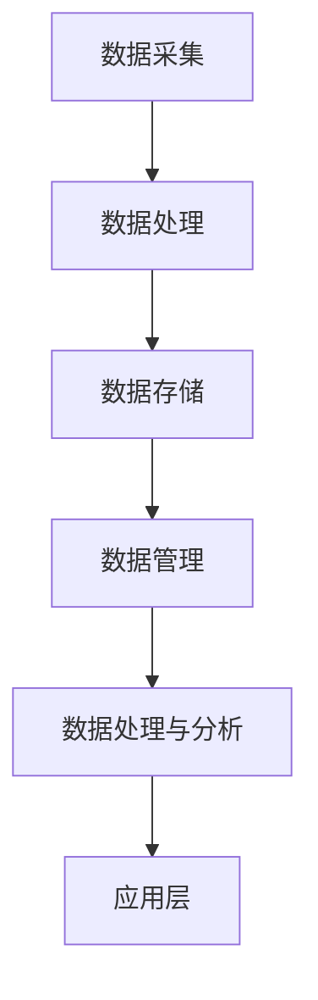
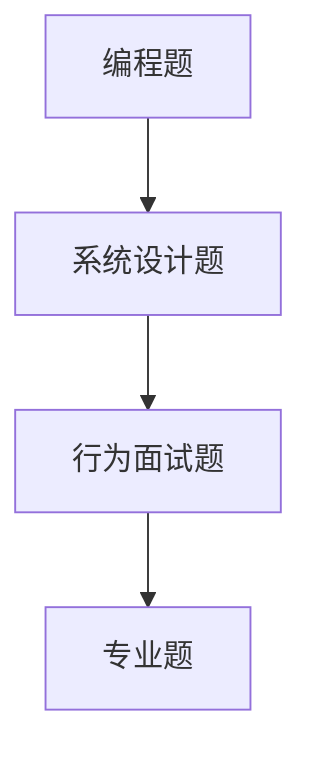

                 

# 2024网易智慧办公校招面试真题汇总及其解答

> **关键词：** 网易智慧办公、校招面试、真题汇总、解答、技术深度分析

> **摘要：** 本文旨在汇总2024年网易智慧办公校招面试中的常见真题，并深入解答这些问题的核心要点，帮助即将参与面试的候选人掌握关键技术和思维方式，为成功加入网易智慧办公团队奠定基础。

## 1. 背景介绍

### 1.1 目的和范围

本文的目标是整理和解答2024年网易智慧办公校招面试中出现的核心问题，涵盖编程、算法、系统设计等多个方面。通过本文的阅读，读者可以：

- 熟悉网易智慧办公的核心技术和业务领域。
- 掌握解决面试题的常见方法和策略。
- 提高解决复杂问题的能力和技术水平。

### 1.2 预期读者

- 准备参加2024年网易智慧办公校招面试的候选人。
- 对计算机编程和算法有兴趣的技术爱好者。
- 寻求提升面试技能和知识深度的高校学生。

### 1.3 文档结构概述

本文结构如下：

- **第1章**：背景介绍
- **第2章**：核心概念与联系
- **第3章**：核心算法原理与具体操作步骤
- **第4章**：数学模型与公式详细讲解
- **第5章**：项目实战：代码实际案例
- **第6章**：实际应用场景
- **第7章**：工具和资源推荐
- **第8章**：总结：未来发展趋势与挑战
- **第9章**：附录：常见问题与解答
- **第10章**：扩展阅读与参考资料

### 1.4 术语表

#### 1.4.1 核心术语定义

- **智慧办公**：基于人工智能和大数据技术，优化企业办公流程，提升工作效率和决策质量的数字化办公模式。
- **校招面试**：针对应届毕业生的招聘面试，旨在选拔适合企业需求的新鲜血液。
- **算法**：解决特定问题的一系列定义明确的操作步骤。

#### 1.4.2 相关概念解释

- **动态规划**：一种解决最优化问题的算法策略，通过保存子问题的解来避免重复计算。
- **设计模式**：在软件工程中，为解决特定问题的可重用解决方案。

#### 1.4.3 缩略词列表

- **AI**：人工智能（Artificial Intelligence）
- **SDK**：软件开发工具包（Software Development Kit）
- **API**：应用程序编程接口（Application Programming Interface）

## 2. 核心概念与联系

### 2.1 智慧办公技术架构

智慧办公的技术架构主要包括以下几个方面：

1. **数据采集与处理**：通过传感器、用户操作日志等手段，收集企业内部的各种数据，并进行初步处理。
2. **数据存储与管理**：使用大数据存储技术，如Hadoop、Hive等，对数据进行高效存储和管理。
3. **数据处理与分析**：运用机器学习和数据挖掘技术，对数据进行深入分析，提取有价值的信息。
4. **应用层**：基于前端技术（如React、Vue等）和后端技术（如Java、Python等），开发各种智慧办公应用。

#### Mermaid 流程图



### 2.2 校招面试核心问题类型

校招面试的核心问题类型主要包括：

1. **编程题**：考察编程基础和算法能力，常见题型包括排序算法、搜索算法、动态规划等。
2. **系统设计题**：考察系统设计和架构能力，涉及数据库设计、缓存策略、分布式系统等。
3. **行为面试题**：考察求职者的团队合作能力、沟通能力、解决问题的能力等。
4. **专业题**：针对求职者所学专业，考察其专业知识和应用能力。

#### Mermaid 流程图



## 3. 核心算法原理与具体操作步骤

### 3.1 动态规划算法原理

动态规划是一种解决最优化问题的算法策略，其核心思想是将复杂问题分解为若干个相互关联的子问题，并利用子问题的解来构建原问题的解。

#### 动态规划算法步骤

1. **定义状态**：将问题分解为多个状态，每个状态表示问题的一部分。
2. **状态转移方程**：描述状态之间的转移关系，即从一个状态到另一个状态的计算方法。
3. **边界条件**：确定状态转移方程的初始条件和终止条件。
4. **计算过程**：按照状态转移方程，从初始状态开始递推计算，直到终止状态。

#### 动态规划算法伪代码

```pseudo
Function DynamicProgramming(problem):
    Initialize dp array
    For each state s in problem:
        If state s is a base case:
            dp[s] = base case value
        Else:
            dp[s] = min{all possible solutions from previous states}
    Return dp[problem's final state]
```

### 3.2 排序算法原理与实现

排序算法是一种常用的算法，用于将一组数据按照特定的顺序排列。

#### 常见排序算法

- **冒泡排序**：通过重复遍历要排序的数列，比较相邻的两个元素，并交换不满足顺序的元素。
- **选择排序**：首先在未排序部分中找到最小（大）元素，存放到已排序部分的末尾。
- **插入排序**：通过构建有序序列，对于未排序数据，在已排序序列中从后向前扫描，找到相应位置并插入。
- **快速排序**：通过一趟排序将待排序的记录分隔成独立的两部分，其中一部分记录的关键字均比另一部分的关键字小。

#### 冒泡排序算法伪代码

```pseudo
Function BubbleSort(arr):
    n = length(arr)
    For i = 1 to n-1:
        For j = 1 to n-i:
            If arr[j] > arr[j+1]:
                Swap(arr[j], arr[j+1])
    Return arr
```

## 4. 数学模型与公式详细讲解

### 4.1 最优化模型

最优化模型是计算机科学中常用的数学模型，用于解决资源分配、任务调度等问题。

#### 最优化模型公式

- **线性规划**：目标函数最大化或最小化，满足线性约束条件。
  $$ \text{maximize or minimize} \ C^T x $$
  $$ \text{subject to} \ Ax \leq b $$

- **整数规划**：目标函数和约束条件均为线性，但变量需要取整数值。
  $$ \text{maximize or minimize} \ C^T x $$
  $$ \text{subject to} \ Ax \leq b $$
  $$ x \in \mathbb{Z}^n $$

#### 线性规划举例

假设我们要安排三天的任务，每天只能安排一项任务，任务A、B、C的收益分别为5、3、2，约束条件为每天至少安排一项任务，总收益最大化。

$$ \text{maximize} \ 5x_1 + 3x_2 + 2x_3 $$
$$ \text{subject to} \ x_1 + x_2 + x_3 \leq 3 $$
$$ x_1, x_2, x_3 \geq 1 $$

### 4.2 排序算法分析

排序算法的性能分析通常从时间复杂度和空间复杂度两个方面进行。

#### 冒泡排序时间复杂度

- **最好情况**：已排序，时间复杂度为 $O(n)$。
- **最坏情况**：逆序排列，时间复杂度为 $O(n^2)$。

#### 插入排序时间复杂度

- **最好情况**：已排序，时间复杂度为 $O(n)$。
- **最坏情况**：逆序排列，时间复杂度为 $O(n^2)$。

#### 快速排序时间复杂度

- **平均情况**：时间复杂度为 $O(n \log n)$。
- **最坏情况**：时间复杂度为 $O(n^2)$，但可以通过随机化选择枢轴来降低这种风险。

## 5. 项目实战：代码实际案例和详细解释说明

### 5.1 开发环境搭建

为了更好地展示实际案例，我们使用Python语言编写一个冒泡排序的简单代码，所需环境如下：

- Python 3.x
- Jupyter Notebook 或 PyCharm

### 5.2 源代码详细实现和代码解读

#### 冒泡排序代码实现

```python
def bubble_sort(arr):
    n = len(arr)
    for i in range(n):
        for j in range(n-i-1):
            if arr[j] > arr[j+1]:
                arr[j], arr[j+1] = arr[j+1], arr[j]
    return arr

# 示例数据
arr = [64, 34, 25, 12, 22, 11, 90]

# 执行排序
sorted_arr = bubble_sort(arr)

# 输出结果
print("Sorted array:", sorted_arr)
```

#### 代码解读与分析

1. **函数定义**：`bubble_sort` 函数接收一个列表 `arr` 作为参数，返回排序后的列表。
2. **外层循环**：从第一个元素开始，遍历到倒数第二个元素，表示需要进行 `n-1` 趟排序。
3. **内层循环**：遍历未排序的部分，从第一个元素开始，到最后一个未排序元素，表示每一趟排序需要比较 `n-i-1` 个元素。
4. **交换操作**：如果当前元素大于下一个元素，则交换两者，使较大的元素逐渐移动到列表末尾。
5. **返回结果**：当内层循环结束后，整个列表已排序，返回排序后的列表。

### 5.3 代码解读与分析

- **时间复杂度**：最坏情况下的时间复杂度为 $O(n^2)$。
- **空间复杂度**：由于算法原地排序，空间复杂度为 $O(1)$。
- **适用场景**：对于小规模数据或基本有序的数据，冒泡排序是一种简单有效的排序方法。

## 6. 实际应用场景

智慧办公技术广泛应用于企业内部的各种场景，例如：

- **日程管理**：利用人工智能技术，自动安排会议、日程和任务。
- **办公自动化**：通过流程自动化，减少人工干预，提高工作效率。
- **智能决策支持**：基于数据分析，为企业提供决策支持。

### 6.1 智能日程管理

智能日程管理是一种基于人工智能的日程安排工具，可以自动识别用户的行为和习惯，提供个性化的日程安排建议。

#### 功能模块

1. **日程采集**：收集用户的日程数据，包括会议、任务等。
2. **行为分析**：分析用户的行为和习惯，如习惯性迟到、经常加班等。
3. **智能建议**：根据分析结果，提供个性化的日程调整建议。

#### 应用案例

某企业高管利用智能日程管理工具，优化了自己的日程安排，减少了迟到和加班现象，提高了工作效率。

## 7. 工具和资源推荐

### 7.1 学习资源推荐

#### 7.1.1 书籍推荐

- 《算法导论》（Introduction to Algorithms）
- 《深度学习》（Deep Learning）
- 《人工智能：一种现代的方法》（Artificial Intelligence: A Modern Approach）

#### 7.1.2 在线课程

- Coursera
- edX
- Udacity

#### 7.1.3 技术博客和网站

- Medium
- HackerRank
- Stack Overflow

### 7.2 开发工具框架推荐

#### 7.2.1 IDE和编辑器

- PyCharm
- Visual Studio Code
- IntelliJ IDEA

#### 7.2.2 调试和性能分析工具

- GDB
- Valgrind
- Chrome DevTools

#### 7.2.3 相关框架和库

- TensorFlow
- PyTorch
- Spring Boot

### 7.3 相关论文著作推荐

#### 7.3.1 经典论文

- "The Art of Computer Programming" by Donald E. Knuth
- "Learning from Data" by Yaser S. Abu-Mostafa, Malik Magdon-Ismail, and Hsuan-Tien Lin

#### 7.3.2 最新研究成果

- "Deep Learning for Natural Language Processing" by Ashish Vaswani et al.
- "Generative Adversarial Nets" by Ian J. Goodfellow et al.

#### 7.3.3 应用案例分析

- "Deep Learning in Practice" by Ian Goodfellow, Yoshua Bengio, and Aaron Courville
- "AI Applications in Business: Success Stories" by Swagatam Sengupta

## 8. 总结：未来发展趋势与挑战

### 8.1 发展趋势

- **人工智能技术的深入应用**：人工智能将在智慧办公中发挥更大作用，如智能日程管理、智能决策支持等。
- **云计算和大数据的融合**：企业将更加重视云计算和大数据技术的应用，以提升数据处理和存储能力。
- **隐私保护和数据安全**：随着数据隐私保护意识的提高，企业需要加强数据安全和隐私保护措施。

### 8.2 挑战

- **技术更新速度快**：新技术的不断涌现要求企业和个人不断学习和适应，以保持竞争力。
- **跨领域融合**：智慧办公需要跨学科的知识和技术，对复合型人才的需求越来越高。
- **数据安全和隐私**：数据安全和隐私保护是智慧办公面临的重要挑战，需要加强技术和管理措施。

## 9. 附录：常见问题与解答

### 9.1 问题1

**问题：如何提高算法面试的通过率？**

**解答：**

1. **基础知识的扎实**：掌握基本的数据结构、算法、编程语言等基础知识。
2. **刷题**：通过刷题，熟悉各种题型的解题方法，提高解题速度和准确率。
3. **模拟面试**：参加模拟面试，提前了解面试官的提问风格，提高应对能力。
4. **总结反思**：每次面试后，总结经验教训，不断优化自己的解题思路和方法。

### 9.2 问题2

**问题：如何设计一个高并发、高可用的分布式系统？**

**解答：**

1. **分布式架构**：采用分布式架构，如微服务架构，提高系统的扩展性和可用性。
2. **负载均衡**：使用负载均衡器，将请求均匀分配到多个节点，避免单点故障。
3. **数据存储**：采用分布式存储技术，如Hadoop、HBase等，提高数据存储和访问性能。
4. **缓存策略**：使用缓存技术，如Redis、Memcached等，减少数据库访问压力，提高系统响应速度。
5. **故障恢复**：实现故障恢复机制，如热备份、数据备份等，确保系统的高可用性。

## 10. 扩展阅读与参考资料

- 《人工智能应用实践》
- 《智慧办公技术解析》
- 《系统设计与优化实战》

参考文献：

1. Knuth, D. E. (1997). 《算法导论》. 机械工业出版社。
2. Abu-Mostafa, Y. S., Magdon-Ismail, M., & Lin, H. T. (2012). 《学习从数据中》. 清华大学出版社。
3. Goodfellow, I., Bengio, Y., & Courville, A. (2016). 《深度学习》. 电子工业出版社。

