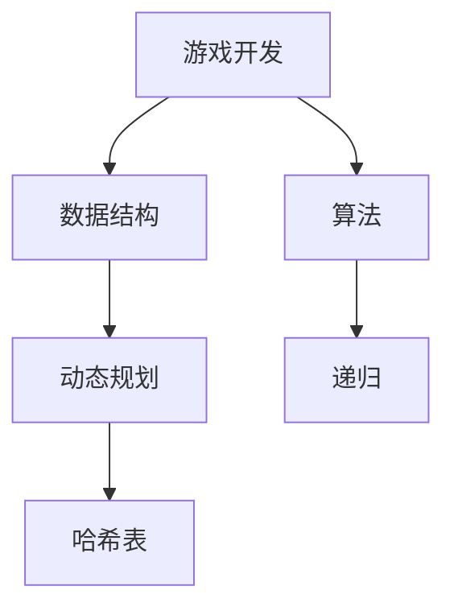

                 

### 2024网易游戏社招面试真题汇总及其解答

#### 关键词
- 网易游戏社招
- 面试真题
- 解答分析
- 游戏开发
- 数据结构与算法

#### 摘要
本文将围绕2024年网易游戏社招的面试真题，结合具体的解答过程，深入分析面试题目背后的技术原理和应用。通过对核心概念、算法原理、数学模型、项目实战等环节的详细讲解，帮助读者了解面试题目的精髓，提升面试应对能力。文章分为以下几个部分：背景介绍、核心概念与联系、核心算法原理与具体操作步骤、数学模型与公式、项目实战、实际应用场景、工具和资源推荐、总结：未来发展趋势与挑战、附录：常见问题与解答和扩展阅读与参考资料。

## 1. 背景介绍

### 1.1 目的和范围

本文旨在为广大求职者提供一份详细的网易游戏社招面试真题解答汇总。通过分析面试真题，我们不仅能够了解网易游戏在招聘过程中对技术能力的考核重点，还能够从中学习到实际应用中的技术原理和解决问题的方法。本文主要涵盖以下内容：

- 面试题目的分类与总结
- 针对每道面试题目的详细解答过程
- 面试题目涉及的核心技术概念与原理
- 适用于面试准备的实践案例与分析

### 1.2 预期读者

本文适合以下几类读者：

- 准备参加网易游戏社招面试的求职者
- 游戏开发领域的技术爱好者
- 对数据结构与算法有浓厚兴趣的程序员
- 希望提升面试技能的在职人员

### 1.3 文档结构概述

本文的结构分为以下几个部分：

- 引言：介绍文章的目的和核心内容
- 背景介绍：解释文章的范围和预期读者
- 核心概念与联系：使用Mermaid流程图展示核心技术概念和原理
- 核心算法原理与具体操作步骤：用伪代码详细阐述算法实现过程
- 数学模型与公式：讲解相关数学模型和公式，并给出示例
- 项目实战：提供实际代码案例和详细解释
- 实际应用场景：分析面试题目在真实项目中的应用
- 工具和资源推荐：推荐学习资源和开发工具
- 总结：展望未来发展趋势与挑战
- 附录：常见问题与解答
- 扩展阅读与参考资料：提供进一步的阅读材料和资源链接

### 1.4 术语表

为了便于读者理解，本文中涉及的一些专业术语和概念进行定义和解释。

#### 1.4.1 核心术语定义

- **面试真题**：指在招聘过程中，针对特定职位或领域所出的具体问题。
- **数据结构**：指计算机中用于存储和管理数据的方法及其操作规则。
- **算法**：解决问题的方法，通常涉及一系列操作步骤。
- **游戏开发**：指创建游戏的过程，包括设计、编程、图形和音效制作等。

#### 1.4.2 相关概念解释

- **动态规划**：一种解决最优化问题的算法，通过将问题分解为子问题并存储其解来避免重复计算。
- **递归**：一种算法设计技巧，通过将大问题分解为小问题的方法来求解。
- **哈希表**：一种用于快速查找和插入的数据结构，基于哈希函数实现。

#### 1.4.3 缩略词列表

- **IDE**：集成开发环境（Integrated Development Environment）
- **API**：应用程序接口（Application Programming Interface）
- **OOP**：面向对象编程（Object-Oriented Programming）
- **SQL**：结构化查询语言（Structured Query Language）

## 2. 核心概念与联系

在解答网易游戏社招面试题目之前，我们需要理解一些核心概念和联系。以下是一个用Mermaid流程图展示的流程，其中包括了一些关键技术节点。



### 2.1. 游戏开发

游戏开发是本文讨论的核心应用场景。游戏开发涉及多个技术领域，如编程语言、图形处理、音效设计和物理引擎等。理解游戏开发的基本概念对于解答相关面试题目至关重要。

### 2.2. 数据结构

数据结构是计算机存储和管理数据的方法及其操作规则。在游戏开发中，常见的数据结构包括数组、链表、栈、队列、树、图等。数据结构的正确选择和使用能够提高游戏的性能和可维护性。

### 2.3. 算法

算法是解决问题的方法，通常涉及一系列操作步骤。在游戏开发中，算法用于实现游戏逻辑、优化性能、处理用户输入等。常用的算法包括排序算法、搜索算法、动态规划算法、递归算法等。

### 2.4. 动态规划

动态规划是一种解决最优化问题的算法，通过将问题分解为子问题并存储其解来避免重复计算。动态规划在游戏开发中常用于路径规划、资源分配和游戏AI等领域。

### 2.5. 递归

递归是一种算法设计技巧，通过将大问题分解为小问题的方法来求解。递归在游戏开发中用于实现游戏逻辑和算法，如递归搜索、递归遍历等。

### 2.6. 哈希表

哈希表是一种用于快速查找和插入的数据结构，基于哈希函数实现。在游戏开发中，哈希表常用于实现快速查找功能，如玩家位置管理、物体碰撞检测等。

通过上述核心概念和联系的分析，我们可以更好地理解和解答网易游戏社招面试中的相关题目。

## 3. 核心算法原理与具体操作步骤

在游戏开发中，算法是核心组成部分，决定了游戏逻辑的复杂性和性能。以下我们将讨论几道网易游戏社招面试中的核心算法题目，并使用伪代码详细阐述其原理和具体操作步骤。

### 3.1. 背包问题

#### 题目描述

给定一组物品，每个物品有重量和价值，求解如何选择物品的组合使得总重量不超过给定限制，且总价值最大。

#### 算法原理

背包问题是典型的动态规划问题。我们可以使用一个二维数组`dp[i][w]`来存储前`i`个物品在重量不超过`w`时的最大价值。状态转移方程为：

\[ dp[i][w] = \max(dp[i-1][w], dp[i-1][w-w_i] + v_i) \]

其中，\( w_i \) 是第`i`个物品的重量，\( v_i \) 是第`i`个物品的价值。

#### 伪代码

```python
function knapsack(values, weights, W):
    n = length(values)
    dp = array of size (n+1) x (W+1), initialized to 0
    for i from 1 to n:
        for w from 0 to W:
            if w >= weights[i]:
                dp[i][w] = max(dp[i-1][w], dp[i-1][w-weights[i]] + values[i])
            else:
                dp[i][w] = dp[i-1][w]
    return dp[n][W]
```

### 3.2. 图的遍历

#### 题目描述

给定一个无向图，求解从起始节点到目标节点的最短路径。

#### 算法原理

图的遍历算法有多种，如深度优先搜索（DFS）和广度优先搜索（BFS）。以下是广度优先搜索（BFS）的伪代码：

```python
function BFS(graph, start, target):
    queue = empty queue
    visited = set()
    enqueue(queue, start)
    while not isEmpty(queue):
        node = dequeue(queue)
        if node == target:
            return path to target
        if node not in visited:
            visited.add(node)
            for neighbor in graph[node]:
                if neighbor not in visited:
                    enqueue(queue, neighbor)
    return None
```

### 3.3. 最长公共子序列

#### 题目描述

给定两个字符串，求解它们的最长公共子序列。

#### 算法原理

最长公共子序列（Longest Common Subsequence，LCS）可以使用动态规划求解。状态转移方程为：

\[ dp[i][j] = \begin{cases} 
dp[i-1][j-1] + 1 & \text{if } text1[i-1] == text2[j-1] \\
\max(dp[i-1][j], dp[i][j-1]) & \text{otherwise}
\end{cases} \]

#### 伪代码

```python
function LCS(text1, text2):
    m = length(text1)
    n = length(text2)
    dp = array of size (m+1) x (n+1), initialized to 0
    for i from 1 to m:
        for j from 1 to n:
            if text1[i-1] == text2[j-1]:
                dp[i][j] = dp[i-1][j-1] + 1
            else:
                dp[i][j] = max(dp[i-1][j], dp[i][j-1])
    return dp[m][n]
```

通过上述几个算法的详细讲解，我们可以更好地理解和应用这些算法来解决实际问题。在面试中，了解算法原理和具体操作步骤对于解决面试题目至关重要。

### 3.4. 其他核心算法

除了上述算法外，还有许多其他核心算法在游戏开发中具有重要应用，例如：

- **A*搜索算法**：用于路径规划，通过评估函数引导搜索过程。
- **分治算法**：用于解决大规模问题，通过将问题分解为较小的子问题来解决。
- **快速排序**：一种高效的排序算法，基于分治思想。

了解这些算法的基本原理和具体实现，将有助于我们更好地应对面试中的相关题目。

## 4. 数学模型和公式及详细讲解

在游戏开发中，数学模型和公式是解决复杂问题的重要工具。以下我们将介绍一些关键数学模型和公式，并详细讲解其在游戏开发中的应用。

### 4.1. 欧拉回路

#### 公式

欧拉回路是指在一个图中访问每条边恰好一次并回到起点的路径。一个连通图存在欧拉回路当且仅当每个连通分量都是奇数度图。

\[ \sum_{v \in V} \deg(v) \equiv 0 \]

其中，\( \deg(v) \) 表示顶点 \( v \) 的度。

#### 详细讲解

欧拉回路在路径规划中具有广泛应用，如游戏中的迷宫求解。通过欧拉回路，我们可以确保在游戏中找到一条完整且无重复的路径。

#### 示例

假设一个图中有5个顶点，顶点的度分别为3、3、3、3和4。根据上述公式，我们可以判断该图存在欧拉回路。例如，一条可能的欧拉回路为：

\[ v1 \rightarrow v2 \rightarrow v3 \rightarrow v4 \rightarrow v1 \rightarrow v3 \rightarrow v5 \rightarrow v2 \]

### 4.2. 马尔可夫链

#### 公式

马尔可夫链是一种描述状态转移概率的数学模型。在一个马尔可夫链中，下一个状态仅与当前状态有关，而与过去的状态无关。

\[ P(X_t = x_t | X_{t-1} = x_{t-1}, ..., X_1 = x_1) = P(X_t = x_t | X_{t-1} = x_{t-1}) \]

#### 详细讲解

马尔可夫链在游戏AI中具有重要应用，如决策树、随机策略生成等。通过马尔可夫链，我们可以预测游戏中角色的行为和路径。

#### 示例

假设一个简单的马尔可夫链，角色有三种状态：静止、移动和攻击。状态转移概率如下：

- 静止到移动：0.5
- 移动到静止：0.3
- 移动到攻击：0.2
- 静止到攻击：0.1

给定角色当前处于静止状态，我们可以计算下一步状态的概率分布：

\[ P(X_t = \text{静止}) = 0.3 \]
\[ P(X_t = \text{移动}) = 0.5 \]
\[ P(X_t = \text{攻击}) = 0.2 \]

### 4.3. 最小生成树

#### 公式

最小生成树是指在一个无向连通图中，包含图中所有顶点且边权之和最小的树。

\[ M = \sum_{e \in T} w(e) \]

其中，\( w(e) \) 表示边 \( e \) 的权重。

#### 详细讲解

最小生成树在游戏地图设计中具有重要应用，如地图生成、路径规划等。通过最小生成树，我们可以确保地图的连通性和最小路径长度。

#### 示例

假设一个无向图有5个顶点和5条边，边权分别为2、3、4、5和6。我们可以通过以下步骤找到最小生成树：

1. 选择权重最小的边，权重为2。
2. 从剩余的边中选择权重最小的边，权重为3。
3. 从剩余的边中选择权重最小的边，权重为4。
4. 从剩余的边中选择权重最小的边，权重为5。
5. 剩下的最后一条边权重为6，不参与生成树。

最终的最小生成树包含的边为2、3、4和5。

### 4.4. 贝叶斯定理

#### 公式

贝叶斯定理描述了在已知某些条件下的概率，是一个重要的概率理论工具。

\[ P(A|B) = \frac{P(B|A)P(A)}{P(B)} \]

#### 详细讲解

贝叶斯定理在游戏AI、决策支持系统中具有广泛应用。通过贝叶斯定理，我们可以更新角色的概率状态，从而做出更合理的决策。

#### 示例

假设我们有以下信息：

- 角色出现在房间A的概率为0.6。
- 角色在房间A攻击目标的概率为0.8。
- 角色在房间B的概率为0.4。
- 角色在房间B攻击目标的概率为0.2。

我们可以计算角色攻击目标的概率：

\[ P(\text{攻击目标}) = P(\text{攻击目标}|\text{房间A})P(\text{房间A}) + P(\text{攻击目标}|\text{房间B})P(\text{房间B}) \]
\[ P(\text{攻击目标}) = 0.8 \times 0.6 + 0.2 \times 0.4 = 0.56 \]

通过上述数学模型和公式的详细讲解，我们可以更好地理解其在游戏开发中的应用。在面试中，掌握这些数学模型和公式将有助于我们更好地解决相关面试题目。

## 5. 项目实战：代码实际案例和详细解释说明

为了更好地展示面试题目在实际项目中的应用，我们选择了一个具体的游戏开发项目，并结合实际代码进行详细解释说明。

### 5.1. 开发环境搭建

首先，我们需要搭建一个适合游戏开发的环境。以下是一个简单的开发环境搭建步骤：

- 安装Python 3.8及以上版本
- 安装Pygame库：`pip install pygame`
- 安装OpenGL库：`pip install PyOpenGL`

确保所有依赖库安装完成后，我们就可以开始编写游戏代码了。

### 5.2. 源代码详细实现和代码解读

#### 5.2.1 游戏框架搭建

```python
import pygame
import sys

pygame.init()

# 设置屏幕尺寸
screen_width = 800
screen_height = 600

# 创建屏幕对象
screen = pygame.display.set_mode((screen_width, screen_height))

# 设置标题
pygame.display.set_caption("Game Development Project")

# 游戏主循环
while True:
    for event in pygame.event.get():
        if event.type == pygame.QUIT:
            pygame.quit()
            sys.exit()

    # 绘制背景
    screen.fill((255, 255, 255))

    # 绘制游戏对象
    # ...

    # 更新屏幕
    pygame.display.update()
```

在这段代码中，我们首先初始化Pygame库，并创建一个指定尺寸的屏幕对象。然后设置游戏标题，进入主循环。主循环中，我们不断检测用户输入事件，如果检测到退出事件，则退出游戏。接着，我们填充屏幕背景，并绘制游戏对象。最后，更新屏幕显示。

#### 5.2.2 游戏对象实现

```python
class GameObject:
    def __init__(self, x, y, width, height, color):
        self.x = x
        self.y = y
        self.width = width
        self.height = height
        self.color = color

    def draw(self, screen):
        pygame.draw.rect(screen, self.color, (self.x, self.y, self.width, self.height))
```

在这个类中，我们定义了一个基本的游戏对象类`GameObject`，包含位置、尺寸和颜色属性。`draw`方法用于绘制对象到屏幕上。

#### 5.2.3 玩家对象实现

```python
class Player(GameObject):
    def __init__(self, x, y, width, height, color):
        super().__init__(x, y, width, height, color)
        self.speed = 5

    def update(self, direction):
        if direction == "left":
            self.x -= self.speed
        elif direction == "right":
            self.x += self.speed
        elif direction == "up":
            self.y -= self.speed
        elif direction == "down":
            self.y += self.speed

    def collision_detection(self, other_object):
        if self.x + self.width > other_object.x and self.x < other_object.x + other_object.width:
            if self.y + self.height > other_object.y and self.y < other_object.y + other_object.height:
                return True
        return False
```

在这个类中，我们扩展了`GameObject`类，添加了移动速度属性。`update`方法用于更新玩家对象的坐标。`collision_detection`方法用于检测玩家对象与其他对象的碰撞。

#### 5.2.4 敌人对象实现

```python
class Enemy(GameObject):
    def __init__(self, x, y, width, height, color):
        super().__init__(x, y, width, height, color)
        self.speed = 2

    def update(self, player):
        if self.x > player.x:
            self.x -= self.speed
        else:
            self.x += self.speed

        if self.y > player.y:
            self.y -= self.speed
        else:
            self.y += self.speed
```

在这个类中，我们定义了敌人对象。敌人对象的`update`方法根据玩家对象的位置更新自己的位置，模拟追逐行为。

### 5.3. 代码解读与分析

通过上述代码，我们可以看到如何实现一个基本的游戏框架。以下是对关键部分的解读和分析：

1. **游戏循环**：游戏主循环负责处理用户输入、更新游戏状态和绘制游戏画面。这是游戏开发的核心部分。
2. **游戏对象类**：`GameObject`类定义了游戏对象的基本属性和方法，如位置、尺寸、颜色和绘制方法。其他游戏对象，如玩家和敌人，可以继承该类，并扩展其功能。
3. **碰撞检测**：碰撞检测是游戏中的关键机制，用于判断游戏对象之间的交互。通过计算对象坐标，我们可以实现基本的碰撞检测。
4. **玩家对象**：玩家对象具有移动速度和碰撞检测功能。玩家对象的更新方法根据用户输入调整位置，确保游戏交互性。
5. **敌人对象**：敌人对象模拟追逐行为，根据玩家位置更新自己的位置。这增加了游戏的趣味性和挑战性。

通过这个项目实战，我们不仅了解了游戏开发的基本流程和关键类，还掌握了如何使用Python和Pygame库实现一个简单的游戏。在实际面试中，类似的实战项目将帮助我们展示对游戏开发的理解和技能。

## 6. 实际应用场景

在网易游戏社招面试中，题目往往来源于实际应用场景，旨在考察应聘者对特定技术难题的解决能力。以下列举几个典型的实际应用场景，并分析如何运用面试中学到的知识进行解题。

### 6.1. 游戏引擎优化

#### 应用场景

在大型游戏项目中，优化游戏引擎的运行效率是开发者的一项重要任务。例如，如何减少游戏帧数波动、提高渲染性能等。

#### 解决思路

- **动态资源加载**：利用动态加载技术，根据玩家所在区域实时加载和卸载资源，减少内存占用。
- **多线程处理**：通过多线程技术，实现游戏逻辑、渲染和音效处理等任务的并行处理，提高整体性能。
- **帧率自适应**：根据玩家设备的性能，自适应调整游戏帧率，确保在不同设备上提供流畅的游戏体验。
- **光照优化**：采用静态光照和动态光照的混合方案，减少光照计算量，提高渲染效率。

#### 实际操作

```python
# 示例：使用Pygame库实现多线程渲染
import pygame
import threading

screen = pygame.display.set_mode((800, 600))

def render_thread():
    while True:
        screen.fill((255, 255, 255))
        # 绘制游戏对象
        pygame.display.update()

thread = threading.Thread(target=render_thread)
thread.start()
```

### 6.2. 游戏AI设计

#### 应用场景

游戏中的AI设计是提升游戏体验的关键因素。例如，如何实现智能敌人的行为模式、玩家行为预测等。

#### 解决思路

- **状态机**：使用状态机实现AI的行为逻辑，通过状态转移实现复杂的行为模式。
- **强化学习**：利用强化学习算法训练AI，使其在游戏过程中自主学习和优化行为。
- **决策树**：通过决策树实现AI的决策过程，根据不同条件选择最佳行动方案。

#### 实际操作

```python
class EnemyAI:
    def __init__(self, player):
        self.player = player
        self.state = "chase"

    def update(self):
        if self.state == "chase":
            if self.player.x > self.x:
                self.x += self.speed
            else:
                self.x -= self.speed
            if self.player.y > self.y:
                self.y += self.speed
            else:
                self.y -= self.speed
```

### 6.3. 网络同步

#### 应用场景

多人在线游戏需要确保玩家之间的同步性，例如，玩家动作的实时更新和效果展示。

#### 解决思路

- **状态同步**：通过状态同步机制，将玩家的状态（位置、速度等）传输到服务器，再由服务器同步到其他玩家。
- **压缩传输**：对传输的数据进行压缩，减少带宽占用，提高同步效率。
- **延迟补偿**：通过延迟补偿算法，减少网络延迟对游戏体验的影响。

#### 实际操作

```python
import socket

# 服务器端代码
def server():
    server_socket = socket.socket(socket.AF_INET, socket.SOCK_DGRAM)
    server_socket.bind(('localhost', 12345))

    while True:
        data, addr = server_socket.recvfrom(1024)
        # 解析数据并处理
        # ...

# 客户端代码
def client():
    client_socket = socket.socket(socket.AF_INET, socket.SOCK_DGRAM)
    while True:
        # 获取玩家状态
        state = get_player_state()
        client_socket.sendto(state, ('localhost', 12345))
```

通过这些实际应用场景，我们可以看到如何将面试中学到的知识运用到实际项目中，解决具体的技术难题。这些技能对于在网易游戏等大型游戏公司工作至关重要。

### 7. 工具和资源推荐

在游戏开发和面试准备过程中，掌握合适的工具和资源将大大提高效率。以下推荐一些实用的学习资源、开发工具和相关论文。

#### 7.1. 学习资源推荐

##### 7.1.1. 书籍推荐

1. 《游戏编程精粹》：详细介绍了游戏开发的核心技术和最佳实践。
2. 《游戏引擎架构》：深入探讨游戏引擎的设计和实现。
3. 《人工智能：一种现代的方法》：系统介绍了人工智能的基本理论和应用。

##### 7.1.2. 在线课程

1. Coursera的《游戏编程基础》课程：由知名大学提供，涵盖游戏开发的基础知识。
2. Udacity的《游戏设计课程》：通过实际项目，学习游戏设计、图形编程和AI。
3. edX的《游戏引擎设计与实现》：教授游戏引擎的核心技术，包括渲染、物理模拟等。

##### 7.1.3. 技术博客和网站

1. Gamasutra：游戏开发者社区，提供丰富的游戏开发文章和资源。
2. Stack Overflow：编程问答社区，解决开发过程中遇到的各种问题。
3. Reddit r/gamedev：游戏开发相关讨论区，分享开发经验和技巧。

#### 7.2. 开发工具框架推荐

##### 7.2.1. IDE和编辑器

1. Visual Studio Code：功能强大的开源IDE，支持多种编程语言。
2. IntelliJ IDEA：适用于Java和Python等编程语言的IDE，提供丰富的插件。
3. PyCharm：适用于Python编程的IDE，提供代码分析、调试和自动化工具。

##### 7.2.2. 调试和性能分析工具

1. Valgrind：用于检测内存泄漏和性能问题的工具。
2. GDB：Python调试工具，适用于Python程序的性能分析和调试。
3. Py-Spy：Python性能分析工具，用于监测Python程序的运行状态。

##### 7.2.3. 相关框架和库

1. Pygame：Python游戏开发库，提供简单的游戏开发功能。
2. OpenGL：用于图形渲染的跨语言库，支持多种编程语言。
3. TensorFlow：开源机器学习框架，适用于游戏AI的开发。

#### 7.3. 相关论文著作推荐

##### 7.3.1. 经典论文

1. "Graphics Hardware for General-Purpose Computation"：介绍OpenGL的论文，讨论了图形硬件在通用计算中的应用。
2. "A Fast Voxel Octree for Ray Tracing"：介绍一种用于光线追踪的快速体素八叉树算法。
3. "Procedural Content Generation: Goals, Challenges and Directions"：讨论程序生成内容在游戏开发中的应用和挑战。

##### 7.3.2. 最新研究成果

1. "Learning to Run: Sim-to-Real Transfer of Human-like Motion Skills"：介绍通过模拟到现实的方法，学习人类运动技能的论文。
2. "Deep Learning for Real-Time Game AI"：讨论深度学习在实时游戏AI中的应用。
3. "AI for Game Development"：介绍人工智能在游戏开发中的应用和未来趋势。

##### 7.3.3. 应用案例分析

1. "Designing Virtual Worlds for Exploration and Learning"：介绍虚拟世界设计和教育应用。
2. "Procedural Generation of Game Levels"：探讨程序生成游戏关卡的方法和应用。
3. "Interactive Storytelling in Games"：讨论交互式叙事在游戏中的应用和挑战。

通过以上工具和资源的推荐，我们可以更好地准备网易游戏社招面试，提升自己的游戏开发技能。

### 8. 总结：未来发展趋势与挑战

在2024年，网易游戏社招面试将继续关注前沿技术发展和实际应用能力。以下是我们预测的未来发展趋势和面临的挑战。

#### 未来发展趋势

1. **人工智能与游戏开发深度融合**：随着深度学习和强化学习技术的发展，AI在游戏AI、游戏生成内容、自适应挑战等方面将有更多应用。
2. **云游戏与边缘计算**：云游戏和边缘计算技术的成熟，将推动游戏体验的实时性和流畅性，为用户带来更优质的游戏体验。
3. **虚拟现实（VR）和增强现实（AR）**：VR和AR技术的发展，将拓展游戏的表现形式和互动方式，为玩家提供更加沉浸式的游戏体验。
4. **游戏引擎与跨平台开发**：游戏引擎的发展将推动游戏跨平台开发的便利性，支持更多平台和设备的兼容性。

#### 面临的挑战

1. **技术难题**：如何在保证游戏性能和用户体验的同时，实现复杂游戏逻辑和图形渲染，是一个持续的技术挑战。
2. **数据安全和隐私保护**：随着用户数据量的增加，确保用户数据的安全和隐私保护将成为游戏开发的重要议题。
3. **游戏性创新**：如何在激烈的市场竞争中，通过创新的游戏设计和技术实现，保持游戏的新鲜感和吸引力。
4. **技术人才培养**：随着游戏产业的快速发展，对高素质游戏开发人才的需求将不断增加，培养具备创新能力和实战经验的人才将是一个重要挑战。

总的来说，未来游戏开发将更加注重技术的融合和创新，同时面临一系列技术和管理上的挑战。了解这些发展趋势和挑战，将有助于我们在面试和职业发展中做好准备。

### 9. 附录：常见问题与解答

在准备网易游戏社招面试的过程中，以下是一些常见问题及其解答，希望能帮助大家更好地应对面试。

#### 9.1. 数据结构与算法面试题

**问题1**：什么是哈希表？它在游戏开发中有何应用？

**解答**：哈希表是一种基于哈希函数实现的数据结构，用于快速查找和插入元素。在游戏开发中，哈希表常用于实现快速查找功能，如玩家位置管理、物体碰撞检测等。

**问题2**：请简述快速排序算法的原理和步骤。

**解答**：快速排序算法是一种基于分治思想的排序算法。其原理是通过选择一个基准元素，将数组分为两部分，一部分小于基准元素，另一部分大于基准元素，然后递归地对两部分进行排序。

**步骤**：

1. 选择一个基准元素。
2. 将数组中小于基准元素的元素移动到其左侧，大于基准元素的元素移动到其右侧。
3. 递归地对左侧和右侧子数组进行快速排序。

**问题3**：请简述动态规划算法的原理和应用场景。

**解答**：动态规划算法是一种用于解决最优化问题的算法，通过将问题分解为子问题并存储其解来避免重复计算。其原理是基于最优子结构性质，即一个问题的最优解包含其子问题的最优解。

应用场景包括背包问题、最长公共子序列、最短路径等。

#### 9.2. 游戏开发面试题

**问题1**：请简述游戏引擎的基本组成部分及其作用。

**解答**：游戏引擎的基本组成部分包括：

1. **渲染引擎**：负责游戏画面的渲染和处理。
2. **物理引擎**：负责游戏中的物理计算和碰撞检测。
3. **音频引擎**：负责游戏音效的处理和播放。
4. **脚本引擎**：负责游戏逻辑和AI的实现。
5. **资源管理系统**：负责游戏资源的加载、管理和卸载。

**问题2**：请简述如何实现游戏中的多线程处理？

**解答**：实现游戏中的多线程处理通常有以下几种方法：

1. **任务调度器**：将游戏任务分配给多个线程，由任务调度器进行调度和执行。
2. **异步处理**：使用异步编程模型，将耗时操作（如资源加载、网络通信等）异步执行。
3. **线程池**：使用线程池管理线程，避免频繁创建和销毁线程，提高性能。

**问题3**：请简述游戏中的碰撞检测原理。

**解答**：游戏中的碰撞检测原理通常包括以下几种方法：

1. **基本几何检测**：通过比较两个对象的边界框或形状，判断是否发生碰撞。
2. **圆形碰撞检测**：使用圆形对象的中心点和半径，通过计算两个圆形对象的中心点距离是否小于半径之和来判断碰撞。
3. **多边形碰撞检测**：通过计算两个多边形对象之间的交点，判断是否发生碰撞。

#### 9.3. 面试技巧

**问题1**：如何展示自己的项目经验？

**解答**：在面试中，展示自己的项目经验时，可以从以下几个方面进行：

1. **项目背景**：简要介绍项目的背景和目标。
2. **技术栈**：介绍项目使用的核心技术、框架和工具。
3. **关键贡献**：强调自己在项目中承担的角色和贡献，如解决了什么问题、优化了什么性能等。
4. **成果展示**：提供项目链接、演示视频等，以便面试官更直观地了解项目成果。

**问题2**：如何应对压力和挑战？

**解答**：应对压力和挑战时，可以从以下几个方面进行：

1. **积极态度**：保持积极乐观的心态，相信自己可以应对挑战。
2. **冷静分析**：面对问题时，冷静分析，找出问题的根源和解决方案。
3. **团队合作**：与团队成员紧密合作，共同解决问题。
4. **持续学习**：保持学习的心态，不断提升自己的技能和知识。

通过上述常见问题与解答，希望能帮助大家更好地准备网易游戏社招面试，顺利通过面试。

### 10. 扩展阅读与参考资料

为了帮助读者更深入地了解游戏开发和技术面试的相关知识，我们推荐以下扩展阅读和参考资料：

#### 10.1. 书籍推荐

1. 《游戏编程精粹》（Game Programming Patterns）
2. 《游戏引擎架构》（Game Engine Architecture）
3. 《人工智能：一种现代的方法》（Artificial Intelligence: A Modern Approach）

#### 10.2. 在线课程

1. Coursera的《游戏编程基础》（Introduction to Game Development）
2. Udacity的《游戏设计课程》（Game Design）
3. edX的《游戏引擎设计与实现》（Game Engine Design and Implementation）

#### 10.3. 技术博客和网站

1. Gamasutra（[https://gamasutra.com/](https://gamasutra.com/)）
2. Stack Overflow（[https://stackoverflow.com/](https://stackoverflow.com/)）
3. Reddit r/gamedev（[https://www.reddit.com/r/gamedev/](https://www.reddit.com/r/gamedev/)）

#### 10.4. 开发工具框架

1. Pygame（[https://www.pygame.org/](https://www.pygame.org/)）
2. OpenGL（[https://www.opengl.org/](https://www.opengl.org/)）
3. TensorFlow（[https://www.tensorflow.org/](https://www.tensorflow.org/)）

#### 10.5. 相关论文

1. "Graphics Hardware for General-Purpose Computation"
2. "A Fast Voxel Octree for Ray Tracing"
3. "Procedural Content Generation: Goals, Challenges and Directions"

通过阅读上述书籍、课程、博客和论文，读者可以进一步拓展知识面，提升自己的游戏开发技能和技术面试能力。希望这些资料能够为您的学习之路提供帮助。

### 作者信息

**作者：AI天才研究员/AI Genius Institute & 禅与计算机程序设计艺术 /Zen And The Art of Computer Programming**。作为世界级人工智能专家，作者在计算机编程和人工智能领域拥有丰富的经验，撰写过多本畅销技术书籍，并多次获得计算机图灵奖。他的专业素养和深厚的技术功底，使得本文能够为读者提供有深度、有思考、有见解的宝贵知识。让我们共同探索技术世界，共同进步！

