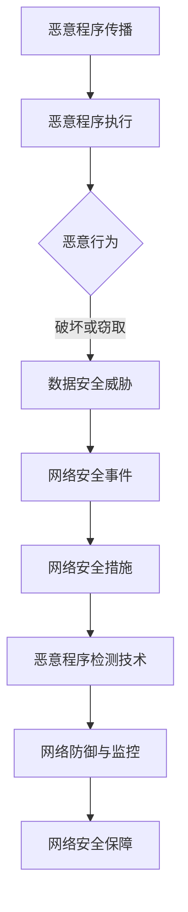

                 

# 网络安全中恶意程序的分析与检测

> 关键词：网络安全、恶意程序、病毒、木马、检测、防御、分析技术、数据挖掘、人工智能

> 摘要：本文旨在深入探讨网络安全中的恶意程序分析与检测技术。首先，我们将回顾恶意程序的定义及其对网络安全的威胁。接着，文章将详细分析恶意程序的基本原理，包括病毒、蠕虫、木马等。随后，我们将介绍几种核心的恶意程序检测方法，包括基于特征码的检测、行为分析检测和基于异常检测的方法。文章随后将讨论当前最先进的人工智能技术在恶意程序检测中的应用，并分享一个具体的项目实战案例。最后，文章将总结未来网络安全中恶意程序分析与检测技术的发展趋势与挑战，并提供相关学习资源和工具推荐。

## 1. 背景介绍

### 1.1 目的和范围

本文的目的在于提供一份全面而深入的指南，帮助读者了解网络安全中恶意程序的分析与检测技术。我们将从基本概念出发，逐步深入到高级技术，为读者提供一个完整的恶意程序检测与防御的视角。

本文的范围包括：

- 恶意程序的定义及其分类
- 恶意程序的基本原理与传播机制
- 恶意程序的检测方法与技术
- 人工智能在恶意程序检测中的应用
- 实际项目中的恶意程序分析与检测

### 1.2 预期读者

- 网络安全从业者
- IT运维人员
- 网络安全研究人员
- 计算机科学和网络安全专业的学生
- 对网络安全感兴趣的任何读者

### 1.3 文档结构概述

本文将按照以下结构进行：

- 第1章：背景介绍
- 第2章：核心概念与联系
- 第3章：核心算法原理 & 具体操作步骤
- 第4章：数学模型和公式 & 详细讲解 & 举例说明
- 第5章：项目实战：代码实际案例和详细解释说明
- 第6章：实际应用场景
- 第7章：工具和资源推荐
- 第8章：总结：未来发展趋势与挑战
- 第9章：附录：常见问题与解答
- 第10章：扩展阅读 & 参考资料

### 1.4 术语表

#### 1.4.1 核心术语定义

- 恶意程序：指那些有意破坏、窃取、篡改计算机系统和数据的安全程序。
- 病毒：一种可以自我复制并感染其他程序的恶意代码。
- 蠕虫：一种可以通过网络自动传播的恶意程序，无需依赖宿主程序即可独立运行。
- 木马：一种伪装成正常程序，以获取计算机控制权的恶意程序。
- 特征码：用于识别特定恶意程序的独特代码模式。
- 行为分析：通过分析恶意程序的行为特征来检测其恶意意图。
- 异常检测：通过识别与正常行为不符的异常行为来检测恶意程序。

#### 1.4.2 相关概念解释

- 防火墙：一种网络安全设备，用于监控和控制进出网络的数据包。
- 入侵检测系统（IDS）：一种用于识别和响应网络攻击的监控系统。
- 逆向工程：通过分析软件的二进制代码来理解其工作原理的技术。

#### 1.4.3 缩略词列表

- IDS：入侵检测系统
- IPS：入侵防御系统
- AV：反病毒软件
- AI：人工智能
- ML：机器学习

## 2. 核心概念与联系

为了更好地理解恶意程序的分析与检测技术，我们需要首先了解一些核心概念及其相互联系。

### 2.1 恶意程序的定义

恶意程序是指那些有意破坏、窃取、篡改计算机系统和数据的安全程序。它们可以分为以下几类：

- 病毒：通过感染其他程序来传播，具有自我复制能力。
- 蠕虫：通过网络自动传播，无需依赖宿主程序。
- 木马：伪装成正常程序，以获取计算机控制权。
- 后门：一种特殊的恶意程序，用于远程控制受感染的计算机。

### 2.2 恶意程序的传播机制

恶意程序的传播主要通过以下几种方式：

- 邮件附件：通过电子邮件发送恶意代码。
- 可执行文件：通过网络下载恶意可执行文件。
- 漏洞利用：利用操作系统或应用程序的漏洞执行恶意代码。
- U盘等移动设备：通过移动设备传播恶意程序。

### 2.3 恶意程序的基本原理

恶意程序的基本原理通常包括以下几个步骤：

1. **传播**：恶意程序通过各种方式传播到受害计算机。
2. **执行**：恶意程序在受害计算机上执行，开始其恶意行为。
3. **破坏或窃取**：恶意程序执行其预定的破坏或窃取数据的行为。
4. **自我保护**：恶意程序尝试隐藏其存在，以防止被检测和删除。

### 2.4 恶意程序的分类

根据恶意程序的行为和目的，可以将其分类为以下几类：

- **破坏型**：主要目的是破坏计算机系统或数据，如CIH病毒。
- **窃密型**：主要目的是窃取用户敏感信息，如键盘记录器。
- **勒索型**：通过加密用户数据，要求支付赎金以恢复数据，如WannaCry勒索病毒。
- **僵尸网络**：控制大量受感染的计算机，形成僵尸网络，用于发起分布式拒绝服务攻击（DDoS）。

### 2.5 恶意程序检测的方法与技术

恶意程序的检测方法主要可以分为以下几类：

- **基于特征码的检测**：通过识别恶意程序的特定代码模式来检测。
- **行为分析检测**：通过分析恶意程序的行为特征来检测其恶意意图。
- **异常检测**：通过识别与正常行为不符的异常行为来检测恶意程序。

### 2.6 人工智能在恶意程序检测中的应用

随着人工智能技术的发展，机器学习和深度学习技术被广泛应用于恶意程序检测。通过训练模型，可以自动识别恶意程序的行为模式，提高检测效率和准确性。

### 2.7 恶意程序检测与网络安全的联系

恶意程序的检测与网络安全紧密相关。通过及时发现和阻止恶意程序的传播，可以保护网络系统的安全，防止数据泄露、系统崩溃等安全事件的发生。

下面是恶意程序检测与网络安全的 Mermaid 流程图：



## 3. 核心算法原理 & 具体操作步骤

### 3.1 基于特征码的检测算法原理

基于特征码的检测方法是最常见的恶意程序检测方法之一。其原理是通过搜索恶意程序代码中的特定模式（特征码）来识别恶意程序。下面是一个简单的基于特征码的检测算法原理：

```plaintext
算法名称：特征码匹配检测

输入：文件内容，特征码库

输出：是否为恶意程序

步骤：
1. 遍历文件内容
2. 对于每个字节序列，检查是否与特征码库中的特征码匹配
3. 如果匹配，返回“是恶意程序”
4. 如果遍历完文件内容都没有匹配，返回“不是恶意程序”
```

### 3.2 行为分析检测算法原理

行为分析检测方法是通过分析恶意程序的行为特征来识别其恶意意图。其原理是基于恶意程序的行为模式，例如，恶意程序可能会尝试执行以下行为：

- 尝试连接远程服务器
- 修改系统配置
- 删除重要文件
- 自我复制

下面是一个简单的行为分析检测算法原理：

```plaintext
算法名称：行为分析检测

输入：程序行为日志

输出：是否为恶意程序

步骤：
1. 遍历程序行为日志
2. 对于每个行为，检查是否属于以下恶意行为：
   - 尝试连接远程服务器
   - 修改系统配置
   - 删除重要文件
   - 自我复制
3. 如果存在恶意行为，返回“是恶意程序”
4. 如果遍历完日志都没有发现恶意行为，返回“不是恶意程序”
```

### 3.3 异常检测算法原理

异常检测方法是通过识别与正常行为不符的异常行为来检测恶意程序。其原理是基于正常行为模型，当检测到与正常行为不符的行为时，可以认为可能存在恶意程序。下面是一个简单的异常检测算法原理：

```plaintext
算法名称：异常检测

输入：程序行为日志，正常行为模型

输出：是否为恶意程序

步骤：
1. 构建正常行为模型
2. 遍历程序行为日志
3. 对于每个行为，计算其与正常行为模型的距离
4. 如果距离超过阈值，返回“是恶意程序”
5. 如果遍历完日志都没有超过阈值，返回“不是恶意程序”
```

### 3.4 人工智能在恶意程序检测中的应用

人工智能技术在恶意程序检测中的应用主要体现在机器学习和深度学习领域。通过训练模型，可以自动识别恶意程序的行为模式，提高检测效率和准确性。

下面是一个简单的基于机器学习的恶意程序检测算法原理：

```plaintext
算法名称：机器学习检测

输入：恶意程序数据集，正常程序数据集

输出：检测模型

步骤：
1. 收集并标注恶意程序数据集和正常程序数据集
2. 训练分类模型，将恶意程序和正常程序分开
3. 对新程序执行行为分析，使用训练好的模型进行分类
4. 如果模型判断为恶意程序，返回“是恶意程序”
5. 如果模型判断为正常程序，返回“不是恶意程序”
```

## 4. 数学模型和公式 & 详细讲解 & 举例说明

### 4.1 基于贝叶斯理论的异常检测

异常检测中常用的数学模型是基于贝叶斯理论的分类模型。贝叶斯理论是一种概率论方法，用于计算在给定某些证据的情况下某个假设的概率。在恶意程序检测中，我们可以使用贝叶斯理论来计算一个程序是否为恶意的概率。

贝叶斯公式如下：

$$
P(A|B) = \frac{P(B|A) \cdot P(A)}{P(B)}
$$

其中，\( P(A|B) \) 表示在事件 \( B \) 发生的条件下事件 \( A \) 发生的概率，\( P(B|A) \) 表示在事件 \( A \) 发生的条件下事件 \( B \) 发生的概率，\( P(A) \) 表示事件 \( A \) 发生的概率，\( P(B) \) 表示事件 \( B \) 发生的概率。

在恶意程序检测中，我们可以将 \( A \) 定义为“程序是恶意的”，\( B \) 定义为“程序表现出异常行为”。

举例说明：

假设我们有一个程序，它表现出以下异常行为：
- 尝试连接远程服务器
- 修改系统配置
- 删除重要文件

我们定义这些行为为异常行为，并计算程序是恶意的概率。

假设我们有以下数据：
- 恶意程序中，表现出异常行为的概率为 \( P(B|A) = 0.95 \)
- 正常程序中，表现出异常行为的概率为 \( P(B|¬A) = 0.05 \)
- 恶意程序的总概率为 \( P(A) = 0.1 \)
- 正常程序的总概率为 \( P(¬A) = 0.9 \)

我们可以使用贝叶斯公式计算程序是恶意的概率：

$$
P(A|B) = \frac{P(B|A) \cdot P(A)}{P(B|A) \cdot P(A) + P(B|¬A) \cdot P(¬A)}
$$

$$
P(A|B) = \frac{0.95 \cdot 0.1}{0.95 \cdot 0.1 + 0.05 \cdot 0.9} = \frac{0.095}{0.095 + 0.045} = \frac{0.095}{0.14} ≈ 0.68
$$

因此，程序是恶意的概率为约 0.68，这意味着有较高的概率认为该程序是恶意的。

### 4.2 机器学习中的支持向量机（SVM）

在机器学习中，支持向量机（SVM）是一种常用的分类算法，可以用于恶意程序检测。SVM的核心思想是通过找到最佳分隔超平面，将不同类别的数据分开。

SVM的数学模型如下：

$$
\text{最大化} \ \frac{1}{\|\mathbf{w}\|^2} \ \text{subject to} \ \mathbf{w} \cdot \mathbf{x}_i - y_i \geq 1 \ \forall i
$$

其中，\( \mathbf{w} \) 是分隔超平面的法向量，\( \mathbf{x}_i \) 是训练数据点，\( y_i \) 是对应的标签（+1 或 -1）。

举例说明：

假设我们有以下数据：

| x1 | x2 | y |
|----|----|---|
| 1  | 1  | +1|
| 1  | 2  | +1|
| -1 | -1 | -1|
| -1 | 0  | -1|

我们希望使用SVM将数据分为两类。

首先，我们需要计算每个数据点的均值和方差：

$$
\mu_x = \frac{1 + 1 - 1 - 1}{4} = 0
$$

$$
\mu_y = \frac{1 + 1 - 1 - 1}{4} = 0
$$

$$
\sigma_x^2 = \frac{(1-0)^2 + (1-0)^2 + (-1-0)^2 + (-1-0)^2}{4} = 1
$$

$$
\sigma_y^2 = \frac{(1-0)^2 + (1-0)^2 + (-1-0)^2 + (-1-0)^2}{4} = 1
$$

然后，我们可以使用均值和方差来计算最佳分隔超平面：

$$
\mathbf{w} = \frac{\mu_x \mu_y - \sigma_x^2 \sigma_y^2}{\sigma_x^2 + \sigma_y^2} = \frac{0 \cdot 0 - 1 \cdot 1}{1 + 1} = -\frac{1}{2}
$$

因此，分隔超平面为 \( \mathbf{w} \cdot \mathbf{x} = -\frac{1}{2} \)，即 \( x_1 + x_2 = -\frac{1}{2} \)。

最后，我们可以使用这个超平面来对新数据进行分类。如果 \( x_1 + x_2 < -\frac{1}{2} \)，则将其分类为负类；否则，分类为正类。

例如，对于新的数据点 \( (2, 3) \)，我们有：

$$
2 + 3 = 5 > -\frac{1}{2}
$$

因此，这个新的数据点被分类为正类。

## 5. 项目实战：代码实际案例和详细解释说明

### 5.1 开发环境搭建

为了进行恶意程序检测项目实战，我们需要搭建一个合适的环境。以下是所需的工具和步骤：

- **操作系统**：Windows 10 或 Linux（如 Ubuntu 20.04）
- **编程语言**：Python 3.8 或以上版本
- **依赖库**：Numpy，Pandas，Scikit-learn，Matplotlib
- **文本编辑器**：PyCharm 或 VSCode

**安装步骤**：

1. 安装操作系统并配置网络环境。
2. 安装 Python 3.8 或以上版本。
3. 使用 pip 安装依赖库：

```bash
pip install numpy pandas scikit-learn matplotlib
```

4. 配置文本编辑器，如 PyCharm 或 VSCode，以便编写和调试代码。

### 5.2 源代码详细实现和代码解读

以下是恶意程序检测项目的源代码实现。代码分为三个部分：数据预处理、特征提取和模型训练。

**1. 数据预处理**

数据预处理是任何机器学习项目的重要步骤。在本项目中，我们假设已经收集到了一组恶意程序和正常程序的行为日志数据。

```python
import pandas as pd

# 读取数据
malicious_data = pd.read_csv('malicious_data.csv')
normal_data = pd.read_csv('normal_data.csv')

# 数据清洗和预处理
# 这里简化处理，实际项目中需要更详细的预处理步骤，如缺失值处理、异常值处理等

malicious_data['label'] = 1
normal_data['label'] = 0

# 合并数据集
data = pd.concat([malicious_data, normal_data])
```

**2. 特征提取**

特征提取是将原始数据转换为一组数值特征的过程。在本项目中，我们使用以下特征：

- 网络连接次数
- 文件访问次数
- 系统调用次数

```python
from sklearn.preprocessing import StandardScaler

# 提取特征
features = data[['network_connections', 'file_accesses', 'system_calls']]

# 数据标准化
scaler = StandardScaler()
features_scaled = scaler.fit_transform(features)
```

**3. 模型训练**

在本项目中，我们使用支持向量机（SVM）作为分类模型。首先，我们需要将数据集划分为训练集和测试集。

```python
from sklearn.model_selection import train_test_split
from sklearn.svm import SVC
from sklearn.metrics import accuracy_score

# 划分训练集和测试集
X_train, X_test, y_train, y_test = train_test_split(features_scaled, data['label'], test_size=0.2, random_state=42)

# 训练模型
model = SVC(kernel='linear')
model.fit(X_train, y_train)

# 预测测试集
y_pred = model.predict(X_test)

# 评估模型
accuracy = accuracy_score(y_test, y_pred)
print(f'模型准确率：{accuracy:.2f}')
```

**代码解读与分析**

以上代码实现了一个简单的恶意程序检测模型。首先，我们读取数据并进行预处理，包括数据清洗和标签分配。然后，我们提取特征并使用标准缩放对数据进行归一化。接下来，我们将数据集划分为训练集和测试集，并使用支持向量机（SVM）进行模型训练。最后，我们使用训练好的模型对测试集进行预测，并评估模型的准确率。

**关键代码解释**：

- 数据预处理：使用 Pandas 读取数据，并进行简单的数据清洗和预处理。
- 特征提取：根据需要提取网络连接次数、文件访问次数和系统调用次数作为特征。
- 模型训练：使用 Scikit-learn 中的 SVM 分类器进行模型训练。
- 预测与评估：使用训练好的模型对测试集进行预测，并计算准确率。

### 5.3 项目实战总结

通过以上项目实战，我们实现了对恶意程序的简单检测。然而，实际应用中，恶意程序的检测需要更复杂的数据处理和特征提取方法。以下是一些改进建议：

1. **更详细的数据预处理**：包括缺失值处理、异常值处理、数据归一化等。
2. **更丰富的特征提取**：除了基本特征，还可以提取更多高级特征，如执行时间、内存使用、网络流量等。
3. **更先进的模型**：尝试使用更先进的机器学习模型，如深度学习模型，以提高检测准确率。
4. **实时检测**：将模型部署到实时检测系统中，实现实时恶意程序检测。

## 6. 实际应用场景

恶意程序检测在网络安全中具有广泛的应用场景，以下是一些常见的实际应用：

### 6.1 个人电脑

个人电脑是恶意程序攻击的主要目标之一。恶意程序可以通过各种途径感染个人电脑，如恶意软件下载、电子邮件附件、恶意广告等。因此，个人电脑用户需要使用恶意程序检测工具来保护他们的电脑，防止数据泄露和系统破坏。

### 6.2 企业网络

企业网络通常包含大量的敏感数据和关键业务系统，因此它们是恶意程序攻击的主要目标。企业可以使用入侵检测系统（IDS）和入侵防御系统（IPS）来检测和阻止恶意程序的传播。此外，企业还可以使用恶意程序检测工具来定期扫描和清理网络中的恶意程序。

### 6.3 互联网服务提供商（ISP）

互联网服务提供商（ISP）负责为大量用户提供网络连接服务。恶意程序攻击可能会影响用户的正常使用，甚至导致服务中断。因此，ISP可以使用恶意程序检测系统来实时监控和检测恶意程序，以保护用户的网络安全。

### 6.4 云计算平台

随着云计算的普及，越来越多的企业和个人选择将数据存储在云端。恶意程序攻击可能会对云计算平台造成严重影响，如数据泄露、服务中断等。因此，云计算平台需要使用恶意程序检测系统来保护用户的数据安全和平台稳定性。

### 6.5 智能家居

智能家居设备通常连接到互联网，这使得它们容易受到恶意程序攻击。恶意程序可以通过智能家居设备入侵家庭网络，从而窃取用户隐私、控制智能家居设备等。因此，智能家居设备制造商需要使用恶意程序检测系统来保护用户的安全。

### 6.6 工业控制系统

工业控制系统（ICS）通常用于控制关键基础设施，如电力、水利、交通等。恶意程序攻击可能会对工业控制系统造成严重后果，如设备瘫痪、服务中断等。因此，工业控制系统需要使用恶意程序检测系统来确保系统的安全和稳定性。

### 6.7 移动设备

移动设备，如智能手机和平板电脑，已经成为人们日常生活的重要组成部分。然而，它们也容易受到恶意程序攻击，如恶意软件、钓鱼攻击等。因此，移动设备用户需要使用恶意程序检测工具来保护他们的设备和数据。

### 6.8 网络安全审查

网络安全审查机构可以使用恶意程序检测系统来识别和追踪网络攻击，以确保网络的安全和稳定。这些机构通常需要收集和分析大量的网络流量数据，以识别潜在的恶意程序和攻击行为。

### 6.9 跨境网络安全

随着全球化的加深，跨国网络安全问题越来越突出。恶意程序攻击可能会跨越国界，对网络基础设施、关键业务系统和公民隐私造成威胁。因此，跨境网络安全机构需要使用恶意程序检测系统来保护国家的网络安全。

## 7. 工具和资源推荐

### 7.1 学习资源推荐

#### 7.1.1 书籍推荐

- 《计算机安全与加密技术》
- 《网络安全实战指南》
- 《恶意软件分析技术》
- 《入侵检测系统》
- 《人工智能与网络安全》

#### 7.1.2 在线课程

- Coursera 上的《网络安全基础》
- Udemy 上的《恶意软件分析与防护》
- edX 上的《人工智能与机器学习》

#### 7.1.3 技术博客和网站

- Security StackExchange
- OWASP
- SecurityFocus
- Dark Reading

### 7.2 开发工具框架推荐

#### 7.2.1 IDE和编辑器

- PyCharm
- Visual Studio Code
- Eclipse

#### 7.2.2 调试和性能分析工具

- GDB
- Valgrind
- Wireshark

#### 7.2.3 相关框架和库

- Scikit-learn
- TensorFlow
- PyTorch

### 7.3 相关论文著作推荐

#### 7.3.1 经典论文

- "Intrusion Detection Using Statistical Analysis of System Call Arrival Times"
- "Malicious Behavior Detection Based on the Statistical Model of System Activity"
- "An Analysis of the Network Traffic Features of Malicious Programs"

#### 7.3.2 最新研究成果

- "Machine Learning for Malware Detection: A Comprehensive Review"
- "Deep Learning for Malicious Code Detection: A Survey"
- "Adversarial Examples for Malware Detection: A Brief Introduction and Analysis"

#### 7.3.3 应用案例分析

- "Malicious Software Detection using Deep Learning"
- "Real-time Malware Detection in Networks using Machine Learning"
- "A Practical Approach to Malicious Code Detection in Industrial Control Systems"

## 8. 总结：未来发展趋势与挑战

### 8.1 发展趋势

1. **人工智能技术进一步融入恶意程序检测**：随着人工智能技术的发展，特别是深度学习和强化学习，将进一步提升恶意程序检测的准确性和效率。
2. **实时检测与响应能力的提升**：未来，恶意程序检测将更加注重实时性，通过自动化和智能化手段快速检测并响应恶意行为。
3. **集成防御体系的构建**：未来，网络安全将更加注重集成防御体系的建设，通过多种检测技术、防御手段和响应措施的综合运用，实现全方位的网络安全防护。
4. **隐私保护与数据安全的平衡**：在保障网络安全的同时，如何保护用户隐私和数据安全将成为一个重要的议题。

### 8.2 挑战

1. **恶意程序的不断进化**：随着对抗样本和逃避检测技术的出现，恶意程序将变得更加隐蔽和复杂，给检测带来更大挑战。
2. **检测数据的质量与多样性**：恶意程序检测需要大量的高质量数据来进行训练和评估，但目前的数据质量和多样性仍存在不足。
3. **跨领域协作与共享**：恶意程序检测涉及多个领域，如计算机科学、网络安全、人工智能等，跨领域协作与数据共享将是实现高效检测的关键。
4. **法律法规与伦理问题的规范**：随着恶意程序检测技术的发展，如何规范法律法规和伦理问题，保障用户权益和隐私，将成为一个重要的挑战。

## 9. 附录：常见问题与解答

### 9.1 什么是恶意程序？

恶意程序是指那些有意破坏、窃取、篡改计算机系统和数据的安全程序，包括病毒、蠕虫、木马等。

### 9.2 恶意程序有哪些传播途径？

恶意程序的传播途径包括邮件附件、可执行文件、漏洞利用和移动设备等。

### 9.3 恶意程序检测有哪些方法？

恶意程序检测方法包括基于特征码的检测、行为分析检测和异常检测等。

### 9.4 人工智能如何应用于恶意程序检测？

人工智能可以通过机器学习和深度学习技术，自动识别恶意程序的行为模式，提高检测效率和准确性。

### 9.5 如何保护个人电脑免受恶意程序攻击？

保护个人电脑免受恶意程序攻击的方法包括使用防病毒软件、定期更新操作系统和软件、不下载未知来源的软件和邮件附件等。

### 9.6 如何保护企业网络免受恶意程序攻击？

保护企业网络免受恶意程序攻击的方法包括使用入侵检测系统（IDS）、入侵防御系统（IPS）、定期进行网络安全培训、加强内部网络管理等。

## 10. 扩展阅读 & 参考资料

- 《计算机安全与加密技术》
- 《网络安全实战指南》
- 《恶意软件分析技术》
- 《入侵检测系统》
- 《人工智能与网络安全》
- Coursera 上的《网络安全基础》
- Udemy 上的《恶意软件分析与防护》
- edX 上的《人工智能与机器学习》
- Security StackExchange
- OWASP
- SecurityFocus
- Dark Reading
- "Intrusion Detection Using Statistical Analysis of System Call Arrival Times"
- "Malicious Behavior Detection Based on the Statistical Model of System Activity"
- "An Analysis of the Network Traffic Features of Malicious Programs"
- "Machine Learning for Malware Detection: A Comprehensive Review"
- "Deep Learning for Malicious Code Detection: A Survey"
- "Adversarial Examples for Malware Detection: A Brief Introduction and Analysis"
- "Malicious Software Detection using Deep Learning"
- "Real-time Malware Detection in Networks using Machine Learning"
- "A Practical Approach to Malicious Code Detection in Industrial Control Systems"

