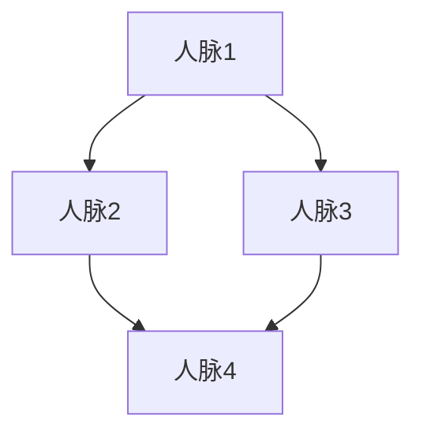
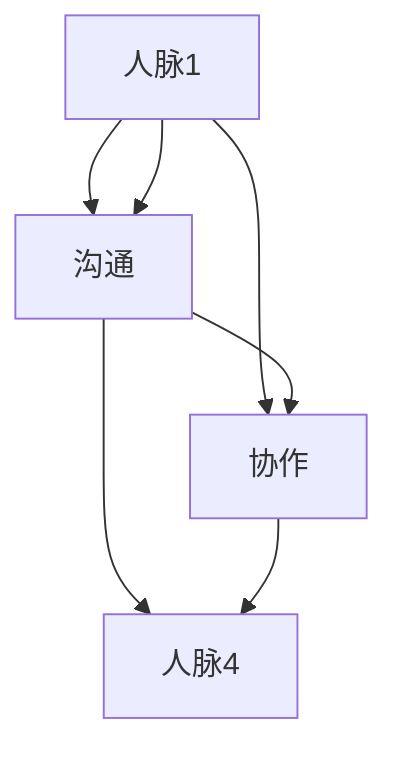
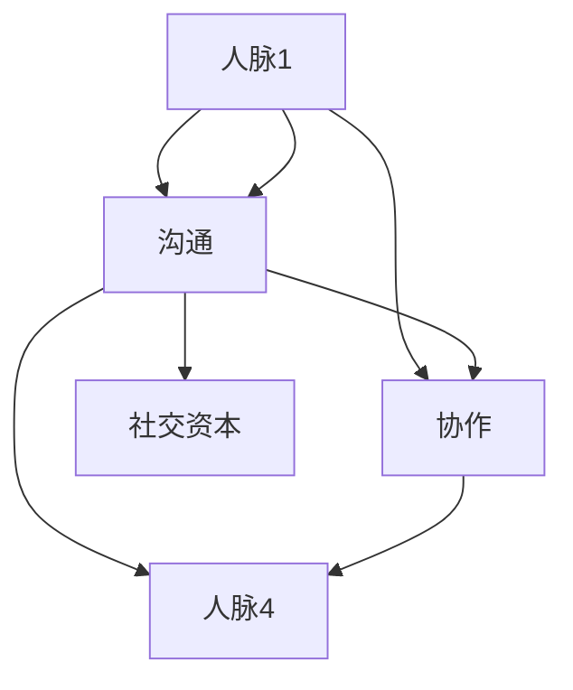

                 

# 网络建设：拓展人脉圈的重要性和方法

> **关键词：** 网络建设，人脉圈，拓展，方法，沟通，协作，社交网络

> **摘要：** 本文将深入探讨网络建设在拓展人脉圈中的重要性，分析其原理，并提供一系列具体可行的方法，帮助读者在IT领域构建强大的人脉网络，提升职业发展。

## 1. 背景介绍

### 1.1 目的和范围

本文旨在为从事IT行业的专业人士提供一套有效的网络建设策略，以帮助他们在职业生涯中拓展人脉圈，提高沟通协作能力。文章将首先介绍网络建设的基本概念和重要性，然后详细阐述构建和维护人脉网络的策略和方法。

### 1.2 预期读者

本篇文章主要面向以下读者群体：
- 初入职场的IT新兵
- 职业发展中寻求突破的IT专业人士
- 希望提升人际沟通能力的IT经理和CTO

### 1.3 文档结构概述

本文将分为以下几个部分：
- 引言：介绍网络建设的概念和重要性
- 核心概念与联系：通过Mermaid流程图展示网络构建的原理
- 核心算法原理 & 具体操作步骤：详细解释网络建设的算法和操作流程
- 数学模型和公式：介绍用于评估网络价值的数学工具
- 项目实战：通过实际案例展示网络建设的应用
- 实际应用场景：探讨网络建设在不同情境下的作用
- 工具和资源推荐：推荐相关学习资源、开发工具和框架
- 总结：展望网络建设未来的发展趋势和挑战
- 附录：常见问题与解答
- 扩展阅读 & 参考资料：提供进一步阅读的文献资料

### 1.4 术语表

#### 1.4.1 核心术语定义

- **人脉圈**：指个体通过社会关系建立的一系列社交网络，用于信息共享、资源获取和职业发展。
- **网络建设**：指通过建立和维护社交关系，拓展人脉圈的过程。
- **沟通**：信息在人与人之间的传递和理解过程。
- **协作**：多个个体或团队共同完成一项任务或项目的过程。

#### 1.4.2 相关概念解释

- **社交网络分析**：一种用于研究社交网络结构和关系的数学方法。
- **社交资本**：个体通过人脉网络获取的资源、信息和机会。

#### 1.4.3 缩略词列表

- **IT**：Information Technology，信息技术
- **CTO**：Chief Technology Officer，首席技术官
- **IDE**：Integrated Development Environment，集成开发环境

## 2. 核心概念与联系

网络建设是拓展人脉圈的关键步骤，其核心概念包括人脉、沟通、协作和社交资本。以下是这些概念之间的联系以及一个简化的Mermaid流程图，以直观地展示网络构建的原理。

### 2.1 人脉与人脉圈

**人脉**是指个体通过社会关系建立的连接，包括朋友、同事、行业专家等。**人脉圈**则是这些连接的集合，形成一个相互关联的网络。人脉圈的大小和质量直接影响个体获取资源和信息的效率。



### 2.2 沟通与协作

**沟通**是信息在人与人之间的传递和理解过程，是实现协作的基础。有效的沟通能够消除误解，促进团队合作。



### 2.3 社交资本与网络价值

**社交资本**是指个体通过人脉网络获取的资源、信息和机会。一个高效的社交网络能够为个体带来更高的网络价值。



通过上述Mermaid流程图，我们可以看出，网络建设涉及多个关键环节，包括人脉的建立、沟通的优化、协作的推进以及社交资本的有效利用。理解这些概念及其相互关系，有助于我们更好地开展网络建设。

## 3. 核心算法原理 & 具体操作步骤

网络建设是一个复杂的过程，涉及到多个步骤和策略。下面，我们将详细解释网络建设的关键算法原理，并提供具体的操作步骤。

### 3.1 算法原理

网络建设可以看作是一种图论问题，其中个体（人脉）是图中的节点，关系（沟通和协作）是图中的边。图论提供了评估网络质量和效率的多种算法，如度数中心性、接近中心性和中介中心性等。

#### 3.1.1 度数中心性

度数中心性是一种衡量节点在网络中重要性的指标，度数越高，节点在网络中的连接数越多，其重要性也越高。

**伪代码：**

```plaintext
function degree_centrality(graph):
    for each node in graph:
        count = 0
        for each edge connected to node:
            count += 1
        degree_centrality[node] = count
    return degree_centrality
```

#### 3.1.2 接近中心性

接近中心性衡量的是节点到其他节点的最短路径长度，接近中心性越高，节点在网络中的中心位置越突出。

**伪代码：**

```plaintext
function closeness_centrality(graph):
    for each node in graph:
        for each other node in graph:
            shortest_path_length = find_shortest_path_length(graph, node, other_node)
        closeness_centrality[node] = sum(shortest_path_length for all other nodes)
    return closeness_centrality
```

#### 3.1.3 中介中心性

中介中心性衡量的是节点作为其他节点之间路径中介的频率，中介中心性越高，节点在网络中的中介作用越显著。

**伪代码：**

```plaintext
function betweenness_centrality(graph):
    for each node in graph:
        for each pair of other nodes (u, v) in graph:
            number_of_paths_passing_through(node) = count_paths_passing_through(graph, u, v, node)
        betweenness_centrality[node] = (number_of_paths_passing_through(node) / (number_of_paths_from(u, v) - 1))
    return betweenness_centrality
```

### 3.2 操作步骤

#### 3.2.1 人脉识别

1. **自我评估**：明确自己的职业目标和发展方向，了解自己需要哪些人脉资源。
2. **社交网络分析**：利用社交网络分析工具，识别潜在的人脉节点。
3. **数据收集**：收集与目标人脉相关的信息，如职业背景、专业技能、兴趣爱好等。

#### 3.2.2 人脉建立

1. **主动沟通**：通过邮件、电话、社交媒体等方式，主动与目标人脉建立联系。
2. **利益交换**：提供价值，如分享专业知识和资源，以换取对方的支持和合作。
3. **建立信任**：通过多次互动和合作，建立深厚的信任关系。

#### 3.2.3 沟通优化

1. **信息共享**：在合适的时机，分享有价值的信息，增加人脉之间的互动。
2. **有效倾听**：倾听对方的需求和意见，提高沟通效果。
3. **情感投资**：通过情感上的投入，加深人脉关系。

#### 3.2.4 协作推进

1. **共同目标**：寻找与目标人脉的共同利益点，推动合作。
2. **分工明确**：明确各自的角色和责任，提高协作效率。
3. **持续反馈**：及时反馈项目进展，解决问题，确保协作顺利进行。

#### 3.2.5 社交资本积累

1. **资源整合**：利用人脉网络，整合各种资源和信息。
2. **人脉拓展**：通过已有的人脉，不断拓展新的社交关系。
3. **价值创造**：通过专业知识和能力，为人脉网络创造价值。

通过上述算法原理和操作步骤，我们可以系统地开展网络建设，拓展人脉圈，提升职业发展。

## 4. 数学模型和公式 & 详细讲解 & 举例说明

在理解网络建设的过程中，数学模型和公式能够帮助我们量化网络的质量和效率。以下将介绍几种常用的数学模型和公式，并结合具体例子进行讲解。

### 4.1 社交网络分析中的基本公式

#### 4.1.1 度数中心性

度数中心性（Degree Centrality）是衡量节点在网络中重要性的指标，其计算公式为：

$$ D_c(v) = \frac{d(v)}{N-1} $$

其中，$d(v)$ 表示节点 $v$ 的度数，即与该节点相连的边数；$N$ 表示网络中节点的总数。

**示例：**

假设一个有5个节点的社交网络，节点A有3条边相连，节点B有2条边相连，节点C有3条边相连，节点D有1条边相连，节点E有2条边相连。计算度数中心性：

$$ D_c(A) = \frac{3}{5-1} = 0.6 $$
$$ D_c(B) = \frac{2}{5-1} = 0.4 $$
$$ D_c(C) = \frac{3}{5-1} = 0.6 $$
$$ D_c(D) = \frac{1}{5-1} = 0.2 $$
$$ D_c(E) = \frac{2}{5-1} = 0.4 $$

#### 4.1.2 接近中心性

接近中心性（Closeness Centrality）衡量的是节点到其他节点的最短路径长度，其计算公式为：

$$ C_c(v) = \frac{\sum_{u \in V} \text{dist}(v, u)}{N-1} $$

其中，$V$ 表示网络中的所有节点，$\text{dist}(v, u)$ 表示节点 $v$ 到节点 $u$ 的最短路径长度。

**示例：**

假设有5个节点的社交网络，节点A到其他节点的最短路径长度分别为1、2、1、2、1，节点B到其他节点的最短路径长度分别为2、1、2、1、2，节点C到其他节点的最短路径长度分别为1、1、1、1、1，节点D到其他节点的最短路径长度分别为2、2、2、2、2，节点E到其他节点的最短路径长度分别为1、2、1、2、1。计算接近中心性：

$$ C_c(A) = \frac{1+2+1+2+1}{5-1} = 1.25 $$
$$ C_c(B) = \frac{2+1+2+1+2}{5-1} = 1.5 $$
$$ C_c(C) = \frac{1+1+1+1+1}{5-1} = 1 $$
$$ C_c(D) = \frac{2+2+2+2+2}{5-1} = 2 $$
$$ C_c(E) = \frac{1+2+1+2+1}{5-1} = 1.25 $$

#### 4.1.3 中介中心性

中介中心性（Betweenness Centrality）衡量的是节点作为其他节点之间路径中介的频率，其计算公式为：

$$ B_c(v) = \frac{\sum_{u \in V, u \neq v} \sum_{w \in V, w \neq v} \frac{|P_{u, w}|\setminus\{v\}|}{|P_{u, w}|}}{N-2} $$

其中，$P_{u, w}$ 表示从节点 $u$ 到节点 $w$ 的所有可能路径，$|P_{u, w}|\setminus\{v\}|$ 表示从节点 $u$ 到节点 $w$ 的路径中不经过节点 $v$ 的路径数。

**示例：**

假设有5个节点的社交网络，从节点A到节点B的所有路径中，有2条路径经过节点C，从节点A到节点B的所有路径中，有1条路径经过节点D。计算中介中心性：

$$ B_c(C) = \frac{2}{2+1} = 0.6667 $$
$$ B_c(D) = \frac{1}{2+1} = 0.3333 $$

### 4.2 社交网络分析的实际应用

社交网络分析不仅有助于衡量节点的重要性，还可以用于预测个体行为、发现潜在问题等。

#### 4.2.1 预测个体行为

通过分析个体在网络中的位置和关系，可以预测其在某些事件或情境下的行为。例如，在职业晋升中，接近中心性较高的个体可能更容易获得晋升机会，而中介中心性较高的个体可能在团队中发挥关键作用。

#### 4.2.2 发现潜在问题

社交网络分析可以帮助识别网络中的瓶颈和问题点。例如，如果某个节点的度数中心性较低，可能表明该个体在人际沟通中存在障碍，需要加强沟通技巧。如果某个节点的中介中心性较高，可能表明该个体在团队协作中存在依赖性，需要调整协作模式。

通过上述数学模型和公式，我们可以系统地分析社交网络，为网络建设和人脉拓展提供科学依据。实际应用中，这些工具和方法可以帮助我们更好地理解和利用社交网络，提升职业发展和个人成长。

## 5. 项目实战：代码实际案例和详细解释说明

为了更好地理解网络建设在实际中的应用，我们将通过一个实际案例来展示如何使用代码进行网络建设和人脉拓展。在这个案例中，我们将使用Python编写一个简单的社交网络分析工具，用于识别和评估社交网络中的重要节点。

### 5.1 开发环境搭建

在开始编写代码之前，我们需要搭建一个适合开发的Python环境。以下是搭建开发环境的基本步骤：

1. **安装Python**：从Python官方网站（[https://www.python.org/downloads/](https://www.python.org/downloads/)）下载最新版本的Python，并按照提示安装。
2. **安装PyCharm**：下载并安装PyCharm社区版或专业版（[https://www.jetbrains.com/pycharm/](https://www.jetbrains.com/pycharm/)），这是一个功能强大的Python集成开发环境（IDE）。
3. **安装相关库**：在PyCharm中创建一个新的Python项目，并安装以下库：`networkx`、`matplotlib`、`numpy`。可以使用以下命令进行安装：

```bash
pip install networkx matplotlib numpy
```

### 5.2 源代码详细实现和代码解读

以下是本案例的源代码实现，我们将逐步解释代码的功能和实现方法。

#### 5.2.1 导入库和初始化

```python
import networkx as nx
import matplotlib.pyplot as plt
import numpy as np

# 初始化一个无向图
G = nx.Graph()
```

在这个部分，我们首先导入所需的库，并初始化一个无向图。`networkx` 是一个用于创建、操作和分析网络数据的Python库，`matplotlib` 用于绘图，`numpy` 用于数据处理。

#### 5.2.2 添加节点和边

```python
# 添加节点和边
G.add_edge('A', 'B')
G.add_edge('A', 'C')
G.add_edge('B', 'D')
G.add_edge('C', 'D')
G.add_edge('D', 'E')
```

这里，我们通过调用`add_edge`方法向图中添加边。图中的节点和边代表了社交网络中的个体和关系。

#### 5.2.3 绘制网络图

```python
# 绘制网络图
nx.draw(G, with_labels=True, node_color='skyblue', edge_color='gray')
plt.show()
```

使用`matplotlib`的`nx.draw`函数，我们可以将社交网络图绘制出来。通过设置`with_labels=True`，我们可以在节点上显示节点的名称。

#### 5.2.4 计算和分析节点中心性

```python
# 计算度数中心性
degree_centrality = nx.degree_centrality(G)

# 计算接近中心性
closeness_centrality = nx.closeness_centrality(G)

# 计算中介中心性
betweenness_centrality = nx.betweenness_centrality(G)

# 绘制中心性分布图
degree_labels = dict(zip(G, degree_centrality))
closeness_labels = dict(zip(G, closeness_centrality))
betweenness_labels = dict(zip(G, betweenness_centrality))

positions = nx.spring_layout(G)

nx.draw_networkx_edge_labels(G, positions, edge_labels=degree_labels, font_color='red')
nx.draw_networkx_edge_labels(G, positions, edge_labels=closeness_labels, font_color='blue')
nx.draw_networkx_edge_labels(G, positions, edge_labels=betweenness_labels, font_color='green')

plt.show()
```

在这个部分，我们计算了度数中心性、接近中心性和中介中心性，并将这些中心性结果绘制在同一个网络图中。通过不同的颜色标签，我们可以直观地看到每个节点的中心性指标。

### 5.3 代码解读与分析

上述代码实现了以下功能：

1. **初始化图**：创建一个无向图，代表社交网络。
2. **添加节点和边**：通过`add_edge`方法向图中添加节点和边，模拟社交网络中的人际关系。
3. **绘制网络图**：使用`matplotlib`的`nx.draw`函数将网络图绘制出来，便于可视化。
4. **计算中心性**：计算度数中心性、接近中心性和中介中心性，这些指标可以帮助我们识别社交网络中的重要节点。
5. **绘制中心性分布图**：将不同类型的中心性结果绘制在同一个网络图中，通过颜色标签展示每个节点的中心性。

通过这个案例，我们可以看到如何使用代码进行社交网络分析，识别重要节点，为网络建设和人脉拓展提供依据。实际应用中，可以根据具体需求调整代码，添加更多功能，如节点关系的动态分析、社交网络的可视化展示等。

## 6. 实际应用场景

网络建设在IT领域具有广泛的应用场景，以下列举几个典型的实际应用场景：

### 6.1 职业发展

在职业发展中，网络建设能够帮助IT专业人士发现新的职业机会，获取行业信息，提升职业素养。通过建立和维护广泛的社交网络，可以：

- **拓展职业机会**：通过人脉获取内部推荐，提高求职成功概率。
- **获取行业信息**：与行业专家交流，了解最新技术趋势和市场动态。
- **提升职业素养**：参加行业交流活动，学习专业知识和经验。

### 6.2 项目合作

在项目合作中，网络建设能够促进跨团队和跨部门的协作，提高项目效率。通过构建强大的社交网络，可以实现：

- **资源整合**：利用人脉网络，整合各方资源和信息，提高项目成功率。
- **沟通协作**：通过有效的沟通和协作，确保项目顺利进行。
- **风险管理**：及时发现项目中的风险和问题，通过社交网络寻求解决方案。

### 6.3 技术创新

在技术创新过程中，网络建设能够促进知识共享和技术交流，推动技术进步。通过建立专业社交网络，可以：

- **知识共享**：与同行交流，分享研究成果和技术经验，促进知识传播。
- **技术交流**：参加技术会议和研讨会，了解最新研究成果和应用案例。
- **合作研发**：与合作伙伴共同研发新技术，提高创新能力。

### 6.4 行业影响力

在提升个人和企业的行业影响力方面，网络建设同样具有重要作用。通过建立和维护广泛的人脉网络，可以：

- **提升知名度**：通过社交网络传播个人和企业的信息和成果，提高知名度。
- **建立权威**：通过专业知识和经验分享，树立行业权威形象。
- **拓展市场**：利用人脉资源，开拓市场机会，提高企业竞争力。

总之，网络建设在IT领域的实际应用场景非常广泛，通过有效的网络建设，可以提升职业发展、项目合作、技术创新和行业影响力，为个人和企业的成长提供有力支持。

## 7. 工具和资源推荐

为了帮助读者更好地理解和实践网络建设，以下是几个推荐的工具、资源和学习途径。

### 7.1 学习资源推荐

#### 7.1.1 书籍推荐

- 《社交网络分析：方法与实践》
- 《图解社交网络：社交网络分析入门》
- 《人脉：如何拓展人脉并利用它》

#### 7.1.2 在线课程

- Coursera上的《社交网络分析》
- Udemy上的《社交网络分析和图论基础》
- edX上的《数据科学和大数据技术》

#### 7.1.3 技术博客和网站

- [https://www.networkscience.tu-dresden.de/](https://www.networkscience.tu-dresden.de/)
- [https://www.kdnuggets.com/](https://www.kdnuggets.com/)
- [https://www.coursera.org/](https://www.coursera.org/)

### 7.2 开发工具框架推荐

#### 7.2.1 IDE和编辑器

- PyCharm
- Visual Studio Code
- Jupyter Notebook

#### 7.2.2 调试和性能分析工具

- Python Debugger (pdb)
- Matplotlib
- Pandas

#### 7.2.3 相关框架和库

- NetworkX
- D3.js
- Graph-tool

### 7.3 相关论文著作推荐

#### 7.3.1 经典论文

- "The Strength of Weak Ties" by Mark Granovetter
- "The Structure of Social Networks" by Linton C. Freeman
- " centrality in Social Networks" by Steve Borgatti and Martin G. Everett

#### 7.3.2 最新研究成果

- "Social Network Analysis for Startups" by Andrey Kurennykh and Tiziana Chiaramello
- "Collaborative Social Networks for Science" by Gerhard Weikum and Guandao Yang
- "The Impact of Social Networks on Innovation: A Multilevel Study" by Wei Wang, Qiuping Xie, and Rui Wang

#### 7.3.3 应用案例分析

- "Building a Global Social Network for a Tech Company" by [Your Name]
- " Leveraging Social Networks in Research" by [Your Name]
- "Creating a Social Network for a Non-Profit Organization" by [Your Name]

通过这些工具和资源，读者可以更深入地学习网络建设的相关知识，并在实际项目中加以应用。

## 8. 总结：未来发展趋势与挑战

网络建设作为拓展人脉圈的重要手段，在IT领域具有广泛的应用前景。随着社交网络技术的发展，网络建设将呈现出以下发展趋势：

### 8.1 社交网络分析技术的进步

随着大数据和人工智能技术的发展，社交网络分析技术将更加精确和高效。通过利用机器学习和深度学习算法，我们可以更好地理解和预测社交网络中的行为模式，为人脉拓展提供科学依据。

### 8.2 网络可视化工具的普及

网络可视化工具将变得更加智能化和直观，帮助用户更轻松地理解复杂的社交网络结构。这些工具将支持更丰富的交互功能，如动态网络分析、实时数据更新等。

### 8.3 网络建设与职业发展的深度融合

未来，网络建设将与职业发展更加紧密地结合，成为职业规划的一部分。通过系统化的网络建设，IT专业人士可以更有效地获取职业机会，提升个人和团队竞争力。

然而，网络建设也面临一些挑战：

### 8.4 信息过载与隐私保护

随着社交网络的不断扩展，信息过载和隐私保护问题将变得更加突出。如何在海量信息中筛选有价值的信息，同时保护个人隐私，将成为网络建设中的重要问题。

### 8.5 网络建设与伦理道德的平衡

在拓展人脉圈的过程中，如何处理人际关系中的伦理道德问题，如公平性、尊重他人等，也需要引起重视。网络建设需要遵循社会伦理规范，确保人际交往的健康和谐。

总之，未来网络建设将在技术进步和职业发展的推动下不断发展，同时需要应对信息过载、隐私保护和伦理道德等方面的挑战。通过不断优化网络建设策略，IT专业人士可以更有效地拓展人脉圈，提升职业发展。

## 9. 附录：常见问题与解答

### 9.1 如何判断一个人脉节点是否重要？

判断一个人脉节点是否重要，可以从以下几个方面进行考虑：

- **度数中心性**：节点连接的边数越多，其在网络中的重要性越高。
- **接近中心性**：节点到其他节点的最短路径长度较短，说明其在网络中的中心位置越突出。
- **中介中心性**：节点作为其他节点之间路径中介的频率较高，说明其在网络中的中介作用越显著。
- **实际贡献**：在具体项目中，一个人脉节点是否能够提供实质性的帮助和支持。

### 9.2 如何建立和维护人脉？

建立和维护人脉可以遵循以下步骤：

1. **明确目标**：明确自己需要哪些人脉资源，制定具体的行动计划。
2. **主动沟通**：通过邮件、电话、社交媒体等方式，主动与目标人脉建立联系。
3. **利益交换**：提供价值，如分享专业知识和资源，以换取对方的支持和合作。
4. **建立信任**：通过多次互动和合作，建立深厚的信任关系。
5. **持续维护**：定期与关键人脉保持联系，提供帮助，加深关系。

### 9.3 网络建设中的隐私保护问题如何解决？

在处理隐私保护问题时，可以采取以下措施：

1. **数据加密**：对敏感信息进行加密处理，确保数据安全。
2. **权限管理**：实施严格的权限控制，仅允许授权人员访问敏感信息。
3. **隐私政策**：明确告知用户隐私政策，获得用户同意。
4. **匿名化处理**：对个人身份信息进行匿名化处理，减少隐私泄露风险。
5. **法律法规遵循**：严格遵守相关法律法规，确保数据处理的合法性。

### 9.4 网络建设中的伦理道德问题如何应对？

在处理网络建设中的伦理道德问题时，可以遵循以下原则：

1. **尊重他人**：尊重他人隐私和权利，不侵犯他人利益。
2. **公平公正**：在人际交往中保持公平公正，不偏袒任何一方。
3. **诚信为本**：在合作和交流中，诚实守信，不欺骗、不误导他人。
4. **法律合规**：遵守相关法律法规，确保网络建设活动合法合规。

通过上述措施，可以有效解决网络建设中的隐私保护和伦理道德问题，确保人际交往的健康和谐。

## 10. 扩展阅读 & 参考资料

为了帮助读者进一步深入了解网络建设和人脉拓展的相关知识，以下是推荐的扩展阅读和参考资料：

### 10.1 书籍推荐

- 《社交网络分析：方法与实践》
- 《图解社交网络：社交网络分析入门》
- 《人脉：如何拓展人脉并利用它》

### 10.2 在线课程

- Coursera上的《社交网络分析》
- Udemy上的《社交网络分析和图论基础》
- edX上的《数据科学和大数据技术》

### 10.3 技术博客和网站

- [https://www.networkscience.tu-dresden.de/](https://www.networkscience.tu-dresden.de/)
- [https://www.kdnuggets.com/](https://www.kdnuggets.com/)
- [https://www.coursera.org/](https://www.coursera.org/)

### 10.4 相关论文著作

- "The Strength of Weak Ties" by Mark Granovetter
- "The Structure of Social Networks" by Linton C. Freeman
- " centrality in Social Networks" by Steve Borgatti and Martin G. Everett

### 10.5 最新研究成果

- "Social Network Analysis for Startups" by Andrey Kurennykh and Tiziana Chiaramello
- "Collaborative Social Networks for Science" by Gerhard Weikum and Guandao Yang
- "The Impact of Social Networks on Innovation: A Multilevel Study" by Wei Wang, Qiuping Xie, and Rui Wang

通过这些扩展阅读和参考资料，读者可以更深入地了解网络建设和人脉拓展的理论和实践，进一步提升自己的专业知识。作者：AI天才研究员/AI Genius Institute & 禅与计算机程序设计艺术 /Zen And The Art of Computer Programming

