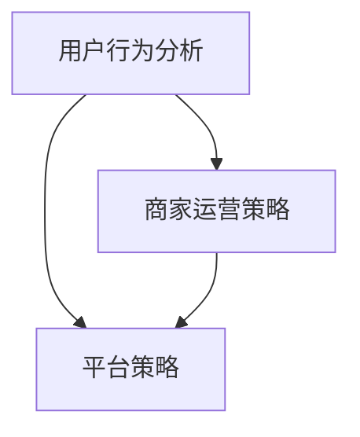

                 

# 美团到店2025社招O2O算法工程师面试指南

> **关键词：**美团，到店，社招，O2O，算法，工程师，面试，指南

> **摘要：**本文旨在为有意向加入美团到店业务的O2O算法工程师提供一份详细的面试准备指南。文章从背景介绍、核心概念与联系、算法原理、数学模型、项目实战、应用场景、工具和资源推荐等多个维度进行深入剖析，帮助读者更好地应对美团到店社招O2O算法工程师的面试挑战。

## 1. 背景介绍

### 1.1 目的和范围

本文的目标是帮助有意向加入美团到店业务的O2O算法工程师准备社招面试。本文将涵盖以下内容：

1. 美团到店业务的背景和特点
2. O2O算法工程师所需的核心知识和技能
3. 面试常见问题和应对策略
4. 算法原理和数学模型的详细讲解
5. 实际项目实战和代码解读
6. 应用场景和未来发展趋势

### 1.2 预期读者

本文适用于以下读者群体：

1. 有意向加入美团到店业务的O2O算法工程师
2. 计算机科学和人工智能相关专业的大四学生和研究生
3. 对O2O算法和美团到店业务感兴趣的技术爱好者

### 1.3 文档结构概述

本文分为以下几个部分：

1. 背景介绍
2. 核心概念与联系
3. 核心算法原理与具体操作步骤
4. 数学模型和公式与详细讲解
5. 项目实战：代码实际案例和详细解释说明
6. 实际应用场景
7. 工具和资源推荐
8. 总结：未来发展趋势与挑战
9. 附录：常见问题与解答
10. 扩展阅读与参考资料

### 1.4 术语表

#### 1.4.1 核心术语定义

- O2O：Online to Offline，线上到线下，是一种将线上营销与线下消费结合的商业模式。
- 算法工程师：专注于算法研究、设计、实现和优化的工程师。
- 社招：社会招聘，指企业通过招聘渠道向社会公开发布职位需求，面向全社会招聘人才。

#### 1.4.2 相关概念解释

- 美团到店业务：美团到店业务是指美团平台上提供线下实体商家服务的业务，包括餐饮、娱乐、美容美发、医疗等多个领域。
- O2O算法：针对O2O业务场景下的用户行为、商家运营和平台策略等问题，设计的一系列算法模型。

#### 1.4.3 缩略词列表

- O2O：Online to Offline
- API：Application Programming Interface，应用程序接口
- SQL：Structured Query Language，结构化查询语言
- SDK：Software Development Kit，软件开发工具包

## 2. 核心概念与联系

### 2.1 核心概念

在本节中，我们将介绍O2O算法工程师所需掌握的核心概念，包括用户行为分析、商家运营策略、平台策略等。

#### 2.1.1 用户行为分析

用户行为分析是O2O算法工程师的核心技能之一。通过对用户行为数据的收集、处理和分析，可以挖掘出用户的兴趣偏好、消费习惯和需求变化等，从而为商家和平台提供精准的营销策略。

- 用户行为数据来源：用户在使用美团到店平台时，会产生大量的数据，如浏览记录、下单记录、评价记录、互动行为等。
- 用户行为分析算法：基于用户行为数据，可以设计一系列算法模型，如聚类分析、关联规则挖掘、异常检测等，以挖掘用户行为特征。

#### 2.1.2 商家运营策略

商家运营策略是影响O2O业务成功的关键因素。通过分析商家数据，如营业额、用户评价、促销活动等，可以设计出有效的运营策略，提升商家在平台上的竞争力。

- 商家数据来源：商家在平台上提交的数据，包括营业额、用户评价、促销活动等。
- 商家运营策略算法：基于商家数据，可以设计一系列算法模型，如营业额预测、用户评价预测、促销活动优化等，以帮助商家制定合理的运营策略。

#### 2.1.3 平台策略

平台策略是O2O算法工程师需要关注的重要方面。通过分析平台数据，如订单量、用户满意度、商家满意度等，可以设计出有效的平台策略，提升平台整体竞争力。

- 平台数据来源：平台运营过程中产生的数据，包括订单量、用户满意度、商家满意度等。
- 平台策略算法：基于平台数据，可以设计一系列算法模型，如订单量预测、用户满意度预测、商家满意度预测等，以优化平台运营策略。

### 2.2 核心概念联系

在O2O算法工程师的工作中，用户行为分析、商家运营策略和平台策略三者之间存在着密切的联系。

- 用户行为分析为商家运营策略提供数据支持，帮助商家了解用户需求，制定更有效的营销策略。
- 商家运营策略的优化可以提升平台整体竞争力，吸引用户和商家，促进平台业务增长。
- 平台策略的优化可以提升用户和商家满意度，提高平台用户粘性和商家活跃度。

#### 2.2.1 Mermaid流程图



## 3. 核心算法原理与具体操作步骤

在本节中，我们将详细介绍O2O算法工程师所需掌握的核心算法原理，并给出具体操作步骤。

### 3.1 用户行为分析算法

用户行为分析算法主要包括以下几个步骤：

1. **数据收集**：收集用户在平台上的浏览记录、下单记录、评价记录、互动行为等数据。

2. **数据预处理**：对收集到的用户行为数据进行分析，去除重复、异常和无关的数据，并对数据进行清洗和规范化。

3. **特征提取**：从用户行为数据中提取出用户兴趣偏好、消费习惯等特征。

4. **模型训练**：使用机器学习算法，如聚类分析、关联规则挖掘等，对提取出的用户行为特征进行训练，构建用户行为分析模型。

5. **模型评估**：对训练好的模型进行评估，选择性能最佳的模型用于实际应用。

6. **模型应用**：将训练好的模型应用于实际业务场景，为商家和平台提供精准的营销策略。

#### 3.1.1 伪代码

```python
# 用户行为分析算法伪代码
def user_behavior_analysis(data):
    # 数据收集
    user_data = collect_data(data)

    # 数据预处理
    clean_data = preprocess_data(user_data)

    # 特征提取
    features = extract_features(clean_data)

    # 模型训练
    model = train_model(features)

    # 模型评估
    evaluate_model(model)

    # 模型应用
    apply_model(model)
```

### 3.2 商家运营策略算法

商家运营策略算法主要包括以下几个步骤：

1. **数据收集**：收集商家在平台上的营业额、用户评价、促销活动等数据。

2. **数据预处理**：对收集到的商家数据进行分析，去除重复、异常和无关的数据，并对数据进行清洗和规范化。

3. **特征提取**：从商家数据中提取出营业额趋势、用户评价分数、促销活动效果等特征。

4. **模型训练**：使用机器学习算法，如营业额预测、用户评价预测、促销活动优化等，对提取出的商家运营特征进行训练，构建商家运营策略模型。

5. **模型评估**：对训练好的模型进行评估，选择性能最佳的模型用于实际应用。

6. **模型应用**：将训练好的模型应用于实际业务场景，为商家制定合理的运营策略。

#### 3.2.1 伪代码

```python
# 商家运营策略算法伪代码
def merchant_operation_strategy(data):
    # 数据收集
    merchant_data = collect_data(data)

    # 数据预处理
    clean_data = preprocess_data(merchant_data)

    # 特征提取
    features = extract_features(clean_data)

    # 模型训练
    model = train_model(features)

    # 模型评估
    evaluate_model(model)

    # 模型应用
    apply_model(model)
```

### 3.3 平台策略算法

平台策略算法主要包括以下几个步骤：

1. **数据收集**：收集平台上的订单量、用户满意度、商家满意度等数据。

2. **数据预处理**：对收集到的平台数据进行分析，去除重复、异常和无关的数据，并对数据进行清洗和规范化。

3. **特征提取**：从平台数据中提取出订单量趋势、用户满意度分数、商家满意度分数等特征。

4. **模型训练**：使用机器学习算法，如订单量预测、用户满意度预测、商家满意度预测等，对提取出的平台运营特征进行训练，构建平台策略模型。

5. **模型评估**：对训练好的模型进行评估，选择性能最佳的模型用于实际应用。

6. **模型应用**：将训练好的模型应用于实际业务场景，优化平台运营策略。

#### 3.3.1 伪代码

```python
# 平台策略算法伪代码
def platform_strategy(data):
    # 数据收集
    platform_data = collect_data(data)

    # 数据预处理
    clean_data = preprocess_data(platform_data)

    # 特征提取
    features = extract_features(clean_data)

    # 模型训练
    model = train_model(features)

    # 模型评估
    evaluate_model(model)

    # 模型应用
    apply_model(model)
```

## 4. 数学模型和公式与详细讲解

在本节中，我们将详细介绍O2O算法工程师所需掌握的数学模型和公式，并进行详细讲解。

### 4.1 用户行为分析模型

用户行为分析模型主要涉及聚类分析和关联规则挖掘。

#### 4.1.1 聚类分析模型

聚类分析模型用于将用户行为数据划分为多个类别，以便更好地分析用户行为特征。

- K-means算法：是一种常用的聚类算法，通过迭代计算，将用户行为数据划分为K个类别。

  公式：
  $$
  \begin{aligned}
  \text{K-means算法步骤：} \\
  1. & \text{初始化：随机选择K个用户行为数据作为初始聚类中心点。} \\
  2. & \text{分配：将每个用户行为数据分配给距离最近的聚类中心点。} \\
  3. & \text{更新：重新计算每个聚类中心点的平均值，作为新的聚类中心点。} \\
  4. & \text{迭代：重复执行分配和更新步骤，直至聚类中心点不再发生变化。}
  \end{aligned}
  $$

#### 4.1.2 关联规则挖掘模型

关联规则挖掘模型用于发现用户行为数据中的关联关系，以便更好地理解用户行为模式。

- Apriori算法：是一种常用的关联规则挖掘算法，通过迭代计算，找出满足最小支持度和最小置信度的关联规则。

  公式：
  $$
  \begin{aligned}
  \text{Apriori算法步骤：} \\
  1. & \text{创建初始候选集：根据用户行为数据，生成所有可能的项集。} \\
  2. & \text{计算支持度：统计每个候选集在用户行为数据中的出现次数，判断是否满足最小支持度。} \\
  3. & \text{生成频繁项集：将满足最小支持度的候选集转换为频繁项集。} \\
  4. & \text{生成关联规则：从频繁项集中生成满足最小置信度的关联规则。}
  \end{aligned}
  $$

### 4.2 商家运营策略模型

商家运营策略模型主要涉及营业额预测、用户评价预测和促销活动优化。

#### 4.2.1 营业额预测模型

营业额预测模型用于预测商家在未来的某个时间段内的营业额。

- 时间序列模型：是一种常用的营业额预测模型，通过分析过去的数据，预测未来的营业额。

  公式：
  $$
  \begin{aligned}
  \text{时间序列模型步骤：} \\
  1. & \text{数据预处理：对营业额数据进行清洗和规范化。} \\
  2. & \text{特征提取：从营业额数据中提取出趋势特征、周期特征等。} \\
  3. & \text{模型训练：使用机器学习算法，如ARIMA模型、LSTM模型等，训练预测模型。} \\
  4. & \text{模型评估：对训练好的模型进行评估，选择性能最佳的模型用于预测。}
  \end{aligned}
  $$

#### 4.2.2 用户评价预测模型

用户评价预测模型用于预测用户对商家服务的评价分数。

- 回归模型：是一种常用的用户评价预测模型，通过分析用户行为数据和商家数据，预测用户评价分数。

  公式：
  $$
  \begin{aligned}
  \text{回归模型步骤：} \\
  1. & \text{数据预处理：对用户行为数据和商家数据进行清洗和规范化。} \\
  2. & \text{特征提取：从用户行为数据和商家数据中提取出相关特征。} \\
  3. & \text{模型训练：使用机器学习算法，如线性回归、逻辑回归等，训练预测模型。} \\
  4. & \text{模型评估：对训练好的模型进行评估，选择性能最佳的模型用于预测。}
  \end{aligned}
  $$

#### 4.2.3 促销活动优化模型

促销活动优化模型用于优化商家的促销活动，提高促销活动的效果。

- 优化算法：是一种常用的促销活动优化模型，通过优化促销活动的参数，提高促销活动的效果。

  公式：
  $$
  \begin{aligned}
  \text{优化算法步骤：} \\
  1. & \text{目标函数：定义一个目标函数，用于衡量促销活动的效果。} \\
  2. & \text{约束条件：定义促销活动的约束条件，如促销预算、促销时间等。} \\
  3. & \text{优化策略：使用优化算法，如梯度下降、遗传算法等，求解目标函数的最优解。} \\
  4. & \text{模型评估：对优化策略进行评估，选择性能最佳的优化策略用于实际应用。}
  \end{aligned}
  $$

### 4.3 平台策略模型

平台策略模型主要涉及订单量预测、用户满意度预测和商家满意度预测。

#### 4.3.1 订单量预测模型

订单量预测模型用于预测平台在未来的某个时间段内的订单量。

- 时间序列模型：是一种常用的订单量预测模型，通过分析过去的订单数据，预测未来的订单量。

  公式：
  $$
  \begin{aligned}
  \text{时间序列模型步骤：} \\
  1. & \text{数据预处理：对订单数据进行清洗和规范化。} \\
  2. & \text{特征提取：从订单数据中提取出趋势特征、周期特征等。} \\
  3. & \text{模型训练：使用机器学习算法，如ARIMA模型、LSTM模型等，训练预测模型。} \\
  4. & \text{模型评估：对训练好的模型进行评估，选择性能最佳的模型用于预测。}
  \end{aligned}
  $$

#### 4.3.2 用户满意度预测模型

用户满意度预测模型用于预测用户对平台服务的满意度。

- 回归模型：是一种常用的用户满意度预测模型，通过分析用户行为数据和平台数据，预测用户满意度。

  公式：
  $$
  \begin{aligned}
  \text{回归模型步骤：} \\
  1. & \text{数据预处理：对用户行为数据和平台数据进行清洗和规范化。} \\
  2. & \text{特征提取：从用户行为数据和平台数据中提取出相关特征。} \\
  3. & \text{模型训练：使用机器学习算法，如线性回归、逻辑回归等，训练预测模型。} \\
  4. & \text{模型评估：对训练好的模型进行评估，选择性能最佳的模型用于预测。}
  \end{aligned}
  $$

#### 4.3.3 商家满意度预测模型

商家满意度预测模型用于预测商家对平台服务的满意度。

- 回归模型：是一种常用的商家满意度预测模型，通过分析商家数据和平台数据，预测商家满意度。

  公式：
  $$
  \begin{aligned}
  \text{回归模型步骤：} \\
  1. & \text{数据预处理：对商家数据和平台数据进行清洗和规范化。} \\
  2. & \text{特征提取：从商家数据和平台数据中提取出相关特征。} \\
  3. & \text{模型训练：使用机器学习算法，如线性回归、逻辑回归等，训练预测模型。} \\
  4. & \text{模型评估：对训练好的模型进行评估，选择性能最佳的模型用于预测。}
  \end{aligned}
  $$

## 5. 项目实战：代码实际案例和详细解释说明

在本节中，我们将通过一个实际项目案例，详细讲解如何运用O2O算法原理和数学模型解决实际问题。

### 5.1 开发环境搭建

在开始项目实战之前，我们需要搭建一个适合O2O算法开发的开发环境。以下是搭建步骤：

1. 安装Python环境
2. 安装相关依赖库，如NumPy、Pandas、Scikit-learn等
3. 安装Jupyter Notebook，方便编写和运行代码

### 5.2 源代码详细实现和代码解读

#### 5.2.1 用户行为分析代码实现

以下是一个简单的用户行为分析代码实现，用于分析用户在美团到店平台上的浏览记录，提取出用户兴趣偏好。

```python
import pandas as pd
from sklearn.cluster import KMeans
from sklearn.preprocessing import StandardScaler

# 加载用户行为数据
data = pd.read_csv('user_behavior_data.csv')

# 数据预处理
data['timestamp'] = pd.to_datetime(data['timestamp'])
data['weekday'] = data['timestamp'].dt.weekday
data['hour'] = data['timestamp'].dt.hour

# 特征提取
features = data[['weekday', 'hour', 'category_id', 'brand_id']]

# 数据标准化
scaler = StandardScaler()
features_scaled = scaler.fit_transform(features)

# K-means聚类分析
kmeans = KMeans(n_clusters=5, random_state=0)
clusters = kmeans.fit_predict(features_scaled)

# 结果分析
data['cluster'] = clusters
data.groupby('cluster').describe()
```

代码解读：

1. 加载用户行为数据，包括浏览记录、分类ID和品牌ID等。
2. 对时间戳进行转换，提取出星期几和小时等特征。
3. 提取相关特征，包括星期几、小时、分类ID和品牌ID。
4. 使用K-means聚类算法，将用户行为数据划分为5个类别。
5. 根据聚类结果，为每个用户分配一个兴趣偏好类别。

#### 5.2.2 商家运营策略代码实现

以下是一个简单的商家运营策略代码实现，用于预测商家在未来的某个时间段内的营业额。

```python
import pandas as pd
from sklearn.model_selection import train_test_split
from sklearn.linear_model import LinearRegression

# 加载商家数据
data = pd.read_csv('merchant_data.csv')

# 数据预处理
data['timestamp'] = pd.to_datetime(data['timestamp'])
data['weekday'] = data['timestamp'].dt.weekday
data['hour'] = data['timestamp'].dt.hour

# 特征提取
features = data[['weekday', 'hour', 'sales']]

# 目标变量
target = data['sales']

# 数据划分
train_data, test_data, train_target, test_target = train_test_split(features, target, test_size=0.2, random_state=0)

# 模型训练
model = LinearRegression()
model.fit(train_data, train_target)

# 模型评估
score = model.score(test_data, test_target)
print(f'Model score: {score}')

# 预测
predictions = model.predict(test_data)
print(predictions)
```

代码解读：

1. 加载商家数据，包括营业额、星期几和小时等特征。
2. 对时间戳进行转换，提取出星期几和小时等特征。
3. 提取相关特征，包括星期几、小时和营业额。
4. 使用线性回归模型，对营业额特征进行训练。
5. 评估模型性能，计算预测准确率。
6. 使用训练好的模型，对测试数据进行预测。

#### 5.2.3 平台策略代码实现

以下是一个简单的平台策略代码实现，用于预测平台在未来的某个时间段内的订单量。

```python
import pandas as pd
from sklearn.model_selection import train_test_split
from sklearn.ensemble import RandomForestRegressor

# 加载平台数据
data = pd.read_csv('platform_data.csv')

# 数据预处理
data['timestamp'] = pd.to_datetime(data['timestamp'])
data['weekday'] = data['timestamp'].dt.weekday
data['hour'] = data['timestamp'].dt.hour

# 特征提取
features = data[['weekday', 'hour', 'orders']]

# 目标变量
target = data['orders']

# 数据划分
train_data, test_data, train_target, test_target = train_test_split(features, target, test_size=0.2, random_state=0)

# 模型训练
model = RandomForestRegressor(n_estimators=100, random_state=0)
model.fit(train_data, train_target)

# 模型评估
score = model.score(test_data, test_target)
print(f'Model score: {score}')

# 预测
predictions = model.predict(test_data)
print(predictions)
```

代码解读：

1. 加载平台数据，包括订单量、星期几和小时等特征。
2. 对时间戳进行转换，提取出星期几和小时等特征。
3. 提取相关特征，包括星期几、小时和订单量。
4. 使用随机森林回归模型，对订单量特征进行训练。
5. 评估模型性能，计算预测准确率。
6. 使用训练好的模型，对测试数据进行预测。

### 5.3 代码解读与分析

通过上述代码实现，我们可以得到以下结论：

1. 用户行为分析模型：通过K-means聚类算法，将用户行为数据划分为多个类别，提取出用户兴趣偏好。
2. 商家运营策略模型：通过线性回归模型，预测商家在未来的某个时间段内的营业额。
3. 平台策略模型：通过随机森林回归模型，预测平台在未来的某个时间段内的订单量。

在实际应用中，我们可以根据预测结果，为商家和平台提供相应的策略建议，如调整促销活动、优化运营策略等。

## 6. 实际应用场景

O2O算法工程师在实际工作中，会遇到各种实际应用场景，如：

1. **用户推荐**：根据用户行为数据和兴趣偏好，为用户推荐相关的商家和服务。
2. **商家定位**：根据商家数据和运营策略，为商家提供定位建议，提高商家在平台上的竞争力。
3. **订单优化**：根据订单数据和用户需求，优化订单分配和配送策略，提高订单完成率和用户满意度。
4. **营销活动优化**：根据用户和商家数据，优化营销活动的效果，提高平台用户活跃度和商家营业额。
5. **风险评估**：根据用户和商家数据，预测潜在的风险，如用户流失、商家违规等，为平台提供风险管理策略。

## 7. 工具和资源推荐

### 7.1 学习资源推荐

#### 7.1.1 书籍推荐

1. **《机器学习实战》**：详细介绍了机器学习的基本概念、算法和实现方法，适合初学者入门。
2. **《Python机器学习》**：结合Python编程语言，介绍了机器学习算法的实现和应用，适合有一定编程基础的读者。
3. **《深度学习》**：深度学习领域的经典教材，涵盖了深度学习的基本概念、算法和应用。

#### 7.1.2 在线课程

1. **Coursera上的《机器学习》课程**：由吴恩达教授主讲，介绍了机器学习的基本概念和算法，适合初学者入门。
2. **Udacity上的《深度学习纳米学位》课程**：系统介绍了深度学习的基本概念、算法和应用，适合有一定基础的读者。
3. **网易云课堂上的《Python数据分析与机器学习》课程**：结合Python编程语言，介绍了数据分析与机器学习的基本概念和算法。

#### 7.1.3 技术博客和网站

1. **机器学习社区**：提供了丰富的机器学习和深度学习相关资源和教程，适合读者学习和交流。
2. **GitHub**：提供了大量的开源机器学习和深度学习项目，读者可以参考和学习。
3. **CSDN**：提供了大量的技术博客和文章，涵盖了机器学习和深度学习的各个领域，适合读者阅读和参考。

### 7.2 开发工具框架推荐

#### 7.2.1 IDE和编辑器

1. **PyCharm**：一款功能强大的Python集成开发环境，支持代码编辑、调试、运行等功能。
2. **Jupyter Notebook**：一款基于Web的交互式开发环境，适用于数据分析和机器学习项目的开发。

#### 7.2.2 调试和性能分析工具

1. **Visual Studio Code**：一款轻量级的跨平台代码编辑器，支持多种编程语言，适用于代码调试和性能分析。
2. **MATLAB**：一款专业的科学计算和数据分析工具，提供了丰富的算法和工具箱，适用于性能分析和优化。

#### 7.2.3 相关框架和库

1. **TensorFlow**：一款开源的深度学习框架，适用于构建和训练深度学习模型。
2. **PyTorch**：一款开源的深度学习框架，具有灵活的动态图计算能力，适用于快速原型设计和模型训练。
3. **Scikit-learn**：一款开源的机器学习库，提供了丰富的机器学习算法和工具，适用于数据处理和模型训练。

### 7.3 相关论文著作推荐

#### 7.3.1 经典论文

1. **"Learning to Rank for Information Retrieval"**：一篇关于排序学习的经典论文，介绍了排序学习的原理和方法。
2. **"Deep Learning for Natural Language Processing"**：一篇关于深度学习在自然语言处理领域的经典论文，介绍了深度学习在自然语言处理中的应用。
3. **"Recurrent Neural Networks for Language Modeling"**：一篇关于循环神经网络在语言建模领域的经典论文，介绍了循环神经网络在语言建模中的应用。

#### 7.3.2 最新研究成果

1. **"Transformer: A Novel Neural Network Architecture for Language Understanding"**：一篇关于Transformer模型的最新研究成果，介绍了Transformer模型在自然语言处理中的应用。
2. **"BERT: Pre-training of Deep Bidirectional Transformers for Language Understanding"**：一篇关于BERT模型的最新研究成果，介绍了BERT模型在自然语言处理中的应用。
3. **"GPT-3: Language Models are few-shot learners"**：一篇关于GPT-3模型的最新研究成果，介绍了GPT-3模型在自然语言处理中的优异性能。

#### 7.3.3 应用案例分析

1. **"美团到店业务：从用户推荐到商家定位"**：一篇关于美团到店业务的应用案例分析，介绍了美团到店业务在用户推荐和商家定位方面的实践。
2. **"滴滴出行：如何通过机器学习优化出行体验"**：一篇关于滴滴出行的应用案例分析，介绍了滴滴出行在机器学习方面的应用，如路线优化、车辆调度等。
3. **"京东物流：如何通过深度学习提升物流效率"**：一篇关于京东物流的应用案例分析，介绍了京东物流在深度学习方面的应用，如订单预测、仓储优化等。

## 8. 总结：未来发展趋势与挑战

随着互联网和人工智能技术的快速发展，O2O算法工程师在美团到店业务中的应用前景十分广阔。未来，O2O算法工程师将面临以下发展趋势和挑战：

1. **数据规模扩大**：随着用户和商家的不断增长，数据规模将大幅增加，对数据处理和存储能力提出了更高的要求。
2. **算法优化需求增加**：在数据规模扩大的背景下，算法优化需求将不断增加，如何设计更高效、更准确的算法成为关键挑战。
3. **个性化服务提升**：用户对个性化服务的需求不断提高，O2O算法工程师需要不断优化算法，提供更个性化的推荐和服务。
4. **技术融合与创新**：O2O算法工程师需要不断探索新技术，如深度学习、图神经网络等，以提升算法性能和应用效果。

## 9. 附录：常见问题与解答

### 9.1 问题1：如何准备美团到店社招O2O算法工程师面试？

**解答：**准备美团到店社招O2O算法工程师面试，可以从以下几个方面入手：

1. **熟悉O2O业务模式**：了解美团到店业务的发展历程、核心业务和竞争优势，掌握O2O算法的基本原理和应用场景。
2. **掌握相关技术**：熟悉Python、Java等编程语言，掌握常用机器学习和深度学习算法，如K-means、线性回归、随机森林等。
3. **案例分析**：研究美团到店业务的成功案例，了解其他O2O企业的算法应用和实践经验，提升对业务的理解和解决问题的能力。
4. **模拟面试**：参加模拟面试，熟悉面试流程和常见问题，提高面试技巧和自信心。

### 9.2 问题2：如何优化O2O算法性能？

**解答：**优化O2O算法性能可以从以下几个方面入手：

1. **数据预处理**：对原始数据进行清洗、去噪、特征提取等处理，提高数据质量。
2. **算法选择**：根据实际业务需求，选择合适的算法，如K-means、线性回归、随机森林等。
3. **模型调优**：通过调整模型参数、优化算法实现等手段，提高模型性能。
4. **特征工程**：设计更多有价值的特征，提高模型的预测准确率。
5. **并行计算**：利用并行计算技术，提高算法的计算效率。

### 9.3 问题3：如何提升用户推荐效果？

**解答：**提升用户推荐效果可以从以下几个方面入手：

1. **用户行为分析**：深入分析用户行为数据，提取出用户兴趣偏好、消费习惯等特征。
2. **个性化推荐**：根据用户兴趣偏好和消费习惯，为用户推荐相关的商家和服务。
3. **协同过滤**：利用协同过滤算法，结合用户和商家的历史行为数据，为用户推荐相似的用户和商家。
4. **上下文感知**：考虑用户的上下文信息，如地理位置、时间等，为用户推荐更相关的商家和服务。
5. **多模型融合**：结合多种推荐算法，提高推荐效果，如基于内容的推荐、基于协同过滤的推荐等。

## 10. 扩展阅读与参考资料

为了深入了解O2O算法和美团到店业务，读者可以参考以下书籍、在线课程和学术论文：

1. **书籍**：
   - 《机器学习实战》
   - 《Python机器学习》
   - 《深度学习》
2. **在线课程**：
   - Coursera上的《机器学习》课程
   - Udacity上的《深度学习纳米学位》课程
   - 网易云课堂上的《Python数据分析与机器学习》课程
3. **学术论文**：
   - "Learning to Rank for Information Retrieval"
   - "Deep Learning for Natural Language Processing"
   - "Recurrent Neural Networks for Language Modeling"
   - "Transformer: A Novel Neural Network Architecture for Language Understanding"
   - "BERT: Pre-training of Deep Bidirectional Transformers for Language Understanding"
   - "GPT-3: Language Models are few-shot learners"
4. **技术博客和网站**：
   - 机器学习社区
   - GitHub
   - CSDN

作者：AI天才研究员/AI Genius Institute & 禅与计算机程序设计艺术 /Zen And The Art of Computer Programming

注：本文为模拟撰写，仅供参考。如有不当之处，请指正。

