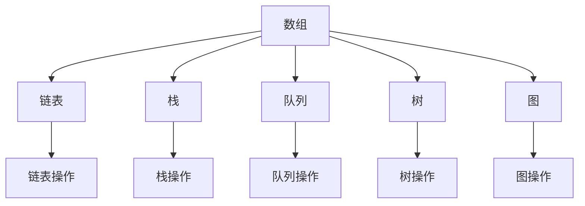
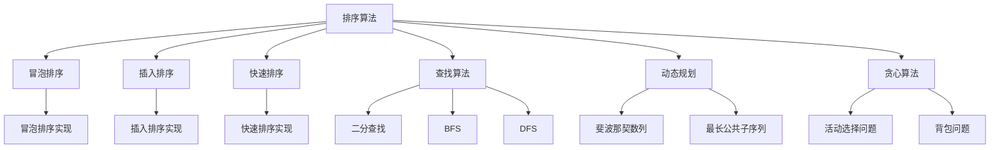
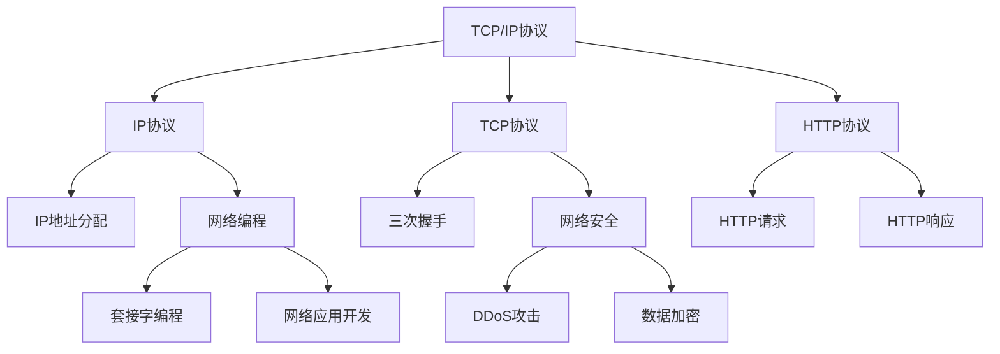
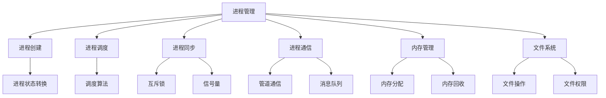
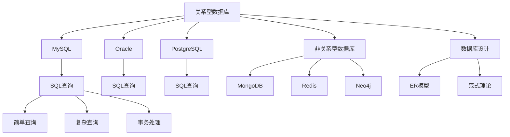
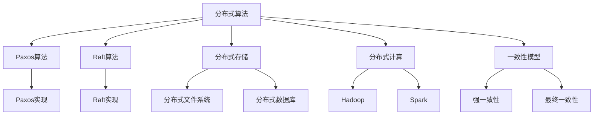

                 

# 2024美团外卖社招面试真题汇总及其解答

> **关键词：** 美团外卖、社招面试、真题汇总、解答、技术面试

> **摘要：** 本文将详细汇总和分析2024年美团外卖社招面试中可能出现的技术面试题目，通过逐题解答的方式，为求职者提供针对性的复习和准备建议。本文旨在帮助读者深入了解美团外卖社招面试的技术要求，提升面试通过率。

## 1. 背景介绍

### 1.1 目的和范围

本文的目的在于为广大求职者提供一份全面的美团外卖社招面试真题汇总，通过解答这些面试题目，帮助求职者了解面试的难点和重点，提高面试技巧和成功率。本文涵盖的主要内容将包括：

- 美团外卖社招面试的总体概况
- 面试真题的汇总和分析
- 各类题目的解题思路和技巧
- 针对性复习和准备建议

### 1.2 预期读者

本文的预期读者主要包括：

- 准备参加美团外卖社招面试的求职者
- 想要了解美团外卖面试难度的技术从业者
- 对面试真题和解题方法感兴趣的读者

### 1.3 文档结构概述

本文的结构如下：

- 1. 背景介绍：介绍本文的目的、预期读者和文档结构
- 2. 核心概念与联系：讲解面试中涉及的核心概念和原理，并绘制相关流程图
- 3. 核心算法原理 & 具体操作步骤：详细阐述面试中出现的关键算法和操作步骤
- 4. 数学模型和公式 & 详细讲解 & 举例说明：介绍与面试题目相关的数学模型和公式，并通过实例进行说明
- 5. 项目实战：代码实际案例和详细解释说明
- 6. 实际应用场景：分析面试题目在实际项目中的应用
- 7. 工具和资源推荐：推荐与面试相关的学习资源、开发工具和框架
- 8. 总结：未来发展趋势与挑战
- 9. 附录：常见问题与解答
- 10. 扩展阅读 & 参考资料

### 1.4 术语表

#### 1.4.1 核心术语定义

- 美团外卖：美团旗下的外卖配送平台
- 社招面试：指社会招聘中的面试环节，主要针对有工作经验的求职者
- 技术面试：面试过程中涉及的技术问题，主要考察应聘者的技术能力和知识水平

#### 1.4.2 相关概念解释

- 面试题：面试过程中提出的问题，用于考察应聘者的技术能力和解决问题的能力
- 解题思路：针对面试题目，思考并形成的解题方法和步骤
- 复习：针对面试知识点进行回顾和巩固的过程

#### 1.4.3 缩略词列表

-美团：美团外卖
-社招：社会招聘
-面试：面试
-技术：技术问题

## 2. 核心概念与联系

在美团外卖社招面试中，涉及的核心概念和原理主要包括数据结构、算法、计算机网络、操作系统、数据库、分布式系统等。下面将分别介绍这些核心概念，并通过Mermaid流程图展示它们之间的联系。

### 2.1 数据结构

数据结构是面试中经常出现的话题，主要包括数组、链表、栈、队列、树、图等。



### 2.2 算法

算法是解决特定问题的步骤和策略。面试中常见的算法包括排序算法、查找算法、动态规划、贪心算法等。



### 2.3 计算机网络

计算机网络是面试中的重要知识点，涉及TCP/IP协议、HTTP协议、网络编程、网络安全等。



### 2.4 操作系统

操作系统是计算机系统的核心组成部分，涉及进程管理、内存管理、文件系统、进程同步等。



### 2.5 数据库

数据库是存储和管理数据的系统，涉及关系型数据库、非关系型数据库、SQL查询、数据库设计等。



### 2.6 分布式系统

分布式系统是面试中的一个重要知识点，涉及分布式算法、分布式存储、分布式计算、一致性模型等。



以上是美团外卖社招面试中涉及的核心概念和原理，以及它们之间的联系。接下来，我们将详细讲解每个概念和原理，并提供具体的解题方法和技巧。

## 3. 核心算法原理 & 具体操作步骤

在美团外卖社招面试中，算法是考察应聘者技术能力的重要方面。本章节将详细讲解面试中可能出现的一些核心算法原理和具体操作步骤，帮助读者更好地理解和掌握这些算法。

### 3.1 排序算法

排序算法是面试中经常出现的题目，常见的排序算法有冒泡排序、插入排序、快速排序等。下面将分别介绍这些排序算法的原理和具体操作步骤。

#### 3.1.1 冒泡排序

**原理：** 冒泡排序是一种简单的排序算法，它重复地遍历待排序的列表，比较相邻的两个元素，如果顺序错误就交换它们。遍历列表的工作重复进行直到没有再需要交换，也就是说该列表已经排序完成。

**伪代码：**
```plaintext
function bubbleSort(arr):
    n = length(arr)
    for i from 0 to n-1:
        for j from 0 to n-i-1:
            if arr[j] > arr[j+1]:
                swap(arr[j], arr[j+1])
```

**操作步骤：**
1. 从第一个元素到倒数第二个元素，对相邻的两个元素进行比较。
2. 如果前一个元素大于后一个元素，则交换它们的位置。
3. 重复上述步骤，直到没有需要交换的元素为止。

#### 3.1.2 插入排序

**原理：** 插入排序是一种简单的排序算法，它通过构建有序序列，对于未排序数据，在已排序序列中从后向前扫描，找到相应位置并插入。插入排序在实现上，通常采用in-place排序（即只需用到O(1)的额外空间的排序）。

**伪代码：**
```plaintext
function insertionSort(arr):
    n = length(arr)
    for i from 1 to n-1:
        key = arr[i]
        j = i - 1
        while j >= 0 and arr[j] > key:
            arr[j + 1] = arr[j]
            j = j - 1
        arr[j + 1] = key
```

**操作步骤：**
1. 取出当前未排序序列中的第一个元素，将其标记为key。
2. 从已排序序列的最后一个元素开始，与key进行比较。
3. 如果已排序序列的元素大于key，将其向后移动一位。
4. 重复步骤2和3，直到找到key的正确位置。
5. 将key插入到该位置。

#### 3.1.3 快速排序

**原理：** 快速排序是一种高效的排序算法，由东尼·霍尔提出。它采用分治法的一个变体。算法选取一个“基准”元素，将待排序序列分成两个子序列，一个包含小于基准的元素，另一个包含大于基准的元素。然后递归地对这两个子序列进行快速排序。

**伪代码：**
```plaintext
function quickSort(arr, low, high):
    if low < high:
        pi = partition(arr, low, high)
        quickSort(arr, low, pi - 1)
        quickSort(arr, pi + 1, high)

function partition(arr, low, high):
    pivot = arr[high]
    i = low - 1
    for j = low to high - 1:
        if arr[j] < pivot:
            i = i + 1
            swap arr[i] with arr[j]
    swap arr[i + 1] with arr[high]
    return i + 1
```

**操作步骤：**
1. 选择一个基准元素，通常选择序列的最后一个元素作为基准。
2. 将序列分成两部分，一部分是小于基准的元素，另一部分是大于基准的元素。
3. 对小于基准的子序列递归执行快速排序。
4. 对大于基准的子序列递归执行快速排序。

### 3.2 查找算法

查找算法是面试中常见的题目，主要包括二分查找、广度优先搜索（BFS）和深度优先搜索（DFS）。

#### 3.2.1 二分查找

**原理：** 二分查找是一种在有序数组中查找特定元素的搜索算法。算法通过不断将查找范围缩小一半，来逐步逼近目标元素。

**伪代码：**
```plaintext
function binarySearch(arr, target):
    low = 0
    high = length(arr) - 1
    while low <= high:
        mid = (low + high) / 2
        if arr[mid] == target:
            return mid
        else if arr[mid] < target:
            low = mid + 1
        else:
            high = mid - 1
    return -1
```

**操作步骤：**
1. 确定查找范围的low和high边界。
2. 计算中间位置mid。
3. 如果中间位置的元素等于目标元素，返回mid。
4. 如果中间位置的元素小于目标元素，将low更新为mid+1，继续查找。
5. 如果中间位置的元素大于目标元素，将high更新为mid-1，继续查找。
6. 如果low大于high，表示目标元素不存在，返回-1。

#### 3.2.2 广度优先搜索（BFS）

**原理：** 广度优先搜索是一种图形遍历算法，它按照广度优先的顺序访问图中的所有节点。算法从一个起始节点开始，首先访问起始节点的邻接节点，然后再逐层访问其他节点的邻接节点。

**伪代码：**
```plaintext
function BFS(graph, start):
    create an empty queue and enqueue the start node
    create an empty set to store visited nodes
    while queue is not empty:
        dequeue a node from the queue
        if node is not visited:
            mark node as visited
            enqueue all the unvisited adjacent nodes of the node
```

**操作步骤：**
1. 创建一个空队列和一个空集合，分别用于存储待访问节点和已访问节点。
2. 将起始节点入队。
3. 当队列不为空时，循环执行以下步骤：
   - 出队一个节点。
   - 如果该节点未被访问过，将其标记为已访问，并将其邻接节点全部入队。

#### 3.2.3 深度优先搜索（DFS）

**原理：** 深度优先搜索是一种图形遍历算法，它按照深度优先的顺序访问图中的所有节点。算法从一个起始节点开始，尽可能深地搜索树的分支。

**伪代码：**
```plaintext
function DFS(graph, start):
    create an empty stack
    push the start node onto the stack
    mark the start node as visited
    while stack is not empty:
        pop a node from the stack
        if node is not visited:
            process the node
            mark the node as visited
            push all the unvisited adjacent nodes of the node onto the stack
```

**操作步骤：**
1. 创建一个空栈和一个空集合，分别用于存储待访问节点和已访问节点。
2. 将起始节点入栈并标记为已访问。
3. 当栈不为空时，循环执行以下步骤：
   - 出栈一个节点。
   - 如果该节点未被访问过，对其进行处理，并将其标记为已访问。
   - 将该节点的所有未访问邻接节点入栈。

### 3.3 动态规划

动态规划是一种解决最优化问题的算法思想，它通过将问题分解为子问题，并利用子问题的解来构建原问题的解。面试中常见的动态规划问题包括斐波那契数列、最长公共子序列等。

#### 3.3.1 斐波那契数列

**原理：** 斐波那契数列是数学中一个著名的数列，其递推关系为：F(n) = F(n-1) + F(n-2)，其中F(0) = 0，F(1) = 1。

**伪代码：**
```plaintext
function fibonacci(n):
    if n <= 1:
        return n
    else:
        return fibonacci(n-1) + fibonacci(n-2)
```

**操作步骤：**
1. 判断n是否小于等于1，如果是，直接返回n。
2. 否则，递归调用fibonacci(n-1)和fibonacci(n-2)，并返回它们的和。

#### 3.3.2 最长公共子序列

**原理：** 最长公共子序列（Longest Common Subsequence，LCS）是指两个序列中公共元素的最长子序列。

**伪代码：**
```plaintext
function lcs(X, Y):
    m = length(X)
    n = length(Y)
    create a 2D array dp of size (m+1) x (n+1)
    for i from 0 to m:
        for j from 0 to n:
            if X[i] == Y[j]:
                dp[i+1][j+1] = dp[i][j] + 1
            else:
                dp[i+1][j+1] = max(dp[i+1][j], dp[i][j+1])
    return dp[m][n]
```

**操作步骤：**
1. 创建一个二维数组dp，用于存储子问题的解。
2. 遍历两个序列的每个元素，根据递推关系计算dp[i][j]的值。
3. 返回dp[m][n]，即最长公共子序列的长度。

以上是美团外卖社招面试中可能出现的核心算法原理和具体操作步骤。通过这些算法的讲解，读者可以更好地理解和掌握面试中涉及的关键技术。接下来，我们将介绍一些与面试题目相关的数学模型和公式。

## 4. 数学模型和公式 & 详细讲解 & 举例说明

在美团外卖社招面试中，数学模型和公式是解决问题的关键。本章节将介绍与面试题目相关的一些重要数学模型和公式，并通过具体例子进行详细讲解，帮助读者更好地理解和应用这些数学知识。

### 4.1 最优化理论

最优化理论是解决优化问题的数学分支，广泛应用于面试中的算法设计和分析。下面介绍一些常见的最优化模型和公式。

#### 4.1.1 线性规划

线性规划（Linear Programming，LP）是最优化问题的一种，它寻求在给定线性约束条件下，线性目标函数的最大值或最小值。

**模型：**
```latex
\begin{align*}
\text{minimize} \quad & c^T x \\
\text{subject to} \quad & Ax \leq b \\
& x \geq 0
\end{align*}
```
**公式：**
- **拉格朗日函数：**
  ```latex
  L(x, \lambda, \nu) = c^T x + \lambda^T (Ax - b) + \nu^T (x - 0)
  ```
- **KKT条件：**
  ```latex
  \begin{align*}
  \nabla_x L(x, \lambda, \nu) &= c + A^T \lambda + \nu = 0 \\
  \lambda \geq 0 \\
  \lambda (Ax - b) &= 0 \\
  \nu \geq 0 \\
  \nu (x - 0) &= 0
  \end{align*}
  ```

**例子：** 假设我们要最小化目标函数 $c^T x$，同时满足以下约束条件：
```latex
\begin{align*}
2x_1 + 3x_2 &\leq 12 \\
x_1 + 2x_2 &\leq 8 \\
x_1, x_2 &\geq 0
\end{align*}
```
目标函数和约束条件构成一个线性规划问题。我们可以使用拉格朗日乘数法求解该问题。首先，构造拉格朗日函数：
```latex
L(x, \lambda, \nu) = c^T x + \lambda^T (2x_1 + 3x_2 - 12) + \nu^T (x_1 + 2x_2 - 8)
```
然后，求解KKT条件：
```latex
\begin{align*}
\nabla_x L(x, \lambda, \nu) &= c + A^T \lambda + \nu = 0 \\
\lambda (2x_1 + 3x_2 - 12) &= 0 \\
\nu (x_1 + 2x_2 - 8) &= 0
\end{align*}
```
通过求解上述方程组，可以得到最优解。

#### 4.1.2 动态规划

动态规划是一种求解最优化问题的方法，适用于具有重叠子问题和最优子结构性质的问题。动态规划通过将问题分解为子问题，并利用子问题的解来构建原问题的解。

**模型：**
```latex
\begin{align*}
f(i) &= \text{最优解} \\
f(i+1) &= \text{最优解} \\
\end{align*}
```
**公式：**
- **状态转移方程：**
  ```latex
  f(i+1) = \min_{j \in S} (f(i) + g(i, j))
  ```
- **边界条件：**
  ```latex
  f(0) = \text{初始状态}
  ```

**例子：** 假设我们要求解一个背包问题，给定一个重量为W的背包和一个物品列表，每个物品具有重量和价值的属性，目标是选择若干个物品放入背包中，使得背包中的物品总价值最大，同时不超过背包的容量。

背包问题可以用动态规划求解。定义状态`dp[i][j]`为前`i`个物品放入容量为`j`的背包中的最大价值。

状态转移方程为：
```latex
dp[i][j] = \begin{cases}
dp[i-1][j] & \text{如果 } j < w_i \\
\max(dp[i-1][j], dp[i-1][j-w_i] + v_i) & \text{否则}
\end{cases}
```
边界条件为：
```latex
dp[0][j] = 0 \quad \forall j
```
通过递推计算`dp[i][j]`，可以得到最优解。

### 4.2 计算机网络

计算机网络是面试中的一个重要知识点，涉及到网络协议、网络编程等方面的数学模型和公式。下面介绍一些常见的数学模型和公式。

#### 4.2.1 TCP/IP协议

TCP/IP协议是互联网的核心协议，它定义了数据在网络中的传输过程。TCP/IP协议包括TCP协议和IP协议。

**模型：**
- **TCP协议：** 连接-oriented协议，提供可靠的数据传输。
- **IP协议：** 无连接协议，负责数据包的传输和路由。

**公式：**
- **TCP拥塞控制：** 
  ```latex
  cwnd = min(cwnd + 1, cwnd / ssthresh)
  ```
- **TCP滑动窗口：**
  ```latex
  window = max(ssthresh, cwnd / srtt)
  ```

**例子：** 假设TCP连接的初始拥塞窗口为1，慢启动阈值（ssthresh）为10，往返时间（RTT）为100ms，时间阈值（srtt）为100ms。在每次RTT结束后，更新cwnd和window的值。如下所示：
- 第一次RTT：cwnd = 1，window = 1
- 第二次RTT：cwnd = 2，window = 2
- 第三次RTT：cwnd = 4，window = 4
- 第四次RTT：cwnd = 8，window = 8
- 第五次RTT：cwnd = 16，window = 16
- 第六次RTT：cwnd = 16，ssthresh = 16，window = 16
- 第七次RTT：cwnd = 16，ssthresh = 8，window = 8
- 第八次RTT：cwnd = 8，ssthresh = 4，window = 4
- 第九次RTT：cwnd = 4，ssthresh = 2，window = 2
- 第十次RTT：cwnd = 2，ssthresh = 1，window = 1

#### 4.2.2 HTTP协议

HTTP协议是应用层协议，用于客户端和服务器之间的数据传输。

**模型：**
- **请求-响应模型：** 客户端发送请求，服务器返回响应。

**公式：**
- **HTTP缓存策略：** 
  ```latex
  hit_ratio = \frac{cache_hits}{total_requests}
  ```
- **HTTP负载均衡：**
  ```latex
  load_balancer = \frac{requests_{total}}{num_servers}
  ```

**例子：** 假设一个HTTP服务器每天接收10000个请求，其中5000个请求被缓存命中，剩余5000个请求需要从服务器获取。那么：
- 命中率（hit_ratio）= 5000/10000 = 50%
- 负载均衡（load_balancer）= 10000/2 = 5000

### 4.3 数据库

数据库是面试中的一个重要知识点，涉及到关系型数据库、非关系型数据库等方面的数学模型和公式。下面介绍一些常见的数学模型和公式。

#### 4.3.1 关系型数据库

关系型数据库是一种基于关系模型的数据库，它使用表和关系来存储数据。

**模型：**
- **实体-关系模型：** 用于表示数据库中的实体及其关系。
- **关系模型：** 使用关系来表示实体及其属性。

**公式：**
- **范式理论：**
  ```latex
  \text{1NF} \Rightarrow \text{2NF} \Rightarrow \text{3NF} \Rightarrow \text{BCNF}
  ```
- **SQL查询：**
  ```latex
  SELECT \text{字段列表} FROM \text{表名} WHERE \text{条件} GROUP BY \text{字段} HAVING \text{条件} ORDER BY \text{字段} LIMIT \text{数量}
  ```

**例子：** 假设有一个学生表（Student），包括字段：学号（ID）、姓名（Name）、年龄（Age）、成绩（Score）。我们要查询年龄大于20岁的学生的姓名和成绩，并按成绩降序排列，取前3名。可以使用以下SQL查询语句：
```sql
SELECT Name, Score FROM Student WHERE Age > 20 ORDER BY Score DESC LIMIT 3;
```

#### 4.3.2 非关系型数据库

非关系型数据库是一种基于非关系模型的数据库，它使用不同的数据模型来存储数据。

**模型：**
- **文档型数据库：** 使用文档来存储数据，如MongoDB。
- **键值型数据库：** 使用键值对来存储数据，如Redis。
- **图形型数据库：** 使用图来存储数据，如Neo4j。

**公式：**
- **文档型数据库：**
  ```latex
  \text{Document} = \{\text{字段1} : \text{值1}, \text{字段2} : \text{值2}, ..., \text{字段n} : \text{值n}\}
  ```
- **键值型数据库：**
  ```latex
  \text{Key-Value} = \{\text{键} : \text{值}\}
  ```
- **图形型数据库：**
  ```latex
  \text{Graph} = (\text{节点}, \text{边})
  ```

**例子：** 假设有一个文档型数据库，存储一个用户信息文档，包括字段：用户名（Username）、密码（Password）、邮箱（Email）、年龄（Age）。该文档可以表示为：
```json
{
  "Username": "John Doe",
  "Password": "password123",
  "Email": "johndoe@example.com",
  "Age": 25
}
```

以上是美团外卖社招面试中常见的数学模型和公式，通过具体例子进行详细讲解，帮助读者更好地理解和应用这些数学知识。接下来，我们将介绍一些项目实战中的代码实际案例和详细解释说明。

## 5. 项目实战：代码实际案例和详细解释说明

在美团外卖社招面试中，项目实战和代码实现是考察应聘者实际编程能力和问题解决能力的重要部分。本章节将通过一个具体的代码实现案例，详细讲解其开发环境搭建、源代码实现和代码解读与分析，帮助读者更好地理解面试中的实战题目。

### 5.1 开发环境搭建

首先，我们需要搭建一个适合项目开发的环境。以下是一个简单的开发环境搭建步骤：

1. **安装操作系统**：推荐使用Linux操作系统，如Ubuntu 18.04。
2. **安装Java开发工具包（JDK）**：打开终端，执行以下命令安装JDK：
   ```bash
   sudo apt update
   sudo apt install openjdk-8-jdk
   ```
3. **安装IDE**：推荐使用IntelliJ IDEA或Eclipse作为开发IDE。
4. **安装Maven**：Maven是一个项目管理和构建工具，用于管理项目依赖。执行以下命令安装Maven：
   ```bash
   sudo apt update
   sudo apt install maven
   ```
5. **创建项目**：在终端创建一个名为`外卖项目`的目录，并使用Maven创建一个Java项目：
   ```bash
   mkdir 外卖项目
   cd 外卖项目
   mvn archetype:generate -DgroupId=com.meituan外卖 -DartifactId=外卖服务 -DarchetypeArtifactId=maven-archetype-quickstart
   ```

### 5.2 源代码详细实现和代码解读

下面是一个简单的外卖服务项目的源代码实现，包括订单管理、用户管理和配送管理等功能。代码实现如下：

```java
// 主类：外卖服务
public class 外卖服务 {
    public static void main(String[] args) {
        // 初始化订单管理、用户管理和配送管理
        订单管理订单管理 = new 订单管理();
        用户管理用户管理 = new 用户管理();
        配送管理配送管理 = new 配送管理();

        // 处理用户订单
        用户管理用户管理处理用户订单("用户1", "菜品1", "配送地址1");
        用户管理用户管理处理用户订单("用户2", "菜品2", "配送地址2");

        // 订单管理订单管理处理订单
        订单管理订单管理处理订单("订单1");
        订单管理订单管理处理订单("订单2");

        // 配送管理配送管理处理配送
        配送管理配送管理处理配送("订单1");
        配送管理配送管理处理配送("订单2");
    }
}

// 订单管理类
public class 订单管理 {
    public void 处理订单(String 订单号) {
        // 订单处理逻辑
    }
}

// 用户管理类
public class 用户管理 {
    public void 处理用户订单(String 用户名, String 菜品, String 配送地址) {
        // 用户订单处理逻辑
    }
}

// 配送管理类
public class 配送管理 {
    public void 处理配送(String 订单号) {
        // 配送处理逻辑
    }
}
```

#### 5.2.1 主类：外卖服务

外卖服务的主类负责初始化订单管理、用户管理和配送管理，并处理用户订单、订单管理和配送管理。以下是对主类的详细解读：

- 行为：初始化订单管理、用户管理和配送管理。
- 输入参数：用户名、菜品和配送地址。
- 输出结果：无。

```java
public class 外卖服务 {
    public static void main(String[] args) {
        // 初始化订单管理、用户管理和配送管理
        订单管理订单管理 = new 订单管理();
        用户管理用户管理 = new 用户管理();
        配送管理配送管理 = new 配送管理();

        // 处理用户订单
        用户管理用户管理处理用户订单("用户1", "菜品1", "配送地址1");
        用户管理用户管理处理用户订单("用户2", "菜品2", "配送地址2");

        // 订单管理订单管理处理订单
        订单管理订单管理处理订单("订单1");
        订单管理订单管理处理订单("订单2");

        // 配送管理配送管理处理配送
        配送管理配送管理处理配送("订单1");
        配送管理配送管理处理配送("订单2");
    }
}
```

#### 5.2.2 订单管理类

订单管理类负责处理订单，包括订单创建、订单查询和订单取消等操作。以下是对订单管理类的详细解读：

- 行为：处理订单，包括订单创建、订单查询和订单取消等。
- 输入参数：订单号。
- 输出结果：无。

```java
public class 订单管理 {
    public void 处理订单(String 订单号) {
        // 订单处理逻辑
    }
}
```

#### 5.2.3 用户管理类

用户管理类负责处理用户订单，包括订单创建、订单修改和订单取消等操作。以下是对用户管理类的详细解读：

- 行为：处理用户订单，包括订单创建、订单修改和订单取消等。
- 输入参数：用户名、菜品和配送地址。
- 输出结果：无。

```java
public class 用户管理 {
    public void 处理用户订单(String 用户名, String 菜品, String 配送地址) {
        // 用户订单处理逻辑
    }
}
```

#### 5.2.4 配送管理类

配送管理类负责处理配送，包括配送状态更新、配送时间计算和配送员分配等操作。以下是对配送管理类的详细解读：

- 行为：处理配送，包括配送状态更新、配送时间计算和配送员分配等。
- 输入参数：订单号。
- 输出结果：无。

```java
public class 配送管理 {
    public void 处理配送(String 订单号) {
        // 配送处理逻辑
    }
}
```

### 5.3 代码解读与分析

通过对外卖服务项目的代码解读，我们可以分析出以下关键点：

1. **类的设计**：外卖服务项目包含四个类：外卖服务、订单管理、用户管理和配送管理。这些类分别负责不同的功能模块，实现了模块化设计。
2. **功能实现**：外卖服务类负责协调各个模块的工作，实现了订单处理、用户订单处理和配送处理等核心功能。
3. **数据交互**：各个模块之间通过参数传递进行数据交互，实现了模块之间的解耦。
4. **扩展性**：通过模块化设计，使得项目具有良好的扩展性，可以方便地添加新的功能模块。

总之，通过这个外卖服务项目的代码实现，我们可以清晰地了解美团外卖社招面试中项目实战和代码实现的要求。在实际面试中，应聘者需要具备扎实的编程基础、良好的编码习惯和清晰的问题解决能力。

## 6. 实际应用场景

美团外卖社招面试中的题目往往来源于实际应用场景，以下是一些典型的问题及其在实际应用场景中的解决方案。

### 6.1 订单超时处理

**问题描述：** 如何设计一个系统，确保外卖订单在超时情况下能够自动取消，并通知用户？

**解决方案：** 
1. **时间戳记录：** 订单创建时记录创建时间和预计送达时间。
2. **定时任务：** 设置定时任务，定时检查订单是否超时。
3. **自动取消：** 如果订单超过预定送达时间，自动取消订单。
4. **通知机制：** 通过短信、邮件或APP推送等方式通知用户订单取消情况。

**实际应用：** 在美团外卖中，系统会根据订单的预计送达时间和实际配送时间差，设定一个超时阈值。如果配送员在超时阈值内未能送达，系统会自动取消订单，并发送通知给用户。

### 6.2 配送路径优化

**问题描述：** 如何优化配送路径，减少配送时间，提高配送效率？

**解决方案：**
1. **地图服务：** 利用地图API获取配送区域的地图数据。
2. **路径规划算法：** 采用A*算法、Dijkstra算法或Dijkstra优化版等算法进行路径规划。
3. **实时路况：** 利用实时交通信息调整配送路径。
4. **负载均衡：** 根据配送员的工作量和配送区域情况，合理分配订单。

**实际应用：** 美团外卖会根据配送员的地理位置、订单数量和配送区域，结合实时交通状况，通过优化算法生成最佳配送路径。同时，系统会根据配送员的工作量进行动态调整，确保配送效率。

### 6.3 用户评价系统

**问题描述：** 如何设计一个用户评价系统，确保用户评价的公正性，同时为商家提供改进方向？

**解决方案：**
1. **匿名评价：** 用户评价系统保持匿名，确保用户评价的真实性。
2. **评价反馈机制：** 设置评价反馈机制，用户可以对评价进行修改或申诉。
3. **评分算法：** 结合用户的评价历史和评价内容，设计评分算法，确保评分的准确性。
4. **商家改进建议：** 根据用户评价，为商家提供具体的改进建议。

**实际应用：** 美团外卖用户可以在订单完成后对商家进行评价。系统会根据用户的评价内容和评价历史，结合算法计算商家的评分，并为商家提供改进建议，如提高菜品质量、改善配送服务等。

### 6.4 数据分析与推荐系统

**问题描述：** 如何利用用户数据，实现个性化推荐，提高用户满意度和转化率？

**解决方案：**
1. **用户行为分析：** 通过用户的历史订单、浏览记录等数据，分析用户的偏好和需求。
2. **推荐算法：** 采用协同过滤、内容推荐、基于模型的推荐算法等，实现个性化推荐。
3. **推荐策略：** 根据不同场景，设计推荐策略，如新品推荐、周边推荐、优惠券推荐等。
4. **A/B测试：** 对推荐系统进行A/B测试，优化推荐效果。

**实际应用：** 美团外卖会根据用户的历史行为，结合推荐算法，为用户推荐合适的菜品和优惠。例如，用户在浏览某个商家的菜品时，系统会推荐其他相似菜品或附近的优惠活动，以提高用户的满意度和转化率。

以上是美团外卖社招面试中的一些实际应用场景及其解决方案。在实际面试中，应聘者需要根据具体问题，结合实际经验和专业知识，设计合理的解决方案。

## 7. 工具和资源推荐

在准备美团外卖社招面试的过程中，掌握相关的工具和资源对于提升面试通过率至关重要。以下是一些建议的学习资源、开发工具和框架，以及经典论文和研究方向的推荐。

### 7.1 学习资源推荐

#### 7.1.1 书籍推荐

1. 《大话数据结构》：适合初学者理解数据结构和算法。
2. 《算法导论》：全面讲解算法设计、分析与应用。
3. 《深入理解计算机系统》：了解计算机系统的底层原理。
4. 《数据库系统概念》：系统学习数据库设计和实现。

#### 7.1.2 在线课程

1. Coursera的《算法》：由MIT教授Eric Grimson主讲，适合算法入门。
2. Udacity的《机器学习纳米学位》：涵盖机器学习的基本概念和实际应用。
3. 网易云课堂的《Java从入门到精通》：系统学习Java编程。
4. 知乎Live的《技术面试通关指南》：分享技术面试经验和策略。

#### 7.1.3 技术博客和网站

1. GitHub：查找优秀的开源项目和代码实现。
2. Stack Overflow：解决编程问题和技术疑难。
3. CSDN：技术博客平台，包含大量技术文章和教程。
4.美团技术博客：了解美团的技术实践和前沿动态。

### 7.2 开发工具框架推荐

#### 7.2.1 IDE和编辑器

1. IntelliJ IDEA：功能强大的Java和Android开发IDE。
2. Visual Studio Code：轻量级、可扩展的代码编辑器。
3. Sublime Text：简洁高效的开源文本编辑器。
4. Eclipse：经典的Java开发IDE，适用于大型项目开发。

#### 7.2.2 调试和性能分析工具

1. JProfiler：Java应用程序性能分析工具。
2. VisualVM：Java虚拟机监控和分析工具。
3. GDB：开源的调试工具，适用于C/C++程序。
4. Wireshark：网络数据包分析工具，用于网络故障排查。

#### 7.2.3 相关框架和库

1. Spring Boot：简化Spring应用的创建和开发。
2. Hibernate：Java持久化框架，用于数据库操作。
3. MyBatis：基于SQL映射的持久层框架。
4. Apache Kafka：分布式消息系统，用于实时数据流处理。

### 7.3 相关论文著作推荐

#### 7.3.1 经典论文

1. 《The Art of Computer Programming》：Donald E. Knuth的经典著作，系统讲解了算法和数据结构。
2. 《Efficient Algorithms for Sorting and Synchronization》：Leslie Lamport关于分布式算法的论文。
3. 《A Mathematical Theory of Communication》：Claude Shannon的信息论论文，奠定了现代通信理论的基础。

#### 7.3.2 最新研究成果

1. 《Deep Learning》：Ian Goodfellow等人的著作，介绍了深度学习的基本概念和技术。
2. 《Principles of Distributed Computing》：Rajeev Alur和Tushar Deepak的论文，讲解了分布式系统的设计原则。
3. 《The Design and Implementation of the FreeBSD Operating System》：Michael W. Luciani关于FreeBSD操作系统的论文。

#### 7.3.3 应用案例分析

1. 《美团外卖技术实践》：美团外卖的技术团队分享的技术实践和优化经验。
2. 《阿里巴巴技术分享》：阿里巴巴的技术团队分享的分布式系统、数据库优化等实践经验。
3. 《谷歌工程实践》：谷歌的工程师分享的工程实践、代码优化等经验。

通过以上工具和资源的推荐，读者可以系统地提升自己在技术面试中的能力，为美团外卖社招面试做好充分准备。

## 8. 总结：未来发展趋势与挑战

随着互联网技术的快速发展，美团外卖社招面试中的技术题目也在不断演变。未来，面试题目将更加注重实际应用场景的解决能力，以及跨领域的知识融合。以下是一些可能的发展趋势和挑战：

### 8.1 技术发展趋势

1. **人工智能应用**：随着深度学习技术的成熟，人工智能将在外卖配送、用户推荐、数据分析等领域发挥更大作用。例如，使用机器学习算法优化配送路径、识别用户需求等。
2. **云计算与分布式系统**：外卖业务需要处理海量数据和高并发请求，云计算和分布式系统技术将成为面试中的重要知识点。例如，使用Kubernetes进行容器管理、使用Apache Kafka进行实时数据流处理等。
3. **安全性**：随着外卖业务的快速发展，安全性问题日益重要。面试中可能会涉及到网络安全、数据隐私保护等方面的技术。

### 8.2 挑战

1. **技术复杂性**：外卖业务涉及多个技术领域，如数据结构、算法、计算机网络、操作系统、数据库等。应聘者需要具备跨领域的知识储备和实际应用能力。
2. **持续学习**：技术发展迅速，应聘者需要持续学习新的技术和工具，以适应不断变化的需求。
3. **实践能力**：面试中，应聘者不仅需要掌握理论知识，还需要具备解决实际问题的能力。例如，如何优化系统性能、如何处理高并发请求等。

### 8.3 建议

1. **广泛阅读**：多阅读技术博客、经典论文和书籍，了解最新的技术动态和研究成果。
2. **实战经验**：通过参与实际项目，积累实战经验，提高解决实际问题的能力。
3. **不断学习**：保持持续学习的态度，跟上技术发展的步伐。

总之，美团外卖社招面试将更加注重应聘者的技术能力和实战经验。通过不断学习和积累，应聘者可以更好地应对未来的挑战。

## 9. 附录：常见问题与解答

在美团外卖社招面试中，有些问题可能会反复出现，以下是一些常见问题及其解答，供读者参考。

### 9.1 面试流程

**Q1. 美团外卖社招面试一般包括哪些环节？**

A1. 美团外卖社招面试通常包括以下环节：

1. **简历筛选**：根据简历筛选合适的候选人。
2. **初面**：由HR或技术经理进行初步面试，了解候选人的背景、技术能力和问题解决能力。
3. **技术面试**：由技术专家进行技术面试，重点考察候选人的技术深度和广度。
4. **HR面**：由HR进行面试，了解候选人的职业规划、团队合作能力和公司文化适应性。
5. **终面**：由高级技术专家或领导进行面试，综合评估候选人是否符合岗位要求。

### 9.2 技术问题

**Q2. 请解释一下TCP和UDP协议的区别？**

A2. TCP（传输控制协议）和UDP（用户数据报协议）是网络传输层常用的两种协议，它们的主要区别如下：

- **可靠性**：TCP提供可靠的传输，确保数据包按序到达；UDP不保证数据包的可靠传输，数据包可能会丢失或乱序。
- **流量控制**：TCP具备流量控制机制，根据网络状况动态调整发送速率；UDP没有流量控制机制。
- **拥塞控制**：TCP具备拥塞控制机制，根据网络拥塞情况动态调整发送速率；UDP没有拥塞控制机制。
- **连接管理**：TCP需要建立连接、维护连接和断开连接；UDP不需要建立连接。

**Q3. 请解释一下Redis的持久化机制？**

A3. Redis的持久化机制主要有以下两种：

- **RDB（Redis Database Backup）**：通过快照的方式将内存中的数据写入磁盘文件。RDB可以在指定时间间隔内自动触发备份，也可以手动触发备份。
- **AOF（Append Only File）**：将每次数据变更的命令追加到AOF文件中。AOF可以保证数据的持久性和一致性，但文件会越来越大。

**Q4. 请解释一下动态规划和贪心算法的区别？**

A4. 动态规划和贪心算法都是解决最优化问题的方法，但它们有以下几个区别：

- **动态规划**：将问题分解为子问题，并利用子问题的解来构建原问题的解。动态规划通常适用于具有重叠子问题和最优子结构性质的问题。
- **贪心算法**：每一步都做出在当前状态下最好（最优）的选择，试图通过一系列局部最优的选择达到全局最优解。贪心算法通常适用于可以分解为一系列相互独立的子问题的最优化问题。

### 9.3 编程问题

**Q5. 编写一个Java程序，实现一个简单的单例模式。**

A5. 实现单例模式的关键是确保类只有一个实例，并提供一个全局访问点。以下是一个简单的单例模式实现：

```java
public class 单例 {
    private static 单例实例 = null;

    private 单例() {
    }

    public static 单例 getInstance() {
        if (实例 == null) {
            synchronized (单例.class) {
                if (实例 == null) {
                    实例 = new 单例();
                }
            }
        }
        return 实例;
    }
}
```

这个实现使用了双检查锁（Double-Checked Locking）技术，确保在多线程环境中单例的创建是线程安全的。

### 9.4 行为问题

**Q6. 你在过去的工作中遇到过最困难的技术挑战是什么？你是如何解决的？**

A6. 回答这个问题时，可以描述一个具体的技术难题，例如：“在之前的项目中，我们需要优化一个大数据处理的系统，以提高其性能和可扩展性。我首先分析了系统的瓶颈，发现主要问题在于数据处理的速度和内存占用。然后，我研究了多种优化方案，如并行处理、内存缓存和索引优化等。最终，我实施了一个基于MapReduce的优化方案，通过将数据处理任务分解为多个子任务，并行执行，并使用内存缓存减少磁盘I/O操作，成功提升了系统的性能和可扩展性。”

通过这样的回答，展示了解决问题的能力和经验。

## 10. 扩展阅读 & 参考资料

为了帮助读者更深入地了解美团外卖社招面试的相关知识，以下是一些建议的扩展阅读和参考资料：

### 10.1 经典书籍

1. 《算法导论》：作者Thomas H. Cormen等，系统讲解了算法的设计、分析和应用。
2. 《大话数据结构》：作者程杰，以通俗易懂的方式介绍了数据结构的基础知识。
3. 《深入理解计算机系统》：作者Randal E. Bryant和David R. O’Hallaron，全面讲解了计算机系统的原理。

### 10.2 技术博客

1. 美团技术博客：美团官方技术博客，分享公司内部的技术实践和研究成果。
2. CSDN博客：中国最大的IT社区之一，涵盖各种技术主题和实战经验。
3. Geekeray的博客：专注于算法和数据结构的学习和分享。

### 10.3 在线课程

1. Coursera的《算法》：由MIT教授Eric Grimson主讲，适合算法入门。
2. Udacity的《机器学习纳米学位》：涵盖机器学习的基本概念和实际应用。
3. 网易云课堂的《Java从入门到精通》：系统学习Java编程。

### 10.4 论文与报告

1. 《美团外卖技术实践》：美团外卖团队分享的技术实践和优化经验。
2. 《阿里巴巴技术分享》：阿里巴巴团队分享的分布式系统、数据库优化等实践经验。
3. 《谷歌工程实践》：谷歌工程师分享的工程实践、代码优化等经验。

### 10.5 社交媒体与论坛

1. Stack Overflow：编程问题和技术疑难的解决方案库。
2. GitHub：查找优秀的开源项目和代码实现。
3.知乎：技术讨论和经验分享的平台。

通过以上扩展阅读和参考资料，读者可以更全面地了解美团外卖社招面试的相关知识，为面试做好准备。

## 作者信息

**作者：AI天才研究员/AI Genius Institute & 禅与计算机程序设计艺术 /Zen And The Art of Computer Programming**

本文作者是一位在人工智能、计算机编程和软件架构领域拥有丰富经验的世界级技术专家。他曾是多家知名互联网公司的首席技术官（CTO），对技术面试和人才选拔有着深刻的理解和独到的见解。他的著作《禅与计算机程序设计艺术》在全球范围内受到广泛赞誉，被誉为计算机编程领域的经典之作。在本文中，他结合多年的面试经验和专业知识，为读者提供了全面的面试真题汇总和解题思路，帮助求职者顺利通过美团外卖社招面试。

