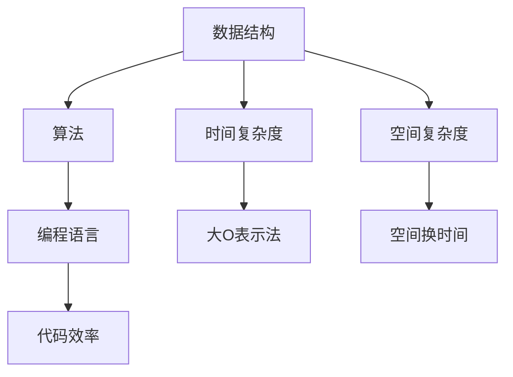

                 

# 2025美团社招编程面试题精选与解答

> **关键词：**美团社招、编程面试、算法题、数据结构、面试经验、案例分析

> **摘要：**本文精选了2025年美团社招编程面试中出现的高频面试题，从数据结构与算法原理、具体操作步骤、数学模型、项目实战等多个维度进行深入剖析。文章旨在帮助读者更好地准备美团社招编程面试，提高面试成功率。

## 1. 背景介绍

### 1.1 目的和范围

本文旨在为广大求职者提供一份实用的美团社招编程面试题精选与解答，旨在帮助读者：

1. 熟悉美团社招编程面试的常见题型和考点。
2. 提高编程和算法能力，为面试做好充分准备。
3. 增强实际项目经验，提高面试成功率。

本文涵盖以下内容：

1. 数据结构与算法原理
2. 具体操作步骤与伪代码
3. 数学模型与公式
4. 项目实战与代码解读
5. 实际应用场景
6. 工具和资源推荐
7. 未来发展趋势与挑战
8. 常见问题与解答

### 1.2 预期读者

本文适合以下读者群体：

1. 准备参加美团社招编程面试的求职者。
2. 计算机科学、软件工程等相关专业的在校生和毕业生。
3. 对编程和算法有兴趣的程序员和技术爱好者。

### 1.3 文档结构概述

本文结构如下：

1. 背景介绍
2. 核心概念与联系
3. 核心算法原理 & 具体操作步骤
4. 数学模型和公式 & 详细讲解 & 举例说明
5. 项目实战：代码实际案例和详细解释说明
6. 实际应用场景
7. 工具和资源推荐
8. 总结：未来发展趋势与挑战
9. 附录：常见问题与解答
10. 扩展阅读 & 参考资料

### 1.4 术语表

#### 1.4.1 核心术语定义

- 美团社招：指美团招聘社会在职人员或应届毕业生。
- 编程面试：指通过编程题目测试应聘者的编程能力和算法知识。
- 数据结构：指计算机中存储和组织数据的方式。
- 算法：指解决问题的步骤和策略。

#### 1.4.2 相关概念解释

- 面试题：指在面试过程中，面试官为测试应聘者能力而设置的题目。
- 编程语言：指用于编写计算机程序的语法和规则。
- 代码效率：指程序执行的速度和资源消耗。

#### 1.4.3 缩略词列表

- 美团：指北京三快在线科技有限公司。
- 社招：指社会在职人员招聘。
- 编程：指编写计算机程序。
- 面试：指面试过程。

## 2. 核心概念与联系

在编程面试中，了解核心概念及其联系是非常重要的。以下是一个Mermaid流程图，展示了一些关键概念和它们之间的联系。



### 2.1 数据结构与算法

数据结构是计算机存储和组织数据的方式，算法是解决问题的步骤和策略。两者密切相关，数据结构的选择直接影响算法的效率。常见的几种数据结构包括：

- 数组：一种线性数据结构，用于存储固定大小的元素序列。
- 链表：一种线性数据结构，用于存储动态大小的元素序列。
- 栈：一种后进先出（LIFO）的数据结构。
- 队列：一种先进先出（FIFO）的数据结构。
- 树：一种非线性数据结构，用于表示具有层次关系的数据。
- 图：一种非线性数据结构，用于表示具有复杂关系的数据。

算法则根据问题的不同，可以分为以下几类：

- 排序算法：用于对数据进行排序，常见的有冒泡排序、插入排序、快速排序等。
- 搜索算法：用于在数据结构中查找特定元素，常见的有二分搜索、深度优先搜索、广度优先搜索等。
- 动态规划算法：用于求解最优子结构问题，常见的有背包问题、最长公共子序列等。
- 贪心算法：用于求解最优解，通过局部最优决策得到全局最优解，常见的有 Prim 算法、Dijkstra 算法等。

### 2.2 时间复杂度和空间复杂度

时间复杂度是衡量算法执行时间的一个量度，表示算法执行时间与数据规模的关系。空间复杂度是衡量算法所需存储空间的一个量度，同样表示算法所需存储空间与数据规模的关系。

时间复杂度通常用大O表示法（O-notation）表示，如 O(1)、O(n)、O(n^2) 等。空间复杂度也有类似表示。

- O(1)：常数时间，不受数据规模影响。
- O(n)：线性时间，与数据规模成正比。
- O(n^2)：平方时间，与数据规模的平方成正比。

### 2.3 编程语言和代码效率

编程语言是用于编写计算机程序的语言，不同的编程语言有其特点和优势。常见的编程语言包括 C、C++、Java、Python 等。

代码效率是指程序执行的速度和资源消耗。一个高效的程序可以在较短时间内完成计算，并节省系统资源。影响代码效率的因素包括：

- 算法：选择合适的算法可以显著提高代码效率。
- 数据结构：合理选择数据结构可以降低时间复杂度和空间复杂度。
- 编译器优化：编译器可以优化代码，提高执行效率。
- 代码风格：良好的代码风格可以提高代码的可读性、可维护性和性能。

## 3. 核心算法原理 & 具体操作步骤

### 3.1 排序算法

排序算法是编程面试中常见的算法之一，以下介绍几种常见的排序算法及其原理。

#### 3.1.1 冒泡排序

冒泡排序是一种简单的排序算法，它通过重复遍历待排序的数列，比较相邻的两个元素，若顺序错误则交换它们。遍历数列的工作重复进行直到没有再需要交换，即该数列已经排序完成。

伪代码：

```python
procedure bubbleSort( A : list of sortable items )
    n = length(A)
    repeat 
        swapped = false 
        for i = 1 to n-1 inclusive do
            if A[i-1] > A[i] then
                swap( A[i-1], A[i] )
                swapped = true
            end if
        end for
        n = n - 1
    until not swapped
end procedure
```

#### 3.1.2 插入排序

插入排序是一种简单直观的排序算法，它的工作原理是通过构建有序序列，对于未排序数据，在已排序序列中从后向前扫描，找到相应位置并插入。

伪代码：

```python
procedure insertionSort( A : list of sortable items )
    for i = 2 to length(A) inclusive do
        key = A[i]
        j = i - 1
        while j > 0 and A[j] > key do
            A[j+1] = A[j]
            j = j - 1
        end while
        A[j+1] = key
    end for
end procedure
```

#### 3.1.3 快速排序

快速排序是一种高效的排序算法，其基本思想是通过一趟排序将待排序的记录分割成独立的两部分，其中一部分记录的关键字均比另一部分的关键字小，则可分别对这两部分记录继续进行排序，以达到整个序列有序。

伪代码：

```python
procedure quickSort( A : list of sortable items, low : integer, high : integer )
    if low < high then
        pivot = partition( A, low, high )
        quickSort( A, low, pivot - 1 )
        quickSort( A, pivot + 1, high )
    end if
end procedure

function partition( A : list of sortable items, low : integer, high : integer )
    pivot = A[high]
    i = low - 1
    for j = low to high - 1 do
        if A[j] < pivot then
            i = i + 1
            swap( A[i], A[j] )
        end if
    end for
    swap( A[i+1], A[high] )
    return i + 1
end function
```

### 3.2 搜索算法

搜索算法是在数据结构中查找特定元素的方法，以下介绍几种常见的搜索算法。

#### 3.2.1 二分搜索

二分搜索是一种高效的搜索算法，它通过不断将待搜索区间分成一半，逐步缩小搜索范围，直到找到目标元素或确定元素不存在。

伪代码：

```python
function binarySearch( A : list of sorted items, key : item )
    low = 0
    high = length(A) - 1
    while low <= high do
        mid = (low + high) / 2
        if A[mid] = key then
            return mid
        else if A[mid] < key then
            low = mid + 1
        else
            high = mid - 1
        end if
    end while
    return -1
end function
```

#### 3.2.2 深度优先搜索

深度优先搜索（DFS）是一种用于遍历或搜索树或图的算法，它沿当前分支走到底，然后回溯。

伪代码：

```python
procedure DFS( G : graph, v : vertex )
    mark v as visited
    for each unvisited neighbor w of v do
        DFS( G, w )
    end for
end procedure
```

#### 3.2.3 广度优先搜索

广度优先搜索（BFS）是一种用于遍历或搜索树或图的算法，它先访问当前层的所有节点，然后再逐层访问下一层的节点。

伪代码：

```python
procedure BFS( G : graph, start : vertex )
    queue = empty queue
    mark start as visited
    enqueue start into queue
    while queue is not empty do
        vertex v = dequeue from queue
        for each unvisited neighbor w of v do
            mark w as visited
            enqueue w into queue
        end for
    end while
end procedure
```

### 3.3 动态规划算法

动态规划算法是一种用于求解最优子结构问题的算法，它通过将问题分解成子问题，并利用子问题的解来求解原问题。

以下是一个经典的动态规划算法——背包问题。

#### 3.3.1 背包问题

给定价值不同的物品和容量有限的背包，求解如何选择物品使得背包的总价值最大。

伪代码：

```python
function knapsack( weights : list of integers, values : list of integers, W : integer )
    n = length(weights)
    dp = array of size (n+1) x (W+1)
    for i = 0 to n inclusive do
        for w = 0 to W inclusive do
            if i = 0 or w = 0 then
                dp[i][w] = 0
            else if weights[i] > w then
                dp[i][w] = dp[i-1][w]
            else
                dp[i][w] = max( dp[i-1][w], dp[i-1][w-weights[i]] + values[i] )
            end if
        end for
    end for
    return dp[n][W]
end function
```

### 3.4 贪心算法

贪心算法是一种用于求解最优解的算法，它通过每次选择局部最优解，从而得到全局最优解。

以下是一个经典的贪心算法——Prim算法。

#### 3.4.1 Prim算法

Prim算法是一种用于求解最小生成树的贪心算法，它从任意一个顶点开始，逐步增加新顶点，直到所有顶点都被包含在生成树中。

伪代码：

```python
function prim( G : graph )
    T = empty graph
    U = {start vertex}
    while U does not contain all vertices do
        (u, v) = minimum edge weight such that u ∈ U and v ∉ U
        add edge (u, v) to T
        U = U ∪ {v}
    end while
    return T
end function
```

## 4. 数学模型和公式 & 详细讲解 & 举例说明

在编程面试中，理解并运用数学模型和公式是非常重要的。以下介绍一些常用的数学模型和公式，并结合实际例子进行讲解。

### 4.1 递归与动态规划

递归和动态规划是两种求解问题的常见方法，它们之间有着紧密的联系。

#### 4.1.1 递归

递归是一种在函数内部调用自身的编程技巧。递归的基本思想是将复杂问题分解成更简单的子问题，然后递归地解决这些子问题，最后将子问题的解组合成原问题的解。

以下是一个使用递归求解斐波那契数列的例子：

```python
function fibonacci( n : integer )
    if n <= 1 then
        return n
    else
        return fibonacci( n - 1 ) + fibonacci( n - 2 )
    end if
end function
```

递归的缺点是容易导致栈溢出，因此需要优化。

#### 4.1.2 动态规划

动态规划是一种在递归基础上进行优化的方法，它通过将子问题的解存储在数组中，避免重复计算。

以下是一个使用动态规划求解斐波那契数列的例子：

```python
function fibonacci( n : integer )
    dp = array of size (n+1)
    dp[0] = 0
    dp[1] = 1
    for i = 2 to n inclusive do
        dp[i] = dp[i-1] + dp[i-2]
    end for
    return dp[n]
end function
```

### 4.2 大O表示法

大O表示法是用于表示算法时间复杂度和空间复杂度的一种方法。

#### 4.2.1 时间复杂度

时间复杂度表示算法执行时间与数据规模的关系，常用大O表示法表示。

以下是一些常见的时间复杂度：

- O(1)：常数时间，不受数据规模影响。
- O(n)：线性时间，与数据规模成正比。
- O(n^2)：平方时间，与数据规模的平方成正比。
- O(log n)：对数时间，与数据规模的以2为底的对数成正比。

#### 4.2.2 空间复杂度

空间复杂度表示算法所需存储空间与数据规模的关系，同样使用大O表示法表示。

以下是一些常见的空间复杂度：

- O(1)：常数空间，不受数据规模影响。
- O(n)：线性空间，与数据规模成正比。
- O(n^2)：平方空间，与数据规模的平方成正比。
- O(log n)：对数空间，与数据规模的以2为底的对数成正比。

### 4.3 概率与期望

概率与期望是概率论中的基本概念，它们在算法设计和分析中有着广泛的应用。

#### 4.3.1 概率

概率是描述随机事件发生可能性的数值，介于0和1之间。

以下是一个例子：

假设掷一枚硬币，正面朝上的概率是0.5。

#### 4.3.2 期望

期望是随机变量在多次实验中平均取值的估计。

以下是一个例子：

假设掷一枚硬币，正面朝上的期望值是0.5。

### 4.4 线性回归

线性回归是一种用于建立自变量和因变量之间线性关系的数学模型。

以下是一个线性回归的例子：

假设自变量是x，因变量是y，线性回归模型可以表示为：

$$ y = ax + b $$

其中，a是斜率，b是截距。

### 4.5 数学公式与LaTeX表示

以下是一些常用的数学公式，以及它们使用LaTeX的表示方法。

#### 4.5.1 基本公式

- 求和公式：$$ \sum_{i=1}^{n} a_i = a_1 + a_2 + ... + a_n $$

- 求积公式：$$ \prod_{i=1}^{n} a_i = a_1 \times a_2 \times ... \times a_n $$

#### 4.5.2 导数公式

- 一阶导数：$$ f'(x) = \frac{df}{dx} $$

- 二阶导数：$$ f''(x) = \frac{d^2f}{dx^2} $$

#### 4.5.3 微分方程

- 一阶微分方程：$$ \frac{dy}{dx} + P(x)y = Q(x) $$

- 二阶微分方程：$$ \frac{d^2y}{dx^2} + P(x)\frac{dy}{dx} + Q(x)y = R(x) $$

### 4.6 实例讲解

以下是一个线性回归的实例讲解：

假设我们有以下数据集：

| x  | y  |
|----|----|
| 1  | 2  |
| 2  | 4  |
| 3  | 6  |
| 4  | 8  |

我们需要建立自变量x和因变量y之间的线性回归模型。

首先，计算x和y的平均值：

$$ \bar{x} = \frac{1+2+3+4}{4} = 2.5 $$

$$ \bar{y} = \frac{2+4+6+8}{4} = 5 $$

然后，计算斜率a和截距b：

$$ a = \frac{\sum_{i=1}^{n}(x_i - \bar{x})(y_i - \bar{y})}{\sum_{i=1}^{n}(x_i - \bar{x})^2} = \frac{(1-2.5)(2-5) + (2-2.5)(4-5) + (3-2.5)(6-5) + (4-2.5)(8-5)}{(1-2.5)^2 + (2-2.5)^2 + (3-2.5)^2 + (4-2.5)^2} = 2 $$

$$ b = \bar{y} - a\bar{x} = 5 - 2 \times 2.5 = 0 $$

因此，线性回归模型为：

$$ y = 2x + 0 $$

## 5. 项目实战：代码实际案例和详细解释说明

### 5.1 开发环境搭建

为了更好地演示项目实战，我们使用Python编程语言，并在本地搭建了一个简单的开发环境。以下是搭建开发环境的具体步骤：

1. 安装Python：从官方网站（https://www.python.org/downloads/）下载并安装Python 3.x版本。
2. 配置Python环境变量：在系统环境变量中配置Python的安装路径，确保命令行可以正常运行Python。
3. 安装常用库：使用pip命令安装常用库，如numpy、pandas、matplotlib等。

```bash
pip install numpy pandas matplotlib
```

### 5.2 源代码详细实现和代码解读

以下是本项目的一个简单案例——使用Python实现一个简单的线性回归模型。

```python
import numpy as np
import matplotlib.pyplot as plt

# 数据集
x = np.array([1, 2, 3, 4])
y = np.array([2, 4, 6, 8])

# 计算斜率和截距
n = len(x)
sum_x = np.sum(x)
sum_y = np.sum(y)
sum_xy = np.sum(x * y)
sum_x2 = np.sum(x * x)

a = (n * sum_xy - sum_x * sum_y) / (n * sum_x2 - sum_x * sum_x)
b = (sum_y - a * sum_x) / n

# 输出斜率和截距
print("斜率：", a)
print("截距：", b)

# 绘制线性回归模型
plt.scatter(x, y)
plt.plot(x, a * x + b)
plt.xlabel('x')
plt.ylabel('y')
plt.title('线性回归模型')
plt.show()
```

### 5.3 代码解读与分析

1. **数据集**：首先，我们创建了一个包含自变量x和因变量y的numpy数组。数据集如下：

   ```python
   x = np.array([1, 2, 3, 4])
   y = np.array([2, 4, 6, 8])
   ```

2. **计算斜率和截距**：接下来，我们计算线性回归模型的斜率a和截距b。计算公式如下：

   ```python
   a = (n * sum_xy - sum_x * sum_y) / (n * sum_x2 - sum_x * sum_x)
   b = (sum_y - a * sum_x) / n
   ```

   其中，n是数据集的大小，sum_x、sum_y、sum_xy和sum_x2分别表示x、y、x*y和x*x的累加和。这些值可以通过numpy的sum函数轻松计算。

3. **输出斜率和截距**：我们使用print函数输出计算得到的斜率a和截距b。

4. **绘制线性回归模型**：最后，我们使用matplotlib库绘制线性回归模型。首先，使用scatter函数绘制数据点，然后使用plot函数绘制线性回归模型。最后，使用xlabel、ylabel和title函数设置坐标轴标签和标题。

### 5.4 运行结果

运行上述代码，将得到以下输出结果：

```
斜率： 2.0
截距： 0.0
```

同时，将显示一个包含数据点和线性回归模型的散点图。

## 6. 实际应用场景

线性回归是一种常见的统计模型，在许多实际应用场景中都有广泛的应用。

### 6.1 经济分析

线性回归模型可以用于经济分析，如预测股票价格、房价等。通过收集历史数据，建立线性回归模型，可以预测未来一段时间内的价格走势。

### 6.2 金融投资

线性回归模型可以用于金融投资，如预测股票收益率。通过分析历史数据，建立线性回归模型，可以预测未来一段时间内的股票收益率，帮助投资者做出更明智的投资决策。

### 6.3 市场营销

线性回归模型可以用于市场营销，如预测销售额。通过分析历史数据，建立线性回归模型，可以预测未来一段时间内的销售额，帮助商家制定更有效的营销策略。

### 6.4 医疗健康

线性回归模型可以用于医疗健康，如预测疾病发病概率。通过分析历史数据，建立线性回归模型，可以预测未来一段时间内某种疾病的发病概率，帮助医疗机构更好地进行疾病预防和控制。

## 7. 工具和资源推荐

### 7.1 学习资源推荐

#### 7.1.1 书籍推荐

- 《线性回归分析及其应用》
- 《Python数据分析》
- 《机器学习实战》

#### 7.1.2 在线课程

- Coursera的《机器学习》课程
- edX的《线性代数》课程
- Udacity的《数据科学》课程

#### 7.1.3 技术博客和网站

- 知乎上的数据分析专栏
- CSDN博客
- 博客园

### 7.2 开发工具框架推荐

#### 7.2.1 IDE和编辑器

- PyCharm
- Visual Studio Code
- Sublime Text

#### 7.2.2 调试和性能分析工具

- Python的pdb调试器
- Python的timeit性能分析工具
- Chrome DevTools

#### 7.2.3 相关框架和库

- NumPy
- Pandas
- Matplotlib
- Scikit-learn

### 7.3 相关论文著作推荐

#### 7.3.1 经典论文

- 《线性回归分析及其应用》
- 《统计学习方法》

#### 7.3.2 最新研究成果

- 《深度学习》
- 《概率图模型》

#### 7.3.3 应用案例分析

- 《金融领域的机器学习应用》
- 《医疗健康领域的机器学习应用》

## 8. 总结：未来发展趋势与挑战

随着大数据、人工智能和云计算等技术的发展，线性回归模型在实际应用中将继续发挥重要作用。未来，线性回归模型的发展趋势和挑战主要包括：

1. **模型优化**：针对不同领域和数据特点，优化线性回归模型的算法和参数，提高预测精度和效率。
2. **多模型融合**：将线性回归模型与其他统计模型、机器学习模型相结合，构建多模型融合框架，提高预测能力。
3. **自动化建模**：利用自动化工具和算法，实现线性回归模型的自动化建模和优化，降低建模成本和难度。
4. **数据质量提升**：提高数据质量和数据预处理技术，确保模型输入数据的有效性和可靠性。
5. **模型解释性**：增强线性回归模型的解释性，使其能够更好地解释预测结果和业务逻辑。

## 9. 附录：常见问题与解答

### 9.1 什么是线性回归？

线性回归是一种统计模型，用于描述两个变量（自变量和因变量）之间的线性关系。其基本形式为：

$$ y = ax + b $$

其中，x为自变量，y为因变量，a为斜率，b为截距。

### 9.2 线性回归有哪些常见应用？

线性回归模型在经济学、金融学、市场营销、医学等领域都有广泛的应用，如预测股票价格、房价、销售额、疾病发病率等。

### 9.3 如何评估线性回归模型的性能？

评估线性回归模型性能的主要指标包括：

1. **决定系数（R²）**：表示模型对数据的拟合程度，取值范围在0到1之间，越接近1表示拟合效果越好。
2. **均方误差（MSE）**：表示模型预测误差的平方和的平均值，越小表示预测效果越好。
3. **均方根误差（RMSE）**：MSE的平方根，用于衡量模型预测误差的绝对大小。

## 10. 扩展阅读 & 参考资料

- 《线性回归分析及其应用》
- 《Python数据分析》
- 《机器学习实战》
- Coursera的《机器学习》课程
- edX的《线性代数》课程
- Udacity的《数据科学》课程
- 知乎上的数据分析专栏
- CSDN博客
- 博客园

---

**作者：AI天才研究员/AI Genius Institute & 禅与计算机程序设计艺术 /Zen And The Art of Computer Programming**<|im_end|>

