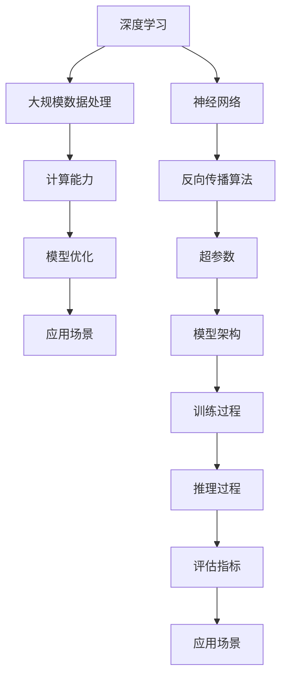

                 

# 美国大模型公司的现状与未来

## 概述

> “大模型”作为一种新兴的技术力量，正在重新定义美国乃至全球的科技产业。本文旨在探讨美国大模型公司的现状与未来，解析其技术发展、市场格局及面临的挑战。关键词：大模型、深度学习、人工智能、市场格局、挑战。

### 摘要

本文首先回顾了美国大模型公司的发展历程，分析其现状，包括技术进步、应用场景和市场份额。接着，探讨了未来发展趋势，如技术突破、行业竞争和法规政策的影响。随后，文章详细介绍了大模型公司所面临的关键挑战，包括数据隐私、安全性和道德伦理问题。最后，文章总结了大模型公司的发展前景，并提出了一些建议和预测。

## 1. 背景介绍

### 1.1 目的和范围

本文旨在深入分析美国大模型公司的现状与未来，探讨其在人工智能（AI）领域的技术发展、市场地位和面临的挑战。文章将重点关注以下几个方面：

- 美国大模型公司的历史背景和发展历程；
- 当前技术现状和主要应用领域；
- 市场格局和竞争态势；
- 面临的主要挑战和未来发展方向。

### 1.2 预期读者

本文适合以下读者群体：

- 人工智能领域的研究人员和技术工程师；
- 科技行业的企业家和投资者；
- 对人工智能技术和产业发展感兴趣的读者。

### 1.3 文档结构概述

本文分为十个部分：

1. 背景介绍
2. 核心概念与联系
3. 核心算法原理 & 具体操作步骤
4. 数学模型和公式 & 详细讲解 & 举例说明
5. 项目实战：代码实际案例和详细解释说明
6. 实际应用场景
7. 工具和资源推荐
8. 总结：未来发展趋势与挑战
9. 附录：常见问题与解答
10. 扩展阅读 & 参考资料

### 1.4 术语表

#### 1.4.1 核心术语定义

- **大模型**：指具有数十亿至千亿参数规模的深度学习模型，如GPT、BERT等；
- **深度学习**：一种基于人工神经网络的学习方法，通过多层非线性变换提取特征；
- **人工智能**：指计算机系统模拟人类智能行为的技术和应用。

#### 1.4.2 相关概念解释

- **神经网络**：一种模仿生物神经网络的结构和功能的计算模型；
- **反向传播算法**：一种用于训练神经网络的方法，通过反向传播误差来更新网络权重；
- **超参数**：用于调整模型性能的参数，如学习率、批量大小等；
- **模型架构**：模型的组成结构，包括层数、神经元个数、连接方式等。

#### 1.4.3 缩略词列表

- **AI**：人工智能（Artificial Intelligence）；
- **GPT**：生成预训练网络（Generative Pre-trained Transformer）；
- **BERT**：双向编码表示（Bidirectional Encoder Representations from Transformers）；
- **GPU**：图形处理器（Graphics Processing Unit）。

## 2. 核心概念与联系

大模型的发展离不开以下几个核心概念和技术的支持：

1. **深度学习**：深度学习是构建大模型的基础技术，通过多层神经网络进行特征提取和表示学习；
2. **大规模数据处理**：大模型需要处理海量数据，因此大数据处理技术是实现大模型训练的重要环节；
3. **计算能力**：大模型的训练和推理需要强大的计算资源，特别是GPU和TPU等专用硬件；
4. **模型优化**：通过模型压缩、蒸馏、量化等技术，提升大模型的性能和可解释性。

下面给出一个Mermaid流程图，展示大模型的主要组成部分和联系：



## 3. 核心算法原理 & 具体操作步骤

### 3.1 深度学习算法原理

深度学习算法主要基于多层神经网络，通过逐层提取特征，实现对数据的表征和预测。以下是深度学习算法的核心原理和步骤：

#### 3.1.1 神经网络结构

神经网络由输入层、隐藏层和输出层组成。每个神经元接收前一层神经元的输出，并通过激活函数进行非线性变换。

#### 3.1.2 激活函数

激活函数用于引入非线性因素，常见的激活函数包括Sigmoid、ReLU、Tanh等。

#### 3.1.3 前向传播

前向传播过程中，每个神经元接收输入，通过权重矩阵和激活函数计算输出，传递给下一层。

#### 3.1.4 反向传播

反向传播过程中，通过计算输出层的误差，反向传播到隐藏层，更新权重和偏置。

#### 3.1.5 损失函数

损失函数用于衡量模型预测结果与真实值之间的差异，常见的损失函数包括均方误差（MSE）、交叉熵损失（Cross-Entropy Loss）等。

#### 3.1.6 优化算法

优化算法用于更新模型参数，以最小化损失函数。常见的优化算法包括梯度下降（Gradient Descent）、Adam等。

### 3.2 伪代码描述

下面是一个简单的深度学习算法伪代码描述：

```plaintext
初始化模型参数（权重、偏置）
循环（迭代次数）：
    前向传播（输入数据，计算输出）
    计算损失（输出数据，真实值）
    反向传播（计算梯度）
    更新参数（使用优化算法，如梯度下降）
```

## 4. 数学模型和公式 & 详细讲解 & 举例说明

### 4.1 深度学习中的关键数学模型

深度学习中的数学模型主要包括损失函数、优化算法和正向传播与反向传播等。

#### 4.1.1 损失函数

常见的损失函数有均方误差（MSE）和交叉熵损失（Cross-Entropy Loss）。

- **均方误差（MSE）**：

  $$MSE = \frac{1}{n}\sum_{i=1}^{n}(y_i - \hat{y}_i)^2$$

  其中，$y_i$ 是真实值，$\hat{y}_i$ 是预测值，$n$ 是样本数。

- **交叉熵损失（Cross-Entropy Loss）**：

  $$CE = -\frac{1}{n}\sum_{i=1}^{n}y_i\log(\hat{y}_i)$$

  其中，$y_i$ 是真实值（标签），$\hat{y}_i$ 是预测概率。

#### 4.1.2 优化算法

常见的优化算法有梯度下降（Gradient Descent）和Adam等。

- **梯度下降（Gradient Descent）**：

  $$\theta = \theta - \alpha \cdot \nabla_{\theta}J(\theta)$$

  其中，$\theta$ 是模型参数，$\alpha$ 是学习率，$J(\theta)$ 是损失函数。

- **Adam优化器**：

  $$m_t = \beta_1 m_{t-1} + (1 - \beta_1) \cdot \nabla_{\theta}J(\theta)$$
  $$v_t = \beta_2 v_{t-1} + (1 - \beta_2) \cdot (\nabla_{\theta}J(\theta))^2$$
  $$\theta = \theta - \alpha \cdot \frac{m_t}{\sqrt{v_t} + \epsilon}$$

  其中，$\beta_1$ 和 $\beta_2$ 是 forgetting factors，$\epsilon$ 是常数。

#### 4.1.3 正向传播与反向传播

正向传播和反向传播是深度学习训练过程中的两个关键步骤。

- **正向传播**：

  $$a_{l}^{(i)} = \sigma(z_{l}^{(i)})$$
  $$z_{l}^{(i)} = \sum_{j=1}^{n}w_{l,j}^{(i)}a_{l-1}^{(j)} + b_{l}^{(i)}$$

  其中，$a_{l}^{(i)}$ 是第$l$层的输出，$z_{l}^{(i)}$ 是第$l$层的输入，$w_{l,j}^{(i)}$ 和 $b_{l}^{(i)}$ 分别是权重和偏置，$\sigma$ 是激活函数。

- **反向传播**：

  $$\delta_{l}^{(i)} = \frac{\partial J}{\partial z_{l}^{(i)}} = \frac{\partial J}{\partial a_{l}^{(i)}} \cdot \frac{\partial a_{l}^{(i)}}{\partial z_{l}^{(i)}}$$
  $$w_{l,j}^{(i)} = w_{l,j}^{(i)} - \alpha \cdot \delta_{l}^{(i)}a_{l-1}^{(j)}$$
  $$b_{l}^{(i)} = b_{l}^{(i)} - \alpha \cdot \delta_{l}^{(i)}$$

  其中，$\delta_{l}^{(i)}$ 是误差，$J$ 是损失函数。

### 4.2 举例说明

假设我们有一个二分类问题，使用逻辑回归模型进行预测。以下是具体的正向传播和反向传播过程：

#### 4.2.1 正向传播

输入特征 $x = [x_1, x_2, ..., x_n]$，权重 $w = [w_1, w_2, ..., w_n]$，偏置 $b$，激活函数 $\sigma(x) = \frac{1}{1 + e^{-x}}$。

- 输入层到隐藏层：

  $$z_h = w \cdot x + b$$
  $$a_h = \sigma(z_h)$$

- 隐藏层到输出层：

  $$z_o = w \cdot a_h + b$$
  $$\hat{y} = \sigma(z_o)$$

#### 4.2.2 反向传播

真实标签 $y = [y_1, y_2]$，预测标签 $\hat{y} = [\hat{y}_1, \hat{y}_2]$，损失函数 $J = -\sum_{i=1}^{n}y_i\log(\hat{y}_i) + (1 - y_i)\log(1 - \hat{y}_i)$。

- 计算输出层的误差：

  $$\delta_o = \hat{y} - y$$

- 计算隐藏层的误差：

  $$\delta_h = \delta_o \cdot \sigma'(z_o) \cdot w$$

- 更新权重和偏置：

  $$w = w - \alpha \cdot \delta_o \cdot a_h$$
  $$b = b - \alpha \cdot \delta_o$$

## 5. 项目实战：代码实际案例和详细解释说明

### 5.1 开发环境搭建

为了实现大模型的项目实战，我们需要搭建一个合适的开发环境。以下是一个基于Python和TensorFlow的简单示例。

#### 5.1.1 环境准备

- 安装Python（版本3.6及以上）；
- 安装TensorFlow（使用pip安装）：

  ```shell
  pip install tensorflow
  ```

#### 5.1.2 数据预处理

我们使用一个简单的二分类问题，数据集为Iris数据集。以下是数据预处理的步骤：

- 导入数据集；

  ```python
  import tensorflow as tf
  import pandas as pd

  iris = pd.read_csv("iris.csv")
  ```

- 划分特征和标签；

  ```python
  X = iris.drop("species", axis=1)
  y = iris["species"]
  ```

- 数据标准化；

  ```python
  from sklearn.preprocessing import StandardScaler

  scaler = StandardScaler()
  X = scaler.fit_transform(X)
  ```

### 5.2 源代码详细实现和代码解读

#### 5.2.1 模型定义

我们使用TensorFlow定义一个简单的全连接神经网络模型。

```python
model = tf.keras.Sequential([
    tf.keras.layers.Dense(64, activation='relu', input_shape=(4,)),
    tf.keras.layers.Dense(64, activation='relu'),
    tf.keras.layers.Dense(3, activation='softmax')
])
```

- 第一层：64个神经元，ReLU激活函数；
- 第二层：64个神经元，ReLU激活函数；
- 输出层：3个神经元，softmax激活函数。

#### 5.2.2 模型编译

编译模型，设置损失函数、优化器和评估指标。

```python
model.compile(optimizer='adam',
              loss='sparse_categorical_crossentropy',
              metrics=['accuracy'])
```

#### 5.2.3 模型训练

训练模型，设置训练轮次和批次大小。

```python
model.fit(X, y, epochs=10, batch_size=32)
```

#### 5.2.4 模型评估

评估模型，计算损失和准确率。

```python
loss, accuracy = model.evaluate(X, y)
print("损失：", loss)
print("准确率：", accuracy)
```

### 5.3 代码解读与分析

- **模型定义**：我们使用`Sequential`模型，通过堆叠`Dense`层来实现全连接神经网络。`input_shape`参数指定输入特征的维度。

- **模型编译**：我们选择`adam`优化器，使用`sparse_categorical_crossentropy`作为损失函数，同时关注`accuracy`评估指标。

- **模型训练**：通过`fit`函数进行训练，设置`epochs`和`batch_size`来控制训练过程。

- **模型评估**：通过`evaluate`函数计算损失和准确率，评估模型性能。

## 6. 实际应用场景

大模型在美国的应用场景非常广泛，以下是一些典型的应用领域：

1. **自然语言处理（NLP）**：大模型在文本分类、机器翻译、情感分析等方面取得了显著成果，如Google的BERT、OpenAI的GPT等；
2. **计算机视觉**：大模型在图像分类、目标检测、人脸识别等领域表现出色，如Google的Inception、Facebook的ResNet等；
3. **语音识别**：大模型在语音识别和语音生成方面取得了重要突破，如Google的WaveNet、Microsoft的SpectNet等；
4. **推荐系统**：大模型在个性化推荐、广告投放等方面发挥了关键作用，如Netflix、Amazon等公司的推荐算法；
5. **医疗健康**：大模型在疾病诊断、药物研发等领域展现了巨大潜力，如IBM的Watson、Johnson & Johnson等公司的应用。

## 7. 工具和资源推荐

### 7.1 学习资源推荐

#### 7.1.1 书籍推荐

- 《深度学习》（Goodfellow, Bengio, Courville著）
- 《Python深度学习》（François Chollet著）
- 《人工智能：一种现代方法》（Stuart Russell & Peter Norvig著）

#### 7.1.2 在线课程

- Coursera的《深度学习》课程（吴恩达教授）
- Udacity的《深度学习工程师纳米学位》
- edX的《人工智能导论》课程（MIT）

#### 7.1.3 技术博客和网站

- ArXiv.org：机器学习和人工智能的最新论文
- Medium：机器学习和深度学习领域的优质博客
- Medium的《Deep Learning》专栏

### 7.2 开发工具框架推荐

#### 7.2.1 IDE和编辑器

- PyCharm：强大的Python集成开发环境
- Jupyter Notebook：便捷的交互式开发环境
- Visual Studio Code：轻量级跨平台代码编辑器

#### 7.2.2 调试和性能分析工具

- TensorBoard：TensorFlow的可视化工具
- profilers：Python性能分析工具
- PyTorch Profiler：PyTorch的性能分析工具

#### 7.2.3 相关框架和库

- TensorFlow：开源深度学习框架
- PyTorch：开源深度学习框架
- Keras：基于TensorFlow和PyTorch的高层API

### 7.3 相关论文著作推荐

#### 7.3.1 经典论文

- “A Learning Algorithm for Continually Running Fully Recurrent Neural Networks” (1989)
- “Learning representations by sharing gradients” (1995)
- “A Theoretically Grounded Application of Dropout in Recurrent Neural Networks” (2017)

#### 7.3.2 最新研究成果

- “Attention is all you need” (2017)
- “An Image is Worth 16x16 Words” (2017)
- “Outrageously Large Neural Networks: The Sparsely-Gated Mixture of Experts Layer” (2020)

#### 7.3.3 应用案例分析

- “Large-scale language modeling” (2018)
- “Contextual Bandits with Neural Networks” (2019)
- “BERT: Pre-training of Deep Bidirectional Transformers for Language Understanding” (2018)

## 8. 总结：未来发展趋势与挑战

### 8.1 发展趋势

- **技术突破**：大模型技术将不断创新，如更高效的训练算法、更优化的模型架构等，推动AI性能进一步提升；
- **产业应用**：大模型将在更多领域得到应用，如自动驾驶、智能制造、智慧医疗等，推动产业升级；
- **国际合作**：大模型技术的发展将加强国际间的合作与竞争，共同推动全球AI生态的繁荣。

### 8.2 挑战

- **数据隐私**：大模型对数据的依赖性较高，如何保护用户隐私成为重要挑战；
- **安全性**：大模型可能成为恶意攻击的目标，提高模型安全性是关键；
- **道德伦理**：大模型在应用过程中可能引发伦理争议，如何制定相应的法律法规和伦理准则至关重要。

## 9. 附录：常见问题与解答

### 9.1 什么是大模型？

**答**：大模型是指具有数十亿至千亿参数规模的深度学习模型，如GPT、BERT等。这些模型通过在海量数据上进行预训练，能够学习到丰富的知识，并在各种任务上取得显著的性能。

### 9.2 大模型训练需要多少计算资源？

**答**：大模型训练通常需要大量的计算资源，包括GPU、TPU等。具体资源需求取决于模型规模和训练数据量。例如，训练一个千亿参数规模的模型可能需要数千个GPU节点。

### 9.3 大模型在自然语言处理领域有哪些应用？

**答**：大模型在自然语言处理领域有广泛的应用，如文本分类、机器翻译、情感分析、问答系统等。代表性的模型包括BERT、GPT、T5等。

## 10. 扩展阅读 & 参考资料

- Bengio, Y., Courville, A., & Vincent, P. (2013). Representation learning: A review and new perspectives. IEEE transactions on pattern analysis and machine intelligence, 35(8), 1798-1828.
- LeCun, Y., Bengio, Y., & Hinton, G. (2015). Deep learning. Nature, 521(7553), 436-444.
- Devlin, J., Chang, M. W., Lee, K., & Toutanova, K. (2018). BERT: Pre-training of deep bidirectional transformers for language understanding. arXiv preprint arXiv:1810.04805.
- Brown, T., Mann, B., Ryder, N., Subbiah, M., Kaplan, J., Dhariwal, P., ... & Neelakantan, A. (2020). Language models are few-shot learners. Advances in Neural Information Processing Systems, 33.

## 作者

**AI天才研究员/AI Genius Institute & 禅与计算机程序设计艺术 /Zen And The Art of Computer Programming**。

