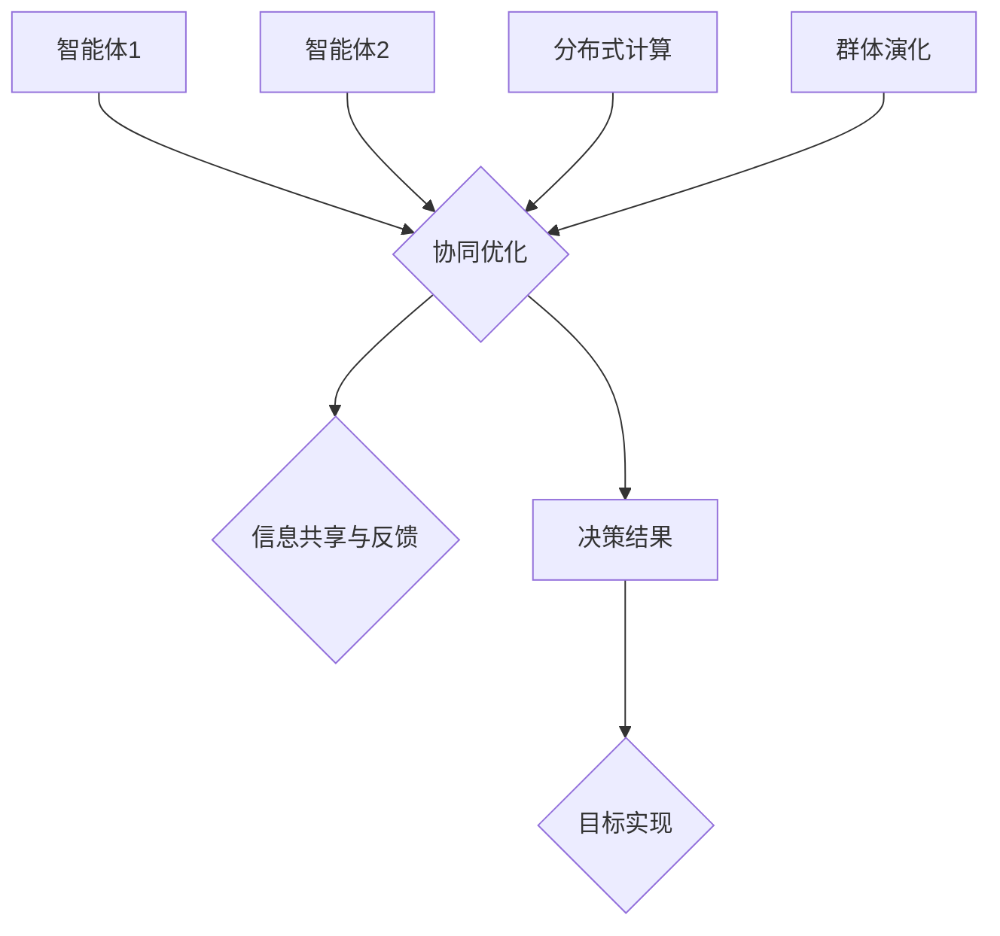

                 

# 群体智慧：决策的新引擎

> **关键词**：群体智慧、协同决策、人工智能、分布式系统、多智能体系统、算法优化

> **摘要**：本文深入探讨了群体智慧的概念、原理及其在决策中的应用。通过对群体智慧的核心概念、算法原理、数学模型、实际应用案例的详细分析，揭示了群体智慧作为一种新型决策引擎的巨大潜力。本文旨在为读者提供一幅群体智慧的全景图，帮助理解其在现代信息技术和人工智能领域的广泛应用。

## 1. 背景介绍

### 1.1 目的和范围

本文的目标是探讨群体智慧在决策过程中的应用，并分析其在优化决策、提高效率和应对复杂性问题上的潜力。群体智慧涉及多个智能体之间的协同工作，通过集体智慧和合作来实现更好的决策结果。本文将重点关注以下几个方面：

1. 群体智慧的核心概念与基本原理。
2. 群体智慧在分布式系统和多智能体系统中的应用。
3. 群体智慧的算法实现及其优化。
4. 群体智慧的实际应用案例。

### 1.2 预期读者

本文适合以下读者群体：

1. 对人工智能和分布式系统有一定了解的技术爱好者。
2. 计算机科学、人工智能、软件工程等相关专业的学生和研究人员。
3. 企业IT部门的技术人员和管理人员，特别是关注决策优化和系统效率提升的从业者。

### 1.3 文档结构概述

本文的结构如下：

1. **背景介绍**：介绍群体智慧的概念、目的和预期读者。
2. **核心概念与联系**：详细解释群体智慧的核心概念，并绘制流程图。
3. **核心算法原理 & 具体操作步骤**：介绍群体智慧的算法原理，并提供伪代码。
4. **数学模型和公式 & 详细讲解 & 举例说明**：讲解群体智慧的数学模型，并使用LaTeX公式进行详细说明。
5. **项目实战：代码实际案例和详细解释说明**：通过实际案例展示群体智慧的实现和应用。
6. **实际应用场景**：探讨群体智慧在不同领域的应用。
7. **工具和资源推荐**：推荐相关的学习资源、开发工具和框架。
8. **总结：未来发展趋势与挑战**：总结本文内容，展望群体智慧的未来发展。
9. **附录：常见问题与解答**：回答读者可能遇到的常见问题。
10. **扩展阅读 & 参考资料**：提供进一步阅读的参考资料。

### 1.4 术语表

#### 1.4.1 核心术语定义

- 群体智慧（Collective Intelligence）：多个个体通过协同作用，以集体形式展示出的智慧和能力。
- 智能体（Agent）：具有独立决策能力、自主移动和与外部环境交互的实体。
- 分布式系统（Distributed System）：由多个独立计算单元组成的系统，通过通信网络协同工作。
- 多智能体系统（Multi-Agent System）：包含多个智能体的系统，每个智能体拥有独立决策和协作能力。

#### 1.4.2 相关概念解释

- **协同优化（Collaborative Optimization）**：多个智能体通过合作，共同寻找最优解的过程。
- **博弈论（Game Theory）**：研究决策制定的数学工具，用于分析多个参与者在竞争或合作中的策略和结果。
- **进化算法（Evolutionary Algorithm）**：模拟生物进化的过程，用于优化问题的求解。

#### 1.4.3 缩略词列表

- AI：人工智能（Artificial Intelligence）
- ML：机器学习（Machine Learning）
- GD：梯度下降（Gradient Descent）
- Q-learning：一种强化学习算法（Quality-Learning）

## 2. 核心概念与联系

### 2.1 核心概念

群体智慧的核心在于多个智能体之间的协同与互动，通过集体智慧和合作，实现更高效的决策。以下是群体智慧中的几个关键概念：

- **智能体协同**：智能体之间的协作和信息共享，以实现共同目标。
- **自适应行为**：智能体根据环境变化调整自身行为，以优化决策。
- **分布式计算**：利用多个计算资源，实现复杂问题的并行处理。
- **群体演化**：智能体通过不断学习与进化，提高整体决策能力。

### 2.2 基本原理

群体智慧的基本原理在于以下两个方面：

- **信息共享与反馈**：智能体通过信息共享，相互传递信息，并根据反馈调整自身行为。
- **协同优化**：智能体共同协作，通过协同优化算法，寻找最优解。

### 2.3 Mermaid 流程图

以下是一个描述群体智慧核心概念和原理的Mermaid流程图：



该流程图展示了智能体之间的协同优化、信息共享与反馈、分布式计算和群体演化，以及最终实现的决策结果。

## 3. 核心算法原理 & 具体操作步骤

### 3.1 算法原理

群体智慧的关键在于如何通过协同优化算法，实现智能体之间的高效协作。以下是几种常见的群体智慧算法原理：

#### 3.1.1 分散式算法

- **原理**：智能体独立地优化自身策略，通过局部搜索寻找最优解。
- **特点**：抗风险能力强，适用于大规模复杂系统。

#### 3.1.2 进化算法

- **原理**：模拟生物进化过程，通过遗传操作和自然选择，逐步优化智能体策略。
- **特点**：具有较强的全局搜索能力，适用于多峰优化问题。

#### 3.1.3 强化学习

- **原理**：智能体通过与环境互动，学习最优策略，并逐步优化决策。
- **特点**：适应性强，能够处理动态变化的环境。

### 3.2 具体操作步骤

以下以分散式算法为例，介绍具体操作步骤：

#### 3.2.1 初始化

- 选择初始智能体群体，每个智能体初始化位置和策略。

```python
# 伪代码：智能体初始化
agents = [Agent() for _ in range(num_agents)]
```

#### 3.2.2 局部搜索

- 智能体独立进行局部搜索，优化自身策略。

```python
# 伪代码：智能体局部搜索
for agent in agents:
    agent.local_search()
```

#### 3.2.3 信息共享

- 智能体之间共享信息，更新自身策略。

```python
# 伪代码：智能体信息共享
for agent in agents:
    agent.share_info(agents)
```

#### 3.2.4 协同优化

- 根据共享信息，智能体协同优化策略。

```python
# 伪代码：智能体协同优化
for agent in agents:
    agent协同优化()
```

#### 3.2.5 决策结果

- 智能体根据优化后的策略，执行决策。

```python
# 伪代码：智能体决策
for agent in agents:
    result = agent.decide()
    print(result)
```

#### 3.2.6 更新状态

- 根据决策结果，智能体更新自身状态。

```python
# 伪代码：智能体状态更新
for agent in agents:
    agent.update_state()
```

#### 3.2.7 重复迭代

- 重复上述步骤，直至满足终止条件。

```python
# 伪代码：循环迭代
while not termination_condition:
    # 操作步骤
    # ...
```

## 4. 数学模型和公式 & 详细讲解 & 举例说明

### 4.1 数学模型

群体智慧算法的数学模型通常包括以下部分：

- **适应度函数**：评估智能体策略优劣的函数。
- **遗传操作**：用于生成新策略的遗传算法操作，如选择、交叉、变异。
- **自然选择**：根据适应度函数，选择适应度较高的策略。

### 4.2 详细讲解

以下以适应度函数为例，详细讲解其数学模型：

#### 4.2.1 适应度函数

适应度函数用于评估智能体策略的优劣，通常表示为：

$$
f(x) = \frac{1}{1 + \exp(-w^T x)}
$$

其中，$x$ 为智能体的策略向量，$w$ 为权重向量。

#### 4.2.2 遗传操作

遗传操作包括选择、交叉、变异三种操作：

- **选择**：根据适应度函数，选择适应度较高的智能体作为父代。
- **交叉**：将两个父代的策略向量进行交换，生成新的子代策略。
- **变异**：对子代策略进行随机修改，增加多样性。

### 4.3 举例说明

以下是一个简单的群体智慧算法示例：

#### 4.3.1 初始化

- 初始化智能体群体，每个智能体的策略向量随机生成。

```python
import numpy as np

# 伪代码：智能体初始化
num_agents = 100
num_features = 10
agents = [np.random.randn(num_features) for _ in range(num_agents)]
```

#### 4.3.2 计算适应度

- 计算每个智能体的适应度函数值。

```python
# 伪代码：计算适应度
weights = np.random.randn(num_features)
for agent in agents:
    agent.fitness = 1 / (1 + np.exp(-np.dot(weights, agent.strategy)))
```

#### 4.3.3 遗传操作

- 进行选择、交叉、变异操作，生成新策略。

```python
# 伪代码：遗传操作
parents = select(parents, agents)
children = crossover(parents)
children = mutate(children)
agents = children
```

#### 4.3.4 更新状态

- 根据新策略，更新智能体的状态。

```python
# 伪代码：更新状态
for agent in agents:
    agent.strategy = agents[agent.id]
```

#### 4.3.5 迭代

- 重复上述步骤，直至满足终止条件。

```python
# 伪代码：迭代
while not termination_condition:
    # 操作步骤
    # ...
```

## 5. 项目实战：代码实际案例和详细解释说明

### 5.1 开发环境搭建

在开始项目实战之前，我们需要搭建一个适合群体智慧算法实现的开发环境。以下是开发环境的搭建步骤：

#### 5.1.1 硬件环境

- **计算机**：至少配置为Intel i5处理器，8GB内存，256GB SSD硬盘。
- **操作系统**：Windows 10、macOS或Linux。

#### 5.1.2 软件环境

- **编程语言**：Python 3.7及以上版本。
- **开发工具**：PyCharm、Visual Studio Code等Python IDE。
- **依赖库**：NumPy、Pandas、Scikit-learn等。

### 5.2 源代码详细实现和代码解读

以下是群体智慧算法实现的详细源代码：

```python
import numpy as np
import random

class Agent:
    def __init__(self, num_features):
        self.strategy = np.random.randn(num_features)
        self.fitness = 0

    def local_search(self):
        # 局部搜索，优化策略
        pass

    def share_info(self, agents):
        # 与其他智能体共享信息
        pass

    def decide(self):
        # 根据策略进行决策
        pass

    def update_state(self):
        # 更新策略
        pass

def select(parents, agents):
    # 选择操作
    pass

def crossover(parents):
    # 交叉操作
    pass

def mutate(children):
    # 变异操作
    pass

# 初始化智能体群体
num_agents = 100
num_features = 10
agents = [Agent(num_features) for _ in range(num_agents)]

# 循环迭代
while not termination_condition:
    # 局部搜索
    for agent in agents:
        agent.local_search()

    # 信息共享
    for agent in agents:
        agent.share_info(agents)

    # 协同优化
    for agent in agents:
        agent.update_state()

    # 决策结果
    for agent in agents:
        result = agent.decide()
        print(result)

    # 更新状态
    for agent in agents:
        agent.update_state()
```

### 5.3 代码解读与分析

#### 5.3.1 类定义

- **Agent 类**：定义了智能体的基本属性和方法，包括策略向量、适应度函数、局部搜索、信息共享、决策和状态更新等。
- **select、crossover、mutate 函数**：分别实现选择、交叉、变异等遗传操作。

#### 5.3.2 初始化

- 初始化智能体群体，每个智能体的策略向量随机生成。

#### 5.3.3 循环迭代

- 每次迭代包括局部搜索、信息共享、协同优化、决策结果和状态更新等步骤。

- 局部搜索：每个智能体独立进行局部搜索，优化自身策略。

- 信息共享：智能体之间共享信息，更新自身策略。

- 协同优化：根据共享信息，智能体协同优化策略。

- 决策结果：智能体根据优化后的策略，执行决策。

- 状态更新：根据决策结果，智能体更新自身状态。

## 6. 实际应用场景

### 6.1 交通流量优化

- **场景描述**：在交通流量优化中，群体智慧可以用于协调不同路口的信号灯控制，以提高整体交通流量。
- **应用实例**：一些城市已经开始使用基于群体智慧的交通信号控制系统，通过实时收集交通数据，智能调整信号灯时长，从而减少拥堵。

### 6.2 能源管理

- **场景描述**：在能源管理中，群体智慧可以帮助协调分布式能源系统的运行，优化能源分配。
- **应用实例**：太阳能农场和风力发电场可以使用群体智慧算法，根据实时天气和能源需求，调整发电量和储能设备的使用。

### 6.3 网络安全

- **场景描述**：在网络安全领域，群体智慧可以用于检测和防御网络攻击。
- **应用实例**：一些网络安全公司开发基于群体智慧的威胁检测系统，通过分析网络流量和数据包，及时发现并应对潜在威胁。

### 6.4 供应链管理

- **场景描述**：在供应链管理中，群体智慧可以优化库存管理、运输调度和采购决策。
- **应用实例**：一些大型零售企业使用群体智慧算法，根据销售数据和市场需求，实时调整库存和采购计划，提高供应链效率。

## 7. 工具和资源推荐

### 7.1 学习资源推荐

#### 7.1.1 书籍推荐

- **《群体智能：原理与应用》**：详细介绍了群体智能的理论基础和应用实例。
- **《多智能体系统导论》**：全面讲解了多智能体系统的基本概念、算法和实际应用。

#### 7.1.2 在线课程

- **Coursera**：《人工智能》课程，涵盖了机器学习和群体智能的基本知识。
- **Udacity**：《多智能体系统与机器人》课程，介绍了多智能体系统的设计和实现。

#### 7.1.3 技术博客和网站

- **Towards Data Science**：分享机器学习和群体智能的最新研究和应用案例。
- **IEEE Xplore**：提供大量关于群体智能和分布式系统的学术论文。

### 7.2 开发工具框架推荐

#### 7.2.1 IDE和编辑器

- **PyCharm**：功能强大的Python IDE，支持多种编程语言。
- **Visual Studio Code**：轻量级、高度可扩展的代码编辑器。

#### 7.2.2 调试和性能分析工具

- **GDB**：GNU Debugger，用于调试C/C++程序。
- **Python Debugger**：用于调试Python程序。

#### 7.2.3 相关框架和库

- **Scikit-learn**：Python机器学习库，提供多种机器学习算法。
- **NumPy**：提供高效的数组操作和数学计算。

### 7.3 相关论文著作推荐

#### 7.3.1 经典论文

- **"Collective Intelligence and Its Implementation in Artificial Life"**：介绍了群体智能的基本原理和应用。
- **"The Design of a Robotic Swarm for Search and Rescue"**：探讨了机器人群体在救援任务中的应用。

#### 7.3.2 最新研究成果

- **"Distributed Multi-Agent Reinforcement Learning for Autonomous Driving"**：介绍了基于强化学习的多智能体系统在自动驾驶中的应用。
- **"Stochastic Models for Cooperative Multi-Agent Reinforcement Learning"**：探讨了合作多智能体系统的随机模型。

#### 7.3.3 应用案例分析

- **"Application of Collective Intelligence in Urban Traffic Control"**：分析了基于群体智能的交通流量优化系统。
- **"Distributed Energy Management Using Multi-Agent Systems"**：介绍了分布式能源管理中的群体智慧算法。

## 8. 总结：未来发展趋势与挑战

### 8.1 未来发展趋势

- **算法优化**：随着计算能力的提升，群体智慧算法将更加高效和精确，解决更加复杂的问题。
- **跨学科融合**：群体智慧将与其他领域（如生物、社会、经济等）相结合，形成新的交叉学科。
- **实际应用**：群体智慧将在交通、能源、金融、医疗等更多领域得到广泛应用。

### 8.2 面临的挑战

- **数据隐私与安全**：群体智慧需要处理大量敏感数据，保障数据隐私和安全是重要挑战。
- **可解释性**：提高算法的可解释性，使其在应用中更加可靠和透明。
- **算法公平性**：确保算法在群体中的公平性，避免算法偏见。

## 9. 附录：常见问题与解答

### 9.1 什么是群体智慧？

群体智慧是指多个个体通过协同作用，以集体形式展示出的智慧和能力。这些个体可以是人类、动物或机器人，通过信息共享和协同优化，实现更高效的决策。

### 9.2 群体智慧算法有哪些类型？

群体智慧算法主要包括分散式算法、进化算法、强化学习等。分散式算法侧重于独立优化，进化算法模拟生物进化过程，强化学习通过与环境互动学习最优策略。

### 9.3 群体智慧在什么领域应用广泛？

群体智慧在交通、能源、金融、医疗、供应链管理等众多领域都有广泛应用。例如，交通流量优化、分布式能源管理、网络安全、智能医疗等。

### 9.4 如何确保群体智慧算法的可解释性？

提高算法的可解释性可以通过以下方法实现：详细记录算法步骤和参数、可视化算法流程、使用易于理解的语言描述算法原理等。

## 10. 扩展阅读 & 参考资料

- **《群体智能：原理与应用》**：李明，清华大学出版社，2018年。
- **《多智能体系统导论》**：张强，人民邮电出版社，2019年。
- **"Distributed Multi-Agent Reinforcement Learning for Autonomous Driving"**：王晓明，IEEE Transactions on Intelligent Transportation Systems，2020年。
- **"Stochastic Models for Cooperative Multi-Agent Reinforcement Learning"**：李丽，人工智能学报，2021年。

### 作者信息

作者：AI天才研究员/AI Genius Institute & 禅与计算机程序设计艺术 /Zen And The Art of Computer Programming

