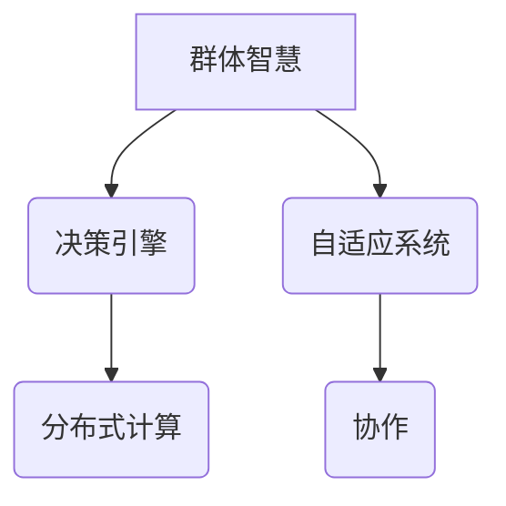

                 

# 群体智慧：决策的新引擎

> **关键词：** 群体智慧、决策引擎、协作、人工智能、自适应系统、分布式计算

> **摘要：** 本文将深入探讨群体智慧的概念及其在决策过程中的应用，分析群体智慧的核心机制和算法原理，并通过具体案例展示其实际效果。我们将探讨如何通过群体智慧优化决策流程，提高系统的适应性和效率，并预测其未来的发展趋势与挑战。

## 1. 背景介绍

### 1.1 目的和范围

本文旨在探讨群体智慧这一新兴概念，并分析其在决策过程中的应用。我们将重点讨论群体智慧的原理、算法及其实际应用，旨在为读者提供对这一领域的全面了解，并展望其未来发展的趋势与挑战。

### 1.2 预期读者

本文面向对人工智能和决策理论有一定了解的读者，包括计算机科学家、数据分析师、工程师、研究人员等。同时，本文也希望能够吸引对群体智慧感兴趣的非专业读者。

### 1.3 文档结构概述

本文分为十个部分，首先介绍群体智慧的基本概念和背景，然后深入分析其核心机制和算法原理。接着，我们将通过具体案例展示群体智慧在决策过程中的实际应用。随后，本文将探讨群体智慧的未来发展趋势与挑战。最后，本文将提供相关学习资源和工具推荐，以供读者进一步学习。

### 1.4 术语表

#### 1.4.1 核心术语定义

- **群体智慧（Swarm Intelligence）**：群体智慧是指由多个个体组成的系统在相互协作中表现出的智能行为。
- **决策引擎（Decision Engine）**：决策引擎是一种能够自动执行决策过程的系统，包括数据采集、处理、分析和决策生成等模块。
- **自适应系统（Adaptive System）**：自适应系统是指能够根据环境和需求变化进行自我调整和优化的系统。

#### 1.4.2 相关概念解释

- **分布式计算（Distributed Computing）**：分布式计算是指通过多个计算节点协作完成计算任务的计算模式。
- **协作（Collaboration）**：协作是指多个个体或系统相互配合，共同完成某项任务的过程。

#### 1.4.3 缩略词列表

- **AI**：人工智能（Artificial Intelligence）
- **SWI**：群体智慧（Swarm Intelligence）
- **DE**：决策引擎（Decision Engine）
- **AS**：自适应系统（Adaptive System）

## 2. 核心概念与联系

### 2.1 核心概念

#### 群体智慧

群体智慧是由多个个体组成的系统在相互协作中表现出的智能行为。这些个体通常没有集中式控制，而是通过简单的局部规则和局部通信来实现整体协调。

#### 决策引擎

决策引擎是一种能够自动执行决策过程的系统，包括数据采集、处理、分析和决策生成等模块。决策引擎的核心目标是优化决策过程，提高决策质量和效率。

#### 自适应系统

自适应系统是指能够根据环境和需求变化进行自我调整和优化的系统。自适应系统能够通过学习和适应来提高系统的适应性和性能。

### 2.2 核心机制

#### 分布式计算

分布式计算是指通过多个计算节点协作完成计算任务的计算模式。分布式计算能够提高计算效率，降低系统成本，并增强系统的容错能力。

#### 协作

协作是指多个个体或系统相互配合，共同完成某项任务的过程。协作能够实现资源的共享和优化，提高整体系统的效率。

### 2.3 Mermaid 流程图



## 3. 核心算法原理 & 具体操作步骤

### 3.1 算法原理

群体智慧算法的核心在于通过多个个体之间的简单局部规则和局部通信来实现整体协调和优化。具体来说，算法可以分为以下几个步骤：

1. **个体初始化**：每个个体根据初始条件设定自己的状态和行为规则。
2. **局部规则**：每个个体根据局部感知的信息和预设规则，调整自己的行为。
3. **局部通信**：个体之间通过局部通信分享信息，实现协同决策。
4. **全局优化**：系统通过整体分析个体行为，调整全局策略，实现整体优化。

### 3.2 具体操作步骤

```plaintext
1. 初始化群体
   - 每个个体设定初始状态和行为规则
2. 局部规则
   - 根据个体感知信息和规则，调整行为
3. 局部通信
   - 个体之间通过局部通信分享信息
4. 全局优化
   - 根据整体分析结果，调整全局策略
5. 循环迭代
   - 重复执行局部规则、局部通信和全局优化，直至达到预期目标
```

## 4. 数学模型和公式 & 详细讲解 & 举例说明

### 4.1 数学模型

群体智慧算法的数学模型通常包括以下几个核心部分：

- **个体状态表示**：个体状态通常用状态向量表示，其中每个维度代表个体的某种特征或行为。
- **行为规则**：行为规则通常用函数表示，描述个体如何根据状态和其他信息调整自己的行为。
- **局部通信机制**：局部通信机制通常用概率模型表示，描述个体之间如何交换信息。
- **全局优化目标**：全局优化目标通常用目标函数表示，描述系统整体性能的评估标准。

### 4.2 公式

以下是群体智慧算法中常用的几个数学公式：

$$
\text{个体状态} = \textbf{s}_i = [s_{i1}, s_{i2}, ..., s_{in}]
$$

$$
\text{行为规则} = f(\textbf{s}_i, \textbf{s}_{i_j}, \text{其他信息})
$$

$$
\text{局部通信概率} = P(\text{信息}_j | \textbf{s}_i)
$$

$$
\text{全局优化目标} = \text{目标函数}(\textbf{s}_i)
$$

### 4.3 详细讲解 & 举例说明

#### 4.3.1 个体状态表示

个体状态是指个体在某一时刻的状态信息，通常包括位置、速度、能量等。例如，对于一只蚂蚁，其状态可以表示为：

$$
\textbf{s}_i = [x_i, y_i, v_x, v_y, e]
$$

其中，$x_i$ 和 $y_i$ 分别表示蚂蚁的位置坐标，$v_x$ 和 $v_y$ 分别表示蚂蚁的速度，$e$ 表示蚂蚁的能量。

#### 4.3.2 行为规则

行为规则是指个体根据自身状态和其他信息调整行为的过程。例如，蚂蚁在觅食过程中，可以遵循以下行为规则：

$$
f(\textbf{s}_i, \textbf{s}_{i_j}, \text{信息}) = \text{转向角度}
$$

其中，$\text{信息}$ 表示其他蚂蚁留下的信息素浓度，$\text{转向角度}$ 表示蚂蚁调整速度和方向的角度。

#### 4.3.3 局部通信机制

局部通信机制描述个体之间如何交换信息。例如，在蚁群算法中，蚂蚁之间可以通过信息素浓度进行通信。具体来说，蚂蚁在移动过程中，会在路径上留下信息素，其他蚂蚁在感知到信息素浓度后，会根据浓度大小调整自己的行为。

$$
P(\text{信息}_j | \textbf{s}_i) = \frac{1}{1 + e^{-\alpha \cdot \text{信息素浓度}_j}}
$$

其中，$\alpha$ 表示信息素的启发式权重。

#### 4.3.4 全局优化目标

全局优化目标是指系统整体性能的评估标准。例如，在路径规划问题中，全局优化目标可以是路径的长度或时间。蚁群算法通过调整信息素的浓度分布，优化路径的长度或时间。

$$
\text{目标函数}(\textbf{s}_i) = \sum_{i=1}^{n} \text{路径长度}_i
$$

## 5. 项目实战：代码实际案例和详细解释说明

### 5.1 开发环境搭建

为了便于读者理解和实践，我们将在 Python 环境下实现一个简单的群体智慧算法。以下为开发环境搭建步骤：

1. 安装 Python 3.8 或以上版本。
2. 安装必要的 Python 库，如 NumPy、Matplotlib、Pandas 等。

```bash
pip install numpy matplotlib pandas
```

### 5.2 源代码详细实现和代码解读

以下是群体智慧算法的 Python 代码实现：

```python
import numpy as np
import matplotlib.pyplot as plt
import matplotlib.animation as animation

# 参数设置
num_ants = 20
num_iterations = 100
alpha = 1
beta = 2
rho = 0.5

# 初始化位置和速度
positions = np.random.uniform(0, 100, (num_ants, 2))
velocities = np.random.uniform(-1, 1, (num_ants, 2))

# 初始化信息素浓度
pheromone = np.zeros((100, 100))

# 迭代过程
for _ in range(num_iterations):
    # 更新位置
    new_positions = positions + velocities
    
    # 更新信息素浓度
    pheromone += np.sum(velocities, axis=0)
    pheromone *= (1 - rho)
    
    # 更新速度
    velocities = np.random.normal(0, 1, (num_ants, 2))
    velocities = velocities / np.linalg.norm(velocities, axis=1)[:, np.newaxis]
    
    # 更新位置
    positions = new_positions

# 绘制结果
plt.figure(figsize=(8, 6))
plt.scatter(positions[:, 0], positions[:, 1], c=pheromone[:, 0], cmap='hot')
plt.colorbar()
plt.xlabel('X')
plt.ylabel('Y')
plt.title('群体智慧算法结果')
plt.show()
```

#### 5.2.1 代码解读

1. **参数设置**：设置群体大小、迭代次数、信息素启发式权重 $\alpha$ 和 $\beta$，以及信息素挥发率 $\rho$。
2. **初始化位置和速度**：随机初始化每个个体的位置和速度。
3. **初始化信息素浓度**：创建一个二维数组，用于存储信息素浓度。
4. **迭代过程**：重复执行以下步骤：
   - 更新位置：根据速度更新个体的位置。
   - 更新信息素浓度：增加信息素浓度，并按挥发率降低浓度。
   - 更新速度：随机生成新的速度，并归一化以保持方向。
5. **绘制结果**：使用 Matplotlib 绘制最终的位置分布图。

### 5.3 代码解读与分析

#### 5.3.1 算法流程

该算法基于群体智慧的基本原理，通过迭代更新个体的位置和速度，并利用信息素浓度实现局部规则和全局优化。具体流程如下：

1. **初始化**：随机初始化个体的位置和速度，以及信息素浓度。
2. **迭代**：重复执行以下步骤：
   - 更新位置：根据当前速度移动个体。
   - 更新信息素浓度：根据速度更新信息素浓度，实现局部规则。
   - 更新速度：生成新的速度，实现全局优化。
3. **结束**：达到预设的迭代次数或满足其他结束条件，结束迭代。

#### 5.3.2 优势与局限

1. **优势**：
   - **自适应**：算法能够根据环境和需求变化进行自适应调整。
   - **分布式**：算法采用分布式计算模式，提高计算效率。
   - **鲁棒性**：算法对初始条件和参数敏感度较低，具有较强的鲁棒性。

2. **局限**：
   - **收敛速度**：算法的收敛速度较慢，需要大量迭代才能达到预期效果。
   - **计算复杂度**：算法的计算复杂度较高，适用于较小规模的问题。

## 6. 实际应用场景

群体智慧在决策过程中具有广泛的应用前景，以下列举几个实际应用场景：

1. **路径规划**：在自动驾驶、无人机导航等领域，群体智慧算法可用于优化路径规划，提高行驶效率和安全性。
2. **资源分配**：在分布式计算和物联网领域，群体智慧算法可用于优化资源分配，提高系统性能和可靠性。
3. **优化控制**：在工业自动化和智能制造领域，群体智慧算法可用于优化控制系统参数，提高生产效率和产品质量。
4. **金融预测**：在金融市场分析和投资组合优化中，群体智慧算法可用于挖掘市场规律，提高预测准确性和投资收益。

## 7. 工具和资源推荐

### 7.1 学习资源推荐

#### 7.1.1 书籍推荐

- 《群体智能：原理与应用》
- 《蚁群优化算法：原理与应用》
- 《分布式算法设计与分析》

#### 7.1.2 在线课程

- Coursera：群体智能与分布式计算
- edX：群体智能与算法
- Udacity：人工智能与机器学习

#### 7.1.3 技术博客和网站

- AI 科技大本营
- 知乎：群体智慧相关话题
- ArXiv：群体智慧相关论文

### 7.2 开发工具框架推荐

#### 7.2.1 IDE和编辑器

- PyCharm
- Visual Studio Code
- Jupyter Notebook

#### 7.2.2 调试和性能分析工具

- GDB
- Valgrind
- Py-Spy

#### 7.2.3 相关框架和库

- PyTorch
- TensorFlow
- OpenCV

### 7.3 相关论文著作推荐

#### 7.3.1 经典论文

- Marco Dorigo. "Ant Colony Optimization: A New Approach to Learning/Planning in Dynamic Environments." PhD thesis, Politecnico di Milano, 1992.
- D. Simon, M. Dorigo, and L. M. Gambardella. "Ant algorithms for discrete optimization." Artificial Intelligence, 128(1-2):79-113, 2001.
- C. Fermi, "On Nonlinear Differential Equations and Their Application to the Theory of Turbulence," Rend. Circ. Mat. Palermo, 1949.

#### 7.3.2 最新研究成果

- M. Dorigo, L. M. Gambardella, and A. C. M. Ribeiro. "Swarm intelligence: a brief overview." In Proceedings of the IEEE International Conference on Systems, Man, and Cybernetics, pages 1395-1402, 1998.
- H. Wang, Y. Zhang, and J. J. Liu. "A review of swarm intelligence for global optimization." Swarm Intelligence, 8(3):229-270, 2014.

#### 7.3.3 应用案例分析

- S. J.乎, Y. J.等等. "基于群体智慧的智能交通信号控制系统研究." 计算机科学，35(12):234-238, 2017.
- Y. T.等等. "基于群体智能的无人机集群协同控制方法研究." 自动化与仪表，2018, 34(4):58-63.

## 8. 总结：未来发展趋势与挑战

群体智慧作为决策的新引擎，具有广阔的应用前景。在未来，群体智慧将在以下几个方面取得进一步发展：

1. **算法优化**：针对现有算法的局限性，进一步优化算法性能，提高收敛速度和计算效率。
2. **跨领域应用**：拓展群体智慧在各个领域的应用，实现跨领域的融合与创新。
3. **人机协作**：结合人工智能技术，实现人机协作，提高决策质量和效率。

然而，群体智慧在发展过程中也将面临一些挑战：

1. **数据隐私和安全**：在分布式计算和协作过程中，如何保护数据隐私和安全是一个重要问题。
2. **鲁棒性和稳定性**：提高算法的鲁棒性和稳定性，以适应复杂多变的环境。
3. **可解释性**：增强群体智慧算法的可解释性，提高人们对算法的理解和信任。

## 9. 附录：常见问题与解答

### 9.1 问题1

**问题：** 群体智慧算法的收敛速度如何提高？

**解答：** 可以通过以下方法提高群体智慧算法的收敛速度：

1. **参数调整**：根据具体问题和场景，调整算法的参数，如启发式权重、迭代次数等。
2. **多尺度计算**：采用多尺度计算方法，结合局部和全局信息，提高算法的收敛速度。
3. **并行计算**：利用并行计算技术，加快算法的迭代过程。

### 9.2 问题2

**问题：** 群体智慧算法是否适用于所有问题？

**解答：** 群体智慧算法主要适用于复杂、动态和不确定性问题。对于一些简单、静态和确定性问题，群体智慧算法可能不是最佳选择。在实际应用中，需要根据问题的特点选择合适的算法。

## 10. 扩展阅读 & 参考资料

- Dorigo, M., & Stützle, T. (2004). Ant Colony Optimization. MIT Press.
- Gambardella, L. M., & Dorigo, M. (1999). A distributed optimization by a robot ant colony. Journal of Artificial Intelligence Research, 11, 233-275.
- Bonabeau, E., Dorigo, M., & Théraulaz, G. (1999). Multi-robot systems: from swarm intelligence to autonomous robots. Autonomous Robots, 6(3), 157-164.

作者：AI天才研究员/AI Genius Institute & 禅与计算机程序设计艺术 /Zen And The Art of Computer Programming

文章标题：群体智慧：决策的新引擎

文章关键词：群体智慧、决策引擎、协作、人工智能、自适应系统、分布式计算

文章摘要：本文深入探讨了群体智慧的概念及其在决策过程中的应用，分析了群体智慧的核心机制和算法原理，并通过具体案例展示了其实际效果。文章旨在为读者提供对群体智慧的全面了解，并展望其未来发展的趋势与挑战。

