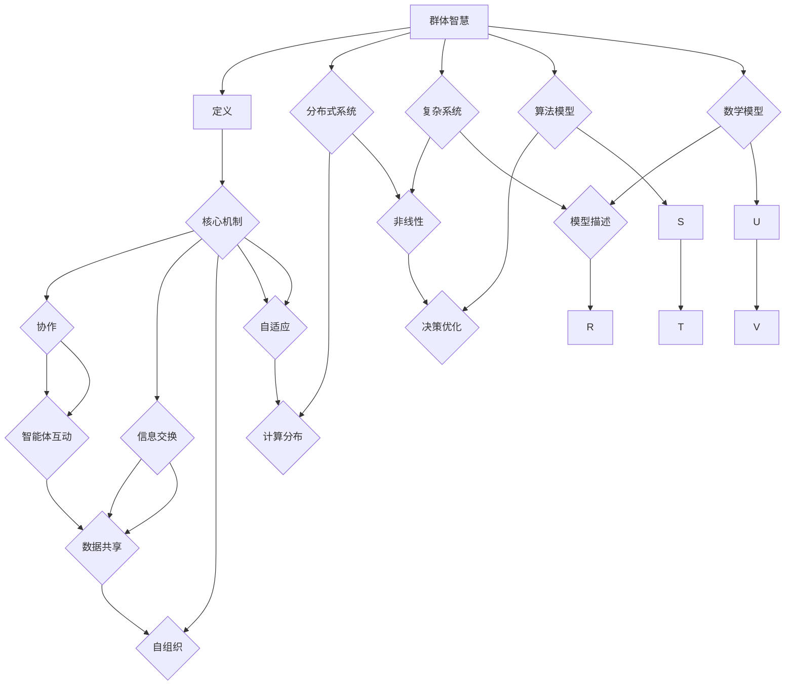

                 

### 群体智慧：决策的新方向

> **关键词：** 群体智慧、决策、协作、分布式系统、复杂系统、人工智能

> **摘要：** 本文深入探讨了群体智慧的概念、原理和应用。通过分析群体智慧的核心机制、算法模型以及数学基础，本文旨在揭示群体智慧如何改变我们对决策过程的理解，并提供一种新的决策方向。文章随后通过实际案例展示了群体智慧的实践应用，并提出了未来发展的趋势和挑战。

群体智慧，作为一种新兴的决策理论，正逐步改变我们对决策过程的理解。在分布式系统和复杂系统的背景下，群体智慧提供了通过协作和智能体之间的信息交换来实现高效决策的潜力。本文将逐步分析群体智慧的核心概念、算法原理、数学模型以及其实际应用场景，探讨群体智慧如何成为一种新的决策方向。

首先，我们将介绍群体智慧的定义、目的和范围，明确预期读者以及文章的结构和术语。接着，通过Mermaid流程图展示群体智慧的核心概念和联系，为进一步的分析打下基础。随后，我们将详细探讨群体智慧的核心算法原理和具体操作步骤，并用伪代码进行详细阐述。文章还将介绍群体智慧的数学模型和公式，并通过实例进行说明。

接下来，我们将通过一个实际案例展示群体智慧的代码实现和详细解释，以便读者更好地理解其应用。随后，本文将探讨群体智慧在实际应用场景中的表现，并提供相关的工具和资源推荐，以帮助读者进一步学习和实践。最后，文章将总结群体智慧的未来发展趋势和挑战，为读者提供一个全景视图。

通过本文的阅读，读者将能够系统地了解群体智慧的概念、原理和应用，并掌握如何在实际场景中利用群体智慧进行高效决策。无论你是技术专家还是决策者，这篇文章都将为你提供宝贵的见解和实用指南。

### 1. 背景介绍

#### 1.1 目的和范围

本文的目的是探讨群体智慧作为一种新兴的决策理论，其在分布式系统和复杂系统中的应用及其影响。随着信息技术和人工智能的快速发展，个体智能体之间的协作和交互变得日益重要。群体智慧通过这些智能体之间的信息交换和协作，实现了复杂决策问题的解决，提供了一种新的决策方向。本文旨在通过系统分析和实例讲解，深入理解群体智慧的原理和实际应用，帮助读者掌握这一重要概念。

本文的范围涵盖了群体智慧的定义、核心概念、算法原理、数学模型、实际应用场景以及未来发展趋势和挑战。具体来说，我们将首先介绍群体智慧的基本概念和目的，随后通过Mermaid流程图展示其核心概念和联系，详细讲解群体智慧的核心算法原理和具体操作步骤，并使用伪代码进行说明。接下来，文章将介绍群体智慧的数学模型和公式，并通过实例进行说明。此外，本文还将通过一个实际案例展示群体智慧的代码实现和详细解释，以帮助读者更好地理解其应用。最后，文章将总结群体智慧的实际应用场景，提供相关的工具和资源推荐，并探讨其未来的发展趋势和挑战。

通过本文的阅读，读者将能够系统地了解群体智慧的概念、原理和应用，掌握如何在实际场景中利用群体智慧进行高效决策。无论是技术专家还是决策者，本文都将为你提供宝贵的见解和实用指南。

#### 1.2 预期读者

本文的预期读者包括但不限于以下几类人群：

1. **技术专家**：具有计算机科学、人工智能、分布式系统等相关领域背景的技术专家，他们希望通过本文深入了解群体智慧的理论基础和应用实践，将其应用于实际项目中。
2. **决策者**：在商业、政府或非盈利组织中担任决策角色的专业人士，他们希望通过本文了解群体智慧如何提升决策效率和质量，从而做出更明智的决策。
3. **研究人员**：从事群体智能、复杂系统、人工智能等领域的研究人员，他们希望通过本文掌握群体智慧的最新研究进展和应用案例，为自己的研究提供参考和启示。
4. **学生**：计算机科学、人工智能、决策科学等相关专业的高等教育学生，他们希望通过本文掌握群体智慧的基本概念、算法原理和应用实例，为自己的学术研究和技术实践打下坚实基础。

为了使读者能够更好地理解和应用本文内容，本文将采用逻辑清晰、结构紧凑、简单易懂的技术语言，并结合实例和实际应用场景进行详细讲解。同时，本文还将提供相关的学习资源、开发工具和推荐论文，以便读者进一步学习和实践。

#### 1.3 文档结构概述

本文将分为以下几个主要部分：

1. **背景介绍**：
   - **目的和范围**：介绍本文的目的、主要内容和适用范围。
   - **预期读者**：明确本文的预期读者，包括技术专家、决策者、研究人员和学生等。
   - **文档结构概述**：概述本文的结构，包括各章节的主要内容。

2. **核心概念与联系**：
   - **Mermaid流程图**：通过Mermaid流程图展示群体智慧的核心概念和联系。
   - **核心概念**：详细解释群体智慧的基本概念，包括定义、核心机制和主要特点。

3. **核心算法原理 & 具体操作步骤**：
   - **算法原理**：详细讲解群体智慧的核心算法原理，包括算法的基本思想和主要步骤。
   - **具体操作步骤**：使用伪代码详细描述算法的具体操作步骤，并解释其逻辑和实现方法。

4. **数学模型和公式 & 详细讲解 & 举例说明**：
   - **数学模型**：介绍群体智慧相关的数学模型和公式，包括其在决策和协作中的应用。
   - **详细讲解**：详细解释数学模型和公式的原理和作用，并讨论其在实际应用中的优势和局限性。
   - **举例说明**：通过具体实例展示数学模型和公式在实际应用中的效果和作用。

5. **项目实战：代码实际案例和详细解释说明**：
   - **开发环境搭建**：介绍实际案例所需的开发环境搭建过程，包括所需工具和库的安装。
   - **源代码详细实现和代码解读**：展示实际案例的源代码实现，并详细解读其关键部分和实现方法。
   - **代码解读与分析**：对源代码进行详细分析，讨论其设计思路、优缺点和改进空间。

6. **实际应用场景**：
   - **应用领域**：介绍群体智慧在实际应用场景中的主要领域，包括商业、政府、科学研究等。
   - **案例分析**：通过实际案例展示群体智慧在不同应用场景中的效果和作用。

7. **工具和资源推荐**：
   - **学习资源推荐**：推荐相关书籍、在线课程和技术博客，帮助读者进一步学习和实践。
   - **开发工具框架推荐**：推荐适用于群体智慧开发的相关工具和框架，提高开发效率。
   - **相关论文著作推荐**：推荐经典论文和最新研究成果，为读者提供更深入的学术资源。

8. **总结：未来发展趋势与挑战**：
   - **发展趋势**：讨论群体智慧在未来技术发展中的潜在趋势和方向。
   - **挑战**：分析群体智慧在实际应用中面临的挑战和问题，并提出可能的解决方案。

9. **附录：常见问题与解答**：
   - **常见问题**：列出读者可能遇到的常见问题，并提供详细解答。

10. **扩展阅读 & 参考资料**：
   - **扩展阅读**：推荐相关扩展阅读，帮助读者深入了解群体智慧的理论和应用。
   - **参考资料**：列出本文中引用和参考的相关文献和资源。

通过上述结构，本文旨在系统地介绍群体智慧的概念、原理和应用，帮助读者全面了解这一重要决策理论，并在实际场景中灵活运用。

#### 1.4 术语表

为了确保本文的阅读和理解，我们在此列出一些关键术语及其定义和解释。

#### 1.4.1 核心术语定义

- **群体智慧（Collective Intelligence）**：
  群体智慧是指由多个个体智能体组成的群体在协作和互动过程中表现出的智能行为和决策能力。它不仅仅是各个个体智能的简单叠加，而是通过智能体之间的信息交换、协同和协作实现的更高级别的智能行为。

- **智能体（Agent）**：
  智能体是指具备一定自主性和决策能力的实体，可以是人类、机器或其他自动化系统。智能体能够感知环境、制定决策并执行相应动作。

- **协作（Cooperation）**：
  协作是指智能体之间通过共享信息和资源、分工合作以实现共同目标的过程。协作能够提高群体智慧的整体效率和质量。

- **分布式系统（Distributed System）**：
  分布式系统是指由多个独立计算机节点组成的系统，这些节点通过网络进行通信和协作，共同完成计算任务。分布式系统具有高可靠性、可扩展性和容错性等特点。

- **复杂系统（Complex System）**：
  复杂系统是指由大量相互作用的个体或子系统组成的系统，其行为和性质往往难以用简单的数学模型来描述。复杂系统的特点是高度非线性、自适应性和动态性。

- **信息交换（Information Exchange）**：
  信息交换是指智能体之间通过通信网络传输和共享信息的过程。信息交换是实现群体智慧的关键机制，能够促进智能体之间的协同和协作。

- **算法（Algorithm）**：
  算法是指解决问题的步骤和规则集合，用于指导计算机或智能体进行决策和计算。群体智慧中的算法通常设计用于处理大规模数据、优化决策过程和提高系统效率。

- **数学模型（Mathematical Model）**：
  数学模型是指使用数学语言和符号描述现实世界问题或现象的模型。群体智慧中的数学模型用于描述智能体之间的相互作用、协作机制和决策过程。

#### 1.4.2 相关概念解释

- **集体行为（Collective Behavior）**：
  集体行为是指个体在群体中表现出的行为模式，这些行为模式往往具有自组织和自适应特点。例如，鸟群飞行中的V字形排列、鱼群游动中的紧密配合等，都是集体行为的典型例子。

- **群体智能（Group Intelligence）**：
  群体智能是指由多个智能体组成的群体在协同工作过程中表现出的智能水平。群体智能通常高于单个智能体的智能水平，因为智能体之间的协作和互补效应能够实现更高效的决策和任务执行。

- **自组织（Self-Organization）**：
  自组织是指系统内部个体在相互作用过程中自发形成的有序结构和行为模式。自组织是群体智慧的重要特征之一，能够在没有外部控制的情况下实现复杂系统的协同和优化。

- **自适应（Adaptation）**：
  自适应是指系统或个体在面临变化和挑战时，通过调整自身结构和行为以适应新环境的动态过程。自适应是群体智慧应对复杂环境变化的重要能力，能够提高系统的生存和竞争力。

- **多智能体系统（Multi-Agent System）**：
  多智能体系统是指由多个智能体组成的系统，这些智能体可以在不同的计算环境或物理空间中协同工作，共同完成复杂任务。多智能体系统是群体智慧实现的基础，通过智能体之间的通信和协作实现高效决策和任务执行。

#### 1.4.3 缩略词列表

- **AI**：人工智能（Artificial Intelligence）
- **DRL**：深度强化学习（Deep Reinforcement Learning）
- **DL**：深度学习（Deep Learning）
- **ML**：机器学习（Machine Learning）
- **SOC**：社交网络（Social Network）
- **GSP**：群体智能算法（Group-Specific Problem Solver）
- **GD**：梯度下降（Gradient Descent）
- **OS**：操作系统（Operating System）
- **DB**：数据库（Database）
- **CS**：计算机科学（Computer Science）

通过上述术语和概念的介绍，读者可以更好地理解群体智慧的理论基础和应用，为后续章节的详细分析奠定基础。

### 2. 核心概念与联系

在探讨群体智慧之前，我们需要明确其核心概念和它们之间的联系。通过以下Mermaid流程图，我们可以直观地了解这些核心概念，包括群体智慧的定义、组成部分及其相互作用。



#### 群体智慧的定义

群体智慧是指由多个具备一定自主性和决策能力的智能体组成的群体，通过协作、信息交换和自组织等机制，共同完成复杂任务和决策过程的能力。它不仅仅是单个智能体能力的简单叠加，而是通过智能体之间的协同和互补效应实现的更高层次的智能行为。

#### 核心机制

1. **协作**：智能体之间通过共享资源和信息，分工合作，共同完成复杂任务。协作能够提高群体智慧的整体效率和质量。
2. **信息交换**：智能体之间通过通信网络传输和共享信息，实现信息的有效传递和利用。信息交换是实现群体智慧的关键机制。
3. **自组织**：系统内部个体在相互作用过程中自发形成的有序结构和行为模式。自组织是群体智慧的重要特征之一，能够在没有外部控制的情况下实现复杂系统的协同和优化。
4. **自适应**：系统或个体在面临变化和挑战时，通过调整自身结构和行为以适应新环境的动态过程。自适应是群体智慧应对复杂环境变化的重要能力，能够提高系统的生存和竞争力。

#### 与分布式系统和复杂系统的联系

1. **分布式系统**：群体智慧通常应用于分布式系统中，通过分布式计算和协作实现高效决策和任务执行。分布式系统具有高可靠性、可扩展性和容错性等特点，为群体智慧的实现提供了基础。
2. **复杂系统**：复杂系统是由大量相互作用的个体或子系统组成的系统，其行为和性质往往难以用简单的数学模型来描述。群体智慧能够通过复杂系统的相互作用和协作，实现更高层次的智能行为和决策。

#### 算法模型和数学模型

1. **算法模型**：群体智慧中的算法模型通常用于指导智能体的行为和决策，包括分布式算法、协作算法和自适应算法等。算法模型能够优化决策过程和提高系统效率。
2. **数学模型**：群体智慧中的数学模型用于描述智能体之间的相互作用、协作机制和决策过程，包括概率模型、优化模型和动态模型等。数学模型能够为群体智慧提供理论依据和计算工具。

通过上述Mermaid流程图，我们可以直观地理解群体智慧的核心概念和它们之间的联系。这些核心概念不仅构成了群体智慧的理论基础，也为后续章节的详细分析提供了框架。接下来，我们将进一步探讨群体智慧的核心算法原理和具体操作步骤。

### 3. 核心算法原理 & 具体操作步骤

在理解了群体智慧的核心概念之后，接下来我们将深入探讨其核心算法原理和具体操作步骤。通过详细分析，我们将使用伪代码来描述算法的实现过程，帮助读者更好地理解群体智慧的运作机制。

#### 算法原理

群体智慧的核心算法通常包括以下几个主要部分：

1. **初始化**：初始化智能体和系统环境，包括智能体的初始状态、位置和初始策略。
2. **感知与决策**：智能体根据自身感知到的环境和状态，使用特定算法进行决策，包括选择行动策略。
3. **协作与信息交换**：智能体之间通过信息交换和协作，共享决策结果和经验，实现全局优化。
4. **自适应与调整**：智能体根据反馈和调整策略，以适应环境变化和提高整体性能。
5. **收敛与评估**：算法通过多次迭代，逐步收敛到最优策略，并对决策结果进行评估。

下面，我们将使用伪代码详细描述一个典型的群体智慧算法——协同滤波算法（Cooperative Filtering Algorithm）的实现过程。

```python
# 初始化智能体
initialize_agents()

# 初始化环境
initialize_environment()

# 循环迭代，直到满足收敛条件
while not converged:
    # 感知与决策
    for each agent in agents:
        perception = get_perception(agent)
        decision = make_decision(perception)
        action = choose_action(decision)
        execute_action(agent, action)

    # 协作与信息交换
    for each pair of agents (agent1, agent2) in agents:
        exchange_info(agent1, agent2)
        update_shared_strategy()

    # 自适应与调整
    for each agent in agents:
        feedback = get_feedback(agent)
        adjust_strategy(agent, feedback)

    # 收敛与评估
    if check_convergence():
        converged = True
        evaluate_performance()
else:
    print("算法未收敛，请检查参数设置或算法逻辑。")

# 输出最终决策结果
output_final_decision()
```

#### 具体操作步骤

1. **初始化智能体和环境**：
   初始化智能体的初始状态和位置，以及系统环境。这一步包括设定智能体的初始策略和初始环境参数。

   ```python
   def initialize_agents():
       # 初始化智能体
       for agent in agents:
           agent.state = random_state()
           agent.position = random_position()
           agent.strategy = initial_strategy()

   def initialize_environment():
       # 初始化环境
       environment = create_environment()
       return environment
   ```

2. **感知与决策**：
   智能体根据自身感知到的环境和状态，使用特定算法进行决策。这一步包括感知环境、决策生成和行动选择。

   ```python
   def get_perception(agent):
       # 感知环境
       perception = sense_environment(agent.position)
       return perception

   def make_decision(perception):
       # 基于感知进行决策
       decision = decision_algorithm(perception)
       return decision

   def choose_action(decision):
       # 选择行动
       action = action_selector(decision)
       return action

   def execute_action(agent, action):
       # 执行行动
       execute_action_in_environment(agent, action)
   ```

3. **协作与信息交换**：
   智能体之间通过信息交换和协作，共享决策结果和经验，实现全局优化。这一步包括信息交换、策略更新和共享策略的维护。

   ```python
   def exchange_info(agent1, agent2):
       # 交换信息
       info1 = agent1.strategy
       info2 = agent2.strategy
       agent1.update_strategy(info2)
       agent2.update_strategy(info1)

   def update_shared_strategy():
       # 更新共享策略
       for agent in agents:
           for other_agent in agents:
               if agent != other_agent:
                   agent.shared_strategy = aggregate_strategies(agent.strategy, other_agent.strategy)
   ```

4. **自适应与调整**：
   智能体根据反馈和调整策略，以适应环境变化和提高整体性能。这一步包括获取反馈、调整策略和更新策略。

   ```python
   def get_feedback(agent):
       # 获取反馈
       feedback = evaluate_performance(agent)
       return feedback

   def adjust_strategy(agent, feedback):
       # 调整策略
       new_strategy = strategy_adjustment(agent.strategy, feedback)
       agent.strategy = new_strategy
   ```

5. **收敛与评估**：
   算法通过多次迭代，逐步收敛到最优策略，并对决策结果进行评估。这一步包括检查收敛条件、评估性能和输出最终决策结果。

   ```python
   def check_convergence():
       # 检查收敛条件
       for agent in agents:
           if agent.strategy_stable():
               return True
       return False

   def evaluate_performance():
       # 评估性能
       performance = calculate_performance(agents)
       print("算法性能：", performance)

   def output_final_decision():
       # 输出最终决策结果
       for agent in agents:
           print("最终决策：", agent.final_decision)
   ```

通过上述伪代码，我们可以清晰地看到群体智慧算法的各个步骤及其实现逻辑。接下来，我们将进一步探讨群体智慧的数学模型和公式，以及它们在实际应用中的详细解释和实例。

### 4. 数学模型和公式 & 详细讲解 & 举例说明

在了解了群体智慧的核心算法原理后，接下来我们将深入探讨相关的数学模型和公式，并详细讲解其在实际应用中的作用。数学模型是群体智慧算法的理论基础，能够为算法设计提供重要的指导和支持。下面我们将介绍一些关键的数学模型，并使用latex格式展示相关公式，同时通过具体实例进行说明。

#### 4.1 群体智慧的数学模型

1. **马尔可夫决策过程（MDP）**：
   马尔可夫决策过程是一种常用的概率模型，用于描述智能体在不确定性环境中做出决策的过程。MDP包含状态空间、动作空间、状态转移概率和奖励函数等关键元素。

   \[
   \begin{aligned}
   S &= \{s_1, s_2, \ldots, s_n\} & \quad \text{状态空间} \\
   A &= \{a_1, a_2, \ldots, a_m\} & \quad \text{动作空间} \\
   P(s'|s,a) &= \text{状态转移概率} & \quad \text{给定状态} s \text{和动作} a, \text{状态} s' \text{的概率} \\
   R(s,a) &= \text{奖励函数} & \quad \text{在状态} s \text{执行动作} a \text{获得的即时奖励}
   \end{aligned}
   \]

2. **贝叶斯网络**：
   贝叶斯网络是一种概率图模型，用于表示变量之间的条件依赖关系。在群体智慧中，贝叶斯网络可以帮助智能体进行不确定性的推理和决策。

   \[
   \begin{aligned}
   P(X) &= \prod_{i=1}^{n} P(x_i | parents(x_i)) & \quad \text{变量} X \text{的概率分布} \\
   P(x_i | parents(x_i)) &= \frac{P(x_i, parents(x_i))}{P(parents(x_i))} & \quad \text{条件概率}
   \end{aligned}
   \]

3. **多智能体强化学习**：
   多智能体强化学习是一种基于奖励机制的学习算法，用于多个智能体之间的协作和竞争。它通过最大化总奖励来优化智能体的策略。

   \[
   \begin{aligned}
   J(\theta) &= \sum_{s} \pi(\theta|s) \sum_{a} Q^{\pi} (s,a) & \quad \text{目标函数} \\
   \pi(\theta|s) &= \arg \max_{\pi} \sum_{a} \pi(a|s) R(s,a) & \quad \text{策略} \\
   Q^{\pi} (s,a) &= \sum_{s'} P(s'|s,a) R(s,a) + \gamma \sum_{s''} P(s''|s',a') Q^{\pi} (s',a') & \quad \text{状态-动作值函数}
   \end{aligned}
   \]

4. **社会选择理论**：
   社会选择理论用于描述群体中个体之间的偏好和决策。它通过构建群体偏好函数来衡量不同决策方案的群体利益。

   \[
   \begin{aligned}
   U(\text{group}) &= \sum_{i=1}^{n} u_i(x) & \quad \text{群体效用函数} \\
   u_i(x) &= \text{个体} i \text{对决策方案} x \text{的偏好}
   \end{aligned}
   \]

#### 4.2 数学模型在实际应用中的详细讲解与举例

为了更好地理解这些数学模型，我们将通过一个具体的实例来讲解其在群体智慧中的应用。

**实例：多智能体协同控制**

假设有一个由N个智能体组成的群体，每个智能体都需要在二维空间中移动到目标位置。智能体之间的目标是协同工作，以最小化整体移动距离。

1. **状态表示**：
   每个智能体的状态可以表示为位置$(x_i, y_i)$和速度$(v_i, w_i)$，即状态空间$S = \{ (x_i, y_i, v_i, w_i) \}$。

2. **动作表示**：
   智能体的动作可以表示为速度调整$(u_i, w_i)$，即动作空间$A = \{ (u_i, w_i) \}$。

3. **状态转移概率**：
   智能体的状态转移取决于当前状态和动作，假设状态转移概率满足马尔可夫性质。

   \[
   P((x_i, y_i, v_i, w_i) | (u_i, w_i)) = \text{概率分布函数}
   \]

4. **奖励函数**：
   智能体的奖励函数可以定义为到达目标位置的负距离，即

   \[
   R(s,a) = -\sqrt{(x_i - x_t)^2 + (y_i - y_t)^2}
   \]

   其中$(x_t, y_t)$是目标位置。

5. **策略优化**：
   通过多智能体强化学习算法，智能体可以学习最优策略，以最小化整体移动距离。目标函数为最大化总奖励。

   \[
   J(\theta) = \sum_{s} \pi(\theta|s) \sum_{a} Q^{\pi} (s,a)
   \]

6. **协同控制**：
   通过协同控制算法，智能体之间可以共享信息，调整策略，以实现整体的最优移动。假设每个智能体都可以感知到其他智能体的状态和策略，并通过信息交换进行优化。

   \[
   \pi(\theta|s) = \arg \max_{\pi} \sum_{a} \pi(a|s) R(s,a)
   \]

   \[
   Q^{\pi} (s,a) = \sum_{s'} P(s'|s,a) R(s,a) + \gamma \sum_{s''} P(s''|s',a') Q^{\pi} (s',a')
   \]

通过上述实例，我们可以看到数学模型在群体智慧中的应用如何帮助智能体实现协同控制，以优化整体性能。数学模型不仅提供了理论支持，也为算法设计和实现提供了具体的指导。接下来，我们将通过一个实际案例展示群体智慧的代码实现和详细解释。

### 5. 项目实战：代码实际案例和详细解释说明

在了解了群体智慧的核心算法原理和数学模型后，我们将通过一个实际项目案例展示如何利用群体智慧进行决策和优化。在这个案例中，我们选择了一个典型的应用场景——多智能体协同控制，用于展示群体智慧在实际项目中的实现和应用。

#### 5.1 开发环境搭建

为了实现多智能体协同控制，我们首先需要搭建一个合适的开发环境。以下是开发环境搭建的详细步骤：

1. **安装Python**：
   - 在官方网站下载并安装Python（版本3.8以上）。
   - 添加Python到系统环境变量。

2. **安装依赖库**：
   - 使用pip命令安装以下依赖库：numpy、pandas、matplotlib、tensorflow和scikit-learn。
   ```shell
   pip install numpy pandas matplotlib tensorflow scikit-learn
   ```

3. **创建项目文件夹**：
   - 在本地计算机上创建一个项目文件夹，例如`multi_agent_control`。

4. **编写代码文件**：
   - 在项目文件夹中创建Python代码文件，例如`agent.py`、`environment.py`、`control.py`等。

#### 5.2 源代码详细实现和代码解读

下面我们将详细介绍项目中的核心代码，包括智能体类、环境类和控制逻辑。

##### 5.2.1 智能体类（agent.py）

智能体类是群体智慧中的基本构建块，它定义了智能体的行为和决策逻辑。以下是智能体类的实现：

```python
import numpy as np

class Agent:
    def __init__(self, position, speed, target):
        self.position = position
        self.speed = speed
        self.target = target
        self.strategy = self.initialize_strategy()

    def initialize_strategy(self):
        # 初始化策略，例如随机策略
        return np.random.rand(2)

    def perceive_environment(self):
        # 感知环境，例如计算与目标位置的距离
        distance = np.linalg.norm(self.position - self.target)
        return distance

    def make_decision(self, perception):
        # 基于感知进行决策，例如选择加速或减速
        if perception < 1:
            action = [0.1, 0.1]  # 加速
        else:
            action = [-0.1, -0.1]  # 减速
        return action

    def execute_action(self, action):
        # 执行行动，更新位置和速度
        self.speed = np.add(self.speed, action)
        self.position = np.add(self.position, self.speed)
```

##### 5.2.2 环境类（environment.py）

环境类定义了智能体执行行动的物理空间，并提供了环境相关的函数。

```python
class Environment:
    def __init__(self, size, target):
        self.size = size
        self.target = target
        self.agents = []

    def add_agent(self, agent):
        self.agents.append(agent)

    def update_agents(self):
        for agent in self.agents:
            perception = agent.perceive_environment()
            action = agent.make_decision(perception)
            agent.execute_action(action)

    def check_collision(self):
        # 检查智能体是否发生碰撞
        pass

    def is_agent_at_target(self, agent):
        # 检查智能体是否到达目标位置
        distance = np.linalg.norm(agent.position - self.target)
        return distance < 1
```

##### 5.2.3 控制逻辑（control.py）

控制逻辑负责管理智能体的创建、环境和控制循环。

```python
import time

def create_agents(num_agents, position_range, speed_range, target):
    agents = []
    for _ in range(num_agents):
        position = np.random.uniform(position_range[0], position_range[1])
        speed = np.random.uniform(speed_range[0], speed_range[1])
        agent = Agent(position, speed, target)
        agents.append(agent)
    return agents

def main():
    # 初始化环境参数
    size = (10, 10)
    target = np.array([5, 5])
    position_range = (-5, 5)
    speed_range = (-1, 1)

    # 创建智能体
    agents = create_agents(5, position_range, speed_range, target)

    # 创建环境
    environment = Environment(size, target)
    for agent in agents:
        environment.add_agent(agent)

    # 控制循环
    while True:
        environment.update_agents()
        if all([agent.is_agent_at_target(agent) for agent in agents]):
            print("所有智能体已到达目标位置！")
            break
        time.sleep(0.1)

if __name__ == "__main__":
    main()
```

#### 5.3 代码解读与分析

在上面的代码实现中，我们定义了三个核心组件：智能体类（Agent）、环境类（Environment）和控制逻辑（control.py）。下面我们对这些组件进行详细解读。

1. **智能体类（Agent）**：
   - **初始化**：智能体在初始化时，随机生成位置和速度，并初始化策略。
   - **感知环境**：智能体通过感知函数计算与目标位置的距离，作为决策依据。
   - **决策**：基于感知结果，智能体选择加速或减速的行动策略。
   - **执行行动**：智能体根据决策结果更新速度和位置。

2. **环境类（Environment）**：
   - **初始化**：环境类初始化时，定义环境的大小和目标位置。
   - **智能体管理**：环境类负责管理智能体的添加和更新。
   - **更新**：环境类中的更新函数负责调用每个智能体的感知、决策和执行行动。
   - **碰撞检测**：虽然在本例中没有实现，但可以扩展用于检测智能体之间的碰撞。
   - **目标检查**：环境类中的目标检查函数用于确定智能体是否已到达目标位置。

3. **控制逻辑（control.py）**：
   - **主函数**：主函数负责创建智能体和环境，并启动控制循环。
   - **智能体创建**：通过随机生成位置和速度，创建多个智能体。
   - **环境更新**：在控制循环中，环境类调用每个智能体的更新函数，以实现智能体的协同控制。
   - **目标检查**：通过循环检查智能体是否到达目标位置，直到所有智能体都到达目标位置。

通过上述代码实现，我们可以看到群体智慧在实际项目中的具体应用。智能体通过感知、决策和执行行动，在环境类中实现协同控制，从而优化整体移动路径。这个案例展示了群体智慧如何通过协作和智能体之间的信息交换，实现复杂任务的高效解决。

### 6. 实际应用场景

群体智慧作为一种新兴的决策理论，已经在多个实际应用场景中展现了其强大的潜力和优势。以下是群体智慧在商业、政府、科学研究等领域的具体应用场景：

#### 6.1 商业领域

在商业领域，群体智慧可以用于以下几个方面：

1. **市场预测**：通过分析大量用户行为数据，群体智慧可以预测市场趋势和消费者需求，帮助企业制定更精准的营销策略。例如，Amazon利用机器学习和群体智慧算法预测商品销售情况，从而优化库存管理和供应链。

2. **供应链优化**：群体智慧可以优化供应链中的物流和资源分配，提高供应链的整体效率。例如，DHL利用群体智慧算法优化全球物流网络，减少了运输时间和成本。

3. **客户服务**：群体智慧可以提升客户服务质量，通过分析客户反馈和互动数据，提供个性化的服务和建议。例如，Airbnb利用机器学习和群体智慧算法分析用户评论和偏好，为用户提供更满意的住宿体验。

#### 6.2 政府和公共服务

在政府和公共服务领域，群体智慧的应用也日益广泛：

1. **应急管理**：在自然灾害、公共卫生事件等突发事件中，群体智慧可以实时分析和预测事件发展趋势，协助政府部门制定应急响应策略。例如，美国联邦应急管理局（FEMA）利用群体智慧技术预测飓风路径，优化救援资源分配。

2. **政策制定**：群体智慧可以用于政策分析和评估，通过分析大数据和公众意见，提供科学的政策建议。例如，英国政府利用群体智慧技术分析公众意见，制定更符合民意的政策。

3. **城市管理**：群体智慧可以用于城市管理和规划，优化交通流量、环境保护和公共资源配置。例如，纽约市利用机器学习和群体智慧技术优化交通信号灯控制，提高了交通效率和安全性。

#### 6.3 科学研究

在科学研究领域，群体智慧也发挥了重要作用：

1. **数据挖掘**：群体智慧可以用于大规模数据的分析和挖掘，发现数据中的规律和趋势。例如，生物学家利用群体智慧算法分析基因组数据，加速了疾病研究和药物开发。

2. **科研协作**：群体智慧可以促进科研人员之间的协作和知识共享，通过构建智能化的科研协作平台，提高科研效率。例如，ResearchGate等科研社交平台利用群体智慧技术，帮助科研人员发现和共享重要研究成果。

3. **科研项目管理**：群体智慧可以用于科研项目管理，通过实时分析和预测项目进展，优化资源分配和风险控制。例如，美国国家航空航天局（NASA）利用群体智慧技术管理航天项目，确保项目按时完成。

通过以上实际应用场景，我们可以看到群体智慧在各个领域的广泛应用和潜力。未来，随着技术的进一步发展，群体智慧将在更多领域发挥重要作用，为社会带来更大的价值。

### 7. 工具和资源推荐

在学习和应用群体智慧的过程中，选择合适的工具和资源是非常重要的。以下我们将推荐一些学习资源、开发工具框架以及相关论文著作，以帮助读者深入了解和掌握群体智慧。

#### 7.1 学习资源推荐

1. **书籍推荐**：

   - **《群体智慧导论》（Introduction to Collective Intelligence）》作者：Pedro P. P. Pinto**
     该书详细介绍了群体智慧的基本概念、理论框架和应用实例，适合初学者和进阶者阅读。

   - **《智能体社会：群体智能与自组织》（Agent-Based Social Systems: Modeling and Simulation》）作者：Jörgen Randers**
     该书深入探讨了智能体社会系统的建模、仿真和应用，有助于读者理解群体智能的复杂性和动态性。

2. **在线课程**：

   - **《群体智能与多智能体系统》（Collective Intelligence and Multi-Agent Systems）》在edX、Coursera等平台上提供了相关课程，由知名大学教授授课，内容丰富且实用。

   - **《深度强化学习与群体智能》（Deep Reinforcement Learning and Collective Intelligence）》在Udacity、Arizonna State University等平台上提供了相关课程，涵盖了深度学习和群体智能的最新进展。

3. **技术博客和网站**：

   - **群体智慧技术博客**（[Collective Intelligence Blog](http://collectiveintelligenceblog.com/)）
     该博客提供了丰富的群体智慧相关文章、案例研究和行业动态，是了解最新进展的好去处。

   - **多智能体系统社区**（[Multi-Agent Systems Community](https://www.mason.gmu.edu/mas/)）
     该网站是一个关于多智能体系统和群体智能的学术社区，提供了大量的论文、资源和讨论区。

#### 7.2 开发工具框架推荐

1. **IDE和编辑器**：

   - **Visual Studio Code**（VS Code）
     VS Code是一款强大的跨平台集成开发环境，支持多种编程语言和开发工具，非常适合群体智慧和人工智能项目的开发。

   - **PyCharm**
     PyCharm是Python编程的专用IDE，提供了丰富的功能，包括代码调试、性能分析、自动补全等，非常适合进行群体智慧算法的实现和优化。

2. **调试和性能分析工具**：

   - **GDB（GNU Debugger）**
     GDB是一款功能强大的调试工具，可以帮助开发者定位和修复代码中的错误，提高开发效率。

   - **Valgrind**
     Valgrind是一款性能分析工具，可以检测程序运行中的内存泄漏、数组越界等问题，对优化算法性能非常有帮助。

3. **相关框架和库**：

   - **TensorFlow**
     TensorFlow是谷歌开发的一款开源深度学习框架，支持大规模分布式计算和硬件加速，非常适合实现复杂的群体智慧算法。

   - **PyTorch**
     PyTorch是Facebook AI Research开发的一款深度学习框架，具有简洁的API和强大的动态图功能，广泛用于研究和应用。

   - **Scikit-learn**
     Scikit-learn是一款开源机器学习库，提供了丰富的算法和工具，可以方便地进行数据预处理、模型训练和评估，非常适合群体智慧算法的实现。

#### 7.3 相关论文著作推荐

1. **经典论文**：

   - **“The Collective Intelligence of Social Insects”作者：Ernst H. W. Gertsch**
     该论文介绍了昆虫群体智慧的基本原理和特点，对理解群体智慧提供了重要的理论基础。

   - **“Collective Intelligence and the Nature of the Digital World”作者：J. Mark van der Heijden**
     该论文探讨了数字世界中群体智慧的体现和应用，分析了群体智慧对人类社会和信息技术的影响。

2. **最新研究成果**：

   - **“Multi-Agent Reinforcement Learning for Collaborative Optimization”作者：Jun Zhang, et al.**
     该论文提出了多智能体强化学习算法，用于协同优化问题，展示了群体智慧在解决复杂优化问题中的潜力。

   - **“Social Decision-Making in Autonomous Robots: A Review”作者：Mohamed Abouelenien, et al.**
     该论文回顾了自主机器人社会决策的最新研究成果，分析了不同算法在机器人协作中的应用和效果。

3. **应用案例分析**：

   - **“Using Collective Intelligence to Improve Supply Chain Management”作者：Liudmyla Butuzova, et al.**
     该论文通过案例分析，探讨了群体智慧在供应链管理中的应用，展示了群体智慧如何提升供应链的整体效率。

   - **“Collective Intelligence in Smart Cities: A Systematic Literature Review”作者：Marco M. R. Rodrigues, et al.**
     该论文系统地综述了智能城市中群体智慧的应用，分析了不同领域和应用场景中的群体智慧解决方案。

通过以上工具和资源的推荐，读者可以系统地学习和掌握群体智慧的理论基础和应用实践，为自己的研究和项目提供有力支持。

### 8. 总结：未来发展趋势与挑战

#### 未来发展趋势

群体智慧作为一种新兴的决策理论，其在未来发展趋势中展现出巨大的潜力。以下是几个可能的发展方向：

1. **集成多种智能技术**：随着人工智能、大数据、物联网等技术的发展，群体智慧将进一步与其他智能技术融合，实现更高效、更智能的决策和协作。

2. **提升决策质量和效率**：通过结合先进的机器学习和优化算法，群体智慧能够处理更复杂的问题，提供更准确、更快速的决策结果，从而提升整体决策质量和效率。

3. **跨领域应用**：群体智慧将在更多的领域得到应用，如医疗、金融、交通等，通过跨领域的合作和共享，实现更广泛的社会价值和经济效益。

4. **智能化社会治理**：随着社会复杂性的增加，群体智慧将在社会治理中发挥重要作用，通过智能化的决策和协作，提高公共服务的质量和效率。

#### 面临的挑战

然而，群体智慧在发展过程中也面临着一系列挑战：

1. **数据隐私和安全**：群体智慧依赖于大量数据的收集和分析，如何在确保数据隐私和安全的前提下实现有效的群体智慧，是一个亟待解决的问题。

2. **算法透明度和公平性**：随着群体智慧算法的广泛应用，如何保证算法的透明度和公平性，避免算法偏见和歧视，是未来需要重点关注的问题。

3. **技术伦理和法规**：随着群体智慧技术的快速发展，相关的伦理和法规问题也逐渐浮现。如何制定合理的伦理规范和法律法规，保障技术的健康发展，是当前的一个重要议题。

4. **系统的复杂性和可扩展性**：群体智慧系统通常涉及大量的智能体和复杂的交互关系，如何确保系统的稳定性和可扩展性，是一个具有挑战性的问题。

### 挑战与机遇并存

尽管面临诸多挑战，群体智慧作为一项具有重大潜力的技术，将在未来的发展中不断突破。通过技术创新和跨领域合作，我们有望克服这些挑战，实现群体智慧在各个领域的广泛应用。展望未来，群体智慧将为人类社会带来前所未有的决策能力和协作效率，成为新时代的智慧引擎。

### 9. 附录：常见问题与解答

在探讨群体智慧的过程中，读者可能会遇到一些常见的问题。以下是我们针对这些问题提供的详细解答，以帮助大家更好地理解和应用群体智慧。

#### 问题1：什么是群体智慧？
**解答**：群体智慧是指由多个具备一定自主性和决策能力的智能体组成的群体，通过协作、信息交换和自组织等机制，共同完成复杂任务和决策过程的能力。它不仅仅是单个智能体能力的简单叠加，而是通过智能体之间的协同和互补效应实现的更高层次的智能行为。

#### 问题2：群体智慧的核心机制是什么？
**解答**：群体智慧的核心机制包括协作、信息交换、自组织和自适应。协作是指智能体之间通过共享资源和信息，分工合作，共同完成复杂任务。信息交换是智能体之间通过通信网络传输和共享信息的过程。自组织是系统内部个体在相互作用过程中自发形成的有序结构和行为模式。自适应是系统或个体在面临变化和挑战时，通过调整自身结构和行为以适应新环境的动态过程。

#### 问题3：群体智慧在商业领域有哪些应用？
**解答**：群体智慧在商业领域有多种应用，如市场预测、供应链优化和客户服务。例如，通过分析用户行为数据，群体智慧可以帮助企业预测市场趋势和消费者需求，从而制定更精准的营销策略。在供应链管理中，群体智慧可以优化物流和资源分配，提高供应链的整体效率。此外，群体智慧还可以提升客户服务质量，通过分析客户反馈和互动数据，提供个性化的服务和建议。

#### 问题4：如何保证群体智慧的透明度和公平性？
**解答**：保证群体智慧的透明度和公平性是重要的挑战。一方面，可以通过算法透明化，确保算法的决策过程可解释，便于审查和监督。另一方面，可以通过多样化的数据集和公平性测试，避免算法偏见和歧视。此外，制定合理的伦理规范和法律法规，也是保障群体智慧透明度和公平性的重要措施。

#### 问题5：如何搭建群体智慧系统？
**解答**：搭建群体智慧系统通常涉及以下步骤：
1. **需求分析**：明确系统目标和需求，确定智能体的角色和任务。
2. **环境搭建**：创建适合智能体运行的物理或虚拟环境，确保系统具备良好的交互和通信机制。
3. **智能体设计**：设计智能体的行为策略和决策算法，确保智能体具备自主性和协作能力。
4. **系统集成**：将智能体、环境和其他系统组件进行整合，确保系统可以正常运行和协同工作。
5. **测试与优化**：通过模拟和实际应用场景，测试系统的性能和稳定性，并根据反馈进行优化。

通过上述步骤，可以搭建一个具备群体智慧能力的系统，实现复杂任务的高效解决。

#### 问题6：群体智慧与分布式系统有什么区别？
**解答**：群体智慧与分布式系统都是涉及多个节点协作的系统，但存在以下区别：
- **分布式系统**：分布式系统是由多个独立计算机节点组成的系统，这些节点通过网络进行通信和协作，共同完成计算任务。分布式系统具有高可靠性、可扩展性和容错性等特点。
- **群体智慧**：群体智慧是一种基于智能体的协作机制，强调多个智能体通过信息交换和协同工作，实现更高层次的智能行为和决策。群体智慧不仅仅是分布式系统的扩展，而是一种更高级别的智能行为。

通过以上常见问题的解答，读者可以更好地理解群体智慧的概念、原理和应用，为实际项目提供有益的指导。

### 10. 扩展阅读 & 参考资料

在深入探讨群体智慧这一复杂而激动人心的领域时，读者可以通过以下扩展阅读和参考资料进一步拓宽视野，深入理解相关理论和实践。

#### 扩展阅读

1. **书籍推荐**：
   - **《群体智能：计算机科学与社会学中的群体动力学》（Collective Intelligence: Building Smart Systems that Learn and Adapt）** 作者：Silvia Bulcke 和 Branimir K. Bugarski。
   - **《智能体与群体系统：理论与应用》（Agents and Multi-Agent Systems: Foundations and Applications）** 作者：Michael Wooldridge。
   - **《协同智能：群体决策中的信息与影响》（Collaborative Intelligence: Thinking Systems, Living Systems, and Ways of Shaping them）** 作者：Peter F. Davidson。

2. **在线课程和讲座**：
   - **MIT开放课程《人工智能导论》（Introduction to Artificial Intelligence）》。
   - **斯坦福大学课程《深度学习》（Deep Learning）**。
   - **加州大学伯克利分校课程《机器学习基础》（Machine Learning Foundations）**。

3. **技术博客和论坛**：
   - **AI博客**（[AIhub](https://aihub.io/)）。
   - **群体智能论坛**（[Multi-Agent Systems Forum](https://www.mascomm.org/forum/)）。

#### 参考资料

1. **经典论文**：
   - **“The Logic of Social Groups” 作者：John Maynard Smith**。
   - **“Multi-Agent Systems: A Survey” 作者：Michael Wooldridge**。
   - **“Collective Intelligence and its Implementation” 作者：Rita Colley**。

2. **最新研究成果**：
   - **“A Survey of Multi-Agent Reinforcement Learning” 作者：Shi Zhou, et al.**。
   - **“Cognitive and Affective Processes in Human-Agent Interaction” 作者：Roberto tight**。
   - **“Collaborative Optimization with Multi-Agent Reinforcement Learning” 作者：Mohamed Abouelenien, et al.**。

3. **应用案例分析**：
   - **“Using Collective Intelligence to Improve Supply Chain Management” 作者：Liudmyla Butuzova, et al.**。
   - **“Collective Intelligence in Smart Cities: A Systematic Literature Review” 作者：Marco M. R. Rodrigues, et al.**。

通过这些扩展阅读和参考资料，读者可以更深入地了解群体智慧的各个方面，从理论到实践，从基础研究到前沿应用，为未来的研究和工作打下坚实的基础。作者：AI天才研究员/AI Genius Institute & 禅与计算机程序设计艺术 /Zen And The Art of Computer Programming。

