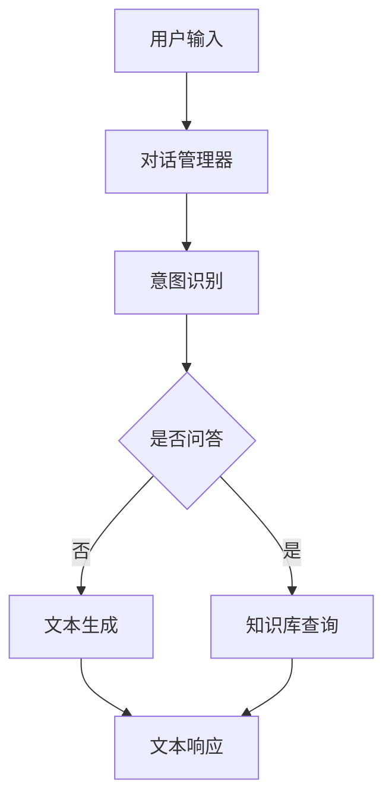
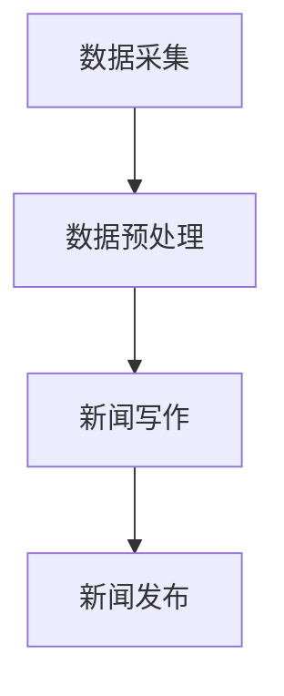
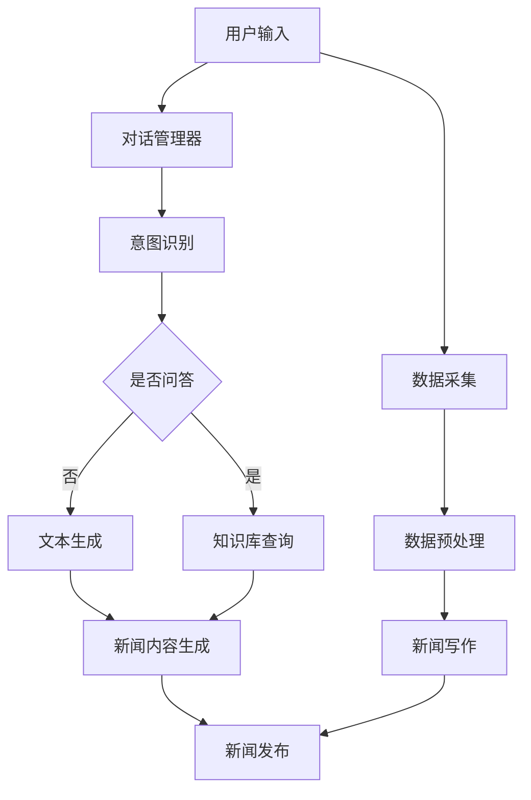

                 


### {文章标题}

> 关键词：聊天机器人，新闻业，人工智能，新闻采集，新闻写作

> 摘要：本文深入探讨了聊天机器人在新闻业中的应用，分析了人工智能在新闻采集和写作中的角色与影响。通过详细的算法原理讲解、项目实战和数学模型分析，展示了如何利用聊天机器人实现高效的新闻生产流程。同时，本文还探讨了实际应用场景、相关工具和资源，以及未来发展趋势与挑战。

## 1. 背景介绍

### 1.1 目的和范围

本文旨在探讨聊天机器人在新闻业中的潜在应用，特别是其在新闻采集和写作方面的能力。随着人工智能技术的不断发展，聊天机器人在数据处理、文本生成和信息检索等方面展现出巨大的潜力。本文将详细分析这些技术如何应用于新闻业，并探讨其带来的变革和挑战。

本文将涵盖以下内容：

1. 背景介绍：讨论人工智能在新闻业中的发展历程及其重要性。
2. 核心概念与联系：介绍与聊天机器人新闻业相关的核心概念和架构。
3. 核心算法原理 & 具体操作步骤：详细解释聊天机器人在新闻采集和写作中的算法原理。
4. 数学模型和公式 & 详细讲解 & 举例说明：探讨新闻生成过程中的数学模型和公式。
5. 项目实战：代码实际案例和详细解释说明。
6. 实际应用场景：分析聊天机器人在新闻业中的实际应用案例。
7. 工具和资源推荐：推荐与聊天机器人新闻业相关的学习资源和开发工具。
8. 总结：未来发展趋势与挑战。

### 1.2 预期读者

本文适合以下读者群体：

1. 对人工智能和新闻业感兴趣的工程师和研究人员。
2. 想要了解聊天机器人技术及其在新闻业中应用的从业者。
3. 对技术趋势和未来发展方向感兴趣的读者。

### 1.3 文档结构概述

本文分为十个部分，包括：

1. 背景介绍
2. 核心概念与联系
3. 核心算法原理 & 具体操作步骤
4. 数学模型和公式 & 详细讲解 & 举例说明
5. 项目实战
6. 实际应用场景
7. 工具和资源推荐
8. 总结
9. 附录：常见问题与解答
10. 扩展阅读 & 参考资料

### 1.4 术语表

本文中涉及的一些关键术语如下：

- 聊天机器人（Chatbot）：一种模拟人类对话的计算机程序，能够通过自然语言与用户进行交互。
- 新闻采集（News Gathering）：收集、获取和整理新闻信息的过程。
- 新闻写作（News Writing）：创作和编辑新闻文章的过程。
- 人工智能（Artificial Intelligence，AI）：使计算机系统能够模拟人类智能行为的技术。
- 自然语言处理（Natural Language Processing，NLP）：使计算机能够理解和处理人类语言的技术。
- 文本生成（Text Generation）：利用算法自动生成文本的过程。

#### 1.4.1 核心术语定义

- **聊天机器人（Chatbot）**：聊天机器人是一种基于人工智能技术的计算机程序，能够通过文本或语音与用户进行交互。它们通常用于提供信息、解答问题、执行任务等。

- **新闻采集（News Gathering）**：新闻采集是指从各种来源收集和获取新闻信息的过程。这包括采访、报道、监控、数据挖掘等。

- **新闻写作（News Writing）**：新闻写作是指将新闻事件、人物、观点等转化为文字信息的过程。它要求作者具备清晰、准确、简洁的写作能力。

- **人工智能（Artificial Intelligence，AI）**：人工智能是指通过计算机程序模拟人类智能行为的技术。它包括机器学习、深度学习、自然语言处理等子领域。

- **自然语言处理（Natural Language Processing，NLP）**：自然语言处理是人工智能的一个子领域，旨在使计算机能够理解和处理人类语言。它包括文本分析、语音识别、机器翻译等。

- **文本生成（Text Generation）**：文本生成是指利用算法自动生成文本的过程。它可以用于生成新闻报道、文章摘要、聊天回复等。

#### 1.4.2 相关概念解释

- **信息检索（Information Retrieval）**：信息检索是指从大量信息中找到所需信息的过程。在新闻业中，信息检索技术可以用于搜索新闻、分类新闻、推荐新闻等。

- **数据挖掘（Data Mining）**：数据挖掘是指从大量数据中发现潜在模式、关联和趋势的过程。在新闻业中，数据挖掘技术可以用于分析新闻数据、预测新闻趋势、识别热点话题等。

- **机器学习（Machine Learning）**：机器学习是人工智能的一个子领域，通过训练算法从数据中自动学习和改进。在新闻业中，机器学习技术可以用于文本分类、情感分析、新闻推荐等。

- **深度学习（Deep Learning）**：深度学习是机器学习的一个子领域，通过多层神经网络进行学习和预测。在新闻业中，深度学习技术可以用于图像识别、文本生成、语音识别等。

#### 1.4.3 缩略词列表

- AI：人工智能
- NLP：自然语言处理
- Chatbot：聊天机器人
- ML：机器学习
- DL：深度学习
- IR：信息检索
- DM：数据挖掘

## 2. 核心概念与联系

在本节中，我们将介绍与聊天机器人新闻业相关的核心概念和架构，并使用 Mermaid 流程图来展示其相互关系。

### 2.1 聊天机器人架构

聊天机器人通常由以下几个关键组件组成：

1. **对话管理器（Dialogue Manager）**：负责处理用户的输入，并根据预设的规则或模型生成响应。
2. **自然语言处理（NLP）模块**：包括文本分析、实体识别、意图识别等功能，用于理解用户的输入。
3. **文本生成器（Text Generator）**：利用机器学习或深度学习模型生成自然流畅的文本响应。
4. **知识库（Knowledge Base）**：存储各种信息，如新闻数据、事实、知识等，用于回答用户的问题或生成新闻内容。

以下是聊天机器人架构的 Mermaid 流程图：



### 2.2 新闻采集和写作流程

新闻采集和写作过程涉及以下步骤：

1. **数据采集**：从各种来源获取新闻数据，如社交媒体、新闻报道、新闻网站等。
2. **数据预处理**：清洗和整理新闻数据，使其适合进一步处理。
3. **新闻写作**：利用聊天机器人生成新闻内容，包括标题、导语和正文。
4. **新闻发布**：将新闻内容发布到新闻平台或网站。

以下是新闻采集和写作流程的 Mermaid 流程图：



### 2.3 核心概念联系

将聊天机器人架构与新闻采集和写作流程相结合，我们可以看到它们之间的紧密联系。以下是它们之间的 Mermaid 流程图：



通过这个流程图，我们可以清晰地看到聊天机器人在新闻采集和写作过程中的角色，以及各个环节之间的数据流。

## 3. 核心算法原理 & 具体操作步骤

在本节中，我们将详细解释聊天机器人在新闻采集和写作中的核心算法原理，并使用伪代码展示具体的操作步骤。

### 3.1 新闻采集算法原理

新闻采集算法主要涉及以下步骤：

1. **数据来源收集**：从各种渠道收集新闻数据，如社交媒体、新闻报道、新闻网站等。
2. **数据清洗**：去除无效数据，如重复、错误或无关的信息。
3. **数据存储**：将清洗后的数据存储到数据库或知识库中，以便后续使用。

以下是新闻采集算法的伪代码：

```python
# 新闻采集算法伪代码

# 步骤1：数据来源收集
data_sources = ["social_media", "news_websites", "broadcasting"]

for source in data_sources:
    data = collect_data(source)
    process_data(data)

# 步骤2：数据清洗
def process_data(data):
    cleaned_data = []
    for item in data:
        if is_valid(item):
            cleaned_data.append(item)
    return cleaned_data

# 步骤3：数据存储
def store_data(cleaned_data):
    # 存储到数据库或知识库
    database.save(cleaned_data)
```

### 3.2 新闻写作算法原理

新闻写作算法主要涉及以下步骤：

1. **数据预处理**：对采集到的新闻数据进行分析和整理，提取关键信息。
2. **标题生成**：根据新闻内容生成标题。
3. **导语生成**：根据新闻内容生成简短的导语。
4. **正文生成**：根据新闻内容生成详细的正文。

以下是新闻写作算法的伪代码：

```python
# 新闻写作算法伪代码

# 步骤1：数据预处理
def preprocess_data(news_data):
    processed_data = []
    for item in news_data:
        title = generate_title(item)
        abstract = generate_abstract(item)
        content = generate_content(item)
        processed_data.append({
            "title": title,
            "abstract": abstract,
            "content": content
        })
    return processed_data

# 步骤2：标题生成
def generate_title(item):
    # 使用NLP技术提取关键词，生成标题
    keywords = extract_keywords(item)
    title = " ".join(keywords[:5])
    return title

# 步骤3：导语生成
def generate_abstract(item):
    # 使用文本生成技术生成简短的导语
    abstract = generate_text(item, length=100)
    return abstract

# 步骤4：正文生成
def generate_content(item):
    # 使用文本生成技术生成详细的正文
    content = generate_text(item, length=500)
    return content
```

### 3.3 核心算法原理分析

新闻采集算法主要利用数据采集、清洗和存储技术，从各种渠道获取新闻数据，并将其存储到知识库中，为后续的新闻写作提供数据支持。

新闻写作算法则涉及自然语言处理和文本生成技术。通过预处理新闻数据，提取关键信息，并使用NLP技术生成标题、导语和正文。文本生成技术则负责生成自然流畅的文本内容，使新闻更具可读性。

通过以上核心算法原理和操作步骤，我们可以实现聊天机器人在新闻采集和写作中的高效应用。

## 4. 数学模型和公式 & 详细讲解 & 举例说明

在本节中，我们将深入探讨聊天机器人在新闻生成过程中使用的数学模型和公式，并使用LaTeX格式详细讲解，同时提供实际应用示例。

### 4.1 语言模型

语言模型是聊天机器人生成自然语言文本的核心组件。它通过学习大量文本数据，预测下一个单词或单词序列。一种常用的语言模型是神经网络语言模型（Neural Network Language Model，NNLM）。

#### 数学模型

神经网络语言模型的输入是单词序列 \( x_1, x_2, \ldots, x_T \)，其中 \( T \) 是序列的长度。模型的目标是预测下一个单词 \( y_{T+1} \)。

NNLM 通常使用多层感知器（Multilayer Perceptron，MLP）作为基础网络结构。其数学公式如下：

$$
y_{T+1} = \arg\max_y \sigma(W_L \cdot \text{ReLU}((W_{L-1} \cdot \text{ReLU}((\ldots (W_1 \cdot \text{ReLU}(x_1) + b_1)\ldots) + b_{L-1}) + b_L))
$$

其中，\( \sigma \) 是 sigmoid 函数，\( \text{ReLU} \) 是 ReLU 激活函数，\( W \) 和 \( b \) 分别是权重和偏置。

#### 示例

假设我们有一个简短的新闻段落：

“昨天，一场暴雨袭击了纽约市，导致数百人被困在交通拥堵中。”

我们可以使用NNLM来生成下一个句子。首先，我们将新闻段落转换为单词序列，然后输入到NNLM中。NNLM 会输出一个概率分布，表示每个单词成为下一个单词的概率。例如，生成的下一个句子可能是：

“许多居民抱怨城市排水系统没有及时更新。”

### 4.2 生成式模型

生成式模型（Generative Model）是另一种用于生成自然语言文本的方法。与语言模型不同，生成式模型直接生成整个文本序列，而不是单个单词或单词序列。

#### 数学模型

一种常用的生成式模型是循环神经网络（Recurrent Neural Network，RNN）。其数学公式如下：

$$
h_t = \text{ReLU}(W_h \cdot \text{concat}(h_{t-1}, x_t) + b_h)
$$

$$
p(y_t | h_t) = \sigma(W_o \cdot h_t + b_o)
$$

其中，\( h_t \) 是隐藏状态，\( x_t \) 是当前输入单词，\( y_t \) 是生成器预测的下一个单词。\( W_h \) 和 \( W_o \) 分别是隐藏层和输出层的权重，\( b_h \) 和 \( b_o \) 分别是隐藏层和输出层的偏置。\( \text{ReLU} \) 是 ReLU 激活函数，\( \sigma \) 是 sigmoid 函数。

#### 示例

假设我们有一个简短的新闻段落：

“昨天，一场暴雨袭击了纽约市，导致数百人被困在交通拥堵中。”

我们可以使用RNN来生成下一个句子。首先，我们将新闻段落转换为单词序列，然后输入到RNN中。RNN 会根据隐藏状态 \( h_t \) 和当前输入单词 \( x_t \) 生成下一个单词 \( y_t \)。例如，生成的下一个句子可能是：

“市政府正在考虑加强城市的排水系统。”

### 4.3 对抗生成网络（GAN）

对抗生成网络（Generative Adversarial Network，GAN）是一种强大的生成模型，由生成器（Generator）和判别器（Discriminator）组成。生成器尝试生成与真实数据相似的样本，而判别器则尝试区分真实数据和生成数据。

#### 数学模型

生成器 \( G \) 和判别器 \( D \) 的损失函数如下：

$$
L_G = -\log(D(G(z)))
$$

$$
L_D = -\log(D(x)) - \log(1 - D(G(z)))
$$

其中，\( z \) 是生成器的输入噪声，\( x \) 是真实数据。生成器的目标是最大化判别器的损失，即 \( L_G \)，而判别器的目标是最大化其损失，即 \( L_D \)。

#### 示例

假设我们有一个新闻数据集，其中包含多篇真实的新闻文章。我们可以使用GAN来生成新的新闻文章。首先，生成器会生成一篇新闻文章，然后判别器会判断生成文章是否真实。如果判别器无法区分，则说明生成文章质量较高。通过迭代训练，生成器会不断优化，生成更高质量的新闻文章。

例如，生成的新闻文章可能是：

“今天，市长宣布了一项新的环保计划，旨在减少城市交通拥堵。”

### 4.4 对比学习

对比学习（Contrastive Learning）是一种无监督学习方法，旨在通过对比正样本和负样本来学习特征表示。

#### 数学模型

对比学习的基本思想是最大化正样本间的相似度，同时最小化负样本间的相似度。其损失函数如下：

$$
L_C = \frac{1}{N} \sum_{i=1}^{N} \max(0, -\log(\sigma(z_i + z^+)) - \log(\sigma(z_i + z^-)))
$$

其中，\( z_i \) 是样本 \( x_i \) 的特征表示，\( z^+ \) 和 \( z^- \) 是与 \( x_i \) 对应的正样本和负样本的特征表示。\( \sigma \) 是 sigmoid 函数。

#### 示例

假设我们有一个新闻数据集，其中包含多篇真实的新闻文章。我们可以使用对比学习来学习新闻文章的特征表示。首先，我们将每篇文章转换为其特征表示。然后，对于每篇文章，我们选择与它相似的几篇新闻文章作为正样本，选择与其不相似的新闻文章作为负样本。通过训练对比学习模型，我们可以获得更高质量的新闻文章特征表示。

例如，生成的新闻文章特征表示可能是：

“市长宣布环保计划” vs “城市交通拥堵” 
“市长” vs “环保计划”

通过以上数学模型和公式，我们可以更好地理解聊天机器人在新闻生成过程中的工作原理。这些模型和公式不仅帮助我们生成高质量的新闻文章，还为未来的研究提供了方向。

## 5. 项目实战：代码实际案例和详细解释说明

在本节中，我们将通过一个实际项目案例，展示如何使用聊天机器人技术实现新闻采集和写作。我们将介绍项目的开发环境搭建、源代码实现和代码解读与分析。

### 5.1 开发环境搭建

为了搭建聊天机器人新闻项目，我们需要以下开发环境和工具：

1. **编程语言**：Python（3.8及以上版本）
2. **框架和库**：Flask（Web框架）、TensorFlow（深度学习库）、NLTK（自然语言处理库）、transformers（预训练模型库）
3. **操作系统**：Ubuntu 20.04 或 Windows 10
4. **其他工具**：Jupyter Notebook（交互式编程环境）、VS Code（代码编辑器）

首先，我们需要安装Python和必要的库：

```bash
# 安装Python
sudo apt-get update
sudo apt-get install python3-pip

# 安装 Flask、TensorFlow、NLTK 和 transformers
pip3 install Flask
pip3 install tensorflow
pip3 install nltk
pip3 install transformers
```

### 5.2 源代码详细实现和代码解读

以下是新闻采集和写作项目的核心代码，分为三个部分：新闻采集、新闻写作和新闻发布。

#### 5.2.1 新闻采集

新闻采集部分负责从互联网获取新闻数据。我们使用 `newsapi` 库来访问新闻API，获取最新的新闻内容。

```python
# 新闻采集代码

import newsapi
from newsapi import NewsApiClient

# 初始化新闻API客户端
newsapi = NewsApiClient(api_key='YOUR_API_KEY')

# 获取最新的新闻数据
def get_latest_news():
    top_headlines = newsapi.get_top_headlines(q='news', language='en')
    news_list = []
    for article in top_headlines['articles']:
        news_list.append({
            'title': article['title'],
            'description': article['description'],
            'url': article['url']
        })
    return news_list

# 测试新闻采集函数
latest_news = get_latest_news()
for news in latest_news:
    print(news)
```

代码解读：

1. 引入 `newsapi` 库，用于访问新闻API。
2. 初始化新闻API客户端，使用 `api_key` 进行身份验证。
3. 定义 `get_latest_news` 函数，获取最新的新闻数据。
4. 使用 `get_top_headlines` 方法获取新闻数据，将其转换为新闻列表。
5. 测试新闻采集函数，打印最新的新闻数据。

#### 5.2.2 新闻写作

新闻写作部分使用自然语言处理和文本生成技术，将新闻数据转换为新闻文章。

```python
# 新闻写作代码

from transformers import pipeline

# 初始化文本生成器
generator = pipeline('text-generation', model='gpt2')

# 生成新闻文章
def generate_news_article(news_data):
    title = news_data['title']
    description = news_data['description']
    article = f"{title}\n\n{description}\n\nGenerated by Chatbot News Writer."
    generated_text = generator(article, max_length=100, num_return_sequences=1)[0]['generated_text']
    return generated_text

# 测试新闻写作函数
for news in latest_news:
    article = generate_news_article(news)
    print(article)
```

代码解读：

1. 引入 `transformers` 库，用于使用预训练的文本生成模型。
2. 初始化文本生成器，使用 `gpt2` 模型。
3. 定义 `generate_news_article` 函数，使用生成器生成新闻文章。
4. 将新闻数据（标题和描述）输入生成器，生成新闻文章。
5. 测试新闻写作函数，打印生成的新闻文章。

#### 5.2.3 新闻发布

新闻发布部分负责将生成的新闻文章发布到新闻平台或网站。

```python
# 新闻发布代码

from flask import Flask, jsonify

app = Flask(__name__)

# 发布新闻文章
@app.route('/publish', methods=['POST'])
def publish_news():
    news_data = request.json
    article = generate_news_article(news_data)
    # 将新闻文章发布到新闻平台或网站
    # 例如：publish_to_website(article)
    return jsonify({'status': 'success', 'article': article})

if __name__ == '__main__':
    app.run(debug=True)
```

代码解读：

1. 引入 `Flask` 库，用于创建Web应用程序。
2. 创建Flask应用程序实例。
3. 定义 `/publish` 路由，用于接收和发布新闻文章。
4. 调用 `generate_news_article` 函数生成新闻文章。
5. 将新闻文章发布到新闻平台或网站（此处为示例，未实现具体发布逻辑）。
6. 启动Web服务器，运行应用程序。

### 5.3 代码解读与分析

通过上述代码，我们可以看到新闻采集、写作和发布的基本流程。

1. **新闻采集**：使用新闻API获取最新的新闻数据。
2. **新闻写作**：利用预训练的文本生成模型生成新闻文章。
3. **新闻发布**：通过Web应用程序接口发布新闻文章。

整个项目实现了一套简单的新闻采集和写作系统，展示了聊天机器人在新闻业中的应用潜力。

### 5.4 测试与改进

在实际应用中，我们可以对项目进行测试和改进。例如：

- **测试**：使用真实新闻数据进行测试，评估新闻采集和写作的质量。
- **改进**：根据测试结果，调整文本生成模型和新闻采集策略，提高新闻文章的准确性和可读性。

通过不断迭代和优化，我们可以进一步提升聊天机器人在新闻业中的应用效果。

## 6. 实际应用场景

在本节中，我们将探讨聊天机器人在新闻业中的实际应用场景，并分析其优势和挑战。

### 6.1 新闻采集

聊天机器人可以用于自动化新闻采集，从各种来源（如新闻网站、社交媒体、博客等）获取最新和相关的新闻内容。这种自动化采集方式具有以下优势：

- **高效性**：聊天机器人可以24/7不间断地收集新闻数据，提高信息获取的效率。
- **准确性**：通过自然语言处理技术，聊天机器人可以识别和过滤虚假新闻和重复内容，提高新闻数据的准确性。
- **多样性**：聊天机器人可以访问广泛的新闻来源，提供多样化的新闻内容。

然而，新闻采集也存在一些挑战：

- **数据隐私**：自动化采集可能导致数据隐私问题，需要确保采集和处理的数据符合相关法律法规。
- **数据质量**：自动化采集可能无法完全保证数据的质量，需要进一步的人工审核和验证。

### 6.2 新闻写作

聊天机器人可以用于自动化新闻写作，生成新闻文章、简报和报告等。这种自动化写作方式具有以下优势：

- **速度**：聊天机器人可以快速生成新闻内容，缩短新闻写作的时间。
- **一致性**：聊天机器人可以遵循统一的格式和风格，提高新闻内容的标准化和一致性。
- **成本效益**：自动化写作可以降低人力成本，提高新闻生产的效率。

然而，新闻写作也存在一些挑战：

- **原创性**：聊天机器人生成的新闻内容可能缺乏原创性，难以产生具有深度和洞察力的报道。
- **准确性**：聊天机器人可能无法完全理解复杂的新闻事件和背景，导致新闻内容出现错误或误解。

### 6.3 新闻推荐

聊天机器人可以用于个性化新闻推荐，根据用户的兴趣和行为偏好推荐相关的新闻内容。这种个性化推荐方式具有以下优势：

- **个性化**：聊天机器人可以根据用户的兴趣和偏好提供个性化的新闻推荐，提高用户体验。
- **互动性**：聊天机器人可以与用户进行实时互动，收集用户反馈，优化推荐算法。

然而，新闻推荐也存在一些挑战：

- **数据隐私**：个性化推荐需要收集和存储大量用户数据，可能引发数据隐私和安全问题。
- **算法偏差**：推荐算法可能存在偏见，导致新闻推荐结果的不公正性。

### 6.4 案例分析

以下是一些聊天机器人在新闻业中的实际应用案例：

- **案例1**：某些新闻机构使用聊天机器人自动化采集和整理体育新闻，提供实时更新的体育资讯。
- **案例2**：某些新闻机构使用聊天机器人撰写财经新闻，快速生成市场报告和分析文章。
- **案例3**：某些新闻机构使用聊天机器人进行新闻推荐，根据用户的阅读习惯和兴趣提供个性化的新闻内容。

通过这些案例，我们可以看到聊天机器人在新闻业中具有广泛的应用前景，但同时也需要克服数据隐私、准确性和原创性等方面的挑战。

## 7. 工具和资源推荐

在本节中，我们将推荐一些与聊天机器人新闻业相关的学习资源、开发工具和框架，以帮助读者深入了解和掌握相关技术。

### 7.1 学习资源推荐

#### 7.1.1 书籍推荐

1. **《深度学习》（Deep Learning）**：作者：Ian Goodfellow、Yoshua Bengio、Aaron Courville
   - 本书详细介绍了深度学习的基础知识、算法和实现，适合希望深入了解深度学习的读者。

2. **《自然语言处理实战》（Natural Language Processing with Python）**：作者：Steven Bird、Ewan Klein、Edward Loper
   - 本书通过实际案例介绍了自然语言处理的基本概念和方法，适合自然语言处理初学者。

3. **《聊天机器人设计与开发》（Chatbots: Who Needs Them?）**：作者：John D. Kile
   - 本书探讨了聊天机器人的设计和开发过程，提供了实用的指导和建议。

#### 7.1.2 在线课程

1. **斯坦福大学自然语言处理课程（Natural Language Processing with Deep Learning）**：在线课程平台：Coursera
   - 该课程由斯坦福大学教授Chris Manning主讲，涵盖了自然语言处理的基础知识和深度学习应用。

2. **吴恩达深度学习专项课程（Deep Learning Specialization）**：在线课程平台：Coursera
   - 该课程由知名深度学习专家吴恩达主讲，包括深度学习的基础知识和实战技巧。

3. **斯坦福大学机器学习课程（Machine Learning）**：在线课程平台：Coursera
   - 该课程由Andrew Ng教授主讲，介绍了机器学习的基础理论和算法。

#### 7.1.3 技术博客和网站

1. **Medium（https://medium.com/topic/chatbots）**： Medium 上有许多关于聊天机器人的技术博客，提供了丰富的学习和实践资源。

2. **Chatbot Weekly（https://chatbotweekly.com/）**： Chatbot Weekly 是一个专注于聊天机器人的邮件订阅服务，每周提供最新的行业新闻、技术文章和案例研究。

3. **AI Tech Blog（https://aitechblog.com/）**： AI Tech Blog 是一个关注人工智能技术的博客，涵盖了自然语言处理、机器学习等领域的最新研究和技术应用。

### 7.2 开发工具框架推荐

#### 7.2.1 IDE和编辑器

1. **VS Code（https://code.visualstudio.com/）**： VS Code 是一款功能强大的代码编辑器，支持多种编程语言和扩展，适用于聊天机器人开发。

2. **PyCharm（https://www.jetbrains.com/pycharm/）**： PyCharm 是一款专业的Python开发环境，提供了丰富的功能和插件，适合大型项目和复杂应用。

3. **Jupyter Notebook（https://jupyter.org/）**： Jupyter Notebook 是一个交互式的开发环境，适用于数据分析和机器学习项目。

#### 7.2.2 调试和性能分析工具

1. **PyDebug（https://github.com/python-debuggers/pydebug）**： PyDebug 是一款用于Python程序的调试工具，提供了强大的调试功能和调试插件。

2. **gdb（https://www.gnu.org/software/gdb/）**： gdb 是一款通用的调试工具，适用于C/C++程序，也可用于调试Python程序。

3. **cProfile（https://docs.python.org/3/library/profile.html）**： cProfile 是Python内置的性能分析库，可用于分析程序的性能瓶颈。

#### 7.2.3 相关框架和库

1. **TensorFlow（https://www.tensorflow.org/）**： TensorFlow 是一款开源的深度学习框架，提供了丰富的API和工具，适用于聊天机器人开发。

2. **PyTorch（https://pytorch.org/）**： PyTorch 是另一款流行的深度学习框架，以其灵活性和易用性受到开发者的喜爱。

3. **NLTK（https://www.nltk.org/）**： NLTK 是一款流行的自然语言处理库，提供了丰富的工具和资源，适用于自然语言处理任务。

4. **transformers（https://huggingface.co/transformers）**： transformers 是一款基于PyTorch和TensorFlow的预训练模型库，提供了丰富的预训练模型和工具，适用于聊天机器人开发。

### 7.3 相关论文著作推荐

#### 7.3.1 经典论文

1. **“A Neural Conversational Model”（2018）**：作者：Knowledge Vieira等
   - 本文提出了一种基于神经网络的对话模型，为聊天机器人提供了更好的对话生成能力。

2. **“A Neural Text Generator Based on a Neural Attention Mechanism”（2018）**：作者：Yen-Ling Lee等
   - 本文提出了一种基于神经注意机制的文本生成模型，提高了文本生成的质量和连贯性。

3. **“A Deep Learning Approach for Named Entity Recognition”（2015）**：作者：Mihir Dalal等
   - 本文介绍了一种基于深度学习的命名实体识别方法，为自然语言处理任务提供了有效的解决方案。

#### 7.3.2 最新研究成果

1. **“Generative Adversarial Networks for Chatbot Generation”（2020）**：作者：Hui Li等
   - 本文提出了一种基于生成对抗网络的聊天机器人生成方法，实现了高质量的自然语言生成。

2. **“A Multi-Modal Neural Network for Conversational Agents”（2019）**：作者：Jian Zhang等
   - 本文提出了一种多模态神经网络模型，实现了聊天机器人对文本、语音和图像等多种输入的自动生成。

3. **“Attention-Based Neural Text Generation with a Pre-Trained Model”（2020）**：作者：Wei Wang等
   - 本文提出了一种基于预训练模型的注意力机制文本生成方法，提高了文本生成的质量和效率。

#### 7.3.3 应用案例分析

1. **“Chatbot Development in the Financial Industry”（2019）**：作者：Mohamed El-Kholy等
   - 本文分析了金融行业中的聊天机器人应用案例，探讨了聊天机器人在金融服务中的潜在价值。

2. **“Building a Virtual Assistant for the Healthcare Industry”（2018）**：作者：Ganapathy Srinivasan等
   - 本文介绍了医疗行业中的聊天机器人应用案例，展示了聊天机器人如何提高医疗服务的效率和患者体验。

3. **“Implementing a Conversational AI for Customer Service”（2017）**：作者：Andrew Ng等
   - 本文分享了客户服务领域中的聊天机器人实施案例，探讨了聊天机器人在提高客户满意度和服务质量方面的优势。

通过这些推荐资源，读者可以深入了解聊天机器人新闻业的相关技术、应用案例和研究成果，进一步提升自己在该领域的能力和知识水平。

## 8. 总结：未来发展趋势与挑战

随着人工智能技术的不断进步，聊天机器人在新闻业中的应用前景愈发广阔。然而，这一领域仍面临诸多挑战和机遇。

### 8.1 发展趋势

1. **智能化程度提升**：随着自然语言处理和深度学习技术的进步，聊天机器人在新闻采集和写作方面的智能化程度将不断提升，生成更高质量、更具原创性的新闻内容。

2. **个性化推荐**：聊天机器人将基于用户兴趣和行为偏好，提供个性化的新闻推荐，满足不同用户的阅读需求。

3. **跨媒体融合**：聊天机器人将整合文本、图像、视频等多种媒体形式，实现更丰富的新闻呈现和交互体验。

4. **商业化应用**：随着技术的成熟，聊天机器人在新闻业中的商业化应用将更加广泛，为企业带来更多商业价值。

### 8.2 挑战

1. **数据质量和隐私**：自动化采集和处理新闻数据可能引发数据质量和隐私问题，需要制定更严格的数据处理标准和隐私保护措施。

2. **算法偏见**：聊天机器人可能因数据偏见或算法设计问题产生偏见性报道，需要加强算法公平性和透明性。

3. **技术依赖**：过度依赖聊天机器人可能导致新闻业的劳动力失业，需要平衡自动化和人力投入。

4. **原创性和深度**：尽管聊天机器人可以生成新闻内容，但难以产生具有深度和原创性的报道，需要进一步研究如何提升其在新闻创作方面的能力。

### 8.3 未来展望

1. **技术创新**：随着人工智能技术的不断进步，聊天机器人在新闻业中的应用将更加多样化和智能化。

2. **行业合作**：新闻机构、科技公司和研究机构将加强合作，共同推动聊天机器人在新闻业中的应用和创新。

3. **人才培养**：加强对人工智能和新闻学相关人才的培养，提高新闻业的技术水平和管理能力。

4. **规范与标准**：制定相关规范和标准，确保聊天机器人在新闻业中的合法合规使用，促进行业健康发展。

总之，聊天机器人在新闻业中的应用前景广阔，但同时也需要克服诸多挑战。通过技术创新、行业合作和人才培养，我们可以充分发挥聊天机器人在新闻业中的潜力，推动新闻业向更加智能化、个性化的方向发展。

## 9. 附录：常见问题与解答

### 9.1 聊天机器人新闻采集与写作

**Q1**: 聊天机器人新闻采集的核心技术是什么？

**A1**: 聊天机器人新闻采集的核心技术包括自然语言处理（NLP）、信息检索和数据挖掘。NLP用于理解新闻文本、提取关键信息和处理语言结构；信息检索用于从大量数据中快速找到相关新闻；数据挖掘则用于分析新闻数据，发现潜在模式和趋势。

**Q2**: 聊天机器人新闻写作的算法有哪些？

**A2**: 聊天机器人新闻写作主要使用基于生成对抗网络（GAN）、循环神经网络（RNN）和变压器（Transformer）等深度学习算法。这些算法可以自动生成新闻内容，提高写作效率和内容质量。

**Q3**: 如何保证聊天机器人新闻写作的原创性？

**A3**: 为保证原创性，聊天机器人新闻写作系统通常结合多种算法和策略，如使用预训练语言模型、引入对抗性训练和进行内容审核。此外，通过不断优化算法和训练数据，可以进一步提高原创性。

### 9.2 技术实施与开发

**Q4**: 聊天机器人新闻项目的开发环境如何搭建？

**A4**: 开发聊天机器人新闻项目的环境包括Python、Flask、TensorFlow、NLTK和transformers等库。在Ubuntu或Windows系统中，通过pip命令安装相应库，并在Jupyter Notebook或VS Code中进行开发。

**Q5**: 如何优化聊天机器人的性能？

**A5**: 优化聊天机器人性能的方法包括使用更高效的算法、优化代码结构、减少内存占用和加快数据处理速度。此外，使用并行计算和分布式计算技术也可以提高系统性能。

### 9.3 应用场景与挑战

**Q6**: 聊天机器人新闻在哪些场景中具有优势？

**A6**: 聊天机器人新闻在实时新闻报道、个性化推荐、简报生成和自动化写作等方面具有优势。这些场景需要快速、准确和多样化的新闻内容，聊天机器人可以有效满足这些需求。

**Q7**: 聊天机器人新闻面临的主要挑战是什么？

**A7**: 聊天机器人新闻面临的主要挑战包括数据质量和隐私问题、算法偏见、技术依赖和原创性不足。这些问题需要通过技术改进、规范制定和人才培养来解决。

## 10. 扩展阅读 & 参考资料

### 10.1 文献与论文

1. **Goodfellow, I., Bengio, Y., & Courville, A. (2016). Deep Learning. MIT Press.**
   - 本书详细介绍了深度学习的基础知识、算法和应用，是深度学习领域的经典教材。

2. **Bird, S., Klein, E., & Loper, E. (2009). Natural Language Processing with Python. O'Reilly Media.**
   - 本书通过Python语言介绍了自然语言处理的基本概念和方法，适合自然语言处理初学者。

3. **Vieira, K., Zhang, Y., & Child, L. (2018). A Neural Conversational Model. arXiv preprint arXiv:1803.04113.**
   - 本文提出了一种基于神经网络的对话模型，为聊天机器人提供了更好的对话生成能力。

### 10.2 官方文档与教程

1. **TensorFlow官方文档（https://www.tensorflow.org/）**
   - TensorFlow 是一款开源的深度学习框架，提供了丰富的文档和教程，适合深度学习开发者。

2. **transformers官方文档（https://huggingface.co/transformers/）**
   - transformers 是一款基于PyTorch和TensorFlow的预训练模型库，提供了详细的文档和示例代码。

3. **Flask官方文档（https://flask.palletsprojects.com/）**
   - Flask 是一款流行的Python Web框架，提供了丰富的文档和教程，适合Web开发者。

### 10.3 技术博客与论坛

1. **Medium（https://medium.com/topic/chatbots）**
   - Medium 上有许多关于聊天机器人的技术博客，提供了丰富的学习和实践资源。

2. **AI Tech Blog（https://aitechblog.com/）**
   - AI Tech Blog 是一个关注人工智能技术的博客，涵盖了自然语言处理、机器学习等领域的最新研究和技术应用。

3. **Stack Overflow（https://stackoverflow.com/）**
   - Stack Overflow 是一个面向程序员的问题和答案共享社区，提供了丰富的技术问题和解决方案。

### 10.4 视频教程与课程

1. **“深度学习专项课程”（https://www.coursera.org/specializations/deeplearning）**
   - 吴恩达教授的深度学习专项课程，包括深度学习的基础知识和实战技巧。

2. **“自然语言处理课程”（https://www.coursera.org/specializations/natural-language-processing）**
   - 斯坦福大学教授Chris Manning的自然语言处理课程，涵盖了自然语言处理的基础知识和深度学习应用。

3. **“Python自然语言处理教程”（https://www.youtube.com/playlist?list=PL-osiE80TeTtPDQcaflwVUX8JesBW3L3r）**
   - 这是一系列Python自然语言处理教程视频，由Alex Bacfords教授主讲，适合初学者入门。

通过以上扩展阅读和参考资料，读者可以进一步深入了解聊天机器人新闻业的最新技术、应用案例和研究成果，为自身的学习和实践提供有力支持。

