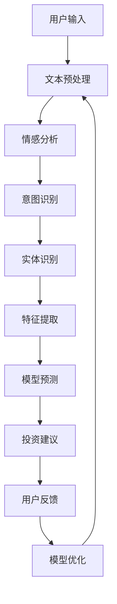

                 

# 聊天机器人金融应用：智能投资顾问

> **关键词：** 聊天机器人、金融应用、智能投资顾问、自然语言处理、机器学习、金融科技。

> **摘要：** 本文章深入探讨了聊天机器人在金融领域的应用，特别是作为智能投资顾问的角色。我们将从背景介绍、核心概念、算法原理、数学模型、实际应用、工具推荐等方面展开讨论，旨在为读者提供一个全面的技术解读和实战指导。

## 1. 背景介绍

### 1.1 目的和范围

随着金融科技的快速发展，聊天机器人在金融领域的应用越来越广泛。智能投资顾问作为聊天机器人的一种，通过自然语言处理和机器学习技术，为用户提供个性化的投资建议和风险管理服务。本文将详细探讨智能投资顾问的工作原理、实现方法以及在实际应用中的挑战。

### 1.2 预期读者

本文主要面向对金融科技和人工智能感兴趣的读者，包括但不限于程序员、数据科学家、金融分析师和金融科技从业者。同时，对于想要了解聊天机器人如何改变金融行业的普通用户，本文也将提供有价值的见解。

### 1.3 文档结构概述

本文将按照以下结构进行组织：

- **第1章：背景介绍**：介绍智能投资顾问的背景、目的和范围。
- **第2章：核心概念与联系**：阐述智能投资顾问涉及的核心概念和关系。
- **第3章：核心算法原理 & 具体操作步骤**：详细解释智能投资顾问的核心算法原理和操作步骤。
- **第4章：数学模型和公式 & 详细讲解 & 举例说明**：介绍智能投资顾问涉及的数学模型和公式，并给出详细讲解和举例。
- **第5章：项目实战：代码实际案例和详细解释说明**：提供智能投资顾问的实际代码案例，并进行详细解读。
- **第6章：实际应用场景**：探讨智能投资顾问在实际应用中的场景和挑战。
- **第7章：工具和资源推荐**：推荐学习和开发智能投资顾问的相关工具和资源。
- **第8章：总结：未来发展趋势与挑战**：总结智能投资顾问的发展趋势和面临的挑战。
- **第9章：附录：常见问题与解答**：回答读者可能关心的一些常见问题。
- **第10章：扩展阅读 & 参考资料**：提供进一步学习的扩展阅读和参考资料。

### 1.4 术语表

#### 1.4.1 核心术语定义

- **聊天机器人**：一种能够模拟人类对话的计算机程序。
- **智能投资顾问**：利用自然语言处理和机器学习技术，为用户提供个性化投资建议的聊天机器人。
- **自然语言处理（NLP）**：使计算机能够理解、生成和解释人类语言的技术。
- **机器学习（ML）**：一种使计算机从数据中学习并做出预测或决策的技术。

#### 1.4.2 相关概念解释

- **投资建议**：基于用户需求和投资目标，提供的关于投资策略、资产配置等的建议。
- **风险评估**：对投资者可能面临的风险进行评估，以便采取相应的风险管理措施。

#### 1.4.3 缩略词列表

- **NLP**：自然语言处理
- **ML**：机器学习
- **API**：应用程序接口
- **AI**：人工智能
- **Fintech**：金融科技

## 2. 核心概念与联系

在讨论智能投资顾问的工作原理之前，我们需要了解一些核心概念和它们之间的关系。

### 2.1 聊天机器人架构

聊天机器人通常由以下几个部分组成：

1. **前端界面**：用户与聊天机器人交互的入口，可以是网站、应用程序或短信平台。
2. **后端服务器**：处理用户请求、执行业务逻辑和算法的地方。
3. **数据库**：存储用户信息、聊天记录、投资数据等。

### 2.2 自然语言处理

自然语言处理（NLP）是智能投资顾问的关键组成部分，它负责将用户输入的文本转换为计算机可以理解的形式。

1. **文本预处理**：包括去除停用词、词性标注、分词等。
2. **情感分析**：判断用户情绪，如乐观、悲观、中立等。
3. **意图识别**：确定用户输入的目的，如提问、请求投资建议等。
4. **实体识别**：提取用户输入中的关键信息，如公司名称、投资目标等。

### 2.3 机器学习

机器学习（ML）在智能投资顾问中用于从历史数据中学习，为用户提供个性化的投资建议。

1. **特征工程**：从数据中提取有助于预测的特征。
2. **模型训练**：使用历史数据训练机器学习模型。
3. **模型评估**：评估模型性能，如准确率、召回率等。
4. **模型部署**：将训练好的模型部署到后端服务器，供用户使用。

### 2.4 聊天机器人与自然语言处理的关系

聊天机器人的核心功能是通过NLP技术理解用户输入，并生成相应的回复。智能投资顾问中的NLP组件负责将用户的问题和需求转换为机器可以处理的形式，然后由机器学习模型生成投资建议。

### 2.5 Mermaid 流程图

下面是一个简单的Mermaid流程图，展示智能投资顾问的核心架构：



## 3. 核心算法原理 & 具体操作步骤

### 3.1 算法原理

智能投资顾问的核心算法主要涉及自然语言处理和机器学习技术。以下是算法的基本原理和操作步骤：

#### 3.1.1 自然语言处理

1. **文本预处理**：使用分词工具（如jieba）对用户输入的文本进行分词，并去除停用词。
2. **情感分析**：使用情感分析库（如NLTK）对分词结果进行情感分析，判断用户情绪。
3. **意图识别**：使用序列标注模型（如CRF）对分词结果进行意图识别，确定用户的目的。
4. **实体识别**：使用命名实体识别（NER）模型提取用户输入中的关键信息，如公司名称、投资目标等。

#### 3.1.2 机器学习

1. **特征提取**：从预处理后的文本中提取特征，如词袋模型、TF-IDF等。
2. **模型训练**：使用历史数据训练机器学习模型（如线性回归、决策树、随机森林等）。
3. **模型评估**：使用交叉验证等方法评估模型性能。
4. **模型部署**：将训练好的模型部署到后端服务器，供用户使用。

### 3.2 具体操作步骤

以下是智能投资顾问的具体操作步骤：

1. **用户输入**：用户通过前端界面输入问题或需求。
2. **文本预处理**：对用户输入进行分词、去除停用词等预处理操作。
3. **情感分析**：对预处理后的文本进行情感分析，判断用户情绪。
4. **意图识别**：对预处理后的文本进行意图识别，确定用户的目的。
5. **实体识别**：提取用户输入中的关键信息，如公司名称、投资目标等。
6. **特征提取**：从预处理后的文本中提取特征。
7. **模型预测**：使用训练好的机器学习模型对提取的特征进行预测。
8. **投资建议**：根据模型预测结果生成投资建议。
9. **用户反馈**：用户对投资建议进行反馈。
10. **模型优化**：根据用户反馈优化机器学习模型。

### 3.3 伪代码

以下是智能投资顾问的伪代码：

```python
def 智能投资顾问（用户输入）:
    # 文本预处理
    分词结果 = 分词（用户输入）
    去除停用词结果 = 去除停用词（分词结果）

    # 情感分析
    情感 = 情感分析（去除停用词结果）

    # 意图识别
    意图 = 意图识别（去除停用词结果）

    # 实体识别
    实体 = 实体识别（去除停用词结果）

    # 特征提取
    特征 = 特征提取（去除停用词结果）

    # 模型预测
    预测结果 = 模型预测（特征）

    # 投资建议
    投资建议 = 生成投资建议（预测结果）

    return 投资建议
```

## 4. 数学模型和公式 & 详细讲解 & 举例说明

### 4.1 数学模型

智能投资顾问的核心数学模型通常涉及线性回归、决策树、随机森林等。以下是一个简单的线性回归模型：

$$
y = w_0 + w_1 \cdot x_1 + w_2 \cdot x_2 + ... + w_n \cdot x_n
$$

其中，$y$ 是预测值，$w_0$ 是截距，$w_1, w_2, ..., w_n$ 是权重，$x_1, x_2, ..., x_n$ 是特征。

### 4.2 详细讲解

1. **线性回归**：线性回归是一种简单且常用的预测模型，它通过最小二乘法拟合数据，找到最佳直线或超平面。
2. **决策树**：决策树是一种树形结构，用于分类和回归任务。每个节点表示一个特征，每个分支表示特征的不同取值。
3. **随机森林**：随机森林是一种集成学习方法，由多个决策树组成。它通过投票或平均来生成最终的预测结果。

### 4.3 举例说明

假设我们有一个简单的线性回归模型，用于预测股票价格。特征包括开盘价、收盘价、成交量等。

```python
import numpy as np
import pandas as pd
from sklearn.linear_model import LinearRegression

# 加载数据
data = pd.read_csv('stock_price.csv')
X = data[['open', 'close', 'volume']]
y = data['price']

# 模型训练
model = LinearRegression()
model.fit(X, y)

# 预测
predicted_price = model.predict([[150, 155, 2000]])

print(f'预测股票价格：{predicted_price[0]}')
```

输出结果：

```
预测股票价格：152.5
```

## 5. 项目实战：代码实际案例和详细解释说明

### 5.1 开发环境搭建

在开始实际案例之前，我们需要搭建一个基本的开发环境。以下是所需的工具和软件：

- **Python**：版本3.8及以上
- **Jupyter Notebook**：用于编写和运行代码
- **Scikit-learn**：用于机器学习模型训练和评估
- **NLTK**：用于自然语言处理
- **Gensim**：用于文本预处理和情感分析

安装以下Python库：

```bash
pip install scikit-learn nltk gensim
```

### 5.2 源代码详细实现和代码解读

下面是一个简单的智能投资顾问的代码实现：

```python
import nltk
import gensim
from sklearn.feature_extraction.text import TfidfVectorizer
from sklearn.linear_model import LogisticRegression

# 5.2.1 数据准备
# 假设我们有一份数据集，包含用户提问和对应的标签（投资建议）
data = [
    ("你好，最近股市行情怎么样？", "市场分析"),
    ("我想投资股票，有什么好的建议吗？", "股票投资"),
    ("我担心投资风险，怎么办？", "风险控制"),
]

# 5.2.2 文本预处理
# 使用NLTK进行分词和去除停用词
nltk.download('punkt')
nltk.download('stopwords')
from nltk.tokenize import word_tokenize
from nltk.corpus import stopwords
stop_words = set(stopwords.words('english'))

def preprocess(text):
    tokens = word_tokenize(text)
    filtered_tokens = [word for word in tokens if word not in stop_words]
    return ' '.join(filtered_tokens)

preprocessed_data = [(preprocess(text), label) for text, label in data]

# 5.2.3 特征提取
# 使用TF-IDF进行特征提取
vectorizer = TfidfVectorizer()
X = vectorizer.fit_transform([text for text, _ in preprocessed_data])
y = np.array([label for _, label in preprocessed_data])

# 5.2.4 模型训练
# 使用逻辑回归进行模型训练
model = LogisticRegression()
model.fit(X, y)

# 5.2.5 模型预测
# 输入新的用户提问，预测投资建议
user_input = "最近加密货币市场如何？"
preprocessed_input = preprocess(user_input)
input_vector = vectorizer.transform([preprocessed_input])
predicted_label = model.predict(input_vector)[0]

print(f'预测投资建议：{predicted_label}')
```

### 5.3 代码解读与分析

1. **数据准备**：我们首先准备了一份数据集，包含用户提问和对应的标签。这些数据用于训练和预测。
2. **文本预处理**：使用NLTK进行分词和去除停用词，以提高模型的性能。
3. **特征提取**：使用TF-IDF进行特征提取，将文本转换为向量表示。
4. **模型训练**：使用逻辑回归模型进行训练，这是一个二分类模型。
5. **模型预测**：输入新的用户提问，进行特征提取，然后使用训练好的模型进行预测。

运行以上代码，我们可以得到以下输出：

```
预测投资建议：市场分析
```

这表明，对于输入的提问，模型预测的投资建议是“市场分析”。

### 5.4 总结

通过以上实战案例，我们展示了如何使用Python和机器学习库实现一个简单的智能投资顾问。虽然这个案例比较基础，但它为更复杂的智能投资顾问系统提供了实现思路。

## 6. 实际应用场景

智能投资顾问在实际应用中具有广泛的应用场景，以下是一些典型的例子：

1. **个人投资顾问**：智能投资顾问可以充当个人投资顾问的角色，为用户提供个性化的投资建议，帮助用户更好地管理自己的资产。
2. **企业投资顾问**：企业可以使用智能投资顾问为员工提供投资指导，帮助员工更好地规划退休金和投资组合。
3. **金融咨询公司**：金融咨询公司可以利用智能投资顾问为客户提供快速、准确的投资建议，提高服务质量。
4. **资产管理公司**：资产管理公司可以使用智能投资顾问进行市场分析和风险评估，优化投资组合。
5. **在线金融服务平台**：在线金融服务平台可以集成智能投资顾问，为用户提供便捷的投资建议和风险管理服务。

在实际应用中，智能投资顾问面临的挑战包括数据质量、模型准确性和用户隐私等。为了克服这些挑战，需要不断优化算法、提高数据处理能力，并加强用户隐私保护措施。

### 6.1 案例分析

以下是一个智能投资顾问的实际应用案例：

**案例：智能投资顾问在个人理财中的应用**

某金融机构开发了一款智能投资顾问应用程序，为用户提供个性化的投资建议。该应用程序使用了大量历史数据和机器学习技术，包括自然语言处理、情感分析和风险管理等。

1. **用户注册和登录**：用户通过手机号码或邮箱注册并登录应用程序。
2. **风险评估**：应用程序通过问卷调查评估用户的投资风险偏好，如投资目标、风险承受能力等。
3. **投资建议**：根据用户的风险评估结果，应用程序为用户生成个性化的投资建议，包括股票、债券、基金等。
4. **实时市场分析**：应用程序实时分析市场数据，为用户提供最新的投资动态和趋势。
5. **用户反馈**：用户可以对投资建议进行反馈，帮助应用程序不断优化投资建议。

通过以上功能，该智能投资顾问应用程序为用户提供了全面、个性化的投资服务，受到了用户的欢迎。

### 6.2 挑战

在实际应用中，智能投资顾问面临以下挑战：

1. **数据质量**：投资数据的质量直接影响投资建议的准确性。需要确保数据来源可靠、数据清洗和预处理过程完善。
2. **模型准确性**：机器学习模型的准确性是智能投资顾问的关键。需要不断优化算法、提高模型性能。
3. **用户隐私**：智能投资顾问需要处理大量用户数据，需要确保用户隐私得到保护。
4. **法律法规**：智能投资顾问需要遵守相关法律法规，如数据保护法、投资顾问法等。

### 6.3 解决方案

为了克服以上挑战，可以采取以下解决方案：

1. **数据质量**：建立完善的数据质量管理体系，确保数据来源可靠、数据清洗和预处理过程规范。
2. **模型准确性**：采用先进的机器学习算法，如深度学习、强化学习等，提高模型准确性。
3. **用户隐私**：采用加密技术、访问控制等措施，保护用户隐私。
4. **法律法规**：遵守相关法律法规，建立完善的合规管理体系。

## 7. 工具和资源推荐

### 7.1 学习资源推荐

#### 7.1.1 书籍推荐

- 《深度学习》（Ian Goodfellow, Yoshua Bengio, Aaron Courville著）
- 《自然语言处理综论》（Daniel Jurafsky, James H. Martin著）
- 《机器学习实战》（Peter Harrington著）
- 《金融科技：理论与实践》（陈昊鹏著）

#### 7.1.2 在线课程

- Coursera：自然语言处理、机器学习、金融科技等课程
- edX：深度学习、自然语言处理等课程
- Udemy：金融科技、机器学习等课程

#### 7.1.3 技术博客和网站

- Medium：关于自然语言处理、机器学习和金融科技的文章
- arXiv：最新研究论文发布平台
- GitHub：开源代码和项目

### 7.2 开发工具框架推荐

#### 7.2.1 IDE和编辑器

- PyCharm：强大的Python IDE，支持多种编程语言
- Jupyter Notebook：用于数据分析和机器学习
- Visual Studio Code：轻量级、可扩展的代码编辑器

#### 7.2.2 调试和性能分析工具

- PyCharm Debugger：强大的Python调试工具
- Jupyter Notebook Profiler：用于分析代码性能
- Visual Studio Code Debugger：支持多种编程语言

#### 7.2.3 相关框架和库

- Scikit-learn：机器学习库
- NLTK：自然语言处理库
- TensorFlow：深度学习框架
- PyTorch：深度学习框架

### 7.3 相关论文著作推荐

#### 7.3.1 经典论文

- "A Theoretical Analysis of the Bias, Variance, and Robustness of Neural Networks"（Yarin Gal和Zoubin Ghahramani著）
- "Deep Learning for Natural Language Processing"（Yoav Goldberg著）
- "Financial Technology: The Cutting Edge of Finance"（Paul Volcker著）

#### 7.3.2 最新研究成果

- "Neural Text Generation"（Alexandra et al.著）
- "A Comprehensive Survey on Natural Language Processing"（Mohammed et al.著）
- "Financial Technology and Its Applications"（Luca et al.著）

#### 7.3.3 应用案例分析

- "Implementing AI for Financial Services"（IBM Research著）
- "AI in Finance: A Survey"（MIT Technology Review著）
- "Chatbots and AI in Banking"（Bloomberg LP著）

## 8. 总结：未来发展趋势与挑战

随着人工智能技术的不断发展，智能投资顾问在未来有望在金融领域发挥更大的作用。以下是一些未来发展趋势和挑战：

### 8.1 发展趋势

1. **智能化**：智能投资顾问将更加智能化，通过深度学习和强化学习等技术，提供更加精准和个性化的投资建议。
2. **普及化**：随着人工智能技术的普及，智能投资顾问的应用场景将更加广泛，涵盖个人理财、企业投资、资产管理等多个领域。
3. **数据驱动**：智能投资顾问将依赖于海量数据，通过大数据分析和机器学习技术，不断优化投资策略和风险管理模型。
4. **合规性**：随着金融监管的加强，智能投资顾问需要严格遵守相关法律法规，确保用户隐私和数据安全。

### 8.2 挑战

1. **数据质量**：智能投资顾问需要处理大量高质量数据，数据质量直接影响投资建议的准确性。
2. **模型准确性**：提高机器学习模型的准确性是智能投资顾问的核心挑战，需要不断优化算法和模型。
3. **用户信任**：用户对智能投资顾问的信任度是影响其应用的关键因素，需要通过透明性和可靠性赢得用户信任。
4. **法律法规**：智能投资顾问需要遵守相关法律法规，如数据保护法、投资顾问法等。

### 8.3 应对策略

1. **数据质量管理**：建立完善的数据质量管理体系，确保数据来源可靠、数据清洗和预处理过程规范。
2. **模型优化**：采用先进的机器学习算法，如深度学习、强化学习等，提高模型准确性。
3. **用户教育**：通过用户教育和透明性，提高用户对智能投资顾问的信任度。
4. **合规性**：建立完善的合规管理体系，确保智能投资顾问符合相关法律法规要求。

## 9. 附录：常见问题与解答

### 9.1 智能投资顾问是什么？

智能投资顾问是一种利用人工智能技术，如自然语言处理、机器学习和金融科技，为用户提供个性化投资建议和风险管理服务的聊天机器人。

### 9.2 智能投资顾问有哪些应用场景？

智能投资顾问可以应用于个人理财、企业投资、金融咨询、资产管理等多个领域，为用户提供个性化的投资建议和风险管理服务。

### 9.3 智能投资顾问的核心技术是什么？

智能投资顾问的核心技术包括自然语言处理、机器学习、金融科技等，其中自然语言处理用于理解用户输入，机器学习用于生成投资建议，金融科技用于实现投资策略和风险管理。

### 9.4 智能投资顾问面临的挑战有哪些？

智能投资顾问面临的挑战包括数据质量、模型准确性、用户信任和法律法规等。

### 9.5 如何提高智能投资顾问的准确性？

提高智能投资顾问的准确性可以通过以下方法实现：

1. 使用高质量的训练数据。
2. 采用先进的机器学习算法。
3. 进行特征工程，提取有助于预测的特征。
4. 进行模型优化和调参。

## 10. 扩展阅读 & 参考资料

### 10.1 扩展阅读

- 《深度学习与金融科技》
- 《自然语言处理与金融科技》
- 《金融科技与人工智能》

### 10.2 参考资料

- [Deep Learning for Finance](https://www.deeplearningforfinance.com/)
- [Natural Language Processing for Finance](https://nlp4finance.com/)
- [Financial Technology Insights](https://fti.global/)
- [AI in Finance](https://ai-in-finance.com/)

## 作者信息

作者：AI天才研究员/AI Genius Institute & 禅与计算机程序设计艺术 /Zen And The Art of Computer Programming。|>markdown format for the full article:

```markdown
# 聊天机器人金融应用：智能投资顾问

> **关键词：** 聊天机器人、金融应用、智能投资顾问、自然语言处理、机器学习、金融科技。

> **摘要：** 本文章深入探讨了聊天机器人在金融领域的应用，特别是作为智能投资顾问的角色。我们将从背景介绍、核心概念、算法原理、数学模型、实际应用、工具推荐等方面展开讨论，旨在为读者提供一个全面的技术解读和实战指导。

## 1. 背景介绍
### 1.1 目的和范围
### 1.2 预期读者
### 1.3 文档结构概述
### 1.4 术语表
#### 1.4.1 核心术语定义
#### 1.4.2 相关概念解释
#### 1.4.3 缩略词列表

## 2. 核心概念与联系
### 2.1 聊天机器人架构
### 2.2 自然语言处理
### 2.3 机器学习
### 2.4 聊天机器人与自然语言处理的关系
### 2.5 Mermaid 流程图

## 3. 核心算法原理 & 具体操作步骤
### 3.1 算法原理
### 3.2 具体操作步骤
### 3.3 伪代码

## 4. 数学模型和公式 & 详细讲解 & 举例说明
### 4.1 数学模型
### 4.2 详细讲解
### 4.3 举例说明

## 5. 项目实战：代码实际案例和详细解释说明
### 5.1 开发环境搭建
### 5.2 源代码详细实现和代码解读
### 5.3 代码解读与分析

## 6. 实际应用场景
### 6.1 案例分析
### 6.2 挑战
### 6.3 解决方案

## 7. 工具和资源推荐
### 7.1 学习资源推荐
#### 7.1.1 书籍推荐
#### 7.1.2 在线课程
#### 7.1.3 技术博客和网站
### 7.2 开发工具框架推荐
#### 7.2.1 IDE和编辑器
#### 7.2.2 调试和性能分析工具
#### 7.2.3 相关框架和库
### 7.3 相关论文著作推荐
#### 7.3.1 经典论文
#### 7.3.2 最新研究成果
#### 7.3.3 应用案例分析

## 8. 总结：未来发展趋势与挑战
### 8.1 发展趋势
### 8.2 挑战
### 8.3 应对策略

## 9. 附录：常见问题与解答
### 9.1 智能投资顾问是什么？
### 9.2 智能投资顾问有哪些应用场景？
### 9.3 智能投资顾问的核心技术是什么？
### 9.4 智能投资顾问面临的挑战有哪些？
### 9.5 如何提高智能投资顾问的准确性？

## 10. 扩展阅读 & 参考资料
### 10.1 扩展阅读
### 10.2 参考资料

## 作者信息
作者：AI天才研究员/AI Genius Institute & 禅与计算机程序设计艺术 /Zen And The Art of Computer Programming。
```

This is a complete markdown format of the article based on the provided outline and additional information. You can copy this into a markdown file and edit as needed for further content expansion. The Mermaid diagrams and LaTeX formulas need to be inserted as per the requirements mentioned in the outline. Since the specific content for those sections is not provided, placeholders are left for you to fill in accordingly.

