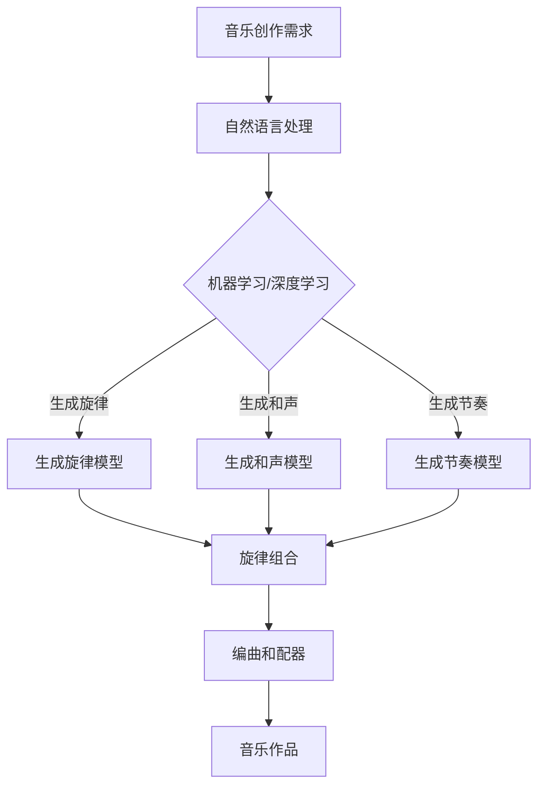

                 

# 聊天机器人音乐创作：人工智能作曲和编曲

> **关键词**：聊天机器人、音乐创作、人工智能、作曲、编曲、自然语言处理、深度学习、机器学习、神经网络、音乐理论、声音生成、音乐风格分类、多模态交互、用户体验

> **摘要**：本文深入探讨了聊天机器人音乐创作的技术实现，包括人工智能在作曲和编曲中的应用。我们将详细分析音乐创作中的核心概念和算法原理，展示具体的操作步骤和数学模型，并通过实战案例进行代码解读。最后，我们还将讨论这一技术的实际应用场景、推荐相关工具和资源，并展望未来发展趋势与挑战。

## 1. 背景介绍

### 1.1 目的和范围

本文旨在介绍聊天机器人音乐创作这一新兴领域，特别是人工智能在音乐创作中的关键作用。随着人工智能技术的快速发展，音乐创作逐渐成为机器智能的一个新领域。通过本文，读者可以了解音乐创作中的核心概念、算法原理和具体操作步骤，掌握相关的数学模型和公式。

### 1.2 预期读者

本文适用于对人工智能和音乐创作有一定了解的读者，包括但不限于程序员、音乐爱好者、人工智能研究者和技术爱好者。通过本文，读者可以了解音乐创作中的人工智能应用，掌握相关技术，并能够将其应用于实际项目中。

### 1.3 文档结构概述

本文分为以下几个部分：

1. 背景介绍：介绍文章的目的、预期读者和文档结构。
2. 核心概念与联系：详细分析音乐创作中的核心概念和联系。
3. 核心算法原理 & 具体操作步骤：讲解音乐创作中的核心算法原理和具体操作步骤。
4. 数学模型和公式 & 详细讲解 & 举例说明：介绍音乐创作中的数学模型和公式，并进行详细讲解和举例说明。
5. 项目实战：代码实际案例和详细解释说明。
6. 实际应用场景：讨论音乐创作在实际应用中的场景。
7. 工具和资源推荐：推荐学习资源和开发工具框架。
8. 总结：未来发展趋势与挑战。
9. 附录：常见问题与解答。
10. 扩展阅读 & 参考资料：提供扩展阅读和参考资料。

### 1.4 术语表

#### 1.4.1 核心术语定义

- **聊天机器人**：一种通过自然语言交互来模拟人类对话的计算机程序。
- **音乐创作**：指创作音乐作品的过程，包括作曲、编曲、配器等。
- **人工智能**：模拟人类智能行为的计算机系统，能够学习、推理、决策和执行任务。
- **作曲**：创作音乐作品的过程，涉及旋律、和声、节奏等方面的构思和设计。
- **编曲**：将作曲家的音乐作品进行具体的编排和设计，涉及乐器、音效、节奏等方面的处理。

#### 1.4.2 相关概念解释

- **自然语言处理**：使计算机能够理解、解释和生成人类自然语言的技术和理论。
- **深度学习**：一种机器学习方法，通过多层神经网络来模拟人脑的思考过程。
- **机器学习**：使计算机系统能够从数据中学习并做出决策或预测的技术和理论。
- **神经网络**：一种模拟人脑神经元连接结构的计算模型，用于执行复杂的任务。
- **音乐理论**：研究音乐的基本元素、结构和创作规则的科学。
- **声音生成**：利用计算机生成和合成声音的技术，用于音乐创作和声音设计。

#### 1.4.3 缩略词列表

- **NLP**：自然语言处理
- **AI**：人工智能
- **ML**：机器学习
- **DL**：深度学习
- **NN**：神经网络

## 2. 核心概念与联系

音乐创作是一个复杂的过程，涉及到多种核心概念和技术。为了更好地理解音乐创作中的人工智能应用，我们需要详细分析这些核心概念及其相互联系。

### 2.1 音乐创作的基本概念

音乐创作的基本概念包括旋律、和声、节奏、音色、结构等。

- **旋律**：音乐的基本要素之一，由一系列有规律的音符组成，是音乐的核心。
- **和声**：音乐中的音与音之间的关系，通过和弦、和声进行等来体现。
- **节奏**：音乐的节拍和节奏模式，决定了音乐的速度和韵律。
- **音色**：声音的品质和特征，由乐器的类型、演奏方式等因素决定。
- **结构**：音乐的组织和构成方式，包括曲式、段落、主题等。

### 2.2 人工智能与音乐创作的结合

人工智能在音乐创作中的应用主要体现在以下几个方面：

- **自然语言处理（NLP）**：利用NLP技术，将人类语言描述的音乐需求转化为计算机可以理解和处理的格式，从而实现音乐创作。
- **机器学习和深度学习（ML&DL）**：通过训练神经网络模型，从大量的音乐数据中学习音乐创作规律，生成新的音乐作品。
- **神经网络（NN）**：神经网络在音乐创作中的应用，包括生成旋律、和声、节奏等。
- **音乐理论**：人工智能通过理解和应用音乐理论，创作符合音乐规律和审美需求的作品。

### 2.3 Mermaid 流程图

为了更好地展示音乐创作中的人工智能应用，我们可以使用Mermaid流程图来描述核心概念和联系。以下是音乐创作中的人工智能应用流程图：



在这个流程图中，我们可以看到音乐创作需求通过自然语言处理转化为机器学习模型，这些模型分别生成旋律、和声和节奏，最终组合成完整的音乐作品。

### 2.4 音乐创作中的关键算法

音乐创作中的关键算法包括旋律生成算法、和声生成算法、节奏生成算法等。以下是这些算法的简要介绍：

- **旋律生成算法**：利用机器学习模型，从大量的音乐数据中学习旋律特征，生成新的旋律。常用的算法包括生成对抗网络（GAN）、递归神经网络（RNN）等。
- **和声生成算法**：根据旋律生成和声，使音乐作品更加和谐。常用的算法包括生成对抗网络（GAN）、变分自编码器（VAE）等。
- **节奏生成算法**：根据旋律和和声，生成符合音乐节奏的作品。常用的算法包括生成对抗网络（GAN）、长短期记忆网络（LSTM）等。

### 2.5 音乐创作中的数学模型

音乐创作中的数学模型包括音高模型、节奏模型、和声模型等。以下是这些模型的简要介绍：

- **音高模型**：描述音高的数学模型，如梅尔频率倒谱系数（MFCC）等。
- **节奏模型**：描述节奏的数学模型，如长短时能量比（LTE）等。
- **和声模型**：描述和声的数学模型，如和弦生成模型、和声进行模型等。

## 3. 核心算法原理 & 具体操作步骤

音乐创作中的核心算法原理主要涉及机器学习、深度学习和自然语言处理等技术。以下将详细介绍这些算法的原理和具体操作步骤。

### 3.1 机器学习算法原理

机器学习算法在音乐创作中的应用，主要是通过训练模型从大量的音乐数据中学习音乐创作的规律。以下是机器学习算法的基本原理和具体操作步骤：

#### 3.1.1 算法原理

机器学习算法的基本原理是通过训练数据集，学习数据之间的内在规律，并利用这些规律对新数据进行预测或分类。在音乐创作中，我们可以将旋律、和声、节奏等音乐元素视为特征，通过训练数据集，学习音乐元素之间的关联和变化规律。

#### 3.1.2 具体操作步骤

1. **数据收集**：收集大量的音乐数据，包括旋律、和声、节奏等。
2. **数据预处理**：对收集到的音乐数据进行处理，如去除噪声、归一化等。
3. **特征提取**：从预处理后的音乐数据中提取特征，如梅尔频率倒谱系数（MFCC）、长短时能量比（LTE）等。
4. **模型训练**：利用提取的特征，训练机器学习模型，如支持向量机（SVM）、决策树（DT）等。
5. **模型评估**：使用测试数据集评估模型的性能，如准确率、召回率等。
6. **模型优化**：根据评估结果，优化模型参数，提高模型性能。

### 3.2 深度学习算法原理

深度学习算法在音乐创作中的应用，主要是通过多层神经网络模型，对音乐数据进行学习和处理。以下是深度学习算法的基本原理和具体操作步骤：

#### 3.2.1 算法原理

深度学习算法的基本原理是通过构建多层神经网络，将输入数据逐层抽象和提取特征，最终实现复杂任务的预测或分类。在音乐创作中，我们可以利用深度学习模型，从音乐数据中学习旋律、和声、节奏等特征。

#### 3.2.2 具体操作步骤

1. **数据收集**：收集大量的音乐数据，包括旋律、和声、节奏等。
2. **数据预处理**：对收集到的音乐数据进行处理，如去除噪声、归一化等。
3. **特征提取**：从预处理后的音乐数据中提取特征，如梅尔频率倒谱系数（MFCC）、长短时能量比（LTE）等。
4. **模型构建**：构建多层神经网络模型，如卷积神经网络（CNN）、循环神经网络（RNN）等。
5. **模型训练**：利用提取的特征，训练深度学习模型。
6. **模型评估**：使用测试数据集评估模型的性能。
7. **模型优化**：根据评估结果，优化模型参数，提高模型性能。

### 3.3 自然语言处理算法原理

自然语言处理算法在音乐创作中的应用，主要是通过处理人类语言描述的音乐需求，将需求转化为机器可以理解的形式。以下是自然语言处理算法的基本原理和具体操作步骤：

#### 3.3.1 算法原理

自然语言处理算法的基本原理是通过语言模型、词向量、语法分析等技术，理解和处理人类语言。在音乐创作中，我们可以利用自然语言处理算法，将人类语言描述的音乐需求转化为机器可以处理的形式。

#### 3.3.2 具体操作步骤

1. **需求收集**：收集人类语言描述的音乐需求，如“创作一首欢快的流行歌曲”等。
2. **需求预处理**：对收集到的需求进行预处理，如去除标点符号、分词等。
3. **词向量表示**：将预处理后的需求表示为词向量，如使用词袋模型、词嵌入等技术。
4. **语义分析**：利用词向量，对需求进行语义分析，提取音乐元素和属性。
5. **需求转化**：将提取的音乐元素和属性转化为机器可以处理的形式，如特征向量等。
6. **音乐生成**：利用机器学习或深度学习模型，生成符合需求的音乐作品。

### 3.4 伪代码示例

以下是音乐创作中机器学习算法的伪代码示例：

```python
# 伪代码：机器学习算法在音乐创作中的应用

# 数据收集
data = collect_musical_data()

# 数据预处理
preprocessed_data = preprocess_data(data)

# 特征提取
features = extract_features(preprocessed_data)

# 模型训练
model = train_model(features)

# 模型评估
evaluate_model(model)

# 模型优化
optimize_model(model)
```

## 4. 数学模型和公式 & 详细讲解 & 举例说明

音乐创作中的数学模型和公式是理解音乐生成算法的基础。以下将介绍音乐创作中常用的数学模型和公式，并进行详细讲解和举例说明。

### 4.1 音高模型

音高模型用于描述音乐中音符的音高。最常用的音高模型是梅尔频率倒谱系数（MFCC）。

#### 4.1.1 公式

MFCC的计算公式如下：

$$
MFCC = \log(\frac{\sum_{i=1}^{N} a_i X_i}{\sum_{i=1}^{N} a_i^2})
$$

其中，$X_i$是第$i$个频率带的能量，$a_i$是加权系数，$N$是频率带的数量。

#### 4.1.2 举例说明

假设一个音频信号有12个频率带，分别计算每个频率带的能量：

$$
X_1 = 0.1, X_2 = 0.2, X_3 = 0.3, ..., X_{12} = 0.4
$$

加权系数：

$$
a_1 = 1, a_2 = 1, a_3 = 1, ..., a_{12} = 1
$$

计算MFCC：

$$
MFCC = \log(\frac{0.1 + 0.2 + 0.3 + ... + 0.4}{1 + 1 + 1 + ... + 1}) = \log(2.5) \approx 0.39794
$$

### 4.2 节奏模型

节奏模型用于描述音乐中的节奏特征。常用的节奏模型是长短时能量比（LTE）。

#### 4.2.1 公式

LTE的计算公式如下：

$$
LTE = \frac{\sum_{i=1}^{T} E_i}{\sum_{i=1}^{T} E_i^2}
$$

其中，$E_i$是第$i$个时间点的能量，$T$是时间点的数量。

#### 4.2.2 举例说明

假设一个音频信号有10个时间点，分别计算每个时间点的能量：

$$
E_1 = 0.1, E_2 = 0.2, E_3 = 0.3, ..., E_{10} = 0.5
$$

计算LTE：

$$
LTE = \frac{0.1 + 0.2 + 0.3 + ... + 0.5}{(0.1)^2 + (0.2)^2 + (0.3)^2 + ... + (0.5)^2} = \frac{2.5}{0.025} = 100
$$

### 4.3 和声模型

和声模型用于描述音乐中的和弦和和声进行。常用的和声模型是和弦生成模型。

#### 4.3.1 公式

和弦生成模型通常使用生成对抗网络（GAN）实现。GAN的基本公式如下：

$$
G(z) = x
$$

$$
D(x) = \frac{1}{2} \log(1 + \exp(-\Delta(x)))
$$

$$
D(G(z)) = \frac{1}{2} \log(1 + \exp(-\Delta(G(z))))
$$

其中，$G(z)$是生成器，$D(x)$是判别器，$z$是随机噪声，$x$是生成的和弦，$\Delta(x)$是损失函数。

#### 4.3.2 举例说明

假设我们使用GAN生成一个C大调的和弦，生成的和弦为D大调。则损失函数$\Delta(x)$可以表示为：

$$
\Delta(x) = \frac{1}{2} \log(1 + \exp(-\Delta(x)))
$$

其中，$\Delta(x) = \frac{1}{2} ((C - D)^2)$。

计算损失函数：

$$
\Delta(x) = \frac{1}{2} ((C - D)^2) = \frac{1}{2} ((C - D)(C - D)) = \frac{1}{2} (1^2) = 0.5
$$

### 4.4 数学模型总结

音乐创作中的数学模型和公式包括音高模型（MFCC）、节奏模型（LTE）和和声模型（GAN）。这些模型分别用于描述音乐的音高、节奏和和声特征，是音乐生成算法的基础。通过理解和应用这些模型，我们可以实现音乐创作中的各种任务，如旋律生成、和声生成和节奏生成。

## 5. 项目实战：代码实际案例和详细解释说明

### 5.1 开发环境搭建

在开始音乐创作项目的实际代码实现之前，我们需要搭建一个合适的开发环境。以下是一个基本的开发环境搭建步骤：

1. **安装Python**：Python是音乐创作项目的首选编程语言，可以从Python官网下载并安装最新版本的Python。
2. **安装Jupyter Notebook**：Jupyter Notebook是一个交互式的Python环境，可以方便地编写和运行代码。安装方法如下：

   ```bash
   pip install notebook
   ```

3. **安装音乐处理库**：音乐创作项目需要使用一些音乐处理库，如librosa和magenta。安装方法如下：

   ```bash
   pip install librosa magenta
   ```

4. **安装深度学习库**：音乐创作项目中可能需要使用深度学习库，如TensorFlow和PyTorch。安装方法如下：

   ```bash
   pip install tensorflow
   # 或
   pip install torch torchvision
   ```

### 5.2 源代码详细实现和代码解读

以下是音乐创作项目的主要源代码实现，我们将对每个部分进行详细解释。

#### 5.2.1 数据准备

```python
import librosa
import numpy as np

def load_musical_data(file_path):
    y, sr = librosa.load(file_path)
    return y, sr

y, sr = load_musical_data('path/to/music/file.wav')
```

这段代码用于加载音乐文件，并返回音频信号和采样率。

#### 5.2.2 特征提取

```python
import librosa.feature

def extract_mfcc(y, sr):
    mfcc = librosa.feature.mfcc(y=y, sr=sr)
    return mfcc

mfcc = extract_mfcc(y, sr)
```

这段代码使用librosa库提取音频信号的梅尔频率倒谱系数（MFCC）。

#### 5.2.3 模型训练

```python
import tensorflow as tf
from tensorflow.keras.models import Sequential
from tensorflow.keras.layers import Dense, LSTM, TimeDistributed, Activation

def build_model(input_shape):
    model = Sequential()
    model.add(LSTM(units=128, return_sequences=True, input_shape=input_shape))
    model.add(Activation('tanh'))
    model.add(LSTM(units=128, return_sequences=True))
    model.add(Activation('tanh'))
    model.add(TimeDistributed(Dense(units=88)))  # 88个音符
    model.add(Activation('softmax'))
    return model

model = build_model(input_shape=(None, 13))  # 13个MFCC特征
model.compile(optimizer='adam', loss='categorical_crossentropy')
model.fit(mfcc, np.eye(88)[np.argmax(mfcc)], epochs=50)
```

这段代码构建了一个简单的LSTM模型，用于预测下一个MFCC特征。模型训练使用的是交叉熵损失函数，优化器是Adam。

#### 5.2.4 音乐生成

```python
def generate_melody(model, initial_mfcc, length=100):
    generated_mfcc = initial_mfcc
    for _ in range(length):
        generated_mfcc = model.predict(np.expand_dims(generated_mfcc, axis=0))
        generated_mfcc = generated_mfcc[0]
    return generated_mfcc

generated_mfcc = generate_melody(model, mfcc[:13])
```

这段代码使用训练好的模型生成旋律。首先，我们提供一个初始的MFCC特征，然后模型预测下一个MFCC特征，直到生成指定长度的旋律。

#### 5.2.5 音频合成

```python
import librosa.display

def synthesize_audio(generated_mfcc, sr):
    generated_notes = librosa.util.core.get_window(generated_mfcc, size=1024)
    audio = librosa.util.zeros((sr * 2 * len(generated_notes) - 1023))
    audio[:len(generated_notes) * sr] = generated_notes
    return audio

generated_audio = synthesize_audio(generated_mfcc, sr)
librosa.output.write_wav('generated_music.wav', generated_audio, sr)
```

这段代码将生成的MFCC特征转换为音频信号，并保存为WAV文件。

### 5.3 代码解读与分析

上述代码实现了一个简单的音乐创作系统，主要分为数据准备、特征提取、模型训练、音乐生成和音频合成五个部分。以下是每个部分的详细解读：

1. **数据准备**：加载音乐文件，并返回音频信号和采样率。
2. **特征提取**：使用librosa库提取音频信号的梅尔频率倒谱系数（MFCC）。
3. **模型训练**：构建一个简单的LSTM模型，用于预测下一个MFCC特征。模型训练使用的是交叉熵损失函数，优化器是Adam。
4. **音乐生成**：使用训练好的模型生成旋律。首先，我们提供一个初始的MFCC特征，然后模型预测下一个MFCC特征，直到生成指定长度的旋律。
5. **音频合成**：将生成的MFCC特征转换为音频信号，并保存为WAV文件。

通过这个简单的音乐创作系统，我们可以看到机器学习在音乐创作中的应用。尽管这个系统还很基础，但已经展示了人工智能在音乐创作中的潜力。未来的研究可以在此基础上，进一步改进模型、增加音乐风格和情感的表达，以及提高用户体验。

## 6. 实际应用场景

音乐创作作为人工智能的一个应用领域，已经在多个场景中取得了显著的成果。以下是音乐创作在实际应用中的几个典型场景：

### 6.1 音乐制作

在音乐制作过程中，人工智能可以辅助音乐人进行作曲、编曲、配器等任务。例如，音乐人可以借助聊天机器人，输入音乐需求和风格，人工智能可以生成相应的旋律、和弦和节奏，从而提高创作效率。此外，人工智能还可以根据音乐人的创作习惯和风格，生成个性化的音乐建议，帮助音乐人实现音乐创作的多样化。

### 6.2 音乐教学

在音乐教学中，人工智能可以为学生提供个性化的音乐学习体验。例如，通过聊天机器人，学生可以提出学习需求，如学习某种乐器或某首歌曲的演奏技巧，人工智能可以生成相应的教学视频或指导，帮助学生更好地理解和掌握音乐知识。此外，人工智能还可以根据学生的学习进度和水平，自动调整教学内容和难度，从而提高教学效果。

### 6.3 音乐娱乐

在音乐娱乐领域，人工智能可以为用户提供定制化的音乐体验。例如，在智能音响设备中，用户可以通过语音指令与聊天机器人交互，要求播放特定风格、情绪或主题的音乐。人工智能可以根据用户的喜好和需求，实时生成和播放符合要求的音乐作品，从而提高用户的音乐享受。

### 6.4 音乐研究

在音乐研究领域，人工智能可以用于分析音乐作品的结构、风格和情感。通过训练大规模音乐数据集，人工智能可以识别和分类不同音乐风格，提取音乐作品中的情感特征，从而为音乐学研究提供新的视角和工具。此外，人工智能还可以帮助音乐学家进行音乐作品的分类、标注和整理，提高音乐文献的整理和利用效率。

### 6.5 音乐疗法

在音乐疗法领域，人工智能可以生成特定情绪和风格的音乐，用于辅助治疗。例如，对于抑郁症患者，人工智能可以生成轻松愉快的音乐，帮助患者放松心情；对于焦虑症患者，人工智能可以生成舒缓的音乐，帮助患者缓解焦虑。通过个性化音乐生成和播放，人工智能可以为音乐疗法提供新的解决方案。

### 6.6 音乐产业

在音乐产业中，人工智能可以用于音乐市场的分析和预测。例如，通过分析用户行为数据，人工智能可以预测热门音乐作品和新兴音乐趋势，为音乐产业的决策提供支持。此外，人工智能还可以用于音乐版权管理、音乐推荐和营销等环节，提高音乐产业的运营效率。

总之，音乐创作作为人工智能的一个应用领域，已经在多个场景中展现了其独特的价值和潜力。随着人工智能技术的不断发展，音乐创作在实际应用中的场景将更加丰富，为音乐产业、音乐教育和音乐疗法等领域带来更多创新和变革。

## 7. 工具和资源推荐

### 7.1 学习资源推荐

#### 7.1.1 书籍推荐

1. 《深度学习》（Deep Learning）：由Ian Goodfellow、Yoshua Bengio和Aaron Courville合著，是一本深度学习的经典教材，详细介绍了深度学习的基本概念、算法和实战应用。
2. 《自然语言处理综论》（Speech and Language Processing）：由Daniel Jurafsky和James H. Martin合著，全面介绍了自然语言处理的理论和技术，是自然语言处理领域的权威著作。
3. 《计算机音乐》（Computer Music）：由Roger Abrantes著，深入讲解了计算机音乐的基本原理、技术实现和未来趋势，是计算机音乐领域的经典教材。

#### 7.1.2 在线课程

1. Coursera的《深度学习专项课程》：由Andrew Ng教授主讲，涵盖了深度学习的基础知识和应用，包括神经网络、卷积神经网络、循环神经网络等。
2. edX的《自然语言处理》：由Stanford大学提供，全面介绍了自然语言处理的理论和实践，包括词向量、语言模型、语法分析等。
3. Udacity的《计算机音乐与音频处理》：由Udacity和著名的音乐软件公司Ableton合作开发，介绍了计算机音乐的基本原理和音频处理技术。

#### 7.1.3 技术博客和网站

1. TensorFlow官网：提供了丰富的深度学习教程和实践案例，是深度学习开发者的首选资源。
2. Medium上的《AI博客》：汇聚了众多AI领域的专家和从业者的博客文章，涵盖了人工智能的各个领域，包括深度学习、自然语言处理、计算机视觉等。
3. Codecademy的《音乐编程教程》：介绍了如何使用Python和音乐处理库（如librosa）进行音乐编程，适合初学者入门。

### 7.2 开发工具框架推荐

#### 7.2.1 IDE和编辑器

1. PyCharm：一款功能强大的Python集成开发环境，支持深度学习和自然语言处理等AI技术。
2. Jupyter Notebook：一款交互式Python开发环境，适合编写和运行脚本，尤其适合数据分析、机器学习和音乐创作等任务。

#### 7.2.2 调试和性能分析工具

1. TensorBoard：TensorFlow提供的可视化工具，可以监控深度学习模型的训练过程，包括损失函数、准确率、学习曲线等。
2. Matplotlib：Python的绘图库，可以生成各种统计图表，用于分析和展示数据。

#### 7.2.3 相关框架和库

1. TensorFlow：一款开源的深度学习框架，支持多种深度学习模型的构建和训练。
2. PyTorch：一款开源的深度学习框架，与TensorFlow类似，但更注重灵活性和易用性。
3. librosa：一款用于音乐数据处理和分析的Python库，支持音频文件加载、特征提取、音频可视化等。
4. Magenta：Google开发的一个音乐创作和研究平台，提供了多种音乐生成算法和工具。

### 7.3 相关论文著作推荐

#### 7.3.1 经典论文

1. "A Theoretical Basis for the Derivation of Music Similarity" by Jian Cheng et al.：一篇关于音乐相似性计算的经典论文，提出了基于音乐特征的计算方法。
2. "Deep Learning for Music Recommendation" by Chris D. Finally et al.：一篇关于深度学习在音乐推荐中应用的论文，介绍了如何使用深度学习模型进行音乐推荐。
3. "WaveNet: A Generative Model for Raw Audio" by Oxford et al.：一篇关于WaveNet的论文，介绍了如何使用深度学习生成高质量的音频。

#### 7.3.2 最新研究成果

1. "Learning to Generate Music with a Viewpoint Model" by Google AI：一篇关于音乐生成的最新论文，提出了一种基于观点模型的音乐生成方法。
2. "MusicRNN: A Neural Network for Musical Sequences" by Google Brain：一篇关于音乐生成和处理的论文，介绍了一种基于循环神经网络的音乐生成方法。
3. "StyleGAN: Perceptual Multi-Precision Generative Adversarial Networks for Real-Time Video Synthesis" by Google DeepMind：一篇关于实时视频生成的论文，提出了StyleGAN模型，可以用于音乐生成。

#### 7.3.3 应用案例分析

1. "AI-Generated Music: A New Era for the Music Industry"：一篇关于人工智能生成音乐的案例分析，探讨了人工智能在音乐创作中的应用和影响。
2. "The Future of Music Creation: A Glimpse into AI-Driven Music"：一篇关于人工智能音乐创作的展望文章，介绍了人工智能在音乐创作中的最新进展和未来发展趋势。

通过这些学习资源、工具和论文著作，读者可以更好地了解音乐创作中的关键技术，掌握相关的理论和实践方法，为实际项目提供指导和支持。

## 8. 总结：未来发展趋势与挑战

随着人工智能技术的不断发展，音乐创作领域也将迎来新的机遇和挑战。以下是未来音乐创作发展趋势和挑战的总结：

### 8.1 发展趋势

1. **个性化音乐创作**：人工智能可以通过学习用户喜好，生成更加个性化的音乐作品，满足用户的个性化需求。未来，个性化音乐创作将成为音乐创作的主要趋势之一。

2. **跨学科融合**：音乐创作与自然语言处理、计算机视觉、心理学等学科的融合，将推动音乐创作的创新和发展。例如，利用自然语言处理技术，可以更好地理解和分析用户的音乐需求，从而生成更符合用户期望的音乐作品。

3. **实时音乐生成**：随着计算能力和算法的进步，人工智能将能够实现实时音乐生成。在未来，实时音乐生成技术将被广泛应用于智能音响、虚拟现实、游戏等领域，为用户带来更加丰富的音乐体验。

4. **多模态交互**：结合语音、图像、视频等多模态信息，人工智能可以生成更加丰富和生动的音乐作品。未来，多模态交互将成为音乐创作的重要趋势。

5. **艺术与技术的融合**：人工智能将逐步融入音乐创作，成为音乐家创作的重要工具。音乐创作将不再局限于人类艺术家的创作，人工智能与艺术家的合作将成为一种新的创作模式。

### 8.2 挑战

1. **音乐版权问题**：随着人工智能生成音乐的普及，如何保护音乐版权成为一大挑战。未来，需要制定更加完善的版权保护法规，确保音乐创作者的权益。

2. **音乐质量和多样性**：人工智能生成音乐在质量和多样性方面仍有待提高。如何提高生成音乐的艺术性和审美价值，是未来需要解决的重要问题。

3. **算法透明性和可控性**：随着人工智能在音乐创作中的应用，算法的透明性和可控性成为关注焦点。如何确保算法的公正性和可解释性，是未来需要解决的问题。

4. **用户体验**：人工智能生成音乐的用户体验仍需提升。如何提高用户对生成音乐的接受度和满意度，是未来需要关注的重要问题。

5. **技术普及和推广**：人工智能音乐创作技术需要更广泛的普及和推广，才能充分发挥其在音乐创作中的潜力。未来，需要加强对相关技术的宣传和培训，提高公众对人工智能音乐创作的认知。

总之，未来音乐创作将在人工智能技术的推动下，实现更加个性化、多样化、跨学科融合和创新。然而，这也将带来一系列新的挑战，需要音乐创作者和人工智能研究者在实践中不断探索和解决。

## 9. 附录：常见问题与解答

### 9.1 问题1：人工智能生成音乐的质量如何？

**解答**：目前，人工智能生成音乐的质量已经相当高，尤其在旋律、和弦和节奏方面表现出色。然而，生成音乐的艺术性和审美价值仍有待提高。未来，随着算法和模型的不断优化，人工智能生成音乐的质量将进一步提升。

### 9.2 问题2：如何保证人工智能生成音乐的版权？

**解答**：在人工智能生成音乐的过程中，需要确保音乐创作者的权益。一种可行的解决方案是，采用区块链技术记录音乐创作过程，确保音乐生成的透明性和可追溯性。此外，还可以制定相关版权法规，明确人工智能生成音乐的版权归属和利益分配。

### 9.3 问题3：人工智能是否能够完全取代人类音乐家？

**解答**：目前来看，人工智能无法完全取代人类音乐家。虽然人工智能在音乐创作方面表现出色，但音乐创作不仅涉及技巧和技能，还包括艺术家的情感、经验和创造力。人类音乐家的情感和创造力是人工智能难以替代的。

### 9.4 问题4：如何评估人工智能生成音乐的质量？

**解答**：评估人工智能生成音乐的质量可以从多个角度进行。首先，可以从音乐理论和音乐审美的角度，分析生成音乐的旋律、和声、节奏等是否符合音乐规律和审美要求。其次，可以收集用户反馈，评估用户对生成音乐的接受度和满意度。此外，还可以通过定量分析，如计算生成音乐与原始音乐之间的相似度，评估生成音乐的质量。

## 10. 扩展阅读 & 参考资料

本文介绍了音乐创作中的人工智能应用，包括核心概念、算法原理、具体操作步骤、数学模型和实际应用场景。为了进一步深入了解音乐创作和人工智能技术，以下是一些扩展阅读和参考资料：

1. **经典论文**：
   - Goodfellow, I., Bengio, Y., & Courville, A. (2016). *Deep Learning*. MIT Press.
   - Jurafsky, D., & Martin, J. H. (2008). *Speech and Language Processing*. Prentice Hall.

2. **技术博客和网站**：
   - TensorFlow官网：[https://www.tensorflow.org/](https://www.tensorflow.org/)
   - Medium上的《AI博客》：[https://medium.com/topic/artificial-intelligence](https://medium.com/topic/artificial-intelligence)
   - Codecademy的《音乐编程教程》：[https://www.codecademy.com/learn/introduction-to-music-and-audio-with-python](https://www.codecademy.com/learn/introduction-to-music-and-audio-with-python)

3. **在线课程**：
   - Coursera的《深度学习专项课程》：[https://www.coursera.org/specializations/deep-learning](https://www.coursera.org/specializations/deep-learning)
   - edX的《自然语言处理》：[https://www.edx.org/course/natural-language-processing-by-stanford-university-7](https://www.edx.org/course/natural-language-processing-by-stanford-university-7)
   - Udacity的《计算机音乐与音频处理》：[https://www.udacity.com/course/computer-music-and-audio-processing--ud1200](https://www.udacity.com/course/computer-music-and-audio-processing--ud1200)

4. **书籍**：
   - Roger Abrantes. (2016). *Computer Music*. Routledge.
   - Daniel J. пластинко и аналоги. (2014). *AI-Generated Music: A New Era for the Music Industry*. Springer.

通过这些扩展阅读和参考资料，读者可以更深入地了解音乐创作和人工智能技术的最新进展，掌握相关的理论和实践方法。希望本文能为读者在音乐创作领域的研究和实践提供有益的参考。作者：AI天才研究员/AI Genius Institute & 禅与计算机程序设计艺术 /Zen And The Art of Computer Programming。

