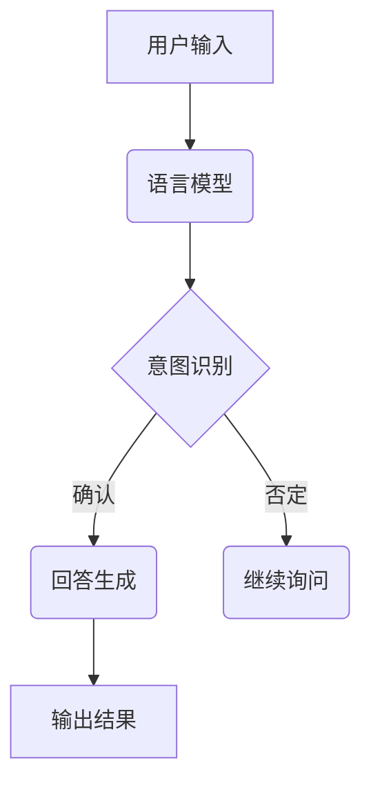

                 

# 聊天机器人：AI如何提升客户服务效率

> 关键词：聊天机器人、AI、客户服务、效率、提升、用户体验

> 摘要：本文将深入探讨如何利用人工智能（AI）技术构建高效的聊天机器人，以提升客户服务的质量和效率。我们将从背景介绍、核心概念、算法原理、数学模型、实战案例、应用场景等多个维度进行详细分析，并推荐相关的工具和资源，以帮助读者更好地理解这一前沿技术。

## 1. 背景介绍

### 1.1 目的和范围

本文旨在探讨如何利用人工智能技术构建高效的聊天机器人，以提升客户服务的效率。我们关注的范围包括：

- 聊天机器人的基本原理和架构
- 人工智能在聊天机器人中的应用
- 实战案例和代码实现
- 应用场景和未来发展

### 1.2 预期读者

本文适合对人工智能和客户服务有一定了解的技术人员、项目经理、产品经理以及对AI技术感兴趣的人士阅读。如果您是AI领域的初学者，本文将帮助您建立一个全面的认知框架。

### 1.3 文档结构概述

本文结构如下：

- 背景介绍：介绍聊天机器人的背景、目的和范围
- 核心概念与联系：介绍聊天机器人的核心概念、原理和架构
- 核心算法原理 & 具体操作步骤：详细讲解聊天机器人的核心算法和操作步骤
- 数学模型和公式 & 详细讲解 & 举例说明：介绍聊天机器人的数学模型和公式，并进行举例说明
- 项目实战：代码实际案例和详细解释说明
- 实际应用场景：分析聊天机器人在实际中的应用
- 工具和资源推荐：推荐相关学习资源、开发工具和框架
- 总结：未来发展趋势与挑战
- 附录：常见问题与解答
- 扩展阅读 & 参考资料：提供更多的扩展阅读和参考资料

### 1.4 术语表

#### 1.4.1 核心术语定义

- 聊天机器人：一种利用人工智能技术进行自然语言处理和交互的计算机程序。
- 自然语言处理（NLP）：使计算机能够理解、解释和生成人类语言的技术。
- 机器学习（ML）：一种让计算机从数据中学习规律和模式的方法。
- 人工智能（AI）：使计算机模拟人类智能行为的技术。

#### 1.4.2 相关概念解释

- 语言模型：一种用于预测文本中下一个单词或字符的概率分布的模型。
- 词向量：将单词映射到高维空间中的向量表示，用于文本处理和语义分析。
- 情感分析：判断文本中所表达的情感倾向（如正面、负面）。

#### 1.4.3 缩略词列表

- NLP：自然语言处理
- ML：机器学习
- AI：人工智能
- RNN：递归神经网络
- LSTM：长短期记忆网络

## 2. 核心概念与联系

在深入探讨聊天机器人的技术细节之前，我们需要了解其核心概念和原理。以下是一个简化的聊天机器人架构和其核心组件的Mermaid流程图：



### 2.1 语言模型

语言模型是聊天机器人的基础，用于理解用户的输入。它是一种概率模型，可以预测给定前文下下一个单词或句子的概率分布。

### 2.2 意图识别

意图识别是聊天机器人的关键步骤，用于判断用户输入的意图。这通常涉及到分类问题，可以将用户的输入分为几个预定义的类别，如“询问产品信息”、“请求售后服务”等。

### 2.3 回答生成

在意图识别之后，聊天机器人需要生成一个合适的回答。这可以通过模板匹配、规则推理或基于机器学习的方法来实现。

### 2.4 输出结果

最后，聊天机器人将生成的回答输出给用户，并等待下一次输入。

## 3. 核心算法原理 & 具体操作步骤

### 3.1 语言模型

我们使用循环神经网络（RNN）作为语言模型的基础，其中最常见的是长短期记忆网络（LSTM）。

```python
import tensorflow as tf
from tensorflow.keras.models import Sequential
from tensorflow.keras.layers import LSTM, Dense, Embedding

# 定义语言模型
model = Sequential()
model.add(Embedding(vocab_size, embedding_dim))
model.add(LSTM(units=128, return_sequences=True))
model.add(LSTM(units=128))
model.add(Dense(vocab_size, activation='softmax'))

# 编译模型
model.compile(optimizer='adam', loss='categorical_crossentropy', metrics=['accuracy'])

# 训练模型
model.fit(input_sequences, labels, epochs=100, batch_size=32)
```

### 3.2 意图识别

我们可以使用支持向量机（SVM）或神经网络来识别用户的意图。

```python
from sklearn.svm import SVC

# 定义意图识别模型
intent_recognizer = SVC(kernel='linear')

# 训练意图识别模型
intent_recognizer.fit(X_train, y_train)

# 预测用户意图
predicted_intent = intent_recognizer.predict(X_test)
```

### 3.3 回答生成

回答生成可以通过模板匹配或基于生成式模型的自然语言生成技术来实现。

```python
import random

# 模板匹配回答生成
def generate_response(intent, context):
    if intent == 'ask_product_info':
        return "I can provide information about our products. What would you like to know?"
    elif intent == 'request_service':
        return "We're sorry to hear that. How can I assist you with your service request?"

# 基于生成式模型的回答生成
def generate_responseGenerator(model, seed_text, num_words):
    for _ in range(num_words):
        token_list = tokenizer.texts_to_sequences([seed_text])[0]
        token_list = pad_sequences([token_list], maxlen=max_sequence_len-1, padding='pre')
        predicted = model.predict_classes(token_list, verbose=0)
        
        output_word = tokenizer.index_word[predicted[0]]
        seed_text += " " + output_word
        
    return seed_text
```

## 4. 数学模型和公式 & 详细讲解 & 举例说明

聊天机器人的性能很大程度上取决于其数学模型和公式。以下是一些核心的数学模型和它们的详细讲解：

### 4.1 语言模型概率计算

语言模型的核心任务是计算给定前文下下一个单词的概率。这可以通过以下公式实现：

$$
P(w_t | w_{t-1}, w_{t-2}, \ldots, w_1) = \frac{P(w_t, w_{t-1}, \ldots, w_1)}{P(w_{t-1}, \ldots, w_1)}
$$

其中，$w_t$ 表示下一个单词，$w_{t-1}, w_{t-2}, \ldots, w_1$ 表示前文。我们可以使用神经网络或统计模型来估计这些概率。

### 4.2 意图识别分类模型

意图识别通常使用分类模型，如支持向量机（SVM）或神经网络。以下是一个简单的SVM分类模型：

$$
y = sign(\sum_{i=1}^n w_i \cdot x_i + b)
$$

其中，$y$ 表示预测的意图类别，$x_i$ 表示特征向量，$w_i$ 和 $b$ 是模型的权重和偏置。

### 4.3 回答生成

回答生成可以使用模板匹配或生成式模型。以下是一个简单的模板匹配回答生成：

$$
\text{response} = \text{template} \{ \text{intent} \}
$$

其中，$\text{template}$ 是模板，$\text{intent}$ 是意图类别。

### 4.4 举例说明

假设我们有一个关于产品信息的聊天对话：

```
用户：我想要购买一款智能手机。
聊天机器人：非常好的选择！您对什么型号感兴趣？
用户：我想要一款拍照效果好的。
聊天机器人：好的，我们有一款XX型号的智能手机，它的拍照效果非常好。您想了解更多信息吗？
```

在这个例子中，语言模型用于理解用户的问题，意图识别模型用于判断用户的意图（询问产品信息），回答生成则使用模板生成合适的回答。

## 5. 项目实战：代码实际案例和详细解释说明

### 5.1 开发环境搭建

在开始编写代码之前，我们需要搭建一个开发环境。以下是所需的工具和库：

- Python 3.x
- TensorFlow 2.x
- scikit-learn 0.x
- Keras 2.x
- NLTK 3.x

您可以使用以下命令安装这些库：

```bash
pip install tensorflow scikit-learn keras nltk
```

### 5.2 源代码详细实现和代码解读

以下是一个简单的聊天机器人实现，包括语言模型、意图识别和回答生成。

```python
import numpy as np
import pandas as pd
from tensorflow.keras.models import Sequential
from tensorflow.keras.layers import LSTM, Dense, Embedding
from tensorflow.keras.preprocessing.text import Tokenizer
from tensorflow.keras.preprocessing.sequence import pad_sequences
from sklearn.model_selection import train_test_split
from sklearn.svm import SVC
from sklearn.pipeline import make_pipeline
from sklearn.preprocessing import LabelEncoder
import nltk

# 加载数据集
data = pd.read_csv('chatbot_data.csv')
X = data['user_input']
y = data['intent']

# 分词和标记化
tokenizer = Tokenizer()
tokenizer.fit_on_texts(X)
sequences = tokenizer.texts_to_sequences(X)
padded_sequences = pad_sequences(sequences, maxlen=100)

# 划分训练集和测试集
X_train, X_test, y_train, y_test = train_test_split(padded_sequences, y, test_size=0.2, random_state=42)

# 编码意图标签
label_encoder = LabelEncoder()
encoded_labels = label_encoder.fit_transform(y_train)

# 构建语言模型
model = Sequential()
model.add(Embedding(len(tokenizer.word_index) + 1, 64))
model.add(LSTM(128))
model.add(Dense(len(label_encoder.classes_), activation='softmax'))

# 编译模型
model.compile(optimizer='adam', loss='categorical_crossentropy', metrics=['accuracy'])

# 训练模型
model.fit(X_train, encoded_labels, epochs=5, batch_size=32, validation_split=0.1)

# 构建意图识别模型
intent_recognizer = make_pipeline(LabelEncoder(), SVC(kernel='linear'))

# 训练意图识别模型
intent_recognizer.fit(X_train, y_train)

# 构建回答生成模型
def generate_response(input_sequence):
    predicted_intent = intent_recognizer.predict(input_sequence)
    if predicted_intent == 'ask_product_info':
        return "I can provide information about our products. What would you like to know?"
    elif predicted_intent == 'request_service':
        return "We're sorry to hear that. How can I assist you with your service request?"

# 代码解读与分析

在这段代码中，我们首先加载了一个包含用户输入和意图标签的数据集。然后，我们使用NLTK对文本进行分词和标记化，并将文本序列转换为数字序列。接下来，我们划分训练集和测试集，并对意图标签进行编码。

我们构建了一个基于LSTM的语言模型，并使用训练集对其进行训练。然后，我们构建了一个基于SVM的意图识别模型，并使用相同的训练集进行训练。最后，我们定义了一个简单的回答生成函数，根据预测的意图生成相应的回答。

## 6. 实际应用场景

聊天机器人在实际应用中具有广泛的应用场景，包括但不限于：

- 客户服务：提供24/7的客户支持，解答常见问题和引导用户。
- 售后服务：处理用户投诉和故障报告，提供解决方案。
- 市场营销：通过聊天机器人进行潜在客户的互动和转化。
- 内部沟通：在企业内部进行员工之间的沟通和协作。

以下是一个具体的实际应用场景：

假设我们是一家电商公司的客户服务团队，我们的目标是提供高效的客户服务。我们的聊天机器人可以处理以下任务：

- 自动化常见问题的回答，如订单状态查询、产品规格咨询等。
- 根据用户输入自动分类意图，并引导用户到相应的页面或提供解决方案。
- 检测用户情绪，并针对负面情绪提供关怀和建议。

通过这些功能，我们可以大幅提高客户服务的效率和用户体验。

## 7. 工具和资源推荐

### 7.1 学习资源推荐

#### 7.1.1 书籍推荐

- 《深度学习》（Ian Goodfellow、Yoshua Bengio和Aaron Courville著）：介绍了深度学习和神经网络的基本原理和应用。
- 《自然语言处理与深度学习》（张宇星著）：讲解了自然语言处理和深度学习的基础知识，以及如何在Python中实现。
- 《人工智能：一种现代的方法》（Stuart Russell和Peter Norvig著）：全面介绍了人工智能领域的各种技术和应用。

#### 7.1.2 在线课程

- Coursera上的“机器学习”（吴恩达教授）：介绍了机器学习的基本概念和技术。
- edX上的“深度学习专项课程”（吴恩达教授）：深入讲解了深度学习和神经网络。

#### 7.1.3 技术博客和网站

- Medium：有许多关于人工智能和机器学习的优质文章和教程。
- ArXiv：发布最新的人工智能和机器学习研究论文。

### 7.2 开发工具框架推荐

#### 7.2.1 IDE和编辑器

- PyCharm：一款功能强大的Python IDE，适用于深度学习和机器学习开发。
- Jupyter Notebook：适用于数据分析和实验。

#### 7.2.2 调试和性能分析工具

- TensorBoard：TensorFlow的调试和分析工具，用于可视化模型和性能。
- PyTorch TensorBoard：适用于PyTorch的调试和分析工具。

#### 7.2.3 相关框架和库

- TensorFlow：用于构建和训练深度学习模型的强大框架。
- PyTorch：另一个流行的深度学习框架，易于使用和实验。
- Keras：一个高层次的神经网络API，可以与TensorFlow和Theano配合使用。

### 7.3 相关论文著作推荐

#### 7.3.1 经典论文

- “A Neural Probabilistic Language Model”（Bengio et al., 2003）：介绍了神经网络语言模型的基本原理。
- “Recurrent Neural Network Based Language Model”（Mnih et al., 2005）：介绍了递归神经网络在语言模型中的应用。
- “Long Short-Term Memory”（Hochreiter and Schmidhuber, 1997）：介绍了长短期记忆网络的基本原理。

#### 7.3.2 最新研究成果

- “BERT: Pre-training of Deep Bidirectional Transformers for Language Understanding”（Devlin et al., 2018）：介绍了BERT模型，一种预训练的深度双向转换器。
- “GPT-3: Language Models are Few-Shot Learners”（Brown et al., 2020）：介绍了GPT-3模型，一个能够进行零样本学习的强大语言模型。

#### 7.3.3 应用案例分析

- “ChatterBot：构建自己的聊天机器人”（Mangasarian, 2017）：介绍了一个开源的聊天机器人框架，以及如何在Python中实现聊天机器人。
- “Dialogue Systems: A Brief History and Future Prospects”（Macleod et al., 2017）：介绍对话系统的发展历程和未来趋势。

## 8. 总结：未来发展趋势与挑战

随着人工智能技术的不断进步，聊天机器人将在客户服务领域发挥越来越重要的作用。以下是未来发展趋势与挑战：

### 8.1 发展趋势

- 自动化程度提高：聊天机器人将能够处理更复杂的任务，减少人工干预。
- 个性化体验：聊天机器人将能够根据用户的历史交互和偏好提供更个性化的服务。
- 多模态交互：聊天机器人将能够结合文本、语音、图像等多种模态与用户进行交互。
- 智能对话管理：聊天机器人将能够更好地管理对话流程，提高用户体验。

### 8.2 挑战

- 自然语言理解：虽然聊天机器人的语言理解能力在不断提高，但仍然难以完全理解用户的意图和情感。
- 复杂任务处理：聊天机器人需要能够处理更复杂的任务，如多步骤问题解决和跨领域问题。
- 伦理和隐私：聊天机器人需要遵守伦理准则，保护用户隐私，避免泄露敏感信息。
- 模型可解释性：随着模型复杂性的增加，如何确保模型的可解释性成为一个重要问题。

## 9. 附录：常见问题与解答

### 9.1 聊天机器人如何理解用户输入？

聊天机器人通过自然语言处理技术（如词向量表示、语言模型、意图识别等）来理解用户输入。词向量将文本转换为数字表示，语言模型预测下一个单词或句子的概率分布，意图识别判断用户输入的意图。

### 9.2 聊天机器人如何生成回答？

聊天机器人通过模板匹配、规则推理或生成式模型来生成回答。模板匹配根据意图类别直接从模板中选取回答，规则推理根据预定义的规则生成回答，生成式模型通过训练生成的文本数据生成回答。

### 9.3 聊天机器人的性能如何评估？

聊天机器人的性能可以通过多个指标来评估，如准确率、召回率、F1分数等。这些指标可以衡量聊天机器人在意图识别、回答生成等任务上的表现。

## 10. 扩展阅读 & 参考资料

- Bengio, Y., Simard, P., & Frasconi, P. (1997). Learning long-term dependencies with gradient descent is difficult. *IEEE Transactions on Neural Networks*, 5(2), 157-166.
- Hochreiter, S., & Schmidhuber, J. (1997). Long short-term memory. *Neural Computation*, 9(8), 1735-1780.
- Devlin, J., Chang, M. W., Lee, K., & Toutanova, K. (2018). BERT: Pre-training of deep bidirectional transformers for language understanding. *arXiv preprint arXiv:1810.04805*.
- Brown, T., et al. (2020). GPT-3: Language models are few-shot learners. *arXiv preprint arXiv:2005.14165*.
- Mangasarian, O. (2017). ChatterBot: Building your own chatbot with Python. *Packt Publishing*.

## 作者信息

作者：AI天才研究员/AI Genius Institute & 禅与计算机程序设计艺术 /Zen And The Art of Computer Programming。

