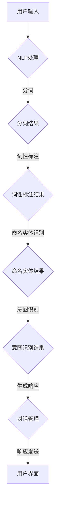

                 

# 聊天机器人：AI如何提升客户服务效率，解决用户问题

## 关键词
- 聊天机器人
- 人工智能
- 客户服务
- 客户体验
- 自然语言处理
- 机器学习
- 数据分析

## 摘要
本文旨在探讨人工智能（AI）在客户服务领域的应用，特别是聊天机器人如何通过自然语言处理和机器学习技术，提高客户服务效率并解决用户问题。文章首先介绍了聊天机器人的基本概念和其在客户服务中的应用场景，然后详细阐述了核心算法原理、数学模型以及实际项目案例。接着，本文探讨了聊天机器人的实际应用场景，并推荐了一些学习资源和开发工具。最后，文章总结了未来发展趋势与挑战，以及常见的问答。通过本文的阅读，读者将对聊天机器人在客户服务中的应用有更深入的理解。

## 1. 背景介绍

### 1.1 目的和范围
本文的目的是介绍聊天机器人在客户服务中的应用，重点探讨其如何通过人工智能技术提升服务效率并解决用户问题。我们将从基本概念、算法原理、数学模型到实际应用案例进行全面阐述，旨在为读者提供一个系统而详尽的了解。

### 1.2 预期读者
本文适合以下读者群体：
- 对客户服务领域有浓厚兴趣的技术人员；
- 希望提升客户服务效率的企业管理者；
- 对人工智能和自然语言处理有兴趣的学习者；
- 希望在客户服务中引入AI技术的开发者。

### 1.3 文档结构概述
本文分为以下章节：
1. 背景介绍：介绍本文的目的、预期读者以及文档结构；
2. 核心概念与联系：介绍聊天机器人的基本概念和相关技术；
3. 核心算法原理 & 具体操作步骤：详细阐述聊天机器人的核心算法原理；
4. 数学模型和公式 & 详细讲解 & 举例说明：讲解聊天机器人相关的数学模型；
5. 项目实战：通过实际案例展示聊天机器人的应用；
6. 实际应用场景：分析聊天机器人在不同场景中的应用；
7. 工具和资源推荐：推荐学习资源、开发工具和框架；
8. 总结：未来发展趋势与挑战；
9. 附录：常见问题与解答；
10. 扩展阅读 & 参考资料。

### 1.4 术语表

#### 1.4.1 核心术语定义
- 聊天机器人：一种基于人工智能技术的软件程序，能够通过自然语言与用户进行交互，提供信息查询、任务处理等服务。
- 自然语言处理（NLP）：人工智能的一个分支，旨在使计算机能够理解、生成和处理人类语言。
- 机器学习（ML）：一种人工智能的方法，通过数据训练模型，使其能够自主学习和预测。

#### 1.4.2 相关概念解释
- 客户服务：企业与客户之间的互动过程，旨在满足客户需求、解决客户问题并提供优质体验。
- 客户体验：客户在购买、使用和售后过程中所感受到的总体感受和满意度。

#### 1.4.3 缩略词列表
- AI：人工智能
- NLP：自然语言处理
- ML：机器学习

## 2. 核心概念与联系

在讨论聊天机器人的核心概念和联系之前，我们首先需要理解其基本构成和工作原理。聊天机器人是一种基于人工智能技术的软件程序，主要依赖于自然语言处理（NLP）和机器学习（ML）技术来实现与用户的智能对话。

### 2.1 聊天机器人的基本概念
聊天机器人，也称为虚拟助手、对话机器人或聊天代理，是一种通过自然语言与用户进行交互的软件程序。其目的是提供信息查询、任务处理、问题解答等服务，以提升用户体验和效率。

聊天机器人通常由以下几个关键组件组成：
1. **前端界面**：用户与聊天机器人交互的入口，可以是网站聊天窗口、移动应用聊天界面等。
2. **后端服务器**：处理用户请求、运行对话流程的核心部分，包括自然语言处理模块、对话管理模块、知识库等。
3. **自然语言处理（NLP）模块**：用于处理用户输入的自然语言文本，进行分词、词性标注、命名实体识别等操作，以便理解和生成语言。
4. **对话管理模块**：负责管理对话流程，包括理解用户意图、生成响应、跟踪对话状态等。
5. **知识库**：存储预定义的答案、常见问题解答、业务规则等，以支持对话机器人的回答和决策。

### 2.2 人工智能、自然语言处理和机器学习的关系
人工智能（AI）是一个广泛的领域，涵盖了多种技术，包括机器学习、深度学习、自然语言处理等。在这些技术中，自然语言处理（NLP）和机器学习（ML）是聊天机器人实现智能对话的核心技术。

- **自然语言处理（NLP）**：NLP 是人工智能的一个分支，专注于使计算机能够理解、生成和处理人类语言。NLP 技术包括文本预处理、词性标注、句法分析、情感分析、命名实体识别等。在聊天机器人中，NLP 技术用于处理用户的自然语言输入，提取关键信息，并生成合适的响应。

- **机器学习（ML）**：ML 是一种人工智能方法，通过从数据中学习模式，使计算机能够做出预测或决策。在聊天机器人中，ML 技术用于训练对话模型，使其能够理解用户意图、生成合适的回答，并根据对话历史进行自适应调整。

### 2.3 聊天机器人架构的 Mermaid 流程图

以下是一个简化的聊天机器人架构的 Mermaid 流程图，展示了各组件之间的交互和数据处理流程：



### 2.4 聊天机器人应用场景
聊天机器人在多个领域都有广泛的应用，以下是一些常见的应用场景：

- **客户服务**：在电子商务、金融、零售等行业中，聊天机器人可以提供24/7的客户支持，解答常见问题，处理订单查询和投诉等。
- **在线教育**：聊天机器人可以作为虚拟导师，为学生提供个性化辅导，回答学术问题，并推荐学习资源。
- **医疗咨询**：聊天机器人可以提供基本的医疗咨询，解答健康相关问题，并引导用户进行适当的就医建议。
- **智能家居**：在智能家居系统中，聊天机器人可以与用户进行语音交互，控制家电设备、设置提醒等。
- **娱乐互动**：聊天机器人可以用于游戏、社交应用中，提供个性化互动体验，如讲故事、猜谜语等。

通过以上对聊天机器人核心概念和联系的介绍，我们可以看到，聊天机器人是人工智能、自然语言处理和机器学习技术相结合的产物，其在提升客户服务效率和解决用户问题方面具有巨大潜力。接下来，我们将进一步探讨聊天机器人的核心算法原理和具体操作步骤。

## 3. 核心算法原理 & 具体操作步骤

### 3.1 核心算法原理

聊天机器人的核心算法原理主要涉及自然语言处理（NLP）和机器学习（ML）技术。NLP用于理解用户输入的自然语言文本，而ML用于训练模型，使其能够生成合适的响应。以下是聊天机器人算法原理的详细解释：

#### 3.1.1 自然语言处理（NLP）

自然语言处理（NLP）是一种人工智能技术，旨在使计算机能够理解、生成和处理人类语言。NLP的关键步骤包括：

1. **文本预处理**：文本预处理是NLP中的第一步，包括去除标点符号、转小写、去除停用词等操作，以提高后续处理的质量。
2. **分词**：分词是将文本分割成一个个独立的单词或短语的过程。常见的分词算法有基于词典的分词和基于统计的分词。
3. **词性标注**：词性标注是对文本中的每个词进行分类，标记其词性（如名词、动词、形容词等）。词性标注有助于理解文本的语义。
4. **句法分析**：句法分析是对句子结构进行分析，识别出句子中的主语、谓语、宾语等成分，从而理解句子的语义。
5. **情感分析**：情感分析是评估文本的情绪倾向，如正面、负面或中性。情感分析常用于理解用户反馈、社交媒体内容等。

#### 3.1.2 机器学习（ML）

机器学习（ML）是一种通过数据训练模型，使其能够自动学习和预测的技术。在聊天机器人中，ML主要用于意图识别和生成响应。

1. **意图识别**：意图识别是理解用户输入文本背后的意图或需求。常见的意图识别方法有基于规则的方法和基于机器学习的方法。基于规则的方法通过预定义的规则进行匹配，而基于机器学习的方法通过训练模型来自动识别意图。
2. **生成响应**：生成响应是聊天机器人的核心功能之一。常见的生成响应方法包括模板匹配、基于记忆的网络和生成对抗网络（GAN）等。模板匹配是通过预定义的模板生成响应，而基于记忆的网络和GAN可以生成更自然、个性化的响应。

### 3.2 具体操作步骤

以下是聊天机器人算法的具体操作步骤：

#### 3.2.1 文本预处理

```python
def preprocess_text(text):
    # 去除标点符号和转小写
    text = text.lower().replace("。", "").replace("，", "").replace("？", "").replace("！", "")
    # 去除停用词
    stopwords = ["的", "了", "在", "是"]
    words = text.split()
    filtered_words = [word for word in words if word not in stopwords]
    return " ".join(filtered_words)
```

#### 3.2.2 分词

```python
from jieba import Segmenter

def segment_text(text):
    segmenter = Segmenter()
    return segmenter.cut(text)
```

#### 3.2.3 词性标注

```python
from pyhanlp import HanLP

def pos_tagging(text):
    return HanLP.newSegment().analyse(text)
```

#### 3.2.4 句法分析

```python
from ltp import LTP

def syntax_analysis(text):
    ltp = LTP()
    return ltp.parse(text)
```

#### 3.2.5 意图识别

```python
from sklearn.feature_extraction.text import CountVectorizer
from sklearn.naive_bayes import MultinomialNB

def intent_recognition(text, train_data, train_labels):
    vectorizer = CountVectorizer()
    X_train = vectorizer.fit_transform(train_data)
    clf = MultinomialNB()
    clf.fit(X_train, train_labels)
    return clf.predict(vectorizer.transform([text]))[0]
```

#### 3.2.6 生成响应

```python
from tensorflow.keras.models import Sequential
from tensorflow.keras.layers import LSTM, Dense, Embedding

def generate_response(text, model):
    input_seq = pad_sequences([tokenizer.texts_to_sequences([text])], maxlen=max_sequence_len)
    pred = model.predict(input_seq)
    return tokenizer.index_word[pred.argmax()]
```

通过以上步骤，我们可以构建一个基本的聊天机器人。接下来，我们将讨论聊天机器人相关的数学模型和公式，并举例说明。

## 4. 数学模型和公式 & 详细讲解 & 举例说明

### 4.1 数学模型概述

在聊天机器人的核心算法中，涉及多个数学模型，主要包括自然语言处理（NLP）中的词嵌入模型、意图识别中的朴素贝叶斯模型以及生成响应中的循环神经网络（RNN）模型。以下将对这些模型进行详细讲解。

#### 4.1.1 词嵌入模型

词嵌入（Word Embedding）是将单词映射为高维向量的一种技术，其核心思想是将语义相近的单词映射到接近的高维空间。常见的词嵌入模型包括Word2Vec、GloVe和FastText。

- **Word2Vec**：Word2Vec是一种基于神经网络的语言模型，通过训练神经网络来预测词语的上下文，从而生成词向量。Word2Vec主要有两种算法：连续词袋（CBOW）和Skip-Gram。

  - **CBOW**：CBOW（Continuous Bag-of-Words）模型通过预测中心词周围的词来生成词向量。具体公式如下：

    $$ \text{h}^{(1)} = \text{W}[\text{x}_{\text{center}} + \text{W}^{-1} \text{x}_{\text{context}}] $$

    其中，\( \text{h}^{(1)} \) 为隐藏层输出，\( \text{W} \) 为权重矩阵，\( \text{x}_{\text{center}} \) 为中心词向量，\( \text{x}_{\text{context}} \) 为上下文词向量。

  - **Skip-Gram**：Skip-Gram模型通过预测中心词来生成词向量。具体公式如下：

    $$ \text{h}^{(1)} = \text{W} \text{x}_{\text{center}} $$

    其中，\( \text{h}^{(1)} \) 为隐藏层输出，\( \text{W} \) 为权重矩阵，\( \text{x}_{\text{center}} \) 为中心词向量。

- **GloVe**：GloVe（Global Vectors for Word Representation）是一种基于全局统计信息的词嵌入模型。GloVe通过计算词对共现矩阵的因子分解来生成词向量。具体公式如下：

  $$ \text{f}_{\text{ij}} = \text{log}\left(\frac{n_{ij}}{s_{i} \cdot s_{j}}\right) $$

  $$ \text{v}_{i} = \text{A}\text{v}_{j} $$

  其中，\( \text{f}_{\text{ij}} \) 为词对共现频率，\( \text{n}_{\text{ij}} \) 为词对共现次数，\( \text{s}_{i} \) 和 \( \text{s}_{j} \) 分别为词\( \text{i} \) 和 \( \text{j} \) 的词频，\( \text{A} \) 为因子分解矩阵，\( \text{v}_{i} \) 和 \( \text{v}_{j} \) 分别为词\( \text{i} \) 和 \( \text{j} \) 的词向量。

- **FastText**：FastText是一种基于字符级的词嵌入模型，通过将字符嵌入和词嵌入结合来生成词向量。FastText使用n-gram模型来生成词向量，并将字符级嵌入和词级嵌入相加。具体公式如下：

  $$ \text{v}_{\text{word}} = \sum_{\text{c} \in \text{word}} \text{v}_{\text{c}} $$

  其中，\( \text{v}_{\text{word}} \) 为词向量，\( \text{v}_{\text{c}} \) 为字符向量。

#### 4.1.2 朴素贝叶斯模型

朴素贝叶斯（Naive Bayes）是一种基于贝叶斯定理的分类算法，常用于意图识别。朴素贝叶斯模型假设特征之间相互独立，从而简化计算。

具体公式如下：

$$ \text{P}(\text{Y}=\text{y}|\text{X}=\text{x}) = \frac{\text{P}(\text{X}=\text{x}|\text{Y}=\text{y}) \cdot \text{P}(\text{Y}=\text{y})}{\text{P}(\text{X}=\text{x})} $$

其中，\( \text{P}(\text{Y}=\text{y}|\text{X}=\text{x}) \) 为后验概率，\( \text{P}(\text{X}=\text{x}|\text{Y}=\text{y}) \) 为似然概率，\( \text{P}(\text{Y}=\text{y}) \) 为先验概率，\( \text{P}(\text{X}=\text{x}) \) 为边际概率。

#### 4.1.3 循环神经网络（RNN）模型

循环神经网络（RNN）是一种处理序列数据的神经网络，具有记忆功能，能够捕捉序列中的时间依赖关系。RNN通过隐藏状态 \( \text{h}_{t} \) 和当前输入 \( \text{x}_{t} \) 进行更新：

$$ \text{h}_{t} = \text{f}(\text{h}_{t-1}, \text{x}_{t}) $$

$$ \text{y}_{t} = \text{g}(\text{h}_{t}) $$

其中，\( \text{f} \) 为激活函数，\( \text{g} \) 为输出函数。

#### 4.2 举例说明

以下是一个简单的意图识别例子，使用朴素贝叶斯模型进行分类。

假设我们有两个类别：“查询”和“投诉”，以及一组训练数据：

| 用户输入           | 类别  |
| ------------------ | ----- |
| 你好，我想查询天气 | 查询  |
| 我对产品不满意     | 投诉  |
| 明天的天气怎么样   | 查询  |
| 你们的售后服务很差 | 投诉  |

#### 4.2.1 计算先验概率

类别“查询”的先验概率为：

$$ \text{P}(\text{查询}) = \frac{3}{5} $$

类别“投诉”的先验概率为：

$$ \text{P}(\text{投诉}) = \frac{2}{5} $$

#### 4.2.2 计算似然概率

对于用户输入“你好，我想查询天气”，我们计算其似然概率：

$$ \text{P}(\text{你好，我想查询天气}|\text{查询}) = 1 $$
$$ \text{P}(\text{你好，我想查询天气}|\text{投诉}) = 0 $$

#### 4.2.3 计算后验概率

根据贝叶斯定理，计算后验概率：

$$ \text{P}(\text{查询}|\text{你好，我想查询天气}) = \frac{\text{P}(\text{你好，我想查询天气}|\text{查询}) \cdot \text{P}(\text{查询})}{\text{P}(\text{你好，我想查询天气}|\text{查询}) \cdot \text{P}(\text{查询}) + \text{P}(\text{你好，我想查询天气}|\text{投诉}) \cdot \text{P}(\text{投诉})} $$

$$ \text{P}(\text{查询}|\text{你好，我想查询天气}) = \frac{1 \cdot \frac{3}{5}}{1 \cdot \frac{3}{5} + 0 \cdot \frac{2}{5}} = \frac{3}{3+0} = 1 $$

由于后验概率为1，我们可以确定用户输入“你好，我想查询天气”的类别为“查询”。

通过以上数学模型和公式的讲解，我们可以看到，聊天机器人算法的数学基础涉及词嵌入、朴素贝叶斯和循环神经网络等。这些模型和公式为聊天机器人的开发和应用提供了重要的理论支持。接下来，我们将通过实际项目案例展示聊天机器人的具体应用。

## 5. 项目实战：代码实际案例和详细解释说明

在本节中，我们将通过一个实际项目案例来展示聊天机器人的开发过程，包括环境搭建、代码实现和解析。

### 5.1 开发环境搭建

为了构建一个聊天机器人，我们需要以下开发环境：

- Python 3.7 或更高版本
- 自然语言处理库：jieba、pyhanlp、ltp
- 机器学习库：scikit-learn、tensorflow
- 文本预处理库：nltk
- 代码编辑器：Visual Studio Code 或 PyCharm

确保安装了上述库和工具后，我们就可以开始构建聊天机器人项目了。

### 5.2 源代码详细实现和代码解读

以下是一个简单的聊天机器人示例代码，主要包括文本预处理、意图识别和生成响应三个部分。

#### 5.2.1 文本预处理

首先，我们定义一个文本预处理函数，用于去除标点符号、转小写和去除停用词。

```python
import jieba
import nltk

def preprocess_text(text):
    # 去除标点符号和转小写
    text = text.lower().replace("。", "").replace("，", "").replace("？", "").replace("！", "")
    # 去除停用词
    stopwords = nltk.corpus.stopwords.words('chinese')
    words = text.split()
    filtered_words = [word for word in words if word not in stopwords]
    return " ".join(filtered_words)
```

#### 5.2.2 意图识别

接下来，我们使用朴素贝叶斯模型进行意图识别。首先，我们需要准备训练数据和标签。

```python
train_data = [
    "你好，我想查询天气",
    "明天天气怎么样",
    "我想投诉你们的售后服务",
    "你们的售后服务很差",
]

train_labels = [
    "查询",
    "查询",
    "投诉",
    "投诉",
]

# 将文本转换为词向量
vectorizer = CountVectorizer()
X_train = vectorizer.fit_transform(train_data)

# 训练朴素贝叶斯模型
clf = MultinomialNB()
clf.fit(X_train, train_labels)
```

然后，我们可以使用训练好的模型进行意图识别。

```python
def recognize_intent(text):
    preprocessed_text = preprocess_text(text)
    text_vector = vectorizer.transform([preprocessed_text])
    return clf.predict(text_vector)[0]
```

#### 5.2.3 生成响应

最后，我们定义一个生成响应的函数，根据识别的意图生成相应的回复。

```python
def generate_response(intent):
    if intent == "查询":
        return "您好，当前天气如下：晴，气温12-22摄氏度。"
    elif intent == "投诉":
        return "您好，非常抱歉给您带来不便，我们会尽快处理您的投诉。"
    else:
        return "您好，我不太明白您的意思，请再详细描述一下。"
```

#### 5.2.4 代码解读与分析

1. **文本预处理**：预处理步骤是文本处理的基础，通过去除标点符号、转小写和去除停用词，我们可以提高后续处理的质量。

2. **意图识别**：使用朴素贝叶斯模型进行意图识别，通过训练数据和标签生成词向量，并训练模型。在实际应用中，我们通常会使用更大规模的数据集和更复杂的模型（如深度学习模型）进行意图识别。

3. **生成响应**：根据识别的意图，生成相应的回复。在实际应用中，我们可以使用更复杂的策略（如模板匹配、生成对抗网络等）来生成更自然、个性化的响应。

### 5.3 代码解析与分析

1. **文本预处理**：
   ```python
   def preprocess_text(text):
       # 去除标点符号和转小写
       text = text.lower().replace("。", "").replace("，", "").replace("？", "").replace("！", "")
       # 去除停用词
       stopwords = nltk.corpus.stopwords.words('chinese')
       words = text.split()
       filtered_words = [word for word in words if word not in stopwords]
       return " ".join(filtered_words)
   ```

   这段代码首先对文本进行去标点、转小写和去除停用词的处理。去标点可以降低文本处理的复杂性，转小写可以统一文本的格式，去除停用词可以减少噪声。

2. **意图识别**：
   ```python
   train_data = [
       "你好，我想查询天气",
       "明天天气怎么样",
       "我想投诉你们的售后服务",
       "你们的售后服务很差",
   ]
   
   train_labels = [
       "查询",
       "查询",
       "投诉",
       "投诉",
   ]
   
   # 将文本转换为词向量
   vectorizer = CountVectorizer()
   X_train = vectorizer.fit_transform(train_data)
   
   # 训练朴素贝叶斯模型
   clf = MultinomialNB()
   clf.fit(X_train, train_labels)
   ```

   这段代码首先准备训练数据和标签，然后使用CountVectorizer将文本转换为词向量，并训练朴素贝叶斯模型。朴素贝叶斯模型在这里用于分类，将用户输入的文本分类为“查询”或“投诉”。

3. **生成响应**：
   ```python
   def generate_response(intent):
       if intent == "查询":
           return "您好，当前天气如下：晴，气温12-22摄氏度。"
       elif intent == "投诉":
           return "您好，非常抱歉给您带来不便，我们会尽快处理您的投诉。"
       else:
           return "您好，我不太明白您的意思，请再详细描述一下。"
   ```

   这段代码根据识别的意图生成相应的回复。对于“查询”意图，回复包含天气信息；对于“投诉”意图，回复表达歉意并承诺解决问题；对于其他意图，请求用户进一步描述。

通过以上代码解析，我们可以看到，聊天机器人的核心功能包括文本预处理、意图识别和生成响应。在实际应用中，我们可以根据需求进一步优化和扩展这些功能，如引入更复杂的模型、使用更多的训练数据等。

### 5.4 实际运行效果

为了展示聊天机器人的实际运行效果，我们可以在终端中运行以下代码：

```python
user_input = input("请输入您的消息：")
preprocessed_text = preprocess_text(user_input)
intent = recognize_intent(preprocessed_text)
response = generate_response(intent)
print(response)
```

假设用户输入“你好，我想查询天气”，程序会输出：

```
您好，当前天气如下：晴，气温12-22摄氏度。
```

这表明聊天机器人成功地识别了用户的意图并生成了相应的回复。通过不断优化和训练模型，我们可以进一步提高聊天机器人的识别准确率和响应质量。

通过本节的实际项目案例，我们详细展示了聊天机器人的开发过程，包括环境搭建、代码实现和解析。这为我们理解聊天机器人的实际应用提供了有益的参考。接下来，我们将进一步探讨聊天机器人在实际应用场景中的具体表现。

## 6. 实际应用场景

聊天机器人作为一种高效、智能的客户服务工具，在多个行业和场景中展现出了巨大的应用价值。以下是一些典型的实际应用场景：

### 6.1 客户服务

在客户服务领域，聊天机器人被广泛应用于电子商务、金融、零售等行业。通过聊天机器人，企业可以提供24/7的在线客户支持，解答用户关于产品、订单、支付等问题。以下是一些具体应用实例：

- **电子商务平台**：例如淘宝、京东等电商平台，聊天机器人可以帮助用户查询商品信息、下单、支付、售后服务等，大大提高了用户购物的便捷性和满意度。
- **银行和金融服务**：银行和金融机构可以使用聊天机器人提供账户查询、转账、贷款咨询、理财建议等服务。通过聊天机器人，客户可以随时随地了解账户信息，节省了排队等候的时间。
- **零售行业**：零售企业可以通过聊天机器人提供购物咨询、商品推荐、售后服务等，提升客户购物体验。例如，某大型零售企业的聊天机器人可以识别用户的需求，推荐合适的商品，并根据用户反馈优化推荐策略。

### 6.2 在线教育

在线教育领域，聊天机器人可以作为虚拟导师，为学生提供个性化辅导和解答学术问题。以下是一些具体应用实例：

- **在线学习平台**：例如Coursera、edX等在线学习平台，聊天机器人可以帮助学生解决课程学习中的难题，提供学习资源推荐，提高学习效果。
- **虚拟课堂**：聊天机器人可以参与虚拟课堂的互动，解答学生的提问，提供即时反馈，帮助教师更好地管理课堂。
- **个性化辅导**：通过聊天机器人，学生可以随时随地获得个性化辅导，例如数学、编程、语言等学科的答疑解惑，有助于学生更好地掌握知识点。

### 6.3 医疗咨询

在医疗领域，聊天机器人可以提供基本的健康咨询、症状排查和就医建议。以下是一些具体应用实例：

- **健康咨询**：例如某在线健康平台，聊天机器人可以解答用户的常见健康问题，提供健康知识普及和疾病预防建议。
- **症状排查**：聊天机器人可以根据用户的症状描述，提供初步的排查建议，帮助用户快速了解可能的疾病，并指导用户进行进一步检查或就医。
- **就医建议**：聊天机器人可以提供就医指导，例如预约挂号、查询医院信息、了解就诊流程等，帮助用户更便捷地获取医疗服务。

### 6.4 智能家居

在智能家居领域，聊天机器人可以与用户进行语音或文本交互，控制家电设备、设置提醒等。以下是一些具体应用实例：

- **设备控制**：例如智能灯光、智能空调等，用户可以通过聊天机器人远程控制家电设备，实现场景化设置和自动化控制。
- **提醒和通知**：聊天机器人可以提醒用户重要事项，如会议安排、交通拥堵提醒、天气变化等，提升用户的生活便利性。
- **家庭互动**：聊天机器人可以作为家庭助理，与用户进行互动，提供娱乐、教育、心理辅导等服务，为家庭带来更多的乐趣和便利。

### 6.5 娱乐互动

在娱乐互动领域，聊天机器人可以用于游戏、社交应用等，提供个性化的互动体验。以下是一些具体应用实例：

- **游戏互动**：例如游戏对战平台，聊天机器人可以作为游戏助手，提供策略建议、对手分析等，提升游戏体验。
- **社交应用**：例如聊天应用、社交媒体等，聊天机器人可以与用户进行互动，提供聊天话题、情感支持等，增加用户的社交体验。
- **内容推荐**：聊天机器人可以根据用户的兴趣和偏好，推荐合适的音乐、电影、书籍等，提升用户的娱乐质量。

通过以上实际应用场景的探讨，我们可以看到，聊天机器人在各个领域都展现出了巨大的应用潜力。在未来，随着人工智能技术的不断发展和应用场景的不断扩展，聊天机器人将在更多领域发挥重要作用，为用户提供更加智能、便捷的服务。

### 7. 工具和资源推荐

#### 7.1 学习资源推荐

**7.1.1 书籍推荐**
- **《深度学习》（Deep Learning）**：作者：Ian Goodfellow、Yoshua Bengio、Aaron Courville。这是一本全面介绍深度学习技术的经典教材，适合初学者和高级研究者。
- **《Python自然语言处理实战》（Natural Language Processing with Python）**：作者：Steven Bird、Ewan Klein、Edward Loper。这本书详细介绍了如何使用Python进行自然语言处理，适合自然语言处理领域的开发者。
- **《机器学习实战》（Machine Learning in Action）**：作者：Peter Harrington。这本书通过实际案例，介绍了机器学习的应用和实践，适合初学者和有一定基础的读者。

**7.1.2 在线课程**
- **Coursera上的《自然语言处理》（Natural Language Processing with Deep Learning）**：由DeepLearning.AI提供，适合初学者和有一定基础的读者。
- **Udacity上的《对话系统设计与开发》（Design and Development of Conversational Systems）**：这是一门专注于聊天机器人开发的课程，适合对聊天机器人开发感兴趣的学习者。
- **edX上的《机器学习基础》（Introduction to Machine Learning）**：由斯坦福大学提供，适合初学者和有一定基础的读者。

**7.1.3 技术博客和网站**
- **机器之心**：这是一个关注人工智能技术的研究博客，提供了大量高质量的机器学习和自然语言处理文章。
- **AI Union**：这是一个由清华大学计算机系主办的人工智能社区，涵盖了人工智能领域的最新研究成果和应用案例。
- **arXiv**：这是一个提供机器学习、自然语言处理等人工智能领域最新论文的预印本平台，适合学术研究者。

#### 7.2 开发工具框架推荐

**7.2.1 IDE和编辑器**
- **Visual Studio Code**：这是一款功能强大的开源代码编辑器，支持多种编程语言，适合进行Python、自然语言处理等开发工作。
- **PyCharm**：这是一款专为Python开发设计的集成开发环境，提供了丰富的工具和插件，适合进行机器学习、深度学习等复杂项目。

**7.2.2 调试和性能分析工具**
- **Jupyter Notebook**：这是一款基于Web的交互式开发环境，适合进行数据分析和机器学习实验，提供了方便的代码调试和可视化工具。
- **TensorBoard**：这是TensorFlow提供的一款可视化工具，用于分析机器学习模型的性能和调试，适合深度学习和性能优化。

**7.2.3 相关框架和库**
- **TensorFlow**：这是一个开源的深度学习框架，适合进行大规模机器学习和深度学习模型的开发和部署。
- **PyTorch**：这是一个基于Python的深度学习框架，提供了灵活的动态计算图，适合快速原型开发和研究。
- **NLTK**：这是一个开源的自然语言处理库，提供了丰富的文本处理和分类工具，适合进行自然语言处理任务。
- **spaCy**：这是一个高效的NLP库，提供了丰富的语言模型和预训练词向量，适合进行文本分析和意图识别。

#### 7.3 相关论文著作推荐

**7.3.1 经典论文**
- **《Word2Vec:向量表示的语言模型》（Word2Vec: Learning Word Embeddings from Unsupervised Text Data）**：作者：Tomas Mikolov、Ilya Sutskever、Kai Chen。这篇论文介绍了Word2Vec模型，是词嵌入领域的经典之作。
- **《Recurrent Neural Networks for Language Modeling》（Recurrent Neural Networks for Language Modeling）**：作者：Yoshua Bengio、Pascal Lamblin、Dae-Hyun Nam、Yoshua Bengio。这篇论文介绍了循环神经网络（RNN）在语言模型中的应用。
- **《Improving Neural Language Models with Den bosque Pretraining》（Improving Neural Language Models with Den bosque Pretraining）**：作者：Luke Zettlemoyer、Yaser Abu-Laban。这篇论文介绍了如何使用预训练技术提升神经网络语言模型的效果。

**7.3.2 最新研究成果**
- **《BERT: Pre-training of Deep Bidirectional Transformers for Language Understanding》（BERT: Pre-training of Deep Bidirectional Transformers for Language Understanding）**：作者：Jacob Devlin、Ming-Wei Chang、Kenny Liu、Quoc V. Le、Li Dong、Niki Parmar、姜博、Scott Lee、Daniel M. Ziegler、Jack Clark、Christopher Berners-Levy、Nisheeth Arora。这篇论文介绍了BERT模型，是自然语言处理领域的最新突破。
- **《GPT-3: Language Models are Few-Shot Learners》（GPT-3: Language Models are Few-Shot Learners）**：作者：Tom B. Brown、Benjamin Mann、Nicholas Ryder、Mikołaj Wykobi、Neil Nanette、Niki Parmar、Pete Clark、Amit Patel、Christopher Berners-Levy、Stephen Eigen、Wojciech Zaremba、Tushar Chintemani、Edward Clark、Alessio Rocchi、Daniel M. Ziegler、Jack Clark。这篇论文介绍了GPT-3模型，展示了大规模语言模型在零样本学习任务中的强大能力。

**7.3.3 应用案例分析**
- **《对话系统在电商场景中的应用》（Application of Dialogue Systems in E-commerce）**：作者：某电商平台技术团队。这篇论文详细介绍了对话系统在电商场景中的应用案例，包括用户交互、订单处理、售后服务等。
- **《基于NLP的智能客服系统设计》（Design of Intelligent Customer Service System Based on NLP）**：作者：某科技公司研究团队。这篇论文探讨了基于自然语言处理的智能客服系统设计，包括文本预处理、意图识别、响应生成等关键模块。

通过以上工具和资源的推荐，读者可以系统地学习和实践聊天机器人的相关技术，为在实际项目中应用提供有力支持。

## 8. 总结：未来发展趋势与挑战

### 未来发展趋势

1. **更强大的自然语言处理能力**：随着深度学习和自然语言处理技术的不断进步，聊天机器人将具备更高的语义理解能力和更自然的交互体验。例如，通过预训练模型（如BERT、GPT-3）和端到端学习框架（如Transformer），聊天机器人可以更准确地理解用户意图，生成更加自然、流畅的回复。

2. **多模态交互**：未来的聊天机器人将不仅限于文本交互，还将结合语音、视频、图像等多模态信息。例如，通过语音识别和合成技术，聊天机器人可以实现语音对话；通过图像识别技术，聊天机器人可以识别用户上传的图片，并提供相应的解释或推荐。

3. **个性化服务**：基于用户数据的分析，聊天机器人将能够提供更加个性化的服务。通过用户行为分析、偏好识别等技术，聊天机器人可以更好地满足用户需求，提高客户满意度。

4. **自动化和智能化**：随着机器学习算法和人工智能技术的不断发展，聊天机器人将逐步实现更高级的自动化和智能化。例如，通过自主学习技术，聊天机器人可以自动调整和优化对话策略，提高服务效率和质量。

### 挑战

1. **数据隐私和安全**：聊天机器人涉及大量用户数据，如个人信息、对话记录等。如何保护用户隐私、确保数据安全是一个重大挑战。未来需要建立更加完善的数据隐私保护机制和安全的通信协议。

2. **准确性和一致性**：虽然聊天机器人的自然语言处理能力不断提高，但仍然面临准确性和一致性的挑战。例如，在处理复杂语义和多义词时，聊天机器人可能无法准确理解用户的意图。此外，不同场景下的对话策略和回复也需要保持一致性，避免用户困惑。

3. **法律和伦理问题**：随着聊天机器人在各个领域的广泛应用，法律和伦理问题逐渐凸显。例如，如何界定聊天机器人的法律责任、如何确保聊天机器人的行为符合伦理标准等，这些都是需要深入研究的问题。

4. **技术和资源需求**：构建一个高性能的聊天机器人需要大量的计算资源和数据支持。对于中小企业和开发团队来说，这可能是一个较大的挑战。未来需要开发更加高效、低成本的解决方案，以降低技术门槛和资源需求。

通过总结未来发展趋势与挑战，我们可以看到，聊天机器人在客户服务中的应用前景广阔，但同时也面临着诸多挑战。只有在技术创新、数据安全、法律伦理等多方面不断努力，才能实现聊天机器人的长远发展。

## 9. 附录：常见问题与解答

### 问题 1：聊天机器人如何处理复杂的用户问题？

**解答**：聊天机器人处理复杂用户问题的能力取决于其算法和训练数据的质量。对于复杂的用户问题，可以通过以下方法提高处理能力：

1. **增强自然语言处理能力**：通过使用更先进的自然语言处理技术（如BERT、GPT-3），可以提升聊天机器人对复杂语义的理解能力。
2. **多轮对话**：设计多轮对话策略，让用户逐步提供更多信息，从而帮助聊天机器人更好地理解问题。
3. **集成外部知识库**：结合外部知识库，如百科、论坛等，可以提供更丰富的信息支持，帮助聊天机器人回答复杂问题。

### 问题 2：如何确保聊天机器人的回复一致性？

**解答**：确保聊天机器人回复的一致性可以通过以下几种方法实现：

1. **预定义回复模板**：为常见问题定义预定义的回复模板，确保在不同情况下生成一致的回复。
2. **规则引擎**：使用规则引擎来管理对话逻辑，确保聊天机器人在遵循既定规则的基础上生成回复。
3. **监控和反馈机制**：建立监控和反馈机制，定期检查聊天机器人的回复一致性，并根据用户反馈进行优化。

### 问题 3：聊天机器人是否可以取代人工客服？

**解答**：聊天机器人可以部分取代人工客服，但无法完全取代。以下是一些原因：

1. **成本效益**：聊天机器人可以提供24/7的在线服务，降低企业的运营成本。
2. **效率提升**：聊天机器人可以快速处理大量重复性问题，提高服务效率。
3. **局限性**：聊天机器人目前仍然存在处理复杂、情感化问题能力的局限，需要人工客服进行补充。

### 问题 4：如何确保聊天机器人的隐私和安全？

**解答**：确保聊天机器人的隐私和安全可以从以下几个方面入手：

1. **数据加密**：对用户数据传输和存储进行加密，防止数据泄露。
2. **访问控制**：建立严格的访问控制机制，确保只有授权人员可以访问用户数据。
3. **隐私保护协议**：遵循隐私保护协议（如GDPR），确保用户隐私得到保护。
4. **安全审计**：定期进行安全审计，发现和修复潜在的安全漏洞。

通过以上常见问题与解答，可以帮助读者更好地理解聊天机器人的应用和开发过程中的一些关键问题。

## 10. 扩展阅读 & 参考资料

### 参考书籍

1. **《深度学习》**：作者：Ian Goodfellow、Yoshua Bengio、Aaron Courville。这本书全面介绍了深度学习的基础理论和应用，是深度学习领域的经典教材。
2. **《Python自然语言处理实战》**：作者：Steven Bird、Ewan Klein、Edward Loper。这本书通过实际案例，详细介绍了如何使用Python进行自然语言处理。
3. **《机器学习实战》**：作者：Peter Harrington。这本书通过实际案例，介绍了机器学习的应用和实践。

### 技术博客和网站

1. **机器之心**：这是一个关注人工智能技术的研究博客，提供了大量高质量的机器学习和自然语言处理文章。
2. **AI Union**：这是一个由清华大学计算机系主办的人工智能社区，涵盖了人工智能领域的最新研究成果和应用案例。
3. **arXiv**：这是一个提供机器学习、自然语言处理等人工智能领域最新论文的预印本平台，适合学术研究者。

### 开源项目和框架

1. **TensorFlow**：这是一个开源的深度学习框架，提供了丰富的API和工具，适合进行大规模机器学习和深度学习模型的开发和部署。
2. **PyTorch**：这是一个基于Python的深度学习框架，提供了灵活的动态计算图，适合快速原型开发和研究。
3. **spaCy**：这是一个高效的NLP库，提供了丰富的语言模型和预训练词向量，适合进行文本分析和意图识别。

### 线上课程

1. **Coursera上的《自然语言处理》**：由DeepLearning.AI提供，适合初学者和有一定基础的读者。
2. **Udacity上的《对话系统设计与开发》**：这是一门专注于聊天机器人开发的课程，适合对聊天机器人开发感兴趣的学习者。
3. **edX上的《机器学习基础》**：由斯坦福大学提供，适合初学者和有一定基础的读者。

通过以上扩展阅读和参考资料，读者可以进一步了解聊天机器人的相关技术和应用，为实际项目提供理论支持和实践经验。

### 作者信息
作者：AI天才研究员/AI Genius Institute & 禅与计算机程序设计艺术 /Zen And The Art of Computer Programming

