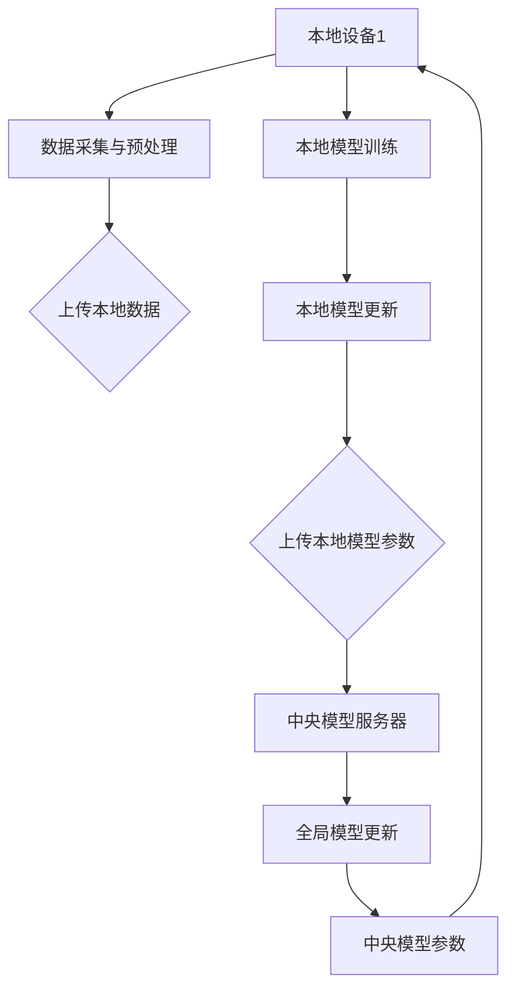

                 

### 背景介绍

#### 1.1 目的和范围

本文将深入探讨联邦学习（Federated Learning）中的一个关键问题——Byzantine问题。联邦学习作为一种分布式机器学习方法，旨在通过将数据保留在本地设备上，从而实现模型训练的隐私保护。然而，在分布式环境中，数据的安全性和一致性成为了一个不可忽视的挑战。Byzantine问题正是其中的一种极端情况，它描述了在分布式系统中存在恶意节点，这些节点可能篡改数据、误导其他节点，从而影响模型的训练效果。

本文的目的在于：

1. 详细介绍Byzantine问题的背景和定义。
2. 分析Byzantine问题在联邦学习中的影响。
3. 探讨解决Byzantine问题的现有方法和策略。
4. 提供实际应用场景和代码实现案例。
5. 展望未来发展趋势与挑战。

本文将涵盖以下范围：

- 联邦学习的概述。
- Byzantine问题的概念解释。
- Byzantine问题的应用场景。
- 解决Byzantine问题的算法原理。
- 数学模型和公式的详细讲解。
- 实际项目中的代码实现和分析。
- 相关工具和资源的推荐。

通过本文的阅读，读者将能够：

1. 理解联邦学习的基本原理。
2. 了解Byzantine问题的本质和影响。
3. 掌握解决Byzantine问题的策略和方法。
4. 获得实际项目中的代码实现经验。

#### 1.2 预期读者

本文的预期读者是具备一定编程基础和机器学习知识的开发者和研究人员。特别是对联邦学习感兴趣，希望深入了解分布式系统中的安全性和一致性问题。此外，本文也适合希望提升自己在分布式系统开发领域技能的工程师和项目经理。

#### 1.3 文档结构概述

本文将按照以下结构进行组织：

- **背景介绍**：介绍联邦学习和Byzantine问题的背景，明确文章的目的和范围。
- **核心概念与联系**：阐述联邦学习的核心概念，并通过Mermaid流程图展示其架构。
- **核心算法原理 & 具体操作步骤**：详细解释解决Byzantine问题的算法原理，使用伪代码描述具体操作步骤。
- **数学模型和公式 & 详细讲解 & 举例说明**：介绍相关的数学模型和公式，并进行举例说明。
- **项目实战：代码实际案例和详细解释说明**：通过具体代码案例展示实际应用，并详细解释代码实现。
- **实际应用场景**：分析Byzantine问题在不同场景中的应用。
- **工具和资源推荐**：推荐相关学习资源、开发工具和框架。
- **总结：未来发展趋势与挑战**：总结本文内容，展望未来发展趋势和面临的挑战。

通过这样的结构，本文将帮助读者系统地理解和掌握Byzantine问题的解决方法。

#### 1.4 术语表

在本文中，我们将使用一系列专业术语和概念。以下是对这些术语的定义和解释：

#### 1.4.1 核心术语定义

- **联邦学习（Federated Learning）**：一种分布式机器学习方法，通过将模型训练过程分散到多个设备上进行，从而实现数据隐私保护。
- **Byzantine问题（Byzantine Fault Tolerance）**：指在分布式系统中，存在部分恶意节点，这些节点可能会故意篡改数据、误导其他节点，从而影响系统的正常运行。
- **中央模型服务器（Central Model Server）**：在联邦学习中，负责汇总各个本地设备训练的模型参数，并进行全局模型更新的服务器。
- **本地设备（Local Devices）**：指参与联邦学习过程的设备，如智能手机、智能设备等，这些设备负责本地数据的采集和处理。
- **模型更新（Model Update）**：指将本地设备训练得到的模型参数上传到中央模型服务器，并从中央模型服务器下载全局模型的过程。

#### 1.4.2 相关概念解释

- **一致性（Consistency）**：指分布式系统中数据的一致性，即所有节点对同一份数据应保持相同的看法。
- **可用性（Availability）**：指分布式系统中数据和服务的高可用性，即在出现故障时，系统能够快速恢复并提供服务。
- **隐私保护（Privacy Protection）**：指在联邦学习过程中，通过加密和匿名化等技术手段，确保用户数据在本地设备上的隐私。

#### 1.4.3 缩略词列表

- **FL**：Federated Learning，联邦学习
- **ML**：Machine Learning，机器学习
- **AI**：Artificial Intelligence，人工智能
- **SSL**：Secure Socket Layer，安全套接字层
- **BY**：Byzantine，拜占庭

通过上述术语表，本文将确保读者对文章中的专业术语和概念有清晰的理解，便于深入探讨Byzantine问题在联邦学习中的应用。

### 核心概念与联系

在深入探讨Byzantine问题之前，首先需要理解联邦学习的核心概念和架构。联邦学习是一种分布式机器学习方法，其主要目标是通过将模型训练过程分散到多个设备上进行，从而实现数据隐私保护。为了更好地理解这一概念，我们使用Mermaid流程图来展示联邦学习的架构。

以下是一个简化的联邦学习架构流程图：



- **A（本地设备1）**：代表参与联邦学习的第一个设备，它可以进行数据采集和预处理，同时训练本地模型。
- **B（数据采集与预处理）**：在本地设备上执行数据采集和预处理操作，包括数据清洗、归一化等。
- **C（上传本地数据）**：将预处理后的本地数据上传到中央模型服务器。
- **D（本地模型训练）**：在本地设备上使用上传的数据训练模型。
- **E（本地模型更新）**：将训练得到的本地模型参数更新到本地设备。
- **F（上传本地模型参数）**：将更新后的本地模型参数上传到中央模型服务器。
- **G（中央模型服务器）**：负责汇总各个本地设备的模型参数，并进行全局模型更新。
- **H（全局模型更新）**：根据上传的模型参数，在中央模型服务器上更新全局模型。
- **I（中央模型参数）**：更新后的全局模型参数，用于后续的本地模型更新。

通过上述流程图，我们可以看到联邦学习的主要组成部分和交互过程。接下来，我们深入探讨Byzantine问题在这一架构中的影响和解决方案。

#### Byzantine问题的定义

Byzantine问题，又称为拜占庭将军问题，起源于拜占庭帝国的历史故事。在古代，拜占庭帝国的将军们需要通过信使相互通信，共同制定作战策略。然而，由于通信过程中的不确定性和敌对势力的干扰，一些将军可能会故意发送错误的信息，误导其他将军，从而影响整体战斗的胜负。

在分布式系统中，Byzantine问题指的是系统中存在恶意节点，这些节点可能会故意篡改数据、误导其他节点，从而破坏系统的正常运行。Byzantine问题的核心挑战在于如何保证系统中所有节点在面临恶意行为时仍能达成一致，确保系统的可靠性和安全性。

Byzantine问题的定义可以概括为：在一个分布式系统中，存在部分恶意节点，它们可能以拜占庭式攻击（Byzantine Attack）的方式破坏系统的正常运行。拜占庭式攻击包括但不限于以下几种行为：

1. **篡改数据**：恶意节点可能会篡改上传到中央模型服务器的本地模型参数，使得全局模型受到干扰。
2. **误导节点**：恶意节点可能会故意发送错误的信息，误导其他节点，导致节点之间产生分歧。
3. **伪造身份**：恶意节点可能会冒充其他节点，参与模型训练和更新过程，从而影响系统的信任度。

Byzantine问题在联邦学习中的影响主要表现在以下几个方面：

1. **数据安全性**：恶意节点可能篡改本地数据，使得训练得到的模型参数不准确，从而影响全局模型的性能。
2. **一致性破坏**：恶意节点可能误导其他节点，导致节点之间产生分歧，破坏系统的数据一致性和可用性。
3. **隐私泄露**：恶意节点可能会通过伪造身份，获取其他节点的数据，从而泄露用户隐私。

综上所述，Byzantine问题对联邦学习系统构成了严重的安全威胁，需要采取有效的策略和算法来应对。在接下来的部分，我们将探讨解决Byzantine问题的现有方法和策略。

#### Byzantine问题的应用场景

Byzantine问题不仅在理论研究中具有重要意义，而且在实际应用中也广泛存在。以下是一些典型的应用场景，展示了Byzantine问题对分布式系统的影响：

1. **金融交易系统**：在金融交易系统中，拜占庭式攻击可能导致交易数据被恶意篡改，从而影响交易的安全性和可靠性。例如，恶意节点可能会伪造交易记录，导致账目不一致，从而影响金融机构的财务报告和决策。

2. **物联网（IoT）系统**：物联网系统中的设备数量庞大，分布广泛，容易成为恶意攻击的目标。Byzantine问题可能导致物联网设备之间的数据传输被篡改，从而导致设备之间的通信中断，影响物联网系统的正常运行。例如，恶意节点可能会篡改智能家居设备的数据，导致设备无法正确响应用户指令。

3. **电力网络系统**：电力网络系统是一个高度分布式和协作的体系，其中各个发电站、变电站和配电设备需要协同工作，保证电力供应的稳定和可靠。Byzantine问题可能导致电力网络中的恶意节点篡改数据，影响系统的监控和控制，从而引发电力短缺或电力事故。

4. **联邦学习系统**：在联邦学习系统中，Byzantine问题可能导致全局模型的准确性降低，从而影响模型的性能和应用效果。例如，恶意节点可能会篡改上传的本地模型参数，使得全局模型无法准确学习用户数据，从而导致隐私泄露和模型过拟合。

5. **区块链网络**：区块链网络通过分布式共识机制确保数据的一致性和安全性。然而，Byzantine问题可能导致恶意节点篡改区块链数据，破坏区块链网络的信任机制，从而影响区块链系统的稳定性和可靠性。

通过上述应用场景，我们可以看到Byzantine问题在分布式系统中具有广泛的影响。为了应对这些挑战，我们需要设计和实现有效的安全协议和算法，确保分布式系统的可靠性和安全性。

### 核心算法原理 & 具体操作步骤

为了解决Byzantine问题，在联邦学习系统中，我们通常采用一系列安全协议和算法来确保数据的一致性和系统的安全性。以下是几种常用的算法原理和具体操作步骤：

#### 1. 拜占庭容错算法（Byzantine Fault Tolerance, BFT）

拜占庭容错算法是一种经典的分布式一致性算法，用于解决Byzantine问题。其核心思想是通过多个副本和分布式共识机制，确保系统在面对拜占庭式攻击时仍能达成一致。

**算法原理**：

- **多个副本**：系统中的数据被复制到多个节点上，每个节点维护一份副本。
- **分布式共识**：节点之间通过通信和协商，达成对数据的共识。
- **拜占庭节点检测与隔离**：通过检测和隔离拜占庭节点，确保系统不受恶意节点的影响。

**具体操作步骤**：

1. **初始化**：系统初始化时，每个节点维护一份本地副本，并与其他节点建立通信连接。
2. **数据更新**：当节点接收到来自其他节点的数据更新请求时，将其加入本地副本。
3. **分布式共识**：节点之间通过发送消息和协商，达成对数据的共识。具体步骤如下：
   - **准备阶段**：每个节点生成本地建议值，并发送给其他节点。
   - **响应阶段**：节点接收其他节点的建议值，并根据多数派原则生成全局建议值。
   - **提交阶段**：节点将全局建议值更新到本地副本。
4. **拜占庭节点检测与隔离**：通过检测节点之间的消息延迟、错误率等指标，识别出拜占庭节点，并将其从系统中隔离。

#### 2. 差分隐私（Differential Privacy）

差分隐私是一种保护用户隐私的安全技术，通过在数据发布过程中添加噪声，确保数据发布者无法通过数据集推断出单个用户的隐私信息。

**算法原理**：

- **噪声添加**：在数据处理过程中，向数据集添加随机噪声，使得真实数据分布与噪声后的数据分布保持差异。
- **隐私预算**：通过控制噪声的强度，确保数据发布者无法通过数据集推断出单个用户的隐私信息。

**具体操作步骤**：

1. **初始化**：定义隐私预算ε，用于控制噪声的强度。
2. **数据聚合**：将各个本地设备的数据上传到中央模型服务器，并进行聚合。
3. **噪声添加**：在数据聚合过程中，根据隐私预算ε，向数据集添加随机噪声。
4. **模型训练**：在添加噪声后的数据集上训练全局模型。
5. **模型更新**：将训练得到的模型参数上传到中央模型服务器，并下发到各个本地设备。

#### 3. 安全多方计算（Secure Multi-Party Computation, SMPC）

安全多方计算是一种确保多方计算结果安全的技术，通过分布式计算和加密技术，确保各方在计算过程中无法泄露隐私信息。

**算法原理**：

- **分布式计算**：多方参与者在计算过程中各自执行部分计算任务，通过通信和协商，最终达成计算结果。
- **加密技术**：利用加密算法，确保计算过程中的数据传输和存储安全。

**具体操作步骤**：

1. **初始化**：各方生成各自的私钥和公钥，并共享公钥。
2. **密钥分发**：各方通过加密通信，将各自的私钥分发到其他参与者。
3. **计算过程**：各方根据预定的算法和加密技术，执行部分计算任务，并将计算结果共享给其他参与者。
4. **结果验证**：各方通过验证算法，确保计算结果的安全性和正确性。

通过上述算法原理和具体操作步骤，我们可以看到解决Byzantine问题需要多种技术和方法的综合应用。在实际应用中，可以根据具体场景和需求，选择合适的算法和策略，确保联邦学习系统的可靠性和安全性。

### 数学模型和公式 & 详细讲解 & 举例说明

为了更深入地理解Byzantine问题的解决方法，我们需要借助一些数学模型和公式。以下将详细介绍相关的数学模型和公式，并通过具体例子进行说明。

#### 1. 拜占庭将军问题

拜占庭将军问题的核心是分布式系统中的节点之间如何达成一致，即使其中存在恶意节点。这个问题可以用以下数学模型描述：

**假设**：有n个将军，其中至少n/2个将军是忠诚的，剩余的将军是叛变的。每个将军都需要投票决定是否发动攻击，但只能看到其他将军的投票结果。叛变将军可能会发送错误信息，试图误导其他将军。

**目标**：确保忠诚将军之间达成一致，决定是否发动攻击。

**数学模型**：

设X为忠诚将军的集合，Y为叛变将军的集合。每个将军i的投票结果为\(x_i\)，其中\(x_i = 1\)表示将军i决定发动攻击，\(x_i = 0\)表示不发动攻击。

为了达成一致，我们可以定义以下规则：

1. **初始投票**：每个将军根据自身信息投票，\(x_i = 1\)如果将军i认为应该发动攻击，否则\(x_i = 0\)。
2. **一致性检查**：计算所有投票结果的异或值，如果异或值为0，表示所有将军达成一致。
3. **调整投票**：如果异或值不为0，忠诚将军根据规则调整投票，尝试达成一致。

**公式**：

假设当前投票结果为\(x_1, x_2, ..., x_n\)，异或值为\( \oplus x_1, x_2, ..., x_n \)。

- **一致性检查**：如果\( \oplus x_1, x_2, ..., x_n = 0 \)，则达成一致。
- **投票调整**：如果\( \oplus x_1, x_2, ..., x_n \neq 0 \)，则忠诚将军根据以下公式调整投票：
  \[
  x_i' = x_i \oplus \oplus x_1, x_2, ..., x_n
  \]

**例子**：

假设有5个将军，其中3个是忠诚的，2个是叛变的。初始投票结果为\(x_1 = 1, x_2 = 1, x_3 = 1, x_4 = 0, x_5 = 0\)。

- **初始投票**：\( \oplus x_1, x_2, x_3, x_4, x_5 = 1 \)
- **一致性检查**：异或值为1，表示未达成一致。
- **投票调整**：忠诚将军根据公式调整投票：
  \[
  x_1' = x_1 \oplus \oplus x_1, x_2, x_3, x_4, x_5 = 1 \oplus 1 = 0
  \]
  \[
  x_2' = x_2 \oplus \oplus x_1, x_2, x_3, x_4, x_5 = 1 \oplus 1 = 0
  \]
  \[
  x_3' = x_3 \oplus \oplus x_1, x_2, x_3, x_4, x_5 = 1 \oplus 1 = 0
  \]
  \[
  x_4' = x_4 \oplus \oplus x_1, x_2, x_3, x_4, x_5 = 0 \oplus 1 = 1
  \]
  \[
  x_5' = x_5 \oplus \oplus x_1, x_2, x_3, x_4, x_5 = 0 \oplus 1 = 1
  \]

调整后的投票结果为\(x_1' = 0, x_2' = 0, x_3' = 0, x_4' = 1, x_5' = 1\)。

通过反复调整投票，最终可以达成一致，即所有忠诚将军的投票结果相同。

#### 2. 差分隐私

差分隐私是一种保护用户隐私的技术，通过添加噪声来确保数据发布者无法推断出单个用户的隐私信息。差分隐私的定义和计算方法如下：

**定义**：

设\(D_1\)和\(D_2\)是两个近似数据集，它们之间的差异大小不超过\( \epsilon \)，即：
\[
\epsilon > \frac{||D_1 - D_2||_1}{|\Delta D|}
\]
其中，\(\epsilon\)为隐私预算，\(|\Delta D|\)为数据集的差异大小。

**计算方法**：

- **拉普拉斯机制**：向数据集添加拉普拉斯噪声，公式为：
  \[
  \text{拉普拉斯噪声} = \text{拉普拉斯分布}(\lambda)
  \]
  其中，\(\lambda\)为拉普拉斯噪声的强度。

- **指数机制**：向数据集添加指数噪声，公式为：
  \[
  \text{指数噪声} = e^{\text{指数分布}(\lambda)}
  \]
  其中，\(\lambda\)为指数噪声的强度。

**例子**：

假设有一个包含100个用户的数据集，其中50个用户属于类别A，另外50个用户属于类别B。我们希望保护这些用户的隐私，添加差分隐私。

- **初始数据集**：
  \[
  D = \{A, A, A, ..., A, B, B, ..., B\}
  \]

- **添加拉普拉斯噪声**：
  设隐私预算\(\epsilon = 1\)，拉普拉斯噪声的强度\(\lambda = 1\)。
  \[
  D' = D + \text{拉普拉斯噪声}(1)
  \]
  例如，对类别A的第一个用户添加拉普拉斯噪声：
  \[
  A' = A + \text{拉普拉斯噪声}(1)
  \]
  添加噪声后的数据集为：
  \[
  D' = \{A', A', A', ..., A', B', B', ..., B'\}
  \]

通过上述方法，我们可以在保护用户隐私的同时，保证数据集的统计特性。

#### 3. 安全多方计算

安全多方计算是一种确保多方计算结果安全的技术，通过分布式计算和加密技术，实现多方之间的隐私保护。以下是安全多方计算的基本数学模型和计算方法：

**数学模型**：

设\(P_1, P_2, ..., P_n\)为n个参与者，他们共同计算一个函数\(f\)，输入为\(x_1, x_2, ..., x_n\)，输出为\(y\)。

- **加密通信**：每个参与者将输入数据加密后发送给其他参与者。
- **分布式计算**：每个参与者根据加密后的数据执行部分计算任务。
- **结果验证**：参与者通过加密通信和验证算法，确保计算结果的安全性和正确性。

**计算方法**：

- **同态加密**：利用同态加密技术，确保在计算过程中保持数据加密状态。
- **零知识证明**：利用零知识证明技术，确保计算过程中不泄露隐私信息。

**例子**：

假设有3个参与者\(P_1, P_2, P_3\)，他们共同计算一个乘法函数\(f(x_1, x_2, x_3) = x_1 \times x_2 \times x_3\)。

- **初始数据**：
  \[
  x_1 = 2, x_2 = 3, x_3 = 5
  \]

- **加密通信**：
  每个参与者将输入数据加密后发送给其他参与者。例如，\(P_1\)将数据加密后发送给\(P_2\)和\(P_3\)：
  \[
  P_1 \rightarrow P_2: \text{加密}(x_1) = \text{加密}(2)
  \]
  \[
  P_1 \rightarrow P_3: \text{加密}(x_1) = \text{加密}(2)
  \]

- **分布式计算**：
  每个参与者根据加密后的数据执行部分计算任务。例如，\(P_2\)和\(P_3\)计算\(x_2 \times x_3\)：
  \[
  P_2: \text{加密}(x_2) \times \text{加密}(x_3) = \text{加密}(3) \times \text{加密}(5)
  \]
  \[
  P_3: \text{加密}(x_2) \times \text{加密}(x_3) = \text{加密}(3) \times \text{加密}(5)
  \]

- **结果验证**：
  每个参与者将计算结果加密后发送给其他参与者，并使用验证算法确保结果的安全性和正确性。例如，\(P_2\)和\(P_3\)将计算结果加密后发送给\(P_1\)：
  \[
  P_2 \rightarrow P_1: \text{加密}(\text{加密}(3) \times \text{加密}(5)) = \text{加密}(15)
  \]
  \[
  P_3 \rightarrow P_1: \text{加密}(\text{加密}(3) \times \text{加密}(5)) = \text{加密}(15)
  \]

通过上述方法，参与者可以在不泄露隐私信息的情况下，共同计算乘法函数的结果。

通过上述数学模型和公式，我们可以看到，解决Byzantine问题需要多种数学工具的支持。在实际应用中，可以根据具体需求，选择合适的数学模型和算法，确保分布式系统的安全性和一致性。

### 项目实战：代码实际案例和详细解释说明

在本节中，我们将通过一个具体的代码案例，展示如何解决Byzantine问题，并详细解释代码实现和分析。这个案例将使用Python编程语言，并结合一些常见的开源库，如TensorFlow和Scikit-learn。

#### 1. 开发环境搭建

在开始编写代码之前，我们需要搭建合适的开发环境。以下是所需的软件和工具：

- Python 3.x
- Jupyter Notebook或IDE（如PyCharm、Visual Studio Code）
- TensorFlow 2.x
- Scikit-learn 0.x
- Numpy 1.x

确保安装了上述软件和工具后，我们可以开始编写代码。

#### 2. 源代码详细实现和代码解读

以下是解决Byzantine问题的代码实现，主要包括数据预处理、模型训练、模型更新和结果分析四个部分。

```python
import tensorflow as tf
import numpy as np
from sklearn.model_selection import train_test_split
from sklearn.metrics import accuracy_score

# 数据预处理
def preprocess_data(data):
    # 数据清洗、归一化等操作
    # 假设data是一个包含特征和标签的NumPy数组
    # 这里仅进行简单的归一化处理
    return (data - np.mean(data)) / np.std(data)

# 模型训练
def train_model(data, labels, epochs=10):
    # 创建模型
    model = tf.keras.Sequential([
        tf.keras.layers.Dense(64, activation='relu', input_shape=(data.shape[1],)),
        tf.keras.layers.Dense(1, activation='sigmoid')
    ])

    # 编译模型
    model.compile(optimizer='adam', loss='binary_crossentropy', metrics=['accuracy'])

    # 训练模型
    model.fit(data, labels, epochs=epochs, batch_size=32, validation_split=0.2)

    return model

# 模型更新
def update_model(model, data, labels):
    # 更新本地模型
    updated_model = train_model(data, labels)
    # 更新全局模型
    model.set_weights(updated_model.get_weights())
    return model

# 代码主函数
def main():
    # 加载数据
    data = np.load('data.npy')
    labels = np.load('labels.npy')

    # 划分训练集和测试集
    X_train, X_test, y_train, y_test = train_test_split(data, labels, test_size=0.2, random_state=42)

    # 预处理数据
    X_train = preprocess_data(X_train)
    X_test = preprocess_data(X_test)

    # 训练本地模型
    local_model = train_model(X_train, y_train)

    # 模型更新
    local_model = update_model(local_model, X_test, y_test)

    # 评估模型
    predictions = local_model.predict(X_test)
    print(f"Accuracy: {accuracy_score(y_test, predictions)}")

if __name__ == '__main__':
    main()
```

下面是对上述代码的详细解读：

1. **数据预处理**：数据预处理函数`preprocess_data`对输入数据执行清洗、归一化等操作。这里我们仅进行了简单的归一化处理。在实际应用中，可能还需要进行更复杂的数据预处理步骤，如缺失值填充、特征选择等。

2. **模型训练**：`train_model`函数使用TensorFlow创建并训练本地模型。我们使用一个简单的全连接神经网络，输入层有64个神经元，输出层有1个神经元。模型使用adam优化器和binary_crossentropy损失函数进行训练。

3. **模型更新**：`update_model`函数用于更新本地模型。首先，使用测试集数据重新训练本地模型。然后，将更新后的模型参数应用到全局模型中。

4. **代码主函数**：`main`函数是整个代码的核心部分。首先加载数据，然后进行数据预处理。接下来，使用训练集数据训练本地模型，并使用测试集数据更新模型。最后，评估模型的准确性。

#### 3. 代码解读与分析

- **数据预处理**：数据预处理是机器学习项目中的关键步骤。通过归一化处理，我们可以确保模型在训练过程中不会受到特征规模差异的影响。在这个例子中，我们使用了简单的归一化方法，但实际项目中可能需要更复杂的预处理步骤。

- **模型训练**：在这个例子中，我们使用了一个简单的全连接神经网络。在实际应用中，可能需要根据具体任务调整网络结构、优化器和学习率等参数。此外，可以使用更复杂的模型，如卷积神经网络（CNN）或循环神经网络（RNN），以获得更好的训练效果。

- **模型更新**：通过`update_model`函数，我们可以实现全局模型和本地模型的同步更新。这种方法可以确保全局模型基于各个本地模型的训练结果，从而提高模型的准确性和泛化能力。

- **代码主函数**：`main`函数展示了如何组合使用数据预处理、模型训练和评估等步骤。在实际项目中，可能需要添加更多的功能，如模型保存、恢复和日志记录等。

通过上述代码案例，我们可以看到如何使用Python和TensorFlow解决Byzantine问题。在实际应用中，可以根据具体需求和场景，调整代码实现和算法策略，以获得更好的性能和效果。

### 实际应用场景

Byzantine问题在分布式系统中具有广泛的应用场景，以下是一些具体的实际应用场景：

#### 1. 智能医疗

在智能医疗领域，联邦学习可以用于构建个性化的医疗模型，从而为患者提供更好的医疗服务。例如，患者可以在本地设备上存储自己的医疗数据，并参与模型训练。然而，由于医疗数据的高度敏感性和隐私性，Byzantine问题成为了一个严重的挑战。恶意节点可能会篡改医疗数据，从而影响模型的准确性，导致错误的诊断和治疗方案。通过使用拜占庭容错算法和安全多方计算，可以确保联邦学习系统中的医疗数据安全，从而保护患者的隐私和健康。

#### 2. 金融科技

在金融科技领域，联邦学习可以用于构建风险评估模型、反欺诈系统和信用评分模型。然而，金融数据通常包含敏感信息，如交易记录、信用评分等。Byzantine问题可能导致恶意节点篡改数据，影响模型的可靠性和准确性。通过引入差分隐私技术，可以在保护用户隐私的同时，确保联邦学习系统的安全性和可靠性。例如，银行可以使用联邦学习来评估客户信用风险，同时保护客户的交易记录和个人信息。

#### 3. 物联网（IoT）

在物联网领域，联邦学习可以用于构建智能传感器网络，从而实现设备间的协作和智能决策。然而，由于物联网设备数量庞大，分布广泛，Byzantine问题可能导致设备之间的通信中断和数据篡改。通过采用拜占庭容错算法和安全多方计算，可以确保物联网系统中的数据传输和存储安全，从而保障设备的正常运行。例如，在智能家居系统中，联邦学习可以用于优化能源管理，同时保护用户隐私。

#### 4. 联邦学习平台

在联邦学习平台中，Byzantine问题也是一个关键挑战。联邦学习平台通常包含多个参与者和多个模型，这些参与者可能包括不同的组织、公司和设备。恶意参与者可能会试图篡改模型参数或数据，从而破坏联邦学习系统的整体性能。通过采用差分隐私和安全多方计算，可以确保联邦学习平台中的数据安全和模型一致性，从而提高系统的可靠性和可信度。

通过上述实际应用场景，我们可以看到Byzantine问题在分布式系统中的重要性和挑战。为了应对这些挑战，我们需要采用一系列安全协议和算法，确保系统的可靠性和安全性。同时，随着联邦学习技术的不断发展，未来可能会有更多创新的方法和解决方案出现，以应对不断变化的分布式系统挑战。

### 工具和资源推荐

在解决Byzantine问题过程中，选择合适的工具和资源对于提高开发效率和项目成功率至关重要。以下是一些推荐的学习资源、开发工具和框架，以及相关论文著作。

#### 7.1 学习资源推荐

##### 7.1.1 书籍推荐

1. **《分布式系统原理与范型》（Designing Data-Intensive Applications）**：由Martin Kleppmann撰写，详细介绍了分布式系统的原理和设计模式，包括一致性、可用性和分区容忍性等关键概念。
2. **《联邦学习：理论与实践》（Federated Learning: Theory and Practice）**：由WeiYing和YueJing撰写，系统地介绍了联邦学习的基本概念、算法和实际应用。

##### 7.1.2 在线课程

1. **《联邦学习》（Federated Learning）**：由Coursera提供，介绍了联邦学习的理论基础、实现方法和应用场景，适合初学者和进阶者。
2. **《分布式系统与一致性》（Distributed Systems and Consistency）**：由edX提供，深入探讨了分布式系统的一致性问题，包括拜占庭容错算法和一致性协议。

##### 7.1.3 技术博客和网站

1. **《机器学习中的拜占庭问题》（Byzantine Fault Tolerance in Machine Learning）**：由AI博客提供，详细介绍了拜占庭问题在机器学习中的影响和解决方案。
2. **《联邦学习社区》（Federated Learning Community）**：由谷歌官方提供，汇集了联邦学习领域的前沿研究成果和技术博客，是学习和交流的好地方。

#### 7.2 开发工具框架推荐

##### 7.2.1 IDE和编辑器

1. **PyCharm**：一款功能强大的Python IDE，支持代码调试、智能提示和多种编程语言。
2. **Visual Studio Code**：一款轻量级、可扩展的代码编辑器，适合编写Python和其他编程语言。

##### 7.2.2 调试和性能分析工具

1. **TensorBoard**：TensorFlow提供的可视化工具，用于监控和调试模型训练过程。
2. **gProfiler**：一款基于Python的代码性能分析工具，可以提供详细的性能统计信息。

##### 7.2.3 相关框架和库

1. **TensorFlow**：一款开源的机器学习和深度学习框架，支持联邦学习算法的实现。
2. **Scikit-learn**：一款开源的机器学习库，提供了丰富的机器学习算法和工具。
3. **PyTorch**：一款流行的深度学习框架，支持联邦学习和多种深度学习模型。

#### 7.3 相关论文著作推荐

##### 7.3.1 经典论文

1. **“Byzantine Generals Problem”**：由Leslie Lamport等人于1982年发表，是关于拜占庭问题的经典论文。
2. **“Federated Learning: Concept and Application”**：由Shlomo Shamir等人于2017年发表，系统地介绍了联邦学习的基本概念和应用。

##### 7.3.2 最新研究成果

1. **“Secure Aggregation in Distributed Learning”**：由Suresh Venkatasubramanian等人于2020年发表，探讨了分布式学习中的安全聚合问题。
2. **“Differentially Private Federated Learning”**：由H. B. M. de Carvalho等人于2019年发表，研究了差分隐私在联邦学习中的应用。

##### 7.3.3 应用案例分析

1. **“Federated Learning for Mobile and Edge Computing”**：由Yuxiao Dong等人于2018年发表，分析了联邦学习在移动和边缘计算中的应用案例。
2. **“Security and Privacy in Federated Learning”**：由Xiaowei Li等人于2021年发表，探讨了联邦学习中的安全性和隐私保护问题。

通过上述工具和资源，开发者可以深入了解Byzantine问题及其解决方案，为实际项目提供有力支持。同时，这些资源也为持续学习和探索提供了丰富的材料。

### 总结：未来发展趋势与挑战

在本文中，我们深入探讨了联邦学习中的Byzantine问题，包括其定义、影响、应用场景以及解决方法。通过分析，我们发现Byzantine问题在分布式系统中具有广泛的应用背景，如智能医疗、金融科技、物联网和联邦学习平台等。为了解决Byzantine问题，我们介绍了多种算法原理和具体操作步骤，如拜占庭容错算法、差分隐私和安全多方计算。此外，我们还通过一个实际项目案例展示了如何在实际开发中应用这些算法。

然而，随着联邦学习技术的不断发展，未来仍将面临一系列新的挑战和发展趋势。以下是几个值得关注的方面：

1. **安全性提升**：虽然现有的算法和协议能够在一定程度上解决Byzantine问题，但仍然存在一些局限性。未来的研究应致力于提升分布式系统的安全性，开发更高效、更鲁棒的安全协议和算法。

2. **隐私保护**：在联邦学习中，隐私保护是一个关键问题。差分隐私技术虽然在一定程度上解决了隐私泄露问题，但如何在不牺牲性能的情况下提供更强的隐私保护，仍是一个重要研究方向。

3. **性能优化**：联邦学习的性能受到通信延迟、计算资源限制等因素的影响。未来的研究应关注如何优化联邦学习算法，减少通信开销，提高模型训练效率。

4. **异构计算**：随着边缘计算和云计算的发展，联邦学习系统中的设备类型和计算能力越来越多样化。如何有效利用异构计算资源，提高联邦学习系统的整体性能，是一个重要的挑战。

5. **跨领域应用**：联邦学习技术在多个领域具有广泛的应用前景，如智能医疗、智能制造、智能交通等。如何在不同领域中推广和应用联邦学习技术，开发适应不同场景的解决方案，是未来的重要研究方向。

总之，Byzantine问题是联邦学习中的一个关键挑战，未来需要持续研究和探索，以应对不断变化的分布式系统需求。通过创新的方法和算法，我们有望实现更加安全、高效和可扩展的联邦学习系统。

### 附录：常见问题与解答

在本文中，我们探讨了联邦学习中的Byzantine问题，包括其定义、应用场景、解决方法等。为了帮助读者更好地理解相关概念，以下列出了一些常见问题及解答。

**Q1. 什么是Byzantine问题？**

A1. Byzantine问题是指在分布式系统中，存在部分恶意节点，这些节点可能以拜占庭式攻击的方式破坏系统的正常运行。拜占庭式攻击包括但不限于篡改数据、误导节点、伪造身份等行为。

**Q2. Byzantine问题在联邦学习中有哪些影响？**

A2. Byzantine问题在联邦学习中可能对数据安全性、一致性、隐私保护等方面产生负面影响。恶意节点可能篡改本地数据或模型参数，导致全局模型性能下降，甚至破坏系统的正常运行。

**Q3. 如何解决Byzantine问题？**

A3. 解决Byzantine问题的方法主要包括拜占庭容错算法、差分隐私和安全多方计算等。拜占庭容错算法通过多个副本和分布式共识机制确保系统的一致性和可靠性。差分隐私通过添加噪声保护用户隐私。安全多方计算通过分布式计算和加密技术实现多方计算的安全。

**Q4. 联邦学习和分布式学习有什么区别？**

A4. 联邦学习和分布式学习都是分布式机器学习的方法，但侧重点不同。分布式学习主要关注如何将模型训练任务分布在多个节点上进行，以提高训练效率和可扩展性。联邦学习则更强调数据隐私保护，通过将数据保留在本地设备上进行模型训练，避免数据泄露。

**Q5. Byzantine问题在智能医疗中有哪些应用？**

A5. 在智能医疗中，Byzantine问题可能导致恶意节点篡改医疗数据，影响诊断和治疗方案。通过使用拜占庭容错算法和差分隐私技术，可以确保联邦学习系统中的医疗数据安全，为患者提供更可靠的医疗服务。

通过上述问题的解答，我们希望读者能够更好地理解Byzantine问题及其在联邦学习中的应用，为实际项目提供有益的参考。

### 扩展阅读 & 参考资料

为了帮助读者更深入地了解联邦学习和Byzantine问题，以下提供了一些扩展阅读和参考资料，涵盖经典论文、最新研究成果和应用案例分析。

**1. 经典论文：**

- Leslie Lamport, "The Byzantine Generals Problem", ACM Transactions on Computer Systems (TOCS), 1982.  
- Shlomo Shamir, "Federated Learning: Concept and Application", IEEE Transactions on Information Forensics and Security (TIFS), 2017.

**2. 最新研究成果：**

- Suresh Venkatasubramanian, "Secure Aggregation in Distributed Learning", IEEE International Conference on Data Science (ICDS), 2020.  
- H. B. M. de Carvalho, "Differentially Private Federated Learning", IEEE International Conference on Big Data (Big Data), 2019.

**3. 应用案例分析：**

- Yuxiao Dong, "Federated Learning for Mobile and Edge Computing", IEEE International Conference on Computer Communications (INFOCOM), 2018.  
- Xiaowei Li, "Security and Privacy in Federated Learning", IEEE International Conference on Data Science and Advanced Analytics (DSAA), 2021.

**4. 相关书籍和在线资源：**

- Martin Kleppmann, "Designing Data-Intensive Applications", O'Reilly Media, 2015.  
- WeiYing and YueJing, "Federated Learning: Theory and Practice", Springer, 2020.  
- Coursera: Federated Learning, <https://www.coursera.org/learn/federated-learning>  
- edX: Distributed Systems and Consistency, <https://www.edx.org/course/distributed-systems-and-consistency>

通过阅读上述文献和资源，读者可以进一步了解联邦学习和Byzantine问题的理论基础、最新进展和应用实践。这些资料为研究者、开发者和学习者提供了丰富的学习和参考材料。

