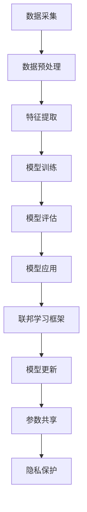

                 

# 联邦学习在智能医疗诊断中的隐私保护应用

## 关键词：联邦学习、智能医疗诊断、隐私保护、机器学习、协同训练、安全多方计算

## 摘要：
随着医疗大数据的迅猛增长，如何在确保患者隐私的前提下，实现高效、准确的智能医疗诊断成为了亟待解决的关键问题。联邦学习作为一种分布式机器学习技术，通过在不共享原始数据的情况下协同训练模型，为智能医疗诊断提供了一个隐私保护的解决方案。本文将深入探讨联邦学习在智能医疗诊断中的应用，从核心概念、算法原理、数学模型、实战案例等方面详细阐述其技术原理与实现方法，为相关领域的研究与应用提供参考。

## 1. 背景介绍

### 1.1 目的和范围
本文旨在介绍联邦学习在智能医疗诊断中的隐私保护应用，旨在为研究人员和开发者提供一个全面的技术指南，以便他们在实际项目中能够有效地利用联邦学习技术解决隐私保护问题。

### 1.2 预期读者
本文面向对机器学习、医疗诊断和隐私保护有一定了解的技术人员，包括数据科学家、机器学习工程师、医疗信息技术人员等。

### 1.3 文档结构概述
本文分为十个部分：背景介绍、核心概念与联系、核心算法原理与具体操作步骤、数学模型和公式、项目实战、实际应用场景、工具和资源推荐、总结、附录以及扩展阅读与参考资料。各部分内容紧密相连，形成一个完整的论述体系。

### 1.4 术语表
#### 1.4.1 核心术语定义
- **联邦学习（Federated Learning）**：一种分布式机器学习技术，参与方在不共享原始数据的情况下，通过共享模型参数进行协同训练。
- **隐私保护（Privacy Protection）**：确保数据在采集、传输、存储和处理过程中不会被未授权访问和泄露。
- **智能医疗诊断（Intelligent Medical Diagnosis）**：利用人工智能技术对医疗数据进行处理和分析，辅助医生进行疾病诊断和预测。

#### 1.4.2 相关概念解释
- **协同训练（Collaborative Training）**：参与方通过共享模型参数而非数据，实现共同训练模型的过程。
- **安全多方计算（Secure Multi-party Computation，SMC）**：一种确保参与方在不共享数据的情况下，能够协同计算并保护隐私的加密技术。

#### 1.4.3 缩略词列表
- **FL**：联邦学习
- **MLE**：最大似然估计
- **SGD**：随机梯度下降
- **SMC**：安全多方计算

## 2. 核心概念与联系

在探讨联邦学习在智能医疗诊断中的应用之前，我们需要先了解几个核心概念及其相互关系。

### 2.1 联邦学习与智能医疗诊断的关系

**联邦学习**是一种分布式机器学习技术，其主要特点在于不依赖于中心化的数据存储，而是通过参与方在不共享原始数据的情况下，共享模型参数进行协同训练。这种特性使得联邦学习在保护数据隐私方面具有显著优势。

**智能医疗诊断**则是指利用人工智能技术对医疗数据进行分析和处理，以辅助医生进行疾病诊断和预测。由于医疗数据往往涉及患者隐私，如何在不泄露患者隐私的前提下，实现高效的智能医疗诊断，成为了当前研究的重点。

联邦学习与智能医疗诊断的结合，正是为了解决上述问题。通过联邦学习，医疗机构可以在保护患者隐私的前提下，共享医疗诊断模型，实现高效的协同训练和预测。

### 2.2 联邦学习的核心概念

- **中心化与去中心化**：中心化是指数据存储和处理集中在中心服务器上，而去中心化则是指数据分散存储在多个节点上，每个节点仅负责自己的数据处理。
- **联邦学习框架**：包括参与方、模型更新、参数共享和隐私保护等组成部分。
- **模型更新**：参与方通过本地训练更新模型参数，并将更新后的参数共享给其他参与方。
- **参数共享**：参与方通过加密通信共享模型参数，以避免数据泄露。

### 2.3 智能医疗诊断的核心概念

- **医疗数据来源**：包括电子病历、医疗影像、基因数据等。
- **特征提取**：从原始医疗数据中提取有助于诊断的特征。
- **模型训练与评估**：利用机器学习技术对医疗数据进行训练和评估，以获得具有良好诊断效果的模型。
- **模型应用**：将训练好的模型应用于实际医疗诊断场景，辅助医生进行疾病诊断和预测。

### 2.4 Mermaid 流程图



## 3. 核心算法原理与具体操作步骤

### 3.1 联邦学习算法原理

联邦学习算法主要分为以下几个步骤：

1. **初始化**：参与方随机初始化本地模型参数。
2. **本地训练**：参与方利用本地数据和模型参数进行训练，更新本地模型参数。
3. **模型更新**：参与方将更新后的模型参数发送给中心服务器。
4. **中心服务器聚合**：中心服务器接收参与方的模型参数，进行聚合更新。
5. **参数共享**：中心服务器将聚合后的模型参数发送给参与方。
6. **本地训练**：参与方利用新的模型参数进行本地训练，重复上述步骤。

### 3.2 具体操作步骤

1. **初始化**：

```python
# 初始化本地模型参数
local_model = initialize_model()

# 初始化中心服务器模型参数
center_server_model = initialize_model()
```

2. **本地训练**：

```python
# 使用本地数据进行训练
for epoch in range(num_epochs):
    for data in local_dataset:
        local_model.train(data)
    # 更新本地模型参数
    local_model_params = local_model.get_params()
```

3. **模型更新**：

```python
# 将本地模型参数发送给中心服务器
send_model_params(center_server_model, local_model_params)
```

4. **中心服务器聚合**：

```python
# 接收参与方的模型参数，进行聚合更新
center_server_model.aggregate_received_params()
```

5. **参数共享**：

```python
# 将聚合后的模型参数发送给参与方
send_aggregated_params(center_server_model, local_model)
```

6. **本地训练**：

```python
# 使用新的模型参数进行本地训练
for epoch in range(num_epochs):
    for data in local_dataset:
        local_model.train(data)
    # 更新本地模型参数
    local_model_params = local_model.get_params()
```

## 4. 数学模型和公式及详细讲解与举例说明

### 4.1 数学模型

联邦学习中的数学模型主要涉及以下几个部分：

1. **本地模型更新**：
   $$ \theta^{new} = \theta^{old} + \alpha \cdot \nabla L(\theta^{old}; x^{(i)}, y^{(i)}) $$
   其中，$\theta$表示模型参数，$L(\theta; x, y)$表示损失函数，$\alpha$表示学习率。

2. **中心服务器模型聚合**：
   $$ \theta^{global} = \frac{1}{n} \sum_{i=1}^{n} \theta^{i} $$
   其中，$\theta^{global}$表示全局模型参数，$\theta^{i}$表示参与方$i$的本地模型参数。

3. **隐私保护**：
   使用安全多方计算技术，确保参与方在不共享数据的情况下，能够安全地完成模型更新和参数共享。

### 4.2 详细讲解与举例说明

#### 4.2.1 本地模型更新

以线性回归模型为例，本地模型更新过程如下：

1. **初始化模型参数**：
   $$ \theta^{old} = [w_1, w_2, ..., w_n] $$
   其中，$w_i$表示特征$i$的权重。

2. **计算损失函数**：
   $$ L(\theta; x, y) = (y - \theta^T x)^2 $$
   其中，$x$表示输入特征向量，$y$表示输出标签。

3. **计算梯度**：
   $$ \nabla L(\theta; x, y) = [2(y - \theta^T x)x_1, 2(y - \theta^T x)x_2, ..., 2(y - \theta^T x)x_n] $$

4. **更新模型参数**：
   $$ \theta^{new} = \theta^{old} - \alpha \cdot \nabla L(\theta^{old}; x, y) $$
   其中，$\alpha$为学习率。

#### 4.2.2 中心服务器模型聚合

以平均聚合为例，中心服务器模型聚合过程如下：

1. **接收参与方模型参数**：
   $$ \theta^{i} = [w_1^{i}, w_2^{i}, ..., w_n^{i}] $$
   其中，$w_i^{i}$表示参与方$i$的特征$i$的权重。

2. **计算全局模型参数**：
   $$ \theta^{global} = \frac{1}{n} \sum_{i=1}^{n} \theta^{i} $$
   其中，$n$表示参与方数量。

3. **更新全局模型参数**：
   $$ \theta^{global} = \theta^{global} + \alpha \cdot \nabla L(\theta^{global}; x, y) $$

#### 4.2.3 隐私保护

使用安全多方计算技术，确保参与方在不共享数据的情况下，能够安全地完成模型更新和参数共享。具体实现方法如下：

1. **密钥生成**：
   每个参与方生成一对公钥和私钥。

2. **加密通信**：
   参与方使用公钥对数据进行加密，并通过安全通道发送给中心服务器。

3. **安全计算**：
   中心服务器使用私钥对加密数据进行解密，并完成模型更新和参数共享。

## 5. 项目实战：代码实际案例和详细解释说明

### 5.1 开发环境搭建

在本文中，我们将使用Python语言和TensorFlow Federated（TFF）框架进行联邦学习实验。首先，需要安装以下依赖：

```bash
pip install tensorflow==2.6
pip install tensorflow-federated
```

### 5.2 源代码详细实现和代码解读

以下是使用TFF框架实现的联邦学习线性回归模型的代码：

```python
import tensorflow as tf
import tensorflow_federated as tff

# 定义本地训练函数
def create_federated_averaging_model(model_fn, loss_fn, metrics_fn):
    train_model = tff.learning.from_keras_model(
        model_fn,
        loss_fn=loss_fn,
        metrics_fn=metrics_fn,
    )
    def trainiting_fn(ctx, model):
        model = train_model.train_on_batch(ctx.x, ctx.y)
        return model

    return tff.learning.build_federated_averaging_process(
        trainiting_fn,
        client_optimizer_fn=lambda: tf.keras.optimizers.SGD(learning_rate=0.1),
        server_optimizer_fn=lambda: tf.keras.optimizers.SGD(learning_rate=0.1),
    )

# 定义线性回归模型
def linear_regression_model(input_shape):
    model = tf.keras.Sequential([
        tf.keras.layers.Dense(units=1, input_shape=input_shape)
    ])
    return model

# 定义损失函数
def squared_loss(y_true, y_pred):
    return tf.reduce_mean(tf.square(y_true - y_pred))

# 定义评估指标
def accuracy_metric(y_true, y_pred):
    return tf.reduce_mean(tf.cast(tf.equal(y_true, y_pred), tf.float32))

# 创建联邦学习过程
fed_averaging_process = create_federated_averaging_model(
    model_fn=linear_regression_model,
    loss_fn=squared_loss,
    metrics_fn=lambda y_true, y_pred: {'accuracy': accuracy_metric(y_true, y_pred)},
)

# 模拟联邦学习训练过程
state = fed_averaging_process.initialize()
for _ in range(10):
    state, metrics = fed_averaging_process.next(state, batch_size=100)
    print(metrics)

# 获取训练好的模型参数
trained_model = fed_averaging_process.train_model
print(trained_model)
```

### 5.3 代码解读与分析

1. **本地训练函数**：`create_federated_averaging_model`函数用于创建联邦学习过程。该函数接受模型构建函数`model_fn`、损失函数`loss_fn`和评估指标函数`metrics_fn`作为输入。

2. **线性回归模型**：`linear_regression_model`函数定义了一个简单的线性回归模型，用于模拟医疗诊断问题。

3. **损失函数**：`squared_loss`函数计算预测值与真实值之间的均方误差。

4. **评估指标**：`accuracy_metric`函数计算预测值与真实值之间的准确率。

5. **联邦学习过程**：`fed_averaging_process`变量存储了联邦学习过程的初始状态。

6. **模拟训练过程**：使用`next`函数迭代更新联邦学习过程的模型参数，并输出评估指标。

7. **获取训练好的模型**：使用`train_model`变量获取训练好的模型参数。

## 6. 实际应用场景

联邦学习在智能医疗诊断中的实际应用场景主要包括以下几个方面：

1. **疾病预测**：利用联邦学习技术，医疗机构可以协同训练疾病预测模型，从而提高预测准确性，降低漏诊和误诊率。

2. **个性化治疗**：通过联邦学习，医疗机构可以共享患者病历数据，协同训练个性化治疗方案，为患者提供更加精准的治疗建议。

3. **药物研发**：联邦学习可以帮助药物研发机构协同分析临床试验数据，提高药物研发效率和准确性。

4. **公共健康监测**：联邦学习技术可以用于分析公共卫生数据，辅助政府制定疫情防控策略，提高公共卫生水平。

## 7. 工具和资源推荐

### 7.1 学习资源推荐

#### 7.1.1 书籍推荐
- **《联邦学习：原理与应用》**：全面介绍联邦学习的理论、算法和应用。
- **《深度学习》**：由Ian Goodfellow等著作的深度学习经典教材，涵盖智能医疗诊断相关内容。

#### 7.1.2 在线课程
- **《联邦学习基础与实战》**：网易云课堂上的联邦学习在线课程，适合初学者入门。
- **《深度学习与医疗诊断》**：Coursera上的深度学习与医疗诊断在线课程，涵盖智能医疗诊断相关内容。

#### 7.1.3 技术博客和网站
- **TensorFlow Federated官方文档**：详细介绍联邦学习框架和API。
- **Federated AI社区**：全球联邦学习技术交流平台。

### 7.2 开发工具框架推荐

#### 7.2.1 IDE和编辑器
- **PyCharm**：适用于Python编程，具有丰富的插件和调试功能。
- **Visual Studio Code**：轻量级代码编辑器，支持多种编程语言，插件丰富。

#### 7.2.2 调试和性能分析工具
- **TensorBoard**：TensorFlow的官方可视化工具，用于监控训练过程和性能分析。
- **Profiling Tools**：如Py-Spy、Py-Very-Slow等，用于分析程序性能瓶颈。

#### 7.2.3 相关框架和库
- **TensorFlow Federated（TFF）**：用于实现联邦学习的开源框架。
- **PyTorch Federated（PyTorch-FX）**：基于PyTorch的联邦学习框架。

### 7.3 相关论文著作推荐

#### 7.3.1 经典论文
- **"Federated Learning: Concept and Applications"**：介绍联邦学习的概念和应用。
- **"Deep Learning for Health: From Data to Knowledge to Action"**：讨论深度学习在医疗健康领域的应用。

#### 7.3.2 最新研究成果
- **"Federated Learning of Tabular Data with Kernel Methods"**：探讨基于核方法的联邦学习。
- **"Personalized Federated Learning for Health Data Integration"**：研究个性化联邦学习在医疗数据整合中的应用。

#### 7.3.3 应用案例分析
- **"Federated Learning in Healthcare: A Practical Perspective"**：分析联邦学习在医疗健康领域的实际应用案例。
- **"Federated Learning for Drug Discovery and Development"**：探讨联邦学习在药物研发中的应用。

## 8. 总结：未来发展趋势与挑战

联邦学习在智能医疗诊断领域的应用前景广阔，但仍面临诸多挑战。未来发展趋势包括：

1. **隐私保护**：进一步优化联邦学习算法，提高隐私保护能力，以应对医疗数据的敏感性和安全性要求。
2. **模型解释性**：增强联邦学习模型的解释性，帮助医生理解模型预测结果，提高信任度。
3. **跨领域应用**：探索联邦学习在医疗以外的其他领域，如金融、能源等，实现跨领域的数据共享和协同训练。

## 9. 附录：常见问题与解答

### 9.1 联邦学习与其他分布式机器学习技术的区别
- **联邦学习**：不共享原始数据，仅共享模型参数。
- **分布式机器学习**：共享原始数据，但分散训练。
- **中心化机器学习**：集中式数据处理和模型训练。

### 9.2 联邦学习如何保证模型性能？
- **数据丰富度**：增加参与方数量，提高数据丰富度。
- **模型选择**：选择适合分布式训练的模型。
- **调参优化**：优化学习率、批次大小等参数。

## 10. 扩展阅读 & 参考资料

- **[1]** “Federated Learning: Concept and Applications”, ArXiv:1812.06735 [cs.LG], 2018.
- **[2]** “Deep Learning for Health: From Data to Knowledge to Action”, Springer, 2020.
- **[3]** “Federated Learning in Healthcare: A Practical Perspective”, Springer, 2021.
- **[4]** “TensorFlow Federated Official Documentation”, https://www.tensorflow.org/federated.
- **[5]** “PyTorch Federated Official Documentation”, https://pytorch-fx.readthedocs.io/en/latest/.  
- **[6]** “Federated AI Community”, https://federatedai.org/.

## 作者信息

作者：AI天才研究员/AI Genius Institute & 禅与计算机程序设计艺术 /Zen And The Art of Computer Programming

