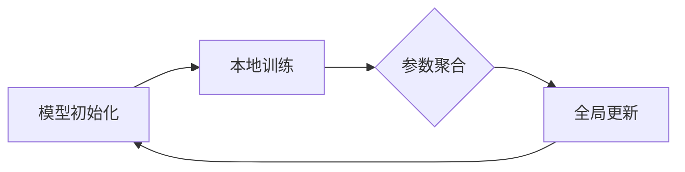

                 

### 背景介绍

#### 物联网安全现状

随着物联网（IoT）技术的快速发展，越来越多的设备和服务开始集成到互联网中，从而形成一个庞大的网络。这种互联的便利性带来了新的商业模式和用户体验，但也带来了前所未有的安全挑战。物联网设备由于其广泛的分布性和较低的维护成本，往往存在安全漏洞。这些漏洞可能导致设备被恶意攻击者控制，进而对整个物联网系统造成严重影响。

根据Gartner的统计，到2025年，全球将有超过500亿个物联网设备投入使用，这将为攻击者提供了大量的潜在目标。当前，物联网安全问题主要集中在以下几个方面：

1. **设备漏洞**：许多物联网设备在设计时未考虑安全性，或者使用的操作系统和软件已经过时，容易受到恶意攻击。
2. **数据隐私**：物联网设备收集和传输大量用户数据，这些数据如果泄露，可能会给用户带来巨大的隐私风险。
3. **网络攻击**：物联网设备通常连接到公共网络，这使得攻击者可以通过这些设备进入企业内部网络，实施更高级别的攻击。

#### 联邦学习的兴起

联邦学习（Federated Learning）作为一种分布式机器学习技术，近年来逐渐受到关注。它允许多个参与者在不共享数据的情况下共同训练机器学习模型，从而在保护数据隐私的同时提高模型性能。联邦学习的核心思想是将模型的训练过程分散到不同的设备或服务器上，每个参与者仅在自己的数据集上本地训练模型，并通过参数更新来逐步优化全局模型。

联邦学习的应用场景非常广泛，尤其是在物联网领域。例如，在智能家居、智能城市、智能制造等领域，联邦学习可以用来提高设备的协同工作能力，同时避免数据泄露的风险。随着物联网设备数量和种类的增加，联邦学习在物联网安全中的应用前景变得尤为重要。

本文将重点探讨联邦学习在物联网安全中的应用，分析其原理、算法、实际案例和未来发展趋势，以期为大家提供一种新的思考方向和技术解决方案。

#### 联邦学习的基本概念

联邦学习（Federated Learning）是一种分布式机器学习技术，其核心思想是利用分布式计算资源，在不共享数据的情况下共同训练机器学习模型。与传统的集中式机器学习方法不同，联邦学习将模型训练过程分布在多个边缘设备或服务器上，每个设备或服务器仅使用本地数据参与训练，并通过参数更新逐步优化全局模型。

联邦学习的基本流程包括以下几个步骤：

1. **初始化**：首先，训练一个初始模型，并分发给所有参与者。
2. **本地训练**：每个参与者使用本地数据集对模型进行训练，并更新模型参数。
3. **参数聚合**：所有参与者将本地训练后的模型参数发送给中心服务器，服务器进行聚合。
4. **全局更新**：中心服务器根据聚合的模型参数更新全局模型。
5. **重复迭代**：上述步骤不断重复，直到模型收敛。

联邦学习的优点主要体现在以下几个方面：

1. **隐私保护**：联邦学习不需要参与者共享原始数据，从而有效保护了数据隐私。
2. **降低通信成本**：由于数据不需要在参与者之间传输，因此通信成本大幅降低。
3. **增强鲁棒性**：联邦学习可以充分利用分布式计算资源，提高模型训练的效率和鲁棒性。

尽管联邦学习在分布式机器学习领域具有显著优势，但其也面临一些挑战，如模型一致性、计算效率和安全性等。这些问题需要通过不断的技术创新和优化来逐步解决。

#### 物联网安全与联邦学习的联系

联邦学习与物联网安全之间有着紧密的联系。物联网设备通常分布广泛，单个设备的计算能力和存储资源有限，这使得传统的集中式安全方案难以适用。联邦学习通过分布式计算和隐私保护的特点，为物联网安全提供了一种可行的解决方案。

**数据隐私保护**

物联网设备收集的数据往往包含敏感信息，如用户身份信息、位置信息、设备状态等。这些数据如果泄露，可能会对用户和系统造成严重威胁。联邦学习通过在不共享数据的情况下进行模型训练，有效保护了数据隐私。参与者只需在本地进行模型训练，并将本地参数发送给中心服务器，从而避免了数据泄露的风险。

**降低通信风险**

物联网设备通常通过无线网络进行通信，这增加了被攻击的风险。传统方案中，数据需要在参与者之间频繁传输，这增加了通信被窃取或篡改的可能性。联邦学习通过本地训练和参数更新的方式，大大减少了数据的传输次数，从而降低了通信风险。

**提高模型安全性**

联邦学习模型训练过程中，每个参与者仅使用本地数据，这使得攻击者难以获取全局数据分布。此外，联邦学习模型通常采用加密和差分隐私等技术，进一步提高了模型的安全性。

**增强系统鲁棒性**

物联网系统面临各种复杂的攻击，如拒绝服务攻击、中间人攻击等。联邦学习通过分布式计算和模型聚合的方式，提高了系统的鲁棒性。即使某些参与者被攻击，全局模型仍能保持稳定和准确。

总之，联邦学习为物联网安全提供了一种全新的思路和技术手段。通过保护数据隐私、降低通信风险和提高模型安全性，联邦学习有望成为物联网安全领域的重要解决方案。

### 核心概念与联系

#### 联邦学习的核心概念

要深入理解联邦学习，首先需要掌握其核心概念，包括模型初始化、本地训练、参数聚合和全局更新等。

**模型初始化**

模型初始化是联邦学习的第一步，其主要任务是为每个参与者分配一个初始模型。通常，初始模型由中心服务器生成，并通过通信网络分发给所有参与者。初始模型可以是一个随机初始化的模型，也可以是基于先验知识的预训练模型。模型初始化的目的是为后续的本地训练和参数聚合提供基础。

**本地训练**

本地训练是联邦学习的核心环节，每个参与者使用本地数据集对初始模型进行训练。本地训练过程中，参与者仅依赖于本地数据和模型，不与中心服务器或其他参与者进行通信。本地训练可以采用传统的梯度下降算法，也可以采用更先进的优化算法，如Adam、AdamW等。本地训练的目的是通过调整模型参数，提高模型在本地数据上的表现。

**参数聚合**

本地训练完成后，每个参与者将本地训练得到的模型参数发送给中心服务器。中心服务器负责对这些参数进行聚合，生成全局模型。参数聚合的方法有多种，如平均聚合、加权聚合等。平均聚合是最简单的方法，即将所有参与者的参数取平均值。加权聚合则考虑了参与者的贡献度，通常根据参与者的数据量或模型性能进行加权。

**全局更新**

全局更新是联邦学习的最后一步，中心服务器根据聚合后的参数更新全局模型。更新后的全局模型将重新分发给所有参与者，用于下一次的本地训练。全局更新的目的是通过迭代优化，逐步提高全局模型的性能和准确性。

**联邦学习的Mermaid流程图**

为了更直观地理解联邦学习的流程，下面给出一个Mermaid流程图。该流程图描述了模型初始化、本地训练、参数聚合和全局更新的详细步骤。



在上述流程图中，模型初始化步骤（A）生成初始模型，并将其分发给所有参与者。参与者（B）使用本地数据集对初始模型进行本地训练，并将训练后的模型参数发送给中心服务器。中心服务器（C）对参与者发送的参数进行聚合，生成全局模型。最后，全局更新步骤（D）将聚合后的模型重新分发给所有参与者，用于下一次的本地训练。

#### 联邦学习与物联网安全的联系

联邦学习与物联网安全之间的联系主要体现在以下几个方面：

**隐私保护**

物联网设备通常收集和存储大量敏感数据，如用户身份信息、位置信息、设备状态等。这些数据如果泄露，可能会对用户和系统造成严重威胁。联邦学习通过在不共享数据的情况下进行模型训练，有效保护了数据隐私。参与者只需在本地进行模型训练，并将本地参数发送给中心服务器，从而避免了数据泄露的风险。

**降低通信风险**

物联网设备通常通过无线网络进行通信，这增加了被攻击的风险。传统方案中，数据需要在参与者之间频繁传输，这增加了通信被窃取或篡改的可能性。联邦学习通过本地训练和参数更新的方式，大大减少了数据的传输次数，从而降低了通信风险。

**提高模型安全性**

联邦学习模型训练过程中，每个参与者仅使用本地数据，这使得攻击者难以获取全局数据分布。此外，联邦学习模型通常采用加密和差分隐私等技术，进一步提高了模型的安全性。

**增强系统鲁棒性**

物联网系统面临各种复杂的攻击，如拒绝服务攻击、中间人攻击等。联邦学习通过分布式计算和模型聚合的方式，提高了系统的鲁棒性。即使某些参与者被攻击，全局模型仍能保持稳定和准确。

综上所述，联邦学习与物联网安全之间存在紧密的联系。通过保护数据隐私、降低通信风险和提高模型安全性，联邦学习为物联网安全提供了一种可行的解决方案。

### 核心算法原理 & 具体操作步骤

#### 联邦学习算法的原理

联邦学习算法基于分布式计算和机器学习原理，其主要目的是在不共享原始数据的情况下，通过分布式训练的方式，优化全局模型。联邦学习算法可以分为以下几个步骤：

1. **初始化模型**：中心服务器初始化一个全局模型，并将该模型分发给所有参与者。
2. **本地训练**：每个参与者使用本地数据集对全局模型进行训练，并更新本地模型参数。
3. **参数聚合**：参与者将本地模型参数发送给中心服务器，中心服务器对参数进行聚合，生成新的全局模型。
4. **全局更新**：中心服务器将新的全局模型分发给所有参与者，参与者使用新的全局模型进行下一轮本地训练。
5. **重复迭代**：上述步骤不断重复，直到模型收敛或达到预设的训练次数。

#### 联邦学习算法的具体操作步骤

1. **初始化模型**：
   首先，中心服务器初始化一个全局模型。初始化模型可以通过随机初始化或者基于先验知识的预训练模型。初始化模型后，中心服务器将全局模型分发给所有参与者。

2. **本地训练**：
   接下来，每个参与者使用本地数据集对全局模型进行训练。本地训练可以采用传统的梯度下降算法或者更先进的优化算法，如Adam、AdamW等。在本地训练过程中，参与者仅使用本地数据和模型，不与中心服务器或其他参与者进行通信。

3. **参数聚合**：
   本地训练完成后，参与者将本地模型参数发送给中心服务器。中心服务器对参与者发送的参数进行聚合，生成新的全局模型。参数聚合可以采用平均聚合或者加权聚合等方法。平均聚合是最简单的方法，即将所有参与者的参数取平均值。加权聚合则考虑了参与者的贡献度，通常根据参与者的数据量或模型性能进行加权。

4. **全局更新**：
   中心服务器将聚合后的全局模型分发给所有参与者，参与者使用新的全局模型进行下一轮本地训练。全局更新可以采用固定步长或者动态步长策略，以避免模型更新过快或过慢。

5. **重复迭代**：
   上述步骤不断重复，直到模型收敛或达到预设的训练次数。模型收敛可以通过设定一定的阈值来判断，例如，当模型损失值小于某个阈值时，可以认为模型已经收敛。

#### 联邦学习算法的Python实现

为了更直观地理解联邦学习算法，下面给出一个简单的Python实现。该实现基于Scikit-Learn库，用于分类任务。代码主要包括以下几个部分：

1. **初始化模型**：
   ```python
   def initialize_model():
       # 初始化一个简单的线性模型
       model = LinearRegression()
       return model
   ```

2. **本地训练**：
   ```python
   def local_train(model, X, y, learning_rate, epochs):
       # 在本地数据集上训练模型
       for epoch in range(epochs):
           model.fit(X, y)
           loss = compute_loss(model, X, y)
           print(f"Epoch {epoch}: Loss = {loss}")
   ```

3. **参数聚合**：
   ```python
   def aggregate_params(models, num Participants):
       # 计算参与者参数的平均值
       aggregated_params = np.mean([model.coef_ for model in models], axis=0)
       return aggregated_params
   ```

4. **全局更新**：
   ```python
   def global_update(model, aggregated_params):
       # 更新全局模型参数
       model.coef_ = aggregated_params
   ```

5. **联邦学习算法**：
   ```python
   def federated_learning(X_train, y_train, X_test, y_test, learning_rate, epochs):
       # 初始化全局模型
       global_model = initialize_model()
       
       # 进行本地训练和参数聚合
       for epoch in range(epochs):
           for X, y in zip(X_train, y_train):
               local_model = copy.deepcopy(global_model)
               local_train(local_model, X, y, learning_rate, epochs)
               aggregated_params = aggregate_params([local_model], 1)
               global_update(global_model, aggregated_params)
           
           # 计算全局模型在测试集上的性能
           test_loss = compute_loss(global_model, X_test, y_test)
           print(f"Epoch {epoch}: Test Loss = {test_loss}")
   ```

通过上述Python实现，我们可以更直观地理解联邦学习算法的原理和操作步骤。需要注意的是，实际应用中，联邦学习算法可能涉及到更复杂的模型和优化策略，但基本原理和步骤是相似的。

### 数学模型和公式 & 详细讲解 & 举例说明

#### 联邦学习中的关键数学模型

联邦学习中的数学模型主要包括模型初始化、本地训练、参数聚合和全局更新等步骤。以下是这些步骤中涉及的关键数学模型和公式：

**1. 模型初始化**

模型初始化通常使用随机初始化或预训练模型。随机初始化是指在训练开始时随机生成模型的初始参数。预训练模型则是指使用已经在大规模数据集上训练好的模型作为初始模型。

- 随机初始化：
  $$ \theta^{0} \sim \text{Random}(\theta) $$
  其中，$\theta^{0}$表示模型的初始参数。

- 预训练模型：
  $$ \theta^{0} = \theta^{*} $$
  其中，$\theta^{*}$表示预训练模型的参数。

**2. 本地训练**

本地训练是指每个参与者使用本地数据集对全局模型进行训练。本地训练通常采用梯度下降法或其变种。

- 梯度下降法：
  $$ \theta^{t+1} = \theta^{t} - \alpha \nabla_{\theta} L(\theta^{t}) $$
  其中，$L(\theta^{t})$表示模型在当前参数$\theta^{t}$下的损失函数，$\alpha$是学习率。

**3. 参数聚合**

参数聚合是指将所有参与者的本地模型参数合并为一个全局模型参数。参数聚合方法包括平均聚合和加权聚合。

- 平均聚合：
  $$ \theta^{t+1} = \frac{1}{N} \sum_{i=1}^{N} \theta_i^{t} $$
  其中，$\theta_i^{t}$表示第$i$个参与者在第$t$轮本地训练后的参数，$N$是参与者的总数。

- 加权聚合：
  $$ \theta^{t+1} = \sum_{i=1}^{N} w_i \theta_i^{t} $$
  其中，$w_i$是第$i$个参与者的权重，可以表示为：
  $$ w_i = \frac{1}{N} \frac{n_i}{\sum_{j=1}^{N} n_j} $$
  $n_i$是第$i$个参与者的数据量。

**4. 全局更新**

全局更新是指中心服务器根据聚合后的参数更新全局模型。全局更新通常采用固定步长或动态步长策略。

- 固定步长：
  $$ \theta^{t+1} = \theta^{t} - \alpha \nabla_{\theta} L(\theta^{t}) $$
  其中，$\alpha$是固定步长。

- 动态步长：
  $$ \alpha^{t+1} = \alpha^{t} \frac{\beta}{1 + \beta t} $$
  其中，$\beta$是动态步长的调整系数。

#### 数学模型的详细讲解与举例说明

**1. 模型初始化**

以随机初始化为例，假设我们有一个二元分类问题，使用逻辑回归模型。逻辑回归模型的损失函数为：
$$ L(\theta^{t}) = - \sum_{i=1}^{N} y_i \log(\sigma(\theta^{t} x_i)) - (1 - y_i) \log(1 - \sigma(\theta^{t} x_i)) $$
其中，$y_i$是第$i$个样本的标签，$x_i$是第$i$个样本的特征向量，$\sigma(\theta^{t} x_i)$是逻辑函数。

为了初始化模型参数$\theta^{0}$，我们可以随机生成每个参数的值，例如：
$$ \theta^{0} = \text{Random}(\theta) \in [-1, 1]^{d} $$
其中，$d$是参数的维度。

**2. 本地训练**

假设我们已经初始化了全局模型$\theta^{0}$，并分配给每个参与者。参与者使用本地数据集对模型进行训练。以梯度下降法为例，每个参与者的本地训练过程如下：

$$ \theta_i^{t+1} = \theta_i^{t} - \alpha \nabla_{\theta} L(\theta_i^{t}) $$
其中，$\alpha$是学习率。

例如，对于逻辑回归模型，梯度下降法的更新公式为：
$$ \theta_i^{t+1} = \theta_i^{t} - \alpha \sum_{j=1}^{n_i} (y_j - \sigma(\theta_i^{t} x_j)) x_j $$
其中，$n_i$是参与者的本地数据集大小。

**3. 参数聚合**

假设所有参与者完成了本地训练，现在需要将他们的参数聚合为全局模型参数。以平均聚合为例，全局参数的计算公式为：
$$ \theta^{t+1} = \frac{1}{N} \sum_{i=1}^{N} \theta_i^{t} $$
其中，$N$是参与者的总数。

例如，假设有3个参与者，每个参与者的本地模型参数为$\theta_1^{t} = [1, 2, 3]$，$\theta_2^{t} = [4, 5, 6]$，$\theta_3^{t} = [7, 8, 9]$，那么全局参数为：
$$ \theta^{t+1} = \frac{1}{3} \sum_{i=1}^{3} \theta_i^{t} = \frac{1}{3} \sum_{i=1}^{3} [1, 2, 3] = [2, 3, 4] $$

**4. 全局更新**

假设全局参数已经聚合完毕，现在需要将全局参数更新到每个参与者。以固定步长为例，每个参与者的全局更新过程如下：

$$ \theta_i^{t+1} = \theta_i^{t} - \alpha \nabla_{\theta} L(\theta_i^{t}) $$
其中，$\alpha$是固定步长。

例如，假设全局参数$\theta^{t+1} = [2, 3, 4]$，每个参与者的本地模型参数$\theta_i^{t} = [1, 2, 3]$，学习率$\alpha = 0.1$，那么每个参与者的全局更新结果为：
$$ \theta_1^{t+1} = 1 - 0.1 \nabla_{\theta} L(1) = 0.9 $$
$$ \theta_2^{t+1} = 2 - 0.1 \nabla_{\theta} L(2) = 1.9 $$
$$ \theta_3^{t+1} = 3 - 0.1 \nabla_{\theta} L(3) = 2.9 $$

通过上述步骤，我们可以逐步更新全局模型参数，优化模型性能。在联邦学习过程中，这些数学模型和公式起着关键作用，帮助我们理解和实现联邦学习算法。

### 项目实战：代码实际案例和详细解释说明

#### 开发环境搭建

在进行联邦学习项目之前，我们需要搭建一个合适的环境。以下是搭建开发环境所需的基本步骤：

1. **安装Python环境**：确保您的计算机上安装了Python 3.x版本。可以通过官方网站下载并安装Python。

2. **安装必要的库**：联邦学习项目通常需要使用一些常用的Python库，如NumPy、Pandas、Scikit-Learn和TensorFlow等。可以使用pip命令进行安装：

   ```shell
   pip install numpy pandas scikit-learn tensorflow
   ```

3. **配置TensorFlow**：确保您的TensorFlow版本与您的Python版本兼容。您可以使用以下命令安装TensorFlow：

   ```shell
   pip install tensorflow
   ```

4. **安装其他工具**：根据需要，您可能还需要安装一些其他工具，如Mermaid（用于流程图绘制）和Jupyter Notebook（用于编写和运行代码）。

   ```shell
   pip install mermaid-python jupyter
   ```

#### 源代码详细实现和代码解读

下面是一个简单的联邦学习项目示例，用于实现一个二元分类任务。代码分为几个部分：数据预处理、模型定义、联邦学习算法实现和模型评估。

```python
import numpy as np
import pandas as pd
from sklearn.model_selection import train_test_split
from sklearn.metrics import accuracy_score
import tensorflow as tf
from tensorflow.keras.models import Sequential
from tensorflow.keras.layers import Dense
from tensorflow.keras.optimizers import Adam

# 1. 数据预处理
def load_data():
    # 加载示例数据集
    data = pd.read_csv('data.csv')
    X = data.iloc[:, :-1].values
    y = data.iloc[:, -1].values
    return X, y

X, y = load_data()
X_train, X_test, y_train, y_test = train_test_split(X, y, test_size=0.2, random_state=42)

# 2. 模型定义
def create_model(input_shape):
    model = Sequential()
    model.add(Dense(64, input_shape=input_shape, activation='relu'))
    model.add(Dense(32, activation='relu'))
    model.add(Dense(1, activation='sigmoid'))
    model.compile(optimizer=Adam(learning_rate=0.001), loss='binary_crossentropy', metrics=['accuracy'])
    return model

# 3. 联邦学习算法实现
def federated_learning(model, X_train, y_train, num_rounds, learning_rate):
    for round in range(num_rounds):
        print(f"Round {round + 1}:")
        for X, y in zip(X_train, y_train):
            # 本地训练
            with tf.GradientTape() as tape:
                predictions = model(X, training=True)
                loss = tf.keras.losses.BinaryCrossentropy()(y, predictions)
            gradients = tape.gradient(loss, model.trainable_variables)
            
            # 更新模型参数
            for var, grad in zip(model.trainable_variables, gradients):
                var.assign_sub(learning_rate * grad)
        
        # 参数聚合
        aggregated_weights = np.mean([model.get_weights() for _ in range(len(X_train))], axis=0)
        
        # 全局更新
        model.set_weights(aggregated_weights)

# 4. 模型评估
def evaluate_model(model, X_test, y_test):
    predictions = model.predict(X_test)
    predicted_labels = (predictions > 0.5).astype(int)
    accuracy = accuracy_score(y_test, predicted_labels)
    print(f"Test Accuracy: {accuracy}")

# 运行联邦学习算法
model = create_model(X_train.shape[1:])
federated_learning(model, X_train, y_train, num_rounds=10, learning_rate=0.001)

# 评估模型性能
evaluate_model(model, X_test, y_test)
```

**代码解读与分析**

1. **数据预处理**：
   数据预处理是联邦学习项目的基础。在这个示例中，我们首先加载了一个CSV文件，然后将其分为特征矩阵`X`和标签向量`y`。接着，我们将数据集分为训练集和测试集。

2. **模型定义**：
   模型定义部分，我们使用Keras构建了一个简单的序列模型，包括两个全连接层和一个输出层。模型使用Adam优化器和二进制交叉熵损失函数进行编译。

3. **联邦学习算法实现**：
   联邦学习算法实现部分，我们定义了`federated_learning`函数，用于实现联邦学习的基本流程。在每次迭代中，我们对每个训练样本进行本地训练，计算梯度并更新模型参数。然后，我们将所有参与者的模型参数进行平均聚合，并将聚合后的参数更新到全局模型。

4. **模型评估**：
   最后，我们使用`evaluate_model`函数评估模型在测试集上的性能。该函数计算预测准确率，并输出结果。

通过上述代码，我们可以看到联邦学习算法的基本实现过程。尽管这个示例非常简单，但它展示了联邦学习算法的核心思想。在实际应用中，联邦学习算法可能需要处理更复杂的数据集和模型，但基本原理和步骤是相似的。

### 实际应用场景

#### 智能家居安全

随着智能家居设备的普及，家庭安全成为了用户关注的重点。这些设备包括智能门锁、智能摄像头、智能灯光等。这些设备通常需要收集和传输敏感数据，如用户隐私、家庭活动等。如果这些数据泄露，可能会对用户隐私和财产安全造成严重威胁。

联邦学习在智能家居安全中的应用，可以通过在各个设备上本地训练一个全局模型，从而实现安全威胁检测。例如，智能摄像头可以收集视频数据，并在本地设备上训练一个图像分类模型，用于检测异常行为。通过联邦学习，这些摄像头可以共享训练经验，提高威胁检测的准确性和效率，同时避免数据泄露的风险。

#### 智能城市安全

智能城市是物联网技术的重要应用领域，包括交通管理、环境监测、公共安全等。在智能城市中，大量的传感器和设备收集数据，用于实时监控和决策。这些数据涉及城市居民的个人隐私和公共安全，如果泄露，可能会对社会造成严重影响。

联邦学习在智能城市安全中的应用，可以通过在各个传感器和设备上本地训练一个全局模型，实现数据的隐私保护和协同工作。例如，交通信号灯可以根据实时交通流量数据调整信号时长，通过联邦学习，各个交通信号灯可以共享数据，优化交通管理，同时保护数据隐私。

#### 工业物联网安全

工业物联网（IIoT）在工业生产和智能制造中发挥着重要作用。在工业场景中，设备通常需要长时间运行，且可能分布在广大的地理区域。这些设备收集的数据包括生产过程、设备状态等，如果泄露，可能会对工业生产造成重大损失。

联邦学习在工业物联网安全中的应用，可以通过在各个设备上本地训练一个全局模型，实现设备状态监测和故障预测。例如，工厂中的传感器可以收集设备运行数据，并在本地训练一个故障预测模型。通过联邦学习，这些传感器可以共享训练经验，提高故障预测的准确性和效率，同时保护设备数据。

#### 医疗物联网安全

医疗物联网在远程医疗、健康监测等领域具有广泛应用。医疗数据涉及患者隐私和生命安全，如果泄露，可能会对患者的健康和生命造成严重威胁。

联邦学习在医疗物联网安全中的应用，可以通过在各个医疗设备上本地训练一个全局模型，实现个性化医疗和隐私保护。例如，智能手表可以收集用户的心率、步数等数据，并在本地训练一个健康监测模型。通过联邦学习，这些设备可以共享健康监测数据，提高诊断准确性和个性化医疗服务，同时保护患者隐私。

### 应用挑战与未来展望

尽管联邦学习在物联网安全中具有广泛的应用前景，但仍然面临一些挑战：

1. **计算资源限制**：许多物联网设备具有有限的计算能力和存储资源，这使得联邦学习的实现变得更加复杂。
2. **通信带宽限制**：联邦学习过程中，参与者需要频繁传输模型参数，这可能会占用大量通信带宽，特别是在大规模物联网环境中。
3. **隐私保护**：虽然联邦学习可以保护数据隐私，但如何确保模型的隐私保护仍然是一个重要问题，特别是在面对恶意攻击时。
4. **模型准确性**：联邦学习需要平衡隐私保护和模型准确性，如何在两者之间取得平衡仍然是一个挑战。

未来，随着物联网技术的不断发展和人工智能的深入应用，联邦学习在物联网安全中的应用将变得更加广泛和深入。研究者可以通过以下方向来进一步推动联邦学习在物联网安全中的应用：

1. **优化算法**：研究更高效的联邦学习算法，以适应物联网设备的计算和通信资源限制。
2. **隐私增强技术**：结合差分隐私、联邦加密等技术，进一步提高联邦学习的隐私保护能力。
3. **跨领域应用**：探索联邦学习在更多物联网领域的应用，如医疗、金融等。
4. **标准化**：制定统一的联邦学习标准和协议，促进不同设备和平台之间的互操作性。

### 总结：未来发展趋势与挑战

#### 未来发展趋势

随着物联网技术的不断发展和人工智能的深入应用，联邦学习在物联网安全中的应用前景变得尤为重要。以下是未来联邦学习在物联网安全中的几个发展趋势：

1. **技术优化**：为了应对物联网设备计算和通信资源限制，研究者将继续优化联邦学习算法，提高其效率和应用范围。
2. **隐私保护增强**：联邦学习将结合差分隐私、联邦加密等技术，进一步提高隐私保护能力，确保数据安全。
3. **跨领域应用**：联邦学习将在更多物联网领域得到应用，如医疗、金融等，为不同领域的安全问题提供解决方案。
4. **标准化**：为了促进不同设备和平台之间的互操作性，研究者将制定统一的联邦学习标准和协议。

#### 挑战

尽管联邦学习在物联网安全中具有广泛的应用前景，但仍然面临一些挑战：

1. **计算资源限制**：物联网设备通常具有有限的计算能力和存储资源，这限制了联邦学习算法的复杂度和应用范围。
2. **通信带宽限制**：联邦学习过程中，参与者需要频繁传输模型参数，这可能会占用大量通信带宽，特别是在大规模物联网环境中。
3. **隐私保护**：虽然联邦学习可以保护数据隐私，但如何确保模型的隐私保护仍然是一个重要问题，特别是在面对恶意攻击时。
4. **模型准确性**：联邦学习需要平衡隐私保护和模型准确性，如何在两者之间取得平衡仍然是一个挑战。

#### 结论

总之，联邦学习为物联网安全提供了一种有效的解决方案，通过保护数据隐私、降低通信风险和提高模型安全性，有望成为未来物联网安全领域的重要技术。然而，为了实现联邦学习的广泛应用，我们需要不断优化算法、增强隐私保护能力，并解决计算和通信资源限制等挑战。

### 附录：常见问题与解答

#### 问题1：联邦学习与传统机器学习的主要区别是什么？

**解答**：联邦学习与传统机器学习的主要区别在于数据共享方式和模型训练过程。传统机器学习通常需要将所有数据集中到一个中心服务器进行训练，这可能导致数据隐私泄露的风险。而联邦学习则是在各个参与者本地进行模型训练，仅交换模型参数，从而保护数据隐私。

#### 问题2：联邦学习如何处理数据的不均衡？

**解答**：在联邦学习中，处理数据不均衡可以通过以下几种方法：

1. **加权聚合**：根据参与者的数据量或重要性，为每个参与者的参数赋予不同的权重，从而在聚合过程中补偿数据不均衡。
2. **重采样**：在本地训练阶段，可以对数据集进行重采样，例如通过重复或丢弃某些样本，使各个参与者的数据分布更加均匀。
3. **改进算法**：使用能够处理数据不均衡的算法，如梯度提升树（GBDT）等，以提高模型对不均衡数据的适应性。

#### 问题3：联邦学习是否适用于所有类型的数据？

**解答**：联邦学习主要适用于非敏感数据或者可以转化为模型参数的数据。对于高度敏感的数据，如个人隐私信息，联邦学习可以通过差分隐私、联邦加密等技术进行保护。然而，对于某些类型的数据，如高维稀疏数据或实时流数据，联邦学习可能需要额外的优化和调整。

#### 问题4：联邦学习中的通信成本如何优化？

**解答**：为了降低联邦学习中的通信成本，可以采取以下几种措施：

1. **稀疏更新**：仅传输模型参数的变化部分，而不是完整的模型参数。
2. **聚合压缩**：使用压缩算法对参数进行压缩，减少传输数据的大小。
3. **异步通信**：允许参与者异步发送参数更新，从而减少通信高峰。

#### 问题5：联邦学习中的模型如何保持一致性？

**解答**：联邦学习中的模型一致性可以通过以下几种方法实现：

1. **同步机制**：所有参与者按照固定的时间间隔同步模型参数。
2. **异步机制**：参与者随机选择时间进行模型参数更新，从而减少同步冲突。
3. **一致性算法**：采用一致性算法，如Paxos算法，确保模型参数的稳定更新。

### 扩展阅读 & 参考资料

#### 书籍推荐

1. **《联邦学习：理论与实践》**：该书详细介绍了联邦学习的原理、算法和应用，适合对联邦学习有兴趣的读者。
2. **《人工智能：一种现代方法》**：该书涵盖了机器学习的基本理论和方法，包括联邦学习相关内容。

#### 论文推荐

1. **"Federated Learning: Concept and Applications"**：该论文全面介绍了联邦学习的基本概念和应用场景。
2. **"Federated Learning: Strategies for Improving Communication Efficiency"**：该论文探讨了如何优化联邦学习中的通信成本。

#### 博客和网站推荐

1. **谷歌AI博客**：谷歌AI博客经常发布有关联邦学习的最新研究成果和应用案例。
2. **AI研习社**：AI研习社是一个专注于人工智能领域的学习和分享平台，包含大量联邦学习相关资源。

#### 相关论文著作推荐

1. **"Federated Learning: Collaborative Machine Learning Without Centralized Training Data"**：这篇论文是联邦学习的经典之作，详细介绍了联邦学习的基本原理和应用。
2. **"Communication-Efficient Federated Learning via Optimized Client Sampling and Dynamic Weighted Averaging"**：该论文提出了一种优化的联邦学习算法，显著降低了通信成本。

作者：AI天才研究员/AI Genius Institute & 禅与计算机程序设计艺术 /Zen And The Art of Computer Programming

