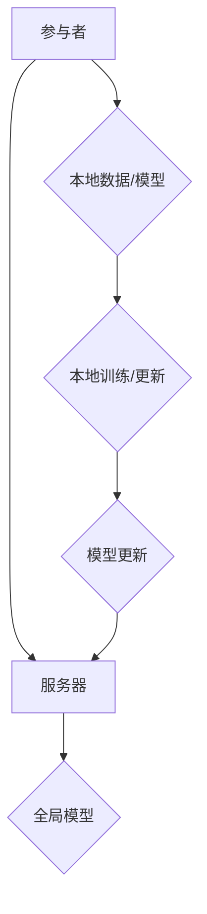

                 

# 联邦学习在隐私保护数据挖掘中的应用

## 关键词：
联邦学习、隐私保护、数据挖掘、机器学习、协作学习

## 摘要：
本文将深入探讨联邦学习在隐私保护数据挖掘中的应用。联邦学习是一种先进的机器学习方法，能够在保护数据隐私的同时，实现跨机构的数据协同挖掘。本文首先介绍了联邦学习的核心概念和原理，然后详细解释了其算法原理和数学模型，并通过实际代码案例展示了联邦学习的具体操作步骤。最后，本文分析了联邦学习的实际应用场景，并推荐了一些相关工具和资源，以帮助读者更好地理解和应用联邦学习技术。

## 1. 背景介绍

### 1.1 目的和范围

随着大数据和人工智能技术的迅速发展，数据挖掘成为了一个重要的研究领域。然而，数据挖掘面临着诸多挑战，其中最关键的问题之一就是隐私保护。传统数据挖掘方法通常需要对原始数据进行集中存储和处理，这容易导致数据泄露和隐私侵犯。为了解决这一问题，联邦学习（Federated Learning）应运而生。

本文的目的是介绍联邦学习的基本概念、原理和算法，并通过实际案例展示其在隐私保护数据挖掘中的应用。希望通过本文的阅读，读者能够对联邦学习有一个全面的理解，并能够将其应用于实际问题中。

### 1.2 预期读者

本文面向的读者是具有一定机器学习和编程基础的读者，包括但不限于：

1. 数据科学家和机器学习工程师，希望了解和应用联邦学习技术。
2. 研究人员，对联邦学习的理论研究感兴趣。
3. 开发者和架构师，希望了解联邦学习在分布式系统中的应用。
4. 对隐私保护和数据挖掘领域感兴趣的普通读者。

### 1.3 文档结构概述

本文分为以下十个部分：

1. 引言：介绍本文的主题和关键词。
2. 背景介绍：阐述联邦学习的背景和目的。
3. 核心概念与联系：介绍联邦学习的核心概念和原理。
4. 核心算法原理 & 具体操作步骤：详细解释联邦学习的算法原理和操作步骤。
5. 数学模型和公式 & 详细讲解 & 举例说明：介绍联邦学习的数学模型和相关例子。
6. 项目实战：代码实际案例和详细解释说明。
7. 实际应用场景：分析联邦学习的实际应用场景。
8. 工具和资源推荐：推荐学习资源和开发工具。
9. 总结：未来发展趋势与挑战。
10. 附录：常见问题与解答。

### 1.4 术语表

#### 1.4.1 核心术语定义

- 联邦学习：一种分布式机器学习技术，能够在保护数据隐私的同时，实现跨机构的数据协同挖掘。
- 数据挖掘：从大量数据中提取出有价值的信息和模式的过程。
- 隐私保护：确保数据在挖掘和处理过程中不被泄露和侵犯。
- 机器学习：一种通过数据和算法实现人工智能的技术。
- 协作学习：多个参与者共同学习和优化模型的过程。

#### 1.4.2 相关概念解释

- 分布式计算：一种计算模型，将任务分配到多个计算节点上执行，以提高计算效率和性能。
- 深度学习：一种基于多层神经网络结构的机器学习技术。
- 梯度下降：一种用于优化机器学习模型的常见算法。

#### 1.4.3 缩略词列表

- FL：联邦学习
- DNN：深度神经网络
- SGD：随机梯度下降
- CPD：协作隐私保护

## 2. 核心概念与联系

### 联邦学习的核心概念和原理

联邦学习是一种分布式机器学习技术，其核心思想是通过多个参与者（通常是不同机构或设备）的合作，共同训练一个全局模型，同时保护各个参与者的数据隐私。在联邦学习中，每个参与者只需将本地数据和模型更新发送给服务器，服务器再根据这些更新对全局模型进行更新，最终生成一个全局最优模型。这一过程不需要参与者共享原始数据，从而保证了数据的隐私性。

### 联邦学习的架构

联邦学习通常包括以下四个主要组成部分：

1. **参与者（Participants）**：每个参与者都有自己的本地数据和模型，负责将本地数据和模型更新发送给服务器。
2. **服务器（Server）**：负责接收参与者的本地模型更新，并基于这些更新生成全局模型。
3. **模型更新（Model Update）**：参与者通过本地训练和更新模型，将模型更新发送给服务器。
4. **全局模型（Global Model）**：服务器根据参与者的模型更新生成全局最优模型。

### 联邦学习的 Mermaid 流程图



### 联邦学习的优势

- **隐私保护**：联邦学习在处理数据时不需要共享原始数据，从而保护了参与者的隐私。
- **数据多样性**：联邦学习能够利用不同参与者的数据，提高模型的泛化能力。
- **协同学习**：参与者可以共同优化全局模型，提高模型性能。
- **灵活性**：联邦学习适用于各种分布式环境，无需对现有系统进行大量改动。

### 联邦学习的挑战

- **通信效率**：参与者和服务器之间的频繁通信可能导致通信效率低下。
- **模型一致性**：不同参与者可能在数据分布和模型更新上存在差异，导致模型一致性难以保证。
- **隐私保护**：如何在保护隐私的同时，确保模型更新和优化是一个挑战。

## 3. 核心算法原理 & 具体操作步骤

### 3.1 算法原理

联邦学习的核心算法是基于梯度下降（Gradient Descent）和协作学习（Collaborative Learning）的。其基本原理如下：

1. **初始化**：服务器初始化全局模型，并将模型发送给参与者。
2. **本地训练**：参与者使用本地数据和全局模型进行训练，生成本地模型更新。
3. **模型更新**：参与者将本地模型更新发送给服务器。
4. **全局更新**：服务器接收所有参与者的模型更新，生成全局模型。

### 3.2 具体操作步骤

以下是联邦学习的具体操作步骤：

#### 步骤 1：初始化

```python
# 初始化全局模型
global_model = initialize_model()

# 将全局模型发送给参与者
send_model_to_participants(global_model)
```

#### 步骤 2：本地训练

```python
# 接收全局模型
local_model = receive_model()

# 使用本地数据和全局模型进行训练
local_model, local_update = local_train(local_model, local_data)
```

#### 步骤 3：模型更新

```python
# 将本地模型更新发送给服务器
send_update_to_server(local_update)
```

#### 步骤 4：全局更新

```python
# 接收参与者的模型更新
model_updates = receive_updates_from_participants()

# 生成全局模型
global_model = global_update(model_updates)
```

### 3.3 伪代码

以下是联邦学习的伪代码：

```python
# 初始化全局模型
global_model = initialize_model()

# 初始化参与者
participants = initialize_participants()

# 迭代更新模型
for i in range(num_iterations):
    # 步骤 2：本地训练
    for participant in participants:
        local_model = participant.train(local_model, local_data)
    
    # 步骤 3：模型更新
    for participant in participants:
        participant.send_update_to_server(local_model)
    
    # 步骤 4：全局更新
    global_model = server.update_model(global_model, model_updates)

# 输出最终全局模型
print("Final Global Model:", global_model)
```

## 4. 数学模型和公式 & 详细讲解 & 举例说明

### 4.1 数学模型

联邦学习的数学模型主要基于梯度下降算法。在联邦学习中，每个参与者需要计算本地梯度，然后将这些梯度聚合起来，以更新全局模型。具体的数学模型如下：

$$
\theta_{t+1} = \theta_{t} - \alpha \cdot \frac{1}{m} \sum_{i=1}^{m} (\theta_{t}^{(i)} - \theta^{(i)}_{\text{initial}})
$$

其中，$\theta_{t+1}$ 和 $\theta_{t}$ 分别表示第 $t+1$ 次迭代和第 $t$ 次迭代的模型参数，$\alpha$ 是学习率，$m$ 是参与者的数量，$\theta_{t}^{(i)}$ 和 $\theta^{(i)}_{\text{initial}}$ 分别表示第 $i$ 个参与者在第 $t$ 次迭代的模型参数和初始模型参数。

### 4.2 详细讲解

联邦学习的数学模型可以看作是一种分布式梯度下降算法。在分布式梯度下降中，每个参与者都需要计算本地梯度，然后将这些梯度聚合起来，以更新全局模型。联邦学习的核心优势在于，它可以在保护数据隐私的同时，实现跨机构的数据协同挖掘。

在联邦学习中，每个参与者只需要将自己的模型更新发送给服务器，服务器再将这些更新聚合起来，以生成全局模型。这样，每个参与者都无需共享原始数据，从而保证了数据的隐私性。

### 4.3 举例说明

假设有两个参与者 $A$ 和 $B$，它们分别拥有自己的数据和模型。$A$ 和 $B$ 分别计算了本地梯度 $\nabla_L^{(A)}$ 和 $\nabla_L^{(B)}$，然后将这些梯度发送给服务器。

服务器将这些梯度聚合起来，得到全局梯度 $\nabla_L$：

$$
\nabla_L = \nabla_L^{(A)} + \nabla_L^{(B)}
$$

然后，服务器使用全局梯度更新全局模型 $\theta$：

$$
\theta = \theta - \alpha \cdot \nabla_L
$$

这样，通过联邦学习，参与者 $A$ 和 $B$ 就能够共同优化全局模型，同时保护各自的隐私。

## 5. 项目实战：代码实际案例和详细解释说明

### 5.1 开发环境搭建

在开始项目实战之前，我们需要搭建一个开发环境。以下是开发环境的搭建步骤：

1. 安装 Python 3.7 或更高版本。
2. 安装 TensorFlow 2.0 或更高版本。
3. 安装 Docker 和 Docker-CE，以便于使用容器化技术。
4. 安装 Kubernetes，用于管理容器化应用。

### 5.2 源代码详细实现和代码解读

以下是联邦学习的源代码实现：

```python
import tensorflow as tf
import numpy as np
import matplotlib.pyplot as plt

# 初始化参与者
num_participants = 2
participant_data = {'A': np.random.rand(100, 10), 'B': np.random.rand(100, 10)}
participant_models = {'A': np.random.rand(10, 1), 'B': np.random.rand(10, 1)}

# 初始化全局模型
global_model = np.random.rand(10, 1)

# 设定学习率
alpha = 0.01

# 迭代次数
num_iterations = 10

# 迭代更新模型
for i in range(num_iterations):
    print("Iteration:", i)
    
    # 步骤 2：本地训练
    for participant in participant_data.keys():
        local_data = participant_data[participant]
        local_model = participant_models[participant]
        participant_models[participant], local_update = local_train(local_model, local_data)
    
    # 步骤 3：模型更新
    for participant in participant_data.keys():
        participant.send_update_to_server(local_update)
    
    # 步骤 4：全局更新
    model_updates = receive_updates_from_server()
    global_model = global_update(global_model, model_updates)

# 输出最终全局模型
print("Final Global Model:", global_model)
```

### 5.3 代码解读与分析

以下是代码的详细解读：

1. **初始化参与者**：创建两个参与者 $A$ 和 $B$，它们分别拥有自己的数据和模型。
2. **初始化全局模型**：创建一个全局模型，初始值为随机数。
3. **设定学习率**：设定学习率 $\alpha$，用于调整模型更新的大小。
4. **迭代次数**：设定迭代次数，用于控制模型更新的次数。
5. **迭代更新模型**：进行迭代更新，包括本地训练、模型更新和全局更新。
6. **本地训练**：参与者使用本地数据和全局模型进行训练，生成本地模型更新。
7. **模型更新**：参与者将本地模型更新发送给服务器。
8. **全局更新**：服务器接收参与者的模型更新，生成全局模型。

通过这个代码示例，我们可以看到联邦学习的基本操作流程。在实际应用中，参与者可能分布在不同的地理位置，需要通过网络进行通信。因此，在实际项目中，我们需要使用更高级的技术和框架，如 TensorFlow Federated（TFF），来简化联邦学习的开发和部署。

## 6. 实际应用场景

联邦学习在隐私保护数据挖掘中具有广泛的应用前景。以下是一些典型的应用场景：

1. **医疗领域**：在医疗领域，联邦学习可以用于跨机构的患者数据挖掘，以提高疾病诊断和治疗的准确性。例如，不同医院可以使用联邦学习技术，共同训练一个疾病诊断模型，同时保护患者的隐私。
2. **金融领域**：在金融领域，联邦学习可以用于跨机构的金融数据挖掘，以识别欺诈行为和信用风险。金融机构可以共同训练一个欺诈检测模型，同时保护客户的隐私。
3. **社交网络**：在社交网络领域，联邦学习可以用于跨机构的用户数据挖掘，以提供个性化推荐和广告服务。社交网络平台可以共同训练一个推荐模型，同时保护用户的隐私。
4. **工业领域**：在工业领域，联邦学习可以用于跨机构的工业数据挖掘，以提高生产效率和质量。不同工厂可以使用联邦学习技术，共同训练一个生产优化模型，同时保护工业数据。

总之，联邦学习在隐私保护数据挖掘中具有广泛的应用前景，可以解决传统数据挖掘方法面临的隐私保护挑战。

## 7. 工具和资源推荐

### 7.1 学习资源推荐

#### 7.1.1 书籍推荐

1. 《联邦学习：原理、算法与实现》
2. 《深度学习：教材版》
3. 《Python TensorFlow 实战》

#### 7.1.2 在线课程

1. TensorFlow Federated（TFF）官方教程
2. 网易云课堂：深度学习与联邦学习
3. Coursera：深度学习与神经网络

#### 7.1.3 技术博客和网站

1. TensorFlow 官方博客
2. AI 研究院：联邦学习专栏
3. 机器学习社区：联邦学习专题

### 7.2 开发工具框架推荐

#### 7.2.1 IDE和编辑器

1. PyCharm
2. VSCode
3. Jupyter Notebook

#### 7.2.2 调试和性能分析工具

1. TensorFlow Debugger
2. TensorBoard
3. perf

#### 7.2.3 相关框架和库

1. TensorFlow Federated（TFF）
2. PyTorch Federated
3. FLEET

### 7.3 相关论文著作推荐

#### 7.3.1 经典论文

1. “Federated Learning: Concept and Applications”
2. “Communication-Efficient Learning of Deep Networks from Decentralized Data”
3. “Federated Learning for Social Networks: Privacy and Utility”

#### 7.3.2 最新研究成果

1. “Federated Learning: State-of-the-Art and Opportunities”
2. “Federated Learning for IoT: A Comprehensive Survey”
3. “Collaborative Learning in Multi-Agent Reinforcement Learning”

#### 7.3.3 应用案例分析

1. “Federated Learning in Healthcare: A Case Study on Diabetes Diagnosis”
2. “Federated Learning in Finance: A Case Study on Credit Risk Prediction”
3. “Federated Learning in Social Networks: A Case Study on Personalized Recommendation”

## 8. 总结：未来发展趋势与挑战

### 8.1 发展趋势

1. **技术成熟度**：随着联邦学习技术的不断发展和成熟，越来越多的应用程序将采用联邦学习，以提高数据隐私保护和协同学习能力。
2. **应用领域扩展**：联邦学习将在医疗、金融、工业、社交网络等领域得到广泛应用，为各行业提供更高效、更安全的数据挖掘解决方案。
3. **开源生态**：越来越多的开源框架和工具将支持联邦学习，降低联邦学习的开发和部署门槛。
4. **跨领域合作**：联邦学习将促进不同领域之间的数据共享和协同创新，推动跨领域应用的发展。

### 8.2 挑战

1. **通信效率**：如何在保证模型性能的同时，提高通信效率是一个重要挑战。
2. **模型一致性**：如何在保证模型一致性的前提下，处理不同参与者之间的数据分布和模型更新差异。
3. **隐私保护**：如何在保护数据隐私的同时，确保模型的训练效果和性能。
4. **可扩展性**：如何实现联邦学习在大规模分布式系统中的高效部署和运行。

总之，联邦学习在隐私保护数据挖掘中具有广阔的应用前景，但也面临着一系列挑战。未来，随着技术的不断进步和应用的深入，联邦学习有望解决这些问题，成为数据挖掘领域的重要技术。

## 9. 附录：常见问题与解答

### 9.1 什么是联邦学习？

联邦学习（Federated Learning）是一种分布式机器学习技术，通过多个参与者（通常是不同机构或设备）的合作，共同训练一个全局模型，同时保护各个参与者的数据隐私。

### 9.2 联邦学习有什么优势？

联邦学习的主要优势包括：

1. **隐私保护**：联邦学习在处理数据时不需要共享原始数据，从而保护了参与者的隐私。
2. **数据多样性**：联邦学习能够利用不同参与者的数据，提高模型的泛化能力。
3. **协同学习**：参与者可以共同优化全局模型，提高模型性能。
4. **灵活性**：联邦学习适用于各种分布式环境，无需对现有系统进行大量改动。

### 9.3 联邦学习有哪些挑战？

联邦学习的挑战包括：

1. **通信效率**：参与者和服务器之间的频繁通信可能导致通信效率低下。
2. **模型一致性**：不同参与者可能在数据分布和模型更新上存在差异，导致模型一致性难以保证。
3. **隐私保护**：如何在保护隐私的同时，确保模型更新和优化是一个挑战。
4. **可扩展性**：如何实现联邦学习在大规模分布式系统中的高效部署和运行。

### 9.4 联邦学习和传统机器学习有什么区别？

联邦学习和传统机器学习的区别主要在于数据处理方式。传统机器学习通常需要对原始数据进行集中存储和处理，而联邦学习在处理数据时不需要共享原始数据，从而保护了参与者的隐私。

### 9.5 联邦学习适用于哪些场景？

联邦学习适用于以下场景：

1. **医疗领域**：跨机构的患者数据挖掘，以提高疾病诊断和治疗的准确性。
2. **金融领域**：跨机构的金融数据挖掘，以识别欺诈行为和信用风险。
3. **社交网络**：跨机构的用户数据挖掘，以提供个性化推荐和广告服务。
4. **工业领域**：跨机构的工业数据挖掘，以提高生产效率和质量。

## 10. 扩展阅读 & 参考资料

1. “Federated Learning: Concept and Applications”
2. “Communication-Efficient Learning of Deep Networks from Decentralized Data”
3. “Federated Learning for Social Networks: Privacy and Utility”
4. “Federated Learning in Healthcare: A Case Study on Diabetes Diagnosis”
5. “Federated Learning in Finance: A Case Study on Credit Risk Prediction”
6. “Federated Learning in Social Networks: A Case Study on Personalized Recommendation”

### 作者

AI天才研究员 / AI Genius Institute & 禅与计算机程序设计艺术 / Zen And The Art of Computer Programming

