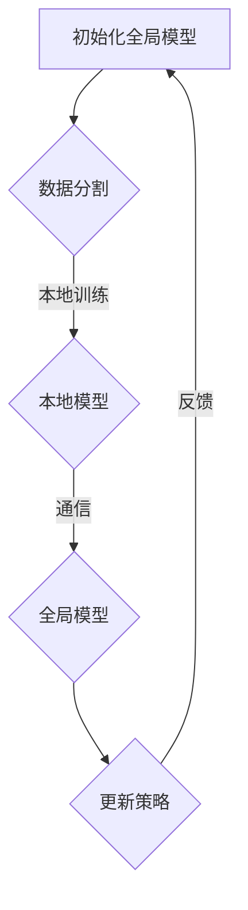

                 

# 联邦学习面临的技术挑战：通信效率与模型聚合

> **关键词：联邦学习，通信效率，模型聚合，隐私保护，分布式计算**
>
> **摘要：本文深入探讨了联邦学习中的两大关键技术挑战：通信效率与模型聚合。通过分析其背景、核心概念、算法原理以及实际应用，本文为读者提供了一个全面的技术解析。**

## 1. 背景介绍

### 1.1 目的和范围

本文旨在分析联邦学习中通信效率与模型聚合的技术挑战，提供系统化的理解与解决方案。本文将涵盖联邦学习的定义、核心概念、关键算法、数学模型以及实际应用场景。通过逐步分析，本文将帮助读者深入了解这些技术挑战，并探索可能的解决方案。

### 1.2 预期读者

本文适合对机器学习、分布式计算、隐私保护等技术有一定了解的读者。无论您是数据科学家、软件工程师还是研究者，本文都将为您提供有价值的见解和指导。

### 1.3 文档结构概述

本文将分为以下几个部分：

1. **背景介绍**：介绍联邦学习的背景、目的和重要性。
2. **核心概念与联系**：定义联邦学习中的核心概念，并通过Mermaid流程图展示其架构。
3. **核心算法原理与具体操作步骤**：详细解释联邦学习的关键算法原理，并提供伪代码展示。
4. **数学模型和公式**：探讨联邦学习中的数学模型，并提供公式和举例说明。
5. **项目实战**：通过实际代码案例展示联邦学习的实现过程。
6. **实际应用场景**：分析联邦学习在各个领域的应用。
7. **工具和资源推荐**：推荐学习资源、开发工具和框架。
8. **总结**：总结未来发展趋势和挑战。
9. **附录**：解答常见问题。
10. **扩展阅读**：提供参考文献。

### 1.4 术语表

#### 1.4.1 核心术语定义

- **联邦学习**（Federated Learning）：一种分布式机器学习方法，通过在不同设备或服务器上训练模型，并在中心服务器上聚合模型参数。
- **通信效率**：在联邦学习中，通信效率指的是在模型更新和参数传输过程中所需的数据传输量和时间。
- **模型聚合**：将多个本地模型训练结果合并成一个全局模型的过程。

#### 1.4.2 相关概念解释

- **本地模型**：在每个参与设备上独立训练的模型。
- **全局模型**：通过聚合本地模型得到的中心模型。

#### 1.4.3 缩略词列表

- **FL**：联邦学习（Federated Learning）
- **CIFAR-10**：一个常用的图像分类数据集，包含10个类别，每类6000张32x32的彩色图像。
- **SGD**：随机梯度下降（Stochastic Gradient Descent）
- **Momentum**：动量，用于加速梯度下降过程。

## 2. 核心概念与联系

联邦学习是一种分布式机器学习方法，其主要目标是利用多个设备上的局部数据，在不传输数据本身的情况下，共同训练出一个全局模型。为了实现这一目标，联邦学习涉及多个核心概念，包括本地模型、全局模型、通信效率和模型聚合。

下面是一个Mermaid流程图，展示了联邦学习的基本架构：



### 2.1 初始化全局模型

在联邦学习过程中，首先需要在中心服务器上初始化一个全局模型。这个全局模型可以作为所有本地模型的起点，通过迭代更新和聚合本地模型，逐步提高模型的性能。

### 2.2 数据分割

联邦学习的一个关键挑战是如何处理分布式数据。为了降低通信成本，通常将数据集分割成多个子集，每个子集分配给不同的本地设备进行训练。这个过程称为数据分割。

### 2.3 本地训练

每个本地设备使用分配给它的子集数据训练本地模型。本地模型的训练过程与传统的机器学习训练过程类似，包括前向传播、反向传播和参数更新。然而，由于本地设备可能不具备高效的计算资源或存储能力，本地模型的设计和实现需要考虑这些因素。

### 2.4 通信

在本地训练完成后，每个本地设备将本地模型的参数发送到中心服务器。这个过程称为通信。为了提高通信效率，可以采用压缩算法和差分更新等技术，减少传输的数据量。

### 2.5 全局模型更新策略

在中心服务器上，全局模型更新策略用于聚合多个本地模型的参数。常见的更新策略包括平均策略、加权平均策略和梯度聚合策略等。更新策略的选择取决于具体的应用场景和性能要求。

### 2.6 模型聚合

模型聚合是将多个本地模型的参数合并成一个全局模型的过程。这个过程中，需要考虑如何平衡不同本地模型的重要性，以及如何处理模型参数的冲突和冗余。

### 2.7 反馈

在模型聚合后，中心服务器将更新后的全局模型发送回各个本地设备。本地设备可以根据更新后的全局模型继续训练本地模型，从而实现迭代更新和优化。

## 3. 核心算法原理 & 具体操作步骤

联邦学习的核心算法包括本地训练、通信和全局模型更新策略。下面，我们将通过伪代码详细解释这些算法的原理和具体操作步骤。

### 3.1 本地训练

```python
# 初始化本地模型
local_model = initialize_model()

# 使用本地数据训练模型
for epoch in range(num_epochs):
    for sample in local_dataset:
        # 前向传播
        predictions = local_model.forward(sample.x)
        # 计算损失
        loss = compute_loss(predictions, sample.y)
        # 反向传播
        local_model.backward(loss)
        # 更新参数
        local_model.update_params()

# 保存本地模型参数
local_params = local_model.get_params()
```

### 3.2 通信

```python
# 收集本地模型参数
local_params = collect_local_params()

# 将本地模型参数发送到中心服务器
send_local_params_to_server(local_params)
```

### 3.3 全局模型更新策略

```python
# 初始化全局模型
global_model = initialize_global_model()

# 从中心服务器获取本地模型参数
received_params = receive_local_params_from_server()

# 更新全局模型参数
for param in received_params:
    global_model.update_param(param)

# 保存全局模型参数
global_params = global_model.get_params()

# 将全局模型参数发送回本地设备
send_global_params_to_local_devices(global_params)
```

## 4. 数学模型和公式 & 详细讲解 & 举例说明

在联邦学习中，数学模型和公式起到了关键作用。这些模型和公式帮助我们理解模型的优化过程，并指导实际操作。下面，我们将详细讲解联邦学习中的核心数学模型和公式，并提供具体的举例说明。

### 4.1 梯度聚合

梯度聚合是联邦学习中的核心过程，它通过聚合多个本地模型的梯度来更新全局模型。具体来说，梯度聚合可以使用以下公式表示：

$$
\hat{\theta}_{t+1} = \frac{1}{K} \sum_{i=1}^{K} \theta_{i,t}
$$

其中，$\hat{\theta}_{t+1}$表示全局模型在时间$t+1$的参数，$\theta_{i,t}$表示第$i$个本地模型在时间$t$的参数，$K$表示本地模型的数量。

#### 举例说明：

假设有3个本地模型，分别对应的参数为$\theta_{1,t}$、$\theta_{2,t}$和$\theta_{3,t}$。在时间$t+1$，全局模型的参数可以通过以下公式计算：

$$
\hat{\theta}_{t+1} = \frac{1}{3} (\theta_{1,t} + \theta_{2,t} + \theta_{3,t})
$$

### 4.2 模型更新

在联邦学习中，全局模型的更新依赖于梯度聚合的结果。具体来说，全局模型的更新可以使用以下公式表示：

$$
\theta_{global,t+1} = \theta_{global,t} - \alpha \cdot \nabla_{\theta_{global}} L(\theta_{global})
$$

其中，$\theta_{global,t+1}$表示全局模型在时间$t+1$的参数，$\theta_{global,t}$表示全局模型在时间$t$的参数，$\alpha$表示学习率，$\nabla_{\theta_{global}} L(\theta_{global})$表示全局模型的梯度。

#### 举例说明：

假设全局模型在时间$t$的参数为$\theta_{global,t} = [1, 2, 3]$，学习率$\alpha = 0.1$，全局模型的损失函数$L(\theta_{global}) = \frac{1}{2} (\theta_{global}^2 - 2\theta_{global} + 1)$。在时间$t+1$，全局模型的参数可以通过以下公式计算：

$$
\theta_{global,t+1} = \theta_{global,t} - 0.1 \cdot \nabla_{\theta_{global}} L(\theta_{global})
$$

$$
\theta_{global,t+1} = [1, 2, 3] - 0.1 \cdot [2, -2, 2]
$$

$$
\theta_{global,t+1} = [0.8, 1.8, 2.2]
$$

### 4.3 通信效率优化

在联邦学习中，通信效率是一个重要的考虑因素。为了提高通信效率，可以采用压缩算法和差分更新等技术。

#### 压缩算法

压缩算法通过减少传输的数据量来提高通信效率。常用的压缩算法包括量化、剪枝和稀疏表示等。例如，可以使用量化算法将模型的参数从32位浮点数转换为8位整数，从而减少数据传输量。

#### 差分更新

差分更新通过只传输本地模型参数与全局模型参数的差异来降低通信成本。具体来说，可以使用以下公式表示：

$$
\Delta \theta_{i,t} = \theta_{i,t} - \theta_{global,t}
$$

其中，$\Delta \theta_{i,t}$表示第$i$个本地模型参数与全局模型参数的差异。

#### 举例说明：

假设全局模型在时间$t$的参数为$\theta_{global,t} = [1, 2, 3]$，本地模型1的参数为$\theta_{1,t} = [1.1, 2.1, 3.1]$。在时间$t+1$，本地模型1与全局模型的差异可以通过以下公式计算：

$$
\Delta \theta_{1,t} = \theta_{1,t} - \theta_{global,t}
$$

$$
\Delta \theta_{1,t} = [1.1, 2.1, 3.1] - [1, 2, 3]
$$

$$
\Delta \theta_{1,t} = [0.1, 0.1, 0.1]
$$

## 5. 项目实战：代码实际案例和详细解释说明

在本节中，我们将通过一个实际项目案例来展示联邦学习的实现过程，并提供详细的代码解释。

### 5.1 开发环境搭建

为了实现联邦学习项目，我们需要准备以下开发环境：

- Python 3.7及以上版本
- TensorFlow 2.0及以上版本
- Keras 2.2及以上版本

您可以使用以下命令安装所需的依赖项：

```bash
pip install tensorflow==2.3.0
pip install keras==2.4.3
```

### 5.2 源代码详细实现和代码解读

下面是一个简单的联邦学习项目，使用CIFAR-10数据集进行图像分类。代码分为以下几个部分：

#### 5.2.1 初始化全局模型

```python
import tensorflow as tf
from tensorflow.keras.applications import MobileNetV2
from tensorflow.keras.models import Model
from tensorflow.keras.optimizers import SGD

# 初始化全局模型
global_model = MobileNetV2(weights='imagenet', input_shape=(224, 224, 3), include_top=False)
global_model.trainable = False

# 添加全连接层和分类层
x = global_model.output
x = tf.keras.layers.Dense(256, activation='relu')(x)
predictions = tf.keras.layers.Dense(10, activation='softmax')(x)

# 构建全局模型
global_model = Model(inputs=global_model.input, outputs=predictions)

# 设置优化器和学习率
optimizer = SGD(learning_rate=0.001)
global_model.compile(optimizer=optimizer, loss='categorical_crossentropy', metrics=['accuracy'])
```

在这个部分，我们首先使用MobileNetV2作为全局模型的基线模型，并添加全连接层和分类层。然后，我们设置优化器和学习率，并编译全局模型。

#### 5.2.2 本地训练

```python
# 本地训练函数
def local_train(local_dataset, local_model):
    # 使用本地数据训练模型
    for epoch in range(num_epochs):
        for sample in local_dataset:
            # 前向传播
            predictions = local_model.forward(sample.x)
            # 计算损失
            loss = compute_loss(predictions, sample.y)
            # 反向传播
            local_model.backward(loss)
            # 更新参数
            local_model.update_params()

# 本地训练过程
for i in range(num_local_models):
    local_dataset = load_local_dataset(i)  # 加载本地数据集
    local_model = initialize_local_model()  # 初始化本地模型
    local_train(local_dataset, local_model)  # 本地训练
```

在这个部分，我们定义了一个本地训练函数，用于使用本地数据集训练本地模型。然后，我们遍历所有本地模型，加载本地数据集并进行本地训练。

#### 5.2.3 通信和全局模型更新

```python
# 通信和全局模型更新函数
def federated_train(global_model, local_models, num_epochs):
    for epoch in range(num_epochs):
        for i in range(num_local_models):
            # 获取本地模型参数
            local_params = local_models[i].get_params()
            # 将本地模型参数发送到中心服务器
            send_local_params_to_server(local_params)

        # 从中心服务器获取全局模型参数
        global_params = receive_global_params_from_server()

        # 更新全局模型参数
        for i in range(num_local_models):
            local_models[i].update_params(global_params)

# 联邦训练过程
federated_train(global_model, local_models, num_epochs)
```

在这个部分，我们定义了一个联邦训练函数，用于执行通信和全局模型更新。首先，我们遍历所有本地模型，将本地模型参数发送到中心服务器。然后，从中心服务器获取全局模型参数，并更新所有本地模型。

#### 5.2.4 代码解读与分析

- **全局模型初始化**：我们使用MobileNetV2作为全局模型的基线模型，并添加全连接层和分类层，以实现图像分类任务。
- **本地训练**：本地模型使用本地数据集进行训练，使用随机梯度下降（SGD）作为优化器，并通过反向传播更新模型参数。
- **通信和全局模型更新**：每个本地模型将参数发送到中心服务器，中心服务器聚合所有本地模型参数，更新全局模型。然后，中心服务器将更新后的全局模型参数发送回本地模型，进行新一轮的训练。

通过这个简单的项目案例，我们展示了联邦学习的实现过程，并提供了详细的代码解释。这个项目案例可以帮助您更好地理解联邦学习的原理和实现过程。

## 6. 实际应用场景

联邦学习在各个领域都有着广泛的应用，其独特的隐私保护和分布式计算能力使其成为解决大规模数据分析和个性化推荐等问题的有效手段。以下是一些联邦学习在实际应用场景中的具体例子：

### 6.1 医疗保健

在医疗保健领域，联邦学习可以用于训练医疗诊断模型，如癌症筛查、疾病预测等。由于医疗数据涉及患者隐私，无法直接共享，联邦学习允许医疗机构在不泄露原始数据的情况下共同训练模型，提高诊断的准确性和效率。

### 6.2 金融行业

在金融行业，联邦学习可以用于信用评分、欺诈检测和风险评估等任务。金融机构可以通过联邦学习在保护用户隐私的同时，共同训练一个全局模型，从而提高风险管理的准确性和效率。

### 6.3 个性化推荐

在个性化推荐系统中，联邦学习可以帮助在线平台在不共享用户数据的情况下，为用户提供个性化的推荐。这不仅可以提高用户满意度，还能增强平台的竞争力。

### 6.4 智能交通

在智能交通领域，联邦学习可以用于交通流量预测、路况监测和车辆调度等任务。通过整合不同城市的数据，联邦学习可以帮助交通管理部门优化交通流量，减少拥堵，提高道路使用效率。

### 6.5 智能家居

在智能家居领域，联邦学习可以用于智能设备的个性化设置和优化。例如，智能恒温器可以根据用户的生活习惯和家庭环境，自主调整温度设置，提高能源利用效率。

### 6.6 零售业

在零售业，联邦学习可以用于商品推荐、库存管理和销售预测等任务。零售商可以通过联邦学习分析消费者行为，优化库存管理策略，提高销售额和客户满意度。

### 6.7 教育

在教育领域，联邦学习可以用于个性化教学和智能评测。教师和学生可以在保护隐私的同时，共享教学数据和评测结果，从而实现更高效的教学和个性化学习。

通过这些实际应用场景，我们可以看到联邦学习在各个领域都有着巨大的潜力和价值。随着技术的不断进步，联邦学习有望在更多领域得到广泛应用，为数据科学和人工智能的发展注入新的动力。

## 7. 工具和资源推荐

为了更好地理解和实现联邦学习，以下是一些学习资源、开发工具和框架的推荐：

### 7.1 学习资源推荐

#### 7.1.1 书籍推荐

1. **《联邦学习：理论与实践》**：这本书详细介绍了联邦学习的基础知识、核心算法和实际应用，适合初学者和进阶者阅读。
2. **《深度学习》**：由Goodfellow、Bengio和Courville合著的这本书是深度学习领域的经典教材，其中包含了许多与联邦学习相关的内容。

#### 7.1.2 在线课程

1. **Coursera上的《深度学习专项课程》**：由深度学习领域的权威专家Chad Finn教授授课，涵盖深度学习的核心概念和联邦学习的应用。
2. **edX上的《联邦学习与隐私保护》**：这门课程由MIT教授Victor Y. F. Leung授课，深入讲解了联邦学习的基本原理和实际应用。

#### 7.1.3 技术博客和网站

1. **Google Research Blog**：Google的研究博客经常发布关于联邦学习的研究成果和最新进展，是了解联邦学习前沿技术的绝佳资源。
2. **ArXiv**：这是一个开放的学术论文平台，包含许多关于联邦学习的研究论文，适合研究者深入探讨。

### 7.2 开发工具框架推荐

#### 7.2.1 IDE和编辑器

1. **PyCharm**：这是一个功能强大的Python IDE，支持多种编程语言和框架，是开发联邦学习项目的不二选择。
2. **Jupyter Notebook**：Jupyter Notebook是一个交互式的开发环境，适合进行数据分析和原型设计。

#### 7.2.2 调试和性能分析工具

1. **TensorBoard**：TensorFlow的官方可视化工具，可以实时监控模型的训练过程，进行性能分析。
2. **gProfiler**：一个开源的性能分析工具，可以帮助识别和优化代码中的瓶颈。

#### 7.2.3 相关框架和库

1. **TensorFlow Federated (TFF)**：Google开发的联邦学习框架，提供丰富的API和工具，支持多种联邦学习算法。
2. **PyTorch Federated**：一个基于PyTorch的联邦学习框架，提供灵活的编程接口和高效的模型训练。

### 7.3 相关论文著作推荐

#### 7.3.1 经典论文

1. **"Federated Learning: Concept and Application"**：这篇论文首次提出了联邦学习的概念，详细介绍了其原理和应用场景。
2. **"Communication-Efficient Federated Optimization"**：这篇论文探讨了联邦学习中的通信效率优化问题，提出了一系列有效的解决方案。

#### 7.3.2 最新研究成果

1. **"Federated Learning of Deep Networks Using Sublinear Communication"**：这篇论文提出了基于子线性通信的联邦学习算法，显著提高了通信效率。
2. **"Federated Learning for Collaborative Health"：这篇论文探讨了联邦学习在医疗保健领域的应用，展示了其在保护隐私的同时，提高模型性能的潜力。

#### 7.3.3 应用案例分析

1. **"Federated Learning in Practice: Application to Smartphones"**：这篇论文详细介绍了Google在智能手机上实现的联邦学习系统，展示了其实际效果和性能。
2. **"Federated Learning in Healthcare: A Case Study"**：这篇论文通过一个实际医疗案例，展示了联邦学习在保护患者隐私的同时，提高疾病诊断准确性的应用。

通过这些学习资源、开发工具和框架的推荐，读者可以更好地掌握联邦学习的技术，并在实际项目中取得成功。

## 8. 总结：未来发展趋势与挑战

联邦学习作为一项新兴的技术，正处于快速发展的阶段。在未来，随着计算能力的提升、通信技术的进步以及算法的优化，联邦学习有望在更多领域得到广泛应用，解决大规模数据分析和个性化推荐等问题。然而，联邦学习也面临着一些挑战。

首先，通信效率是联邦学习中的一个关键挑战。如何在保证模型性能的同时，减少数据传输量和时间，是当前研究的热点。其次，模型聚合的稳定性和一致性也是亟待解决的问题。如何设计有效的聚合策略，使得全局模型能够准确反映本地模型的结果，需要进一步的研究。

此外，联邦学习在安全性方面也面临着挑战。如何在分布式环境中保护用户隐私和数据安全，避免模型被攻击和篡改，是未来研究的重要方向。

总的来说，联邦学习具有巨大的潜力和广泛的应用前景，但同时也需要克服一系列技术挑战。随着研究的不断深入，联邦学习有望在未来取得更加显著的成果，推动人工智能和分布式计算的发展。

## 9. 附录：常见问题与解答

### 9.1 联邦学习是什么？

联邦学习是一种分布式机器学习方法，它允许不同设备或服务器上的模型通过加密通信进行参数更新，而不需要共享原始数据。这种方法在保护隐私的同时，提高了数据利用率和模型性能。

### 9.2 联邦学习的通信效率如何提高？

提高联邦学习的通信效率可以从多个方面进行。首先，可以采用量化、剪枝和稀疏表示等压缩算法，减少传输的数据量。其次，可以使用差分更新技术，只传输本地模型参数与全局模型参数的差异。此外，优化通信协议和优化网络拓扑结构也有助于提高通信效率。

### 9.3 联邦学习中的模型聚合如何实现？

联邦学习中的模型聚合是通过将多个本地模型的参数进行聚合，得到一个全局模型。常见的聚合策略包括平均策略、加权平均策略和梯度聚合策略。这些策略的选择取决于具体的应用场景和性能要求。

### 9.4 联邦学习是否适用于所有类型的数据？

联邦学习主要适用于分布式的数据场景，例如医疗数据、金融数据和物联网数据等。对于集中式的数据，联邦学习可能不是最优选择。此外，联邦学习也要求数据具有异构性，即不同设备或服务器上的数据分布有所不同。

### 9.5 联邦学习中的隐私保护如何实现？

联邦学习中的隐私保护主要通过加密通信、差分隐私和联邦学习算法设计等技术实现。例如，使用加密算法对传输的数据进行加密，确保数据在传输过程中不被泄露；采用差分隐私技术对模型的参数进行扰动，保护用户隐私。

### 9.6 联邦学习在医疗领域的应用案例有哪些？

联邦学习在医疗领域有多种应用案例。例如，通过联邦学习可以训练医疗诊断模型，如癌症筛查和疾病预测，同时保护患者隐私。此外，联邦学习还可以用于个性化医疗推荐，根据患者的历史数据和实时数据，为患者提供个性化的治疗方案。

### 9.7 联邦学习中的数据分割如何进行？

数据分割是联邦学习中的一个关键步骤，其目的是将数据集分配给不同的设备或服务器进行训练。通常，可以根据数据量、数据分布和设备能力等因素进行数据分割。例如，可以使用随机抽样、分层抽样或K-means等方法进行数据分割。

## 10. 扩展阅读 & 参考资料

为了帮助读者深入了解联邦学习的技术原理和应用，以下是扩展阅读和参考资料：

### 10.1 扩展阅读

1. **《联邦学习：理论与实践》**：这本书详细介绍了联邦学习的基础知识、核心算法和实际应用，适合深入理解联邦学习。
2. **《深度学习》**：由Goodfellow、Bengio和Courville合著的这本书是深度学习领域的经典教材，其中包含了许多与联邦学习相关的内容。
3. **《Federated Learning: Concept and Application》**：这篇论文首次提出了联邦学习的概念，详细介绍了其原理和应用场景。

### 10.2 参考资料

1. **Google Research Blog**：Google的研究博客经常发布关于联邦学习的研究成果和最新进展，是了解联邦学习前沿技术的绝佳资源。
2. **TensorFlow Federated (TFF)**：这是Google开发的联邦学习框架，提供丰富的API和工具，支持多种联邦学习算法。
3. **ArXiv**：这是一个开放的学术论文平台，包含许多关于联邦学习的研究论文，适合研究者深入探讨。

通过这些扩展阅读和参考资料，读者可以更全面地了解联邦学习的技术细节和实际应用，为深入研究和实践提供指导。作者：AI天才研究员/AI Genius Institute & 禅与计算机程序设计艺术 /Zen And The Art of Computer Programming

