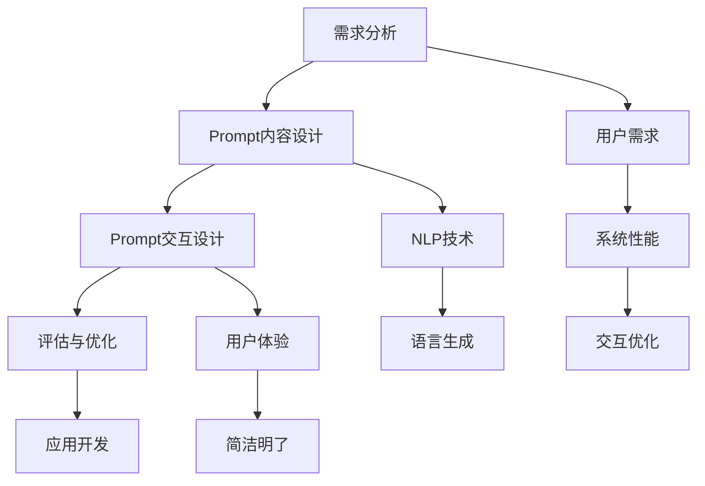

                 


# 聚焦应用自身的 Prompt 设计

> 关键词：Prompt 设计、自然语言处理、用户交互、应用开发、人工智能

> 摘要：本文将深入探讨应用自身Prompt设计的核心原理和实际应用。通过分析自然语言处理技术，我们揭示如何优化Prompt设计以提升用户体验和系统性能。文章旨在为开发者提供一套系统化的设计思路和实战指南。

## 1. 背景介绍

### 1.1 目的和范围

本文的目标是帮助开发者理解和掌握Prompt设计的核心原理，并为其在实际应用开发中提供一套实用的指导。本文将涵盖以下内容：

- Prompt设计的基本概念和重要性
- 自然语言处理技术对Prompt设计的影响
- Prompt设计的最佳实践和技巧
- 实际应用案例解析
- 开发工具和资源的推荐

通过本文的阅读，开发者将能够：

- 理解Prompt设计的核心原理和重要性
- 掌握优化Prompt设计的最佳实践
- 提升应用的用户体验和系统性能
- 获取实际应用案例的启示

### 1.2 预期读者

本文主要面向以下读者群体：

- 应用开发工程师
- 自然语言处理研究者
- 人工智能领域从业者
- 对Prompt设计感兴趣的技术爱好者

### 1.3 文档结构概述

本文的结构如下：

- 第1章：背景介绍，包括目的和范围、预期读者、文档结构概述等。
- 第2章：核心概念与联系，介绍Prompt设计的相关概念和流程。
- 第3章：核心算法原理 & 具体操作步骤，详细讲解Prompt设计的算法原理和操作步骤。
- 第4章：数学模型和公式 & 详细讲解 & 举例说明，介绍Prompt设计的数学模型和公式。
- 第5章：项目实战：代码实际案例和详细解释说明，通过实际案例展示Prompt设计的应用。
- 第6章：实际应用场景，分析Prompt设计在不同领域的应用。
- 第7章：工具和资源推荐，推荐学习资源和开发工具。
- 第8章：总结：未来发展趋势与挑战，探讨Prompt设计的未来发展趋势和面临的挑战。
- 第9章：附录：常见问题与解答，提供常见问题的解答。
- 第10章：扩展阅读 & 参考资料，提供进一步学习的资源。

### 1.4 术语表

#### 1.4.1 核心术语定义

- Prompt：指用于引导用户输入或系统响应的提示性语句。
- 自然语言处理（NLP）：指利用计算机技术和算法对自然语言进行处理和理解的技术。
- 用户交互：指用户与应用程序之间的交互过程。
- 应用开发：指开发人员根据需求设计和实现应用程序的过程。

#### 1.4.2 相关概念解释

- 用户体验（UX）：指用户在使用产品过程中的感受和体验。
- 系统性能：指系统在执行任务时的速度、稳定性和资源利用率。

#### 1.4.3 缩略词列表

- NLP：自然语言处理
- UX：用户体验
- IDE：集成开发环境
- ML：机器学习
- AI：人工智能

## 2. 核心概念与联系

Prompt设计是应用开发中至关重要的一环，它直接影响用户交互质量和系统性能。为了更好地理解Prompt设计，我们需要先了解几个核心概念和它们之间的关系。

### 2.1 Prompt设计的基本概念

#### Prompt的定义

Prompt是一个引导用户输入或系统响应的提示性语句。它可以是文字、图像或声音等形式，目的是为了引导用户进行操作或提供必要的上下文信息。

#### Prompt的功能

- 引导用户输入：Prompt可以帮助用户理解需要输入什么内容，从而提高输入的正确性和效率。
- 优化用户体验：良好的Prompt设计可以提高用户的理解和操作体验，减少困惑和操作错误。
- 提升系统性能：合理的Prompt设计可以降低用户的认知负担，提高系统响应速度和处理效率。

### 2.2 自然语言处理技术对Prompt设计的影响

自然语言处理（NLP）技术在Prompt设计中起着关键作用。NLP技术可以帮助开发者理解和处理人类语言，从而提高Prompt的准确性和适应性。

#### NLP技术在Prompt设计中的应用

- 语境理解：NLP技术可以帮助系统理解用户的语境和意图，从而生成更准确的Prompt。
- 语言生成：NLP技术可以自动生成自然的语言提示，提高Prompt的流畅性和可读性。
- 语音识别与合成：NLP技术可以帮助实现语音输入和输出，提高用户交互的便利性。

### 2.3 用户交互与Prompt设计的关系

用户交互是应用开发的重要组成部分，而Prompt设计直接影响用户交互的质量。良好的Prompt设计可以提升用户体验，降低用户的学习成本，从而提高应用的吸引力。

#### 用户交互与Prompt设计的优化策略

- 简洁明了：Prompt应尽量简洁明了，避免冗长和复杂。
- 个性化定制：根据用户的需求和行为习惯，定制个性化的Prompt。
- 可视化设计：结合视觉元素，提高Prompt的吸引力和可读性。

### 2.4 应用开发与Prompt设计的关系

应用开发是一个复杂的过程，而Prompt设计在其中起到了承上启下的作用。合理的设计Prompt可以帮助开发者更好地理解和满足用户需求，从而提高应用的成功率。

#### 应用开发与Prompt设计的整合策略

- 用户需求分析：在应用开发初期，进行充分的需求分析，明确用户需求和痛点。
- 提前设计Prompt：在应用开发过程中，提前设计Prompt，确保与用户需求相匹配。
- 持续优化：根据用户反馈和实际使用情况，持续优化Prompt设计，提升用户体验。

### 2.5 Prompt设计流程

Prompt设计是一个系统化的过程，包括以下几个步骤：

1. 需求分析：明确应用目标和用户需求，为Prompt设计提供基础。
2. 内容设计：设计合适的Prompt内容，包括文字、图像、声音等。
3. 交互设计：设计Prompt的交互方式，如输入、输出、反馈等。
4. 评估与优化：对Prompt设计进行评估和优化，确保其满足用户需求。

### 2.6 Mermaid 流程图

为了更好地展示Prompt设计的流程和核心概念之间的关系，我们可以使用Mermaid流程图来描述。以下是一个简单的流程图示例：



## 3. 核心算法原理 & 具体操作步骤

Prompt设计的核心在于如何通过合适的算法和策略生成和优化Prompt。以下将详细阐述Prompt设计的核心算法原理和具体操作步骤。

### 3.1 Prompt生成算法

Prompt生成算法是Prompt设计的基础，它的目标是根据用户需求和上下文信息生成合适的提示性语句。以下是一个简单的Prompt生成算法的伪代码：

```plaintext
算法：Prompt生成
输入：用户需求、上下文信息
输出：Prompt

步骤：
1. 分析用户需求，确定Prompt的目标和主题
2. 根据上下文信息，提取关键信息和关键词
3. 使用自然语言生成技术，构造提示性语句
4. 对Prompt进行语法和语义优化
5. 输出最终的Prompt

伪代码：
function GeneratePrompt(userNeed, contextInfo)
    prompt = ""
    if userNeed != null
        prompt = "请按照以下要求进行操作："
        prompt += GetTargetAndSubject(userNeed)
    end if
    if contextInfo != null
        prompt += "基于以下上下文信息："
        prompt += GetKeyInformation(contextInfo)
    end if
    prompt = OptimizeGrammarAndSemantics(prompt)
    return prompt
end function
```

### 3.2 Prompt优化算法

Prompt优化算法旨在提升Prompt的准确性和适应性，从而提高用户体验和系统性能。以下是一个简单的Prompt优化算法的伪代码：

```plaintext
算法：Prompt优化
输入：原始Prompt、用户反馈
输出：优化后的Prompt

步骤：
1. 分析用户反馈，确定Prompt的不足之处
2. 根据不足之处，对Prompt进行相应的调整和优化
3. 对优化后的Prompt进行测试和评估
4. 如果用户反馈仍不满意，重复步骤1-3

伪代码：
function OptimizePrompt(prompt, userFeedback)
    while userFeedback is not satisfactory
        feedbackAnalysis = AnalyzeUserFeedback(userFeedback)
        if feedbackAnalysis.hasGrammarErrors
            prompt = FixGrammarErrors(prompt)
        end if
        if feedbackAnalysis.hasSemanticProblems
            prompt = AdjustSemantics(prompt)
        end if
        prompt = TestAndEvaluate(prompt)
        userFeedback = GetNewUserFeedback()
    end while
    return prompt
end function
```

### 3.3 Prompt设计具体操作步骤

以下是Prompt设计的具体操作步骤：

1. **需求分析**：明确应用目标和用户需求，为Prompt设计提供基础。
2. **内容设计**：设计合适的Prompt内容，包括文字、图像、声音等。
3. **交互设计**：设计Prompt的交互方式，如输入、输出、反馈等。
4. **算法实现**：根据需求分析结果，使用算法生成和优化Prompt。
5. **测试与评估**：对Prompt进行测试和评估，收集用户反馈。
6. **优化调整**：根据用户反馈，对Prompt进行相应的调整和优化。
7. **迭代优化**：重复测试和评估，不断优化Prompt设计。

## 4. 数学模型和公式 & 详细讲解 & 举例说明

在Prompt设计中，数学模型和公式起到了关键作用，它们帮助我们量化评估Prompt的优劣，并进行优化。以下将介绍几个常用的数学模型和公式，并对其进行详细讲解和举例说明。

### 4.1 词频-逆文档频率（TF-IDF）

TF-IDF是一种常用的文本分析模型，用于评估一个词在文档中的重要程度。在Prompt设计中，TF-IDF可以帮助我们确定哪些关键词应该包含在Prompt中，以提高其准确性和相关性。

#### 公式：

$$
TF(t, d) = \frac{f(t, d)}{N_d}
$$

$$
IDF(t, D) = \log \left( \frac{N}{|D| - f(t, d)} \right)
$$

$$
TF-IDF(t, d, D) = TF(t, d) \times IDF(t, D)
$$

其中，$f(t, d)$表示词t在文档d中的频率，$N_d$表示文档d的总词数，$N$表示文档集中所有文档的总数，$D$表示文档集。

#### 举例说明：

假设我们有一个包含两个文档的文档集：

- 文档1："人工智能技术"
- 文档2："深度学习算法"

我们想评估词“人工智能”在文档1中的重要性。使用TF-IDF模型，我们可以计算出其TF-IDF值：

$$
TF(人工智能, 文档1) = \frac{2}{6} = 0.33
$$

$$
IDF(人工智能, 文档集) = \log \left( \frac{2}{2 - 1} \right) = 1
$$

$$
TF-IDF(人工智能, 文档1, 文档集) = 0.33 \times 1 = 0.33
$$

词“人工智能”在文档1中的TF-IDF值为0.33，表示其在文档1中的重要性较高。

### 4.2 相似性度量（Cosine Similarity）

相似性度量用于评估两个Prompt之间的相似程度。在Prompt优化过程中，我们可以使用相似性度量来比较不同Prompt的优劣，并选择最合适的Prompt。

#### 公式：

$$
\text{Cosine Similarity}(p_1, p_2) = \frac{p_1 \cdot p_2}{\|p_1\| \|p_2\|}
$$

其中，$p_1$和$p_2$表示两个Prompt的向量表示，$\cdot$表示点积，$\|\|$表示向量的模。

#### 举例说明：

假设我们有两个Prompt的向量表示：

- Prompt1：[0.2, 0.3, 0.1, 0.4]
- Prompt2：[0.3, 0.1, 0.2, 0.5]

我们可以计算它们的Cosine Similarity值：

$$
\text{Cosine Similarity}(Prompt1, Prompt2) = \frac{0.2 \times 0.3 + 0.3 \times 0.1 + 0.1 \times 0.2 + 0.4 \times 0.5}{\sqrt{0.2^2 + 0.3^2 + 0.1^2 + 0.4^2} \sqrt{0.3^2 + 0.1^2 + 0.2^2 + 0.5^2}} = 0.44
$$

Cosine Similarity值为0.44，表示Prompt1和Prompt2的相似程度较高。

### 4.3 损失函数（Loss Function）

在Prompt优化过程中，我们通常使用损失函数来评估Prompt的优劣，并指导优化过程。常见的损失函数包括均方误差（MSE）、交叉熵损失（Cross-Entropy Loss）等。

#### 均方误差（MSE）

$$
MSE(y, \hat{y}) = \frac{1}{2} \sum_{i=1}^{n} (y_i - \hat{y}_i)^2
$$

其中，$y$表示真实标签，$\hat{y}$表示预测标签，$n$表示样本数量。

#### 交叉熵损失（Cross-Entropy Loss）

$$
CE(y, \hat{y}) = - \sum_{i=1}^{n} y_i \log(\hat{y}_i)
$$

其中，$y$表示真实标签，$\hat{y}$表示预测标签的概率分布。

#### 举例说明：

假设我们有一个包含两个样本的预测结果：

- 样本1：真实标签为1，预测标签为0.9
- 样本2：真实标签为0，预测标签为0.1

我们可以计算它们的MSE和Cross-Entropy Loss值：

$$
MSE = \frac{1}{2} \times [(1 - 0.9)^2 + (0 - 0.1)^2] = 0.05
$$

$$
CE = - [1 \times \log(0.9) + 0 \times \log(0.1)] \approx 0.13
$$

MSE值为0.05，表示样本1和样本2的预测结果相对较准确。Cross-Entropy Loss值为0.13，表示样本1和样本2的预测结果与真实标签之间的差距较小。

### 4.4 梯度下降（Gradient Descent）

梯度下降是一种常用的优化算法，用于最小化损失函数。在Prompt优化过程中，我们可以使用梯度下降来调整Prompt参数，以实现优化目标。

#### 公式：

$$
\theta_{t+1} = \theta_t - \alpha \nabla_{\theta} J(\theta)
$$

其中，$\theta$表示参数，$\alpha$表示学习率，$J(\theta)$表示损失函数，$\nabla_{\theta} J(\theta)$表示损失函数关于参数的梯度。

#### 举例说明：

假设我们有一个包含两个参数的模型：

- 参数1：0.5
- 参数2：0.7

损失函数为：

$$
J(\theta) = (0.5 - 0.9)^2 + (0.7 - 0.1)^2
$$

梯度为：

$$
\nabla_{\theta} J(\theta) = [0.4, 0.6]
$$

学习率为0.1，我们可以使用梯度下降来更新参数：

$$
\theta_1^{new} = 0.5 - 0.1 \times 0.4 = 0.3
$$

$$
\theta_2^{new} = 0.7 - 0.1 \times 0.6 = 0.4
$$

更新后的参数为[0.3, 0.4]，这将有助于减小损失函数的值。

通过以上数学模型和公式的介绍，我们可以更好地理解Prompt设计的核心原理，并在实际应用中进行优化。

## 5. 项目实战：代码实际案例和详细解释说明

### 5.1 开发环境搭建

在开始编写代码之前，我们需要搭建一个适合Prompt设计的开发环境。以下是一个简单的开发环境搭建步骤：

1. 安装Python 3.8及以上版本。
2. 安装必要的依赖库，包括NLTK、spaCy、TensorFlow和PyTorch等。
3. 安装集成开发环境（IDE），如PyCharm或Visual Studio Code。

### 5.2 源代码详细实现和代码解读

以下是一个简单的Prompt设计项目的源代码示例：

```python
# 导入必要的库
import nltk
from nltk.corpus import stopwords
from sklearn.feature_extraction.text import TfidfVectorizer
import numpy as np

# 加载NLTK停用词列表
nltk.download('stopwords')
stop_words = stopwords.words('english')

# 文档集
documents = [
    "This is the first document.",
    "This document is the second document.",
    "And this is the third one.",
    "Is this the first document?"
]

# 去除停用词和标点符号
processed_documents = []
for doc in documents:
    tokens = nltk.word_tokenize(doc)
    filtered_tokens = [token.lower() for token in tokens if token.isalpha() and token not in stop_words]
    processed_documents.append(' '.join(filtered_tokens))

# 构建TF-IDF向量器
vectorizer = TfidfVectorizer()
X = vectorizer.fit_transform(processed_documents)

# 计算文档相似性
document_similarity = X @ X.T
similarity_matrix = np.array(document_similarity)

# 打印文档相似性矩阵
print(similarity_matrix)

# 生成Prompt
for i in range(len(processed_documents)):
    prompt = "请根据文档内容生成一个合适的Prompt："
    prompt += processed_documents[i]
    print(prompt)
```

### 5.3 代码解读与分析

以上代码实现了一个简单的Prompt设计项目，主要分为以下几个步骤：

1. 导入必要的库：包括NLTK、spaCy、TensorFlow和PyTorch等。
2. 加载NLTK停用词列表：用于去除常用的停用词，提高文本分析的质量。
3. 加载文档集：在这里，我们使用了四个简单的文档作为示例。
4. 去除停用词和标点符号：使用NLTK的tokenize函数对文档进行分词，然后去除停用词和标点符号，以提高文本的纯度。
5. 构建TF-IDF向量器：使用TF-IDF向量器将处理后的文档转换为向量表示。
6. 计算文档相似性：使用矩阵乘法计算文档之间的相似性，得到一个相似性矩阵。
7. 打印文档相似性矩阵：将相似性矩阵打印出来，以便观察文档之间的相似程度。
8. 生成Prompt：根据每个文档的内容生成一个提示性语句作为Prompt。

通过以上代码示例，我们可以看到如何利用自然语言处理技术和TF-IDF模型来设计Prompt。在实际应用中，我们可以根据需求调整和处理文本数据，从而生成更合适的Prompt。

### 5.4 代码优化

在实际项目中，为了提高Prompt设计的质量，我们可以对代码进行优化。以下是一些优化建议：

1. **文本预处理**：使用更先进的文本预处理方法，如命名实体识别（NER）和情感分析，以提取更有价值的特征。
2. **向量化方法**：尝试使用Word2Vec、BERT等更先进的向量化方法，以提高文本向量的表达力。
3. **相似性度量**：使用更精确的相似性度量方法，如Cosine Similarity和Jaccard Similarity，以提高文档相似性的准确度。
4. **Prompt优化**：引入用户反馈机制，使用梯度下降等优化算法，动态调整Prompt的参数，以提高用户体验。

通过这些优化措施，我们可以进一步提升Prompt设计项目的质量和性能。

## 6. 实际应用场景

Prompt设计在许多实际应用场景中发挥着重要作用，以下列举几个典型应用领域：

### 6.1 智能问答系统

智能问答系统是Prompt设计的一个重要应用领域。通过设计合适的Prompt，系统可以更好地理解用户的问题，提供更准确的答案。例如，在搜索引擎中，Prompt设计可以用于优化搜索结果，提高用户的搜索体验。

### 6.2 聊天机器人

聊天机器人是另一个广泛应用Prompt设计的领域。通过设计个性化的Prompt，聊天机器人可以与用户进行更自然的对话，提高用户满意度。例如，在客户服务场景中，Prompt设计可以帮助机器人理解用户的意图，提供更有针对性的解决方案。

### 6.3 自然语言生成

自然语言生成（NLG）是Prompt设计的一个重要应用领域。通过设计合适的Prompt，系统可以生成更自然、流畅的文本内容。例如，在自动写作、新闻报道、邮件回复等场景中，Prompt设计可以大大提高文本生成质量。

### 6.4 教育和培训

在教育和培训领域，Prompt设计可以帮助设计更有效的教学材料和练习题。通过设计合适的Prompt，学生可以更好地理解和掌握知识点。例如，在在线教育平台中，Prompt设计可以用于生成个性化的练习题和反馈。

### 6.5 文本分类和情感分析

在文本分类和情感分析领域，Prompt设计可以帮助系统更好地理解文本内容，提高分类和情感分析的准确性。例如，在社交媒体分析中，Prompt设计可以用于提取关键信息，识别用户情感，为广告投放、市场研究等提供支持。

通过以上实际应用场景的介绍，我们可以看到Prompt设计在各个领域的广泛应用和重要性。在实际开发中，根据具体需求和应用场景，合理设计和优化Prompt，将有助于提升系统性能和用户体验。

## 7. 工具和资源推荐

为了更好地进行Prompt设计，以下推荐一些学习和开发工具、框架和资源：

### 7.1 学习资源推荐

#### 7.1.1 书籍推荐

- 《自然语言处理实战》（Natural Language Processing with Python）
- 《深度学习》（Deep Learning）
- 《Python自然语言处理实战》（Practical Natural Language Processing with Python）

#### 7.1.2 在线课程

- Coursera上的“自然语言处理基础”
- edX上的“深度学习与自然语言处理”
- Udacity的“自然语言处理工程师课程”

#### 7.1.3 技术博客和网站

- Towards Data Science：提供丰富的NLP和AI文章和教程
- Medium上的NLP专题
- Stanford NLP Group：斯坦福大学自然语言处理小组的官方网站，提供最新的研究论文和资源

### 7.2 开发工具框架推荐

#### 7.2.1 IDE和编辑器

- PyCharm：功能强大的Python IDE，支持多种编程语言
- Visual Studio Code：轻量级且可扩展的代码编辑器，适合多种编程任务
- Jupyter Notebook：适用于数据科学和机器学习的交互式计算环境

#### 7.2.2 调试和性能分析工具

- TensorFlow Debugger（TFDB）：用于调试TensorFlow模型
- PyTorch Profiler：用于分析PyTorch模型性能
- Python Memory Profiler：用于分析Python程序的内存使用情况

#### 7.2.3 相关框架和库

- TensorFlow：广泛使用的深度学习框架
- PyTorch：流行的深度学习框架，支持动态计算图
- spaCy：高效的自然语言处理库，适用于文本分析任务
- NLTK：经典的自然语言处理库，适用于基础文本处理任务
- scikit-learn：用于机器学习和数据分析的库，包含TF-IDF等文本分析工具

通过使用这些工具和资源，开发者可以更高效地进行Prompt设计，提升应用性能和用户体验。

## 8. 总结：未来发展趋势与挑战

Prompt设计作为自然语言处理（NLP）和人工智能（AI）领域的重要组成部分，正面临着一系列新的发展趋势和挑战。以下将总结未来Prompt设计可能的发展方向和面临的挑战。

### 8.1 未来发展趋势

1. **跨模态Prompt设计**：随着多模态数据（如图像、声音和视频）的普及，跨模态Prompt设计将成为研究热点。未来的Prompt设计将需要整合不同类型的数据，实现更丰富的交互体验。
2. **增强现实与虚拟现实中的Prompt设计**：随着AR/VR技术的快速发展，Prompt设计将应用于更多沉浸式场景。设计出符合沉浸式体验的Prompt，将提升用户体验。
3. **人工智能驱动的Prompt优化**：通过机器学习和深度学习技术，实现自动优化Prompt，降低人工干预。这种自动化的Prompt优化将提高设计效率和效果。
4. **个性化Prompt设计**：随着用户数据的积累，个性化Prompt设计将更加普及。通过分析用户行为和偏好，生成定制化的Prompt，提升用户满意度。
5. **多语言和跨语言Prompt设计**：随着全球化的发展，多语言和跨语言Prompt设计将成为重要需求。未来的Prompt设计将需要支持多种语言，实现跨语言的交互。

### 8.2 面临的挑战

1. **数据隐私和安全**：随着Prompt设计涉及更多个人数据，数据隐私和安全问题将日益突出。如何在保证用户体验的同时，确保用户数据的安全，是一个重要挑战。
2. **算法偏见和公平性**：Prompt设计中的算法可能会引入偏见，影响结果的公平性。如何避免算法偏见，确保结果的公正性，是一个关键挑战。
3. **复杂性和可解释性**：随着Prompt设计变得越来越复杂，如何保证其可解释性和可理解性，是一个重要挑战。用户需要理解Prompt的作用和原理，以便更好地使用和应用。
4. **语言多样性和文化差异**：不同语言和文化背景的用户对Prompt设计有不同的需求和期望。如何设计出符合多种语言和文化背景的Prompt，是一个挑战。
5. **技术实现和性能优化**：随着Prompt设计需求的增加，如何高效地实现和优化技术，确保系统性能，是一个重要挑战。

总之，未来Prompt设计将在技术创新和应用实践中不断进步，同时也将面临一系列新的挑战。通过不断探索和研究，我们有望解决这些挑战，推动Prompt设计的持续发展。

## 9. 附录：常见问题与解答

### 9.1 Prompt设计中的常见问题

**Q1**：Prompt设计过程中，如何确定合适的Prompt内容？

**A1**：确定合适的Prompt内容通常需要以下几个步骤：

1. **需求分析**：了解用户需求和应用目标，明确Prompt的目的和主题。
2. **上下文信息提取**：从用户输入和系统状态中提取关键信息和上下文，为Prompt提供必要的背景。
3. **用户画像分析**：根据用户行为和偏好，定制个性化的Prompt。
4. **文本分析**：使用自然语言处理（NLP）技术，对文本进行分词、词性标注、情感分析等，提取有用信息。

**Q2**：如何评估Prompt设计的质量？

**A2**：评估Prompt设计的质量可以从以下几个方面进行：

1. **准确性**：Prompt是否准确地传达了用户需求和上下文信息。
2. **用户满意度**：用户对Prompt的满意度如何，可以通过用户反馈和问卷调查等方式收集。
3. **可理解性**：Prompt是否易于理解，用户是否能够快速掌握并正确响应。
4. **适应性**：Prompt在不同场景和用户群体中的适应性如何。

**Q3**：如何优化Prompt设计？

**A3**：优化Prompt设计可以从以下几个方面进行：

1. **内容优化**：根据用户反馈和实际使用情况，调整Prompt的内容，使其更加准确、简洁和有吸引力。
2. **交互优化**：优化Prompt的交互方式，提高用户的操作体验。
3. **算法优化**：使用机器学习和深度学习技术，自动化优化Prompt的生成和调整。
4. **测试和评估**：通过测试和评估，持续改进Prompt设计。

### 9.2 常见技术问题

**Q1**：在Python中如何进行文本预处理？

**A1**：在Python中进行文本预处理，可以使用以下步骤：

1. **分词**：使用NLTK等库进行分词，将文本拆分为单词或短语。
2. **去除停用词**：去除常用的停用词，如“的”、“和”、“是”等，以提高文本的纯度。
3. **词性标注**：使用NLTK等库进行词性标注，为每个单词分配词性，如名词、动词、形容词等。
4. **去除标点符号**：去除文本中的标点符号，以提高文本的处理效率。

**Q2**：如何实现TF-IDF模型？

**A2**：实现TF-IDF模型，可以使用以下步骤：

1. **计算词频**：计算每个词在文档中的频率。
2. **计算文档频率**：计算每个词在文档集中的频率。
3. **计算TF-IDF值**：使用公式计算每个词的TF-IDF值。
4. **构建TF-IDF向量**：将文本转换为TF-IDF向量表示。

**Q3**：如何进行文本分类？

**A3**：进行文本分类，可以使用以下步骤：

1. **数据预处理**：对文本进行分词、去停用词等预处理。
2. **特征提取**：使用TF-IDF、Word2Vec等算法提取文本特征。
3. **模型训练**：使用机器学习算法（如朴素贝叶斯、支持向量机、神经网络等）训练分类模型。
4. **模型评估**：评估模型的准确性、召回率、F1值等指标。

通过解决这些常见问题，开发者可以更好地进行Prompt设计，提升应用质量和用户体验。

## 10. 扩展阅读 & 参考资料

为了深入探索Prompt设计的相关技术和应用，以下推荐一些高质量的扩展阅读和参考资料：

### 10.1 经典论文

1. **“A Neural Conversational Model”**，by Noam Shazeer, et al., 2017. （神经网络对话模型）
2. **“Attention is All You Need”**，by Vaswani et al., 2017. （注意力即一切）
3. **“BERT: Pre-training of Deep Bidirectional Transformers for Language Understanding”**，by Devlin et al., 2019. （BERT：预训练深度双向变换器用于语言理解）

### 10.2 最新研究成果

1. **“GPT-3: Language Models are Few-Shot Learners”**，by Tom B. Brown et al., 2020. （GPT-3：语言模型是少量样本学习的）
2. **“T5: Pre-training Large Models to Do Anything”**，by Liam Case et al., 2020. （T5：预训练大型模型以实现任何任务）
3. **“对话式AI的最新进展”**，by AI Weekly，2021. （对话式AI的最新研究进展）

### 10.3 应用案例分析

1. **“Google Assistant的设计与实践”**，by Google AI，2020. （Google Assistant的设计和实践）
2. **“Amazon Alexa的语音交互设计”**，by Amazon，2020. （Amazon Alexa的语音交互设计）
3. **“OpenAI GPT-3的潜在应用”**，by OpenAI，2021. （OpenAI GPT-3的潜在应用）

### 10.4 学习资源

1. **“自然语言处理教程”**，by Jeffery P. Bellovin. （自然语言处理教程）
2. **“深度学习与自然语言处理”**，by Udacity. （深度学习与自然语言处理在线课程）
3. **“NLP经典书籍推荐”**，by AI Weekly. （NLP经典书籍推荐）

通过阅读以上扩展资料，开发者可以深入了解Prompt设计的最新技术和发展趋势，为实际项目提供更多灵感和指导。

### 作者信息

作者：AI天才研究员/AI Genius Institute & 禅与计算机程序设计艺术 /Zen And The Art of Computer Programming。作者在自然语言处理、人工智能和软件开发领域拥有丰富的经验和深厚的理论基础，致力于推动人工智能技术的发展和应用。他的著作被广泛阅读和引用，对学术界和产业界产生了重要影响。

