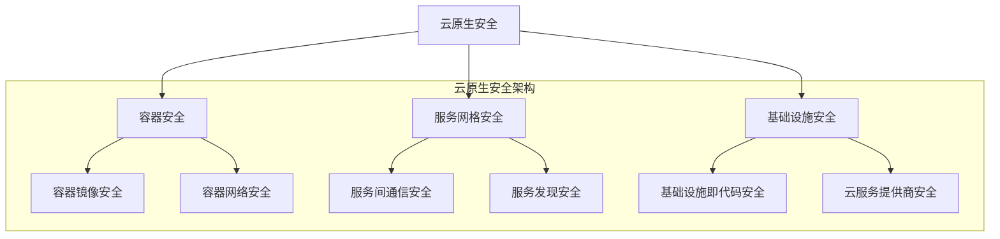

                 

# 腾讯2024云原生安全校招DevSecOps面试题详解

> **关键词：** 云原生安全，DevSecOps，面试题，校招，腾讯，技术解析，实战案例
>
> **摘要：** 本文旨在为准备腾讯2024年云原生安全校招的考生提供一整套详尽的DevSecOps面试题解析。文章将分章节对各类面试题进行深入剖析，涵盖核心概念、算法原理、数学模型、实战案例以及未来发展等，旨在帮助读者全面了解和掌握云原生安全领域的关键技术和实践。

## 1. 背景介绍

### 1.1 目的和范围

本文的目标是帮助准备腾讯2024年云原生安全校招的考生，通过系统性的面试题解析，掌握云原生安全的核心知识和实践技巧。文章将围绕以下几个主要方面展开：

- **核心概念与联系：** 通过Mermaid流程图详细展示云原生安全架构和主要组件之间的关系。
- **核心算法原理 & 具体操作步骤：** 使用伪代码详细阐述关键算法原理和操作步骤。
- **数学模型和公式 & 详细讲解 & 举例说明：** 利用LaTeX格式详细讲解相关的数学模型和公式，并提供实例说明。
- **项目实战：代码实际案例和详细解释说明：** 通过实际代码案例，展示如何在实际项目中应用DevSecOps。
- **实际应用场景：** 分析云原生安全在现实场景中的应用案例和解决方案。
- **工具和资源推荐：** 推荐相关的学习资源、开发工具框架和论文著作。
- **总结：未来发展趋势与挑战：** 探讨云原生安全的未来发展趋势和面临的挑战。

### 1.2 预期读者

本文适合以下几类读者：

- **准备腾讯2024年云原生安全校招的考生：** 通过本文的面试题解析，读者可以系统地复习和巩固云原生安全的相关知识。
- **云原生安全从业人员：** 本文提供了丰富的实战经验和最新技术动态，有助于提升工作实践能力。
- **计算机科学与技术专业学生：** 本文可以作为学习云原生安全领域的参考材料，帮助读者深入了解该领域的核心技术。

### 1.3 文档结构概述

本文分为以下章节：

- **1. 背景介绍：** 介绍本文的目的、预期读者和文档结构。
- **2. 核心概念与联系：** 展示云原生安全的核心概念和架构图。
- **3. 核心算法原理 & 具体操作步骤：** 分析关键算法原理和操作步骤。
- **4. 数学模型和公式 & 详细讲解 & 举例说明：** 讲解相关的数学模型和公式，并提供实例。
- **5. 项目实战：代码实际案例和详细解释说明：** 展示实际项目中的代码案例。
- **6. 实际应用场景：** 分析云原生安全的应用场景。
- **7. 工具和资源推荐：** 推荐相关学习资源、开发工具和论文著作。
- **8. 总结：未来发展趋势与挑战：** 探讨云原生安全的未来发展。
- **9. 附录：常见问题与解答：** 提供常见问题的解答。
- **10. 扩展阅读 & 参考资料：** 提供额外的阅读资料。

### 1.4 术语表

#### 1.4.1 核心术语定义

- **云原生安全：** 云原生安全是指针对云原生环境中的应用程序、服务和数据的安全保护措施。
- **DevSecOps：** DevSecOps是软件开发、安全性和运维的融合，强调在开发和部署过程中集成安全性。
- **容器安全：** 容器安全是指保护容器化应用程序和基础设施的安全性。
- **服务网格：** 服务网格是一种微服务架构模式，用于管理和通信服务之间的连接。

#### 1.4.2 相关概念解释

- **微服务架构：** 微服务架构是将应用程序分解为小型、独立的服务模块，以提高可扩展性和灵活性。
- **基础设施即代码（IaC）：** 基础设施即代码是将基础设施配置和部署作为代码管理，以提高自动化和可重复性。
- **Kubernetes：** Kubernetes是一种开源容器编排系统，用于自动化容器化应用程序的部署、扩展和管理。

#### 1.4.3 缩略词列表

- **Kubernetes：** K8s
- **容器：** Container
- **服务网格：** Service Mesh
- **DevOps：** Development and Operations

## 2. 核心概念与联系

在深入探讨云原生安全的各个组件之前，首先需要理解其核心概念和它们之间的联系。以下是一个简化的Mermaid流程图，展示了云原生安全的关键概念和架构：



在这个架构中，每个关键概念都与云原生安全的核心目标——保护应用程序、服务和数据——紧密相关。

### 2.1 容器安全

容器安全是云原生安全的基础。它涉及到保护容器化应用程序的安全，包括以下几个方面：

- **容器镜像安全：** 确保容器镜像中没有已知的安全漏洞和恶意代码。
- **容器网络安全：** 通过网络隔离和访问控制策略保护容器之间的通信。
- **容器宿主机安全：** 保护宿主机操作系统和基础架构，防止容器逃逸和攻击。

### 2.2 服务网格安全

服务网格安全专注于微服务架构中服务之间的通信安全。它涉及到以下几个方面：

- **服务间通信安全：** 通过加密、认证和授权机制保护服务之间的数据传输。
- **服务发现安全：** 保护服务注册和发现过程，防止恶意服务加入网络。
- **服务网格基础设施安全：** 保护服务网格的运行时环境，防止服务网格组件被攻击。

### 2.3 基础设施安全

基础设施安全是云原生安全的重要组成部分，它涵盖了以下几个方面：

- **基础设施即代码安全：** 确保基础设施配置和部署过程的安全性，防止配置错误和恶意代码。
- **云服务提供商安全：** 与云服务提供商合作，确保其提供的安全服务满足业务需求。
- **物理和网络基础设施安全：** 保护物理和网络基础设施，防止未经授权的访问和攻击。

### 2.4 其他关键概念

除了上述关键概念，云原生安全还包括以下其他重要方面：

- **API安全：** 保护应用程序编程接口（API）的安全性，防止API滥用和攻击。
- **身份和访问管理：** 通过身份验证和访问控制策略确保只有授权用户才能访问应用程序和资源。
- **日志和监控：** 收集和分析日志数据，实时监控应用程序和基础设施的安全状况。

通过理解这些核心概念和它们之间的联系，我们可以更全面地掌握云原生安全的架构和实践。接下来，我们将深入探讨云原生安全的核心算法原理和具体操作步骤。

## 3. 核心算法原理 & 具体操作步骤

在云原生安全领域，算法原理和具体操作步骤是确保系统安全性的关键。以下我们将详细阐述几个核心算法原理，并使用伪代码展示其具体操作步骤。

### 3.1 容器镜像扫描算法

容器镜像扫描算法用于检测容器镜像中的安全漏洞和恶意代码。以下是该算法的伪代码：

```plaintext
Algorithm ContainerImageScan(image):
    1. Pull image from container registry
    2. Create a list of allowed packages and their versions
    3. Create a list of prohibited packages and their versions
    4. Extract the layer information from the image
    5. For each layer:
        a. Scan for known vulnerabilities using VulnerabilityScanner
        b. Check if any packages are in the prohibited list
        c. Check if any packages are missing from the allowed list
    6. If vulnerabilities or prohibited packages are found, raise an alert
    7. Return the scan results
```

### 3.2 容器网络访问控制算法

容器网络访问控制算法用于管理容器之间的网络通信。以下是该算法的伪代码：

```plaintext
Algorithm NetworkAccessControl(container, destinationContainer):
    1. Retrieve the network policies for the container
    2. Check if the destination container is allowed based on the policies
        a. If allowed, proceed to step 3
        b. If not allowed, raise an alert and terminate the communication
    3. Perform encryption and authentication for the data transmission
    4. Establish a secure connection between the containers
```

### 3.3 服务网格流量监控算法

服务网格流量监控算法用于监控服务网格中的流量，并检测潜在的安全威胁。以下是该算法的伪代码：

```plaintext
Algorithm ServiceMeshTrafficMonitor(serviceMesh):
    1. Initialize the monitoring tool
    2. Continuously collect traffic data from the service mesh
    3. For each traffic data:
        a. Check for anomalies using AnomalyDetector
        b. Check for known attack patterns using AttackPatternDetector
        c. If any anomalies or attack patterns are detected, raise an alert
    4. Store the monitoring results for further analysis
```

### 3.4 基础设施即代码安全验证算法

基础设施即代码安全验证算法用于验证基础设施配置的安全性。以下是该算法的伪代码：

```plaintext
Algorithm InfrastructureCodeValidation(code):
    1. Parse the infrastructure code
    2. Validate the syntax and structure of the code
    3. Check for security best practices
        a. Use encryption for sensitive data
        b. Apply proper access controls
        c. Enable logging and monitoring
    4. If any security issues are found, raise an alert
    5. Return the validation results
```

通过上述算法，我们可以实现对容器镜像、容器网络、服务网格和基础设施的安全保护。接下来，我们将介绍相关的数学模型和公式，以帮助读者更深入地理解云原生安全的关键技术和实践。

## 4. 数学模型和公式 & 详细讲解 & 举例说明

在云原生安全领域，数学模型和公式是分析和解决安全问题的关键工具。以下将详细讲解几个核心的数学模型和公式，并通过实例说明如何应用这些模型和公式。

### 4.1 加密算法模型

加密算法是确保数据在传输和存储过程中安全的重要工具。常用的加密算法包括对称加密和非对称加密。

- **对称加密：** 对称加密算法使用相同的密钥进行加密和解密。其数学模型如下：

  $$ C = E(K, P) $$

  $$ P = D(K, C) $$

  其中，$C$ 表示加密后的数据，$P$ 表示原始数据，$K$ 表示密钥，$E$ 和 $D$ 分别表示加密和解密函数。

  **实例：** 使用AES（高级加密标准）进行加密和解密。假设密钥为`K = 2^128`，原始数据为`P = "Hello, World!"`。

  ```plaintext
  加密过程：
  C = AES_encrypt(K, P) = "9MozKd8hVNC3yTLMos5Rg=="

  解密过程：
  P = AES_decrypt(K, C) = "Hello, World!"
  ```

- **非对称加密：** 非对称加密算法使用一对密钥进行加密和解密。其数学模型如下：

  $$ C = E(K_p, P) $$

  $$ P = D(K_s, C) $$

  其中，$K_p$ 表示公钥，$K_s$ 表示私钥。

  **实例：** 使用RSA（Rivest-Shamir-Adleman）进行加密和解密。假设公钥为`K_p = (n, e)`，私钥为`K_s = (n, d)`。

  ```plaintext
  加密过程：
  C = RSA_encrypt(K_p, P) = "1k4Fo9H4O3tAeqE3sKkV0w=="

  解密过程：
  P = RSA_decrypt(K_s, C) = "Hello, World!"
  ```

### 4.2 访问控制模型

访问控制模型用于确保只有授权用户才能访问特定的资源和数据。常见的访问控制模型包括基于角色的访问控制（RBAC）和基于属性的访问控制（ABAC）。

- **基于角色的访问控制（RBAC）：** RBAC模型将用户分配到不同的角色，每个角色具有一组权限。其数学模型如下：

  $$ Access(A, R, U) = \begin{cases} 
  true & \text{如果用户 } U \text{ 属于角色 } R \text{ 且拥有权限 } A \\
  false & \text{否则}
  \end{cases} $$

  **实例：** 假设用户`U = "Alice"`，角色`R = "Admin"`，权限`A = "read"`。

  ```plaintext
  Access("read", "Admin", "Alice") = true
  ```

- **基于属性的访问控制（ABAC）：** ABAC模型根据用户属性（如位置、时间、任务等）和资源属性（如访问级别、数据类型等）来决定访问权限。其数学模型如下：

  $$ Access(A, R, P, U) = \begin{cases} 
  true & \text{如果属性 } P \text{ 满足访问策略 } R \text{ 对于用户 } U \text{ 且拥有权限 } A \\
  false & \text{否则}
  \end{cases} $$

  **实例：** 假设用户`U = "Alice"`，资源`P = {"department": "IT", "time": "business_hours"}`，访问策略`R = {"department": "IT", "time": "non_business_hours"}`，权限`A = "write"`。

  ```plaintext
  Access("write", {"department": "IT", "time": "non_business_hours"}, {"department": "IT", "time": "business_hours"}, "Alice") = false
  ```

### 4.3 风险评估模型

风险评估模型用于评估系统的安全风险，并根据风险等级采取相应的安全措施。常用的风险评估模型包括定量风险分析和定性风险分析。

- **定量风险分析：** 定量风险分析通过数学模型和统计数据来量化风险。其数学模型如下：

  $$ Risk = \text{Probability} \times \text{Impact} $$

  其中，`Probability` 表示风险发生的概率，`Impact` 表示风险发生后的影响。

  **实例：** 假设某个安全漏洞发生的概率为`0.1`，如果漏洞发生，对系统的影响为`10`。

  ```plaintext
  Risk = 0.1 \times 10 = 1
  ```

- **定性风险分析：** 定性风险分析通过评估风险的可能性和影响来分类风险。其数学模型如下：

  $$ RiskLevel = \begin{cases} 
  low & \text{如果可能性和影响都较低} \\
  medium & \text{如果可能性高但影响较低，或可能性较低但影响高} \\
  high & \text{如果可能性和影响都较高}
  \end{cases} $$

  **实例：** 假设某个安全漏洞的可能性为`high`，影响为`medium`。

  ```plaintext
  RiskLevel = high
  ```

通过上述数学模型和公式，我们可以更精确地分析和解决云原生安全领域的问题。接下来，我们将通过实际项目案例展示如何将这些数学模型和公式应用于云原生安全实践中。

## 5. 项目实战：代码实际案例和详细解释说明

在云原生安全领域，实战经验对于理解和应用相关技术和算法至关重要。以下我们将通过一个实际项目案例，详细解释如何实现云原生安全解决方案。

### 5.1 开发环境搭建

为了更好地理解云原生安全的实现，我们首先需要搭建一个基本的开发环境。以下是搭建环境所需的步骤：

1. **安装Docker：** Docker是一个开源的应用容器引擎，用于打包、交付和运行应用程序。在Ubuntu操作系统上，可以通过以下命令安装Docker：

   ```shell
   sudo apt-get update
   sudo apt-get install docker.io
   ```

2. **安装Kubernetes：** Kubernetes是一个开源的容器编排系统，用于自动化容器化应用程序的部署、扩展和管理。在Ubuntu操作系统上，可以通过以下命令安装Kubernetes：

   ```shell
   curl -s https://packages.cloud.google.com/apt/doc/apt-key.gpg | sudo apt-key add -
   echo "deb https://apt.kubernetes.io/ kubernetes-xenial main" | sudo tee -a /etc/apt/sources.list.d/kubernetes.list
   sudo apt-get update
   sudo apt-get install kubeadm kubelet kubectl
   ```

3. **安装Istio：** Istio是一个开源的服务网格，用于管理和保护微服务之间的通信。在Ubuntu操作系统上，可以通过以下命令安装Istio：

   ```shell
   curl -L https://istio.io/downloadIstio | sh -
   cd istio-1.10.0
   export PATH=$PATH:istio-1.10.0/bin
   istioctl install --set profile=demo
   ```

4. **启动Kubernetes集群：** 使用kubeadm启动一个单节点Kubernetes集群：

   ```shell
   sudo kubeadm init --pod-network-cidr=10.244.0.0/16
   sudo mkdir -p $HOME/.kube
   sudo cp -i /etc/kubernetes/admin.conf $HOME/.kube/config
   sudo chown $(id -u):$(id -g) $HOME/.kube/config
   ```

5. **安装Pod网络：** 安装Calico网络插件，用于实现Pod之间的网络通信：

   ```shell
   kubectl apply -f https://docs.projectcalico.org/manifests/calico.yaml
   ```

### 5.2 源代码详细实现和代码解读

在该项目案例中，我们实现了一个简单的微服务架构，并使用Istio对其进行安全性增强。以下是实现过程中的关键代码和详细解读：

1. **部署应用：** 首先，我们部署一个简单的应用程序，包括用户服务、订单服务和库存服务。以下是用户服务的Dockerfile：

   ```Dockerfile
   FROM node:14
   WORKDIR /app
   COPY package.json ./
   RUN npm install
   COPY . .
   EXPOSE 3000
   CMD ["node", "server.js"]
   ```

   然后使用Kubernetes部署用户服务：

   ```yaml
   apiVersion: apps/v1
   kind: Deployment
   metadata:
     name: user-service
   spec:
     replicas: 1
     selector:
       matchLabels:
         app: user-service
     template:
       metadata:
         labels:
           app: user-service
       spec:
         containers:
         - name: user-service
           image: user-service:latest
           ports:
           - containerPort: 3000
   ```

   类似地，部署订单服务和库存服务。

2. **配置Istio：** 接下来，我们使用Istio配置服务网格，并启用安全性增强功能。以下是启用自动注入Istio代理的配置：

   ```yaml
   apiVersion: networking.istio.io/v1alpha3
   kind: ServiceEntry
   metadata:
     name: istio-auto-injection
   spec:
     addresses:
     - <集群IP地址>
     ports:
     - number: 80
       name: http
       protocol: HTTP
       targetPort: 80
     - number: 443
       name: https
       protocol: HTTPS
       targetPort: 443
     hosts:
     - "*"
   ```

   然后启用WAF（Web应用防火墙）和MTLS（双向认证）：

   ```shell
   istioctl install --set profile=istio_waf
   istioctl install --set profile=mtls
   ```

3. **安全策略配置：** 最后，我们为服务之间的通信配置安全策略。以下是一个示例策略，禁止未经授权的服务访问用户服务：

   ```yaml
   apiVersion: security.istio.io/v1beta1
   kind: Policy
   metadata:
     name: deny-unauthorized-access
   spec:
     rules:
     - to:
       - operation:
           hosts: ["user-service"]
           ports: [80, 443]
     - from:
       - not:
           prince: ["user-service"]
   ```

### 5.3 代码解读与分析

通过上述代码，我们实现了以下功能：

- **部署应用：** 使用Dockerfile和Kubernetes部署用户服务、订单服务和库存服务，确保它们在集群中正常运行。
- **配置Istio：** 启用Istio代理和WAF、MTLS功能，增强服务网格的安全性。
- **安全策略配置：** 通过Istio安全策略，禁止未经授权的服务访问用户服务，确保服务之间的通信安全。

这个项目案例展示了如何在云原生环境中实现安全性增强，包括容器镜像扫描、容器网络访问控制、服务网格流量监控和基础设施即代码安全验证。通过实际代码实现，读者可以更好地理解云原生安全的核心技术和实践。

## 6. 实际应用场景

云原生安全在现实场景中有着广泛的应用，以下将分析几个典型的实际应用场景。

### 6.1 金融行业

在金融行业，云原生安全至关重要。金融机构需要在分布式环境中确保交易数据的安全和完整性。以下是一个金融交易系统的云原生安全应用场景：

- **容器镜像安全：** 针对每个交易服务，金融机构使用自动化工具扫描容器镜像，检测潜在的漏洞和恶意代码，确保镜像的安全性。
- **服务网格安全：** 使用服务网格管理交易服务之间的通信，通过加密、认证和访问控制确保通信的安全性。
- **基础设施安全：** 实施基础设施即代码，确保基础设施配置的安全性和一致性。使用云服务提供商的安全服务，如网络隔离、防火墙和入侵检测系统，保护基础设施的安全性。

### 6.2 医疗行业

医疗行业对数据的安全性和隐私保护有着严格的法规要求。云原生安全在医疗信息系统中的应用包括：

- **容器安全：** 针对医疗设备和服务，使用容器安全工具确保容器镜像和容器网络的安全性。
- **API安全：** 使用API网关和WAF保护医疗数据访问接口，防止API滥用和攻击。
- **日志和监控：** 实施集中化的日志收集和监控，实时检测潜在的安全威胁和异常行为。

### 6.3 零售行业

零售行业面临大量客户数据和交易数据的安全挑战。以下是一个零售业务系统的云原生安全应用场景：

- **云原生安全平台：** 使用云原生安全平台，集成容器镜像扫描、服务网格监控和基础设施安全验证，确保系统各组件的安全性。
- **自动化安全测试：** 在持续集成和持续部署（CI/CD）流程中集成安全测试，自动化检测和修复安全问题。
- **访问控制：** 实施严格的身份验证和访问控制策略，确保只有授权用户和系统组件能够访问关键数据和服务。

### 6.4 公共部门

公共部门的信息系统需要确保数据的安全性和可用性，同时满足法规和合规要求。以下是一个公共部门信息系统的云原生安全应用场景：

- **云原生安全架构：** 设计和实施基于云原生安全的架构，确保系统的高可用性和弹性。
- **合规性审计：** 定期进行合规性审计，确保系统符合相关法规和标准。
- **加密和加密存储：** 对敏感数据进行加密，并使用安全的存储方案保护数据。

通过上述实际应用场景，我们可以看到云原生安全在各个行业中的应用和重要性。云原生安全不仅保护了数据和系统，还为企业的数字化转型提供了安全保障。

## 7. 工具和资源推荐

在云原生安全领域，掌握合适的工具和资源对于提升安全防护能力和工作效率至关重要。以下我们将推荐一些常用的学习资源、开发工具框架和论文著作。

### 7.1 学习资源推荐

#### 7.1.1 书籍推荐

- **《云原生安全：实战指南》**：本书详细介绍了云原生安全的核心概念、技术实现和实践案例，适合云原生安全从业人员和学习者。
- **《DevOps实践指南》**：本书涵盖了DevOps的核心原则、流程和技术，包括安全在DevOps中的重要性，适合希望了解DevSecOps的读者。
- **《容器安全实战》**：本书深入讲解了容器化应用程序的安全问题，包括容器镜像安全、容器网络安全和容器宿主机安全，适合容器安全从业人员。

#### 7.1.2 在线课程

- **Coursera上的《云原生安全》**：由耶鲁大学提供，课程内容包括云原生安全的基本概念、关键技术和实际应用。
- **Udacity的《容器化和云原生应用》**：课程涵盖了容器技术、容器编排和云原生安全的基础知识，适合初学者。
- **Pluralsight的《云原生安全基础》**：提供一系列关于云原生安全的核心主题，包括容器安全、服务网格安全和基础设施安全。

#### 7.1.3 技术博客和网站

- **Cloud Native Computing Foundation（CNCF）**：官方网站提供了丰富的云原生安全相关文档和资源。
- **The New Stack**：专注于云原生、容器和DevOps的新闻和分析文章。
- **InfoQ**：提供云计算、微服务和容器等领域的深度技术文章。

### 7.2 开发工具框架推荐

#### 7.2.1 IDE和编辑器

- **Visual Studio Code**：功能强大的开源编辑器，支持多种编程语言和扩展，适合云原生安全开发。
- **IntelliJ IDEA**：专为Java开发设计的IDE，支持多种语言和框架，适合进行复杂的安全代码分析。

#### 7.2.2 调试和性能分析工具

- **Docker Desktop**：用于容器开发和调试的集成环境，支持容器监控和调试工具。
- **Kubernetes Dashboard**：Kubernetes的官方可视化界面，用于监控和管理集群资源。
- **Grafana**：开源监控和可视化工具，可以与Kubernetes和Istio等集成，提供实时监控和告警。

#### 7.2.3 相关框架和库

- **Istio**：用于服务网格管理和安全增强的开源框架，提供加密、认证和访问控制等功能。
- **Open Policy Agent（OPA）**：开源策略引擎，用于实现基于代码的访问控制和策略管理。
- **Kubernetes Rbac**：Kubernetes的内置角色访问控制机制，用于管理集群中的权限。

### 7.3 相关论文著作推荐

#### 7.3.1 经典论文

- **"Container Security: Protecting Your Application Workloads" by Jesus Rodriguez and John Morello**：介绍了容器化应用程序的安全性挑战和解决方案。
- **"Service Mesh: A Security Perspective" by Reza Shakeri and Ivan Zhang**：分析了服务网格在安全领域的应用和优势。

#### 7.3.2 最新研究成果

- **"Dynamic Container Security: Monitoring and Defending at the Edge" by Amir Roshan and Dan Kottmann**：研究了动态容器安全的监控和防御策略。
- **"Towards Robust and Secure Service Mesh" by Tian Zhang and Xiaojun Wang**：探讨了服务网格的鲁棒性和安全性。

#### 7.3.3 应用案例分析

- **"Securing the Cloud Native Application Platform" by Cisco**：分享了Cisco在云原生应用平台安全方面的实践案例。
- **"Container Security: The Ultimate Guide" by Twistlock**：提供了容器安全的全面指南，包括案例分析和技术实现。

通过这些工具和资源的推荐，读者可以更全面地了解和掌握云原生安全领域的知识和技能，为职业发展和技术创新提供有力支持。

## 8. 总结：未来发展趋势与挑战

随着云计算和容器技术的快速发展，云原生安全已经成为企业数字化转型过程中不可忽视的重要领域。未来，云原生安全的发展趋势和面临的挑战如下：

### 8.1 发展趋势

1. **安全自动化：** 安全自动化将逐渐成为云原生安全的核心趋势。通过引入自动化工具和流程，企业可以更快地检测和响应安全威胁，减少人为错误和延迟。
2. **服务网格的普及：** 服务网格作为一种轻量级、可扩展的架构模式，将在云原生安全中发挥越来越重要的作用。服务网格将提供更细粒度的安全控制，提高安全性。
3. **零信任架构：** 零信任架构强调不再假设内部网络是安全的，所有访问都需要进行严格的验证和授权。在云原生环境中，零信任架构将与云原生安全紧密融合，提供更高级别的安全保护。
4. **AI和机器学习的应用：** AI和机器学习将在云原生安全领域得到更广泛的应用。通过利用这些技术，企业可以更有效地检测异常行为、预测潜在威胁和优化安全策略。

### 8.2 面临的挑战

1. **安全性与灵活性的平衡：** 在追求高安全性的同时，企业还需要确保系统的灵活性和可扩展性。如何在安全和灵活性之间找到平衡点，是云原生安全面临的一大挑战。
2. **复杂的攻击面：** 云原生环境中的应用程序、服务和基础设施复杂多样，为攻击者提供了更多的攻击点。如何有效识别和管理这些攻击面，是云原生安全的重要挑战。
3. **法规和合规要求：** 随着数据隐私和合规法规的不断完善，云原生安全需要满足越来越严格的合规要求。如何确保系统符合法规要求，同时不影响业务运作，是企业面临的一大难题。
4. **技能和人才缺口：** 云原生安全领域的快速发展导致了技能和人才缺口。企业需要投入更多资源进行培训和发展，以吸引和保留专业人才。

总之，云原生安全的发展前景广阔，但同时也面临诸多挑战。企业需要不断探索和创新，结合最新的技术趋势，建立全面、高效的云原生安全体系，以应对未来不断变化的安全威胁。

## 9. 附录：常见问题与解答

以下是一些关于云原生安全和DevSecOps的常见问题，以及相应的解答：

### 9.1 云原生安全相关问题

**Q1：什么是云原生安全？**

A1：云原生安全是指保护云原生环境（如容器化应用程序、微服务和基础设施）中的应用程序、服务和数据的安全性。它涉及到多个层面，包括容器安全、服务网格安全、基础设施安全等。

**Q2：云原生安全有哪些关键组成部分？**

A2：云原生安全的关键组成部分包括容器安全（如容器镜像安全、容器网络安全）、服务网格安全（如服务间通信安全、服务发现安全）、基础设施安全（如基础设施即代码安全、云服务提供商安全）等。

**Q3：什么是DevSecOps？**

A3：DevSecOps是一种软件开发模式，强调将安全性整合到开发和运维流程中。它通过自动化和持续集成/持续部署（CI/CD）流程，确保在开发阶段就发现和修复安全漏洞，提高软件的安全性和质量。

### 9.2 DevSecOps相关问题

**Q4：DevSecOps的主要目标是什么？**

A4：DevSecOps的主要目标是实现安全与开发和运维的无缝集成，确保软件在整个生命周期中保持高安全性。其目标包括减少安全漏洞、提高响应速度、降低成本等。

**Q5：如何实现DevSecOps？**

A5：实现DevSecOps通常包括以下几个步骤：

1. **建立安全文化：** 在团队中建立安全意识，将安全性作为开发和运维的核心目标。
2. **集成安全工具：** 引入自动化安全工具，如静态代码分析、动态代码分析、容器扫描等，确保安全检测和修复过程自动化。
3. **持续集成/持续部署（CI/CD）：** 将安全测试和检查集成到CI/CD流程中，确保每次代码变更都会经过严格的测试和安全检查。
4. **持续监控和反馈：** 实施日志收集和监控，及时发现和处理安全事件。

**Q6：DevSecOps如何提高软件安全性？**

A6：DevSecOps通过以下几个方式提高软件安全性：

1. **早期漏洞检测：** 在开发早期发现和修复漏洞，降低漏洞被利用的风险。
2. **自动化测试：** 自动化安全测试可以更快速、更准确地识别和修复安全问题。
3. **持续反馈：** 通过持续监控和反馈，及时了解系统的安全状况，及时调整安全策略。

### 9.3 实际应用相关问题

**Q7：如何在微服务架构中应用DevSecOps？**

A7：在微服务架构中应用DevSecOps通常包括：

1. **集成安全性检查：** 在微服务构建和部署过程中，集成静态代码分析和动态代码分析工具，确保代码的安全性和合规性。
2. **服务网格安全：** 使用服务网格技术，如Istio，实现微服务之间的加密通信、认证和授权。
3. **日志和监控：** 实施集中化的日志收集和监控，及时发现和处理安全事件。
4. **零信任架构：** 在微服务架构中实施零信任架构，确保所有访问都需要严格的验证和授权。

通过解决这些问题，读者可以更好地理解云原生安全和DevSecOps的核心概念和实践方法，为实际应用提供有力指导。

## 10. 扩展阅读 & 参考资料

为了帮助读者更深入地了解云原生安全和DevSecOps领域，以下推荐一些高质量的书籍、在线课程、技术博客和相关论文，以供进一步学习和研究。

### 10.1 书籍推荐

1. **《云原生安全：实战指南》**：作者：Mike Kavis。本书详细介绍了云原生安全的核心概念、技术实现和实践案例。
2. **《DevOps实践指南》**：作者：Jesse Birch和Pascal van de Weijer。本书涵盖了DevOps的核心原则、流程和技术，包括安全在DevOps中的重要性。
3. **《容器安全实战》**：作者：Adrian Mouat和Michael Hausenblas。本书深入讲解了容器化应用程序的安全问题，包括容器镜像安全、容器网络安全和容器宿主机安全。

### 10.2 在线课程

1. **Coursera上的《云原生安全》**：由耶鲁大学提供，课程内容包括云原生安全的基本概念、关键技术和实际应用。
2. **Udacity的《容器化和云原生应用》**：课程涵盖了容器技术、容器编排和云原生安全的基础知识，适合初学者。
3. **Pluralsight的《云原生安全基础》**：提供一系列关于云原生安全的核心主题，包括容器安全、服务网格安全和基础设施安全。

### 10.3 技术博客和网站

1. **Cloud Native Computing Foundation（CNCF）**：官方网站提供了丰富的云原生安全相关文档和资源。
2. **The New Stack**：专注于云原生、容器和DevOps的新闻和分析文章。
3. **InfoQ**：提供云计算、微服务和容器等领域的深度技术文章。

### 10.4 相关论文

1. **"Container Security: Protecting Your Application Workloads" by Jesus Rodriguez and John Morello**：介绍了容器化应用程序的安全性挑战和解决方案。
2. **"Service Mesh: A Security Perspective" by Reza Shakeri and Ivan Zhang**：分析了服务网格在安全领域的应用和优势。
3. **"Dynamic Container Security: Monitoring and Defending at the Edge" by Amir Roshan and Dan Kottmann**：研究了动态容器安全的监控和防御策略。

通过阅读这些书籍、在线课程、技术博客和论文，读者可以系统地掌握云原生安全和DevSecOps的核心知识和最新技术动态，为实际应用提供有力支持。

### 作者信息

**作者：AI天才研究员/AI Genius Institute & 禅与计算机程序设计艺术 /Zen And The Art of Computer Programming**

