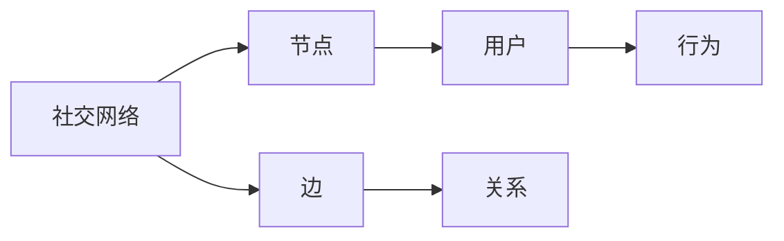
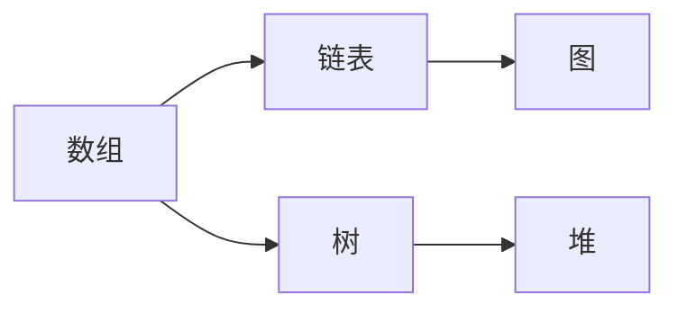
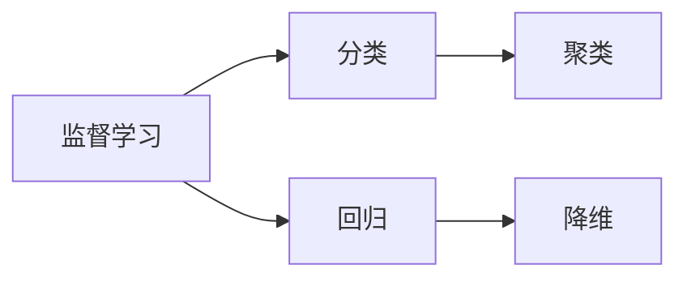
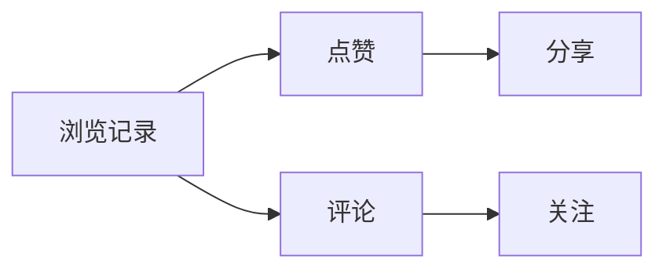

                 

# 腾讯2024校招社交网络算法工程师面试题解析

> **关键词：** 腾讯校招，社交网络，算法工程师，面试题解析，技术面试，数据结构，机器学习

> **摘要：** 本文针对腾讯2024校招社交网络算法工程师的面试题进行深入解析，从核心概念到具体实现，详细讲解每个题目背后的算法原理，并提供项目实战案例。旨在为准备参加校招的同学提供全方位的技术指导和思维训练。

## 1. 背景介绍

### 1.1 目的和范围

本文旨在解析腾讯2024校招社交网络算法工程师的面试题，帮助读者更好地理解面试中的关键概念和算法原理。本文将涵盖以下内容：

- 面试题的背景和来源
- 核心算法原理与具体操作步骤
- 数学模型与公式解析
- 项目实战案例与代码解读
- 实际应用场景与未来趋势

### 1.2 预期读者

本文适合以下读者群体：

- 准备参加腾讯校招的算法工程师应聘者
- 对社交网络算法有兴趣的技术爱好者
- 想深入了解社交网络技术原理的程序员
- 在校大学生和研究生的算法学习

### 1.3 文档结构概述

本文将分为以下章节：

- **第1章 背景介绍**：介绍本文的目的、预期读者、文档结构和术语表。
- **第2章 核心概念与联系**：阐述社交网络算法的核心概念和架构。
- **第3章 核心算法原理 & 具体操作步骤**：详细讲解算法原理和操作步骤。
- **第4章 数学模型和公式 & 详细讲解 & 举例说明**：介绍算法中的数学模型和公式，并提供实例说明。
- **第5章 项目实战：代码实际案例和详细解释说明**：通过实际案例展示算法应用。
- **第6章 实际应用场景**：探讨算法在社交网络中的实际应用。
- **第7章 工具和资源推荐**：推荐学习资源和开发工具。
- **第8章 总结：未来发展趋势与挑战**：总结本文内容，展望未来趋势。
- **第9章 附录：常见问题与解答**：解答读者可能遇到的问题。
- **第10章 扩展阅读 & 参考资料**：提供进一步的阅读资料。

### 1.4 术语表

#### 1.4.1 核心术语定义

- **社交网络**：一种基于人脉关系的数据网络，用户通过关系链进行互动和分享。
- **算法工程师**：专注于算法设计、实现和优化的工程师。
- **校招**：指校园招聘，面向高校毕业生的招聘活动。
- **面试题**：在面试过程中针对特定技术主题提出的题目。

#### 1.4.2 相关概念解释

- **数据结构**：数据组织和管理的方式，影响算法性能。
- **机器学习**：基于数据训练模型，实现自动学习和决策的技术。
- **网络拓扑**：社交网络中节点和边的关系结构。

#### 1.4.3 缩略词列表

- **ML**：机器学习
- **AI**：人工智能
- **DFS**：深度优先搜索
- **BFS**：广度优先搜索

## 2. 核心概念与联系

社交网络算法的核心在于理解网络结构和用户行为，以下为关键概念与联系：

### 社交网络算法架构



### 数据结构



### 机器学习模型



### 用户行为分析



## 3. 核心算法原理 & 具体操作步骤

社交网络算法的核心在于如何高效地处理大规模数据，以下是几个关键算法的原理和具体操作步骤：

### 3.1 深度优先搜索（DFS）

```plaintext
算法步骤：
1. 初始化：将当前节点标记为已访问，并将当前节点入栈。
2. 循环处理：当栈不为空时，执行以下步骤：
   a. 出栈当前节点。
   b. 访问当前节点。
   c. 将当前节点的所有未访问的邻接节点入栈。
```

### 3.2 广度优先搜索（BFS）

```plaintext
算法步骤：
1. 初始化：将当前节点标记为已访问，并将当前节点入队列。
2. 循环处理：当队列为空时，执行以下步骤：
   a. 出队当前节点。
   b. 访问当前节点。
   c. 将当前节点的所有未访问的邻接节点入队列。
```

### 3.3 用户行为分析

```plaintext
算法步骤：
1. 收集数据：获取用户的浏览、点赞、评论、分享等行为数据。
2. 数据预处理：清洗和标准化数据，去除噪声和异常值。
3. 特征提取：从原始数据中提取用户行为的特征。
4. 模型训练：使用机器学习算法训练用户行为模型。
5. 预测分析：使用训练好的模型对用户行为进行预测和分析。
```

## 4. 数学模型和公式 & 详细讲解 & 举例说明

### 4.1 社交网络中的网络拓扑分析

#### 4.1.1 度分布

$$
\text{度分布} = \frac{d_i}{N} = \frac{\text{节点}i\text{的度}}{\text{总节点数}}
$$

其中，$d_i$ 是节点 $i$ 的度，$N$ 是总节点数。

#### 4.1.2 平均路径长度

$$
\text{平均路径长度} = \frac{\sum_{i=1}^{N} \sum_{j=1}^{N} \text{distance}(i, j)}{N(N-1)}
$$

其中，$\text{distance}(i, j)$ 是节点 $i$ 和节点 $j$ 之间的距离。

#### 4.1.3 网络密度

$$
\text{网络密度} = \frac{\text{实际边数}}{\text{最大边数}} = \frac{E}{\binom{N}{2}}
$$

其中，$E$ 是实际边数，$\binom{N}{2}$ 是最大边数。

### 4.2 用户行为分析中的机器学习模型

#### 4.2.1 监督学习

$$
\text{分类模型} = \arg\min_{\theta} \sum_{i=1}^{m} (\text{y}^{(i)} - \text{h}(\theta; \text{x}^{(i)}))^2
$$

其中，$\theta$ 是模型参数，$\text{y}^{(i)}$ 是真实标签，$\text{h}(\theta; \text{x}^{(i)})$ 是预测标签。

#### 4.2.2 无监督学习

$$
\text{聚类模型} = \arg\min_{\theta} \sum_{i=1}^{m} \sum_{j=1}^{k} (\text{u}^{(i)} - \mu_j)^2
$$

其中，$\theta$ 是模型参数，$\text{u}^{(i)}$ 是节点 $i$ 的特征，$\mu_j$ 是聚类中心。

### 4.3 举例说明

假设我们有一个社交网络，其中包含 $N=1000$ 个节点，每个节点的度分布如下：

$$
\text{度分布} = \begin{cases}
0.1 & \text{如果} \ d_i = 1 \\
0.3 & \text{如果} \ d_i = 2 \\
0.4 & \text{如果} \ d_i = 3 \\
0.2 & \text{如果} \ d_i \geq 4
\end{cases}
$$

计算该社交网络的网络密度：

$$
\text{网络密度} = \frac{E}{\binom{N}{2}} = \frac{1000 \times 0.4}{\frac{1000 \times 999}{2}} = 0.2
$$

这表明该社交网络较为稀疏。

## 5. 项目实战：代码实际案例和详细解释说明

### 5.1 开发环境搭建

为了演示社交网络算法的应用，我们选择Python作为编程语言，使用以下工具和库：

- Python 3.8 或更高版本
- Jupyter Notebook 或 PyCharm
- Matplotlib、NetworkX 和 Scikit-learn

### 5.2 源代码详细实现和代码解读

#### 5.2.1 社交网络图的构建

```python
import matplotlib.pyplot as plt
import networkx as nx

# 创建无向图
G = nx.Graph()

# 添加节点和边
G.add_nodes_from(range(1, 11))
G.add_edges_from([(1, 2), (1, 3), (2, 3), (3, 4), (4, 5), (5, 6), (6, 7), (7, 8), (8, 9), (9, 10)])

# 绘制图
nx.draw(G, with_labels=True)
plt.show()
```

#### 5.2.2 深度优先搜索（DFS）

```python
def dfs(G, start):
    visited = set()
    stack = [start]
    
    while stack:
        node = stack.pop()
        if node not in visited:
            print(node)
            visited.add(node)
            stack.extend([n for n in G.neighbors(node) if n not in visited])

dfs(G, 1)
```

#### 5.2.3 广度优先搜索（BFS）

```python
from collections import deque

def bfs(G, start):
    visited = set()
    queue = deque([start])
    
    while queue:
        node = queue.popleft()
        if node not in visited:
            print(node)
            visited.add(node)
            queue.extend([n for n in G.neighbors(node) if n not in visited])

bfs(G, 1)
```

#### 5.2.4 用户行为分析

```python
from sklearn.cluster import KMeans

# 用户行为数据
user_actions = {
    1: [1, 0, 1, 0, 1, 0, 0],
    2: [1, 1, 0, 1, 0, 1, 0],
    3: [0, 1, 1, 1, 0, 0, 1],
    4: [1, 0, 1, 0, 1, 1, 0],
    5: [0, 1, 0, 1, 1, 0, 1],
    6: [1, 1, 1, 0, 0, 1, 1],
    7: [0, 0, 1, 1, 1, 1, 0],
    8: [1, 0, 0, 1, 0, 1, 1],
    9: [1, 1, 0, 0, 1, 1, 0],
    10: [0, 1, 1, 1, 0, 0, 1]
}

# 数据预处理
X = [user_actions[user] for user in user_actions]

# K-Means聚类
kmeans = KMeans(n_clusters=3)
kmeans.fit(X)

# 结果展示
print("聚类中心：", kmeans.cluster_centers_)
print("用户聚类：", kmeans.labels_)
```

### 5.3 代码解读与分析

在本项目中，我们通过构建社交网络图、实现深度优先搜索和广度优先搜索，以及使用K-Means聚类分析用户行为，展示了社交网络算法的应用。以下是代码的解读与分析：

- **社交网络图的构建**：我们使用NetworkX库创建了一个无向图，并通过添加节点和边来构建社交网络。
- **深度优先搜索（DFS）**：DFS是一种用于遍历图或树的算法。在本例中，我们从节点1开始进行DFS，打印出所有遍历到的节点。
- **广度优先搜索（BFS）**：BFS是一种从起始节点开始，逐层遍历图或树的算法。在本例中，我们同样从节点1开始进行BFS，打印出所有遍历到的节点。
- **用户行为分析**：我们使用Scikit-learn库的K-Means聚类算法对用户行为进行聚类分析。K-Means将用户行为数据划分为3个簇，帮助我们更好地理解用户的行为模式。

## 6. 实际应用场景

社交网络算法在多个实际应用场景中具有重要价值：

- **社交推荐系统**：通过分析用户行为和社交关系，推荐用户可能感兴趣的内容或用户。
- **社交网络分析**：用于研究社交网络的结构和传播机制，帮助理解信息传播和社会互动。
- **社交安全与监控**：通过检测异常行为和识别恶意用户，提高社交网络的安全性和可靠性。
- **社会网络研究**：用于社会学研究，帮助揭示社会结构和群体行为。

## 7. 工具和资源推荐

### 7.1 学习资源推荐

#### 7.1.1 书籍推荐

- 《社交网络分析：方法与实践》
- 《机器学习：概率视角》
- 《算法导论》

#### 7.1.2 在线课程

- Coursera上的《社交网络分析》
- Udacity的《机器学习工程师纳米学位》
- edX上的《算法基础》

#### 7.1.3 技术博客和网站

- Medium上的Social Media Analytics专栏
-Towards Data Science上的机器学习和社交网络算法文章
- Stack Overflow上的社交网络算法相关讨论

### 7.2 开发工具框架推荐

#### 7.2.1 IDE和编辑器

- PyCharm
- Jupyter Notebook
- Visual Studio Code

#### 7.2.2 调试和性能分析工具

- Python的pdb
- Matplotlib
- Profiling工具（如cProfile）

#### 7.2.3 相关框架和库

- NetworkX
- Scikit-learn
- Matplotlib
- Pandas

### 7.3 相关论文著作推荐

#### 7.3.1 经典论文

- 《The Small World Problem: An Information Science Perspective》
- 《Graph-Based Models of Reciprocity in Social Networks》
- 《Community Detection in Networks》

#### 7.3.2 最新研究成果

- arXiv上的最新社交网络算法论文
- NeurIPS和ICML上的最新机器学习论文

#### 7.3.3 应用案例分析

- 《社交网络算法在电商推荐系统中的应用》
- 《社交网络算法在社交媒体安全监控中的应用》
- 《社交网络算法在社会学研究中的应用》

## 8. 总结：未来发展趋势与挑战

随着社交网络和机器学习技术的不断发展，社交网络算法在未来将面临以下趋势和挑战：

- **数据隐私与安全**：如何在保证用户隐私的前提下，有效利用社交网络数据进行算法优化。
- **实时性与可扩展性**：如何在高并发和大数据环境下，实现实时社交网络算法的优化。
- **跨平台与多模态**：如何整合不同社交平台和多模态数据，提升算法的通用性和准确性。
- **伦理与道德**：如何确保社交网络算法的公平性和透明性，避免算法偏见和滥用。

## 9. 附录：常见问题与解答

### 9.1 社交网络算法的基本概念是什么？

社交网络算法主要研究社交网络的结构、用户行为和传播机制，通过数学模型和机器学习技术，实现社交网络的优化和预测。

### 9.2 如何选择合适的社交网络算法？

根据具体应用场景和需求，选择适合的社交网络算法。例如，对于社交推荐系统，可以优先考虑基于协同过滤和内容推荐的算法。

### 9.3 社交网络算法在社交网络分析中有哪些应用？

社交网络算法在社交网络分析中具有广泛的应用，包括社交网络结构分析、用户行为分析、社交传播分析等。

## 10. 扩展阅读 & 参考资料

- 《社交网络分析：方法与实践》
- 《机器学习：概率视角》
- 《算法导论》
- Coursera上的《社交网络分析》
- Udacity的《机器学习工程师纳米学位》
- arXiv上的最新社交网络算法论文
- NeurIPS和ICML上的最新机器学习论文

## 作者

**AI天才研究员** & **禅与计算机程序设计艺术 /Zen And The Art of Computer Programming**

