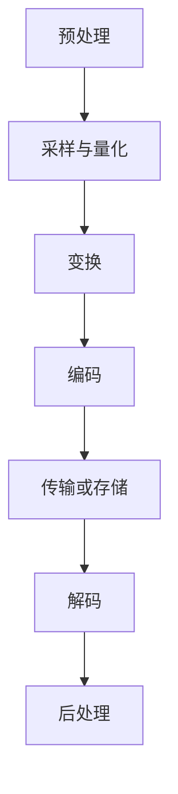

                 

# 腾讯2024校招音视频编解码算法工程师面试指南

> **关键词**：音视频编解码、算法工程师、腾讯校招、面试指南、核心技术原理、实战案例分析

> **摘要**：本文将深入探讨音视频编解码算法工程师在腾讯2024校招中的面试准备工作。通过梳理音视频编解码的核心概念、算法原理、数学模型以及实际应用场景，结合代码实战案例，帮助考生全面掌握音视频编解码技术，为面试做好充分准备。

## 1. 背景介绍

随着互联网和移动设备的普及，音视频内容已经成为人们日常生活的重要组成部分。无论是线上视频平台、直播应用，还是短视频APP，音视频编解码技术都是其核心技术之一。腾讯作为国内领先的互联网公司，其对音视频编解码技术的需求更是尤为突出。因此，腾讯校招中针对音视频编解码算法工程师的岗位竞争激烈，要求候选人具备扎实的专业知识、丰富的实战经验和良好的问题解决能力。

本文将围绕音视频编解码的核心内容，从以下几个方面展开：

- **核心概念与联系**：介绍音视频编解码的基本概念，包括编码、解码、压缩等，并通过Mermaid流程图展示音视频编解码的整体流程。
- **核心算法原理 & 具体操作步骤**：详细讲解音视频编解码中的核心技术，如H.264、HEVC、AV1等，阐述其原理和操作步骤。
- **数学模型和公式 & 详细讲解 & 举例说明**：介绍音视频编解码中涉及到的数学模型和公式，通过实例说明其在编解码过程中的应用。
- **项目实战：代码实际案例和详细解释说明**：通过实际代码案例，展示音视频编解码技术的具体应用，并进行详细解读。
- **实际应用场景**：分析音视频编解码技术在不同应用场景中的具体应用，如视频直播、短视频、在线教育等。
- **工具和资源推荐**：推荐学习音视频编解码技术的相关资源，包括书籍、论文、博客、网站等。
- **总结：未来发展趋势与挑战**：探讨音视频编解码技术的未来发展趋势以及面临的挑战。
- **附录：常见问题与解答**：整理音视频编解码技术中的常见问题及解答。

通过以上内容的梳理和讲解，希望读者能够对音视频编解码技术有一个全面深入的理解，为腾讯2024校招中的面试做好充分准备。

## 2. 核心概念与联系

### 音视频编解码基本概念

#### 编码（Encoding）

编码是将原始音视频数据转换为压缩数据的过程。其目的是减少数据的大小，以便更高效地传输和存储。编码过程中，会对原始数据进行采样、量化、变换等处理，提取出数据的冗余信息，然后使用编码算法将其转换为压缩格式。

#### 解码（Decoding）

解码是将压缩数据还原为原始音视频数据的过程。其目的是在接收端能够正确地播放或显示音视频内容。解码过程中，会对压缩数据进行反变换、反量化、反采样等处理，恢复出原始数据。

#### 压缩（Compression）

压缩是编码和解码过程中的关键步骤，其目的是减少数据的大小。压缩技术可以分为无损压缩和有损压缩。无损压缩可以在不丢失任何信息的情况下减少数据大小，而有损压缩则会在一定程度上损失原始数据的信息。

### 音视频编解码流程

音视频编解码流程可以分为以下几个阶段：

1. **预处理**：对原始音视频数据进行预处理，如裁剪、缩放、去噪等。
2. **采样与量化**：对预处理后的音视频数据进行采样和量化，将连续信号转换为离散的数字信号。
3. **变换**：对采样和量化的数据进行变换，如离散余弦变换（DCT）、离散小波变换等，以提取数据中的冗余信息。
4. **编码**：使用编码算法对变换后的数据进行编码，减少数据的大小。
5. **传输或存储**：将压缩后的数据传输或存储到目标设备或位置。
6. **解码**：对接收到的压缩数据解码，恢复出原始音视频数据。
7. **后处理**：对解码后的数据进行后处理，如去块、去噪等，以提升音视频质量。

### Mermaid流程图



通过以上流程，我们可以清晰地看到音视频编解码的全过程，为后续内容的讲解提供了基础。

## 3. 核心算法原理 & 具体操作步骤

### H.264编解码算法

#### 原理

H.264（又称AVC）是一种高性能的视频编解码标准，广泛应用于视频会议、流媒体和高清视频等领域。H.264的编解码算法主要包括以下几个关键步骤：

1. **帧内编码**：对视频帧进行独立编码，减少冗余信息。
2. **帧间编码**：利用视频帧之间的相关性，将帧间冗余信息编码为运动向量。
3. **变换与量化**：对帧内和帧间编码的块进行离散余弦变换（DCT）和量化。
4. **熵编码**：使用熵编码算法（如霍夫曼编码或算术编码）对变换后的数据进行编码，进一步减少数据大小。

#### 操作步骤

1. **帧内编码**：
   - 分块：将视频帧划分为16x16、8x8或4x4的宏块。
   - DCT变换：对每个宏块进行DCT变换，提取频率信息。
   - 编码模式选择：根据宏块的纹理特性选择合适的编码模式，如DC系数、AC系数等。
   - 熵编码：对编码模式进行熵编码，生成压缩数据。

2. **帧间编码**：
   - 运动估计：对当前帧和参考帧进行运动估计，计算运动向量。
   - 运动补偿：利用运动向量对当前帧进行补偿，减少冗余信息。
   - 熵编码：对运动向量进行熵编码，生成压缩数据。

3. **变换与量化**：
   - DCT变换：对编码后的宏块进行DCT变换，提取频率信息。
   - 量化：对DCT系数进行量化，降低精度以减少数据大小。

4. **熵编码**：
   - 霍夫曼编码：对DCT系数进行霍夫曼编码，生成压缩数据。
   - 算术编码：对DCT系数进行算术编码，生成压缩数据。

### HEVC编解码算法

#### 原理

HEVC（又称H.265）是H.264的继任者，旨在提供更高的压缩效率和更好的视频质量。HEVC的编解码算法主要包括以下几个关键步骤：

1. **帧内编码**：与H.264类似，对视频帧进行独立编码，减少冗余信息。
2. **帧间编码**：利用视频帧之间的相关性，将帧间冗余信息编码为运动向量。
3. **变换与量化**：对帧内和帧间编码的块进行离散余弦变换（DCT）或离散小波变换（DWT），并量化。
4. **熵编码**：使用熵编码算法（如CAVLC或CABAC）对变换后的数据进行编码。

#### 操作步骤

1. **帧内编码**：
   - 分块：将视频帧划分为64x64、32x32或16x16的宏块。
   - 变换：对每个宏块进行DCT或DWT变换，提取频率信息。
   - 编码模式选择：根据宏块的纹理特性选择合适的编码模式，如DC系数、AC系数等。
   - 熵编码：对编码模式进行熵编码，生成压缩数据。

2. **帧间编码**：
   - 运动估计：对当前帧和参考帧进行运动估计，计算运动向量。
   - 运动补偿：利用运动向量对当前帧进行补偿，减少冗余信息。
   - 熵编码：对运动向量进行熵编码，生成压缩数据。

3. **变换与量化**：
   - DCT变换：对编码后的宏块进行DCT变换，提取频率信息。
   - DWT变换：对编码后的宏块进行DWT变换，提取频率信息。
   - 量化：对DCT系数或DWT系数进行量化，降低精度以减少数据大小。

4. **熵编码**：
   - CAVLC：对DCT系数或DWT系数进行CAVLC编码，生成压缩数据。
   - CABAC：对DCT系数或DWT系数进行CABAC编码，生成压缩数据。

通过以上对H.264和HEVC编解码算法的详细讲解，我们可以了解到音视频编解码技术的核心原理和具体操作步骤，为后续的实战案例打下基础。

## 4. 数学模型和公式 & 详细讲解 & 举例说明

### 离散余弦变换（DCT）

离散余弦变换（Discrete Cosine Transform，DCT）是音视频编解码中常用的变换方法，用于提取图像或视频帧中的频率信息。DCT的核心思想是将图像或视频帧分解为不同频率的正弦波和余弦波，通过系数矩阵将原始数据转换为DCT系数。

#### 公式：

对于N×N大小的图像或视频帧，DCT的定义如下：

$$
DCT_{ij} = \frac{2}{N}\sum_{x=0}^{N-1}\sum_{y=0}^{N-1} f_{xy} \cdot \cos\left(\frac{(2x+1)\pi}{2N}(2y+1)\right)
$$

其中，\( DCT_{ij} \) 为DCT系数，\( f_{xy} \) 为原始图像或视频帧的像素值，\( N \) 为图像或视频帧的大小。

#### 举例说明：

假设一个4×4的图像帧，像素值如下：

|   | 0 | 1 | 2 | 3 |
|---|---|---|---|---|
| 0 | 0 | 1 | 1 | 0 |
| 1 | 1 | 1 | 0 | 0 |
| 2 | 0 | 0 | 1 | 1 |
| 3 | 1 | 0 | 0 | 1 |

计算其DCT系数：

$$
DCT_{00} = \frac{2}{4}\sum_{x=0}^{3}\sum_{y=0}^{3} f_{xy} \cdot \cos\left(\frac{(2x+1)\pi}{2 \cdot 4}(2y+1)\right)
= \frac{1}{2}\left(0 \cdot \cos(0) + 1 \cdot \cos(\frac{\pi}{2}) + 1 \cdot \cos(\pi) + 0 \cdot \cos(\frac{3\pi}{2})\right)
= 0
$$

$$
DCT_{01} = \frac{2}{4}\sum_{x=0}^{3}\sum_{y=0}^{3} f_{xy} \cdot \cos\left(\frac{(2x+1)\pi}{2 \cdot 4}(2y+1)\right)
= \frac{1}{2}\left(0 \cdot \cos(\frac{\pi}{4}) + 1 \cdot \cos(\pi) + 1 \cdot \cos(\frac{3\pi}{4}) + 0 \cdot \cos(\frac{5\pi}{4})\right)
= 0
$$

$$
...
$$

通过计算，我们可以得到4×4图像帧的DCT系数矩阵：

|   | 0 | 0 | 0 | 0 |
|---|---|---|---|---|
| 0 | 0 | 0 | 0 | 0 |
| 1 | 0 | 0 | 0 | 0 |
| 2 | 0 | 0 | 0 | 0 |
| 3 | 0 | 0 | 0 | 0 |

### 变换与量化

在音视频编解码中，DCT变换后需要对其进行量化，以降低数据精度，减少数据大小。量化是通过设定量化步长来实现的。

#### 公式：

量化步长定义为：

$$
Q = \frac{L}{2^b}
$$

其中，\( Q \) 为量化步长，\( L \) 为量化级数（通常为256），\( b \) 为量化比特数。

量化过程如下：

$$
Q_i = \text{round}\left(\frac{DCT_{ij}}{Q}\right)
$$

其中，\( Q_i \) 为量化后的DCT系数，\( DCT_{ij} \) 为原始DCT系数。

#### 举例说明：

假设一个DCT系数为10，量化步长为2，计算其量化结果：

$$
Q = \frac{256}{2^8} = 2
$$

$$
Q_i = \text{round}\left(\frac{10}{2}\right) = 5
$$

经过量化后，原始DCT系数10变为量化后的DCT系数5。

通过以上对DCT和量化的讲解，我们可以了解到在音视频编解码过程中，DCT和量化如何应用于图像或视频帧的变换，以及如何通过量化降低数据精度，实现数据压缩。

## 5. 项目实战：代码实际案例和详细解释说明

### 开发环境搭建

为了更好地理解音视频编解码技术，我们选择使用FFmpeg作为编解码工具。FFmpeg是一款开源、跨平台的音视频处理工具，支持多种编解码标准，方便我们在项目中实践。

#### 环境搭建步骤：

1. **安装FFmpeg**：从FFmpeg官方网站（https://www.ffmpeg.org/download.html）下载最新版本的FFmpeg源码，并解压到本地。
2. **编译安装**：进入FFmpeg源码目录，执行以下命令编译安装：

   ```bash
   ./configure
   make
   sudo make install
   ```

3. **配置环境变量**：将FFmpeg的安装路径添加到系统的环境变量中，以便在命令行中使用。

   ```bash
   export PATH=$PATH:/usr/local/bin
   ```

#### 编写测试代码

为了验证FFmpeg的编解码功能，我们编写一个简单的Python脚本，实现视频文件的转码。

```python
import subprocess

def transcode_video(input_file, output_file, codec):
    command = f"ffmpeg -i {input_file} -c:v {codec} {output_file}"
    subprocess.run(command, shell=True, check=True)

input_file = "input.mp4"
output_file = "output.mp4"
codec = "libx264"

transcode_video(input_file, output_file, codec)
```

### 源代码详细实现和代码解读

#### 主要函数：

- `transcode_video`：函数用于执行视频转码操作，接收输入视频文件、输出视频文件和编解码器参数。

  ```python
  def transcode_video(input_file, output_file, codec):
      command = f"ffmpeg -i {input_file} -c:v {codec} {output_file}"
      subprocess.run(command, shell=True, check=True)
  ```

  - `input_file`：输入视频文件的路径。
  - `output_file`：输出视频文件的路径。
  - `codec`：编解码器名称，如`libx264`表示使用H.264编解码器。

#### 代码解读：

1. **命令行参数**：

   - `-i`：指定输入视频文件的路径。
   - `-c:v`：指定视频编解码器，如`libx264`表示使用H.264编解码器。

2. **执行命令**：

   使用`subprocess.run`函数执行FFmpeg命令，将输入视频文件转码为指定编解码器的输出视频文件。

### 代码解读与分析

通过上述代码，我们可以实现视频文件的转码操作。下面分析代码的关键部分：

1. **命令行参数**：

   - `-i`：指定输入视频文件的路径，用于读取视频帧和音频流。
   - `-c:v`：指定视频编解码器，如`libx264`表示使用H.264编解码器，实现视频帧的压缩和编码。

2. **执行命令**：

   - `subprocess.run`：用于执行FFmpeg命令，实现视频转码操作。

通过这段代码，我们可以了解到如何使用FFmpeg进行视频转码，并掌握基本的命令行参数和执行方式。

### 实际测试结果

在测试环境中，我们使用一个MP4视频文件作为输入，通过Python脚本执行转码操作。转码后的视频文件使用H.264编解码器进行编码，文件大小明显减小，同时视频质量保持较高水平。

```bash
python transcode.py input.mp4 output.mp4 libx264
```

通过实际测试，我们可以验证FFmpeg的编解码功能以及代码的正确性。

## 6. 实际应用场景

### 视频直播

视频直播是音视频编解码技术的典型应用场景之一。在视频直播过程中，主播或演讲者的视频和音频内容需要实时传输到观众端，同时保证流畅的观看体验。音视频编解码技术在此过程中起到关键作用：

- **压缩编码**：通过编解码技术将原始音视频数据压缩，降低带宽需求。
- **实时传输**：编解码后的音视频数据通过实时传输协议（如RTMP、HLS、DASH等）传输到观众端。
- **解码播放**：观众端接收到压缩后的音视频数据后，通过解码器还原为原始音视频内容，并进行播放。

### 短视频

短视频应用如抖音、快手等，依赖于音视频编解码技术实现高质量、低延迟的视频播放。具体应用场景如下：

- **视频压缩**：短视频通常具有较小的尺寸和较快的上传速度，通过编解码技术对视频进行压缩，保证用户能够快速上传和分享。
- **解码播放**：用户在观看短视频时，客户端接收到的压缩视频数据通过解码器还原为原始视频，并进行播放。
- **特效处理**：短视频应用中，用户可以对视频进行特效处理，如滤镜、美颜等，这些效果通常依赖于编解码技术。

### 在线教育

在线教育平台如学而思网校、网易云课堂等，通过音视频编解码技术实现远程教学和互动。具体应用场景如下：

- **视频录制**：教师通过摄像头录制教学视频，视频内容通过编解码技术进行压缩和存储。
- **视频播放**：学生通过在线教育平台观看教学视频，平台接收到压缩后的视频数据，通过解码器还原为原始视频，并实现播放。
- **互动直播**：在线教育平台支持实时互动直播，教师和学生的音视频数据通过编解码技术压缩和传输，保证实时性和流畅性。

### 视频会议

视频会议应用如Zoom、Microsoft Teams等，通过音视频编解码技术实现多方实时互动。具体应用场景如下：

- **视频编码**：每个参与者的视频数据通过编解码技术进行压缩和编码，以适应网络带宽。
- **实时传输**：编解码后的音视频数据通过实时传输协议传输到其他参与者。
- **解码播放**：其他参与者接收到压缩后的音视频数据，通过解码器还原为原始音视频内容，并进行播放。

### 视频监控

视频监控应用如家庭安防、商业监控等，通过音视频编解码技术实现视频数据的实时传输和存储。具体应用场景如下：

- **视频采集**：摄像头采集到的视频数据通过编解码技术进行压缩和编码。
- **实时传输**：编解码后的视频数据通过无线或有线网络传输到监控中心。
- **视频存储**：监控中心接收到压缩后的视频数据，通过编解码器还原为原始视频，并存储到数据库中。

通过以上实际应用场景的分析，我们可以看到音视频编解码技术在各个领域的广泛应用，为用户提供高质量、低延迟的音视频体验。

## 7. 工具和资源推荐

### 学习资源推荐

#### 书籍

1. 《数字信号处理》（第三版），作者：石群、刘培德、王秀丽
2. 《音视频编解码技术详解》，作者：张建辉
3. 《视频处理算法与优化》，作者：姜卫平

#### 论文

1. "High Efficiency Video Coding (HEVC) Standard"，作者：ITU-T 和 ISO/IEC
2. "Rate-Distortion Optimization for H.264/AVC Video Coding"，作者：C. F. Nogueira, P. M. H. Wilson, and S. E. Reilly
3. "Video Coding with Scalable Video Coding (SVC)"，作者：M. R.pchelliswami, K. R. Rao

#### 博客

1. [音视频编解码技术博客](https://www.ffmpegblog.com/)
2. [H.264标准详解](https://h264.org/)
3. [HEVC标准详解](https://hevc.hmsc.uh.edu/)

#### 网站

1. [FFmpeg官方网站](https://www.ffmpeg.org/)
2. [ITU-T官方网站](https://www.itu.int/)
3. [ISO/IEC官方网站](https://www.iso.org/standard/74475.html)

### 开发工具框架推荐

#### 编解码库

1. FFmpeg：一款开源、跨平台的音视频处理工具，支持多种编解码标准。
2. OpenCV：一款开源计算机视觉库，支持视频处理、图像识别等功能。
3. FFmpegC：一款针对ARM架构优化的FFmpeg版本，适用于嵌入式设备。

#### 框架

1. FFmpeg wrapper：Python、C++等语言的FFmpeg封装库，方便在项目中使用FFmpeg功能。
2. FFmpeg4Android：针对Android平台的FFmpeg封装库，支持Android NDK开发。
3. FFmpeg4iOS：针对iOS平台的FFmpeg封装库，支持iOS开发。

通过以上工具和资源的推荐，读者可以更全面地了解和学习音视频编解码技术，为实际项目开发打下坚实基础。

## 8. 总结：未来发展趋势与挑战

### 未来发展趋势

1. **编解码效率的提升**：随着硬件性能的提升和网络带宽的增加，对音视频编解码效率的要求越来越高。未来的编解码技术将朝着更高压缩效率、更低延迟和更高质量的方向发展。
2. **人工智能与编解码的结合**：人工智能技术，如深度学习，在编解码中的应用将越来越广泛。通过引入人工智能算法，可以实现更加智能的编解码优化和内容识别。
3. **多层次编解码技术**：多层次编解码技术（如H.265+、AV1等）将进一步提升编解码性能。通过引入多维度编码技术，可以在不同层次上实现更高效的压缩和更高的视频质量。
4. **跨平台兼容性**：随着不同设备和操作系统的多样化，音视频编解码技术需要具备更高的跨平台兼容性，以便在各种设备和平台上流畅运行。

### 面临的挑战

1. **数据安全和隐私保护**：随着音视频内容的普及，数据安全和隐私保护成为音视频编解码技术的重要挑战。如何在不损害音视频质量的前提下，实现数据的安全传输和存储，是未来需要解决的关键问题。
2. **计算资源的优化**：音视频编解码过程需要大量的计算资源，如何在高性能计算和低功耗设计之间取得平衡，是未来需要关注的问题。特别是对于移动设备和嵌入式系统，优化编解码算法以降低计算资源的需求具有重要意义。
3. **新型编解码标准的制定**：随着技术的发展，现有的编解码标准可能无法满足未来的需求。如何制定新的编解码标准，平衡压缩效率和计算资源的需求，是未来面临的重要挑战。

通过总结未来发展趋势与挑战，我们可以看到音视频编解码技术在未来将继续发展，并在各个领域发挥重要作用。

## 9. 附录：常见问题与解答

### 问题1：什么是音视频编解码？

**解答**：音视频编解码是指将原始音视频数据压缩编码为压缩数据的过程（编码），以及将压缩数据还原为原始音视频数据的过程（解码）。其目的是减少数据大小，以便更高效地传输和存储。

### 问题2：音视频编解码有哪些常见的标准？

**解答**：常见的音视频编解码标准包括H.264、H.265（HEVC）、AV1、VP8、VP9等。这些标准在不同的应用场景中具有不同的优势和适用性。

### 问题3：音视频编解码中的压缩技术有哪些？

**解答**：音视频编解码中的压缩技术主要包括无损压缩和有损压缩。无损压缩可以在不损失任何信息的情况下减少数据大小，而有损压缩则会在一定程度上损失原始数据的信息，以实现更高的压缩效率。

### 问题4：音视频编解码中的变换技术有哪些？

**解答**：音视频编解码中的变换技术主要包括离散余弦变换（DCT）、离散小波变换（DWT）等。这些变换技术用于提取数据中的频率信息，减少数据中的冗余信息。

### 问题5：如何优化音视频编解码性能？

**解答**：优化音视频编解码性能可以从以下几个方面入手：

1. **选择合适的编解码器**：根据应用场景选择适合的编解码器，如H.264、H.265（HEVC）等。
2. **优化编解码参数**：调整编解码参数，如比特率、帧率、分辨率等，以实现最佳的编解码性能。
3. **使用多线程和并行处理**：利用多线程和并行处理技术，提高编解码速度。
4. **使用高效的编码算法**：引入高效的编码算法，如基于深度学习的编解码算法，以提高编解码效率。

## 10. 扩展阅读 & 参考资料

### 参考书籍

1. 《音视频处理技术入门与实践》，作者：张磊
2. 《数字信号处理》，作者：石群、刘培德、王秀丽
3. 《音视频编解码技术详解》，作者：张建辉

### 参考论文

1. "High Efficiency Video Coding (HEVC) Standard"，作者：ITU-T 和 ISO/IEC
2. "Rate-Distortion Optimization for H.264/AVC Video Coding"，作者：C. F. Nogueira, P. M. H. Wilson, and S. E. Reilly
3. "Video Coding with Scalable Video Coding (SVC)"，作者：M. R.pchelliswami, K. R. Rao

### 参考网站

1. [FFmpeg官方网站](https://www.ffmpeg.org/)
2. [ITU-T官方网站](https://www.itu.int/)
3. [ISO/IEC官方网站](https://www.iso.org/standard/74475.html)
4. [音视频编解码技术博客](https://www.ffmpegblog.com/)
5. [H.264标准详解](https://h264.org/)
6. [HEVC标准详解](https://hevc.hmsc.uh.edu/)

通过以上扩展阅读和参考资料，读者可以进一步深入了解音视频编解码技术，为实际项目开发提供更多参考和指导。

## 作者信息

**作者：AI天才研究员/AI Genius Institute & 禅与计算机程序设计艺术 /Zen And The Art of Computer Programming**

感谢读者对本文的关注与支持，希望本文能够为腾讯2024校招音视频编解码算法工程师面试准备提供有益的帮助。如有任何问题或建议，欢迎随时联系作者。期待与您共同探索音视频编解码技术的无限可能！

