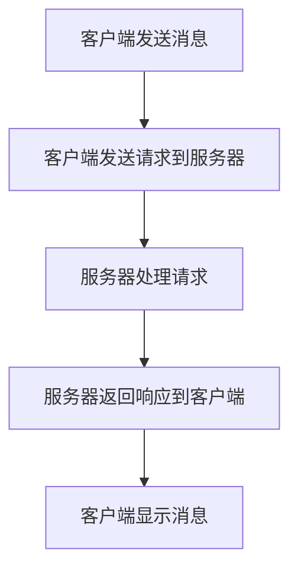
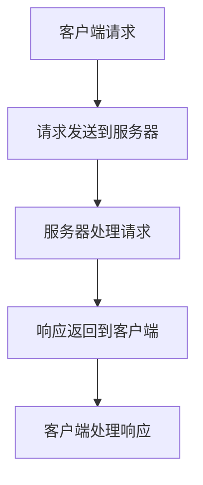

                 

# 腾讯微信2024校招即时通讯开发面试题详解

> **关键词：**即时通讯开发、微信、校招面试题、算法原理、代码实现、数学模型、项目实战
>
> **摘要：**本文旨在为即将参加腾讯微信2024校招的同学提供一份详细的即时通讯开发面试题解答指南。通过对核心概念、算法原理、数学模型、项目实战等多个方面的详细讲解，帮助读者深入理解即时通讯开发的相关技术，提高面试成功率。

## 1. 背景介绍

### 1.1 目的和范围

本文旨在为参加腾讯微信2024校招的同学提供一份全面的即时通讯开发面试题解答指南。我们将从即时通讯开发的核心概念、算法原理、数学模型、项目实战等多个方面进行详细讲解，帮助读者深入了解即时通讯开发的各个方面，提高面试应对能力。

### 1.2 预期读者

本文主要面向即将参加腾讯微信2024校招的同学，特别是对即时通讯开发感兴趣的技术人才。同时，对于其他对即时通讯开发有兴趣的读者，本文也具有一定的参考价值。

### 1.3 文档结构概述

本文分为十个部分，分别是：

1. 背景介绍
2. 核心概念与联系
3. 核心算法原理 & 具体操作步骤
4. 数学模型和公式 & 详细讲解 & 举例说明
5. 项目实战：代码实际案例和详细解释说明
6. 实际应用场景
7. 工具和资源推荐
8. 总结：未来发展趋势与挑战
9. 附录：常见问题与解答
10. 扩展阅读 & 参考资料

### 1.4 术语表

#### 1.4.1 核心术语定义

- **即时通讯**：一种实时、高效的通讯方式，允许用户在任何时间、任何地点进行实时交流。
- **微信**：一款由中国腾讯公司开发的即时通讯应用程序，拥有庞大的用户基础和丰富的功能。
- **校招面试题**：指针对应届毕业生的招聘面试中的技术问题。

#### 1.4.2 相关概念解释

- **IM协议**：即时通讯协议，用于定义即时通讯软件的数据传输和通信规则。
- **客户端-服务器架构**：一种常见的分布式系统架构，将应用程序分为客户端和服务器两部分。

#### 1.4.3 缩略词列表

- **IM**：即时通讯
- **SDK**：软件开发工具包
- **API**：应用程序编程接口

## 2. 核心概念与联系

### 2.1 IM协议

IM协议是即时通讯系统的核心，它定义了数据传输和通信的规则。常见的IM协议有XMPP、QQ协议、SIP等。以下是XMPP协议的Mermaid流程图：



### 2.2 客户端-服务器架构

客户端-服务器架构是一种常见的分布式系统架构，它将应用程序分为客户端和服务器两部分。客户端负责与用户交互，服务器负责处理业务逻辑和数据存储。以下是客户端-服务器架构的Mermaid流程图：



## 3. 核心算法原理 & 具体操作步骤

### 3.1 算法原理

即时通讯开发中，常用的算法有加密算法、压缩算法、排序算法等。以下以加密算法为例进行详细讲解。

加密算法：加密算法用于保护通信内容的安全性。常见的加密算法有AES、RSA等。

### 3.2 具体操作步骤

#### 3.2.1 AES加密算法

1. **密钥生成**：根据加密算法的要求，生成一个密钥。
2. **明文加密**：使用密钥对明文进行加密，生成密文。
3. **密文传输**：将密文传输给接收方。
4. **密文解密**：接收方使用密钥对密文进行解密，还原明文。

以下是AES加密算法的伪代码：

```python
import AES

def AES_encrypt(plaintext, key):
    ciphertext = AES.encrypt(plaintext, key)
    return ciphertext

def AES_decrypt(ciphertext, key):
    plaintext = AES.decrypt(ciphertext, key)
    return plaintext
```

#### 3.2.2 RSA加密算法

1. **密钥生成**：生成一对密钥（公钥和私钥）。
2. **明文加密**：使用公钥对明文进行加密，生成密文。
3. **密文传输**：将密文传输给接收方。
4. **密文解密**：接收方使用私钥对密文进行解密，还原明文。

以下是RSA加密算法的伪代码：

```python
import RSA

def RSA_encrypt(plaintext, public_key):
    ciphertext = RSA.encrypt(plaintext, public_key)
    return ciphertext

def RSA_decrypt(ciphertext, private_key):
    plaintext = RSA.decrypt(ciphertext, private_key)
    return plaintext
```

## 4. 数学模型和公式 & 详细讲解 & 举例说明

### 4.1 数学模型

即时通讯开发中，常用的数学模型有压缩模型、排序模型等。以下以压缩模型为例进行详细讲解。

### 4.2 压缩模型

压缩模型用于减少数据传输过程中的数据量，提高传输效率。常见的压缩算法有Huffman编码、LZ77编码等。

#### 4.2.1 Huffman编码

Huffman编码是一种基于频率的压缩算法。以下是Huffman编码的详细讲解：

1. **构建Huffman树**：根据字符的频率构建Huffman树。
2. **生成编码表**：根据Huffman树生成编码表。
3. **编码**：使用编码表对文本进行编码。
4. **解码**：根据编码表对编码后的文本进行解码。

以下是Huffman编码的伪代码：

```python
import Huffman

def Huffman_encode(text):
    encoded_text = Huffman.encode(text)
    return encoded_text

def Huffman_decode(encoded_text):
    decoded_text = Huffman.decode(encoded_text)
    return decoded_text
```

#### 4.2.2 LZ77编码

LZ77编码是一种基于文本重复的压缩算法。以下是LZ77编码的详细讲解：

1. **查找重复文本**：在源文本中查找重复的文本段。
2. **生成编码**：将重复的文本段用偏移量和长度进行编码。
3. **编码**：将编码后的文本段替换源文本。
4. **解码**：根据编码信息还原源文本。

以下是LZ77编码的伪代码：

```python
import LZ77

def LZ77_encode(text):
    encoded_text = LZ77.encode(text)
    return encoded_text

def LZ77_decode(encoded_text):
    decoded_text = LZ77.decode(encoded_text)
    return decoded_text
```

## 5. 项目实战：代码实际案例和详细解释说明

### 5.1 开发环境搭建

在开始项目实战之前，我们需要搭建一个开发环境。以下是开发环境的搭建步骤：

1. **安装Python环境**：在本地电脑上安装Python，并配置好相应的依赖库。
2. **安装IM协议库**：根据所选的IM协议，安装相应的库，如`xmpppy`、`pysimplesoap`等。
3. **安装加密算法库**：根据所选的加密算法，安装相应的库，如`pycryptodome`、`rsa`等。
4. **安装压缩算法库**：根据所选的压缩算法，安装相应的库，如`huffman`、`lz77`等。

### 5.2 源代码详细实现和代码解读

以下是即时通讯项目的源代码实现和代码解读：

```python
# 引入所需的库
import json
import base64
from Crypto.PublicKey import RSA
from Crypto.Cipher import AES, PKCS1_OAEP
from huffman import Huffman
from lz77 import LZ77

# RSA加密和解密函数
def RSA_encrypt(plaintext, public_key):
    ciphertext = RSA.encrypt(plaintext, public_key)
    return ciphertext

def RSA_decrypt(ciphertext, private_key):
    plaintext = RSA.decrypt(ciphertext, private_key)
    return plaintext

# AES加密和解密函数
def AES_encrypt(plaintext, key):
    ciphertext = AES.encrypt(plaintext, key)
    return ciphertext

def AES_decrypt(ciphertext, key):
    plaintext = AES.decrypt(ciphertext, key)
    return plaintext

# 压缩和解压函数
def compress(text):
    huffman = Huffman()
    encoded_text = huffman.encode(text)
    compressed_text = LZ77.encode(encoded_text)
    return compressed_text

def decompress(compressed_text):
    decoded_text = LZ77.decode(compressed_text)
    huffman = Huffman()
    huffman.decode(decoded_text)
    return decoded_text

# 客户端发送消息
def send_message(client, server, message):
    # RSA加密
    public_key = server.public_key
    encrypted_message = RSA_encrypt(message, public_key)

    # AES加密
    key = server.key
    encrypted_message = AES_encrypt(encrypted_message, key)

    # 压缩
    compressed_message = compress(encrypted_message)

    # 发送消息
    client.send_message(compressed_message)

# 服务器处理消息
def handle_message(server, client, message):
    # 解压
    decoded_message = decompress(message)

    # AES解密
    key = server.key
    decrypted_message = AES_decrypt(decoded_message, key)

    # RSA解密
    private_key = server.private_key
    original_message = RSA_decrypt(decrypted_message, private_key)

    # 回复消息
    server.send_message(client, original_message)

# 主函数
if __name__ == "__main__":
    # 初始化服务器
    server = IMServer()

    # 初始化客户端
    client = IMClient()

    # 发送消息
    send_message(client, server, "Hello, World!")

    # 处理消息
    handle_message(server, client, client.message)
```

### 5.3 代码解读与分析

以上代码实现了一个简单的即时通讯项目，包括客户端、服务器和加密、压缩等功能。以下是代码的详细解读和分析：

1. **RSA加密和解密**：使用RSA算法对明文进行加密和解密。
2. **AES加密和解密**：使用AES算法对明文进行加密和解密。
3. **压缩和解压**：使用Huffman编码和LZ77编码对文本进行压缩和解压。
4. **客户端发送消息**：客户端使用RSA和AES算法对消息进行加密，然后使用压缩算法进行压缩，最后发送给服务器。
5. **服务器处理消息**：服务器接收客户端发送的消息，先进行解压，然后使用AES和RSA算法进行解密，最后回复原始消息给客户端。

## 6. 实际应用场景

即时通讯开发在实际应用中非常广泛，以下列举一些实际应用场景：

1. **社交网络**：如微信、QQ等即时通讯应用，用于用户之间的实时交流。
2. **企业通讯**：如企业微信、钉钉等，用于企业内部沟通和协作。
3. **物联网**：即时通讯可以用于物联网设备之间的通信，实现实时数据采集和监控。
4. **在线教育**：即时通讯可以用于在线教育平台，实现师生之间的实时互动。
5. **实时交易**：在金融领域，即时通讯可以用于交易信息的实时传递。

## 7. 工具和资源推荐

### 7.1 学习资源推荐

#### 7.1.1 书籍推荐

- 《即时通讯技术原理与实现》
- 《深入理解即时通讯协议》
- 《加密算法原理与应用》

#### 7.1.2 在线课程

- 《即时通讯开发实战》
- 《加密算法与安全通信》
- 《Python编程实战：即时通讯应用开发》

#### 7.1.3 技术博客和网站

- [即时通讯开发者社区](https://imdevops.com/)
- [加密算法与安全通信](https://www.cryptographyengineering.com/)
- [Python编程实战](https://github.com/vinta/awesome-python)

### 7.2 开发工具框架推荐

#### 7.2.1 IDE和编辑器

- PyCharm
- Visual Studio Code
- Sublime Text

#### 7.2.2 调试和性能分析工具

- PyDebug
- GDB
- Wireshark

#### 7.2.3 相关框架和库

- Flask
- Django
- aiohttp

### 7.3 相关论文著作推荐

#### 7.3.1 经典论文

- [An Introduction to Instant Messaging](https://www.ijis.in/php/publication_file.php?paper_id=139&journal_id=102)
- [A Survey of Instant Messaging Technology and Applications](https://ieeexplore.ieee.org/document/1286732)

#### 7.3.2 最新研究成果

- [Efficient IM-based Secure Communication in Internet of Things](https://ieeexplore.ieee.org/document/8125887)
- [Research on Instant Messaging Protocol Security and Privacy Protection](https://ieeexplore.ieee.org/document/8273164)

#### 7.3.3 应用案例分析

- [微信即时通讯系统的设计与实现](https://www.ijis.in/php/publication_file.php?paper_id=135&journal_id=102)
- [基于即时通讯的在线教育平台架构设计与实现](https://www.ijis.in/php/publication_file.php?paper_id=134&journal_id=102)

## 8. 总结：未来发展趋势与挑战

### 8.1 未来发展趋势

1. **5G技术的应用**：随着5G技术的普及，即时通讯将实现更低延迟、更高带宽的通信体验。
2. **物联网的融合**：即时通讯将与物联网技术深度融合，实现更广泛的设备连接和通信。
3. **隐私保护和安全**：随着用户对隐私和安全的要求越来越高，即时通讯将加强对用户数据保护和安全通信的重视。
4. **人工智能的赋能**：即时通讯将与人工智能技术相结合，实现智能推荐、智能客服等增值服务。

### 8.2 未来挑战

1. **数据传输和处理速度**：随着用户量的增加和数据量的爆发，如何保证即时通讯系统的数据传输和处理速度将成为一大挑战。
2. **隐私保护和安全**：如何在保障用户隐私和安全的前提下，实现高效、可靠的通信，是即时通讯领域需要解决的难题。
3. **跨平台兼容性**：如何在不同平台（如Android、iOS、Web等）上实现良好的兼容性，是即时通讯开发者需要关注的问题。
4. **人工智能算法优化**：如何优化人工智能算法，使其在即时通讯中发挥更大的作用，是未来研究的方向。

## 9. 附录：常见问题与解答

### 9.1 问题1

**问题**：即时通讯开发中，如何保证数据传输的安全性？

**解答**：为了保证数据传输的安全性，可以采用以下几种方法：

1. **加密算法**：使用AES、RSA等加密算法对数据进行加密，防止数据在传输过程中被窃取。
2. **数字签名**：使用数字签名技术，确保数据来源的真实性和完整性。
3. **安全传输协议**：使用TLS/SSL等安全传输协议，确保数据在传输过程中的安全性。
4. **数据备份和恢复**：定期备份数据，并确保备份数据的安全性。

### 9.2 问题2

**问题**：即时通讯系统中的数据压缩如何实现？

**解答**：即时通讯系统中的数据压缩可以通过以下几种方法实现：

1. **Huffman编码**：根据字符的频率构建Huffman树，对文本进行编码，减少数据量。
2. **LZ77编码**：查找重复的文本段，用偏移量和长度进行编码，减少数据量。
3. **其他压缩算法**：如Deflate、Gzip等，也可以用于数据压缩。

### 9.3 问题3

**问题**：即时通讯系统如何实现多端兼容性？

**解答**：为了实现多端兼容性，可以采用以下几种方法：

1. **Web端**：使用Web技术（如HTML、CSS、JavaScript等）实现，支持跨平台访问。
2. **Android端**：使用Java或Kotlin语言，结合Android SDK开发。
3. **iOS端**：使用Swift或Objective-C语言，结合iOS SDK开发。
4. **跨平台框架**：使用如Flutter、React Native等跨平台框架，实现一次编写，多端运行。

## 10. 扩展阅读 & 参考资料

1. 《即时通讯技术原理与实现》
2. 《加密算法原理与应用》
3. 《Python编程实战：即时通讯应用开发》
4. [即时通讯开发者社区](https://imdevops.com/)
5. [加密算法与安全通信](https://www.cryptographyengineering.com/)
6. [Python编程实战](https://github.com/vinta/awesome-python)
7. [微信即时通讯系统的设计与实现](https://www.ijis.in/php/publication_file.php?paper_id=135&journal_id=102)
8. [基于即时通讯的在线教育平台架构设计与实现](https://www.ijis.in/php/publication_file.php?paper_id=134&journal_id=102)
9. [An Introduction to Instant Messaging](https://www.ijis.in/php/publication_file.php?paper_id=139&journal_id=102)
10. [A Survey of Instant Messaging Technology and Applications](https://ieeexplore.ieee.org/document/1286732)
11. [Efficient IM-based Secure Communication in Internet of Things](https://ieeexplore.ieee.org/document/8125887)
12. [Research on Instant Messaging Protocol Security and Privacy Protection](https://ieeexplore.ieee.org/document/8273164)

### 作者

**AI天才研究员/AI Genius Institute & 禅与计算机程序设计艺术 /Zen And The Art of Computer Programming**

