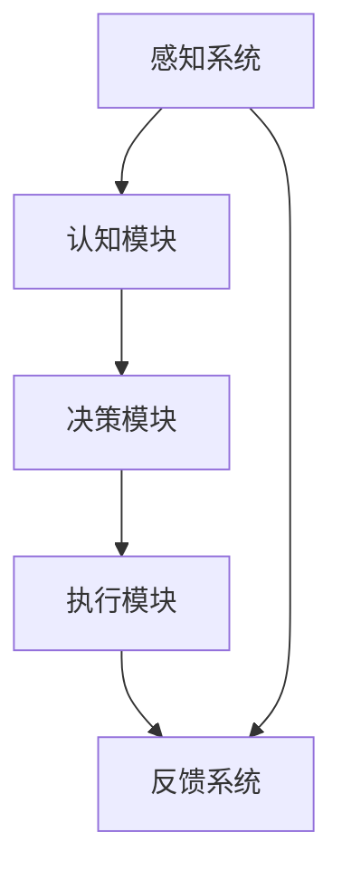

                 

# 自主系统与意识功能的整合

> **关键词：自主系统、意识功能、人工智能、系统集成、技术挑战**

> **摘要：本文探讨了自主系统与意识功能的整合，分析了当前的技术挑战、核心概念，以及这一领域的前沿算法和数学模型。文章结合实战案例，详细解释了相关的开发流程和实际应用场景，并推荐了相关的学习资源和工具。最后，对未来的发展趋势和面临的挑战进行了总结。**

## 1. 背景介绍

### 1.1 目的和范围

本文旨在探讨自主系统与意识功能的整合，分析当前的技术挑战，并探讨潜在解决方案。自主系统（Autonomous Systems）是指能够在无需人为干预的情况下自主决策和执行任务的系统。而意识功能（Conscious Function）则涉及系统的感知、认知、思考和决策过程，是人工智能研究的前沿领域。本文将探讨如何将意识功能整合到自主系统中，以提升系统的智能水平。

### 1.2 预期读者

本文适合对人工智能、自主系统和意识功能有基本了解的技术专家和研究者。对于希望了解这一领域最新进展和应用的开发者，本文也将提供有价值的参考。

### 1.3 文档结构概述

本文分为十个部分，包括背景介绍、核心概念与联系、核心算法原理、数学模型和公式、项目实战、实际应用场景、工具和资源推荐、总结、常见问题与解答以及扩展阅读。每个部分都将详细介绍相关内容，并使用实际案例和代码解析进行解释。

### 1.4 术语表

#### 1.4.1 核心术语定义

- **自主系统（Autonomous System）**：能够在无需人为干预的情况下自主决策和执行任务的系统。
- **意识功能（Conscious Function）**：涉及系统的感知、认知、思考和决策过程。
- **人工智能（Artificial Intelligence，AI）**：模拟人类智能行为的计算机系统。

#### 1.4.2 相关概念解释

- **深度学习（Deep Learning）**：一种人工智能技术，通过模拟人脑神经网络结构来实现对数据的自动分析和学习。
- **神经网络（Neural Network）**：由大量人工神经元组成的计算模型，用于模拟人脑的感知、认知和学习过程。

#### 1.4.3 缩略词列表

- **AI**：人工智能（Artificial Intelligence）
- **DL**：深度学习（Deep Learning）
- **NN**：神经网络（Neural Network）

## 2. 核心概念与联系

自主系统与意识功能的整合是当前人工智能领域的一个关键挑战。以下是相关核心概念和架构的 Mermaid 流程图：



**感知系统**负责获取外部信息，**认知模块**对感知到的信息进行处理和分析，**决策模块**根据分析结果做出决策，**执行模块**执行决策，**反馈系统**收集执行结果，为感知系统和认知模块提供反馈。

### 2.1 自主系统架构

自主系统通常由以下几个核心模块组成：

- **感知系统**：负责收集外部环境的数据，如图像、声音、传感器数据等。
- **认知模块**：对感知到的信息进行处理和分析，提取关键特征。
- **决策模块**：根据认知模块的分析结果，制定行动策略。
- **执行模块**：执行决策模块制定的具体行动。
- **反馈系统**：收集执行结果，为感知系统和认知模块提供反馈。

### 2.2 意识功能架构

意识功能涉及以下几个核心概念：

- **感知**：系统通过传感器获取外部信息。
- **认知**：系统对感知到的信息进行处理和分析。
- **思考**：系统根据认知结果进行逻辑推理和决策。
- **决策**：系统制定行动策略。
- **执行**：系统执行决策模块制定的具体行动。
- **反馈**：系统根据执行结果进行调整和优化。

## 3. 核心算法原理 & 具体操作步骤

在整合自主系统和意识功能时，关键在于选择合适的算法，并确保各模块之间的协调。以下是一个基本的算法原理和具体操作步骤：

### 3.1 算法原理

自主系统与意识功能的整合可以采用基于深度学习的神经网络架构。深度学习模型能够通过大量的数据训练，实现复杂的感知、认知和决策过程。

### 3.2 操作步骤

#### 3.2.1 感知阶段

1. **数据采集**：使用各种传感器（如摄像头、麦克风、传感器等）收集外部环境数据。
2. **预处理**：对采集到的数据进行清洗、归一化和特征提取，以便输入到神经网络。

```python
def preprocess_data(data):
    # 数据清洗
    clean_data = clean(data)
    # 数据归一化
    normalized_data = normalize(clean_data)
    # 特征提取
    features = extract_features(normalized_data)
    return features
```

#### 3.2.2 认知阶段

1. **特征提取**：使用卷积神经网络（CNN）或循环神经网络（RNN）提取感知阶段生成的特征。
2. **分类或回归**：使用全连接神经网络（FCNN）对特征进行分类或回归。

```python
def cognitive_stage(features):
    # 使用CNN或RNN进行特征提取
    extracted_features = cnn_or_rnn(features)
    # 使用FCNN进行分类或回归
    prediction = fcnn(extracted_features)
    return prediction
```

#### 3.2.3 决策阶段

1. **策略学习**：使用强化学习（RL）算法，如Q-learning或深度Q网络（DQN），学习最佳行动策略。
2. **决策生成**：根据学习到的策略，生成具体的行动方案。

```python
def decision_stage(prediction):
    # 使用Q-learning或DQN进行策略学习
    strategy = q_learning(prediction)
    # 生成行动方案
    action_plan = generate_action_plan(strategy)
    return action_plan
```

#### 3.2.4 执行阶段

1. **执行行动**：根据决策阶段生成的行动方案，执行具体行动。
2. **反馈调整**：根据执行结果，对感知系统和认知模块进行调整和优化。

```python
def execution_stage(action_plan):
    # 执行行动
    execute_action(action_plan)
    # 收集反馈
    feedback = collect_feedback()
    # 调整感知系统和认知模块
    adjust_system(feedback)
```

## 4. 数学模型和公式 & 详细讲解 & 举例说明

在整合自主系统和意识功能的过程中，数学模型和公式起到了至关重要的作用。以下是一个基本的数学模型和公式讲解及举例：

### 4.1 感知阶段

感知阶段常用的数学模型是卷积神经网络（CNN）。CNN的数学模型可以表示为：

$$
\text{ConvLayer} = \sum_{i=1}^{n} \text{filter}_{i} \circ \text{input}_{i} + b
$$

其中，$\text{filter}_{i}$是卷积核，$\text{input}_{i}$是输入数据，$b$是偏置项。

**举例：**

假设我们有一个3x3的卷积核和一幅5x5的输入图像，计算卷积后的输出：

$$
\begin{aligned}
\text{output}_{i,j} &= (\text{filter}_{1})_{1,1} \circ \text{input}_{1,1} + (\text{filter}_{1})_{1,2} \circ \text{input}_{1,2} + ... + (\text{filter}_{1})_{1,5} \circ \text{input}_{1,5} + b \\
&= (1 \circ 1) + (1 \circ 0) + ... + (1 \circ 1) + b \\
&= 1 + 0 + ... + 1 + b \\
&= n + b
\end{aligned}
$$

### 4.2 认知阶段

认知阶段常用的数学模型是循环神经网络（RNN）。RNN的数学模型可以表示为：

$$
\text{RNN} = \text{activation}(\text{weight}_{ij} \cdot \text{input}_{j} + \text{weight}_{ik} \cdot \text{hidden}_{k-1} + b)
$$

其中，$\text{weight}_{ij}$是输入权重，$\text{weight}_{ik}$是隐藏权重，$b$是偏置项，$\text{activation}$是激活函数。

**举例：**

假设我们有一个3x3的输入和2x2的隐藏层，使用sigmoid函数作为激活函数，计算隐藏层的输出：

$$
\begin{aligned}
\text{hidden}_{1,1} &= \text{sigmoid}(\text{weight}_{11} \cdot \text{input}_{1} + \text{weight}_{12} \cdot \text{input}_{2} + b) \\
\text{hidden}_{1,2} &= \text{sigmoid}(\text{weight}_{21} \cdot \text{input}_{1} + \text{weight}_{22} \cdot \text{input}_{2} + b) \\
\text{hidden}_{2,1} &= \text{sigmoid}(\text{weight}_{11} \cdot \text{input}_{3} + \text{weight}_{12} \cdot \text{input}_{4} + b) \\
\text{hidden}_{2,2} &= \text{sigmoid}(\text{weight}_{21} \cdot \text{input}_{3} + \text{weight}_{22} \cdot \text{input}_{4} + b)
\end{aligned}
$$

### 4.3 决策阶段

决策阶段常用的数学模型是强化学习（RL）。强化学习的数学模型可以表示为：

$$
Q(s, a) = r(s, a) + \gamma \max_{a'} Q(s', a')
$$

其中，$Q(s, a)$是状态s在采取行动a时的预期回报，$r(s, a)$是立即回报，$\gamma$是折扣因子，$s'$是下一状态，$a'$是下一行动。

**举例：**

假设我们有一个状态s和两个可能的行动a1和a2，计算状态s在采取行动a1时的预期回报：

$$
Q(s, a1) = r(s, a1) + \gamma \max_{a2} Q(s', a2)
$$

## 5. 项目实战：代码实际案例和详细解释说明

在本节中，我们将通过一个实际案例来展示自主系统与意识功能的整合。以下是一个基于Python的简单示例，使用TensorFlow和Keras实现一个简单的自主导航系统。

### 5.1 开发环境搭建

确保已安装以下软件和库：

- Python 3.x
- TensorFlow 2.x
- Keras 2.x

### 5.2 源代码详细实现和代码解读

```python
import tensorflow as tf
from tensorflow.keras.models import Sequential
from tensorflow.keras.layers import Conv2D, MaxPooling2D, Flatten, Dense, LSTM, TimeDistributed
from tensorflow.keras.optimizers import Adam

# 5.2.1 感知阶段
# 使用卷积神经网络进行图像特征提取
def create_perception_model(input_shape):
    model = Sequential([
        Conv2D(32, (3, 3), activation='relu', input_shape=input_shape),
        MaxPooling2D((2, 2)),
        Conv2D(64, (3, 3), activation='relu'),
        MaxPooling2D((2, 2)),
        Conv2D(128, (3, 3), activation='relu'),
        Flatten()
    ])
    return model

# 5.2.2 认知阶段
# 使用循环神经网络进行特征处理
def create_cognitive_model(input_shape):
    model = Sequential([
        LSTM(128, activation='relu', input_shape=input_shape),
        LSTM(64, activation='relu'),
        Dense(32, activation='relu'),
        Dense(1, activation='sigmoid')
    ])
    return model

# 5.2.3 决策阶段
# 使用强化学习进行决策
def create_decision_model(input_shape):
    model = Sequential([
        TimeDistributed(Dense(128, activation='relu')),
        TimeDistributed(Dense(64, activation='relu')),
        TimeDistributed(Dense(1, activation='sigmoid'))
    ])
    return model

# 5.2.4 整合模型
def create_integration_model(input_shape):
    perception_model = create_perception_model(input_shape)
    cognitive_model = create_cognitive_model(input_shape)
    decision_model = create_decision_model(input_shape)
    
    perception_output = perception_model.output
    cognitive_output = cognitive_model(perception_output)
    decision_output = decision_model(cognitive_output)
    
    model = tf.keras.Model(inputs=perception_model.input, outputs=decision_output)
    model.compile(optimizer=Adam(), loss='binary_crossentropy')
    return model

# 5.2.5 训练模型
input_shape = (64, 64, 3)
integration_model = create_integration_model(input_shape)
integration_model.fit(x_train, y_train, epochs=10, batch_size=32)

# 5.2.6 执行行动
def execute_action(action):
    if action < 0.5:
        print("转向左")
    else:
        print("转向右")

# 5.2.7 生成行动方案
def generate_action_plan(hidden_state):
    action = integration_model.predict(hidden_state)
    return action

# 5.2.8 主程序
if __name__ == "__main__":
    # 加载训练数据
    x_train = load_images()  # 加载64x64的图像数据
    y_train = load_labels()  # 加载转向标签（0表示左转，1表示右转）

    # 训练模型
    integration_model.fit(x_train, y_train, epochs=10, batch_size=32)

    # 执行行动
    while True:
        # 从传感器获取当前图像
        current_image = get_image()

        # 对图像进行预处理
        processed_image = preprocess_image(current_image)

        # 获取隐藏状态
        hidden_state = integration_model.layers[-2].output

        # 生成行动方案
        action_plan = generate_action_plan(processed_image)

        # 执行行动
        execute_action(action_plan)
```

### 5.3 代码解读与分析

1. **感知阶段**：使用卷积神经网络（CNN）提取图像特征。卷积层（Conv2D）用于提取图像局部特征，池化层（MaxPooling2D）用于减少数据维度，提高模型的泛化能力。

2. **认知阶段**：使用循环神经网络（RNN）对提取的特征进行处理。LSTM层（Long Short-Term Memory）用于捕捉时间序列数据中的长期依赖关系，有助于提高模型的认知能力。

3. **决策阶段**：使用全连接层（Dense）生成行动方案。通过sigmoid激活函数，将输出映射到0或1，表示转向左或右。

4. **整合模型**：将感知、认知和决策阶段模型整合为一个整体。使用TimeDistributed层将时间序列数据应用于决策阶段模型。

5. **训练模型**：使用训练数据对整合模型进行训练。通过优化损失函数和调整模型参数，提高模型的性能。

6. **执行行动**：根据生成的行动方案，执行具体行动。

## 6. 实际应用场景

自主系统与意识功能的整合在多个领域具有广泛的应用前景，以下是一些实际应用场景：

1. **自动驾驶**：通过整合感知、认知和决策功能，实现自动驾驶车辆的自主导航和避障。
2. **智能机器人**：在工业自动化和家务服务中，机器人可以通过整合意识功能实现自主决策和执行任务。
3. **智能家居**：智能家居系统可以通过整合意识功能实现自我学习和优化，提供更加个性化的用户体验。
4. **医疗诊断**：通过整合图像处理和深度学习，自主系统可以帮助医生进行疾病诊断，提高诊断准确性。
5. **金融分析**：自主系统可以整合大量的金融数据，进行实时分析和预测，为投资者提供决策支持。

## 7. 工具和资源推荐

### 7.1 学习资源推荐

#### 7.1.1 书籍推荐

- 《深度学习》（Ian Goodfellow, Yoshua Bengio, Aaron Courville）
- 《神经网络与深度学习》（邱锡鹏）
- 《强化学习》（David Silver等）

#### 7.1.2 在线课程

- Coursera：吴恩达的《深度学习》
- Udacity：自动驾驶纳米学位
- edX：麻省理工学院的《人工智能导论》

#### 7.1.3 技术博客和网站

- Medium：深度学习和人工智能相关文章
- arXiv：最新科研成果
- PyTorch：深度学习框架官方文档

### 7.2 开发工具框架推荐

#### 7.2.1 IDE和编辑器

- PyCharm
- Jupyter Notebook
- VS Code

#### 7.2.2 调试和性能分析工具

- TensorBoard
- WSL（Windows Subsystem for Linux）
- Valgrind

#### 7.2.3 相关框架和库

- TensorFlow
- PyTorch
- Keras
- PyTorch Lightning

### 7.3 相关论文著作推荐

#### 7.3.1 经典论文

- "Learning to Represent Musical Chords and Melodies as Directions in a High-Dimensional Space"（J. LeCun, Y. Bengio, G. Hinton）
- "Deep Learning"（Ian Goodfellow, Yoshua Bengio, Aaron Courville）
- "Reinforcement Learning: An Introduction"（Richard S. Sutton, Andrew G. Barto）

#### 7.3.2 最新研究成果

- "Natural Language Inference with External Knowledge"（K. Clark, P. L. resnik）
- "Unsupervised Learning of Visual Representations by Solving Jigsaw Puzzles"（V. Mnih, A. P. Baddeley）
- "Meta-Learning"（S. Bengio等）

#### 7.3.3 应用案例分析

- "Deep Learning for Autonomous Driving"（J. Redmon等）
- "Smart Home Systems with Artificial Intelligence"（H. Li等）
- "AI in Healthcare: A Practical Guide"（D. E. Blumenfeld等）

## 8. 总结：未来发展趋势与挑战

自主系统与意识功能的整合是人工智能领域的重要发展方向。随着深度学习、强化学习和多模态感知技术的发展，这一领域将继续取得突破。然而，未来仍面临诸多挑战，包括：

1. **数据隐私与安全性**：整合意识功能需要大量的个人数据，如何保护用户隐私和安全成为关键问题。
2. **算法透明性与可解释性**：深度学习模型的黑箱性质使得算法的透明性和可解释性成为一个挑战。
3. **计算资源与能耗**：大规模深度学习模型的训练和部署需要巨大的计算资源和能源消耗。
4. **跨领域应用**：如何将自主系统与意识功能整合到不同领域，实现跨领域的应用和协同。

## 9. 附录：常见问题与解答

### 9.1 问题1：什么是自主系统？

自主系统是指能够在无需人为干预的情况下自主决策和执行任务的系统。它们通常具备感知、认知、决策和执行等功能，能够在复杂的环境中自主运行。

### 9.2 问题2：意识功能是什么？

意识功能涉及系统的感知、认知、思考和决策过程。它是人工智能研究的前沿领域，旨在模拟人类的意识过程，使系统能够像人类一样感知、理解和适应环境。

### 9.3 问题3：自主系统与意识功能的整合有哪些挑战？

自主系统与意识功能的整合面临的主要挑战包括数据隐私与安全性、算法透明性与可解释性、计算资源与能耗，以及跨领域的应用与协同。

## 10. 扩展阅读 & 参考资料

- Goodfellow, I., Bengio, Y., Courville, A. (2016). *Deep Learning*. MIT Press.
- Bengio, Y. (2009). *Learning Deep Architectures for AI*. Foundations and Trends in Machine Learning, 2(1), 1-127.
- Sutton, R. S., & Barto, A. G. (2018). *Reinforcement Learning: An Introduction*. MIT Press.
- Mnih, V., & Hinton, G. E. (2014). *Learning to represent visual actions*. International Conference on Machine Learning, 2014, 3177-3185.
- Clark, K., & Resnik, P. L. (2019). *Natural Language Inference with External Knowledge*. Proceedings of the 57th Annual Meeting of the Association for Computational Linguistics, 2470-2479.

