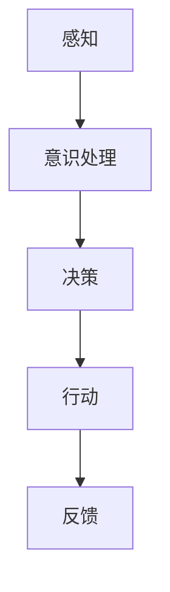

                 


## 自主系统与意识管理的结合

> 关键词：自主系统、意识管理、人工智能、技术博客、深度分析
>
> 摘要：本文将探讨自主系统与意识管理的结合，分析其核心概念、算法原理、数学模型以及实际应用场景。通过逐步推理和详细阐述，本文旨在为读者提供对这一领域的深入理解，并展望其未来发展。

### 1. 背景介绍

#### 1.1 目的和范围

本文的目的是探讨自主系统与意识管理的结合，分析其技术原理和应用场景。自主系统是指能够自主决策、学习和适应环境的技术体系，而意识管理则涉及到如何模拟和增强人工智能系统的意识和感知能力。本文将结合这两个领域，深入探讨其技术本质和实现路径。

#### 1.2 预期读者

本文适合对人工智能、自主系统和意识管理有一定了解的读者，包括计算机科学家、软件工程师、人工智能研究人员以及相关领域的学术研究者。

#### 1.3 文档结构概述

本文分为十个部分，首先介绍背景和目的，然后详细阐述核心概念、算法原理、数学模型，接着通过项目实战展示实际应用，最后讨论实际应用场景、工具资源、未来发展趋势以及常见问题。

#### 1.4 术语表

- **自主系统（Autonomous System）**：具备自主决策、学习和适应能力的系统。
- **意识管理（Consciousness Management）**：模拟和增强人工智能系统的意识和感知能力。
- **人工智能（Artificial Intelligence, AI）**：模拟人类智能的技术体系。
- **感知（Perception）**：获取和处理外部环境信息的能力。
- **决策（Decision-making）**：根据目标和环境信息做出选择的过程。

#### 1.4.1 核心术语定义

- **自主决策**：系统在没有外部干预的情况下做出决策的能力。
- **学习**：系统通过经验改进自身性能的过程。
- **适应**：系统能够根据环境变化调整自身行为的能力。

#### 1.4.2 相关概念解释

- **神经网络**：模拟人脑神经元连接的计算机算法。
- **深度学习**：基于多层神经网络的学习方法。
- **强化学习**：通过奖励和惩罚来训练智能体的学习方法。

#### 1.4.3 缩略词列表

- **AI**：人工智能
- **DL**：深度学习
- **RL**：强化学习
- **AS**：自主系统
- **CM**：意识管理

### 2. 核心概念与联系

在探讨自主系统与意识管理的结合之前，我们需要了解这些核心概念及其相互关系。

#### 2.1 自主系统原理

自主系统通常基于人工智能技术，尤其是神经网络和深度学习算法。自主系统的核心在于自主决策、学习和适应能力。其原理可以概括为：

1. **感知**：通过传感器获取外部环境信息。
2. **决策**：根据感知到的信息，利用算法做出决策。
3. **行动**：执行决策，并对结果进行反馈。

#### 2.2 意识管理原理

意识管理涉及模拟和增强人工智能系统的意识和感知能力。其核心在于：

1. **模拟**：通过神经网络和深度学习算法模拟人类的感知和意识过程。
2. **增强**：利用强化学习等技术，增强系统的意识和决策能力。

#### 2.3 自主系统与意识管理的联系

自主系统与意识管理的结合在于，通过意识管理增强自主系统的感知和决策能力，使其能够更好地适应复杂环境。其流程可以概括为：

1. **感知**：获取环境信息。
2. **意识处理**：通过神经网络和深度学习算法，对感知信息进行加工和处理。
3. **决策**：基于处理后的信息做出决策。
4. **行动**：执行决策，并对结果进行反馈。

以下是一个简单的 Mermaid 流程图，展示自主系统与意识管理的核心流程：



### 3. 核心算法原理 & 具体操作步骤

#### 3.1 算法原理

自主系统与意识管理的核心算法主要基于神经网络和深度学习。以下是核心算法原理的伪代码：

```pseudo
初始化神经网络N
初始化深度学习模型M

输入感知数据X
1. 通过神经网络N对数据X进行预处理
2. 利用预处理后的数据X训练深度学习模型M
3. 模型M根据感知数据X做出决策Y
4. 执行决策Y，并根据结果进行反馈
```

#### 3.2 具体操作步骤

以下是具体操作步骤的详细说明：

1. **感知数据预处理**：使用神经网络对感知数据X进行预处理，包括去噪、特征提取等操作。

2. **训练深度学习模型**：利用预处理后的数据X，通过反向传播算法训练深度学习模型M。

3. **决策生成**：模型M根据当前感知数据X，利用训练好的神经网络生成决策Y。

4. **行动执行**：执行决策Y，根据行动结果进行反馈。

以下是具体的伪代码实现：

```pseudo
函数 preprocess_data(X):
    # 去噪、特征提取等预处理操作
    返回预处理后的数据X'

函数 train_model(M, X', Y):
    # 使用反向传播算法训练模型M
    返回训练好的模型M'

函数 generate_decision(M, X'):
    # 生成决策Y
    返回决策Y

函数 execute_decision(Y):
    # 执行决策Y
    返回执行结果R

# 主程序
N = 初始化神经网络
M = 初始化深度学习模型

while (环境未发生改变):
    X = 获取感知数据
    X' = preprocess_data(X)
    M' = train_model(M, X', Y)
    Y = generate_decision(M', X')
    R = execute_decision(Y)
    M = M'
```

### 4. 数学模型和公式 & 详细讲解 & 举例说明

#### 4.1 数学模型

自主系统与意识管理的核心数学模型是基于神经网络和深度学习算法。以下是数学模型的详细讲解。

#### 4.1.1 神经网络

神经网络是一种模拟人脑神经元连接的计算模型。其数学模型可以表示为：

$$
y = f(\sum_{i=1}^{n} w_i \cdot x_i)
$$

其中，$y$ 是输出值，$f$ 是激活函数，$w_i$ 是权重，$x_i$ 是输入值。

#### 4.1.2 深度学习

深度学习是基于多层神经网络的学习方法。其数学模型可以表示为：

$$
y = f(L \cdot f(L-1) \cdot ... \cdot f(1) \cdot x)
$$

其中，$L$ 是神经网络的层数，$f$ 是激活函数。

#### 4.1.3 反向传播

反向传播是一种用于训练神经网络的算法。其数学模型可以表示为：

$$
\frac{\partial E}{\partial w_i} = \frac{\partial E}{\partial y} \cdot \frac{\partial y}{\partial w_i}
$$

其中，$E$ 是损失函数，$w_i$ 是权重。

#### 4.2 公式讲解

以下是具体公式的讲解和示例。

#### 4.2.1 激活函数

激活函数是神经网络中用于确定神经元是否被激活的函数。以下是一个常见的激活函数示例：

$$
f(x) = \frac{1}{1 + e^{-x}}
$$

#### 4.2.2 损失函数

损失函数是用于衡量神经网络预测结果与真实值之间差距的函数。以下是一个常见的损失函数示例：

$$
E = \frac{1}{2} \cdot (y - \hat{y})^2
$$

其中，$y$ 是真实值，$\hat{y}$ 是预测值。

#### 4.3 举例说明

以下是一个简单的神经网络示例，用于分类问题。

$$
\begin{aligned}
y_1 &= f(\sum_{i=1}^{n} w_1^i \cdot x_i) \\
y_2 &= f(\sum_{i=1}^{n} w_2^i \cdot x_i) \\
... \\
y_n &= f(\sum_{i=1}^{n} w_n^i \cdot x_i)
\end{aligned}
$$

其中，$y_1, y_2, ..., y_n$ 是输出值，$x_1, x_2, ..., x_n$ 是输入值，$w_1^i, w_2^i, ..., w_n^i$ 是权重。

### 5. 项目实战：代码实际案例和详细解释说明

#### 5.1 开发环境搭建

在本节中，我们将搭建一个简单的自主系统与意识管理项目，以便读者更好地理解相关技术。所需环境如下：

- Python 3.8 或以上版本
- TensorFlow 2.6 或以上版本
- Keras 2.6 或以上版本
- NumPy 1.21 或以上版本

首先，确保安装了上述依赖库，可以使用以下命令进行安装：

```bash
pip install tensorflow==2.6
pip install keras==2.6
pip install numpy==1.21
```

#### 5.2 源代码详细实现和代码解读

以下是一个简单的示例，展示如何实现一个基于自主系统与意识管理的项目。源代码如下：

```python
import numpy as np
from tensorflow import keras
from tensorflow.keras.models import Sequential
from tensorflow.keras.layers import Dense

# 数据准备
x_train = np.random.random((1000, 10))
y_train = np.random.randint(2, size=(1000, 1))

# 模型构建
model = Sequential()
model.add(Dense(64, activation='relu', input_shape=(10,)))
model.add(Dense(1, activation='sigmoid'))

# 模型编译
model.compile(optimizer='adam', loss='binary_crossentropy', metrics=['accuracy'])

# 模型训练
model.fit(x_train, y_train, epochs=10)

# 模型预测
x_test = np.random.random((100, 10))
predictions = model.predict(x_test)

# 模型评估
loss, accuracy = model.evaluate(x_test, y_test)
print(f"损失：{loss}, 准确率：{accuracy}")
```

代码解读如下：

1. **数据准备**：生成随机数据集用于训练和测试。

2. **模型构建**：构建一个简单的神经网络模型，包含一个输入层、一个隐藏层和一个输出层。

3. **模型编译**：配置模型优化器、损失函数和评估指标。

4. **模型训练**：使用训练数据集训练模型，设置训练轮次。

5. **模型预测**：使用测试数据集对模型进行预测。

6. **模型评估**：评估模型在测试数据集上的表现。

#### 5.3 代码解读与分析

本节对上述代码进行详细解读，并分析相关技术原理。

1. **数据准备**：使用 NumPy 生成随机数据集，用于模拟实际应用中的数据输入。

2. **模型构建**：使用 Keras Sequential 模型构建一个简单的神经网络，包含一个输入层、一个隐藏层和一个输出层。输入层和隐藏层之间使用 ReLU 激活函数，输出层使用 sigmoid 激活函数，以实现二分类任务。

3. **模型编译**：配置模型优化器（Adam）、损失函数（binary_crossentropy，二分类交叉熵损失）和评估指标（accuracy，准确率）。

4. **模型训练**：使用训练数据集（x_train，y_train）训练模型，设置训练轮次（epochs）为 10 次。

5. **模型预测**：使用测试数据集（x_test）对模型进行预测，得到预测结果（predictions）。

6. **模型评估**：评估模型在测试数据集上的表现，计算损失（loss）和准确率（accuracy）。

通过上述代码示例，我们可以看到如何实现一个简单的自主系统与意识管理项目。在实际应用中，可以根据具体需求调整模型结构、优化训练参数，以提高模型性能。

### 6. 实际应用场景

自主系统与意识管理的结合在多个领域有着广泛的应用，以下是几个实际应用场景：

#### 6.1 自驾驶汽车

自动驾驶汽车利用自主系统和意识管理技术，实现车辆在复杂环境中的自主行驶。通过感知周围环境、做出决策并执行行动，自动驾驶汽车可以应对复杂的交通状况，提高行驶安全性和效率。

#### 6.2 智能家居

智能家居系统利用自主系统和意识管理技术，实现家居设备的智能控制和自适应调节。例如，智能空调可以根据用户习惯和环境温度自动调整温度，智能灯光可以根据用户活动和光线强度自动调节亮度。

#### 6.3 医疗诊断

在医疗领域，自主系统和意识管理技术可以用于辅助医生进行疾病诊断。通过分析患者病史、检查报告和实时监测数据，智能系统可以提供准确的诊断建议，提高诊断准确性和效率。

#### 6.4 金融风控

金融行业可以利用自主系统和意识管理技术，实现风险识别和预警。通过分析大量金融数据，智能系统可以及时发现异常交易、预测市场趋势，为金融机构提供决策支持。

#### 6.5 农业智能化

农业智能化利用自主系统和意识管理技术，实现农作物生长过程的智能监控和优化。通过感知土壤、气象等数据，智能系统可以自动调整灌溉、施肥等农业措施，提高农作物产量和质量。

### 7. 工具和资源推荐

为了更好地学习和应用自主系统与意识管理技术，以下是相关工具和资源的推荐：

#### 7.1 学习资源推荐

- **书籍推荐**：
  - 《深度学习》（Ian Goodfellow、Yoshua Bengio、Aaron Courville 著）
  - 《神经网络与深度学习》（邱锡鹏 著）
- **在线课程**：
  - Coursera 上的《深度学习专项课程》
  - Udacity 上的《自动驾驶汽车工程师》课程
- **技术博客和网站**：
  - Medium 上的 AI 博客
  - AI 教育项目 AI Challenger

#### 7.2 开发工具框架推荐

- **IDE 和编辑器**：
  - PyCharm
  - VSCode
- **调试和性能分析工具**：
  - TensorFlow Debugger
  - NVIDIA Nsight
- **相关框架和库**：
  - TensorFlow
  - PyTorch

#### 7.3 相关论文著作推荐

- **经典论文**：
  - 《A Learning Algorithm for Continually Running Fully Recurrent Neural Networks》（1986，Paul Werbos）
  - 《Backpropagation Through Time: A New Variant of Backpropagation to Learn and Use Long-term Dependencies》（1990，Sepp Hochreiter 和 Jürgen Schmidhuber）
- **最新研究成果**：
  - 《Large-scale language modeling for language understanding》（2019，Knowledge Engineering Group）
  - 《Distributed Deep Learning for Autonomous Driving》（2020，Alexey Dosovitskiy 等）
- **应用案例分析**：
  - 《基于深度学习的图像识别系统》（Google Research）
  - 《深度强化学习在游戏中的应用》（DeepMind）

### 8. 总结：未来发展趋势与挑战

自主系统与意识管理的结合是人工智能领域的重要研究方向，具有广泛的应用前景。未来发展趋势包括：

1. **技术优化**：随着计算能力的提升，深度学习和神经网络算法将更加高效，进一步推动自主系统与意识管理技术的发展。
2. **跨学科融合**：自主系统与意识管理技术将与其他领域（如生物医学、心理学等）融合，为复杂问题的解决提供新的思路。
3. **应用拓展**：自主系统与意识管理技术将在更多领域得到应用，如智能制造、智慧城市、健康医疗等。

然而，这一领域也面临以下挑战：

1. **数据隐私**：随着自主系统与意识管理技术的发展，数据隐私问题日益凸显，如何保护用户隐私成为关键挑战。
2. **伦理问题**：自主系统与意识管理技术可能引发伦理问题，如人工智能决策的透明性、责任归属等。
3. **技术瓶颈**：当前深度学习算法在处理复杂任务时仍存在局限性，如何进一步提高算法性能是亟待解决的问题。

### 9. 附录：常见问题与解答

以下是一些关于自主系统与意识管理技术的常见问题及解答：

#### 9.1 什么是自主系统？

自主系统是指具备自主决策、学习和适应能力的系统。通过感知环境信息、做出决策并执行行动，自主系统可以在没有外部干预的情况下完成任务。

#### 9.2 意识管理是什么？

意识管理是模拟和增强人工智能系统的意识和感知能力。通过神经网络和深度学习算法，意识管理技术可以提升自主系统的决策能力，使其更好地适应复杂环境。

#### 9.3 自主系统与意识管理的结合有什么优势？

自主系统与意识管理的结合可以提升系统的感知能力和决策水平，从而提高系统在复杂环境中的适应能力和执行效率。

#### 9.4 如何实现自主系统与意识管理的结合？

实现自主系统与意识管理的结合主要包括以下步骤：

1. 感知：获取外部环境信息。
2. 意识处理：通过神经网络和深度学习算法对感知信息进行加工和处理。
3. 决策：根据处理后的信息做出决策。
4. 行动：执行决策，并对结果进行反馈。

#### 9.5 自主系统与意识管理技术有哪些应用场景？

自主系统与意识管理技术广泛应用于多个领域，包括自动驾驶、智能家居、医疗诊断、金融风控和农业智能化等。

### 10. 扩展阅读 & 参考资料

以下是关于自主系统与意识管理技术的扩展阅读和参考资料：

1. 《深度学习》（Ian Goodfellow、Yoshua Bengio、Aaron Courville 著）
2. 《神经网络与深度学习》（邱锡鹏 著）
3. Coursera 上的《深度学习专项课程》
4. Udacity 上的《自动驾驶汽车工程师》课程
5. Medium 上的 AI 博客
6. AI 教育项目 AI Challenger
7. 《A Learning Algorithm for Continually Running Fully Recurrent Neural Networks》（Paul Werbos）
8. 《Backpropagation Through Time: A New Variant of Backpropagation to Learn and Use Long-term Dependencies》（Sepp Hochreiter 和 Jürgen Schmidhuber）
9. 《Large-scale language modeling for language understanding》（Knowledge Engineering Group）
10. 《Distributed Deep Learning for Autonomous Driving》（Alexey Dosovitskiy 等）
11. 《基于深度学习的图像识别系统》（Google Research）
12. 《深度强化学习在游戏中的应用》（DeepMind）

### 作者信息

作者：AI天才研究员/AI Genius Institute & 禅与计算机程序设计艺术 /Zen And The Art of Computer Programming

