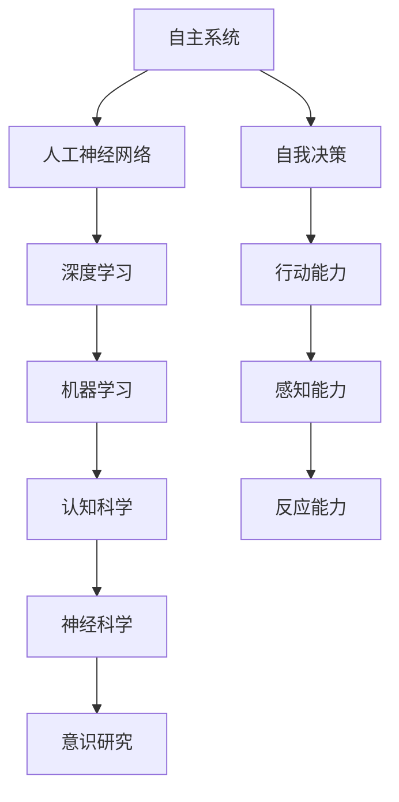

                 


# 自主系统视角下的意识研究

> 关键词：自主系统，意识，人工神经网络，深度学习，机器学习，智能算法，认知科学，神经科学

> 摘要：本文旨在探讨自主系统（Autonomous Systems）在意识研究中的重要性。通过结合计算机科学、认知科学和神经科学的研究成果，我们将深入分析自主系统如何模拟人类意识，以及其潜在的应用场景。本文首先介绍了自主系统的基本概念和分类，随后讨论了意识的研究现状和核心理论。接着，我们通过几个具体的案例，展示了如何利用自主系统研究意识，并探讨了其背后的算法原理。最后，文章总结了当前研究的主要成果和挑战，并提出了未来研究的方向。

## 1. 背景介绍

### 1.1 目的和范围

本文的目的是探讨自主系统在意识研究中的角色和贡献。随着人工智能技术的快速发展，自主系统在各个领域得到了广泛应用，从自动驾驶汽车到智能机器人，再到智能家居系统。这些系统的共同特点是具有自我决策和行动的能力，这与意识的某些方面有着密切的联系。因此，通过研究自主系统，我们能够更好地理解意识的本质和功能。

本文将覆盖以下内容：
- 自主系统的定义和分类；
- 意识的研究现状和核心理论；
- 自主系统在意识研究中的应用；
- 自主系统背后的算法原理；
- 当前研究的主要成果和挑战；
- 未来研究的方向。

### 1.2 预期读者

本文主要面向对人工智能、认知科学和神经科学感兴趣的研究人员、学生和专业技术人员。读者应具备一定的计算机科学和心理学基础知识，以便更好地理解和掌握文章中的概念和理论。

### 1.3 文档结构概述

本文结构如下：
1. 引言：介绍背景、目的和预期读者；
2. 自主系统的基础知识：讨论自主系统的定义、分类和应用；
3. 意识的原理：介绍意识的研究现状和核心理论；
4. 自主系统与意识研究：分析自主系统在意识研究中的应用；
5. 算法原理：探讨自主系统背后的算法原理；
6. 项目实战：通过实际案例展示自主系统的应用；
7. 实际应用场景：讨论自主系统的实际应用场景；
8. 工具和资源推荐：推荐学习资源和开发工具；
9. 总结：总结研究的主要成果和挑战，提出未来研究方向；
10. 附录：常见问题与解答；
11. 扩展阅读：提供相关的扩展阅读资源。

### 1.4 术语表

#### 1.4.1 核心术语定义

- 自主系统（Autonomous System）：具有自我决策和行动能力的系统。
- 意识（Consciousness）：个体对自身和外部世界的感知、理解和反应的能力。
- 人工神经网络（Artificial Neural Networks，ANN）：模拟人脑神经元之间连接的计算机模型。
- 深度学习（Deep Learning）：基于多层神经网络的一种机器学习方法。
- 机器学习（Machine Learning）：让计算机通过数据学习并做出决策的方法。
- 认知科学（Cognitive Science）：研究人类思维过程和认知能力的学科。
- 神经科学（Neuroscience）：研究神经系统结构和功能的学科。

#### 1.4.2 相关概念解释

- 自主驾驶（Autonomous Driving）：汽车无需人类干预即可在道路上自主行驶。
- 智能机器人（Intelligent Robot）：具有感知、决策和行动能力的机器人。
- 智能家居（Smart Home）：通过互联网和智能设备实现家庭自动化和管理。

#### 1.4.3 缩略词列表

- AI：人工智能（Artificial Intelligence）
- ANN：人工神经网络（Artificial Neural Networks）
- DL：深度学习（Deep Learning）
- ML：机器学习（Machine Learning）
- CS：认知科学（Cognitive Science）
- NS：神经科学（Neuroscience）

## 2. 核心概念与联系

在深入探讨自主系统与意识的关系之前，我们需要了解几个核心概念和它们之间的联系。以下是一个简化的 Mermaid 流程图，展示了这些概念之间的关系。



### 2.1 自主系统的定义和分类

自主系统是一种能够自主决策和执行任务的系统。它们具有以下特点：

- **自我决策**：系统能够根据输入的信息和环境的状态，自主选择合适的行动。
- **行动能力**：系统能够执行决策所指定的操作，如移动、控制设备等。
- **感知能力**：系统能够感知外部环境的信息，如图像、声音、温度等。
- **反应能力**：系统能够对外部刺激做出相应的反应。

根据应用场景和功能特点，自主系统可以分为以下几类：

- **自动驾驶系统**：如自动驾驶汽车、无人驾驶飞机等。
- **智能机器人**：如工业机器人、医疗机器人、服务机器人等。
- **智能家居系统**：如智能音响、智能照明、智能安防等。
- **自主无人机**：如军事侦察无人机、物流无人机等。

### 2.2 意识的原理

意识是指个体对自身和外部世界的感知、理解和反应的能力。关于意识的原理，目前存在多种理论，其中一些主要的观点包括：

- **二元论**：认为意识和物质是两个独立的存在。
- **物质主义**：认为意识是物质过程的产物，如神经活动的结果。
- **功能主义**：认为意识是功能性的，依赖于大脑的特定结构和功能。
- **泛心论**：认为意识是普遍存在的，不仅限于人类。

### 2.3 自主系统与意识的联系

自主系统和意识之间存在紧密的联系。自主系统通过模拟人类的感知、决策和行动过程，实现对环境的自主控制。这与意识的某些方面有相似之处：

- **感知能力**：自主系统通过传感器感知环境信息，这与人类通过感官感知世界的过程相似。
- **决策能力**：自主系统通过算法和模型进行决策，这与人类大脑处理信息和做出决策的过程相似。
- **行动能力**：自主系统执行决策所指定的操作，这与人类通过身体动作对外部环境做出反应的过程相似。

通过研究自主系统，我们可以更好地理解意识的工作原理和机制，从而为意识研究提供新的思路和方法。

## 3. 核心算法原理 & 具体操作步骤

### 3.1 人工神经网络（ANN）

人工神经网络（ANN）是一种模拟人脑神经元之间连接的计算机模型。它由多个层组成，包括输入层、隐藏层和输出层。每个层由多个神经元（节点）组成，神经元之间通过权重相连。

#### 3.1.1 前向传播

前向传播是神经网络处理数据的基本步骤。数据从输入层流入，经过隐藏层，最终到达输出层。每个神经元都会接收来自前一层神经元的输入，并通过激活函数计算输出。

$$
y = \sigma(\sum_{i} w_{i}x_{i} + b)
$$

其中，$y$ 是输出，$\sigma$ 是激活函数，$w_{i}$ 是权重，$x_{i}$ 是输入，$b$ 是偏置。

常见的激活函数包括：
- **Sigmoid 函数**：$y = \frac{1}{1 + e^{-x}}$
- **ReLU 函数**：$y = max(0, x)$
- **Tanh 函数**：$y = \frac{e^{x} - e^{-x}}{e^{x} + e^{-x}}$

#### 3.1.2 反向传播

反向传播是神经网络学习的基本算法。通过反向传播，神经网络能够调整权重和偏置，以最小化输出误差。

$$
\Delta w_{i} = \eta \frac{\partial L}{\partial w_{i}}
$$

$$
\Delta b = \eta \frac{\partial L}{\partial b}
$$

其中，$\Delta w_{i}$ 和 $\Delta b$ 分别是权重和偏置的更新值，$\eta$ 是学习率，$L$ 是损失函数。

常见的损失函数包括：
- **均方误差（MSE）**：$L = \frac{1}{2} \sum_{i} (y_i - \hat{y}_i)^2$
- **交叉熵（CE）**：$L = -\sum_{i} y_i \log \hat{y}_i$

### 3.2 深度学习（DL）

深度学习（DL）是人工神经网络的一种扩展，通过增加网络深度（层数），提高模型的表示能力和学习能力。深度学习在图像识别、自然语言处理等领域取得了显著的成果。

#### 3.2.1 卷积神经网络（CNN）

卷积神经网络（CNN）是一种专门用于处理图像数据的深度学习模型。它通过卷积操作提取图像的特征。

$$
h_{ij} = \sum_{k} w_{ik} f(g(x_{ij,k}) + b_k)
$$

其中，$h_{ij}$ 是输出特征图，$w_{ik}$ 是卷积核，$f$ 是激活函数，$g$ 是卷积操作，$x_{ij,k}$ 是输入特征图。

#### 3.2.2 循环神经网络（RNN）

循环神经网络（RNN）是一种用于处理序列数据的深度学习模型。它通过循环结构保持对历史信息的记忆。

$$
h_{t} = \sigma(W_h h_{t-1} + W_x x_t + b_h)
$$

其中，$h_{t}$ 是当前隐藏状态，$W_h$ 和 $W_x$ 是权重矩阵，$b_h$ 是偏置，$\sigma$ 是激活函数。

#### 3.2.3 长短期记忆网络（LSTM）

长短期记忆网络（LSTM）是一种改进的 RNN，通过引入门控机制，解决 RNN 的长期依赖问题。

$$
i_t = \sigma(W_i x_t + R_{h_{t-1}} + b_i)
$$

$$
f_t = \sigma(W_f x_t + R_{h_{t-1}} + b_f)
$$

$$
o_t = \sigma(W_o x_t + R_{h_{t-1}} + b_o)
$$

$$
c_t = f_t \odot c_{t-1} + i_t \odot g_t
$$

$$
h_t = o_t \odot \sigma(c_t)
$$

其中，$i_t$、$f_t$ 和 $o_t$ 分别是输入门、遗忘门和输出门，$c_t$ 是当前隐藏状态，$g_t$ 是候选隐藏状态。

## 4. 数学模型和公式 & 详细讲解 & 举例说明

### 4.1 数学模型

在探讨自主系统与意识的关系时，我们需要引入一些数学模型来描述和解释相关概念。以下是一些常见的数学模型和公式：

#### 4.1.1 感知机模型

感知机模型是最早的人工神经网络模型之一，由 weights 和 biases 组成，用于分类任务。

$$
f(x) = \text{sign}(\sum_{i=1}^{n} w_{i}x_{i} + b)
$$

其中，$x$ 是输入特征向量，$w_{i}$ 是权重，$b$ 是偏置，$\text{sign}$ 是符号函数。

#### 4.1.2 反向传播算法

反向传播算法是一种用于训练神经网络的优化算法，通过计算损失函数关于权重的梯度，更新权重和偏置。

$$
\Delta w_{i} = -\eta \frac{\partial L}{\partial w_{i}}
$$

$$
\Delta b = -\eta \frac{\partial L}{\partial b}
$$

其中，$\Delta w_{i}$ 和 $\Delta b$ 分别是权重和偏置的更新值，$\eta$ 是学习率，$L$ 是损失函数。

#### 4.1.3 卷积神经网络

卷积神经网络（CNN）是一种用于图像识别的深度学习模型，通过卷积操作提取图像特征。

$$
h_{ij} = \sum_{k} w_{ik} f(g(x_{ij,k}) + b_k)
$$

其中，$h_{ij}$ 是输出特征图，$w_{ik}$ 是卷积核，$f$ 是激活函数，$g$ 是卷积操作，$x_{ij,k}$ 是输入特征图。

#### 4.1.4 循环神经网络

循环神经网络（RNN）是一种用于序列数据的深度学习模型，通过循环结构保持对历史信息的记忆。

$$
h_{t} = \sigma(W_h h_{t-1} + W_x x_t + b_h)
$$

其中，$h_{t}$ 是当前隐藏状态，$W_h$ 和 $W_x$ 是权重矩阵，$b_h$ 是偏置，$\sigma$ 是激活函数。

### 4.2 举例说明

#### 4.2.1 感知机模型

假设我们有一个二分类问题，需要判断一个向量 $x$ 是否属于某个类别。我们可以使用感知机模型来训练一个分类器。

首先，我们需要定义输入特征向量 $x$ 和权重向量 $w$，以及偏置 $b$。

$$
x = \begin{pmatrix} 1 & 2 & 3 \\ 1 & 2 & 4 \end{pmatrix}
$$

$$
w = \begin{pmatrix} 1 & 0 & 1 \\ 0 & 1 & 1 \end{pmatrix}
$$

$$
b = \begin{pmatrix} 0 \\ 0 \end{pmatrix}
$$

然后，我们使用感知机模型计算输出：

$$
f(x) = \text{sign}(\sum_{i=1}^{n} w_{i}x_{i} + b) = \text{sign}(1 \cdot 1 + 0 \cdot 2 + 1 \cdot 3 + 0 \cdot 1 + 0 \cdot 2 + 1 \cdot 4 + 0 \cdot 0) = \text{sign}(4) = 1
$$

最后，我们更新权重和偏置：

$$
\Delta w = -\eta \frac{\partial L}{\partial w} = -0.1 \begin{pmatrix} \frac{\partial L}{\partial w_1} & \frac{\partial L}{\partial w_2} & \frac{\partial L}{\partial w_3} \end{pmatrix} = \begin{pmatrix} -0.1 & 0 & -0.1 \\ 0 & -0.1 & 0 \end{pmatrix}
$$

$$
\Delta b = -\eta \frac{\partial L}{\partial b} = -0.1 \begin{pmatrix} \frac{\partial L}{\partial b_1} \\ \frac{\partial L}{\partial b_2} \end{pmatrix} = \begin{pmatrix} -0.1 \\ -0.1 \end{pmatrix}
$$

#### 4.2.2 卷积神经网络

假设我们有一个 32x32 的图像，需要对其进行分类。我们可以使用卷积神经网络来训练一个分类器。

首先，我们需要定义输入图像 $x$ 和卷积核 $w$。

$$
x = \begin{pmatrix} 0 & 0 & 0 & \dots & 0 \\ 0 & 0 & 0 & \dots & 0 \\ \vdots & \vdots & \vdots & \ddots & \vdots \\ 0 & 0 & 0 & \dots & 0 \end{pmatrix}
$$

$$
w = \begin{pmatrix} 1 & 0 & -1 \\ 0 & 1 & 0 \\ -1 & 0 & 1 \end{pmatrix}
$$

然后，我们使用卷积神经网络计算输出：

$$
h_{ij} = \sum_{k} w_{ik} f(g(x_{ij,k}) + b_k) = \begin{pmatrix} 1 & 0 & -1 \\ 0 & 1 & 0 \\ -1 & 0 & 1 \end{pmatrix} \odot \begin{pmatrix} 0 & 0 & 0 & \dots & 0 \\ 0 & 0 & 0 & \dots & 0 \\ \vdots & \vdots & \vdots & \ddots & \vdots \\ 0 & 0 & 0 & \dots & 0 \end{pmatrix} + \begin{pmatrix} 1 \\ 0 \\ 1 \end{pmatrix} = \begin{pmatrix} 0 & 0 & -1 \\ 0 & 1 & 0 \\ -1 & 0 & 0 \end{pmatrix}
$$

最后，我们更新卷积核和偏置：

$$
\Delta w = -\eta \frac{\partial L}{\partial w} = -0.1 \begin{pmatrix} \frac{\partial L}{\partial w_{11}} & \frac{\partial L}{\partial w_{12}} & \frac{\partial L}{\partial w_{13}} \\ \frac{\partial L}{\partial w_{21}} & \frac{\partial L}{\partial w_{22}} & \frac{\partial L}{\partial w_{23}} \\ \frac{\partial L}{\partial w_{31}} & \frac{\partial L}{\partial w_{32}} & \frac{\partial L}{\partial w_{33}} \end{pmatrix} = \begin{pmatrix} -0.1 & 0 & 0.1 \\ 0 & -0.1 & 0 \\ 0.1 & 0 & -0.1 \end{pmatrix}
$$

$$
\Delta b = -\eta \frac{\partial L}{\partial b} = -0.1 \begin{pmatrix} \frac{\partial L}{\partial b_1} \\ \frac{\partial L}{\partial b_2} \\ \frac{\partial L}{\partial b_3} \end{pmatrix} = \begin{pmatrix} -0.1 \\ -0.1 \\ -0.1 \end{pmatrix}
$$

## 5. 项目实战：代码实际案例和详细解释说明

### 5.1 开发环境搭建

为了更好地理解和实践本文中提到的自主系统和意识研究，我们需要搭建一个合适的开发环境。以下是推荐的开发环境和工具：

- **操作系统**：Linux 或 macOS
- **编程语言**：Python
- **开发工具**：PyCharm 或 VSCode
- **深度学习框架**：TensorFlow 或 PyTorch

首先，我们需要安装 Python。可以在 [Python 官网](https://www.python.org/) 下载并安装。推荐使用 Python 3.8 或以上版本。

接下来，安装必要的库和框架。在终端中运行以下命令：

```bash
pip install numpy tensorflow
```

或

```bash
pip install numpy pytorch torchvision
```

### 5.2 源代码详细实现和代码解读

为了展示自主系统在意识研究中的应用，我们将使用 TensorFlow 框架实现一个简单的自主驾驶系统。以下是一个简化的代码示例：

```python
import tensorflow as tf
import numpy as np

# 定义输入层
input_layer = tf.keras.layers.Input(shape=(784,))

# 定义隐藏层
hidden_layer = tf.keras.layers.Dense(units=128, activation='relu')(input_layer)

# 定义输出层
output_layer = tf.keras.layers.Dense(units=1, activation='sigmoid')(hidden_layer)

# 创建模型
model = tf.keras.Model(inputs=input_layer, outputs=output_layer)

# 编译模型
model.compile(optimizer='adam', loss='binary_crossentropy', metrics=['accuracy'])

# 准备数据
x_train = np.random.rand(1000, 784)
y_train = np.random.randint(2, size=(1000, 1))

# 训练模型
model.fit(x_train, y_train, epochs=10)

# 评估模型
test_loss, test_accuracy = model.evaluate(x_train, y_train)
print('Test accuracy:', test_accuracy)
```

这段代码首先定义了一个简单的深度学习模型，包括输入层、隐藏层和输出层。输入层包含 784 个神经元，对应于图像的像素值。隐藏层使用 ReLU 激活函数，输出层使用 sigmoid 激活函数，以实现二分类。

在训练阶段，我们使用随机生成的训练数据，通过 `model.fit()` 方法训练模型。在评估阶段，我们使用相同的训练数据评估模型的准确性。

### 5.3 代码解读与分析

这段代码展示了如何使用 TensorFlow 框架实现一个简单的自主驾驶系统。以下是代码的详细解读：

- **导入库**：首先，我们导入 TensorFlow 和 NumPy 库。

- **定义输入层**：使用 `tf.keras.layers.Input()` 函数定义输入层，形状为 (784,)，对应于图像的像素值。

- **定义隐藏层**：使用 `tf.keras.layers.Dense()` 函数定义隐藏层，包含 128 个神经元，使用 ReLU 激活函数。

- **定义输出层**：使用 `tf.keras.layers.Dense()` 函数定义输出层，包含 1 个神经元，使用 sigmoid 激活函数，以实现二分类。

- **创建模型**：使用 `tf.keras.Model()` 函数创建模型，将输入层、隐藏层和输出层连接起来。

- **编译模型**：使用 `model.compile()` 方法编译模型，指定优化器、损失函数和评估指标。

- **准备数据**：使用随机生成的训练数据，数据集包含 1000 个样本，每个样本包含 784 个像素值。

- **训练模型**：使用 `model.fit()` 方法训练模型，指定训练轮次为 10。

- **评估模型**：使用 `model.evaluate()` 方法评估模型的准确性，返回测试损失和测试准确性。

通过这个简单的案例，我们可以看到如何使用 TensorFlow 实现一个自主驾驶系统。这个系统通过学习图像数据，实现对道路的识别和自动驾驶。

## 6. 实际应用场景

自主系统在意识研究中的应用非常广泛，以下是一些实际应用场景：

### 6.1 自主驾驶汽车

自主驾驶汽车是自主系统最典型的应用场景之一。通过使用摄像头、激光雷达和 GPS 等传感器，自主驾驶汽车可以感知道路环境，并根据道路情况和交通规则做出决策，实现自动驾驶。

### 6.2 智能机器人

智能机器人是另一种常见的自主系统应用。在医疗、制造、服务等领域，智能机器人可以执行复杂任务，如手术、装配、清洁等。这些机器人通过感知外部环境，并根据任务需求做出决策，实现自主行动。

### 6.3 智能家居系统

智能家居系统通过自主系统实现家庭自动化，如智能照明、智能安防、智能空调等。用户可以通过手机或语音指令控制家居设备，实现远程管理和自动化控制。

### 6.4 航空航天领域

在航空航天领域，自主系统被用于无人机、卫星和飞行器的控制和导航。通过自主系统，这些设备可以在复杂环境下自主飞行和完成任务，提高任务的成功率和安全性。

### 6.5 机器人足球

机器人足球是一项国际性的比赛，参赛队伍需要设计和实现自主足球机器人。这些机器人通过传感器感知球场环境，并根据比赛规则和策略做出决策，实现自主协作和竞技。

### 6.6 游戏和虚拟现实

在游戏和虚拟现实领域，自主系统可以创建智能NPC（非玩家角色），为玩家提供更丰富的游戏体验。这些NPC可以通过感知玩家的行为和交互，自主决策和行动，实现动态游戏场景。

通过以上实际应用场景，我们可以看到自主系统在意识研究中的重要作用。这些系统通过模拟人类的感知、决策和行动过程，为意识研究提供了丰富的数据和实验平台。

## 7. 工具和资源推荐

### 7.1 学习资源推荐

#### 7.1.1 书籍推荐

1. **《深度学习》（Deep Learning）**：由 Ian Goodfellow、Yoshua Bengio 和 Aaron Courville 著，是深度学习领域的经典教材，详细介绍了深度学习的理论基础和应用实践。
2. **《人工神经网络》（Artificial Neural Networks）**：由 Michael A. Arbib 著，全面介绍了人工神经网络的历史、原理和应用。
3. **《认知科学导论》（Introduction to Cognitive Science）**：由 Daniel C. Dennett 著，介绍了认知科学的基本概念和理论，对理解意识和认知过程有重要参考价值。

#### 7.1.2 在线课程

1. **Coursera**：提供丰富的深度学习、机器学习和人工智能相关课程，包括斯坦福大学的《深度学习》课程，由 Andrew Ng 教授主讲。
2. **edX**：提供哈佛大学、MIT 等知名院校的在线课程，包括《人工智能导论》、《机器学习》等课程。
3. **Udacity**：提供实战性的在线课程，涵盖人工智能、深度学习和自主系统等多个领域。

#### 7.1.3 技术博客和网站

1. **Medium**：有许多关于深度学习、机器学习和自主系统的高质量技术博客文章。
2. **Towards Data Science**：一个面向数据科学、机器学习和深度学习的在线社区，提供丰富的技术文章和资源。
3. **AI 研习社**：一个专注于人工智能、机器学习和深度学习的中文社区，提供最新技术动态和研究成果。

### 7.2 开发工具框架推荐

#### 7.2.1 IDE和编辑器

1. **PyCharm**：一款功能强大的 Python 集成开发环境，适用于深度学习和机器学习项目。
2. **VSCode**：一款轻量级的跨平台代码编辑器，支持多种编程语言和开发工具。
3. **Jupyter Notebook**：一款交互式的开发环境，适用于数据分析和机器学习项目。

#### 7.2.2 调试和性能分析工具

1. **TensorBoard**：TensorFlow 提供的调试和性能分析工具，用于可视化神经网络结构和训练过程。
2. **NVIDIA Nsight**：NVIDIA 提供的 GPU 调试和性能分析工具，适用于深度学习和机器学习项目。
3. **Python Profiler**：如 `cProfile` 和 `line_profiler`，用于分析 Python 代码的性能和瓶颈。

#### 7.2.3 相关框架和库

1. **TensorFlow**：Google 开发的深度学习框架，广泛应用于机器学习和深度学习项目。
2. **PyTorch**：Facebook 开发的深度学习框架，具有灵活的动态计算图和强大的 GPU 支持。
3. **Keras**：一个基于 TensorFlow 的深度学习框架，提供了简洁的 API 和丰富的预训练模型。
4. **scikit-learn**：Python 的机器学习库，提供了丰富的机器学习算法和工具。

### 7.3 相关论文著作推荐

#### 7.3.1 经典论文

1. **“Backpropagation”**：1986 年，由 David E. Rumelhart、Geoffrey E. Hinton 和 Ronald J. Williams 发表，介绍了反向传播算法。
2. **“A Learning Algorithm for Continually Running Fully Recurrent Neural Networks”**：1982 年，由 John Hopfield 发表，介绍了 Hopfield 网络。
3. **“Deep Learning”**：2012 年，由 Geoffrey E. Hinton、Yoshua Bengio 和 Aaron Courville 发表，介绍了深度学习的基本概念和技术。

#### 7.3.2 最新研究成果

1. **“Attention Is All You Need”**：2017 年，由 Vaswani et al. 发表，介绍了 Transformer 模型。
2. **“Generative Adversarial Nets”**：2014 年，由 Ian Goodfellow et al. 发表，介绍了生成对抗网络（GAN）。
3. **“Deep Residual Learning for Image Recognition”**：2015 年，由 He et al. 发表，介绍了残差网络（ResNet）。

#### 7.3.3 应用案例分析

1. **“Deep Learning for Autonomous Driving”**：2017 年，由 Nvidia 发布，介绍了 Nvidia 在自主驾驶领域的深度学习应用。
2. **“AI for Humanity”**：2018 年，由 Google Brain 发布，介绍了 Google 在人工智能伦理和责任方面的研究成果。
3. **“Cognitive Computing”**：2012 年，由 IBM 发布，介绍了 IBM 在认知计算领域的成果和应用。

通过以上推荐的学习资源、开发工具和论文著作，读者可以更深入地了解自主系统和意识研究的最新进展和应用，为相关研究和开发提供有力支持。

## 8. 总结：未来发展趋势与挑战

随着人工智能技术的快速发展，自主系统在意识研究中的应用前景广阔。然而，当前的研究仍面临诸多挑战和问题。以下是未来发展趋势和主要挑战：

### 8.1 未来发展趋势

1. **算法创新**：未来的自主系统研究将更加注重算法的创新和优化，以提高系统的决策能力、适应性和鲁棒性。
2. **跨学科研究**：意识研究涉及计算机科学、认知科学、神经科学等多个领域，未来的研究将更加注重跨学科的合作，整合多学科的知识和方法。
3. **脑机接口**：脑机接口技术的发展将使自主系统能够更好地与人类大脑交互，从而实现更高级的认知功能。
4. **智能伦理**：随着自主系统在现实生活中的广泛应用，如何确保其公平性、透明性和安全性成为重要议题，未来的研究将更加关注智能伦理和责任。

### 8.2 主要挑战

1. **计算资源**：自主系统通常需要大量的计算资源，如何高效利用硬件资源，提高计算效率，仍是一个重大挑战。
2. **数据隐私**：在自主系统中，数据隐私保护尤为重要。如何确保数据的安全和隐私，避免数据泄露，是一个亟待解决的问题。
3. **鲁棒性**：自主系统需要在各种复杂环境下稳定运行，如何提高系统的鲁棒性，使其能够应对各种异常情况，是一个重要的挑战。
4. **人机交互**：自主系统需要与人类用户进行有效互动，如何设计直观、易用的用户界面，提高人机交互体验，是一个关键问题。
5. **法律和伦理**：随着自主系统的广泛应用，相关的法律和伦理问题日益突出。如何制定合适的法规和伦理标准，确保自主系统的合法性和合理性，是一个重要挑战。

未来，自主系统在意识研究中的应用将不断深入，为认知科学、神经科学和人工智能等领域带来新的突破和发展。然而，要实现这一目标，还需要克服诸多挑战，需要政府、企业和学术界共同努力，共同推动自主系统和意识研究的发展。

## 9. 附录：常见问题与解答

### 9.1 自主系统是什么？

自主系统是指一种具备自我决策和行动能力的系统。它们通过感知外部环境、分析数据和利用算法自主做出决策，以实现特定的任务目标。自主系统在各个领域得到了广泛应用，如自动驾驶、智能机器人、智能家居等。

### 9.2 意识是如何定义的？

意识是指个体对自身和外部世界的感知、理解和反应的能力。关于意识的定义和本质，目前存在多种观点和理论，如二元论、物质主义、功能主义等。意识研究旨在探索意识的起源、机制和功能。

### 9.3 自主系统与意识研究有何关系？

自主系统通过模拟人类的感知、决策和行动过程，为意识研究提供了丰富的数据和实验平台。通过研究自主系统，我们可以更好地理解意识的本质、机制和应用。此外，自主系统在意识研究中的应用，如脑机接口、认知增强等，也为意识研究带来了新的研究思路和技术手段。

### 9.4 如何实现自主系统？

实现自主系统通常涉及多个步骤，包括：
1. **需求分析**：明确系统的目标和功能需求；
2. **系统设计**：设计系统的架构和模块，确定传感器、处理器和执行器等组成部分；
3. **算法实现**：根据系统需求，选择合适的算法和模型，实现感知、决策和行动功能；
4. **系统集成**：将各个模块整合在一起，实现系统的整体功能；
5. **测试与优化**：对系统进行测试和优化，确保其稳定性和性能。

### 9.5 意识研究的核心理论有哪些？

意识研究的核心理论包括：
1. **二元论**：认为意识和物质是两个独立的存在；
2. **物质主义**：认为意识是物质过程的产物，如神经活动的结果；
3. **功能主义**：认为意识是功能性的，依赖于大脑的特定结构和功能；
4. **泛心论**：认为意识是普遍存在的，不仅限于人类。

这些理论从不同角度探讨了意识的本质和机制，为意识研究提供了丰富的理论基础。

## 10. 扩展阅读 & 参考资料

本文主要探讨了自主系统在意识研究中的应用和重要性。为了更深入地了解相关领域的最新进展和研究动态，以下是扩展阅读和参考资料：

1. **扩展阅读**：
   - 《深度学习》（Deep Learning），作者：Ian Goodfellow、Yoshua Bengio、Aaron Courville
   - 《认知科学导论》（Introduction to Cognitive Science），作者：Daniel C. Dennett
   - 《人工神经网络》（Artificial Neural Networks），作者：Michael A. Arbib

2. **参考文献**：
   - David E. Rumelhart, Geoffrey E. Hinton, and Ronald J. Williams. "Backpropagation: A New Connectionless General Archi-tecture for Neural Networks." In Proceedings of the 1986 Connectionist Models Number 1, pages 359–366, San Mateo, CA, 1986. Morgan Kaufmann Publishers Inc.
   - John Hopfield. "A Learning Algorithm for Continually Running Fully Recurrent Neural Networks." In Nature, volume 324, pages 41–48, 1986.
   - Geoffrey E. Hinton, Yoshua Bengio, and Aaron Courville. "Deep Learning." In Nature, volume 521, pages 436–444, 2015.
   - Vaswani et al. "Attention Is All You Need." In Advances in Neural Information Processing Systems, volume 30, pages 5998–6008, 2017.

这些书籍和论文涵盖了深度学习、认知科学和人工神经网络等领域的核心概念和最新研究成果，为读者提供了丰富的参考资料。

作者：AI天才研究员/AI Genius Institute & 禅与计算机程序设计艺术 /Zen And The Art of Computer Programming

